# Kubernetes — коли Docker Compose більше не вистачає

## П'ятниця, 23:47. Дзвінок від клієнта

Уявіть: ваш застосунок працює у production вже три місяці. Ви з командою налаштували Docker Compose зі стеком ASP.NET Core + PostgreSQL + Redis, розгорнули все на одному сервері, і система справно обслуговує кількасот користувачів на день. Усе добре.

Але в п'ятницю ввечері щось іде не так. Сервер втрачає з'єднання з мережею. Контейнери зупиняються. Усі три компоненти застосунку — API, база даних і кеш — недоступні одночасно. Клієнт телефонує: «Сайт не працює». Ви підключаєтесь до сервера, вручну перезапускаєте контейнери, чекаєте, поки PostgreSQL пройде ініціалізацію. Через 12 хвилин система відновлює роботу.

А тепер запитання: **чи можна було уникнути цих 12 хвилин простою?** Чи міг би застосунок відновитися сам, без вашого втручання? Чи міг би він автоматично перемкнутися на інший сервер, поки перший недоступний?

Відповідь — **так**. Але Docker Compose на це не здатний.

::note
Ця стаття завершує цикл Docker і відкриває новий — Kubernetes. Якщо ви ще не знайомі з Docker, контейнерами та Docker Compose, рекомендуємо спочатку опрацювати відповідний розділ курсу, починаючи зі статті «Контейнеризація — від проблеми до рішення».
::

---

## Як усе працювало до Kubernetes (Підводимо до болю)

**Типова архітектура додатку:** Зазвичай додаток складається з Frontend (веб- чи мобільний інтерфейс) та Backend, де працюють різні сервіси (наприклад, сервіс авторизації, маркетплейс, сервіс сповіщень) та база даних.

### Проблема №1: Відсутність відмовостійкості

Якщо всі сервіси розмістити на одному сервері, то у разі його падіння весь додаток перестає працювати. Це призводить до простоїв, втрати грошей та репутації.

::plant-uml
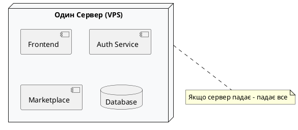
::

**Часткове рішення:** Сервіси розподіляють по кількох різних серверах або віртуальних машинах.

### Проблема №2: Ручне балансування

Щоб розподіляти навантаження між цими серверами, ставлять балансувальник трафіку. Але в ньому доводиться вручну прописувати IP-адреси та порти всіх серверів, щоб він знав, куди перенаправляти користувачів.

::mermaid
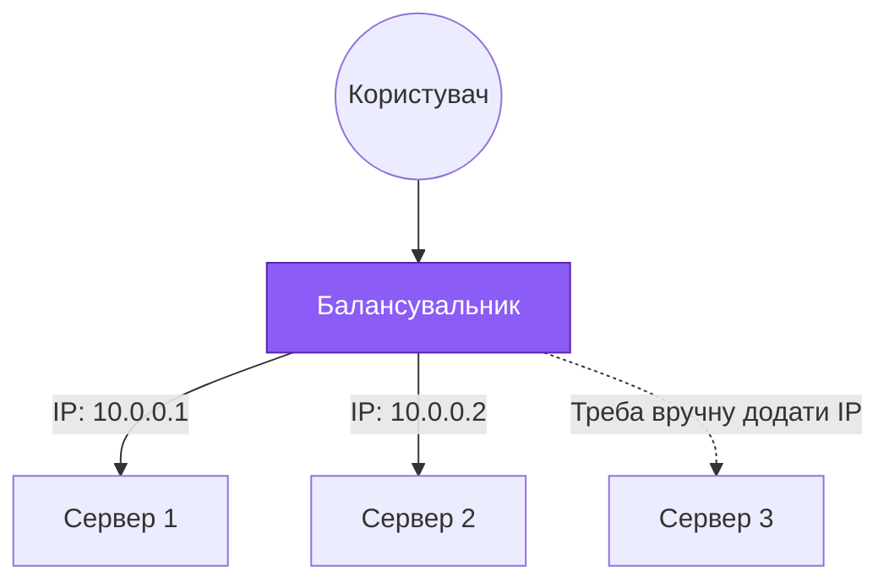
::

::plant-uml
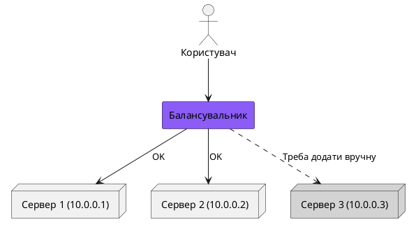
::

### Проблема №3: Складність масштабування

Коли навантаження зростає, потрібно додати новий екземпляр сервісу. Це робиться руками: розробник заходить на сервер, розгортає додаток і знову вручну прописує в балансувальнику, щоб туди йшло, наприклад, 20% трафіку.

### Проблема №4: Падіння сервісів (Downtime)

Якщо один із серверів "згорає" або стається витік пам'яті, балансувальник цього не розуміє і продовжує слати туди запити. Сервіси самі не відновлюються — потрібно знову йти на сервер руками і перезапускати їх, поки користувачі страждають від затримок.

::mermaid
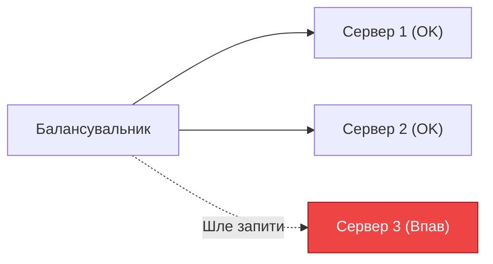
::

::plant-uml
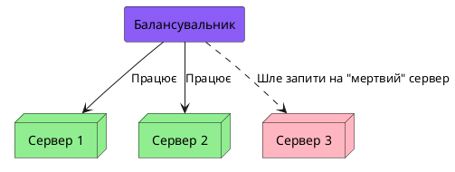
::

### Проблема №5: Оновлення та відкати (Rollbacks)

Щоб випустити нову фічу без зупинки всього додатку, доводиться по черзі вимикати один сервіс, оновлювати його, перевіряти, і тільки потім переходити до інших. А якщо в новому коді критична помилка — доводиться так само вручну та по черзі вбивати і перезапускати стару версію.

::note
**Проміжний висновок для студентів:** У невеликих компаніях так ще можна працювати, але у великих проєктах керувати цією інфраструктурою вручну просто неможливо.
::

---

## Що не так з Docker Compose у production?

Docker Compose — чудовий інструмент. Він вирішує реальну проблему: дозволяє описати multi-container застосунок у одному файлі та керувати ним однією командою. Для локальної розробки, для невеликих проєктів, для CI/CD pipelines — він справляється відмінно.

Але Docker Compose має фундаментальне обмеження, яке випливає з його природи: він **оркеструє контейнери на одному хості**. Один файл `docker-compose.yml`, один сервер, один Docker-демон.

Розглянемо конкретні проблеми, з якими стикаються команди, коли їхній застосунок переростає single-host підхід.

### Проблема 1: Відсутність автовідновлення (no self-healing)

Коли контейнер аварійно завершується у Docker Compose, поведінка залежить від параметру `restart`. Але якщо **сам хост** стає недоступним — через збій мережі, перегрів, відключення живлення — Compose нічого не може зробити. Він сам є частиною цього хоста.

```yaml
# docker-compose.yml
services:
    api:
        image: myapp:latest
        restart:
            on-failure # перезапускає контейнер при падінні процесу
            # але безсилий, якщо впав сам сервер
```

У Kubernetes, якщо вузол (сервер) стає недоступним, система **автоматично** перенесе Podʼи (контейнери) на інший вузол кластера. Без вашого втручання. Без дзвінків о 23:47.

{.diagram-img}
::mermaid

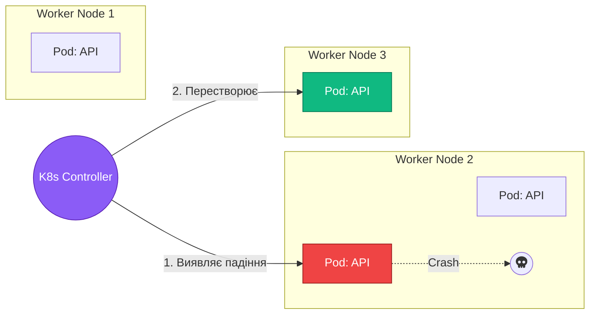

::

::plant-uml
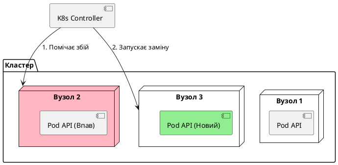
::

### Проблема 2: Ручне масштабування

У статті про Docker Compose ми розглядали команду `--scale`:

::terminal-preview{title="Масштабування у Docker Compose" :cursor="true"}

<div class="line"><span class="opacity-40">$</span> <strong class="font-bold">docker compose up --scale api=3 -d</strong></div>
<div class="line"><span class="text-blue-400 font-bold">Container myapp-api-1</span>  Running</div>
<div class="line"><span class="text-blue-400 font-bold">Container myapp-api-2</span>  Started</div>
<div class="line"><span class="text-blue-400 font-bold">Container myapp-api-3</span>  Started</div>
::

Це ручна операція. Ви самі вирішуєте, коли і скільки екземплярів запустити. Але як визначити потрібну кількість? Якщо навантаження зросте о 3 годині ночі під час акції — хто збільшить кількість реплік?

Kubernetes вирішує це через **HorizontalPodAutoscaler** (HPA) — компонент, який відстежує завантаженість CPU та памʼяті і автоматично змінює кількість реплік. Застосунок масштабується сам.

::plant-uml
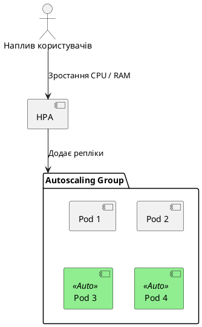
::

### Проблема 3: Обмеження одним хостом

::plant-uml
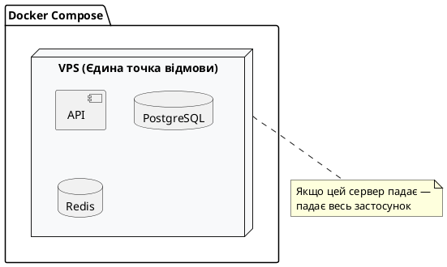
::

Docker Compose передбачає, що всі сервіси розміщені на одному хості. Це означає: якщо цей хост падає — падає весь застосунок. Немає резервування, немає failover, немає географічного розподілу.

Kubernetes від початку проектувався для роботи на **кластері з кількох серверів** (вузлів). Сервіс може мати репліки на різних вузлах, і якщо один вузол виходить з ладу — репліки на інших продовжують обробляти запити.

### Проблема 4: Відсутність rolling updates без downtime

Щоб оновити версію застосунку у Docker Compose, потрібно:

::terminal-preview{title="Оновлення у Docker Compose" :cursor="true"}

<div class="line"><span class="opacity-40">$</span> <strong class="font-bold">docker compose pull</strong></div>
<div class="line"><span class="opacity-40">$</span> <strong class="font-bold">docker compose up -d</strong></div>
<div class="line"><span class="text-yellow-400 font-bold">Recreating</span> myapp-api-1 ... <span class="text-green-400 font-bold">done</span></div>
<div class="line"><span class="opacity-40"># В цей момент виникає вікно недоступності (downtime)</span></div>
::

Між зупинкою старого і запуском нового контейнера існує **вікно недоступності**. Для production-систем навіть 5 секунд downtime — це втрачені запити та негативний досвід користувачів.

Kubernetes реалізує **Rolling Update** за замовчуванням: нові Podʼи запускаються і перевіряються перед тим, як старі зупиняються. Завжди є хоча б один працюючий екземпляр.

{.diagram-img}

::mermaid

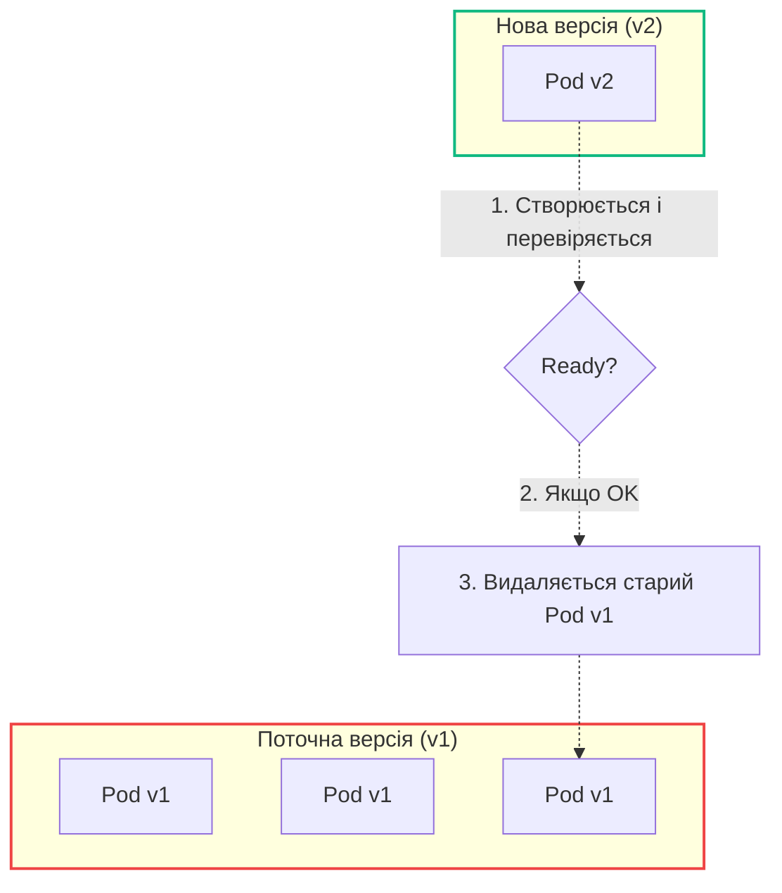

::

::plant-uml
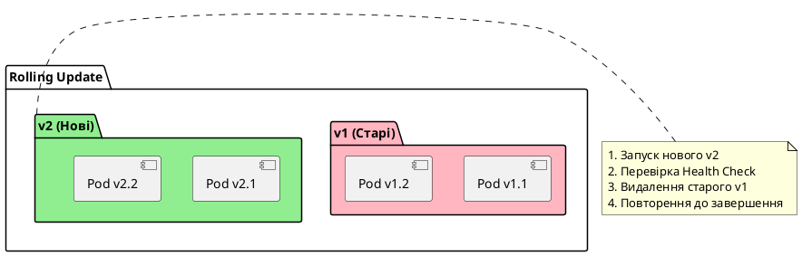
::

---

## Що таке Kubernetes?

**Kubernetes** (скорочено **K8s**, де 8 — кількість літер між «K» і «s») — це відкрита платформа для **автоматизованого розгортання, масштабування та управління контейнеризованими застосунками**.

Kubernetes був розроблений у Google на основі внутрішньої системи Borg, яка керувала мільярдами контейнерів на тисячах серверів щотижня. У 2014 році Google відкрив код Kubernetes, а у 2016 році передав проєкт під управління **Cloud Native Computing Foundation (CNCF)**.

::note
Назва «Kubernetes» походить від грецького слова «κυβερνήτης» — **кермовий**, той, хто керує судном. Скорочення K8s стало загальноприйнятим у спільноті: замість восьми літер між K і s пишуть цифру 8.
::

Офіційне визначення: Kubernetes — це **система оркестрації контейнерів** (container orchestration system). Слово «оркестрація» тут точне: як диригент оркестром, Kubernetes координує роботу десятків і сотень контейнерів на кількох серверах одночасно.

{.diagram-img}

::plant-uml
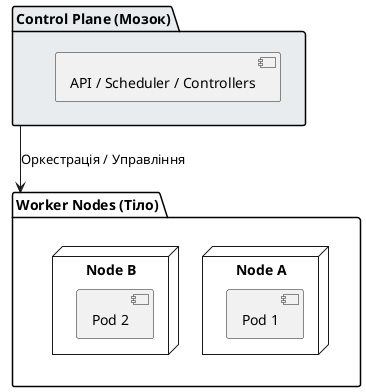
::

### Що Kubernetes робить конкретно?

::card-group

::card{title="Автоматичне розміщення" icon="i-heroicons-cpu-chip"}
Kubernetes сам вирішує, на якому вузлі кластера запустити контейнер, враховуючи доступні ресурси (CPU, пам'ять) та обмеження, які ви задали.
::

::card{title="Self-healing" icon="i-heroicons-arrow-path"}
Якщо контейнер аварійно завершується, Kubernetes автоматично його перезапускає. Якщо вузол стає недоступним — переносить контейнери на інші вузли.
::

::card{title="Горизонтальне масштабування" icon="i-heroicons-arrows-pointing-out"}
Kubernetes може автоматично збільшувати або зменшувати кількість екземплярів застосунку залежно від навантаження.
::

::card{title="Rolling updates та rollback" icon="i-heroicons-arrow-up-circle"}
Оновлення застосунку відбувається поступово, без downtime. Якщо нова версія має проблеми — один командою повертається попередня.
::

::card{title="Service discovery та балансування" icon="i-heroicons-arrows-right-left"}
Kubernetes автоматично направляє трафік між репліками, рівномірно розподіляючи навантаження. Сервіси знаходять один одного за іменем через вбудований DNS.
::

::card{title="Управління конфігурацією та секретами" icon="i-heroicons-key"}
Паролі, токени та конфігурації зберігаються окремо від образів контейнерів, що спрощує управління різними середовищами.
::

::

### Які задачі вирішує Kubernetes (Порятунок)

Щоб автоматизувати весь описаний вище хаос, на допомогу приходить Kubernetes:

::card-group

::card{title="Деплоймент (Deployment)" icon="i-heroicons-rocket-launch"}
Він автоматично піднімає нові екземпляри додатку без ручного втручання.
::

::card{title="Самовідновлення (Self-healing)" icon="i-heroicons-arrow-path"}
Інструмент безперервно стежить за станом сервісів. Якщо додаток впав, Kubernetes миттєво піднімає його заново, гарантуючи, що працює рівно стільки екземплярів, скільки було задано.
::

::card{title="Управління інфраструктурою" icon="i-heroicons-server-stack"}
Дає зручний єдиний центр для управління всіма процесами.
::

::card{title="Автоматичне масштабування" icon="i-heroicons-arrows-pointing-out"}
Якщо навантаження раптово виросло, Kubernetes сам додасть кілька нових екземплярів додатку, щоб впоратися з потоком користувачів.
::

::card{title="Балансування трафіку" icon="i-heroicons-arrows-right-left"}
Він самостійно та рівномірно розподіляє вхідні запити між усіма доступними екземплярами додатків.
::

::

### Чого Kubernetes НЕ робить (Обмеження)

Важливо пояснити межі відповідальності цього інструменту, щоб не виникало хибних очікувань:

::card-group

::card{title="Не зберігає дані" icon="i-heroicons-circle-stack"}
Управління базами даних та забезпечення збереження стану — це окрема задача, яку потрібно вирішувати іншими інструментами (хоча бази і можна запускати в ньому).
::

::card{title="Не зберігає образи додатків" icon="i-heroicons-archive-box"}
Він не замінює Docker Registry. Готові образи (наприклад, Docker-контейнери) потрібно десь зберігати і просто передавати Kubernetes на них посилання.
::

::card{title="Не збирає (не білдить) образи" icon="i-heroicons-wrench-screwdriver"}
Він працює вже з готовими запакованими додатками.
::

::card{title="Не веде журнали та метрики" icon="i-heroicons-chart-bar"}
Логування роботи додатку та налаштування метрик залишаються зоною відповідальності розробників та DevOps-інженерів.
::

::

---

## Kubernetes vs Docker Compose: порівняння

Важливо розуміти: Kubernetes **не замінює** Docker Compose повністю. Вони вирішують різні завдання на різних рівнях.

| Характеристика       | Docker Compose                 | Kubernetes                   |
| -------------------- | ------------------------------ | ---------------------------- |
| **Призначення**      | Локальна розробка, малі деплої | Production, кластери         |
| **Кількість хостів** | Один                           | Багато (кластер)             |
| **Self-healing**     | Лише перезапуск контейнера     | Перенос між вузлами          |
| **Масштабування**    | Ручне (`--scale`)              | Автоматичне (HPA)            |
| **Rolling update**   | З downtime                     | Без downtime                 |
| **Крива навчання**   | 1–2 дні                        | 2–4 тижні                    |
| **Конфігурація**     | Один YAML-файл (50–200 рядків) | Кілька YAML-маніфестів       |
| **Моніторинг**       | Відсутній                      | Вбудована інтеграція         |
| **Типовий use case** | dev-середовище, MVP            | Production з вимогами до SLA |

::tip
**Практична порада:** використовуйте Docker Compose для локальної розробки навіть тоді, коли production розгортається у Kubernetes. Compose простіший, швидший для старту і дозволяє розробникам не думати про кластер щодня. Перехід між ними — природній крок при зростанні проєкту.
::

---

## Де запускається Kubernetes?

Kubernetes можна розгорнути у різних середовищах. Розрізняють два основних підходи.

### Managed Kubernetes (хмарні провайдери)

Хмарний провайдер бере на себе управління control plane — серцем кластера. Ви платите за worker-вузли і не турбуєтесь про оновлення та відмовостійкість самого Kubernetes.

::card-group

::card{title="Google Kubernetes Engine (GKE)" icon="i-logos-google-icon"}
Оригінальна реалізація від творців Kubernetes. Вважається еталонною за рівнем автоматизації та інтеграції з Google Cloud.
::

::card{title="Amazon EKS" icon="i-logos-aws"}
Kubernetes від Amazon Web Services. Тісна інтеграція з AWS-сервісами: IAM, ALB, EBS, ECR.
::

::card{title="Azure AKS" icon="i-logos-microsoft-azure"}
Kubernetes від Microsoft. Природна інтеграція з Azure Active Directory та іншими Azure-сервісами.
::

::

### Self-hosted Kubernetes

Ви розгортаєте та керуєте кластером самостійно. Більше контролю, але більше відповідальності.

- **kubeadm** — офіційний інструмент для розгортання production-кластерів
- **k3s** — легкий дистрибутив Kubernetes від Rancher, ідеальний для edge та IoT
- **microk8s** — від Canonical (Ubuntu), простий у встановленні

Для навчання та локальної роботи існують спрощені інструменти, які розглядаються у наступній статті: **minikube**, **kind**, **Docker Desktop Kubernetes**.

---

## Резюме

Docker Compose вирішує проблему управління контейнерами на одному хості. Kubernetes вирішує проблему управління контейнерами на кластері серверів. Це не конкуруючі технології — це різні інструменти для різних завдань і різних масштабів.

Kubernetes виникає як природна відповідь на обмеження single-host оркестрації: відсутність self-healing, ручне масштабування, downtime при оновленнях та єдина точка відмови.

У наступній статті ми розглянемо **архітектуру Kubernetes** — з яких компонентів складається кластер, як вони взаємодіють між собою і яку роль відіграє кожен з них.

---

## Практичні завдання

### Рівень 1 (Базовий)

**Завдання 1.** Маєте Docker Compose стек: Nginx + Node.js API + MongoDB. Визначте три конкретних сценарії, за яких цей стек зазнає повного відмови. Для кожного сценарію вкажіть, яка саме можливість Kubernetes могла б запобігти або зменшити час відмови.

::collapsible{title="💡 Підказка до Завдання 1"}

- **Сценарій 1:** Падіння процесу Node.js (out of memory). У Compose `restart: always` допоможе, але під час рестарту будуть втрачені запити. Kubernetes може маршрутизувати трафік на інші репліки.
- **Сценарій 2:** Зависання (deadlock) Node.js. Контейнер працює, але не відповідає. Compose цього не помітить. У Kubernetes є **Liveness Probes**.
- **Сценарій 3:** Падіння самого сервера (VPS). Compose безсилий. Kubernetes з використанням кількох нод перенесе навантаження (Self-healing).
  ::

**Завдання 2.** Прочитайте таблицю порівняння Compose і Kubernetes. Оберіть три характеристики, які вважаєте найважливішими для production-застосунку з 10 000 активних користувачів. Обґрунтуйте вибір.

### Рівень 2 (Аналіз)

**Завдання 3.** Ваш стартап розробив SaaS-продукт. Зараз — 200 користувачів, Docker Compose на одному сервері. Очікується зростання до 50 000 користувачів протягом 6 місяців після публічного запуску. Складіть список конкретних вимог до інфраструктури (availability, scaling, deployment), які виникнуть при такому зростанні, та поясніть, чому кожна з них вимагає переходу на Kubernetes.

### Рівень 3 (Архітектурне мислення)

**Завдання 4.** Корпоративний замовник ставить вимогу: **99.9% uptime** (не більше 8.7 годин downtime на рік). Ваш поточний стек — Docker Compose на одному VPS. Розрахуйте, скільки годин на рік займуть планові оновлення (припустимо: 12 деплоїв на рік по 2 хвилини downtime кожен), позапланові перезапуски (5 інцидентів по 10 хвилин) та планове обслуговування сервера (2 рази на рік по 30 хвилин). Чи відповідає поточна архітектура вимозі SLA? Яка мінімальна зміна архітектури дозволила б виконати вимогу?
