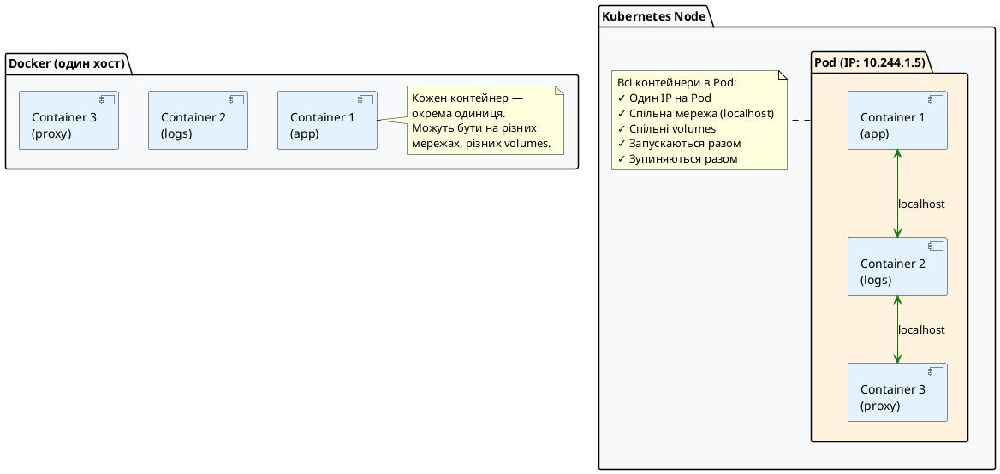
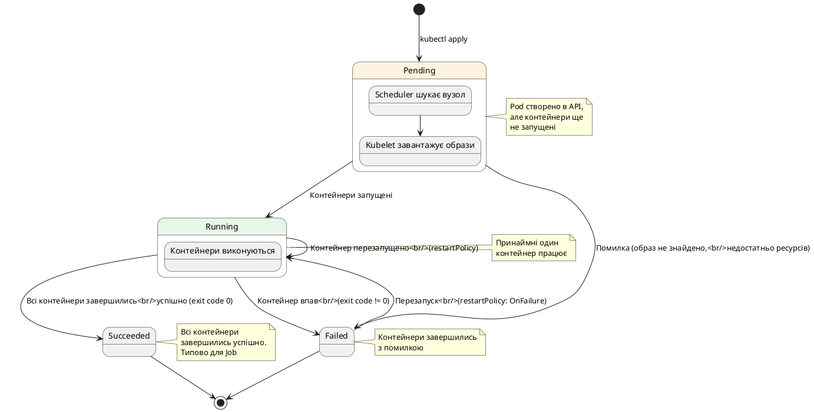
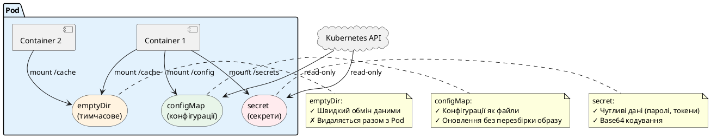

# Pod — атомарна одиниця Kubernetes

## Від контейнера до Pod

У попередніх розділах ми навчилися працювати з Docker — створювати образи, запускати контейнери, об'єднувати їх через Docker Compose. Ви вже знаєте, що контейнер — це ізольований процес з власною файловою системою, мережею та ресурсами. Але чому Kubernetes не працює з контейнерами напряму? Чому не можна просто сказати «запусти контейнер `mcr.microsoft.com/dotnet/aspnet:8.0`», як у Docker?

Щоб відповісти на це питання, потрібно зрозуміти фундаментальну проблему, яку вирішує Kubernetes: **оркестрація розподілених застосунків у production-середовищі**. У реальних системах застосунок рідко складається з одного процесу. Часто потрібні допоміжні компоненти, які працюють **поруч** з основним застосунком і тісно з ним взаємодіють.

### Проблема: коли одного контейнера недостатньо

Уявіть, що ви розгортаєте ASP.NET Core Web API у production. Окрім самого API, вам потрібно:

1. **Збирати логи** — контейнер, який читає логи з файлу та відправляє їх у централізоване сховище (Elasticsearch, Loki)
2. **Проксіювати трафік** — контейнер, який додає HTTPS, автентифікацію або моніторинг до кожного запиту
3. **Виконати міграції бази даних** — контейнер, який запускається **перед** основним застосунком і застосовує зміни до схеми бази даних

Усі ці компоненти мають працювати **разом**, на **одному сервері**, з **спільною мережею** та **спільними файлами**. Якщо основний застосунок переміститься на інший сервер — допоміжні контейнери мають переміститися разом з ним. Якщо основний застосунок зупиниться — допоміжні контейнери теж мають зупинитися.

У Docker Compose ви вирішували це через `depends_on` та спільні мережі, але це працює лише на одному хості. У розподіленому кластері Kubernetes потрібна інша абстракція — **Pod**.

### Що таке Pod: перше знайомство

**Pod** (від англ. «стручок», як стручок гороху з кількома горошинами всередині) — це **найменша розгортана одиниця** у Kubernetes. Pod може містити один або кілька контейнерів, які:

- Завжди розміщуються на одному сервері (вузлі кластера)
- Мають спільну мережу — бачать один одного через `localhost`
- Можуть мати спільні файлові системи (volumes)
- Запускаються та зупиняються разом

::note
**Ключова ідея:** Pod — це не просто обгортка над контейнером. Це **атомарна одиниця розгортання**, яка може містити кілька тісно пов'язаних контейнерів, що працюють як єдине ціле. Kubernetes керує Pod, а не окремими контейнерами.
::

### Візуалізація: Pod vs окремі контейнери

Щоб краще зрозуміти різницю, подивимося на діаграму:

::plant-uml



::

На діаграмі видно ключову різницю:

- **Docker**: Кожен контейнер — окрема одиниця. Ви керуєте ними окремо через `docker run`, `docker stop` тощо.
- **Kubernetes Pod**: Група контейнерів, які Kubernetes розглядає як **одне ціле**. Один IP, спільна мережа, синхронізований життєвий цикл.

### Навіщо це потрібно?

Розглянемо конкретний приклад. У вас є ASP.NET Core API, який пише логи у файл `/var/log/app/app.log`. Ви хочете відправляти ці логи в Elasticsearch для централізованого зберігання.

**Підхід 1: Один контейнер**
Додати бібліотеку Serilog.Sinks.Elasticsearch у ваш C# код. Але тепер ваш застосунок **залежить** від Elasticsearch — якщо Elasticsearch недоступний, застосунок може падати або працювати повільно.

**Підхід 2: Два контейнери в одному Pod**

- **Контейнер 1**: Ваш ASP.NET Core API пише логи у файл (як завжди)
- **Контейнер 2**: Fluent Bit читає цей файл через спільний volume і відправляє в Elasticsearch

Переваги:

- Ваш застосунок **не знає** про Elasticsearch
- Можна замінити Fluent Bit на інший log shipper без зміни коду
- Якщо Elasticsearch недоступний — застосунок продовжує працювати, логи просто накопичуються

Це і є суть Pod — **розділення відповідальності** між контейнерами, які працюють разом.

---

## Що таке Pod: формальне визначення

Тепер, коли ви розумієте **навіщо** потрібен Pod, давайте дамо точне визначення.

**Pod** — це найменша розгортана одиниця у Kubernetes, яка представляє один або кілька контейнерів, що:

::field-group

::field{name="Спільне розміщення" type="властивість"}
Kubernetes **ніколи** не розділить контейнери одного Pod між різними серверами (вузлами). Якщо Pod запланований на вузол `node-1`, всі його контейнери будуть на `node-1`.
::

::field{name="Спільна мережа" type="властивість"}
Всі контейнери у Pod мають **одну IP-адресу**. Вони бачать один одного через `localhost` і можуть використовувати одні й ті самі порти (але не конфліктувати між собою).
::

::field{name="Спільні volumes" type="властивість"}
Контейнери можуть монтувати одні й ті самі volumes (файлові системи) для обміну даними. Наприклад, один контейнер пише файл, інший його читає.
::

::field{name="Синхронізований життєвий цикл" type="властивість"}
Коли Pod запускається — запускаються всі його контейнери. Коли Pod зупиняється — зупиняються всі контейнери. Kubernetes керує ними як єдиним цілим.
::

::

### Спільна мережа: як це працює

Коли Kubernetes створює Pod, він насправді створює спеціальний "інфраструктурний" контейнер (pause container), який резервує мережевий namespace. Всі інші контейнери Pod приєднуються до цього namespace. Результат:

- Pod отримує одну IP-адресу з мережі кластера (наприклад, `10.244.1.5`)
- Контейнери всередині Pod спілкуються через `localhost`
- Порти, які відкриває контейнер, доступні іншим контейнерам Pod через `localhost:port`

::tip
**Практичний приклад:** Якщо у вас два контейнери в одному Pod — ASP.NET Core API на порту 5000 та Nginx на порту 80 — Nginx може проксіювати запити до API через `http://localhost:5000`. Не потрібно знати IP-адресу контейнера API, не потрібно налаштовувати Docker networks — все працює через `localhost`.
::

### Спільні volumes: обмін даними

Контейнери в Pod можуть монтувати одні й ті самі volumes. Це дозволяє їм обмінюватися файлами без мережевих запитів. Наприклад:

- **Контейнер 1** (ASP.NET Core API) пише логи у `/var/log/app/app.log`
- **Контейнер 2** (Fluent Bit) читає файл `/var/log/app/app.log` та відправляє в Elasticsearch

Обидва контейнери монтують один і той самий volume у різні шляхи своєї файлової системи. Для контейнера 1 це `/var/log/app`, для контейнера 2 — теж `/var/log/app` (або будь-який інший шлях).

---

## Анатомія Pod: структура YAML-маніфесту

Тепер, коли ви розумієте концепцію Pod, давайте навчимося описувати Pod у форматі YAML. Kubernetes використовує декларативний підхід — ви описуєте **бажаний стан** системи у YAML-файлі, а Kubernetes робить все необхідне, щоб досягти цього стану.

Ми розглянемо специфікацію Pod поступово: спочатку найпростіший приклад, потім додаватимемо поля одне за одним, пояснюючи кожне детально.

### Мінімальний Pod

Найпростіший Pod містить один контейнер. Ось мінімально необхідна конфігурація:

```yaml
apiVersion: v1
kind: Pod
metadata:
    name: simple-pod
spec:
    containers:
        - name: nginx
          image: nginx:1.27
```

Це все, що потрібно для створення Pod! Давайте розберемо кожне поле.

Версія схеми API Kubernetes, яку ви використовуєте для створення цього ресурсу.

**На що це впливає?**
Вона вказує Kubernetes, за якими правилами (схемою валідації) розпізнавати та перевіряти поля у вашому YAML-файлі. Різні версії API можуть мати різні доступні поля. Якщо вказати версію неправильно, Kubernetes видасть помилку та не зможе розпарсити маніфест.

**Аналогія з розробки:**
Це дуже схоже на версіонування у звичайних Web API. Коли ви створюєте маршрути `/api/v1/users` та `/api/v2/users`, кожен з них очікує свій формат JSON-запиту. Так само і в Kubernetes: версія вказує на конкретний «контракт» даних.

**Чому для Pod пишеться просто `v1`?**
Pod — це фундаментальний («ядерний») ресурс, який існує з першого дня створення Kubernetes. Він належить до так званої **Core API Group** (базової групи). Для цієї групи префікс опускається, тому ми вказуємо лише версію схеми — `v1`.

**Чому для Deployment пишеться `apps/v1`?**
У Kubernetes є сотні різних ресурсів. Щоб не тримати їх усі в одній величезній схемі, їх розділили на логічні **групи API** (API Groups). Загальний формат запису виглядає як `назва-групи/версія-схеми`.

- `apps` — це назва групи API, яка містить ресурси для управління робочими навантаженнями та життєвим циклом застосунків (Deployments, StatefulSets, DaemonSets).
- `v1` — це стабільна версія схеми для цієї конкретної групи.

::field-group

::field{name="apiVersion" type="string" required="true"}
Версія API Kubernetes, яку ви використовуєте. Для Pod завжди `v1` — це стабільна версія, яка існує з самого початку Kubernetes. Інші ресурси можуть мати інші версії (наприклад, `apps/v1` для Deployment).
::

::field{name="kind" type="string" required="true"}
Тип ресурсу Kubernetes. У нашому випадку — `Pod`. Kubernetes підтримує багато типів ресурсів: `Service`, `Deployment`, `ConfigMap` тощо. Поле `kind` вказує, що саме ви створюєте.
::

::field{name="metadata" type="object" required="true"}
Метадані ресурсу — інформація **про** Pod, а не про те, як він має працювати. Мінімально потрібне поле — `name`.
::

::field{name="metadata.name" type="string" required="true"}
Унікальне ім'я Pod у межах namespace. Має відповідати DNS-стандарту: малі літери, цифри, дефіси. Не може починатися або закінчуватися дефісом. Максимум 253 символи. Приклади: `my-app`, `api-server-1`, `web-frontend`.
::

::field{name="spec" type="object" required="true"}
Специфікація Pod — опис того, **як** Pod має працювати. Тут ви описуєте контейнери, volumes, мережеві налаштування тощо.
::

::field{name="spec.containers" type="array" required="true"}
Список контейнерів у Pod. Мінімум один контейнер обов'язковий. Кожен елемент масиву — це опис одного контейнера.
::

::field{name="spec.containers[].name" type="string" required="true"}
Ім'я контейнера всередині Pod. Має бути унікальним у межах Pod. Використовується для ідентифікації контейнера у командах `kubectl logs`, `kubectl exec` тощо.
::

::field{name="spec.containers[].image" type="string" required="true"}
Docker-образ для контейнера. Формат: `[registry/]repository[:tag]`. Якщо не вказано registry — використовується Docker Hub. Якщо не вказано tag — використовується `latest` (не рекомендується для production!). Приклади: `nginx:1.27`, `mcr.microsoft.com/dotnet/aspnet:8.0`, `myregistry.azurecr.io/myapp:v1.2.3`.
::

::

### Створення та перегляд Pod

Збережіть YAML у файл `simple-pod.yaml` та створіть Pod:

::terminal-preview{title="kubectl apply"}

<div class="line"><span class="opacity-40">$</span> <strong>kubectl apply -f simple-pod.yaml</strong></div>
<div class="line"><span class="text-green-400">pod/simple-pod created</span></div>
<div class="line"></div>
<div class="line"><span class="opacity-40">$</span> <strong>kubectl get pods</strong></div>
<div class="line">NAME         READY   STATUS    RESTARTS   AGE</div>
<div class="line">simple-pod   1/1     Running   0          5s</div>

::

Що означають ці колонки:

- **NAME**: Ім'я Pod (з `metadata.name`)
- **READY**: Скільки контейнерів готові / скільки всього контейнерів (`1/1` означає 1 з 1)
- **STATUS**: Поточний стан Pod (`Running`, `Pending`, `Failed` тощо)
- **RESTARTS**: Скільки разів контейнери перезапускалися
- **AGE**: Скільки часу минуло з моменту створення Pod

### Детальна інформація про Pod

Щоб побачити детальну інформацію про Pod, використовуйте `kubectl describe`:

::terminal-preview{title="kubectl describe pod"}

<div class="line"><span class="opacity-40">$</span> <strong>kubectl describe pod simple-pod</strong></div>
<div class="line">Name:             simple-pod</div>
<div class="line">Namespace:        default</div>
<div class="line">Node:             minikube/192.168.49.2</div>
<div class="line">Start Time:       Fri, 09 May 2026 19:30:00 +0000</div>
<div class="line">Status:           Running</div>
<div class="line">IP:               10.244.0.5</div>
<div class="line">Containers:</div>
<div class="line">  nginx:</div>
<div class="line">    Container ID:   containerd://abc123...</div>
<div class="line">    Image:          nginx:1.27</div>
<div class="line">    Port:           &lt;none&gt;</div>
<div class="line">    State:          Running</div>
<div class="line">      Started:      Fri, 09 May 2026 19:30:05 +0000</div>

::

Тут ви бачите:

- На якому вузлі (`Node`) запущено Pod
- IP-адресу Pod у мережі кластера
- Детальну інформацію про кожен контейнер
- Події (Events) — що відбувалося з Pod (завантаження образу, запуск контейнера тощо)

---

## Базові поля Pod: розширюємо конфігурацію

Тепер додамо типові поля, які використовуються у більшості Pod.

### Labels (мітки)

Labels — це key-value пари, які використовуються для ідентифікації та групування ресурсів. Вони критично важливі для роботи Service, Deployment та інших ресурсів Kubernetes.

```yaml
apiVersion: v1
kind: Pod
metadata:
    name: labeled-pod
    labels:
        app: myapp
        tier: backend
        environment: production
spec:
    containers:
        - name: app
          image: myapp:1.0.0
```

::field-group

::field{name="metadata.labels" type="map"}
Довільні key-value пари для ідентифікації Pod. Ключі та значення мають бути рядками. Використовуються Service для вибору Pod через селектори, Deployment для управління Pod тощо. Рекомендовані мітки: `app` (назва застосунку), `version` (версія), `tier` (рівень: frontend/backend), `environment` (dev/staging/production).
::

::

**Навіщо потрібні labels?**

Уявіть, що у вас 100 Pod різних застосунків. Як Service дізнається, до яких Pod направляти трафік? Через labels! Service має селектор `app: myapp`, і він знаходить всі Pod з такою міткою.

### Ports (порти)

Декларація портів, які контейнер відкриває:

```yaml
apiVersion: v1
kind: Pod
metadata:
    name: web-pod
spec:
    containers:
        - name: web
          image: nginx:1.27
          ports:
              - containerPort: 80
                protocol: TCP
                name: http
```

::field-group

::field{name="spec.containers[].ports" type="array"}
Список портів, які контейнер відкриває. Це **документаційне** поле — воно не відкриває порти автоматично (контейнер сам відкриває порти через свій процес). Але це поле використовується Service для маршрутизації та для документації.
::

::field{name="spec.containers[].ports[].containerPort" type="integer" required="true"}
Номер порту, який контейнер слухає. Має відповідати порту, на якому працює застосунок всередині контейнера. Наприклад, якщо ваш ASP.NET Core API слухає на порту 5000, вкажіть `containerPort: 5000`.
::

::field{name="spec.containers[].ports[].protocol" type="string"}
Протокол: `TCP` (за замовчуванням) або `UDP`. У більшості випадків використовується TCP.
::

::field{name="spec.containers[].ports[].name" type="string"}
Опціональна назва порту. Використовується Service для посилання на порт за іменем замість номера. Має бути унікальною в межах Pod. Приклади: `http`, `https`, `grpc`, `metrics`.
::

::

::warning
**Важливо:** Поле `ports` не відкриває порти назовні кластера! Воно лише документує, які порти використовує контейнер. Щоб зробити Pod доступним ззовні, потрібен Service (це тема наступних статей).
::

### Environment Variables (змінні оточення)

Змінні оточення — основний спосіб передачі конфігурації в контейнери:

```yaml
apiVersion: v1
kind: Pod
metadata:
    name: env-pod
spec:
    containers:
        - name: app
          image: myapp:1.0.0
          env:
              - name: DATABASE_URL
                value: 'postgresql://db:5432/mydb'
              - name: LOG_LEVEL
                value: 'info'
              - name: ASPNETCORE_ENVIRONMENT
                value: 'Production'
```

::field-group

::field{name="spec.containers[].env" type="array"}
Список змінних оточення для контейнера. Аналог `-e` у `docker run`. Кожен елемент масиву має поля `name` (назва змінної) та `value` (значення).
::

::field{name="spec.containers[].env[].name" type="string" required="true"}
Назва змінної оточення. Має відповідати правилам іменування змінних у вашій ОС (зазвичай великі літери, цифри, підкреслення). Приклади: `DATABASE_URL`, `API_KEY`, `PORT`.
::

::field{name="spec.containers[].env[].value" type="string"}
Значення змінної. Завжди рядок, навіть якщо це число або boolean. Контейнер отримає це значення як змінну оточення.
::

::

::tip
**Для .NET розробників:** ASP.NET Core автоматично читає змінні оточення та використовує їх для перевизначення значень з `appsettings.json`. Наприклад, змінна `ConnectionStrings__DefaultConnection` перевизначить `ConnectionStrings:DefaultConnection` у JSON (зверніть увагу на подвійне підкреслення `__` замість `:`).
::

### Resource Requests and Limits (ресурси)

Kubernetes дозволяє вказати, скільки CPU та пам'яті потрібно контейнеру:

```yaml
apiVersion: v1
kind: Pod
metadata:
    name: resource-pod
spec:
    containers:
        - name: app
          image: myapp:1.0.0
          resources:
              requests:
                  memory: '128Mi'
                  cpu: '250m'
              limits:
                  memory: '256Mi'
                  cpu: '500m'
```

::field-group

::field{name="spec.containers[].resources" type="object"}
Опис ресурсів, які потрібні контейнеру. Має два підполя: `requests` (мінімум, який гарантується) та `limits` (максимум, який контейнер може використати).
::

::field{name="spec.containers[].resources.requests" type="object"}
Мінімальна кількість ресурсів, яку Kubernetes **гарантує** контейнеру. Scheduler використовує це значення для вибору вузла — Pod буде запущено лише на вузлі, де є достатньо вільних ресурсів. Якщо не вказано — контейнер може отримати будь-яку кількість ресурсів (або зовсім нічого, якщо вузол перевантажений).
::

::field{name="spec.containers[].resources.limits" type="object"}
Максимальна кількість ресурсів, яку контейнер може використати. Якщо контейнер спробує використати більше пам'яті — він буде вбитий (OOMKilled). Якщо спробує використати більше CPU — він буде throttled (обмежений у швидкості виконання).
::

::field{name="spec.containers[].resources.requests.memory" type="string"}
Мінімальна кількість пам'яті. Формат: число + одиниця виміру. Одиниці: `Ki` (кібібайт), `Mi` (мебібайт), `Gi` (гібібайт). Це **бінарні** одиниці (1 Mi = 1024 Ki), а не десяткові. Приклади: `128Mi`, `1Gi`, `512Mi`.
::

::field{name="spec.containers[].resources.requests.cpu" type="string"}
Мінімальна кількість CPU. Формат: число або число з суфіксом `m` (міліядра). `1000m` = 1 ядро CPU. `250m` = 0.25 ядра (25% одного ядра). Можна писати як `0.25` або `250m` — це еквівалентно. Приклади: `100m`, `500m`, `1`, `2`.
::

::field{name="spec.containers[].resources.limits.memory" type="string"}
Максимальна кількість пам'яті. Формат такий самий, як у `requests.memory`. Якщо контейнер спробує виділити більше пам'яті — Kubernetes вб'є процес (OOMKilled).
::

::field{name="spec.containers[].resources.limits.cpu" type="string"}
Максимальна кількість CPU. Формат такий самий, як у `requests.cpu`. Якщо контейнер спробує використати більше CPU — він буде throttled (Linux CFS quota).
::

::

::note
**Різниця між requests та limits:**

- **Requests** — це те, що Kubernetes **гарантує**. Scheduler шукає вузол з достатньою кількістю вільних ресурсів.
- **Limits** — це те, що контейнер **не може перевищити**. Якщо перевищить пам'ять — буде вбитий. Якщо перевищить CPU — буде сповільнений.

Приклад: `requests: 128Mi, limits: 256Mi` означає "гарантуй мені 128 МБ, але дозволь використати до 256 МБ, якщо на вузлі є вільна пам'ять".
::

### Command and Args (команда запуску)

За замовчуванням Kubernetes запускає команду, вказану в Dockerfile (`ENTRYPOINT` та `CMD`). Але ви можете перевизначити її:

```yaml
apiVersion: v1
kind: Pod
metadata:
    name: command-pod
spec:
    containers:
        - name: app
          image: busybox:1.36
          command: ['sh', '-c']
          args: ['echo Hello from Kubernetes! && sleep 3600']
```

::field-group

::field{name="spec.containers[].command" type="array"}
Перевизначає `ENTRYPOINT` з Dockerfile. Це команда, яка буде виконана при старті контейнера. Формат: масив рядків. Перший елемент — виконуваний файл, решта — аргументи. Приклад: `["dotnet", "MyApp.dll"]`.
::

::field{name="spec.containers[].args" type="array"}
Перевизначає `CMD` з Dockerfile. Це аргументи, які передаються команді з `command`. Якщо `command` не вказано — `args` передаються `ENTRYPOINT` з Dockerfile. Формат: масив рядків. Приклад: `["--port", "8080", "--verbose"]`.
::

::

::tip
**Коли використовувати command vs args:**

- Якщо ви хочете **повністю змінити** команду запуску — використовуйте `command`.
- Якщо ви хочете лише **додати аргументи** до існуючої команди з Dockerfile — використовуйте `args`.
- Якщо вказано обидва — `command` стає виконуваним файлом, `args` — його аргументами.

Приклад для .NET: Dockerfile має `ENTRYPOINT ["dotnet", "MyApp.dll"]`. Ви можете додати аргументи через `args: ["--environment", "Production"]`, і контейнер запуститься як `dotnet MyApp.dll --environment Production`.
::

---

## Повний приклад: Pod з усіма базовими полями

Тепер об'єднаємо все, що ми вивчили, в один Pod:

```yaml
apiVersion: v1
kind: Pod
metadata:
    name: full-example-pod
    labels:
        app: myapp
        version: '1.0'
        tier: backend
spec:
    containers:
        - name: app
          image: mcr.microsoft.com/dotnet/samples:aspnetapp
          ports:
              - containerPort: 8080
                protocol: TCP
                name: http
          env:
              - name: ASPNETCORE_URLS
                value: 'http://+:8080'
              - name: ASPNETCORE_ENVIRONMENT
                value: 'Production'
              - name: ConnectionStrings__DefaultConnection
                value: 'Server=db;Database=mydb;User=sa;Password=YourStrong@Passw0rd'
          resources:
              requests:
                  memory: '128Mi'
                  cpu: '250m'
              limits:
                  memory: '512Mi'
                  cpu: '1000m'
          command: ['./aspnetapp']
```

Цей Pod:

- Має назву `full-example-pod` та мітки для ідентифікації
- Запускає один контейнер з готовим публічним демо-застосунком ASP.NET Core від Microsoft (`mcr.microsoft.com/dotnet/samples:aspnetapp`), який можна запустити одразу без створення власного проєкту
- Відкриває порт 8080 для HTTP-трафіку
- Налаштовує ASP.NET Core через змінні оточення (додатково передає тестовий рядок підключення)
- Гарантує 128 МБ пам'яті та 0.25 CPU, але дозволяє використати до 512 МБ та 1 CPU
- Запускає застосунок командою `./aspnetapp` (перевизначаючи стандартну команду для демонстрації роботи поля `command`)

Створіть цей Pod та перевірте його стан:

::terminal-preview{title="kubectl apply and get"}

<div class="line"><span class="opacity-40">$</span> <strong>kubectl apply -f full-example-pod.yaml</strong></div>
<div class="line"><span class="text-green-400">pod/full-example-pod created</span></div>
<div class="line"></div>
<div class="line"><span class="opacity-40">$</span> <strong>kubectl get pod full-example-pod</strong></div>
<div class="line">NAME                READY   STATUS    RESTARTS   AGE</div>
<div class="line">full-example-pod    1/1     Running   0          10s</div>

::

---

## Життєвий цикл Pod

Тепер, коли ви знаєте, як описати Pod у YAML, давайте розберемося, що відбувається з Pod від моменту створення до завершення. Розуміння життєвого циклу критично важливе для діагностики проблем та написання надійних застосунків.

### Фази Pod

Kubernetes відстежує стан Pod через поле `status.phase`. Pod проходить через кілька фаз протягом свого життя:

::plant-uml



::

Розглянемо кожну фазу детально:

::field-group

::field{name="Pending" type="фаза"}
Pod створено у API-сервері Kubernetes, але один або кілька контейнерів ще не запущені. Це включає:

- Час очікування планування (scheduler ще не призначив Pod вузлу)
- Час завантаження образів контейнерів з registry
- Час створення volumes

**Типові причини затримки в Pending:**

- Недостатньо ресурсів на вузлах (CPU, пам'ять)
- Образ контейнера завантажується (великий розмір)
- Помилка доступу до registry (неправильні credentials)

::

::field{name="Running" type="фаза"}
Pod призначено вузлу, всі контейнери створені, і **принаймні один контейнер** запущено або перезапускається. Pod може бути в стані Running, навіть якщо деякі контейнери ще стартують або перезапускаються після падіння.
::

::field{name="Succeeded" type="фаза"}
Всі контейнери у Pod успішно завершились (exit code 0) і **не будуть перезапущені**. Ця фаза типова для одноразових задач (Job) — наприклад, скрипт міграції бази даних, який виконується один раз і завершується.
::

::field{name="Failed" type="фаза"}
Всі контейнери у Pod завершились, і **принаймні один** завершився з помилкою (ненульовий exit code). Або контейнер був вбитий системою (наприклад, OOMKilled — закінчилася пам'ять).
::

::field{name="Unknown" type="фаза"}
Стан Pod не може бути визначений. Зазвичай це відбувається через втрату зв'язку з вузлом, на якому Pod виконується. Наприклад, вузол вимкнувся або втратив мережеве з'єднання з control plane.
::

::

### Стани контейнерів

Окрім фази Pod, кожен контейнер всередині Pod має власний стан. Це дає більш детальну інформацію про те, що відбувається:

::field-group

::field{name="Waiting" type="стан"}
Контейнер ще не запущено. Можливі причини:

- Завантажується образ з registry
- Очікується завершення init-контейнерів (про них у наступній статті)
- Контейнер не може запуститися через помилку конфігурації

Поле `reason` вказує конкретну причину: `ContainerCreating`, `ImagePullBackOff`, `CrashLoopBackOff`.
::

::field{name="Running" type="стан"}
Контейнер виконується без проблем. Процес всередині контейнера працює. Поле `startedAt` показує, коли контейнер запустився.
::

::field{name="Terminated" type="стан"}
Контейнер завершив виконання (успішно або з помилкою). Зберігається:

- `exitCode` — код завершення процесу (0 = успіх, інше = помилка)
- `reason` — причина завершення (`Completed`, `Error`, `OOMKilled`)
- `startedAt` та `finishedAt` — часові мітки

::

::

Переглянути детальний стан контейнерів можна через `kubectl describe`:

::terminal-preview{title="kubectl describe pod"}

<div class="line"><span class="opacity-40">$</span> <strong>kubectl describe pod full-example-pod</strong></div>
<div class="line">...</div>
<div class="line">Containers:</div>
<div class="line">  app:</div>
<div class="line">    Container ID:   containerd://abc123def456...</div>
<div class="line">    Image:          mcr.microsoft.com/dotnet/aspnet:8.0</div>
<div class="line">    State:          <span class="text-green-400">Running</span></div>
<div class="line">      Started:      Fri, 09 May 2026 19:30:05 +0000</div>
<div class="line">    Ready:          True</div>
<div class="line">    Restart Count:  0</div>

::

### Політика перезапуску (restartPolicy)

Kubernetes може автоматично перезапускати контейнери, які завершились. Поведінка залежить від `restartPolicy`:

```yaml
apiVersion: v1
kind: Pod
metadata:
    name: restart-demo
spec:
    restartPolicy: Always # Always | OnFailure | Never
    containers:
        - name: app
          image: myapp:1.0
```

::field-group

::field{name="Always" type="політика" default="true"}
Завжди перезапускати контейнер після завершення, **незалежно від exit code**. Навіть якщо контейнер завершився успішно (exit code 0) — він буде перезапущений. Використовується для довготривалих сервісів (веб-сервери, API, черги повідомлень).

**Приклад:** Ваш ASP.NET Core API впав через необроблений виняток. Kubernetes автоматично перезапустить контейнер через кілька секунд.
::

::field{name="OnFailure" type="політика"}
Перезапускати лише якщо контейнер завершився з **помилкою** (exit code != 0). Якщо контейнер завершився успішно (exit code 0) — він не буде перезапущений. Використовується для Job — задач, які мають виконатися один раз.

**Приклад:** Скрипт міграції бази даних. Якщо міграція пройшла успішно — скрипт завершується з exit code 0, і контейнер не перезапускається. Якщо міграція впала — скрипт завершується з exit code 1, і Kubernetes перезапустить контейнер для повторної спроби.
::

::field{name="Never" type="політика"}
Ніколи не перезапускати контейнер. Використовується для одноразових задач, де важливо зберегти стан після завершення (наприклад, для діагностики — ви хочете подивитися логи контейнера, який впав).
::

::

::warning
**Важливо:** `restartPolicy` застосовується до **всього Pod**, а не до окремих контейнерів. Усі контейнери у Pod мають однаковий `restartPolicy`. Не можна налаштувати різні політики для різних контейнерів одного Pod.
::

### Backoff при перезапуску

Коли контейнер падає і перезапускається, Kubernetes не перезапускає його миттєво. Використовується **exponential backoff** (експоненційна затримка):

- Перший перезапуск: 10 секунд
- Другий перезапуск: 20 секунд
- Третій перезапуск: 40 секунд
- ...
- Максимум: 5 хвилин

Це запобігає ситуації, коли контейнер падає миттєво після запуску (наприклад, через неправильну конфігурацію) і створює нескінченний цикл перезапусків, навантажуючи систему.

Якщо ви бачите стан `CrashLoopBackOff` — це означає, що контейнер падає одразу після запуску, і Kubernetes чекає перед наступною спробою.

::terminal-preview{title="CrashLoopBackOff"}

<div class="line"><span class="opacity-40">$</span> <strong>kubectl get pods</strong></div>
<div class="line">NAME         READY   STATUS             RESTARTS   AGE</div>
<div class="line">broken-pod   0/1     <span class="text-rose-400">CrashLoopBackOff</span>   5          3m</div>
<div class="line"></div>
<div class="line"><span class="opacity-40">$</span> <strong>kubectl logs broken-pod</strong></div>
<div class="line"><span class="text-rose-400">Unhandled exception. System.ArgumentNullException: Value cannot be null.</span></div>

::

У цьому випадку потрібно виправити код застосунку — контейнер падає через необроблений виняток у C# коді.

---

## Volumes у Pod: спільне сховище

Ми вже згадували, що контейнери в Pod можуть мати спільні volumes для обміну даними. Тепер розглянемо це детально.

### Проблема: дані в контейнері ефемерні

За замовчуванням файлова система контейнера **ефемерна** (тимчасова). Коли контейнер перезапускається — всі зміни у файловій системі втрачаються. Контейнер стартує з чистого стану, як визначено в образі.

**Приклад проблеми:**
Ваш ASP.NET Core API пише логи у файл `/var/log/app/app.log`. Контейнер падає і перезапускається. Всі логи втрачено — файл `/var/log/app/app.log` не існує в новому контейнері.

**Рішення:** Використати volume — постійне (або спільне) сховище, яке існує незалежно від життєвого циклу контейнера.

### Типи volumes

Kubernetes підтримує багато типів volumes. Розглянемо найважливіші для початку:

::plant-uml



::

### emptyDir — тимчасове сховище

**emptyDir** — це порожня директорія, яка створюється разом з Pod і видаляється разом з ним. Дані зберігаються на диску вузла, але існують лише протягом життя Pod.

```yaml
apiVersion: v1
kind: Pod
metadata:
    name: emptydir-pod
spec:
    volumes:
        - name: cache
          emptyDir: {}

    containers:
        - name: app
          image: myapp:1.0
          volumeMounts:
              - name: cache
                mountPath: /app/cache
```

::field-group

::field{name="spec.volumes" type="array"}
Список volumes, які доступні контейнерам Pod. Кожен volume має унікальне ім'я (`name`) та тип (наприклад, `emptyDir`, `configMap`, `secret`).
::

::field{name="spec.volumes[].name" type="string" required="true"}
Унікальне ім'я volume в межах Pod. Використовується контейнерами для посилання на цей volume через `volumeMounts`.
::

::field{name="spec.volumes[].emptyDir" type="object"}
Тип volume — порожня директорія. Може мати опціональне поле `medium: "Memory"` для створення volume в RAM (швидше, але обмежено пам'яттю).
::

::field{name="spec.containers[].volumeMounts" type="array"}
Список volumes, які монтуються в контейнер. Кожен елемент вказує, який volume монтувати та куди (шлях у файловій системі контейнера).
::

::field{name="spec.containers[].volumeMounts[].name" type="string" required="true"}
Ім'я volume з `spec.volumes[]`, який потрібно змонтувати.
::

::field{name="spec.containers[].volumeMounts[].mountPath" type="string" required="true"}
Шлях у файловій системі контейнера, куди буде змонтовано volume. Наприклад, `/app/cache`, `/var/log`, `/etc/config`.
::

::field{name="spec.containers[].volumeMounts[].readOnly" type="boolean"}
Чи монтувати volume у режимі read-only. За замовчуванням `false` (read-write). Корисно для конфігурацій та секретів, які не повинні змінюватися.
::

::

**Використання emptyDir:**

- Тимчасовий кеш
- Обмін даними між контейнерами у Pod
- Scratch space для обчислень

::warning
Дані у `emptyDir` **не зберігаються** після видалення Pod. Якщо Pod перезапускається (контейнер падає) — дані зберігаються. Але якщо Pod видаляється (наприклад, через `kubectl delete pod`) — дані втрачаються назавжди.
::

### configMap та secret — конфігурації як volumes

ConfigMap та Secret — це ресурси Kubernetes для зберігання конфігурацій та чутливих даних. Їх можна монтувати як volumes:

```yaml
apiVersion: v1
kind: Pod
metadata:
    name: config-pod
spec:
    volumes:
        - name: config
          configMap:
              name: app-config
        - name: secrets
          secret:
              secretName: app-secrets

    containers:
        - name: app
          image: myapp:1.0
          volumeMounts:
              - name: config
                mountPath: /etc/config
                readOnly: true
              - name: secrets
                mountPath: /etc/secrets
                readOnly: true
```

Припустимо, у вас є ConfigMap:

```yaml
apiVersion: v1
kind: ConfigMap
metadata:
    name: app-config
data:
    database.conf: |
        host=db.example.com
        port=5432
    logging.conf: |
        level=info
        format=json
```

Коли ви змонтуєте цей ConfigMap у `/etc/config`, контейнер побачить два файли:

- `/etc/config/database.conf` з вмістом `host=db.example.com\nport=5432`
- `/etc/config/logging.conf` з вмістом `level=info\nformat=json`

Кожен ключ у ConfigMap стає окремим файлом у змонтованій директорії.

::tip
**Для .NET розробників:** Ви можете використовувати ConfigMap для зберігання `appsettings.json` та монтувати його у контейнер. ASP.NET Core автоматично прочитає файл при старті. Це дозволяє змінювати конфігурацію без перезбірки Docker-образу.
::

### Приклад: два контейнери з спільним volume

Розглянемо практичний приклад — ASP.NET Core API пише логи у файл, а другий контейнер читає ці логи:

```yaml
apiVersion: v1
kind: Pod
metadata:
    name: shared-logs-pod
spec:
    volumes:
        - name: logs
          emptyDir: {}

    containers:
        # Основний застосунок
        - name: app
          image: myapp:1.0
          volumeMounts:
              - name: logs
                mountPath: /var/log/app
          env:
              - name: ASPNETCORE_URLS
                value: 'http://+:8080'

        # Контейнер для читання логів
        - name: log-reader
          image: busybox:1.36
          volumeMounts:
              - name: logs
                mountPath: /var/log/app
                readOnly: true
          command: ['sh', '-c']
          args: ['tail -f /var/log/app/app.log']
```

**Що відбувається:**

1. Створюється volume `logs` типу `emptyDir`
2. Контейнер `app` монтує цей volume у `/var/log/app` (read-write)
3. Контейнер `log-reader` монтує той самий volume у `/var/log/app` (read-only)
4. Контейнер `app` пише логи у `/var/log/app/app.log`
5. Контейнер `log-reader` читає файл `/var/log/app/app.log` через `tail -f`

Обидва контейнери бачать один і той самий файл через спільний volume!

Перевірити логи можна через `kubectl logs`:

::terminal-preview{title="kubectl logs"}

<div class="line"><span class="opacity-40">$</span> <strong>kubectl logs shared-logs-pod -c log-reader</strong></div>
<div class="line">[2026-05-09 19:35:00] INFO: Application started</div>
<div class="line">[2026-05-09 19:35:01] INFO: Listening on http://+:8080</div>
<div class="line">[2026-05-09 19:35:05] INFO: Request received: GET /api/health</div>

::

Опція `-c log-reader` вказує, з якого контейнера читати логи (оскільки в Pod два контейнери).

---

## Практичний приклад: ASP.NET Core Minimal API у Pod

Тепер застосуємо все, що ми вивчили, для створення реального .NET застосунку у Kubernetes. Ми створимо простий Minimal API, який повертає список задач (To-Do List).

### Крок 1: Створення .NET проєкту

Створіть новий проєкт ASP.NET Core Minimal API:

::terminal-preview{title="dotnet new"}

<div class="line"><span class="opacity-40">$</span> <strong>dotnet new web -n TodoApi</strong></div>
<div class="line"><span class="text-green-400">The template "ASP.NET Core Empty" was created successfully.</span></div>
<div class="line"></div>
<div class="line"><span class="opacity-40">$</span> <strong>cd TodoApi</strong></div>

::

### Крок 2: Код застосунку

Відредагуйте `Program.cs`:

```csharp
var builder = WebApplication.CreateBuilder(args);
var app = builder.Build();

// In-memory список задач
var todos = new List<Todo>
{
    new(1, "Вивчити Kubernetes", false),
    new(2, "Створити Pod", false),
    new(3, "Задеплоїти застосунок", false)
};

app.MapGet("/", () => "Todo API is running!");

app.MapGet("/api/todos", () => todos);

app.MapGet("/api/todos/{id}", (int id) =>
{
    var todo = todos.FirstOrDefault(t => t.Id == id);
    return todo is not null ? Results.Ok(todo) : Results.NotFound();
});

app.MapPost("/api/todos", (Todo todo) =>
{
    todos.Add(todo);
    return Results.Created($"/api/todos/{todo.Id}", todo);
});

app.Run();

record Todo(int Id, string Title, bool IsCompleted);
```

Це простий API з трьома ендпоінтами:

- `GET /` — перевірка здоров'я
- `GET /api/todos` — отримати всі задачі
- `GET /api/todos/{id}` — отримати задачу за ID
- `POST /api/todos` — створити нову задачу

### Крок 3: Dockerfile

Створіть `Dockerfile` у корені проєкту:

```dockerfile
# Етап 1: Збірка
FROM mcr.microsoft.com/dotnet/sdk:8.0 AS build
WORKDIR /src

# Копіюємо .csproj та відновлюємо залежності
COPY TodoApi.csproj .
RUN dotnet restore

# Копіюємо решту файлів та збираємо
COPY . .
RUN dotnet publish -c Release -o /app/publish

# Етап 2: Runtime
FROM mcr.microsoft.com/dotnet/aspnet:8.0
WORKDIR /app

# Копіюємо зібраний застосунок
COPY --from=build /app/publish .

# Налаштовуємо порт
ENV ASPNETCORE_URLS=http://+:8080
EXPOSE 8080

# Запускаємо застосунок
ENTRYPOINT ["dotnet", "TodoApi.dll"]
```

Це multi-stage Dockerfile:

- **Етап 1 (build)**: Використовує SDK-образ для збірки застосунку
- **Етап 2 (runtime)**: Використовує легкий runtime-образ лише з необхідними бібліотеками

### Крок 4: Збірка та публікація образу

Зберіть Docker-образ:

::terminal-preview{title="docker build"}

<div class="line"><span class="opacity-40">$</span> <strong>docker build -t todoapi:1.0 .</strong></div>
<div class="line">[+] Building 45.2s (14/14) FINISHED</div>
<div class="line"> => [build 1/5] FROM mcr.microsoft.com/dotnet/sdk:8.0</div>
<div class="line"> => [build 5/5] RUN dotnet publish -c Release -o /app/publish</div>
<div class="line"> => [runtime 2/2] COPY --from=build /app/publish .</div>
<div class="line"> => exporting to image</div>
<div class="line"><span class="text-green-400"> => => writing image sha256:abc123...</span></div>
<div class="line"><span class="text-green-400"> => => naming to docker.io/library/todoapi:1.0</span></div>

::

Якщо ви використовуєте Minikube, завантажте образ у Minikube:

::terminal-preview{title="minikube image load"}

<div class="line"><span class="opacity-40">$</span> <strong>minikube image load todoapi:1.0</strong></div>
<div class="line"><span class="text-green-400">Image loaded successfully</span></div>

::

::note
**Чому потрібно завантажувати образ у Minikube?**

Minikube — це локальний Kubernetes кластер, який працює у віртуальній машині або контейнері. Він має власний Docker daemon, окремий від вашого хост-системи. Коли ви збираєте образ через `docker build`, він зберігається у Docker daemon вашої хост-системи. Команда `minikube image load` копіює образ у Docker daemon Minikube, щоб Kubernetes міг його використати.

Альтернатива: Опублікувати образ у Docker Hub або іншому registry, і Kubernetes завантажить його звідти.
::

### Крок 5: Pod YAML маніфест

Створіть файл `todoapi-pod.yaml`:

```yaml
apiVersion: v1
kind: Pod
metadata:
    name: todoapi
    labels:
        app: todoapi
        version: '1.0'
spec:
    containers:
        - name: api
          image: todoapi:1.0
          imagePullPolicy: Never # Не завантажувати з registry, використовувати локальний образ
          ports:
              - containerPort: 8080
                name: http
                protocol: TCP
          env:
              - name: ASPNETCORE_ENVIRONMENT
                value: 'Development'
              - name: ASPNETCORE_URLS
                value: 'http://+:8080'
          resources:
              requests:
                  memory: '64Mi'
                  cpu: '100m'
              limits:
                  memory: '128Mi'
                  cpu: '250m'
```

::field-group

::field{name="spec.containers[].imagePullPolicy" type="string"}
Політика завантаження образу:

- `Always` — завжди завантажувати з registry (навіть якщо образ є локально)
- `IfNotPresent` — завантажувати лише якщо образу немає локально
- `Never` — ніколи не завантажувати, використовувати лише локальний образ

Для локальної розробки з Minikube використовуйте `Never`, щоб Kubernetes не намагався завантажити образ з Docker Hub.
::

::

### Крок 6: Створення та тестування Pod

Створіть Pod:

::terminal-preview{title="kubectl apply"}

<div class="line"><span class="opacity-40">$</span> <strong>kubectl apply -f todoapi-pod.yaml</strong></div>
<div class="line"><span class="text-green-400">pod/todoapi created</span></div>
<div class="line"></div>
<div class="line"><span class="opacity-40">$</span> <strong>kubectl get pods</strong></div>
<div class="line">NAME      READY   STATUS    RESTARTS   AGE</div>
<div class="line">todoapi   1/1     Running   0          5s</div>

::

Перевірте логи застосунку:

::terminal-preview{title="kubectl logs"}

<div class="line"><span class="opacity-40">$</span> <strong>kubectl logs todoapi</strong></div>
<div class="line">info: Microsoft.Hosting.Lifetime[14]</div>
<div class="line">      Now listening on: http://[::]:8080</div>
<div class="line">info: Microsoft.Hosting.Lifetime[0]</div>
<div class="line">      Application started. Press Ctrl+C to shut down.</div>
<div class="line">info: Microsoft.Hosting.Lifetime[0]</div>
<div class="line">      Hosting environment: Development</div>

::

Застосунок запущено! Тепер потрібно отримати доступ до нього.

### Крок 7: Доступ до Pod через port-forward

Оскільки Pod має IP-адресу лише всередині кластера, використайте `kubectl port-forward` для доступу з вашої машини:

::terminal-preview{title="kubectl port-forward"}

<div class="line"><span class="opacity-40">$</span> <strong>kubectl port-forward pod/todoapi 8080:8080</strong></div>
<div class="line">Forwarding from 127.0.0.1:8080 -> 8080</div>
<div class="line">Forwarding from [::1]:8080 -> 8080</div>

::

Тепер відкрийте новий термінал та протестуйте API:

::terminal-preview{title="curl test"}

<div class="line"><span class="opacity-40">$</span> <strong>curl http://localhost:8080/</strong></div>
<div class="line">Todo API is running!</div>
<div class="line"></div>
<div class="line"><span class="opacity-40">$</span> <strong>curl http://localhost:8080/api/todos</strong></div>
<div class="line">[</div>
<div class="line">  {"id":1,"title":"Вивчити Kubernetes","isCompleted":false},</div>
<div class="line">  {"id":2,"title":"Створити Pod","isCompleted":false},</div>
<div class="line">  {"id":3,"title":"Задеплоїти застосунок","isCompleted":false}</div>
<div class="line">]</div>

::

Чудово! Ваш .NET застосунок працює у Kubernetes Pod.

### Крок 8: Діагностика та debugging

Kubernetes надає кілька команд для діагностики Pod:

**Переглянути детальну інформацію:**

::terminal-preview{title="kubectl describe"}

<div class="line"><span class="opacity-40">$</span> <strong>kubectl describe pod todoapi</strong></div>
<div class="line">Name:             todoapi</div>
<div class="line">Namespace:        default</div>
<div class="line">Node:             minikube/192.168.49.2</div>
<div class="line">Status:           Running</div>
<div class="line">IP:               10.244.0.8</div>
<div class="line">Containers:</div>
<div class="line">  api:</div>
<div class="line">    Image:          todoapi:1.0</div>
<div class="line">    Port:           8080/TCP</div>
<div class="line">    State:          Running</div>
<div class="line">    Ready:          True</div>

::

**Виконати команду всередині контейнера:**

::terminal-preview{title="kubectl exec"}

<div class="line"><span class="opacity-40">$</span> <strong>kubectl exec -it todoapi -- /bin/bash</strong></div>
<div class="line">root@todoapi:/app# <strong>ls -la</strong></div>
<div class="line">total 256</div>
<div class="line">-rw-r--r-- 1 root root   1536 May  9 19:30 TodoApi.dll</div>
<div class="line">-rw-r--r-- 1 root root    432 May  9 19:30 TodoApi.deps.json</div>
<div class="line">root@todoapi:/app# <strong>exit</strong></div>

::

Опція `-it` означає інтерактивний режим з TTY (як `docker exec -it`).

**Переглянути використання ресурсів:**

::terminal-preview{title="kubectl top"}

<div class="line"><span class="opacity-40">$</span> <strong>kubectl top pod todoapi</strong></div>
<div class="line">NAME      CPU(cores)   MEMORY(bytes)</div>
<div class="line">todoapi   5m           45Mi</div>

::

Pod використовує 5 міліядер CPU (0.005 ядра) та 45 МБ пам'яті — значно менше, ніж наш ліміт у 250m CPU та 128Mi пам'яті.

---

## Резюме

У цій статті ми детально розглянули Pod — атомарну одиницю Kubernetes:

::card-group

::card{title="Концепція Pod" icon="i-heroicons-cube"}
Pod — це обгортка над одним або кількома контейнерами, які працюють разом на одному вузлі. Контейнери у Pod мають спільну мережу (localhost) та можуть мати спільні volumes.
::

::card{title="YAML специфікація" icon="i-heroicons-document-text"}
Ми вивчили базові поля Pod: `metadata` (назва, мітки), `spec.containers` (образ, порти, змінні оточення, ресурси, команда запуску). Кожне поле має чітке призначення та правила використання.
::

::card{title="Життєвий цикл" icon="i-heroicons-arrow-path"}
Pod проходить через фази: Pending → Running → Succeeded/Failed. Kubernetes може автоматично перезапускати контейнери залежно від `restartPolicy` (Always, OnFailure, Never).
::

::card{title="Volumes" icon="i-heroicons-folder"}
Контейнери можуть обмінюватися даними через спільні volumes. `emptyDir` — для тимчасових даних, `configMap` та `secret` — для конфігурацій та чутливих даних.
::

::card{title=".NET приклад" icon="i-simple-icons-dotnet"}
Ми створили повний приклад: ASP.NET Core Minimal API, Dockerfile, Pod YAML, збірка образу, розгортання у Kubernetes та тестування через port-forward.
::

::

**Ключовий висновок:** Pod — це низькорівневий примітив. Він дає гнучкість для складних сценаріїв, але не надає автоматизації для production (self-healing, масштабування, rolling updates). У наступних статтях ми вивчимо патерни використання Pod (init-контейнери, sidecar) та вищі абстракції (Deployment), які керують Pod автоматично.

---

## Практичні завдання

### Завдання 1: Створення Pod з Nginx та прокидання портів (Port-forwarding)

Створіть свій перший Pod з офіційним веб-сервером Nginx та налаштуйте локальний доступ до нього через порт-форвардинг, щоб перевірити його працездатність.

**Маніфест `nginx-pod.yaml`:**

```yaml
apiVersion: v1
kind: Pod
metadata:
    name: nginx-practice
    labels:
        app: web
spec:
    containers:
        - name: nginx
          image: nginx:1.27
          ports:
              - containerPort: 80
                name: http
```

**Кроки для виконання:**

1. Створіть маніфест `nginx-pod.yaml` та збережіть його.
2. Запустіть Pod у вашому кластері:
   ::terminal-preview{title="kubectl apply"}
     <div class="line"><span class="opacity-40">$</span> <strong>kubectl apply -f nginx-pod.yaml</strong></div>
     <div class="line"><span class="text-green-400">pod/nginx-practice created</span></div>
     ::
3. Налаштуйте перенаправлення порту з локальної машини на Pod:
   ::terminal-preview{title="kubectl port-forward"}
     <div class="line"><span class="opacity-40">$</span> <strong>kubectl port-forward pod/nginx-practice 8080:80</strong></div>
     <div class="line">Forwarding from 127.0.0.1:8080 -> 80</div>
     ::

**Вимоги:**

- Перевірте роботу веб-сервера, відкривши браузер за адресою `http://localhost:8080` або виконавши команду `curl http://localhost:8080`.
- Переконайтеся, що ви бачите вітальну сторінку "Welcome to nginx!".

---

### Завдання 2: Мультиконтейнерний Pod та спільна мережа (Localhost)

Дослідіть, як контейнери всередині одного Pod ділять між собою мережевий простір та IP-адресу. Для цього запустіть веб-сервер та допоміжну утиліту в межах єдиного Pod.

**Маніфест `multi-container-net.yaml`:**

```yaml
apiVersion: v1
kind: Pod
metadata:
    name: net-sharing-practice
spec:
    restartPolicy: Never
    containers:
        - name: web-server
          image: nginx:1.27
        - name: utility
          image: busybox:1.36
          command: ['sleep', '3600']
```

**Кроки для виконання та перевірки:**

1. Запустіть Pod у кластері.
2. Увійдіть у термінал контейнера `utility` за допомогою `kubectl exec`:
   ::terminal-preview{title="kubectl exec"}
     <div class="line"><span class="opacity-40">$</span> <strong>kubectl exec -it net-sharing-practice -c utility -- sh</strong></div>
     <div class="line">/ # <strong>wget -O- http://localhost:80</strong></div>
     <div class="line">Connecting to localhost:80 (127.0.0.1:80)</div>
     <div class="line">writing to stdout</div>
     <div class="line">&lt;!DOCTYPE html&gt;... Welcome to nginx!</div>
     ::

**Питання для самоперевірки:**

- Чому контейнер `utility` зміг успішно виконати запит до `localhost:80`, хоча веб-сервер запущено в іншому контейнері `web-server`?
- Що станеться, якщо додати до цього Pod третій контейнер, який також намагатиметься зайняти порт `80`?

---

### Завдання 3: Обмін даними через спільний Volume (emptyDir)

Налаштуйте спільну ефемерну папку (`emptyDir`) між двома контейнерами: один з яких періодично генерує логи, а інший — зчитує їх у реальному часі.

**Маніфест `shared-volume-pod.yaml`:**

```yaml
apiVersion: v1
kind: Pod
metadata:
    name: volume-practice
spec:
    volumes:
        - name: shared-data
          emptyDir: {}
    containers:
        - name: writer
          image: busybox:1.36
          command:
              ['sh', '-c', 'while true; do echo "[$(date)] Log entry from writer" >> /data/message.txt; sleep 5; done']
          volumeMounts:
              - name: shared-data
                mountPath: /data
        - name: reader
          image: busybox:1.36
          command: ['sh', '-c', 'sleep 3; tail -f /data/message.txt']
          volumeMounts:
              - name: shared-data
                mountPath: /data
                readOnly: true
```

**Кроки для виконання та перевірки:**

1. Застосуйте маніфест у кластері.
2. Підключіться до логів контейнера `reader` для перевірки виводу:
   ::terminal-preview{title="kubectl logs"}
     <div class="line"><span class="opacity-40">$</span> <strong>kubectl logs volume-practice -c reader -f</strong></div>
     <div class="line">[Sat May  9 20:15:00 UTC 2026] Log entry from writer</div>
     <div class="line">[Sat May  9 20:15:05 UTC 2026] Log entry from writer</div>
     ::

**Питання для самоперевірки:**

- Як прапорець `readOnly: true` захищає дані від контейнера-читача? Що станеться, якщо спробувати виконати запис із контейнера `reader`?
- Що станеться з файлом `/data/message.txt`, якщо контейнер `writer` впаде та перезапуститься? А якщо видалити весь Pod?

---

### Завдання 4: Дослідження політики перезапуску (restartPolicy)

Дослідіть поведінку Kubernetes при завершенні контейнера з помилкою за різних політик перезапуску.

**Кроки для виконання:**

1. Створіть шаблон маніфесту `restart-practice.yaml`:
    ```yaml
    apiVersion: v1
    kind: Pod
    metadata:
        name: restart-never-practice
    spec:
        restartPolicy: Never # Змініть також на Always та OnFailure
        containers:
            - name: broken-app
              image: busybox:1.36
              command: ['sh', '-c', 'sleep 5; exit 1']
    ```
2. Створіть три різні Pods, послідовно змінюючи значення поля `restartPolicy` на `Never`, `Always` та `OnFailure` (та змінюючи назву Pod у `metadata.name`).
3. Запустіть термінал у режимі відслідковування та спостерігайте за зміною станів:
   ::terminal-preview{title="kubectl get pods -w"}
     <div class="line"><span class="opacity-40">$</span> <strong>kubectl get pods -w</strong></div>
     <div class="line">NAME                      READY   STATUS              RESTARTS   AGE</div>
     <div class="line">restart-never-practice    0/1     ContainerCreating   0          1s</div>
     <div class="line">restart-never-practice    1/1     Running             0          3s</div>
     <div class="line">restart-never-practice    0/1     Error               0          8s</div>
     ::

**Питання для самоперевірки:**

- Опишіть фінальний статус (`STATUS`) та кількість перезапусків (`RESTARTS`) для кожного з трьох Pods через 2 хвилини після запуску.
- Що таке стан `CrashLoopBackOff` та яка його мета?

---

### Завдання 5: Ліміти ресурсів та падіння через OOMKilled

Налаштуйте жорсткі ліміти пам'яті для контейнера та запустіть у ньому процес, що споживає більше дозволеного, щоб побачити роботу Linux Out-Of-Memory (OOM) Killer.

**Маніфест `oom-practice-pod.yaml`:**

```yaml
apiVersion: v1
kind: Pod
metadata:
    name: oom-practice
spec:
    restartPolicy: Never
    containers:
        - name: memory-hog
          image: polonel/stress:latest
          command: ['stress', '--vm', '1', '--vm-bytes', '150M', '--timeout', '15s']
          resources:
              limits:
                  memory: '50Mi'
                  cpu: '200m'
              requests:
                  memory: '25Mi'
                  cpu: '100m'
```

**Кроки для виконання та перевірки:**

1. Запустіть Pod у кластері.
2. Зачекайте 10-15 секунд та перевірте статус Pod:
   ::terminal-preview{title="kubectl get pod"}
     <div class="line"><span class="opacity-40">$</span> <strong>kubectl get pod oom-practice</strong></div>
     <div class="line">NAME           READY   STATUS   RESTARTS   AGE</div>
     <div class="line">oom-practice   0/1     Terminated: OOMKilled   0      12s</div>
     ::
3. Дослідіть деталі завершення через `describe`:
   ::terminal-preview{title="kubectl describe pod"}
     <div class="line"><span class="opacity-40">$</span> <strong>kubectl describe pod oom-practice</strong></div>
     <div class="line">...</div>
     <div class="line">    State:          Terminated</div>
     <div class="line">      Reason:       OOMKilled</div>
     <div class="line">      Exit Code:    137</div>
     ::

**Питання для самоперевірки:**

- Чому перевищення ліміту CPU призводить лише до уповільнення обчислень (throttling), тоді як перевищення ліміту пам'яті (`limits.memory`) миттєво вбиває процес?
- Що означає `Exit Code 137`?

---

### Завдання 6: Конфігурація через ConfigMap (Дослідницьке)

Навчіться монтувати файли конфігурації через ConfigMap безпосередньо у файлову систему контейнера та спостерігати за їх синхронізацією.

**Маніфест `config-practice.yaml`:**

```yaml
apiVersion: v1
kind: ConfigMap
metadata:
    name: app-settings
data:
    config.json: |
        {
          "theme": "dark",
          "features": ["auth", "billing"]
        }
---
apiVersion: v1
kind: Pod
metadata:
    name: config-practice
spec:
    volumes:
        - name: config-volume
          configMap:
              name: app-settings
    containers:
        - name: app
          image: busybox:1.36
          command: ['sh', '-c', "while true; do cat /etc/config/config.json; echo ''; sleep 10; done"]
          volumeMounts:
              - name: config-volume
                mountPath: /etc/config
                readOnly: true
```

**Кроки для виконання та перевірки:**

1. Запустіть ConfigMap та Pod за допомогою `kubectl apply -f config-practice.yaml`.
2. Запустіть читання логів Pod:
   ::terminal-preview{title="kubectl logs"}
     <div class="line"><span class="opacity-40">$</span> <strong>kubectl logs config-practice -f</strong></div>
     <div class="line">{ "theme": "dark", "features": ["auth", "billing"] }</div>
     ::
3. Відкрийте ConfigMap на редагування в іншому терміналі:
   ::terminal-preview{title="kubectl edit configmap"}
     <div class="line"><span class="opacity-40">$</span> <strong>kubectl edit configmap app-settings</strong></div>
     ::
4. Змініть `"theme": "dark"` на `"theme": "light"`, збережіть файл та вийдіть з редактора.
5. Поспостерігайте за логами Pod (може знадобитися до 1 хвилини для синхронізації Kubelet).

**Питання для самоперевірки:**

- Чи змінився вміст файлу конфігурації всередині контейнера автоматично? Поясніть механізм синхронізації ConfigMap.

::note
Ці завдання охоплюють ключові аспекти роботи з Pods: від мережевої взаємодії та спільного дискового простору до життєвого циклу й обмеження ресурсів. Вони формують міцний фундамент для вивчення складніших концепцій, таких як Deployments та Services.
::
