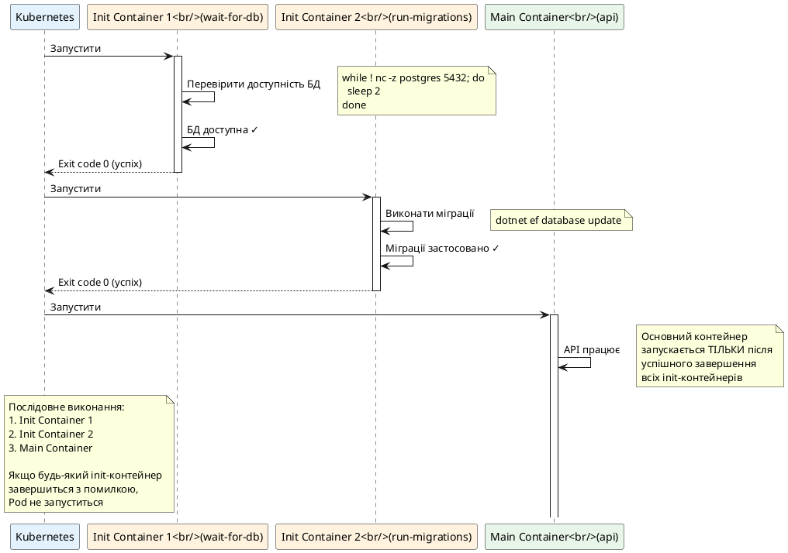
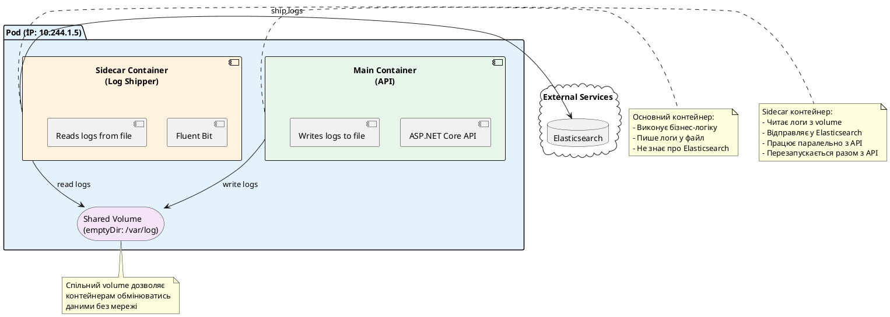

# Патерни використання Pod

## Навіщо потрібні патерни?

У попередній статті ми навчилися створювати Pod з одним контейнером — запускати ASP.NET Core API, налаштовувати ресурси, змінні оточення та volumes. Але чому Kubernetes дозволяє розміщувати **кілька контейнерів** в одному Pod? Чи не простіше було б мати один контейнер на Pod?

Щоб відповісти на це питання, розглянемо реальні проблеми, з якими ви зіткнетеся при розгортанні застосунків у production.

### Проблема 1: Підготовка перед запуском

Уявіть, що ви розгортаєте ASP.NET Core Web API, який працює з PostgreSQL. Перед тим, як запустити API, потрібно:

1. **Перевірити, чи доступна база даних** — якщо база ще не готова, API впаде при старті
2. **Застосувати міграції Entity Framework Core** — оновити схему бази даних до актуальної версії
3. **Завантажити початкові дані** — наприклад, створити адміністратора або заповнити довідники

Якщо ви спробуєте зробити все це **всередині основного контейнера** API, виникнуть проблеми:

- API стартує, намагається підключитися до бази, база ще не готова → API падає
- Міграції виконуються при кожному старті контейнера → якщо у вас 3 репліки API, міграції виконаються 3 рази одночасно → конфлікти та помилки
- Код застосунку змішується з логікою підготовки → складніше тестувати та підтримувати

**Що потрібно:** Механізм для виконання **підготовчих задач** перед запуском основного застосунку. Задачі мають виконуватися **один раз**, **послідовно**, і основний застосунок має чекати їх завершення.

### Проблема 2: Допоміжні процеси

Тепер уявіть, що ваш API працює, але вам потрібно:

1. **Збирати логи** — API пише логи у файл, але ви хочете відправляти їх у Elasticsearch для централізованого зберігання
2. **Експортувати метрики** — API генерує метрики Prometheus, але їх потрібно збирати та відправляти у систему моніторингу
3. **Проксіювати трафік** — додати HTTPS, автентифікацію або rate limiting без зміни коду API

Якщо ви спробуєте зробити все це **всередині основного контейнера** API, виникнуть проблеми:

- Код API стає складнішим — тепер він відповідає не тільки за бізнес-логіку, а й за логування, метрики, мережу
- Важко замінити компоненти — якщо ви хочете змінити Elasticsearch на Loki, доведеться змінювати код API та перезбирати образ
- Важко повторно використовувати — кожен новий застосунок має реалізовувати ту саму логіку логування та метрик

**Що потрібно:** Механізм для запуску **допоміжних процесів**, які працюють **паралельно** з основним застосунком, мають доступ до його даних (логи, метрики), але **не змінюють** код застосунку.

### Рішення: Патерни multi-container Pod

Kubernetes вирішує обидві проблеми через два патерни:

::card-group

::card{title="Init-контейнери" icon="i-heroicons-arrow-right"}
Контейнери, які виконуються **перед** основним застосунком. Виконуються **послідовно**, один за одним. Основний застосунок запускається лише після успішного завершення всіх init-контейнерів.

**Використання:** Міграції бази даних, завантаження конфігурацій, очікування доступності залежних сервісів.
::

::card{title="Sidecar-контейнери" icon="i-heroicons-squares-plus"}
Контейнери, які працюють **паралельно** з основним застосунком. Мають доступ до спільних volumes та мережі. Працюють протягом усього життя Pod.

**Використання:** Збір логів, експорт метрик, проксіювання трафіку, синхронізація даних.
::

::

Обидва патерни базуються на тому, що контейнери в одному Pod мають **спільну мережу** (localhost) та можуть мати **спільні volumes** (файлові системи). Це дозволяє їм тісно взаємодіяти без складних налаштувань.

::note
**Чому це важливо для новачка?**

Розуміння цих патернів критично важливе, тому що:
1. Вони використовуються у **більшості production-систем** — рідко коли застосунок складається з одного контейнера
2. Вони дозволяють **розділити відповідальність** — основний застосунок займається бізнес-логікою, допоміжні контейнери — інфраструктурними задачами
3. Вони роблять систему **гнучкішою** — можна замінити компонент логування без зміни коду застосунку

Без розуміння цих патернів ви не зможете ефективно використовувати Kubernetes у реальних проєктах.
::

---

## Init-контейнери: підготовка перед запуском

**Init-контейнери** — це спеціальні контейнери, які виконуються **перед** основними контейнерами Pod. Вони використовуються для підготовчих задач, які мають виконатися один раз перед стартом застосунку.

### Як працюють init-контейнери

Коли Kubernetes створює Pod з init-контейнерами, відбувається наступне:

::plant-uml



::

**Ключові властивості init-контейнерів:**

::field-group

::field{name="Послідовне виконання" type="властивість"}
Init-контейнери виконуються **один за одним**, у порядку оголошення в YAML. Наступний init-контейнер не запуститься, поки попередній не завершиться успішно (exit code 0).
::

::field{name="Блокування запуску" type="властивість"}
Основні контейнери **не запустяться**, поки всі init-контейнери не завершаться успішно. Якщо будь-який init-контейнер завершиться з помилкою (exit code != 0), Pod залишиться в стані `Init:Error` або `Init:CrashLoopBackOff`.
::

::field{name="Окремі образи" type="властивість"}
Init-контейнери можуть використовувати **інші образи**, ніж основні контейнери. Наприклад, ви можете використати образ з утилітами (`busybox`, `alpine`) для перевірки доступності сервісів, або образ з .NET SDK для виконання міграцій.
::

::field{name="Спільні volumes" type="властивість"}
Init-контейнери мають доступ до **тих самих volumes**, що й основні контейнери. Це дозволяє їм підготувати файли (наприклад, завантажити конфігурації або дані), які потім використає основний застосунок.
::

::field{name="Перезапуск при помилці" type="властивість"}
Якщо init-контейнер завершиться з помилкою, Kubernetes перезапустить його відповідно до `restartPolicy` Pod. Якщо `restartPolicy: Always` або `OnFailure`, init-контейнер буде перезапущено з exponential backoff (як і основні контейнери).
::

::

### Синтаксис YAML

Init-контейнери описуються в полі `spec.initContainers[]`, яке має такий самий формат, як `spec.containers[]`:

```yaml
apiVersion: v1
kind: Pod
metadata:
  name: init-demo
spec:
  # Init-контейнери
  initContainers:
    - name: init-step-1
      image: busybox:1.36
      command: ["sh", "-c", "echo Init step 1 && sleep 2"]
    
    - name: init-step-2
      image: busybox:1.36
      command: ["sh", "-c", "echo Init step 2 && sleep 2"]
  
  # Основні контейнери
  containers:
    - name: app
      image: nginx:1.27
```

::field-group

::field{name="spec.initContainers" type="array"}
Список init-контейнерів. Кожен елемент має такі самі поля, як `spec.containers[]`: `name`, `image`, `command`, `args`, `env`, `volumeMounts`, `resources` тощо.
::

::

Створіть цей Pod та спостерігайте за його запуском:

::terminal-preview{title="kubectl apply and get"}

<div class="line"><span class="opacity-40">$</span> <strong>kubectl apply -f init-demo.yaml</strong></div>
<div class="line"><span class="text-green-400">pod/init-demo created</span></div>
<div class="line"></div>
<div class="line"><span class="opacity-40">$</span> <strong>kubectl get pod init-demo -w</strong></div>
<div class="line">NAME        READY   STATUS     RESTARTS   AGE</div>
<div class="line">init-demo   0/1     <span class="text-yellow-400">Init:0/2</span>   0          1s</div>
<div class="line">init-demo   0/1     <span class="text-yellow-400">Init:1/2</span>   0          3s</div>
<div class="line">init-demo   0/1     <span class="text-blue-400">PodInitializing</span>   0          5s</div>
<div class="line">init-demo   1/1     <span class="text-green-400">Running</span>    0          6s</div>

::

Статус `Init:0/2` означає "виконується init-контейнер 0 з 2". Після завершення обох init-контейнерів Pod переходить у стан `Running`.

### Приклад 1: Очікування доступності бази даних

Найпоширеніший сценарій — перевірити, чи доступна база даних, перед запуском застосунку:

```yaml
apiVersion: v1
kind: Pod
metadata:
  name: wait-for-db
spec:
  initContainers:
    - name: wait-for-postgres
      image: busybox:1.36
      command:
        - sh
        - -c
        - |
          echo "Waiting for PostgreSQL..."
          until nc -z postgres 5432; do
            echo "PostgreSQL is not ready yet, waiting..."
            sleep 2
          done
          echo "PostgreSQL is ready!"
  
  containers:
    - name: app
      image: myapp:1.0
      env:
        - name: ConnectionStrings__DefaultConnection
          value: "Host=postgres;Database=mydb;Username=user;Password=pass"
```

**Що відбувається:**

1. Kubernetes запускає init-контейнер `wait-for-postgres`
2. Init-контейнер виконує команду `nc -z postgres 5432` (netcat — перевірка доступності порту)
3. Якщо PostgreSQL недоступний — команда повертає ненульовий exit code, цикл `until` продовжується
4. Init-контейнер чекає 2 секунди та перевіряє знову
5. Коли PostgreSQL стає доступним — цикл завершується, init-контейнер виходить з exit code 0
6. Kubernetes запускає основний контейнер `app`

::tip
**Чому це краще, ніж перевірка всередині застосунку?**

Якщо ви додасте логіку очікування БД у код C# застосунку, виникнуть проблеми:
- Застосунок стартує, але не готовий приймати запити → health checks падають
- Складніше діагностувати — чи застосунок чекає БД, чи вже працює?
- Код застосунку змішується з інфраструктурною логікою

З init-контейнером все чітко: поки Pod у стані `Init:*`, ви знаєте, що він чекає БД. Коли Pod у стані `Running`, застосунок готовий.
::

### Приклад 2: Завантаження конфігурацій

Init-контейнер може завантажити конфігурації з зовнішнього джерела (наприклад, S3, Git) та зберегти їх у спільний volume:

```yaml
apiVersion: v1
kind: Pod
metadata:
  name: config-loader
spec:
  volumes:
    - name: config
      emptyDir: {}
  
  initContainers:
    - name: download-config
      image: alpine:3.19
      volumeMounts:
        - name: config
          mountPath: /config
      command:
        - sh
        - -c
        - |
          echo "Downloading configuration..."
          # Симуляція завантаження конфігурації
          cat > /config/appsettings.json <<EOF
          {
            "Logging": {
              "LogLevel": {
                "Default": "Information"
              }
            },
            "DatabaseSettings": {
              "ConnectionString": "Host=postgres;Database=mydb"
            }
          }
          EOF
          echo "Configuration downloaded!"
  
  containers:
    - name: app
      image: myapp:1.0
      volumeMounts:
        - name: config
          mountPath: /app/config
          readOnly: true
```

**Що відбувається:**

1. Створюється volume `config` типу `emptyDir`
2. Init-контейнер монтує цей volume у `/config`
3. Init-контейнер завантажує (або генерує) файл `appsettings.json` у `/config/appsettings.json`
4. Init-контейнер завершується успішно
5. Основний контейнер монтує той самий volume у `/app/config` (read-only)
6. Застосунок читає конфігурацію з `/app/config/appsettings.json`

---

## Init-контейнери з .NET: Entity Framework Core міграції

Тепер розглянемо реальний сценарій — виконання міграцій Entity Framework Core перед запуском ASP.NET Core API.

### Проблема

У вас є ASP.NET Core API, який використовує Entity Framework Core для роботи з PostgreSQL. При розгортанні нової версії застосунку потрібно застосувати міграції до бази даних. Якщо ви виконаєте міграції всередині основного контейнера API:

- **Проблема 1:** Якщо у вас 3 репліки API, міграції виконаються 3 рази одночасно → конфлікти
- **Проблема 2:** Міграції можуть тривати довго → API не готовий приймати запити
- **Проблема 3:** Якщо міграція впаде — API теж впаде, але Pod буде в стані `Running` → складно діагностувати

**Рішення:** Виконати міграції в init-контейнері. Міграції виконаються один раз перед запуском API, і якщо вони впадуть — Pod не запуститься.

### Крок 1: Створення .NET проєкту з Entity Framework Core

Створіть новий проєкт ASP.NET Core Web API:

::terminal-preview{title="dotnet new"}

<div class="line"><span class="opacity-40">$</span> <strong>dotnet new webapi -n TodoApiWithDb -minimal</strong></div>
<div class="line"><span class="text-green-400">The template "ASP.NET Core Web API" was created successfully.</span></div>
<div class="line"></div>
<div class="line"><span class="opacity-40">$</span> <strong>cd TodoApiWithDb</strong></div>

::

Додайте пакети Entity Framework Core:

::terminal-preview{title="dotnet add package"}

<div class="line"><span class="opacity-40">$</span> <strong>dotnet add package Microsoft.EntityFrameworkCore.Design</strong></div>
<div class="line"><span class="opacity-40">$</span> <strong>dotnet add package Npgsql.EntityFrameworkCore.PostgreSQL</strong></div>

::

### Крок 2: Код застосунку

Створіть модель та DbContext. Додайте файл `Todo.cs`:

```csharp
public class Todo
{
    public int Id { get; set; }
    public string Title { get; set; } = string.Empty;
    public bool IsCompleted { get; set; }
}
```

Додайте файл `AppDbContext.cs`:

```csharp
using Microsoft.EntityFrameworkCore;

public class AppDbContext : DbContext
{
    public AppDbContext(DbContextOptions<AppDbContext> options) : base(options)
    {
    }

    public DbSet<Todo> Todos => Set<Todo>();
}
```

Відредагуйте `Program.cs`:

```csharp
using Microsoft.EntityFrameworkCore;

var builder = WebApplication.CreateBuilder(args);

// Додаємо DbContext
builder.Services.AddDbContext<AppDbContext>(options =>
    options.UseNpgsql(builder.Configuration.GetConnectionString("DefaultConnection")));

var app = builder.Build();

// API endpoints
app.MapGet("/", () => "Todo API with PostgreSQL");

app.MapGet("/api/todos", async (AppDbContext db) =>
    await db.Todos.ToListAsync());

app.MapGet("/api/todos/{id}", async (int id, AppDbContext db) =>
    await db.Todos.FindAsync(id) is Todo todo
        ? Results.Ok(todo)
        : Results.NotFound());

app.MapPost("/api/todos", async (Todo todo, AppDbContext db) =>
{
    db.Todos.Add(todo);
    await db.SaveChangesAsync();
    return Results.Created($"/api/todos/{todo.Id}", todo);
});

app.MapPut("/api/todos/{id}", async (int id, Todo inputTodo, AppDbContext db) =>
{
    var todo = await db.Todos.FindAsync(id);
    if (todo is null) return Results.NotFound();

    todo.Title = inputTodo.Title;
    todo.IsCompleted = inputTodo.IsCompleted;
    await db.SaveChangesAsync();

    return Results.NoContent();
});

app.MapDelete("/api/todos/{id}", async (int id, AppDbContext db) =>
{
    var todo = await db.Todos.FindAsync(id);
    if (todo is null) return Results.NotFound();

    db.Todos.Remove(todo);
    await db.SaveChangesAsync();

    return Results.NoContent();
});

app.Run();
```

Додайте рядок підключення у `appsettings.json`:

```json
{
  "ConnectionStrings": {
    "DefaultConnection": "Host=localhost;Database=tododb;Username=postgres;Password=postgres"
  },
  "Logging": {
    "LogLevel": {
      "Default": "Information",
      "Microsoft.AspNetCore": "Warning"
    }
  }
}
```

### Крок 3: Створення міграції

Створіть початкову міграцію:

::terminal-preview{title="dotnet ef migrations add"}

<div class="line"><span class="opacity-40">$</span> <strong>dotnet ef migrations add InitialCreate</strong></div>
<div class="line">Build started...</div>
<div class="line">Build succeeded.</div>
<div class="line"><span class="text-green-400">Done. To undo this action, use 'ef migrations remove'</span></div>

::

Це створить папку `Migrations/` з файлами міграції.

### Крок 4: Dockerfile

Створіть `Dockerfile`:

```dockerfile
# Етап 1: Збірка
FROM mcr.microsoft.com/dotnet/sdk:8.0 AS build
WORKDIR /src

# Копіюємо .csproj та відновлюємо залежності
COPY *.csproj .
RUN dotnet restore

# Копіюємо решту файлів та збираємо
COPY . .
RUN dotnet publish -c Release -o /app/publish

# Етап 2: Runtime
FROM mcr.microsoft.com/dotnet/aspnet:8.0
WORKDIR /app

# Копіюємо зібраний застосунок
COPY --from=build /app/publish .

# Налаштовуємо порт
ENV ASPNETCORE_URLS=http://+:8080
EXPOSE 8080

# Запускаємо застосунок
ENTRYPOINT ["dotnet", "TodoApiWithDb.dll"]
```

### Крок 5: Dockerfile для міграцій

Створіть окремий `Dockerfile.migrations` для виконання міграцій:

```dockerfile
FROM mcr.microsoft.com/dotnet/sdk:8.0
WORKDIR /src

# Копіюємо .csproj та відновлюємо залежності
COPY *.csproj .
RUN dotnet restore

# Копіюємо решту файлів
COPY . .

# Встановлюємо EF Core tools
RUN dotnet tool install --global dotnet-ef
ENV PATH="${PATH}:/root/.dotnet/tools"

# Команда для виконання міграцій
ENTRYPOINT ["dotnet", "ef", "database", "update"]
```

::note
**Чому окремий Dockerfile для міграцій?**

Для виконання міграцій потрібен .NET SDK (містить `dotnet ef`), а для запуску API достатньо .NET Runtime (легший образ). Окремі Dockerfile дозволяють оптимізувати розмір образів:
- Образ API: ~220 MB (runtime)
- Образ міграцій: ~750 MB (SDK), але використовується лише в init-контейнері
::

### Крок 6: Збірка образів

Зберіть обидва образи:

::terminal-preview{title="docker build"}

<div class="line"><span class="opacity-40">$</span> <strong>docker build -t todoapi-db:1.0 .</strong></div>
<div class="line"><span class="text-green-400">Successfully built todoapi-db:1.0</span></div>
<div class="line"></div>
<div class="line"><span class="opacity-40">$</span> <strong>docker build -t todoapi-migrations:1.0 -f Dockerfile.migrations .</strong></div>
<div class="line"><span class="text-green-400">Successfully built todoapi-migrations:1.0</span></div>
<div class="line"></div>
<div class="line"><span class="opacity-40">$</span> <strong>minikube image load todoapi-db:1.0</strong></div>
<div class="line"><span class="opacity-40">$</span> <strong>minikube image load todoapi-migrations:1.0</strong></div>

::

### Крок 7: PostgreSQL у Kubernetes

Спочатку потрібно запустити PostgreSQL. Створіть файл `postgres-pod.yaml`:

```yaml
apiVersion: v1
kind: Pod
metadata:
  name: postgres
  labels:
    app: postgres
spec:
  containers:
    - name: postgres
      image: postgres:16
      ports:
        - containerPort: 5432
      env:
        - name: POSTGRES_DB
          value: "tododb"
        - name: POSTGRES_USER
          value: "postgres"
        - name: POSTGRES_PASSWORD
          value: "postgres"
      resources:
        requests:
          memory: "128Mi"
          cpu: "100m"
        limits:
          memory: "256Mi"
          cpu: "500m"
```

Створіть PostgreSQL Pod:

::terminal-preview{title="kubectl apply postgres"}

<div class="line"><span class="opacity-40">$</span> <strong>kubectl apply -f postgres-pod.yaml</strong></div>
<div class="line"><span class="text-green-400">pod/postgres created</span></div>
<div class="line"></div>
<div class="line"><span class="opacity-40">$</span> <strong>kubectl get pod postgres</strong></div>
<div class="line">NAME       READY   STATUS    RESTARTS   AGE</div>
<div class="line">postgres   1/1     Running   0          10s</div>

::

### Крок 8: Pod з init-контейнером для міграцій

Тепер створіть Pod з init-контейнером, який виконає міграції. Файл `todoapi-with-migrations.yaml`:

```yaml
apiVersion: v1
kind: Pod
metadata:
  name: todoapi
  labels:
    app: todoapi
spec:
  # Init-контейнери
  initContainers:
    # 1. Очікування доступності PostgreSQL
    - name: wait-for-postgres
      image: busybox:1.36
      command:
        - sh
        - -c
        - |
          echo "Waiting for PostgreSQL..."
          until nc -z postgres 5432; do
            echo "PostgreSQL is not ready, waiting..."
            sleep 2
          done
          echo "PostgreSQL is ready!"
    
    # 2. Виконання міграцій
    - name: run-migrations
      image: todoapi-migrations:1.0
      imagePullPolicy: Never
      env:
        - name: ConnectionStrings__DefaultConnection
          value: "Host=postgres;Database=tododb;Username=postgres;Password=postgres"
  
  # Основний контейнер
  containers:
    - name: api
      image: todoapi-db:1.0
      imagePullPolicy: Never
      ports:
        - containerPort: 8080
          name: http
      env:
        - name: ASPNETCORE_ENVIRONMENT
          value: "Development"
        - name: ASPNETCORE_URLS
          value: "http://+:8080"
        - name: ConnectionStrings__DefaultConnection
          value: "Host=postgres;Database=tododb;Username=postgres;Password=postgres"
      resources:
        requests:
          memory: "128Mi"
          cpu: "100m"
        limits:
          memory: "256Mi"
          cpu: "500m"
```

**Що відбувається:**

1. **Init-контейнер 1** (`wait-for-postgres`): Чекає, поки PostgreSQL стане доступним
2. **Init-контейнер 2** (`run-migrations`): Виконує `dotnet ef database update` для застосування міграцій
3. **Основний контейнер** (`api`): Запускається лише після успішного завершення обох init-контейнерів

Створіть Pod:

::terminal-preview{title="kubectl apply todoapi"}

<div class="line"><span class="opacity-40">$</span> <strong>kubectl apply -f todoapi-with-migrations.yaml</strong></div>
<div class="line"><span class="text-green-400">pod/todoapi created</span></div>
<div class="line"></div>
<div class="line"><span class="opacity-40">$</span> <strong>kubectl get pod todoapi -w</strong></div>
<div class="line">NAME      READY   STATUS     RESTARTS   AGE</div>
<div class="line">todoapi   0/1     <span class="text-yellow-400">Init:0/2</span>   0          2s</div>
<div class="line">todoapi   0/1     <span class="text-yellow-400">Init:1/2</span>   0          5s</div>
<div class="line">todoapi   0/1     <span class="text-blue-400">PodInitializing</span>   0          12s</div>
<div class="line">todoapi   1/1     <span class="text-green-400">Running</span>    0          15s</div>

::

Перевірте логи init-контейнера з міграціями:

::terminal-preview{title="kubectl logs init container"}

<div class="line"><span class="opacity-40">$</span> <strong>kubectl logs todoapi -c run-migrations</strong></div>
<div class="line">Build started...</div>
<div class="line">Build succeeded.</div>
<div class="line">Applying migration '20260509201000_InitialCreate'.</div>
<div class="line"><span class="text-green-400">Done.</span></div>

::

Міграції застосовано! Тепер протестуйте API:

::terminal-preview{title="kubectl port-forward and test"}

<div class="line"><span class="opacity-40">$</span> <strong>kubectl port-forward pod/todoapi 8080:8080 &</strong></div>
<div class="line">Forwarding from 127.0.0.1:8080 -> 8080</div>
<div class="line"></div>
<div class="line"><span class="opacity-40">$</span> <strong>curl http://localhost:8080/api/todos</strong></div>
<div class="line">[]</div>
<div class="line"></div>
<div class="line"><span class="opacity-40">$</span> <strong>curl -X POST http://localhost:8080/api/todos \</strong></div>
<div class="line">  <strong>-H "Content-Type: application/json" \</strong></div>
<div class="line">  <strong>-d '{"title":"Вивчити init-контейнери","isCompleted":false}'</strong></div>
<div class="line"><span class="text-green-400">{"id":1,"title":"Вивчити init-контейнери","isCompleted":false}</span></div>
<div class="line"></div>
<div class="line"><span class="opacity-40">$</span> <strong>curl http://localhost:8080/api/todos</strong></div>
<div class="line">[{"id":1,"title":"Вивчити init-контейнери","isCompleted":false}]</div>

::

Чудово! API працює, міграції застосовано, дані зберігаються в PostgreSQL.

::tip
**Переваги цього підходу:**

1. **Міграції виконуються один раз** — навіть якщо у вас 10 реплік API, міграції виконаються лише один раз в init-контейнері
2. **Чітка діагностика** — якщо міграції впадуть, Pod залишиться в стані `Init:Error`, і ви одразу побачите проблему
3. **Розділення відповідальності** — код API не містить логіки міграцій, це робота init-контейнера
4. **Безпека** — основний контейнер не запуститься, поки база даних не буде готова та міграції не застосовано
::

---

## Sidecar-контейнери: допоміжні процеси

**Sidecar-контейнери** — це контейнери, які працюють **паралельно** з основним контейнером протягом усього життя Pod. Вони розширюють або доповнюють функціональність основного застосунку без зміни його коду.

### Як працюють sidecar-контейнери

На відміну від init-контейнерів, які виконуються послідовно перед запуском основного застосунку, sidecar-контейнери запускаються **одночасно** з основним контейнером і працюють **паралельно**:

::plant-uml



::

**Ключові властивості sidecar-контейнерів:**

::field-group

::field{name="Паралельне виконання" type="властивість"}
Sidecar-контейнери запускаються **одночасно** з основним контейнером. Вони працюють протягом усього життя Pod. Якщо основний контейнер падає і перезапускається — sidecar теж перезапускається.
::

::field{name="Спільна мережа" type="властивість"}
Sidecar та основний контейнер бачать один одного через **localhost**. Наприклад, sidecar може бути Nginx, який проксіює запити до API на `localhost:8080`.
::

::field{name="Спільні volumes" type="властивість"}
Sidecar має доступ до тих самих volumes, що й основний контейнер. Це дозволяє читати файли (логи, метрики) або писати конфігурації.
::

::field{name="Незалежні образи" type="властивість"}
Sidecar може використовувати зовсім інший образ. Наприклад, основний контейнер — .NET застосунок, sidecar — Fluent Bit (написаний на C) для збору логів.
::

::field{name="Повторне використання" type="властивість"}
Один і той самий sidecar-образ можна використовувати для різних застосунків. Наприклад, образ Fluent Bit для збору логів підходить для будь-якого застосунку, який пише логи у файл.
::

::

### Типові сценарії використання sidecar

::card-group

::card{title="Збір логів" icon="i-heroicons-document-text"}
Основний застосунок пише логи у файл, sidecar читає цей файл та відправляє логи у централізоване сховище (Elasticsearch, Loki, CloudWatch).
::

::card{title="Експорт метрик" icon="i-heroicons-chart-bar"}
Основний застосунок генерує метрики (Prometheus format), sidecar збирає їх та відправляє у систему моніторингу.
::

::card{title="Мережевий проксі" icon="i-heroicons-shield-check"}
Sidecar перехоплює весь трафік для додавання HTTPS, автентифікації, rate limiting або моніторингу. Приклад: Envoy у Service Mesh (Istio, Linkerd).
::

::card{title="Синхронізація даних" icon="i-heroicons-arrow-path"}
Sidecar періодично завантажує оновлені конфігурації або дані з зовнішнього джерела та оновлює файли у спільному volume.
::

::card{title="Адаптер даних" icon="i-heroicons-arrow-path-rounded-square"}
Sidecar перетворює формат даних. Наприклад, застосунок генерує метрики у власному форматі, sidecar конвертує їх у формат Prometheus.
::

::

### Синтаксис YAML

Sidecar-контейнери — це звичайні контейнери в `spec.containers[]`. Немає окремого поля для sidecar, вони просто додаються до списку контейнерів:

```yaml
apiVersion: v1
kind: Pod
metadata:
  name: sidecar-demo
spec:
  volumes:
    - name: shared-data
      emptyDir: {}
  
  containers:
    # Основний контейнер
    - name: app
      image: myapp:1.0
      volumeMounts:
        - name: shared-data
          mountPath: /data
    
    # Sidecar контейнер
    - name: sidecar
      image: busybox:1.36
      volumeMounts:
        - name: shared-data
          mountPath: /data
          readOnly: true
      command: ["sh", "-c", "tail -f /data/app.log"]
```

Обидва контейнери запустяться одночасно та працюватимуть паралельно.

---

## Sidecar з .NET: централізоване логування

Тепер розглянемо практичний приклад — ASP.NET Core API пише логи у файл, а sidecar-контейнер відправляє ці логи у Elasticsearch.

### Проблема

Ваш ASP.NET Core API працює у Kubernetes. Ви хочете зберігати логи у Elasticsearch для централізованого пошуку та аналізу. Є два підходи:

**Підхід 1:** Додати Serilog.Sinks.Elasticsearch у код API
- ❌ API залежить від Elasticsearch — якщо Elasticsearch недоступний, API може працювати повільно
- ❌ Важко замінити Elasticsearch на інше сховище — потрібно змінювати код та перезбирати образ
- ❌ Кожен застосунок має реалізовувати ту саму логіку

**Підхід 2:** Sidecar-контейнер з Fluent Bit
- ✅ API просто пише логи у файл (як завжди)
- ✅ Fluent Bit читає файл та відправляє в Elasticsearch
- ✅ Можна замінити Fluent Bit на інший log shipper без зміни коду API
- ✅ Один образ Fluent Bit для всіх застосунків

### Крок 1: Налаштування логування у .NET

Модифікуйте `Program.cs` для запису логів у файл:

```csharp
using Microsoft.EntityFrameworkCore;
using Serilog;

var builder = WebApplication.CreateBuilder(args);

// Налаштовуємо Serilog для запису у файл
Log.Logger = new LoggerConfiguration()
    .WriteTo.Console()
    .WriteTo.File("/var/log/app/app.log", 
        rollingInterval: RollingInterval.Day,
        retainedFileCountLimit: 7)
    .CreateLogger();

builder.Host.UseSerilog();

// Додаємо DbContext
builder.Services.AddDbContext<AppDbContext>(options =>
    options.UseNpgsql(builder.Configuration.GetConnectionString("DefaultConnection")));

var app = builder.Build();

// Логуємо кожен запит
app.Use(async (context, next) =>
{
    Log.Information("Request: {Method} {Path}", context.Request.Method, context.Request.Path);
    await next();
    Log.Information("Response: {StatusCode}", context.Response.StatusCode);
});

// API endpoints (як раніше)
app.MapGet("/", () => "Todo API with Logging");
app.MapGet("/api/todos", async (AppDbContext db) => await db.Todos.ToListAsync());
// ... інші endpoints

app.Run();
```

Додайте пакет Serilog:

::terminal-preview{title="dotnet add package"}

<div class="line"><span class="opacity-40">$</span> <strong>dotnet add package Serilog.AspNetCore</strong></div>
<div class="line"><span class="opacity-40">$</span> <strong>dotnet add package Serilog.Sinks.File</strong></div>

::

### Крок 2: Оновлення Dockerfile

Оновіть `Dockerfile`, щоб створити директорію для логів:

```dockerfile
# Етап 1: Збірка
FROM mcr.microsoft.com/dotnet/sdk:8.0 AS build
WORKDIR /src

COPY *.csproj .
RUN dotnet restore

COPY . .
RUN dotnet publish -c Release -o /app/publish

# Етап 2: Runtime
FROM mcr.microsoft.com/dotnet/aspnet:8.0
WORKDIR /app

# Створюємо директорію для логів
RUN mkdir -p /var/log/app && chmod 777 /var/log/app

COPY --from=build /app/publish .

ENV ASPNETCORE_URLS=http://+:8080
EXPOSE 8080

ENTRYPOINT ["dotnet", "TodoApiWithDb.dll"]
```

Перезберіть образ:

::terminal-preview{title="docker build"}

<div class="line"><span class="opacity-40">$</span> <strong>docker build -t todoapi-db:2.0 .</strong></div>
<div class="line"><span class="text-green-400">Successfully built todoapi-db:2.0</span></div>
<div class="line"></div>
<div class="line"><span class="opacity-40">$</span> <strong>minikube image load todoapi-db:2.0</strong></div>

::

### Крок 3: Pod з sidecar для логування

Створіть файл `todoapi-with-logging.yaml`:

```yaml
apiVersion: v1
kind: Pod
metadata:
  name: todoapi-logging
  labels:
    app: todoapi
spec:
  volumes:
    # Спільний volume для логів
    - name: logs
      emptyDir: {}
  
  initContainers:
    # Очікування PostgreSQL
    - name: wait-for-postgres
      image: busybox:1.36
      command:
        - sh
        - -c
        - |
          echo "Waiting for PostgreSQL..."
          until nc -z postgres 5432; do
            sleep 2
          done
          echo "PostgreSQL is ready!"
    
    # Міграції
    - name: run-migrations
      image: todoapi-migrations:1.0
      imagePullPolicy: Never
      env:
        - name: ConnectionStrings__DefaultConnection
          value: "Host=postgres;Database=tododb;Username=postgres;Password=postgres"
  
  containers:
    # Основний контейнер - API
    - name: api
      image: todoapi-db:2.0
      imagePullPolicy: Never
      ports:
        - containerPort: 8080
          name: http
      env:
        - name: ASPNETCORE_ENVIRONMENT
          value: "Development"
        - name: ASPNETCORE_URLS
          value: "http://+:8080"
        - name: ConnectionStrings__DefaultConnection
          value: "Host=postgres;Database=tododb;Username=postgres;Password=postgres"
      volumeMounts:
        - name: logs
          mountPath: /var/log/app
      resources:
        requests:
          memory: "128Mi"
          cpu: "100m"
        limits:
          memory: "256Mi"
          cpu: "500m"
    
    # Sidecar контейнер - Log Reader
    - name: log-reader
      image: busybox:1.36
      volumeMounts:
        - name: logs
          mountPath: /var/log/app
          readOnly: true
      command:
        - sh
        - -c
        - |
          echo "Log reader started, waiting for log file..."
          # Чекаємо, поки з'явиться файл логів
          while [ ! -f /var/log/app/app.log ]; do
            sleep 1
          done
          echo "Log file found, starting to tail..."
          tail -f /var/log/app/app.log
```

**Що відбувається:**

1. Створюється volume `logs` типу `emptyDir`
2. Init-контейнери виконуються послідовно (очікування БД → міграції)
3. Запускаються **два контейнери паралельно**:
   - `api` — пише логи у `/var/log/app/app.log`
   - `log-reader` — читає файл `/var/log/app/app.log` через `tail -f`
4. Обидва контейнери монтують один і той самий volume `logs`

Створіть Pod:

::terminal-preview{title="kubectl apply"}

<div class="line"><span class="opacity-40">$</span> <strong>kubectl apply -f todoapi-with-logging.yaml</strong></div>
<div class="line"><span class="text-green-400">pod/todoapi-logging created</span></div>
<div class="line"></div>
<div class="line"><span class="opacity-40">$</span> <strong>kubectl get pod todoapi-logging</strong></div>
<div class="line">NAME              READY   STATUS    RESTARTS   AGE</div>
<div class="line">todoapi-logging   2/2     Running   0          15s</div>

::

Зверніть увагу: `READY` показує `2/2` — обидва контейнери працюють!

### Крок 4: Перегляд логів через sidecar

Тепер ви можете переглядати логи API через sidecar-контейнер:

::terminal-preview{title="kubectl logs sidecar"}

<div class="line"><span class="opacity-40">$</span> <strong>kubectl logs todoapi-logging -c log-reader</strong></div>
<div class="line">Log reader started, waiting for log file...</div>
<div class="line">Log file found, starting to tail...</div>
<div class="line">[2026-05-09 20:10:15 INF] Application started</div>
<div class="line">[2026-05-09 20:10:15 INF] Now listening on: http://[::]:8080</div>

::

Тепер зробіть кілька запитів до API:

::terminal-preview{title="curl requests"}

<div class="line"><span class="opacity-40">$</span> <strong>kubectl port-forward pod/todoapi-logging 8080:8080 &</strong></div>
<div class="line"></div>
<div class="line"><span class="opacity-40">$</span> <strong>curl http://localhost:8080/api/todos</strong></div>
<div class="line">[]</div>
<div class="line"></div>
<div class="line"><span class="opacity-40">$</span> <strong>curl -X POST http://localhost:8080/api/todos \</strong></div>
<div class="line">  <strong>-H "Content-Type: application/json" \</strong></div>
<div class="line">  <strong>-d '{"title":"Вивчити sidecar","isCompleted":false}'</strong></div>

::

Перевірте логи знову:

::terminal-preview{title="kubectl logs after requests"}

<div class="line"><span class="opacity-40">$</span> <strong>kubectl logs todoapi-logging -c log-reader --tail=10</strong></div>
<div class="line">[2026-05-09 20:12:30 INF] Request: GET /api/todos</div>
<div class="line">[2026-05-09 20:12:30 INF] Response: 200</div>
<div class="line">[2026-05-09 20:12:35 INF] Request: POST /api/todos</div>
<div class="line">[2026-05-09 20:12:35 INF] Response: 201</div>

::

Чудово! Sidecar-контейнер читає логи з файлу в реальному часі.

::note
**У реальному production:**

Замість `busybox` з `tail -f` ви б використали **Fluent Bit** або **Fluentd** — спеціалізовані інструменти для збору логів. Вони можуть:
- Парсити структуровані логи (JSON)
- Фільтрувати та трансформувати логи
- Відправляти у різні сховища (Elasticsearch, Loki, CloudWatch, S3)
- Буферизувати логи при недоступності сховища

Приклад конфігурації Fluent Bit для Elasticsearch виходить за межі цієї статті, але принцип той самий — sidecar читає файл з volume та відправляє дані назовні.
::

---

## Порівняння Init vs Sidecar

Давайте підсумуємо різницю між init-контейнерами та sidecar-контейнерами:

| Характеристика | Init-контейнери | Sidecar-контейнери |
|---|---|---|
| **Коли запускаються** | Перед основними контейнерами | Одночасно з основними контейнерами |
| **Порядок виконання** | Послідовно, один за одним | Паралельно |
| **Тривалість життя** | Завершуються після виконання задачі | Працюють протягом усього життя Pod |
| **Блокування запуску** | Основні контейнери чекають завершення | Не блокують один одного |
| **Типові задачі** | Міграції БД, завантаження конфігурацій, очікування залежностей | Збір логів, експорт метрик, проксіювання трафіку |
| **Приклад** | `dotnet ef database update` | Fluent Bit для збору логів |
| **Перезапуск** | Перезапускаються при помилці (згідно restartPolicy) | Перезапускаються разом з основним контейнером |

::tip
**Коли використовувати що:**

- **Init-контейнери** — для задач, які мають виконатися **один раз перед запуском** застосунку. Якщо задача не виконається — застосунок не повинен запускатися.
- **Sidecar-контейнери** — для задач, які мають працювати **паралельно** з застосунком протягом усього його життя. Якщо sidecar падає — основний застосунок продовжує працювати (але може втратити функціональність, наприклад, логування).
::

---

## Резюме

У цій статті ми детально розглянули патерни використання Pod:

::card-group

::card{title="Проблеми, які вирішують патерни" icon="i-heroicons-light-bulb"}
Підготовка перед запуском (міграції, очікування залежностей) та допоміжні процеси (логування, метрики, проксіювання) — задачі, які не повинні бути в коді застосунку.
::

::card{title="Init-контейнери" icon="i-heroicons-arrow-right"}
Виконуються послідовно перед основним застосунком. Використовуються для міграцій Entity Framework Core, очікування доступності бази даних, завантаження конфігурацій.
::

::card{title="Sidecar-контейнери" icon="i-heroicons-squares-plus"}
Працюють паралельно з основним застосунком. Використовуються для збору логів через спільний volume, експорту метрик, проксіювання трафіку.
::

::card{title=".NET приклади" icon="i-simple-icons-dotnet"}
Повний приклад: ASP.NET Core API + PostgreSQL + EF Core міграції через init-контейнер + Serilog логування через sidecar. Всі приклади самодостатні та готові до запуску.
::

::

**Ключовий висновок:** Multi-container Pod — це потужний інструмент для розділення відповідальності. Основний застосунок займається бізнес-логікою, init-контейнери готують середовище, sidecar-контейнери надають інфраструктурні сервіси. Це робить систему гнучкішою, легшою у підтримці та повторному використанні.

---

## Практичні завдання

### Завдання 1: Послідовна ініціалізація (Init-контейнер з очікуванням)

Створіть свій перший Pod з init-контейнером, який виконує підготовчу затримку (імітуючи перевірку або завантаження файлу) перед тим, як запуститься основний веб-сервер.

**Маніфест `init-delay-pod.yaml`:**
```yaml
apiVersion: v1
kind: Pod
metadata:
  name: init-delay-practice
spec:
  initContainers:
    - name: init-delay
      image: busybox:1.36
      command: ["sh", "-c", "echo 'Initialization started...'; sleep 5; echo 'Initialization complete!'"]
  containers:
    - name: app
      image: busybox:1.36
      command: ["sh", "-c", "echo 'Application started!'; sleep 3600"]
```

**Кроки для виконання:**
1. Створіть та запустіть Pod у кластері.
2. Перегляньте логи init-контейнера:
   ::terminal-preview{title="kubectl logs init"}
   <div class="line"><span class="opacity-40">$</span> <strong>kubectl logs init-delay-practice -c init-delay</strong></div>
   <div class="line">Initialization started...</div>
   <div class="line">Initialization complete!</div>
   ::
3. Перегляньте логи основного контейнера:
   ::terminal-preview{title="kubectl logs app"}
   <div class="line"><span class="opacity-40">$</span> <strong>kubectl logs init-delay-practice -c app</strong></div>
   <div class="line">Application started!</div>
   ::

**Вимоги:**
- Переконайтеся за допомогою міток часу у логах, що основний контейнер запустився строго після завершення 5-секундної затримки в init-контейнері.

---

### Завдання 2: Ланцюжок залежностей (Робота з кількома Init-контейнерами)

Дослідіть, як кілька init-контейнерів виконуються послідовно та що відбувається, якщо один з них завершується з помилкою.

**Маніфест `init-chain-pod.yaml`:**
```yaml
apiVersion: v1
kind: Pod
metadata:
  name: init-chain-practice
spec:
  volumes:
    - name: shared-data
      emptyDir: {}
  initContainers:
    - name: step-1-write
      image: busybox:1.36
      command: ["sh", "-c", "echo 'Config version 1.0' > /shared/config.txt; echo 'Step 1 complete'"]
      volumeMounts:
        - name: shared-data
          mountPath: /shared
    - name: step-2-validate
      image: busybox:1.36
      command: ["sh", "-c", "cat /shared/config.txt && echo 'Validation complete!'"]
      volumeMounts:
        - name: shared-data
          mountPath: /shared
  containers:
    - name: main-app
      image: busybox:1.36
      command: ["sh", "-c", "echo 'Main app is running!'; sleep 3600"]
      volumeMounts:
        - name: shared-data
          mountPath: /shared
```

**Експеримент та питання для самоперевірки:**
1. Запустіть Pod та перевірте статус через `kubectl get pods`.
2. Навмисно зламайте перший крок: змініть команду в `step-1-write` на таку, що завершується з помилкою (наприклад, `["sh", "-c", "echo 'Error' && exit 1"]`).
3. Повторно застосуйте маніфест (видаливши старий Pod) та спостерігайте за його станом.
- У якому стані перебуває Pod?
- Чи запустилися `step-2-validate` та `main-app`?
- Що ви бачите у блоці `Events` при виконанні `kubectl describe pod init-chain-practice`?

---

### Завдання 3: Динамічне монтування конфігурації через Init-контейнер

Навчіться завантажувати зовнішню конфігурацію (`appsettings.json`) з ConfigMap, обробляти її за допомогою init-контейнера та монтувати в основний .NET застосунок.

**Маніфест `config-loader-pod.yaml`:**
```yaml
apiVersion: v1
kind: ConfigMap
metadata:
  name: external-config
data:
  appsettings.json: |
    {
      "Logging": {
        "LogLevel": {
          "Default": "Debug"
        }
      },
      "AllowedHosts": "*"
    }
---
apiVersion: v1
kind: Pod
metadata:
  name: config-loader-practice
spec:
  volumes:
    - name: config-volume
      emptyDir: {}
    - name: config-source
      configMap:
        name: external-config
  initContainers:
    - name: loader
      image: busybox:1.36
      command: ["sh", "-c", "cp /source/appsettings.json /target/appsettings.json && echo 'Config copied successfully!'"]
      volumeMounts:
        - name: config-source
          mountPath: /source
        - name: config-volume
          mountPath: /target
  containers:
    - name: dotnet-app
      image: mcr.microsoft.com/dotnet/aspnet:8.0
      command: ["sh", "-c", "echo 'Dotnet reading settings:'; cat /app/config/appsettings.json; sleep 3600"]
      volumeMounts:
        - name: config-volume
          mountPath: /app/config
```

**Вимоги:**
- Запустіть конфігурацію та Pod у кластері.
- Перегляньте логи контейнера `dotnet-app`. Переконайтеся, що він успішно вивів змонтований JSON-вміст файлу конфігурації.

---

### Завдання 4: Патерн Sidecar для моніторингу (Metrics Poller)

Реалізуйте sidecar-контейнер, який працює паралельно з основним веб-сервером та періодично опитує його на предмет працездатності, імітуючи роботу агента моніторингу.

**Маніфест `sidecar-poller-practice.yaml`:**
```yaml
apiVersion: v1
kind: Pod
metadata:
  name: sidecar-poller-practice
spec:
  containers:
    # Основний контейнер (веб-сервер)
    - name: web-server
      image: nginx:1.27
      ports:
        - containerPort: 80
          name: http
    # Sidecar-контейнер для моніторингу
    - name: metrics-poller
      image: busybox:1.36
      command: ["sh", "-c", "while true; do wget -qO- http://localhost:80 > /dev/null && echo \"[$(date)] [Metrics] HTTP 200 OK - Server is healthy\"; sleep 10; done"]
```

**Кроки для виконання та перевірки:**
1. Запустіть Pod у кластері.
2. Прочитайте логи sidecar-контейнера:
   ::terminal-preview{title="kubectl logs sidecar"}
   <div class="line"><span class="opacity-40">$</span> <strong>kubectl logs sidecar-poller-practice -c metrics-poller -f</strong></div>
   <div class="line">[Sat May  9 20:22:10 UTC 2026] [Metrics] HTTP 200 OK - Server is healthy</div>
   <div class="line">[Sat May  9 20:22:20 UTC 2026] [Metrics] HTTP 200 OK - Server is healthy</div>
   ::

**Питання для самоперевірки:**
- Чому sidecar-контейнер `metrics-poller` має можливість звертатися до веб-сервера через `localhost`, хоча вони ізольовані один від одного на рівні процесів?

---

### Завдання 5: Збір метрик ресурсів (Sidecar з доступом до cgroups)

Дослідіть, як sidecar-контейнер може зчитувати показники використання пам'яті основним контейнером безпосередньо з віртуальної файлової системи Linux (`cgroups`).

**Маніфест `resources-monitor-practice.yaml`:**
```yaml
apiVersion: v1
kind: Pod
metadata:
  name: resources-monitor-practice
spec:
  containers:
    - name: memory-consumer
      image: busybox:1.36
      command: ["sh", "-c", "while true; do echo 'Generating mock processing load...'; sleep 10; done"]
    - name: monitor-sidecar
      image: busybox:1.36
      command: ["sh", "-c", "while true; do if [ -f /sys/fs/cgroup/memory.current ]; then echo \"[Monitor] Memory limit status: $(cat /sys/fs/cgroup/memory.current) bytes\"; else echo \"[Monitor] Memory status: $(cat /sys/fs/cgroup/memory/memory.usage_in_bytes) bytes\"; fi; sleep 5; done"]
```

**Кроки для виконання та перевірки:**
1. Запустіть Pod у вашому кластері.
2. Перегляньте логи контейнера-монітора:
   ::terminal-preview{title="kubectl logs monitor"}
   <div class="line"><span class="opacity-40">$</span> <strong>kubectl logs resources-monitor-practice -c monitor-sidecar</strong></div>
   <div class="line">[Monitor] Memory status: 1474560 bytes</div>
   ::

**Питання для самоперевірки:**
- Поясніть, чому обидва контейнери бачать однакові показники cgroups. Для чого в реальних проектах використовуються sidecar-агенти (наприклад, Prometheus Node Exporter або Datadog Agent)?

::note
Ці вправи розкривають практичний потенціал мультиконтейнерних Pods. Завдяки розділенню обов'язків між ініціалізуючими (Init), основними та допоміжними (Sidecar) контейнерами ви можете створювати стійкі та гнучкі інфраструктурні рішення для будь-яких .NET застосунків.
::

