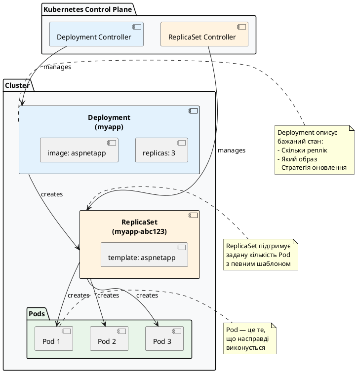
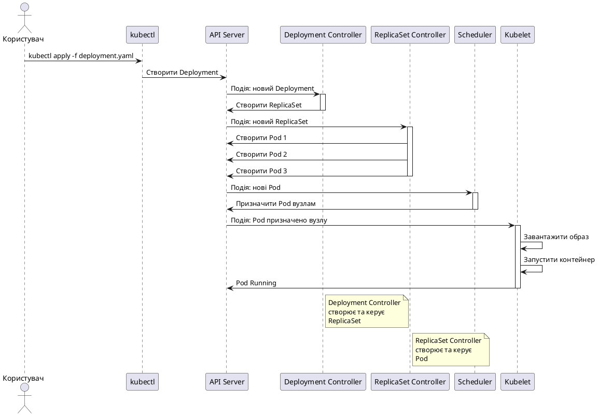
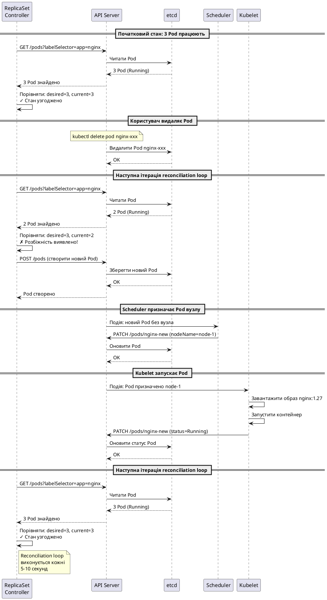
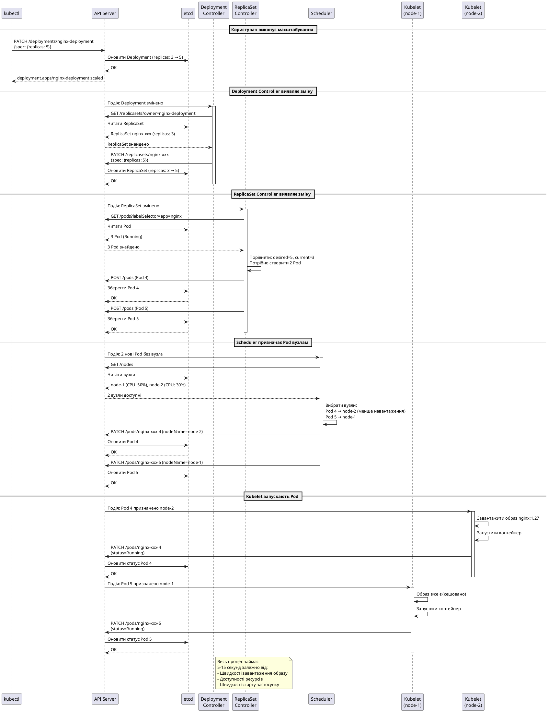
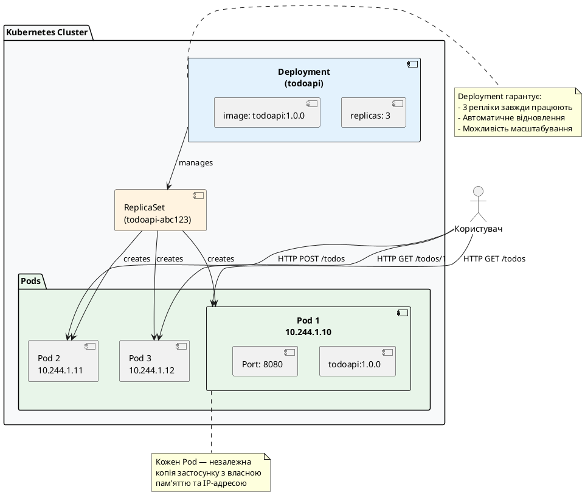
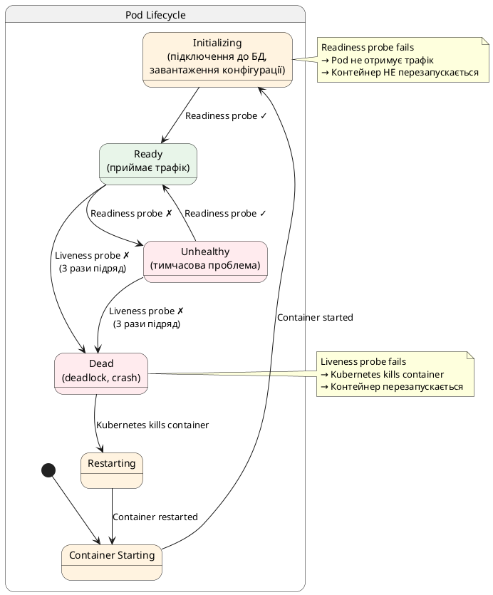

# Deployment — декларативне управління Pod

## Проблема: чому Pod не підходить для production

У попередніх статтях ми детально вивчили Pod — атомарну одиницю Kubernetes. Ми навчилися створювати Pod, налаштовувати контейнери, використовувати volumes, init-контейнери та sidecar-патерни. Але наприкінці статті про Pod ми зробили важливий висновок: **Pod не слід створювати напряму у production**.

Чому? Давайте розглянемо типовий сценарій розгортання веб-застосунку.

### Сценарій: розгортання ASP.NET Core Web API

Уявіть, що ви розгортаєте ASP.NET Core Web API у Kubernetes. Ваші вимоги:

1. **Три репліки** для балансування навантаження та відмовостійкості
2. **Автоматичне відновлення** — якщо одна репліка падає, система має створити нову автоматично
3. **Оновлення без downtime** — нова версія застосунку має розгортатись поступово, без зупинки сервісу
4. **Можливість rollback** — якщо нова версія має критичний баг, потрібно швидко повернутись до попередньої версії
5. **Масштабування** — можливість швидко збільшити або зменшити кількість реплік залежно від навантаження

Якби ви використовували Pod напряму, вам довелося б:

::terminal-preview{title="Ручне управління Pod"}

<div class="line"><span class="opacity-40"># Створити 3 Pod вручну</span></div>
<div class="line"><span class="opacity-40">$</span> <strong>kubectl apply -f api-pod-1.yaml</strong></div>
<div class="line"><span class="opacity-40">$</span> <strong>kubectl apply -f api-pod-2.yaml</strong></div>
<div class="line"><span class="opacity-40">$</span> <strong>kubectl apply -f api-pod-3.yaml</strong></div>
<div class="line"></div>
<div class="line"><span class="opacity-40"># Постійно моніторити їхній стан</span></div>
<div class="line"><span class="opacity-40">$</span> <strong>kubectl get pods -w</strong></div>
<div class="line"></div>
<div class="line"><span class="opacity-40"># Якщо один Pod впав — вручну створити новий</span></div>
<div class="line"><span class="opacity-40">$</span> <strong>kubectl apply -f api-pod-1.yaml</strong></div>
<div class="line"></div>
<div class="line"><span class="opacity-40"># Для оновлення — видалити старі та створити нові (з downtime!)</span></div>
<div class="line"><span class="opacity-40">$</span> <strong>kubectl delete pod api-pod-1 api-pod-2 api-pod-3</strong></div>
<div class="line"><span class="opacity-40">$</span> <strong>kubectl apply -f api-pod-1-v2.yaml</strong></div>
<div class="line"><span class="opacity-40">$</span> <strong>kubectl apply -f api-pod-2-v2.yaml</strong></div>
<div class="line"><span class="opacity-40">$</span> <strong>kubectl apply -f api-pod-3-v2.yaml</strong></div>

::

**Проблеми цього підходу:**

::card-group

::card{title="Немає self-healing" icon="i-heroicons-x-circle"}
Якщо Pod падає або вузол виходить з ладу — Pod просто зникає. Kubernetes не створить новий автоматично. Вам потрібно вручну моніторити стан та відновлювати Pod.
::

::card{title="Немає масштабування" icon="i-heroicons-arrows-pointing-out"}
Щоб збільшити кількість реплік з 3 до 5, потрібно вручну створити 2 нові Pod. Щоб зменшити — вручну видалити зайві. Немає автоматизації.
::

::card{title="Downtime при оновленні" icon="i-heroicons-arrow-down-circle"}
Щоб оновити версію застосунку, потрібно спочатку видалити всі старі Pod, потім створити нові. Є момент, коли жоден Pod не працює — це downtime.
::

::card{title="Немає історії версій" icon="i-heroicons-clock"}
Якщо нова версія має баг, немає простого способу повернутись до попередньої. Доведеться вручну змінювати маніфести та застосовувати знову.
::

::card{title="Ручна робота" icon="i-heroicons-wrench"}
Кожна операція вимагає вашого втручання. Це не масштабується — якщо у вас 10 застосунків по 5 реплік кожен, це 50 Pod для ручного управління.
::

::

Це неприйнятно для production. Саме тому існує **Deployment**.

### Що потрібно замість ручного управління

Нам потрібен механізм, який:

1. **Автоматично підтримує задану кількість реплік** — якщо Pod падає, система сама створює новий
2. **Дозволяє декларативно описати бажаний стан** — "хочу 3 репліки версії 1.0.0", а система сама досягає цього стану
3. **Виконує оновлення без downtime** — поступово замінює старі Pod новими, завжди залишаючи працюючі репліки
4. **Зберігає історію версій** — можна швидко повернутись до попередньої версії однією командою
5. **Легко масштабується** — змінити кількість реплік можна однією командою або автоматично

Саме це і робить **Deployment**.

---

## Що таке Deployment: формальне визначення

**Deployment** — це ресурс Kubernetes, який забезпечує **декларативне управління** набором ідентичних Pod. Ви описуєте **бажаний стан** (скільки реплік, яка версія образу, які ресурси), а Kubernetes **автоматично** підтримує цей стан.

::note
**Ключова ідея:** Deployment працює за принципом **reconciliation loop** (цикл узгодження). Kubernetes постійно порівнює **бажаний стан** (описаний у YAML) з **поточним станом** (що насправді працює в кластері) та виконує дії для усунення розбіжностей.

Приклад: Ви вказали `replicas: 3`, але працює лише 2 Pod (один впав). Deployment Controller виявляє розбіжність та створює третій Pod. Ви нічого не робите вручну — система сама усуває проблему.
::

### Основні можливості Deployment

::card-group

::card{title="Self-healing" icon="i-heroicons-arrow-path"}
Якщо Pod видаляється, падає або вузол виходить з ладу — Deployment автоматично створює новий Pod, підтримуючи задану кількість реплік. Це відбувається без вашого втручання.
::

::card{title="Декларативне масштабування" icon="i-heroicons-arrows-pointing-out"}
Змінити кількість реплік можна однією командою (`kubectl scale`) або редагуванням YAML. Kubernetes сам створить або видалить Pod для досягнення бажаної кількості.
::

::card{title="Rolling Updates" icon="i-heroicons-arrow-up-circle"}
Оновлення відбувається поступово: нові Pod створюються, перевіряються на готовність, і лише після цього старі видаляються. Завжди є працюючі репліки — немає downtime.
::

::card{title="Rollback" icon="i-heroicons-arrow-uturn-left"}
Kubernetes зберігає історію версій Deployment (за замовчуванням 10 останніх). Повернутись до попередньої версії можна однією командою `kubectl rollout undo`.
::

::card{title="Версіонування" icon="i-heroicons-document-duplicate"}
Кожна зміна у специфікації Pod (образ, змінні оточення, ресурси) створює нову ревізію. Ви можете переглянути історію та повернутись до будь-якої версії.
::

::

### Архітектура: Deployment → ReplicaSet → Pod

Deployment не створює Pod напряму. Він використовує проміжний ресурс — **ReplicaSet**:

::plant-uml



::

**Чому потрібен ReplicaSet?**

ReplicaSet відповідає за **підтримку заданої кількості реплік**. Його єдине завдання — гарантувати, що завжди працює рівно `N` Pod з певним шаблоном.

Deployment використовує ReplicaSet для реалізації **rolling updates**: при оновленні створюється новий ReplicaSet з новим шаблоном Pod, а старий поступово зменшується до нуля. Це дозволяє виконувати оновлення без downtime.

::warning
**Важливо:** Ви **ніколи** не створюєте ReplicaSet напряму. Завжди використовуйте Deployment, який автоматично керує ReplicaSet. Пряме створення ReplicaSet позбавляє вас можливості rolling updates та rollback.
::

---

## Анатомія Deployment: структура YAML

Тепер розглянемо, як описати Deployment у YAML. Почнемо з мінімального прикладу та поступово додаватимемо поля.

### Мінімальний Deployment

Найпростіший Deployment містить лише обов'язкові поля:

```yaml
apiVersion: apps/v1
kind: Deployment
metadata:
  name: nginx-deployment
spec:
  replicas: 3
  selector:
    matchLabels:
      app: nginx
  template:
    metadata:
      labels:
        app: nginx
    spec:
      containers:
        - name: nginx
          image: nginx:1.27
```

Розберемо кожне поле детально.

::field-group

::field{name="apiVersion" type="string" required="true"}
Для Deployment використовується `apps/v1` (не просто `v1`, як для Pod). Це означає, що Deployment належить до групи API `apps`. Ця група містить ресурси для управління застосунками: Deployment, StatefulSet, DaemonSet, ReplicaSet.
::

::field{name="kind" type="string" required="true"}
Тип ресурсу — `Deployment`. Це вказує Kubernetes, що ви створюєте саме Deployment, а не Pod або інший ресурс.
::

::field{name="metadata.name" type="string" required="true"}
Унікальне ім'я Deployment у межах namespace. Має відповідати DNS-стандарту: малі літери, цифри, дефіси. Максимум 253 символи. Це ім'я буде використовуватись у командах `kubectl` та як префікс для імен ReplicaSet та Pod.
::

::field{name="spec.replicas" type="integer" default="1"}
Бажана кількість реплік Pod. Deployment Controller постійно підтримує саме цю кількість. Якщо Pod падає — створюється новий. Якщо реплік більше, ніж задано — зайві видаляються. Якщо не вказано — за замовчуванням створюється 1 репліка.
::

::field{name="spec.selector" type="object" required="true"}
Селектор для вибору Pod, якими керує цей Deployment. **Критично важливо:** мітки у `selector.matchLabels` мають **точно збігатись** з мітками у `template.metadata.labels`. Якщо мітки не збігаються — Deployment не зможе знайти свої Pod і буде постійно створювати нові.
::

::field{name="spec.selector.matchLabels" type="map" required="true"}
Набір міток (key-value пар), за якими Deployment ідентифікує свої Pod. Deployment вибирає всі Pod, які мають **всі** вказані мітки. Наприклад, `app: nginx` означає "вибрати всі Pod з міткою `app=nginx`".
::

::field{name="spec.template" type="object" required="true"}
Шаблон Pod, який буде створюватись Deployment. Це **повна специфікація Pod** (як у статті про Pod), але без полів `apiVersion` та `kind`. Всі Pod, створені цим Deployment, будуть ідентичними копіями цього шаблону.
::

::field{name="spec.template.metadata.labels" type="map" required="true"}
Мітки, які будуть додані до кожного створеного Pod. **Мають збігатись** з `spec.selector.matchLabels`. Це критично важливо для роботи Deployment.
::

::field{name="spec.template.spec" type="object" required="true"}
Специфікація Pod — контейнери, volumes, init-контейнери тощо. Це те саме поле `spec`, яке ви використовували при створенні Pod напряму. Всі поля з статті про Pod доступні тут.
::

::

### Важливість selector та labels

Зв'язок між `selector` та `template.metadata.labels` — це **найважливіша** частина Deployment. Давайте розберемо детально:

```yaml
spec:
  selector:
    matchLabels:
      app: nginx  # ← Deployment шукає Pod з цією міткою
  template:
    metadata:
      labels:
        app: nginx  # ← Pod створюються з цією міткою
```

**Що відбувається:**

1. Deployment створює Pod з міткою `app: nginx` (з `template.metadata.labels`)
2. Deployment Controller постійно шукає Pod з міткою `app: nginx` (через `selector.matchLabels`)
3. Якщо знайдено менше Pod, ніж `replicas` — створює нові
4. Якщо знайдено більше Pod, ніж `replicas` — видаляє зайві

**Типова помилка новачків:**

```yaml
spec:
  selector:
    matchLabels:
      app: nginx  # ← Шукає Pod з app=nginx
  template:
    metadata:
      labels:
        app: web  # ← Створює Pod з app=web (ПОМИЛКА!)
```

У цьому випадку Deployment створить Pod з міткою `app: web`, але шукатиме Pod з міткою `app: nginx`. Він не знайде жодного Pod і буде **нескінченно створювати нові**, бо вважатиме, що реплік недостатньо.

::warning
**Критично важливо:** Мітки у `selector.matchLabels` та `template.metadata.labels` мають **точно збігатись**. Це не рекомендація — це вимога. Kubernetes навіть не дозволить створити Deployment з неспівпадаючими мітками (отримаєте помилку валідації).
::

### Повна специфікація Deployment

Тепер розглянемо всі доступні поля Deployment. Почнемо з базових, потім перейдемо до розширених.

#### Базові поля (обов'язкові та найчастіше використовувані)

```yaml
apiVersion: apps/v1
kind: Deployment
metadata:
  name: myapp-deployment
  namespace: default
  labels:
    app: myapp
    version: "1.0"
  annotations:
    description: "My application deployment"
spec:
  replicas: 3
  selector:
    matchLabels:
      app: myapp
  template:
    metadata:
      labels:
        app: myapp
        version: "1.0"
    spec:
      containers:
        - name: app
          image: mcr.microsoft.com/dotnet/samples:aspnetapp
          ports:
            - containerPort: 8080
          env:
            - name: ENV
              value: "production"
          resources:
            requests:
              memory: "128Mi"
              cpu: "100m"
            limits:
              memory: "256Mi"
              cpu: "500m"
```

::field-group

::field{name="metadata.namespace" type="string" default="default"}
Namespace, у якому буде створено Deployment. Якщо не вказано — використовується `default`. Namespace — це спосіб ізоляції ресурсів у Kubernetes. Різні команди або проєкти можуть мати свої namespace.
::

::field{name="metadata.labels" type="map"}
Мітки для самого Deployment (не для Pod!). Використовуються для організації та фільтрації Deployment. Наприклад, можна додати мітку `team: backend` та потім знайти всі Deployment команди backend через `kubectl get deployments -l team=backend`.
::

::field{name="metadata.annotations" type="map"}
Анотації — це довільні метадані, які не використовуються для вибору ресурсів (на відміну від labels). Використовуються для зберігання додаткової інформації: опис, посилання на документацію, контакти відповідальної особи тощо.
::

::

#### Розширені поля: стратегія оновлення

```yaml
spec:
  strategy:
    type: RollingUpdate
    rollingUpdate:
      maxUnavailable: 1
      maxSurge: 1
```

::field-group

::field{name="spec.strategy" type="object"}
Стратегія оновлення Pod при зміні `spec.template`. Визначає, як Kubernetes замінює старі Pod новими. Є два типи: `RollingUpdate` (за замовчуванням) та `Recreate`.
::

::field{name="spec.strategy.type" type="string" default="RollingUpdate"}
Тип стратегії оновлення:
- `RollingUpdate` — поступове оновлення: нові Pod створюються, старі видаляються. Завжди є працюючі репліки.
- `Recreate` — спочатку видаляються всі старі Pod, потім створюються нові. Є момент downtime.
::

::field{name="spec.strategy.rollingUpdate.maxUnavailable" type="integer | string" default="25%"}
Максимальна кількість Pod, які можуть бути **недоступними** під час оновлення. Може бути абсолютним числом (`1`, `2`) або відсотком від `replicas` (`25%`, `50%`).

**Приклад:** Якщо `replicas: 10` та `maxUnavailable: 2`, то під час оновлення мінімум 8 Pod мають бути доступними (`10 - 2 = 8`).

**Приклад з відсотком:** Якщо `replicas: 10` та `maxUnavailable: 25%`, то під час оновлення мінімум 7-8 Pod мають бути доступними (25% від 10 = 2.5, округлюється вниз до 2, тому `10 - 2 = 8`).
::

::field{name="spec.strategy.rollingUpdate.maxSurge" type="integer | string" default="25%"}
Максимальна кількість **додаткових** Pod, які можуть бути створені понад `replicas` під час оновлення. Може бути абсолютним числом або відсотком.

**Приклад:** Якщо `replicas: 10` та `maxSurge: 2`, то під час оновлення максимум 12 Pod можуть існувати одночасно (`10 + 2 = 12`).

**Навіщо це потрібно:** Додаткові Pod дозволяють швидше виконати оновлення. Нові Pod створюються паралельно зі старими, і лише після того, як нові стануть готовими, старі видаляються.
::

::

::tip
**Як вибрати maxUnavailable та maxSurge:**

- **Швидке оновлення, більше ресурсів:** `maxUnavailable: 0`, `maxSurge: 50%` — створюються багато нових Pod одразу, старі видаляються лише після готовності нових. Потребує більше ресурсів (CPU, пам'ять).
- **Повільне оновлення, менше ресурсів:** `maxUnavailable: 25%`, `maxSurge: 0` — старі Pod видаляються, потім створюються нові. Економить ресурси, але оновлення триватиме довше.
- **Збалансований підхід (за замовчуванням):** `maxUnavailable: 25%`, `maxSurge: 25%` — компроміс між швидкістю та ресурсами.
::

#### Розширені поля: контроль життєвого циклу

```yaml
spec:
  revisionHistoryLimit: 10
  progressDeadlineSeconds: 600
  minReadySeconds: 0
  paused: false
```

::field-group

::field{name="spec.revisionHistoryLimit" type="integer" default="10"}
Кількість старих ReplicaSet, які зберігаються для можливості rollback. Кожна зміна у `spec.template` створює нову ревізію (новий ReplicaSet). Старі ReplicaSet зберігаються з `replicas: 0` для історії. Якщо встановити `0` — rollback буде неможливий.
::

::field{name="spec.progressDeadlineSeconds" type="integer" default="600"}
Максимальний час (у секундах), протягом якого Deployment має досягти прогресу під час оновлення. Якщо за цей час жоден новий Pod не стане готовим — оновлення вважається невдалим, і Deployment отримає статус `Progressing: False` з причиною `ProgressDeadlineExceeded`.

**Навіщо це потрібно:** Запобігає ситуації, коли оновлення "зависає" нескінченно (наприклад, новий образ не може завантажитись або Pod не проходить health checks).
::

::field{name="spec.minReadySeconds" type="integer" default="0"}
Мінімальний час (у секундах), протягом якого новий Pod має бути готовим (без падінь) перед тим, як він вважатиметься доступним. Це додаткова перевірка стабільності.

**Приклад:** Якщо `minReadySeconds: 30`, то після того, як Pod стане `Ready`, Kubernetes чекатиме ще 30 секунд. Якщо за цей час Pod не впаде — він вважається доступним і оновлення продовжується. Якщо впаде — оновлення призупиняється.

**Навіщо це потрібно:** Запобігає ситуації, коли Pod стартує успішно, але падає через кілька секунд (наприклад, через помилку підключення до бази даних).
::

::field{name="spec.paused" type="boolean" default="false"}
Якщо `true` — Deployment призупинено. Зміни у `spec.template` не застосовуються автоматично. Використовується для ручного контролю оновлень (canary deployments). Щоб продовжити оновлення, потрібно встановити `paused: false`.
::

::
### Повний приклад з усіма полями

Тепер об'єднаємо все, що ми вивчили, в один Deployment з усіма важливими полями:

```yaml
apiVersion: apps/v1
kind: Deployment
metadata:
  name: myapp-deployment
  namespace: default
  labels:
    app: myapp
    tier: backend
    version: "1.0"
  annotations:
    description: "Production deployment for MyApp API"
    contact: "backend-team@example.com"
spec:
  # Кількість реплік
  replicas: 3
  
  # Селектор для вибору Pod
  selector:
    matchLabels:
      app: myapp
  
  # Стратегія оновлення
  strategy:
    type: RollingUpdate
    rollingUpdate:
      maxUnavailable: 1
      maxSurge: 1
  
  # Контроль життєвого циклу
  revisionHistoryLimit: 10
  progressDeadlineSeconds: 600
  minReadySeconds: 5
  
  # Шаблон Pod
  template:
    metadata:
      labels:
        app: myapp
        version: "1.0"
    spec:
      containers:
        - name: app
          image: mcr.microsoft.com/dotnet/samples:aspnetapp
          ports:
            - containerPort: 8080
              name: http
          env:
            - name: ASPNETCORE_ENVIRONMENT
              value: "Production"
          resources:
            requests:
              memory: "128Mi"
              cpu: "100m"
            limits:
              memory: "256Mi"
              cpu: "500m"
```

Цей Deployment:
- Створює 3 репліки Pod з образом `mcr.microsoft.com/dotnet/samples:aspnetapp`
- Використовує rolling update з обережними налаштуваннями (максимум 1 недоступний Pod)
- Зберігає історію 10 останніх версій для rollback
- Чекає 5 секунд після готовності Pod перед продовженням оновлення
- Має таймаут 600 секунд для оновлення

---

## Створення першого Deployment

Тепер створимо реальний Deployment та подивимося, як він працює.

### Крок 1: Створення YAML маніфесту

Створіть файл `nginx-deployment.yaml`:

```yaml
apiVersion: apps/v1
kind: Deployment
metadata:
  name: nginx-deployment
  labels:
    app: nginx
spec:
  replicas: 3
  selector:
    matchLabels:
      app: nginx
  template:
    metadata:
      labels:
        app: nginx
    spec:
      containers:
        - name: nginx
          image: nginx:1.27
          ports:
            - containerPort: 80
```

### Крок 2: Застосування маніфесту

Застосуйте маніфест до кластера:

::terminal-preview{title="kubectl apply"}

<div class="line"><span class="opacity-40">$</span> <strong>kubectl apply -f nginx-deployment.yaml</strong></div>
<div class="line"><span class="text-green-400">deployment.apps/nginx-deployment created</span></div>

::

### Крок 3: Перевірка створеного Deployment

Переглянемо список Deployment:

::terminal-preview{title="kubectl get deployments"}

<div class="line"><span class="opacity-40">$</span> <strong>kubectl get deployments</strong></div>
<div class="line">NAME               READY   UP-TO-DATE   AVAILABLE   AGE</div>
<div class="line">nginx-deployment   3/3     3            3           15s</div>

::

**Що означають колонки:**

- **NAME**: Ім'я Deployment (з `metadata.name`)
- **READY**: `3/3` — 3 з 3 реплік готові до роботи (стан `Ready`)
- **UP-TO-DATE**: `3` — 3 репліки відповідають поточній версії шаблону (актуальний образ, змінні оточення тощо)
- **AVAILABLE**: `3` — 3 репліки доступні для обслуговування трафіку (пройшли readiness probe, якщо він налаштований)
- **AGE**: Час з моменту створення Deployment

### Крок 4: Перевірка створених Pod

Deployment автоматично створив Pod. Подивимося на них:

::terminal-preview{title="kubectl get pods"}

<div class="line"><span class="opacity-40">$</span> <strong>kubectl get pods</strong></div>
<div class="line">NAME                                READY   STATUS    RESTARTS   AGE</div>
<div class="line">nginx-deployment-7d6b8c9f4d-8xk2p   1/1     Running   0          20s</div>
<div class="line">nginx-deployment-7d6b8c9f4d-m5n7q   1/1     Running   0          20s</div>
<div class="line">nginx-deployment-7d6b8c9f4d-z9w3r   1/1     Running   0          20s</div>

::

**Структура імені Pod:**

Ім'я Pod складається з трьох частин: `nginx-deployment-7d6b8c9f4d-8xk2p`

1. `nginx-deployment` — ім'я Deployment
2. `7d6b8c9f4d` — хеш ReplicaSet (унікальний ідентифікатор версії шаблону Pod)
3. `8xk2p` — унікальний суфікс Pod (генерується випадково)

Це дозволяє легко ідентифікувати, до якого Deployment належить Pod, та яку версію шаблону він використовує.

### Крок 5: Детальна інформація про Deployment

Переглянемо детальну інформацію:

::terminal-preview{title="kubectl describe deployment"}

<div class="line"><span class="opacity-40">$</span> <strong>kubectl describe deployment nginx-deployment</strong></div>
<div class="line">Name:                   nginx-deployment</div>
<div class="line">Namespace:              default</div>
<div class="line">CreationTimestamp:      Fri, 09 May 2026 20:20:00 +0000</div>
<div class="line">Labels:                 app=nginx</div>
<div class="line">Selector:               app=nginx</div>
<div class="line">Replicas:               3 desired | 3 updated | 3 total | 3 available</div>
<div class="line">StrategyType:           RollingUpdate</div>
<div class="line">MinReadySeconds:        0</div>
<div class="line">RollingUpdateStrategy:  25% max unavailable, 25% max surge</div>
<div class="line">Pod Template:</div>
<div class="line">  Labels:  app=nginx</div>
<div class="line">  Containers:</div>
<div class="line">   nginx:</div>
<div class="line">    Image:        nginx:1.27</div>
<div class="line">    Port:         80/TCP</div>
<div class="line">Conditions:</div>
<div class="line">  Type           Status  Reason</div>
<div class="line">  ----           ------  ------</div>
<div class="line">  Available      True    MinimumReplicasAvailable</div>
<div class="line">  Progressing    True    NewReplicaSetAvailable</div>
<div class="line">Events:</div>
<div class="line">  Type    Reason             Age   Message</div>
<div class="line">  ----    ------             ----  -------</div>
<div class="line">  Normal  ScalingReplicaSet  30s   Scaled up replica set nginx-deployment-7d6b8c9f4d to 3</div>

::

Тут ви бачите:
- Конфігурацію Deployment (replicas, selector, strategy)
- Шаблон Pod (образ, порти)
- Умови (Conditions) — стан Deployment
- Події (Events) — що відбувалося з Deployment (створення ReplicaSet, масштабування)

---

## ReplicaSet: проміжний шар між Deployment та Pod

Ми згадували, що Deployment не створює Pod напряму. Він використовує **ReplicaSet**. Давайте розберемося детально, що це і навіщо.

### Що таке ReplicaSet

**ReplicaSet** — це ресурс Kubernetes, який забезпечує **підтримку заданої кількості ідентичних Pod**. Його єдине завдання — гарантувати, що завжди працює рівно `N` Pod з певним шаблоном.

Коли ви створюєте Deployment, він автоматично створює ReplicaSet:

::plant-uml



::

### Навіщо потрібен ReplicaSet

ReplicaSet виконує дві ключові функції:

1. **Підтримка кількості реплік** — якщо Pod падає, ReplicaSet створює новий
2. **Версіонування для rolling updates** — при оновленні Deployment створює новий ReplicaSet, а старий залишається для rollback

Переглянемо ReplicaSet, створений нашим Deployment:

::terminal-preview{title="kubectl get replicasets"}

<div class="line"><span class="opacity-40">$</span> <strong>kubectl get replicasets</strong></div>
<div class="line">NAME                          DESIRED   CURRENT   READY   AGE</div>
<div class="line">nginx-deployment-7d6b8c9f4d   3         3         3       2m</div>

::

**Що означають колонки:**

- **NAME**: Ім'я ReplicaSet (ім'я Deployment + хеш шаблону Pod)
- **DESIRED**: Бажана кількість Pod (з `spec.replicas` Deployment)
- **CURRENT**: Поточна кількість Pod (скільки насправді існує)
- **READY**: Кількість готових Pod (стан `Ready`)
- **AGE**: Час з моменту створення ReplicaSet

::note
**Важливо:** Ви **ніколи** не створюєте ReplicaSet напряму. Завжди використовуйте Deployment. Пряме створення ReplicaSet позбавляє вас можливості:
- Rolling updates (поступового оновлення)
- Rollback (повернення до попередньої версії)
- Історії версій

ReplicaSet — це низькорівневий примітив, на якому будується Deployment. Використовуйте Deployment для управління застосунками.
::

---

## Self-healing у дії

Тепер продемонструємо головну перевагу Deployment — **автоматичне відновлення** (self-healing).

### Експеримент: видалення Pod

Видалимо один Pod вручну та подивимося, що станеться:

::terminal-preview{title="kubectl delete pod"}

<div class="line"><span class="opacity-40">$</span> <strong>kubectl delete pod nginx-deployment-7d6b8c9f4d-8xk2p</strong></div>
<div class="line">pod "nginx-deployment-7d6b8c9f4d-8xk2p" deleted</div>

::

Одразу перевіримо список Pod:

::terminal-preview{title="kubectl get pods"}

<div class="line"><span class="opacity-40">$</span> <strong>kubectl get pods</strong></div>
<div class="line">NAME                                READY   STATUS              RESTARTS   AGE</div>
<div class="line">nginx-deployment-7d6b8c9f4d-m5n7q   1/1     Running             0          3m</div>
<div class="line">nginx-deployment-7d6b8c9f4d-z9w3r   1/1     Running             0          3m</div>
<div class="line">nginx-deployment-7d6b8c9f4d-p4k8t   0/1     ContainerCreating   0          2s</div>

::

Бачимо новий Pod з іменем `p4k8t` у стані `ContainerCreating`. Що сталося?

1. Ми видалили Pod `8xk2p`
2. ReplicaSet Controller виявив, що реплік менше, ніж задано (`2 < 3`)
3. ReplicaSet автоматично створив новий Pod `p4k8t`
4. Scheduler призначив Pod вузлу
5. Kubelet завантажує образ та запускає контейнер

Через кілька секунд:

::terminal-preview{title="kubectl get pods (через 10 секунд)"}

<div class="line"><span class="opacity-40">$</span> <strong>kubectl get pods</strong></div>
<div class="line">NAME                                READY   STATUS    RESTARTS   AGE</div>
<div class="line">nginx-deployment-7d6b8c9f4d-m5n7q   1/1     Running   0          3m15s</div>
<div class="line">nginx-deployment-7d6b8c9f4d-z9w3r   1/1     Running   0          3m15s</div>
<div class="line">nginx-deployment-7d6b8c9f4d-p4k8t   1/1     Running   0          15s</div>

::

Знову три репліки! Це і є **self-healing** — система сама усуває розбіжності між бажаним станом (`replicas: 3`) та поточним станом (2 працюючі Pod).

::tip
**Reconciliation Loop (цикл узгодження):**

Deployment Controller та ReplicaSet Controller працюють за принципом reconciliation loop:

1. Читають бажаний стан з API Server (`spec.replicas: 3`)
2. Читають поточний стан з API Server (скільки Pod насправді працює)
3. Порівнюють бажаний та поточний стан
4. Якщо є розбіжності — виконують дії для їх усунення (створюють або видаляють Pod)
5. Повторюють цикл кожні кілька секунд

Це фундаментальний принцип роботи Kubernetes — **декларативне управління** через постійне узгодження стану.
::

### Візуалізація reconciliation loop

Давайте детально розглянемо, як працює цикл узгодження при видаленні Pod:

::plant-uml



::

**Ключові моменти:**

1. **Постійний моніторинг** — ReplicaSet Controller не чекає на події. Він постійно (кожні 5-10 секунд) перевіряє стан Pod.
2. **Декларативність** — контролер не знає, чому Pod зникли (видалення, збій вузла, OOMKilled). Він просто бачить розбіжність між бажаним та поточним станом і усуває її.
3. **Ідемпотентність** — якщо стан уже узгоджено, контролер нічого не робить. Це безпечно викликати reconciliation багато разів.
4. **Розподілена робота** — ReplicaSet Controller створює Pod, Scheduler призначає вузол, Kubelet запускає контейнер. Кожен компонент відповідає за свою частину.

---

## Масштабування Deployment

Одна з найважливіших можливостей Deployment — **масштабування** (scaling). Це зміна кількості реплік Pod для адаптації до навантаження.

### Навіщо потрібне масштабування

Уявіть, що ваш веб-застосунок отримує різне навантаження протягом дня:

- **Ніч (02:00-06:00):** 100 запитів/хвилину — достатньо 2 реплік
- **День (09:00-18:00):** 1000 запитів/хвилину — потрібно 5 реплік
- **Пікове навантаження (12:00-13:00):** 5000 запитів/хвилину — потрібно 10 реплік

Без масштабування вам довелося б постійно тримати 10 реплік, витрачаючи ресурси навіть коли вони не потрібні. З масштабуванням ви можете динамічно змінювати кількість реплік.

### Три способи масштабування

Kubernetes надає три способи змінити кількість реплік Deployment:

::card-group

::card{title="1. Команда kubectl scale" icon="i-heroicons-command-line"}
Найшвидший спосіб — одна команда. Ідеально для ручного масштабування або експериментів.
::

::card{title="2. Редагування YAML та kubectl apply" icon="i-heroicons-document-text"}
Декларативний підхід — змінюєте файл, застосовуєте. Зміни зберігаються у версійному контролі (Git).
::

::card{title="3. Команда kubectl edit" icon="i-heroicons-pencil"}
Інтерактивне редагування — відкриває редактор з поточною конфігурацією. Зручно для швидких змін без локальних файлів.
::

::

Розглянемо кожен спосіб детально.

---

### Спосіб 1: kubectl scale

Найпростіший спосіб — команда `kubectl scale`:

::terminal-preview{title="kubectl scale"}

<div class="line"><span class="opacity-40">$</span> <strong>kubectl scale deployment nginx-deployment --replicas=5</strong></div>
<div class="line"><span class="text-green-400">deployment.apps/nginx-deployment scaled</span></div>

::

Перевіримо результат:

::terminal-preview{title="kubectl get pods"}

<div class="line"><span class="opacity-40">$</span> <strong>kubectl get pods</strong></div>
<div class="line">NAME                                READY   STATUS              RESTARTS   AGE</div>
<div class="line">nginx-deployment-7d6b8c9f4d-m5n7q   1/1     Running             0          10m</div>
<div class="line">nginx-deployment-7d6b8c9f4d-z9w3r   1/1     Running             0          10m</div>
<div class="line">nginx-deployment-7d6b8c9f4d-p4k8t   1/1     Running             0          7m</div>
<div class="line">nginx-deployment-7d6b8c9f4d-x2n9k   0/1     ContainerCreating   0          2s</div>
<div class="line">nginx-deployment-7d6b8c9f4d-q7m4p   0/1     ContainerCreating   0          2s</div>

::

Kubernetes створив 2 нові Pod (`x2n9k` та `q7m4p`) для досягнення бажаної кількості 5 реплік.

Через кілька секунд:

::terminal-preview{title="kubectl get pods (через 10 секунд)"}

<div class="line"><span class="opacity-40">$</span> <strong>kubectl get pods</strong></div>
<div class="line">NAME                                READY   STATUS    RESTARTS   AGE</div>
<div class="line">nginx-deployment-7d6b8c9f4d-m5n7q   1/1     Running   0          10m</div>
<div class="line">nginx-deployment-7d6b8c9f4d-z9w3r   1/1     Running   0          10m</div>
<div class="line">nginx-deployment-7d6b8c9f4d-p4k8t   1/1     Running   0          7m</div>
<div class="line">nginx-deployment-7d6b8c9f4d-x2n9k   1/1     Running   0          15s</div>
<div class="line">nginx-deployment-7d6b8c9f4d-q7m4p   1/1     Running   0          15s</div>

::

Тепер усі 5 реплік працюють.

**Зменшення кількості реплік:**

Так само легко зменшити кількість реплік:

::terminal-preview{title="kubectl scale (зменшення)"}

<div class="line"><span class="opacity-40">$</span> <strong>kubectl scale deployment nginx-deployment --replicas=2</strong></div>
<div class="line"><span class="text-green-400">deployment.apps/nginx-deployment scaled</span></div>

::

::terminal-preview{title="kubectl get pods"}

<div class="line"><span class="opacity-40">$</span> <strong>kubectl get pods</strong></div>
<div class="line">NAME                                READY   STATUS        RESTARTS   AGE</div>
<div class="line">nginx-deployment-7d6b8c9f4d-m5n7q   1/1     Running       0          12m</div>
<div class="line">nginx-deployment-7d6b8c9f4d-z9w3r   1/1     Running       0          12m</div>
<div class="line">nginx-deployment-7d6b8c9f4d-p4k8t   1/1     Terminating   0          9m</div>
<div class="line">nginx-deployment-7d6b8c9f4d-x2n9k   1/1     Terminating   0          2m</div>
<div class="line">nginx-deployment-7d6b8c9f4d-q7m4p   1/1     Terminating   0          2m</div>

::

Kubernetes видаляє 3 зайві Pod. Статус `Terminating` означає, що Pod отримав сигнал завершення (SIGTERM) і має 30 секунд (за замовчуванням) для graceful shutdown.

::note
**Який Pod буде видалено першим?**

Kubernetes використовує наступний порядок пріоритетів при виборі Pod для видалення:

1. **Unscheduled Pod** (ще не призначені вузлу) — видаляються першими
2. **Pending Pod** (чекають на ресурси) — наступні
3. **Running Pod на вузлах з більшою кількістю реплік** — для балансування навантаження
4. **Новіші Pod** (за часом створення) — старіші Pod зберігаються, бо вони довше працюють без проблем

Це гарантує, що масштабування не порушить балансування навантаження та стабільність.
::

**Переваги kubectl scale:**

- **Швидкість** — одна команда, миттєвий результат
- **Простота** — не потрібно редагувати файли
- **Ідеально для експериментів** — швидко збільшити/зменшити репліки для тестування

**Недоліки kubectl scale:**

- **Не зберігається у Git** — зміна не відображена у YAML файлах
- **Можна забути** — якщо пізніше застосуєте старий YAML з `replicas: 3`, масштабування скасується
- **Не підходить для production** — краще використовувати декларативний підхід (YAML)

---

### Спосіб 2: Редагування YAML та kubectl apply

Декларативний підхід — змінюєте YAML файл та застосовуєте його:

**Крок 1:** Відкрийте `nginx-deployment.yaml` та змініть `replicas`:

```yaml
apiVersion: apps/v1
kind: Deployment
metadata:
  name: nginx-deployment
spec:
  replicas: 7  # ← Було 3, стало 7
  selector:
    matchLabels:
      app: nginx
  template:
    metadata:
      labels:
        app: nginx
    spec:
      containers:
        - name: nginx
          image: nginx:1.27
          ports:
            - containerPort: 80
```

**Крок 2:** Застосуйте зміни:

::terminal-preview{title="kubectl apply"}

<div class="line"><span class="opacity-40">$</span> <strong>kubectl apply -f nginx-deployment.yaml</strong></div>
<div class="line"><span class="text-green-400">deployment.apps/nginx-deployment configured</span></div>

::

Зверніть увагу на слово **configured** (а не **created**). Це означає, що Deployment уже існував, і Kubernetes застосував зміни.

**Крок 3:** Перевірте результат:

::terminal-preview{title="kubectl get deployments"}

<div class="line"><span class="opacity-40">$</span> <strong>kubectl get deployments</strong></div>
<div class="line">NAME               READY   UP-TO-DATE   AVAILABLE   AGE</div>
<div class="line">nginx-deployment   7/7     7            7           20m</div>

::

Тепер працює 7 реплік.

**Переваги kubectl apply:**

- **Декларативність** — YAML файл — це єдине джерело правди (single source of truth)
- **Версійний контроль** — зміни зберігаються у Git, можна відстежити історію
- **Відтворюваність** — можна застосувати той самий YAML на іншому кластері
- **Production-ready** — рекомендований підхід для production

**Недоліки kubectl apply:**

- **Повільніше** — потрібно редагувати файл, зберегти, застосувати
- **Потрібен локальний файл** — якщо ви на іншій машині без файлів, доведеться спочатку отримати YAML

::tip
**Best practice:** Завжди використовуйте `kubectl apply` для production. Зберігайте всі YAML файли у Git. Це дозволяє:

- Відстежувати, хто і коли змінив конфігурацію
- Повернутись до попередньої версії через `git revert`
- Автоматизувати розгортання через CI/CD (GitHub Actions, GitLab CI)
- Мати документацію інфраструктури у вигляді коду (Infrastructure as Code)
::

---

### Спосіб 3: kubectl edit

Інтерактивне редагування — відкриває редактор з поточною конфігурацією:

::terminal-preview{title="kubectl edit"}

<div class="line"><span class="opacity-40">$</span> <strong>kubectl edit deployment nginx-deployment</strong></div>
<div class="line"><span class="opacity-40"># Відкриється редактор (vim/nano) з YAML</span></div>

::

У редакторі ви побачите повну конфігурацію Deployment (включно з полями, які додав Kubernetes автоматично). Знайдіть рядок `replicas` та змініть значення:

```yaml
spec:
  replicas: 4  # ← Змініть на потрібне значення
```

Збережіть та закрийте редактор (у vim: `:wq`, у nano: `Ctrl+O`, `Ctrl+X`).

::terminal-preview{title="kubectl edit (результат)"}

<div class="line"><span class="text-green-400">deployment.apps/nginx-deployment edited</span></div>

::

Kubernetes одразу застосує зміни.

**Переваги kubectl edit:**

- **Не потрібен локальний файл** — редагуєте конфігурацію безпосередньо у кластері
- **Швидше за kubectl apply** — не потрібно шукати файл, редагувати, зберігати
- **Бачите всі поля** — включно з тими, що додав Kubernetes автоматично

**Недоліки kubectl edit:**

- **Не зберігається у Git** — зміни не відображені у локальних файлах
- **Складніше для новачків** — потрібно вміти користуватись vim/nano
- **Можна зробити помилку** — якщо випадково змінити щось інше, можна зламати Deployment

::warning
**Обережно з kubectl edit у production!**

`kubectl edit` зручний для швидких експериментів, але **не рекомендується для production**. Причини:

1. Зміни не зберігаються у Git — немає історії
2. Легко зробити помилку — випадково змінити щось інше
3. Немає code review — зміни застосовуються одразу без перевірки колегами

Використовуйте `kubectl edit` лише для debugging або швидких тестів. Для production завжди використовуйте `kubectl apply` з YAML файлами у Git.
::

---

### Порівняння способів масштабування

::card-group

::card{title="kubectl scale" icon="i-heroicons-bolt"}
**Коли використовувати:**
- Швидкі експерименти
- Тимчасове масштабування під час інциденту
- Локальна розробка (Minikube)

**Приклад:** Раптовий сплеск трафіку — швидко збільшити репліки, поки не з'ясуєте причину.
::

::card{title="kubectl apply" icon="i-heroicons-document-check"}
**Коли використовувати:**
- Production розгортання
- CI/CD pipelines
- Будь-які зміни, які мають зберігатись

**Приклад:** Планове збільшення реплік перед маркетинговою кампанією — змінюєте YAML, робите commit, застосовуєте через CI/CD.
::

::card{title="kubectl edit" icon="i-heroicons-pencil-square"}
**Коли використовувати:**
- Debugging
- Немає доступу до локальних файлів
- Швидкі тести

**Приклад:** Ви на сервері без Git репозиторію, потрібно швидко змінити конфігурацію для перевірки гіпотези.
::

::

---

### Візуалізація процесу масштабування

Давайте подивимося, що відбувається всередині Kubernetes при масштабуванні з 3 до 5 реплік:

::plant-uml



::

**Ключові етапи масштабування:**

1. **Оновлення Deployment** — користувач змінює `replicas` через kubectl
2. **Deployment Controller** — виявляє зміну та оновлює ReplicaSet
3. **ReplicaSet Controller** — виявляє розбіжність (3 < 5) та створює 2 нові Pod
4. **Scheduler** — призначає нові Pod вузлам з найменшим навантаженням
5. **Kubelet** — завантажує образи та запускає контейнери
6. **Готовність** — Pod переходять у стан `Running` та стають доступними

Весь процес повністю автоматичний — ви лише змінюєте одне число (`replicas`), а Kubernetes виконує всю роботу.

---

## Практичний приклад: ASP.NET Core TodoApi з Deployment

Тепер створимо реальний застосунок ASP.NET Core та розгорнемо його у Kubernetes через Deployment. Це буде простий TodoApi з трьома репліками.

### Архітектура застосунку

Наш TodoApi матиме наступну структуру:

::plant-uml



::

### Крок 1: Створення ASP.NET Core Minimal API

Створимо простий TodoApi з використанням ASP.NET Core Minimal API (без Entity Framework для простоти):

**Структура проєкту:**

```
TodoApi/
├── Program.cs
├── TodoApi.csproj
├── Dockerfile
└── k8s/
    └── deployment.yaml
```

**Program.cs:**

```csharp
using System.Collections.Concurrent;
using Scalar.AspNetCore;

var builder = WebApplication.CreateBuilder(args);

// Додаємо підтримку OpenAPI та Scalar
builder.Services.AddOpenApi();

// In-memory сховище (для демонстрації)
var todos = new ConcurrentDictionary<int, Todo>();
var nextId = 1;

var app = builder.Build();

// Scalar UI (доступний лише у Development)
if (app.Environment.IsDevelopment())
{
    app.MapOpenApi();
    app.MapScalarApiReference();
}

// Health check endpoint (для Kubernetes)
app.MapGet("/health", () => Results.Ok(new { status = "healthy", timestamp = DateTime.UtcNow }))
   .WithName("HealthCheck")
   .WithOpenApi();

// GET /todos - отримати всі завдання
app.MapGet("/todos", () => 
{
    var hostname = Environment.GetEnvironmentVariable("HOSTNAME") ?? "unknown";
    return Results.Ok(new 
    { 
        todos = todos.Values.ToList(),
        servedBy = hostname,
        count = todos.Count
    });
})
.WithName("GetAllTodos")
.WithOpenApi();

// GET /todos/{id} - отримати завдання за ID
app.MapGet("/todos/{id:int}", (int id) =>
{
    if (todos.TryGetValue(id, out var todo))
    {
        var hostname = Environment.GetEnvironmentVariable("HOSTNAME") ?? "unknown";
        return Results.Ok(new { todo, servedBy = hostname });
    }
    return Results.NotFound(new { error = "Todo not found", id });
})
.WithName("GetTodoById")
.WithOpenApi();

// POST /todos - створити нове завдання
app.MapPost("/todos", (CreateTodoRequest request) =>
{
    var id = Interlocked.Increment(ref nextId);
    var todo = new Todo
    {
        Id = id,
        Title = request.Title,
        IsCompleted = false,
        CreatedAt = DateTime.UtcNow
    };
    
    todos[id] = todo;
    
    var hostname = Environment.GetEnvironmentVariable("HOSTNAME") ?? "unknown";
    return Results.Created($"/todos/{id}", new { todo, servedBy = hostname });
})
.WithName("CreateTodo")
.WithOpenApi();

// PUT /todos/{id} - оновити завдання
app.MapPut("/todos/{id:int}", (int id, UpdateTodoRequest request) =>
{
    if (!todos.TryGetValue(id, out var todo))
    {
        return Results.NotFound(new { error = "Todo not found", id });
    }
    
    todo.Title = request.Title ?? todo.Title;
    todo.IsCompleted = request.IsCompleted ?? todo.IsCompleted;
    
    var hostname = Environment.GetEnvironmentVariable("HOSTNAME") ?? "unknown";
    return Results.Ok(new { todo, servedBy = hostname });
})
.WithName("UpdateTodo")
.WithOpenApi();

// DELETE /todos/{id} - видалити завдання
app.MapDelete("/todos/{id:int}", (int id) =>
{
    if (todos.TryRemove(id, out var todo))
    {
        var hostname = Environment.GetEnvironmentVariable("HOSTNAME") ?? "unknown";
        return Results.Ok(new { message = "Todo deleted", todo, servedBy = hostname });
    }
    return Results.NotFound(new { error = "Todo not found", id });
})
.WithName("DeleteTodo")
.WithOpenApi();

app.Run();

// Моделі
record Todo
{
    public int Id { get; set; }
    public required string Title { get; set; }
    public bool IsCompleted { get; set; }
    public DateTime CreatedAt { get; set; }
}

record CreateTodoRequest(string Title);
record UpdateTodoRequest(string? Title, bool? IsCompleted);
```

**TodoApi.csproj:**

```xml
<Project Sdk="Microsoft.NET.Sdk.Web">

  <PropertyGroup>
    <TargetFramework>net10.0</TargetFramework>
    <Nullable>enable</Nullable>
    <ImplicitUsings>enable</ImplicitUsings>
  </PropertyGroup>

  <ItemGroup>
    <PackageReference Include="Microsoft.AspNetCore.OpenApi" Version="10.*" />
    <PackageReference Include="Scalar.AspNetCore" Version="2.*" />
  </ItemGroup>

</Project>
```

::note
**Чому `servedBy` у відповідях?**

Кожна відповідь API містить поле `servedBy` з hostname Pod. Це дозволяє побачити, який саме Pod обробив запит. У Kubernetes кожен Pod має унікальне ім'я (наприклад, `todoapi-7d6b8c9f4d-x2n9k`), яке зберігається у змінній оточення `HOSTNAME`.

Це корисно для демонстрації балансування навантаження — ви побачите, що різні запити обробляються різними Pod.
::

### Крок 2: Створення Dockerfile

Створимо multi-stage Dockerfile для оптимізації розміру образу:

**Dockerfile:**

```dockerfile
# Stage 1: Build
FROM mcr.microsoft.com/dotnet/sdk:10.0 AS build
WORKDIR /src

# Копіюємо .csproj та відновлюємо залежності (кешування шарів)
COPY TodoApi.csproj .
RUN dotnet restore

# Копіюємо решту файлів та збираємо
COPY . .
RUN dotnet publish -c Release -o /app/publish

# Stage 2: Runtime
FROM mcr.microsoft.com/dotnet/aspnet:10.0 AS runtime
WORKDIR /app

# Створюємо non-root користувача для безпеки
RUN addgroup --system --gid 1000 appgroup && \
    adduser --system --uid 1000 --ingroup appgroup appuser

# Копіюємо зібраний застосунок
COPY --from=build /app/publish .

# Змінюємо власника файлів
RUN chown -R appuser:appgroup /app

# Перемикаємось на non-root користувача
USER appuser

# Відкриваємо порт 8080 (non-privileged port)
EXPOSE 8080

# Налаштовуємо ASP.NET Core для прослуховування на порту 8080
ENV ASPNETCORE_URLS=http://+:8080

# Запускаємо застосунок
ENTRYPOINT ["dotnet", "TodoApi.dll"]
```

::tip
**Чому multi-stage build?**

Multi-stage Dockerfile має дві стадії:

1. **Build stage** — використовує `dotnet/sdk:10.0` (розмір ~1.2 GB) для компіляції застосунку
2. **Runtime stage** — використовує `dotnet/aspnet:10.0` (розмір ~200 MB) лише з runtime

Результат: фінальний образ містить лише runtime та скомпільований застосунок, без SDK та проміжних файлів. Це зменшує розмір образу з ~1.2 GB до ~220 MB.

**Чому non-root користувач?**

Запуск контейнера від root — це ризик безпеки. Якщо зловмисник зламає застосунок, він матиме root-доступ до контейнера. Non-root користувач обмежує можливості атакуючого.

**Чому порт 8080, а не 80?**

Порти < 1024 вимагають root-привілеїв. Використання порту 8080 дозволяє запускати застосунок від non-root користувача.
::

### Крок 3: Збірка та завантаження образу у Minikube

Тепер зберемо Docker образ та завантажимо його у Minikube:

::terminal-preview{title="Збірка образу"}

<div class="line"><span class="opacity-40">$</span> <strong>cd TodoApi</strong></div>
<div class="line"></div>
<div class="line"><span class="opacity-40"># Налаштовуємо Docker для використання Minikube registry</span></div>
<div class="line"><span class="opacity-40">$</span> <strong>eval $(minikube docker-env)</strong></div>
<div class="line"></div>
<div class="line"><span class="opacity-40"># Збираємо образ</span></div>
<div class="line"><span class="opacity-40">$</span> <strong>docker build -t todoapi:1.0.0 .</strong></div>
<div class="line">[+] Building 45.2s (15/15) FINISHED</div>
<div class="line"> => [build 1/5] FROM mcr.microsoft.com/dotnet/sdk:10.0</div>
<div class="line"> => [build 2/5] COPY TodoApi.csproj .</div>
<div class="line"> => [build 3/5] RUN dotnet restore</div>
<div class="line"> => [build 4/5] COPY . .</div>
<div class="line"> => [build 5/5] RUN dotnet publish -c Release -o /app/publish</div>
<div class="line"> => [runtime 1/4] FROM mcr.microsoft.com/dotnet/aspnet:10.0</div>
<div class="line"> => [runtime 2/4] RUN addgroup --system --gid 1000 appgroup</div>
<div class="line"> => [runtime 3/4] COPY --from=build /app/publish .</div>
<div class="line"> => [runtime 4/4] RUN chown -R appuser:appgroup /app</div>
<div class="line"><span class="text-green-400"> => exporting to image</span></div>
<div class="line"><span class="text-green-400"> => => naming to docker.io/library/todoapi:1.0.0</span></div>

::

::note
**Що робить `eval $(minikube docker-env)`?**

Ця команда налаштовує ваш локальний Docker CLI для роботи з Docker daemon всередині Minikube. Після цього всі образи, які ви збираєте, зберігаються безпосередньо у Minikube, і їх не потрібно завантажувати окремо.

Без цієї команди вам довелося б:
1. Зібрати образ локально
2. Зберегти його у tar-файл
3. Завантажити у Minikube через `minikube image load`

З `eval $(minikube docker-env)` образ одразу доступний у Minikube.
::

Перевіримо, що образ створено:

::terminal-preview{title="Перевірка образу"}

<div class="line"><span class="opacity-40">$</span> <strong>docker images | grep todoapi</strong></div>
<div class="line">todoapi      1.0.0     a1b2c3d4e5f6   2 minutes ago   218MB</div>

::

### Крок 4: Створення Deployment YAML

Створимо маніфест Deployment для TodoApi:

**k8s/deployment.yaml:**

```yaml
apiVersion: apps/v1
kind: Deployment
metadata:
  name: todoapi
  labels:
    app: todoapi
    version: "1.0.0"
spec:
  # Три репліки для балансування навантаження
  replicas: 3
  
  # Селектор для вибору Pod
  selector:
    matchLabels:
      app: todoapi
  
  # Шаблон Pod
  template:
    metadata:
      labels:
        app: todoapi
        version: "1.0.0"
    spec:
      containers:
        - name: todoapi
          image: todoapi:1.0.0
          imagePullPolicy: Never  # Використовувати локальний образ (для Minikube)
          
          ports:
            - name: http
              containerPort: 8080
              protocol: TCP
          
          # Змінні оточення
          env:
            - name: ASPNETCORE_ENVIRONMENT
              value: "Production"
            - name: ASPNETCORE_URLS
              value: "http://+:8080"
          
          # Ресурси (requests та limits)
          resources:
            requests:
              memory: "128Mi"
              cpu: "100m"
            limits:
              memory: "256Mi"
              cpu: "500m"
          
          # Liveness probe - перевірка, чи застосунок живий
          livenessProbe:
            httpGet:
              path: /health
              port: 8080
            initialDelaySeconds: 10
            periodSeconds: 10
            timeoutSeconds: 5
            failureThreshold: 3
          
          # Readiness probe - перевірка, чи застосунок готовий приймати трафік
          readinessProbe:
            httpGet:
              path: /health
              port: 8080
            initialDelaySeconds: 5
            periodSeconds: 5
            timeoutSeconds: 3
            failureThreshold: 3
```

Розберемо нові поля детально.

::field-group

::field{name="spec.template.spec.containers[].imagePullPolicy" type="string" default="IfNotPresent"}
Політика завантаження образу:
- `Always` — завжди завантажувати образ з registry (навіть якщо він є локально)
- `IfNotPresent` — завантажувати лише якщо образу немає локально
- `Never` — ніколи не завантажувати, використовувати лише локальний образ (для Minikube)

Для Minikube використовуємо `Never`, бо образ зібрано локально. Для production використовуйте `Always` або `IfNotPresent`.
::

::field{name="spec.template.spec.containers[].resources" type="object"}
Ресурси CPU та пам'яті для контейнера. Має два підполя: `requests` (мінімум, який гарантується) та `limits` (максимум, який дозволено).
::

::field{name="spec.template.spec.containers[].resources.requests" type="object"}
Мінімальні ресурси, які Kubernetes **гарантує** контейнеру. Scheduler використовує це значення для вибору вузла — Pod буде призначено лише вузлу, який має достатньо вільних ресурсів.

**Приклад:** `memory: "128Mi"` означає, що Pod потребує мінімум 128 MiB пам'яті. Якщо жоден вузол не має 128 MiB вільної пам'яті, Pod залишиться у стані `Pending`.
::

::field{name="spec.template.spec.containers[].resources.limits" type="object"}
Максимальні ресурси, які контейнер **може використати**. Якщо контейнер спробує використати більше:
- **CPU:** контейнер буде throttled (обмежено) — він працюватиме повільніше
- **Memory:** контейнер буде killed (OOMKilled — Out Of Memory Killed) та перезапущено

**Приклад:** `memory: "256Mi"` означає, що якщо контейнер спробує використати більше 256 MiB, Kubernetes його вб'є.
::

::field{name="spec.template.spec.containers[].livenessProbe" type="object"}
Перевірка, чи застосунок **живий** (не завис, не deadlock). Якщо liveness probe fails (не проходить) `failureThreshold` разів підряд — Kubernetes перезапускає контейнер.

**Навіщо це потрібно:** Іноді застосунок може "зависнути" — процес працює, але не відповідає на запити (deadlock, infinite loop). Liveness probe виявляє такі ситуації та перезапускає контейнер.
::

::field{name="spec.template.spec.containers[].readinessProbe" type="object"}
Перевірка, чи застосунок **готовий** приймати трафік. Якщо readiness probe fails — Pod виключається з балансування навантаження (не отримує трафік), але **не перезапускається**.

**Навіщо це потрібно:** Під час старту застосунку може знадобитись час для ініціалізації (підключення до БД, завантаження конфігурації). Readiness probe гарантує, що трафік надходить лише на повністю готові Pod.
::

::

### Різниця між Liveness та Readiness Probe

Це важлива концепція, яку часто плутають новачки. Давайте розберемо детально:

::plant-uml



::

**Приклад сценаріїв:**

::card-group

::card{title="Сценарій 1: Старт застосунку" icon="i-heroicons-rocket-launch"}
**Що відбувається:**
1. Контейнер стартує
2. Застосунок підключається до БД (5 секунд)
3. Readiness probe fails → Pod не отримує трафік
4. Підключення встановлено
5. Readiness probe ✓ → Pod починає отримувати трафік

**Результат:** Трафік надходить лише після повної готовності.
::

::card{title="Сценарій 2: Тимчасова проблема з БД" icon="i-heroicons-exclamation-triangle"}
**Що відбувається:**
1. Pod працює нормально
2. БД тимчасово недоступна (мережева проблема)
3. Readiness probe fails → Pod виключається з балансування
4. Liveness probe ✓ → контейнер НЕ перезапускається
5. БД знову доступна
6. Readiness probe ✓ → Pod знову отримує трафік

**Результат:** Трафік не надходить на проблемний Pod, але контейнер не перезапускається (бо проблема тимчасова).
::

::card{title="Сценарій 3: Deadlock у застосунку" icon="i-heroicons-x-circle"}
**Що відбувається:**
1. Pod працює нормально
2. Deadlock у коді — застосунок завис
3. Readiness probe fails → Pod виключається з балансування
4. Liveness probe fails (3 рази підряд)
5. Kubernetes kills контейнер
6. Контейнер перезапускається
7. Після старту readiness probe ✓ → Pod знову працює

**Результат:** Завислий контейнер автоматично перезапущено.
::

::

::warning
**Типова помилка новачків:**

Використання однакових налаштувань для liveness та readiness probe:

```yaml
livenessProbe:
  httpGet:
    path: /health
    port: 8080
  initialDelaySeconds: 5
  periodSeconds: 5

readinessProbe:
  httpGet:
    path: /health
    port: 8080
  initialDelaySeconds: 5
  periodSeconds: 5
```

**Проблема:** Якщо застосунок стартує довго (наприклад, 30 секунд), liveness probe почне fails ще до завершення старту та вб'є контейнер. Контейнер перезапуститься, знову не встигне стартувати, знову буде вбитий — **crash loop**.

**Рішення:** Liveness probe має більший `initialDelaySeconds`, ніж час старту застосунку. Readiness probe може мати менший `initialDelaySeconds`.

```yaml
livenessProbe:
  initialDelaySeconds: 60  # Достатньо часу для старту
  periodSeconds: 10

readinessProbe:
  initialDelaySeconds: 10  # Швидше виявляє готовність
  periodSeconds: 5
```
::

### Крок 5: Розгортання у Kubernetes

Тепер застосуємо маніфест:

::terminal-preview{title="kubectl apply"}

<div class="line"><span class="opacity-40">$</span> <strong>kubectl apply -f k8s/deployment.yaml</strong></div>
<div class="line"><span class="text-green-400">deployment.apps/todoapi created</span></div>

::

Перевіримо стан Deployment:

::terminal-preview{title="kubectl get deployments"}

<div class="line"><span class="opacity-40">$</span> <strong>kubectl get deployments</strong></div>
<div class="line">NAME      READY   UP-TO-DATE   AVAILABLE   AGE</div>
<div class="line">todoapi   0/3     3            0           5s</div>

::

Бачимо `0/3` — жоден Pod ще не готовий. Це нормально — Pod стартують. Почекаємо кілька секунд:

::terminal-preview{title="kubectl get deployments (через 15 секунд)"}

<div class="line"><span class="opacity-40">$</span> <strong>kubectl get deployments</strong></div>
<div class="line">NAME      READY   UP-TO-DATE   AVAILABLE   AGE</div>
<div class="line">todoapi   3/3     3            3           20s</div>

::

Тепер усі 3 репліки готові! Переглянемо Pod:

::terminal-preview{title="kubectl get pods"}

<div class="line"><span class="opacity-40">$</span> <strong>kubectl get pods -l app=todoapi</strong></div>
<div class="line">NAME                       READY   STATUS    RESTARTS   AGE</div>
<div class="line">todoapi-7d6b8c9f4d-x2n9k   1/1     Running   0          25s</div>
<div class="line">todoapi-7d6b8c9f4d-q7m4p   1/1     Running   0          25s</div>
<div class="line">todoapi-7d6b8c9f4d-k5t8w   1/1     Running   0          25s</div>

::

::note
**Прапорець `-l app=todoapi`:**

Це label selector — фільтрує Pod за міткою `app=todoapi`. Без нього ви побачите всі Pod у namespace, включно з Pod інших застосунків.

Це той самий селектор, який використовує Deployment у `spec.selector.matchLabels`.
::

Переглянемо детальну інформацію про один Pod:

::terminal-preview{title="kubectl describe pod"}

<div class="line"><span class="opacity-40">$</span> <strong>kubectl describe pod todoapi-7d6b8c9f4d-x2n9k</strong></div>
<div class="line">Name:             todoapi-7d6b8c9f4d-x2n9k</div>
<div class="line">Namespace:        default</div>
<div class="line">Priority:         0</div>
<div class="line">Service Account:  default</div>
<div class="line">Node:             minikube/192.168.49.2</div>
<div class="line">Start Time:       Fri, 09 May 2026 20:35:00 +0000</div>
<div class="line">Labels:           app=todoapi</div>
<div class="line">                  version=1.0.0</div>
<div class="line">Status:           Running</div>
<div class="line">IP:               10.244.0.15</div>
<div class="line">Controlled By:    ReplicaSet/todoapi-7d6b8c9f4d</div>
<div class="line">Containers:</div>
<div class="line">  todoapi:</div>
<div class="line">    Image:          todoapi:1.0.0</div>
<div class="line">    Port:           8080/TCP</div>
<div class="line">    State:          Running</div>
<div class="line">      Started:      Fri, 09 May 2026 20:35:05 +0000</div>
<div class="line">    Ready:          True</div>
<div class="line">    Restart Count:  0</div>
<div class="line">    Limits:</div>
<div class="line">      cpu:     500m</div>
<div class="line">      memory:  256Mi</div>
<div class="line">    Requests:</div>
<div class="line">      cpu:        100m</div>
<div class="line">      memory:     128Mi</div>
<div class="line">    Liveness:     http-get http://:8080/health delay=10s timeout=5s period=10s</div>
<div class="line">    Readiness:    http-get http://:8080/health delay=5s timeout=3s period=5s</div>
<div class="line">    Environment:</div>
<div class="line">      ASPNETCORE_ENVIRONMENT:  Production</div>
<div class="line">      ASPNETCORE_URLS:         http://+:8080</div>
<div class="line">Events:</div>
<div class="line">  Type    Reason     Age   Message</div>
<div class="line">  ----    ------     ----  -------</div>
<div class="line">  Normal  Scheduled  30s   Successfully assigned default/todoapi-7d6b8c9f4d-x2n9k to minikube</div>
<div class="line">  Normal  Pulled     28s   Container image "todoapi:1.0.0" already present on machine</div>
<div class="line">  Normal  Created    28s   Created container todoapi</div>
<div class="line">  Normal  Started    27s   Started container todoapi</div>

::

Тут ви бачите всю інформацію про Pod: образ, порти, ресурси, probes, змінні оточення та події.

### Крок 6: Тестування API через port-forward

Щоб протестувати API, використаємо `kubectl port-forward` для перенаправлення трафіку з локальної машини на Pod:

::terminal-preview{title="kubectl port-forward"}

<div class="line"><span class="opacity-40">$</span> <strong>kubectl port-forward deployment/todoapi 8080:8080</strong></div>
<div class="line">Forwarding from 127.0.0.1:8080 -> 8080</div>
<div class="line">Forwarding from [::1]:8080 -> 8080</div>

::

Тепер API доступний на `http://localhost:8080`. Відкрийте новий термінал та протестуйте:

::terminal-preview{title="Тестування API"}

<div class="line"><span class="opacity-40"># Перевірка health endpoint</span></div>
<div class="line"><span class="opacity-40">$</span> <strong>curl http://localhost:8080/health</strong></div>
<div class="line">{"status":"healthy","timestamp":"2026-05-09T20:36:15.123Z"}</div>
<div class="line"></div>
<div class="line"><span class="opacity-40"># Створення першого todo</span></div>
<div class="line"><span class="opacity-40">$</span> <strong>curl -X POST http://localhost:8080/todos \</strong></div>
<div class="line">  <strong>-H "Content-Type: application/json" \</strong></div>
<div class="line">  <strong>-d '{"title":"Вивчити Kubernetes Deployment"}'</strong></div>
<div class="line">{</div>
<div class="line">  "todo": {</div>
<div class="line">    "id": 1,</div>
<div class="line">    "title": "Вивчити Kubernetes Deployment",</div>
<div class="line">    "isCompleted": false,</div>
<div class="line">    "createdAt": "2026-05-09T20:36:20.456Z"</div>
<div class="line">  },</div>
<div class="line">  "servedBy": "todoapi-7d6b8c9f4d-x2n9k"</div>
<div class="line">}</div>
<div class="line"></div>
<div class="line"><span class="opacity-40"># Створення другого todo</span></div>
<div class="line"><span class="opacity-40">$</span> <strong>curl -X POST http://localhost:8080/todos \</strong></div>
<div class="line">  <strong>-H "Content-Type: application/json" \</strong></div>
<div class="line">  <strong>-d '{"title":"Протестувати масштабування"}'</strong></div>
<div class="line">{</div>
<div class="line">  "todo": {</div>
<div class="line">    "id": 2,</div>
<div class="line">    "title": "Протестувати масштабування",</div>
<div class="line">    "isCompleted": false,</div>
<div class="line">    "createdAt": "2026-05-09T20:36:25.789Z"</div>
<div class="line">  },</div>
<div class="line">  "servedBy": "todoapi-7d6b8c9f4d-q7m4p"</div>
<div class="line">}</div>
<div class="line"></div>
<div class="line"><span class="opacity-40"># Отримання всіх todos</span></div>
<div class="line"><span class="opacity-40">$</span> <strong>curl http://localhost:8080/todos</strong></div>
<div class="line">{</div>
<div class="line">  "todos": [</div>
<div class="line">    {</div>
<div class="line">      "id": 1,</div>
<div class="line">      "title": "Вивчити Kubernetes Deployment",</div>
<div class="line">      "isCompleted": false,</div>
<div class="line">      "createdAt": "2026-05-09T20:36:20.456Z"</div>
<div class="line">    },</div>
<div class="line">    {</div>
<div class="line">      "id": 2,</div>
<div class="line">      "title": "Протестувати масштабування",</div>
<div class="line">      "isCompleted": false,</div>
<div class="line">      "createdAt": "2026-05-09T20:36:25.789Z"</div>
<div class="line">    }</div>
<div class="line">  ],</div>
<div class="line">  "servedBy": "todoapi-7d6b8c9f4d-k5t8w",</div>
<div class="line">  "count": 2</div>
<div class="line">}</div>

::

Зверніть увагу на поле `servedBy` — кожен запит обробляється різним Pod! Це демонструє, що `kubectl port-forward` автоматично балансує навантаження між репліками.

::warning
**Важливо про in-memory сховище:**

Наш TodoApi використовує `ConcurrentDictionary` для зберігання даних у пам'яті. Це означає, що **кожен Pod має власне сховище**. Якщо ви створите todo через Pod 1, а потім запитаєте список через Pod 2 — ви не побачите цей todo.

**Чому так?**

Кожен Pod — це окремий процес з власною пам'яттю. Вони не діляться даними між собою. У реальному застосунку ви б використовували зовнішню базу даних (PostgreSQL, MongoDB), до якої підключаються всі Pod.

**Демонстрація проблеми:**

```bash
# Створюємо todo (обробляє Pod 1)
curl -X POST http://localhost:8080/todos -d '{"title":"Test"}'
# Відповідь: servedBy: todoapi-xxx-pod1

# Запитуємо список (обробляє Pod 2)
curl http://localhost:8080/todos
# Відповідь: servedBy: todoapi-xxx-pod2, todos: [] (порожньо!)
```

Це нормально для демонстрації. У наступних статтях ми додамо PostgreSQL та побачимо, як Pod діляться даними через зовнішню БД.
::

### Крок 7: Тестування self-healing

Тепер продемонструємо self-healing — видалимо один Pod та подивимося, як Deployment автоматично створить новий:

::terminal-preview{title="Видалення Pod"}

<div class="line"><span class="opacity-40">$</span> <strong>kubectl delete pod todoapi-7d6b8c9f4d-x2n9k</strong></div>
<div class="line">pod "todoapi-7d6b8c9f4d-x2n9k" deleted</div>

::

Одразу перевіримо список Pod:

::terminal-preview{title="kubectl get pods"}

<div class="line"><span class="opacity-40">$</span> <strong>kubectl get pods -l app=todoapi</strong></div>
<div class="line">NAME                       READY   STATUS              RESTARTS   AGE</div>
<div class="line">todoapi-7d6b8c9f4d-q7m4p   1/1     Running             0          5m</div>
<div class="line">todoapi-7d6b8c9f4d-k5t8w   1/1     Running             0          5m</div>
<div class="line">todoapi-7d6b8c9f4d-n8p2r   0/1     ContainerCreating   0          3s</div>

::

Бачимо новий Pod `n8p2r` у стані `ContainerCreating`. Через кілька секунд:

::terminal-preview{title="kubectl get pods (через 10 секунд)"}

<div class="line"><span class="opacity-40">$</span> <strong>kubectl get pods -l app=todoapi</strong></div>
<div class="line">NAME                       READY   STATUS    RESTARTS   AGE</div>
<div class="line">todoapi-7d6b8c9f4d-q7m4p   1/1     Running   0          5m15s</div>
<div class="line">todoapi-7d6b8c9f4d-k5t8w   1/1     Running   0          5m15s</div>
<div class="line">todoapi-7d6b8c9f4d-n8p2r   1/1     Running   0          15s</div>

::

Знову три репліки! Deployment автоматично відновив бажаний стан.

### Крок 8: Тестування масштабування

Тепер збільшимо кількість реплік з 3 до 5:

::terminal-preview{title="kubectl scale"}

<div class="line"><span class="opacity-40">$</span> <strong>kubectl scale deployment todoapi --replicas=5</strong></div>
<div class="line"><span class="text-green-400">deployment.apps/todoapi scaled</span></div>

::

::terminal-preview{title="kubectl get pods"}

<div class="line"><span class="opacity-40">$</span> <strong>kubectl get pods -l app=todoapi</strong></div>
<div class="line">NAME                       READY   STATUS              RESTARTS   AGE</div>
<div class="line">todoapi-7d6b8c9f4d-q7m4p   1/1     Running             0          6m</div>
<div class="line">todoapi-7d6b8c9f4d-k5t8w   1/1     Running             0          6m</div>
<div class="line">todoapi-7d6b8c9f4d-n8p2r   1/1     Running             0          1m</div>
<div class="line">todoapi-7d6b8c9f4d-m7q3s   0/1     ContainerCreating   0          2s</div>
<div class="line">todoapi-7d6b8c9f4d-p9k4t   0/1     ContainerCreating   0          2s</div>

::

Два нові Pod створюються. Через 10-15 секунд:

::terminal-preview{title="kubectl get pods (після масштабування)"}

<div class="line"><span class="opacity-40">$</span> <strong>kubectl get pods -l app=todoapi</strong></div>
<div class="line">NAME                       READY   STATUS    RESTARTS   AGE</div>
<div class="line">todoapi-7d6b8c9f4d-q7m4p   1/1     Running   0          6m20s</div>
<div class="line">todoapi-7d6b8c9f4d-k5t8w   1/1     Running   0          6m20s</div>
<div class="line">todoapi-7d6b8c9f4d-n8p2r   1/1     Running   0          1m20s</div>
<div class="line">todoapi-7d6b8c9f4d-m7q3s   1/1     Running   0          20s</div>
<div class="line">todoapi-7d6b8c9f4d-p9k4t   1/1     Running   0          20s</div>

::

Тепер працює 5 реплік! Зменшимо назад до 3:

::terminal-preview{title="kubectl scale (зменшення)"}

<div class="line"><span class="opacity-40">$</span> <strong>kubectl scale deployment todoapi --replicas=3</strong></div>
<div class="line"><span class="text-green-400">deployment.apps/todoapi scaled</span></div>

::

::terminal-preview{title="kubectl get pods"}

<div class="line"><span class="opacity-40">$</span> <strong>kubectl get pods -l app=todoapi</strong></div>
<div class="line">NAME                       READY   STATUS        RESTARTS   AGE</div>
<div class="line">todoapi-7d6b8c9f4d-q7m4p   1/1     Running       0          7m</div>
<div class="line">todoapi-7d6b8c9f4d-k5t8w   1/1     Running       0          7m</div>
<div class="line">todoapi-7d6b8c9f4d-n8p2r   1/1     Running       0          2m</div>
<div class="line">todoapi-7d6b8c9f4d-m7q3s   1/1     Terminating   0          1m</div>
<div class="line">todoapi-7d6b8c9f4d-p9k4t   1/1     Terminating   0          1m</div>

::

Два Pod видаляються (статус `Terminating`). Kubernetes вибрав найновіші Pod для видалення.

### Крок 9: Моніторинг ресурсів

Переглянемо, скільки ресурсів використовують Pod:

::terminal-preview{title="kubectl top pods"}

<div class="line"><span class="opacity-40">$</span> <strong>kubectl top pods -l app=todoapi</strong></div>
<div class="line">NAME                       CPU(cores)   MEMORY(bytes)</div>
<div class="line">todoapi-7d6b8c9f4d-q7m4p   2m           45Mi</div>
<div class="line">todoapi-7d6b8c9f4d-k5t8w   1m           43Mi</div>
<div class="line">todoapi-7d6b8c9f4d-n8p2r   2m           44Mi</div>

::

::note
**Якщо команда не працює:**

`kubectl top` вимагає Metrics Server. У Minikube його можна увімкнути:

```bash
minikube addons enable metrics-server
```

Почекайте 1-2 хвилини, поки Metrics Server зібре дані, потім спробуйте знову.
::

Бачимо, що кожен Pod використовує ~2m CPU (0.002 cores) та ~45 MiB пам'яті. Це значно менше за наші limits (500m CPU, 256Mi memory), тому Pod працюють без обмежень.

### Крок 10: Перегляд логів

Переглянемо логи одного з Pod:

::terminal-preview{title="kubectl logs"}

<div class="line"><span class="opacity-40">$</span> <strong>kubectl logs todoapi-7d6b8c9f4d-q7m4p</strong></div>
<div class="line">info: Microsoft.Hosting.Lifetime[14]</div>
<div class="line">      Now listening on: http://[::]:8080</div>
<div class="line">info: Microsoft.Hosting.Lifetime[0]</div>
<div class="line">      Application started. Press Ctrl+C to shut down.</div>
<div class="line">info: Microsoft.Hosting.Lifetime[0]</div>
<div class="line">      Hosting environment: Production</div>
<div class="line">info: Microsoft.Hosting.Lifetime[0]</div>
<div class="line">      Content root path: /app</div>

::

Якщо хочете стежити за логами в реальному часі (як `tail -f`):

::terminal-preview{title="kubectl logs -f"}

<div class="line"><span class="opacity-40">$</span> <strong>kubectl logs -f todoapi-7d6b8c9f4d-q7m4p</strong></div>
<div class="line">info: Microsoft.Hosting.Lifetime[0]</div>
<div class="line">      Application started. Press Ctrl+C to shut down.</div>
<div class="line"><span class="opacity-40"># Тут з'являтимуться нові логи в реальному часі</span></div>

::

Щоб переглянути логи всіх Pod одночасно:

::terminal-preview{title="kubectl logs (всі Pod)"}

<div class="line"><span class="opacity-40">$</span> <strong>kubectl logs -l app=todoapi --tail=10</strong></div>
<div class="line"><span class="text-blue-400">todoapi-7d6b8c9f4d-q7m4p:</span></div>
<div class="line">info: Microsoft.Hosting.Lifetime[0]</div>
<div class="line">      Application started. Press Ctrl+C to shut down.</div>
<div class="line"></div>
<div class="line"><span class="text-blue-400">todoapi-7d6b8c9f4d-k5t8w:</span></div>
<div class="line">info: Microsoft.Hosting.Lifetime[0]</div>
<div class="line">      Application started. Press Ctrl+C to shut down.</div>
<div class="line"></div>
<div class="line"><span class="text-blue-400">todoapi-7d6b8c9f4d-n8p2r:</span></div>
<div class="line">info: Microsoft.Hosting.Lifetime[0]</div>
<div class="line">      Application started. Press Ctrl+C to shut down.</div>

::

Прапорець `--tail=10` показує лише останні 10 рядків з кожного Pod.

---

## Очищення ресурсів

Після експериментів видалимо Deployment:

::terminal-preview{title="kubectl delete"}

<div class="line"><span class="opacity-40">$</span> <strong>kubectl delete deployment todoapi</strong></div>
<div class="line"><span class="text-green-400">deployment.apps "todoapi" deleted</span></div>

::

Це автоматично видалить:
- Deployment
- ReplicaSet (створений Deployment)
- Всі Pod (створені ReplicaSet)

Перевіримо:

::terminal-preview{title="kubectl get all"}

<div class="line"><span class="opacity-40">$</span> <strong>kubectl get all -l app=todoapi</strong></div>
<div class="line">No resources found in default namespace.</div>

::

Все видалено!

::tip
**Альтернативний спосіб — видалення через файл:**

Якщо ви створювали ресурси через `kubectl apply -f deployment.yaml`, можете видалити їх тим самим файлом:

```bash
kubectl delete -f k8s/deployment.yaml
```

Це видалить всі ресурси, описані у файлі. Зручно, якщо у файлі кілька ресурсів (Deployment, Service, ConfigMap тощо).
::

---

## Практичні завдання

Тепер, коли ви розумієте основи Deployment, виконайте наступні завдання для закріплення знань:

### Завдання 1: Deployment з різними образами

**Мета:** Навчитись створювати Deployment з різними образами та порівнювати їх поведінку.

**Завдання:**

1. Створіть два Deployment:
   - `nginx-deployment` з образом `nginx:1.27` (3 репліки)
   - `httpd-deployment` з образом `httpd:2.4` (2 репліки)

2. Перевірте, що всі Pod працюють

3. Використайте `kubectl port-forward` для доступу до кожного Deployment та порівняйте відповіді (nginx показує "Welcome to nginx!", httpd показує "It works!")

4. Видаліть один Pod з кожного Deployment та переконайтесь, що вони автоматично відновлюються

**Очікуваний результат:**

```bash
kubectl get deployments
# NAME               READY   UP-TO-DATE   AVAILABLE   AGE
# nginx-deployment   3/3     3            3           2m
# httpd-deployment   2/2     2            2           2m

kubectl get pods
# NAME                                READY   STATUS    RESTARTS   AGE
# nginx-deployment-xxx-yyy            1/1     Running   0          2m
# nginx-deployment-xxx-zzz            1/1     Running   0          2m
# nginx-deployment-xxx-www            1/1     Running   0          2m
# httpd-deployment-aaa-bbb            1/1     Running   0          2m
# httpd-deployment-aaa-ccc            1/1     Running   0          2m
```

::collapsible{title="Показати рішення"}

**nginx-deployment.yaml:**

```yaml
apiVersion: apps/v1
kind: Deployment
metadata:
  name: nginx-deployment
spec:
  replicas: 3
  selector:
    matchLabels:
      app: nginx
  template:
    metadata:
      labels:
        app: nginx
    spec:
      containers:
        - name: nginx
          image: nginx:1.27
          ports:
            - containerPort: 80
```

**httpd-deployment.yaml:**

```yaml
apiVersion: apps/v1
kind: Deployment
metadata:
  name: httpd-deployment
spec:
  replicas: 2
  selector:
    matchLabels:
      app: httpd
  template:
    metadata:
      labels:
        app: httpd
    spec:
      containers:
        - name: httpd
          image: httpd:2.4
          ports:
            - containerPort: 80
```

**Команди:**

```bash
# Створення
kubectl apply -f nginx-deployment.yaml
kubectl apply -f httpd-deployment.yaml

# Перевірка
kubectl get deployments
kubectl get pods

# Тестування nginx
kubectl port-forward deployment/nginx-deployment 8080:80
curl http://localhost:8080
# Відповідь: Welcome to nginx!

# Тестування httpd (у новому терміналі)
kubectl port-forward deployment/httpd-deployment 8081:80
curl http://localhost:8081
# Відповідь: <html><body><h1>It works!</h1></body></html>

# Тестування self-healing
kubectl delete pod <nginx-pod-name>
kubectl get pods -w  # Спостерігайте за створенням нового Pod

# Очищення
kubectl delete deployment nginx-deployment httpd-deployment
```

::

---

### Завдання 2: Експерименти з ресурсами

**Мета:** Зрозуміти, як працюють resource requests та limits.

**Завдання:**

1. Створіть Deployment з дуже низькими limits:
   ```yaml
   resources:
     limits:
       memory: "10Mi"
       cpu: "10m"
   ```

2. Спостерігайте, що відбувається з Pod (можливо, OOMKilled)

3. Поступово збільшуйте limits, поки Pod не стане стабільним

4. Використайте `kubectl top pods` для моніторингу реального споживання ресурсів

**Очікуваний результат:**

Ви побачите, як Pod з недостатніми ресурсами постійно перезапускаються (CrashLoopBackOff або OOMKilled), а після збільшення limits стають стабільними.

::collapsible{title="Показати рішення"}

**low-resources-deployment.yaml:**

```yaml
apiVersion: apps/v1
kind: Deployment
metadata:
  name: low-resources-test
spec:
  replicas: 1
  selector:
    matchLabels:
      app: test
  template:
    metadata:
      labels:
        app: test
    spec:
      containers:
        - name: nginx
          image: nginx:1.27
          resources:
            limits:
              memory: "10Mi"  # Занадто мало для nginx!
              cpu: "10m"
            requests:
              memory: "5Mi"
              cpu: "5m"
```

**Команди:**

```bash
# Створення
kubectl apply -f low-resources-deployment.yaml

# Спостереження (Pod буде постійно перезапускатись)
kubectl get pods -w
# NAME                                 READY   STATUS      RESTARTS   AGE
# low-resources-test-xxx-yyy           0/1     OOMKilled   1          10s
# low-resources-test-xxx-yyy           0/1     CrashLoopBackOff   1   20s

# Перегляд причини
kubectl describe pod <pod-name>
# Last State:     Terminated
#   Reason:       OOMKilled
#   Exit Code:    137

# Збільшення ресурсів
kubectl edit deployment low-resources-test
# Змініть memory limit на 64Mi

# Тепер Pod має стартувати успішно
kubectl get pods
# NAME                                 READY   STATUS    RESTARTS   AGE
# low-resources-test-xxx-zzz           1/1     Running   0          15s

# Перевірка реального споживання
kubectl top pods
# NAME                                 CPU(cores)   MEMORY(bytes)
# low-resources-test-xxx-zzz           1m           8Mi

# Очищення
kubectl delete deployment low-resources-test
```

::

---

### Завдання 3: Масштабування під навантаженням

**Мета:** Навчитись масштабувати застосунок залежно від навантаження.

**Завдання:**

1. Розгорніть TodoApi з 2 репліками

2. Використайте `kubectl port-forward` та інструмент навантаження (наприклад, `ab` або `wrk`) для генерації трафіку

3. Під час навантаження збільште кількість реплік до 5

4. Спостерігайте за розподілом навантаження через логи (`kubectl logs`)

5. Після завершення тесту зменшіть репліки назад до 2

**Очікуваний результат:**

Ви побачите, як нові Pod створюються під час навантаження та починають обробляти запити, розподіляючи навантаження між усіма репліками.

::collapsible{title="Показати рішення"}

**Команди:**

```bash
# Розгортання TodoApi (використовуйте YAML з попереднього прикладу)
kubectl apply -f k8s/deployment.yaml
kubectl scale deployment todoapi --replicas=2

# Port-forward
kubectl port-forward deployment/todoapi 8080:8080 &

# Генерація навантаження (потрібен Apache Bench)
# macOS: brew install httpd
# Ubuntu: sudo apt install apache2-utils
ab -n 1000 -c 10 http://localhost:8080/health

# Під час виконання ab — у новому терміналі:
kubectl scale deployment todoapi --replicas=5

# Спостереження за Pod
kubectl get pods -l app=todoapi -w

# Перегляд логів (побачите, що запити розподіляються між Pod)
kubectl logs -l app=todoapi --tail=20

# Після завершення тесту
kubectl scale deployment todoapi --replicas=2

# Очищення
kubectl delete deployment todoapi
```

**Альтернатива з wrk (більш потужний інструмент):**

```bash
# Встановлення wrk
# macOS: brew install wrk
# Ubuntu: sudo apt install wrk

# Генерація навантаження (10 потоків, 100 з'єднань, 30 секунд)
wrk -t10 -c100 -d30s http://localhost:8080/health
```

::

---

### Завдання 4: Налаштування Health Checks

**Мета:** Навчитись правильно налаштовувати liveness та readiness probes.

**Завдання:**

1. Створіть Deployment з некоректними health checks (занадто короткий `initialDelaySeconds`)

2. Спостерігайте за CrashLoopBackOff

3. Виправте налаштування та досягніть стабільного стану

4. Експериментуйте з різними значеннями `periodSeconds`, `timeoutSeconds`, `failureThreshold`

**Очікуваний результат:**

Ви зрозумієте, як неправильні health checks можуть призвести до постійних перезапусків Pod, та навчитесь підбирати оптимальні значення.

::collapsible{title="Показати рішення"}

**bad-probes-deployment.yaml (некоректні налаштування):**

```yaml
apiVersion: apps/v1
kind: Deployment
metadata:
  name: bad-probes-test
spec:
  replicas: 1
  selector:
    matchLabels:
      app: test
  template:
    metadata:
      labels:
        app: test
    spec:
      containers:
        - name: nginx
          image: nginx:1.27
          ports:
            - containerPort: 80
          livenessProbe:
            httpGet:
              path: /
              port: 80
            initialDelaySeconds: 1  # Занадто мало! nginx не встигне стартувати
            periodSeconds: 2
            failureThreshold: 2
          readinessProbe:
            httpGet:
              path: /
              port: 80
            initialDelaySeconds: 1
            periodSeconds: 2
            failureThreshold: 2
```

**Команди:**

```bash
# Створення з поганими налаштуваннями
kubectl apply -f bad-probes-deployment.yaml

# Спостереження (Pod буде постійно перезапускатись)
kubectl get pods -w
# NAME                               READY   STATUS    RESTARTS   AGE
# bad-probes-test-xxx-yyy            0/1     Running   0          2s
# bad-probes-test-xxx-yyy            0/1     Running   1          5s
# bad-probes-test-xxx-yyy            0/1     CrashLoopBackOff   1   10s

# Перегляд подій
kubectl describe pod <pod-name>
# Events:
#   Warning  Unhealthy  10s (x3 over 14s)  kubelet  Liveness probe failed: Get "http://10.244.0.15:80/": dial tcp 10.244.0.15:80: connect: connection refused
#   Warning  BackOff    5s (x2 over 10s)   kubelet  Back-off restarting failed container

# Виправлення (збільшення initialDelaySeconds)
kubectl edit deployment bad-probes-test
# Змініть initialDelaySeconds на 10 для обох probes

# Тепер Pod має стартувати успішно
kubectl get pods
# NAME                               READY   STATUS    RESTARTS   AGE
# bad-probes-test-xxx-zzz            1/1     Running   0          15s

# Очищення
kubectl delete deployment bad-probes-test
```

**Правильні налаштування:**

```yaml
livenessProbe:
  httpGet:
    path: /
    port: 80
  initialDelaySeconds: 10  # Достатньо часу для старту
  periodSeconds: 10
  timeoutSeconds: 5
  failureThreshold: 3

readinessProbe:
  httpGet:
    path: /
    port: 80
  initialDelaySeconds: 5   # Може бути менше за liveness
  periodSeconds: 5
  timeoutSeconds: 3
  failureThreshold: 3
```

::

---

### Завдання 5: Декларативне управління через Git

**Мета:** Навчитись використовувати Git для версійного контролю Kubernetes маніфестів.

**Завдання:**

1. Створіть Git репозиторій для Kubernetes маніфестів

2. Додайте Deployment YAML з 3 репліками

3. Зробіть commit та застосуйте через `kubectl apply`

4. Змініть кількість реплік на 5 у YAML, зробіть commit

5. Застосуйте зміни через `kubectl apply`

6. Використайте `git log` для перегляду історії змін

7. Поверніться до попередньої версії через `git revert` та застосуйте

**Очікуваний результат:**

Ви матимете повну історію змін у Git, зможете відстежувати, хто і коли змінював конфігурацію, та легко повертатись до попередніх версій.

::collapsible{title="Показати рішення"}

**Команди:**

```bash
# Створення Git репозиторію
mkdir k8s-manifests
cd k8s-manifests
git init

# Створення першої версії Deployment
cat > nginx-deployment.yaml <<'YAML'
apiVersion: apps/v1
kind: Deployment
metadata:
  name: nginx-deployment
spec:
  replicas: 3
  selector:
    matchLabels:
      app: nginx
  template:
    metadata:
      labels:
        app: nginx
    spec:
      containers:
        - name: nginx
          image: nginx:1.27
          ports:
            - containerPort: 80
YAML

# Commit
git add nginx-deployment.yaml
git commit -m "Initial deployment: 3 replicas"

# Застосування
kubectl apply -f nginx-deployment.yaml

# Перевірка
kubectl get deployments
# NAME               READY   UP-TO-DATE   AVAILABLE   AGE
# nginx-deployment   3/3     3            3           10s

# Зміна кількості реплік
sed -i.bak 's/replicas: 3/replicas: 5/' nginx-deployment.yaml

# Commit
git add nginx-deployment.yaml
git commit -m "Scale up to 5 replicas"

# Застосування
kubectl apply -f nginx-deployment.yaml

# Перевірка
kubectl get deployments
# NAME               READY   UP-TO-DATE   AVAILABLE   AGE
# nginx-deployment   5/5     5            5           1m

# Перегляд історії
git log --oneline
# a1b2c3d Scale up to 5 replicas
# d4e5f6g Initial deployment: 3 replicas

# Повернення до попередньої версії
git revert HEAD --no-edit

# Застосування
kubectl apply -f nginx-deployment.yaml

# Перевірка (знову 3 репліки)
kubectl get deployments
# NAME               READY   UP-TO-DATE   AVAILABLE   AGE
# nginx-deployment   3/3     3            3           2m

# Очищення
kubectl delete -f nginx-deployment.yaml
cd ..
rm -rf k8s-manifests
```

**Переваги цього підходу:**

1. **Історія змін** — `git log` показує всі зміни з коментарями
2. **Code review** — зміни можна переглянути через Pull Request перед застосуванням
3. **Rollback** — легко повернутись до будь-якої версії через `git revert` або `git checkout`
4. **Документація** — Git commit messages документують причини змін
5. **Collaboration** — кілька людей можуть працювати над маніфестами одночасно

::

---

## Резюме

У цій статті ми детально вивчили **Deployment** — основний ресурс Kubernetes для управління застосунками у production. Ось що ми розглянули:

::card-group

::card{title="Проблема ручного управління Pod" icon="i-heroicons-exclamation-triangle"}
Чому Pod не підходить для production: немає self-healing, масштабування, rolling updates та історії версій. Кожна операція вимагає ручного втручання.
::

::card{title="Що таке Deployment" icon="i-heroicons-cube"}
Декларативний ресурс для управління набором ідентичних Pod. Працює за принципом reconciliation loop — постійно узгоджує бажаний стан з поточним.
::

::card{title="Архітектура: Deployment → ReplicaSet → Pod" icon="i-heroicons-squares-2x2"}
Deployment створює ReplicaSet, який створює Pod. Це дозволяє реалізувати rolling updates та rollback через управління кількома ReplicaSet.
::

::card{title="Анатомія YAML" icon="i-heroicons-document-text"}
Повна специфікація Deployment: metadata, selector, template, strategy, resources, probes. Кожне поле детально розібрано з прикладами.
::

::card{title="Self-healing" icon="i-heroicons-arrow-path"}
Автоматичне відновлення Pod при падінні або видаленні. ReplicaSet Controller постійно підтримує задану кількість реплік без вашого втручання.
::

::card{title="Масштабування (3 способи)" icon="i-heroicons-arrows-pointing-out"}
`kubectl scale` (швидко), `kubectl apply` (декларативно), `kubectl edit` (інтерактивно). Кожен спосіб має свої переваги та недоліки.
::

::card{title="Практичний приклад: TodoApi" icon="i-heroicons-code-bracket"}
Повний цикл розробки: ASP.NET Core Minimal API, Dockerfile, Deployment YAML, розгортання у Minikube, тестування через port-forward.
::

::card{title="Health Checks" icon="i-heroicons-heart"}
Liveness probe (перевірка живості) та readiness probe (перевірка готовності). Різниця між ними та правильні налаштування для уникнення CrashLoopBackOff.
::

::card{title="Resource Management" icon="i-heroicons-cpu-chip"}
Requests (гарантовані ресурси) та limits (максимальні ресурси). Що відбувається при перевищенні: CPU throttling та OOMKilled.
::

::card{title="Практичні завдання" icon="i-heroicons-academic-cap"}
5 завдань для закріплення знань: різні образи, експерименти з ресурсами, масштабування під навантаженням, налаштування health checks, Git workflow.
::

::

### Ключові висновки

1. **Завжди використовуйте Deployment у production** — ніколи не створюйте Pod напряму. Deployment надає self-healing, масштабування та rolling updates.

2. **Декларативний підхід** — описуйте бажаний стан у YAML, а Kubernetes автоматично досягає його. Зберігайте YAML у Git для версійного контролю.

3. **Reconciliation loop** — фундаментальний принцип Kubernetes. Контролери постійно порівнюють бажаний стан з поточним та усувають розбіжності.

4. **ReplicaSet — проміжний шар** — Deployment не створює Pod напряму. Він використовує ReplicaSet для підтримки кількості реплік та реалізації rolling updates.

5. **Health checks критично важливі** — правильно налаштовані liveness та readiness probes гарантують стабільність застосунку. Неправильні налаштування призводять до CrashLoopBackOff.

6. **Resource requests та limits** — завжди вказуйте ресурси для Pod. Requests використовуються для scheduling, limits запобігають перевитраті ресурсів.

7. **Масштабування — це просто** — змінити кількість реплік можна однією командою або редагуванням YAML. Kubernetes автоматично створює або видаляє Pod.

### Що далі?

У наступній статті **"Rolling Updates та управління життєвим циклом Deployment"** ми детально розглянемо:

- Як працює rolling update (покрокова візуалізація)
- Стратегії оновлення: RollingUpdate vs Recreate
- Параметри: maxSurge, maxUnavailable, progressDeadlineSeconds, minReadySeconds (з математичними розрахунками)
- Rollback та історія версій
- Оновлення TodoApi з v1.0 на v2.0 з реальними змінами в коді
- Troubleshooting типових проблем

Ви навчитесь виконувати оновлення застосунків без downtime та швидко повертатись до попередніх версій у разі проблем.

---

## Корисні команди

Для швидкого доступу — всі команди, які ми використовували у цій статті:

::code-group

```bash [Створення та перегляд]
# Створення Deployment
kubectl apply -f deployment.yaml

# Перегляд Deployment
kubectl get deployments
kubectl get deploy  # скорочена форма

# Детальна інформація
kubectl describe deployment <name>

# Перегляд Pod
kubectl get pods
kubectl get pods -l app=myapp  # з фільтром за міткою

# Детальна інформація про Pod
kubectl describe pod <pod-name>
```

```bash [Масштабування]
# Масштабування через kubectl scale
kubectl scale deployment <name> --replicas=5

# Масштабування через kubectl edit
kubectl edit deployment <name>

# Масштабування через kubectl apply
# (змініть replicas у YAML та застосуйте)
kubectl apply -f deployment.yaml
```

```bash [Логи та моніторинг]
# Логи одного Pod
kubectl logs <pod-name>

# Логи з follow (реальний час)
kubectl logs -f <pod-name>

# Логи всіх Pod з міткою
kubectl logs -l app=myapp --tail=20

# Моніторинг ресурсів
kubectl top pods
kubectl top pods -l app=myapp
```

```bash [Port-forward та тестування]
# Port-forward на Deployment
kubectl port-forward deployment/<name> 8080:8080

# Port-forward на конкретний Pod
kubectl port-forward pod/<pod-name> 8080:8080

# Тестування через curl
curl http://localhost:8080/health
```

```bash [Видалення]
# Видалення Deployment (також видаляє ReplicaSet та Pod)
kubectl delete deployment <name>

# Видалення через файл
kubectl delete -f deployment.yaml

# Видалення всіх ресурсів з міткою
kubectl delete all -l app=myapp
```

```bash [Debugging]
# Перегляд подій
kubectl get events --sort-by=.metadata.creationTimestamp

# Виконання команди всередині Pod
kubectl exec -it <pod-name> -- /bin/bash

# Копіювання файлів з/до Pod
kubectl cp <pod-name>:/path/to/file ./local-file
kubectl cp ./local-file <pod-name>:/path/to/file
```

::

---

## Додаткові ресурси

::card-group

::card{title="Офіційна документація Kubernetes" icon="i-heroicons-book-open" to="https://kubernetes.io/docs/concepts/workloads/controllers/deployment/" target="_blank"}
Повна документація про Deployment з усіма полями та прикладами.
::

::card{title="API Reference: Deployment" icon="i-heroicons-code-bracket" to="https://kubernetes.io/docs/reference/kubernetes-api/workload-resources/deployment-v1/" target="_blank"}
Детальна специфікація API для Deployment v1 (apps/v1).
::

::card{title="Best Practices: Resource Management" icon="i-heroicons-light-bulb" to="https://kubernetes.io/docs/concepts/configuration/manage-resources-containers/" target="_blank"}
Рекомендації щодо налаштування resource requests та limits.
::

::card{title="Configure Liveness, Readiness and Startup Probes" icon="i-heroicons-heart" to="https://kubernetes.io/docs/tasks/configure-pod-container/configure-liveness-readiness-startup-probes/" target="_blank"}
Детальний гайд з налаштування health checks для Pod.
::

::

---

**Наступна стаття:** [Rolling Updates та управління життєвим циклом Deployment](/tools/kubernetes/deployment-rolling-updates)
