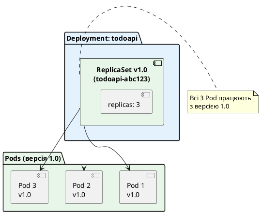
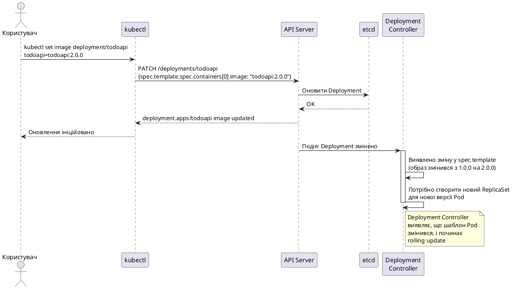
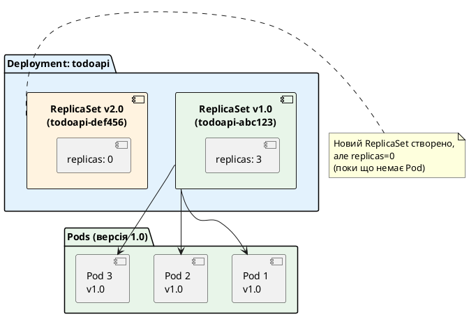
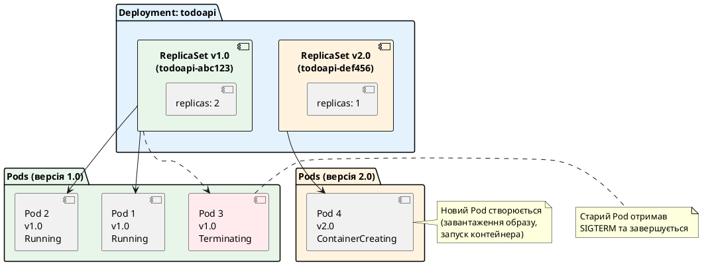
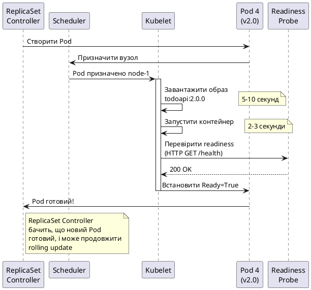
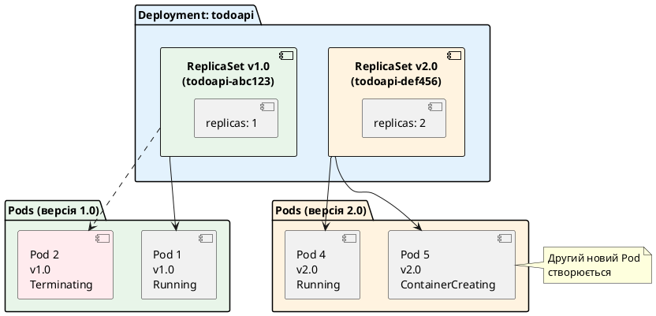
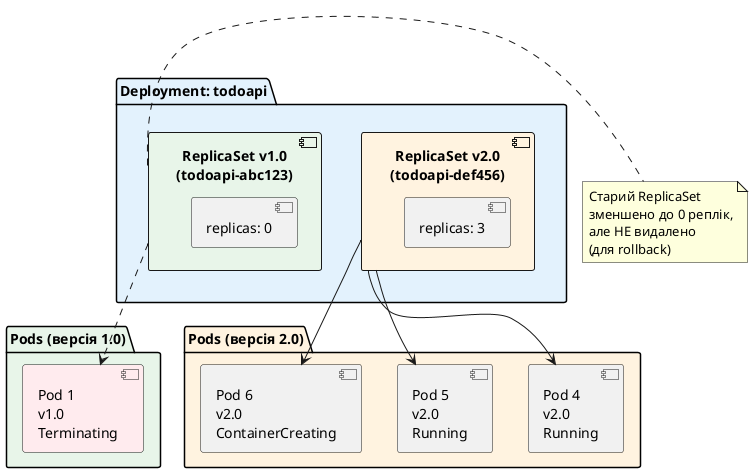
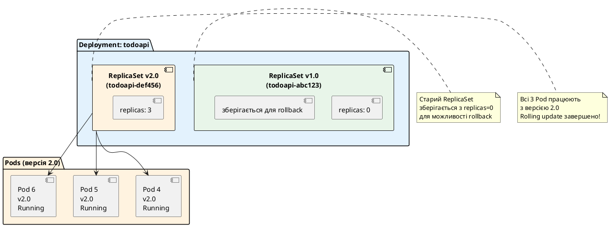
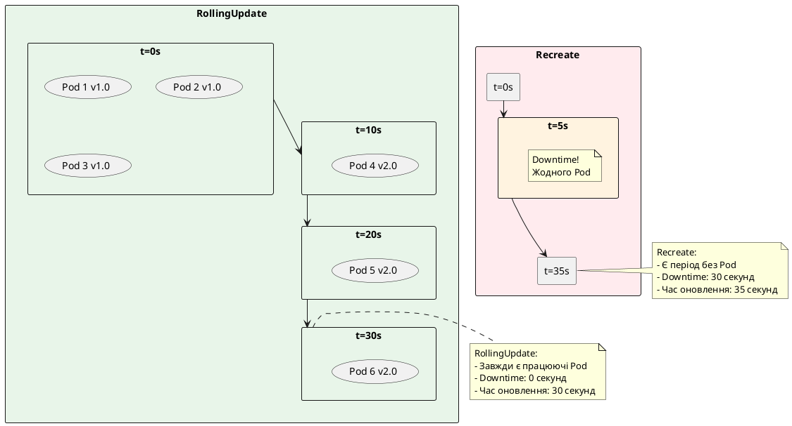
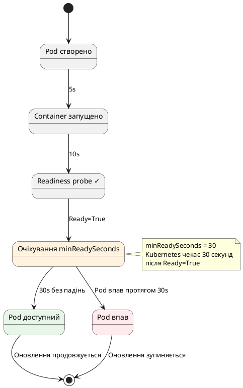

# Rolling Updates та управління життєвим циклом Deployment

## Проблема: як оновити застосунок без downtime?

У попередній статті ми навчилися створювати Deployment, масштабувати його та використовувати self-healing. Але залишилося найважливіше питання: **як оновити застосунок на нову версію без зупинки сервісу?**

### Сценарій: оновлення веб-застосунку у production

Уявіть, що ваш TodoApi працює у production з 3 репліками. Ви виправили критичний баг та хочете розгорнути нову версію. Які у вас варіанти?

**Варіант 1: "Наївний" підхід (з downtime)**

::terminal-preview{title="Оновлення з downtime"}

<div class="line"><span class="opacity-40"># Видалити всі старі Pod</span></div>
<div class="line"><span class="opacity-40">$</span> <strong>kubectl delete deployment todoapi</strong></div>
<div class="line"><span class="text-yellow-400">⚠ Сервіс недоступний!</span></div>
<div class="line"></div>
<div class="line"><span class="opacity-40"># Створити Deployment з новою версією</span></div>
<div class="line"><span class="opacity-40">$</span> <strong>kubectl apply -f todoapi-v2.yaml</strong></div>
<div class="line"><span class="text-yellow-400">⚠ Чекаємо 30 секунд, поки Pod стартують...</span></div>
<div class="line"></div>
<div class="line"><span class="text-green-400">✓ Сервіс знову доступний</span></div>

::

**Проблема:** Є період (30-60 секунд), коли **жоден Pod не працює**. Користувачі отримують помилки 503 Service Unavailable. Це неприйнятно для production.

**Варіант 2: Rolling Update (без downtime)**

::terminal-preview{title="Rolling Update"}

<div class="line"><span class="opacity-40"># Змінити версію образу у YAML</span></div>
<div class="line"><span class="opacity-40">$</span> <strong>kubectl set image deployment/todoapi todoapi=todoapi:2.0.0</strong></div>
<div class="line"><span class="text-blue-400">→ Створюється новий Pod з версією 2.0.0</span></div>
<div class="line"><span class="text-blue-400">→ Новий Pod стає Ready</span></div>
<div class="line"><span class="text-blue-400">→ Старий Pod видаляється</span></div>
<div class="line"><span class="text-blue-400">→ Повторюється для всіх реплік</span></div>
<div class="line"></div>
<div class="line"><span class="text-green-400">✓ Сервіс працював весь час!</span></div>

::

**Переваги:** Завжди є працюючі Pod. Користувачі не помічають оновлення. Якщо нова версія має баг — можна швидко повернутись до старої.

Саме це і робить **Rolling Update**.

---

## Що таке Rolling Update: формальне визначення

**Rolling Update** — це стратегія оновлення Deployment, при якій **старі Pod поступово замінюються новими**, завжди залишаючи мінімальну кількість працюючих реплік. Це гарантує **zero-downtime deployment** — оновлення без зупинки сервісу.

::note
**Ключова ідея:** Kubernetes не видаляє всі старі Pod одразу. Він створює нові Pod, чекає, поки вони стануть готовими (пройдуть readiness probe), і лише після цього видаляє старі. Цей процес повторюється, поки всі Pod не будуть оновлені.

**Аналогія:** Уявіть, що ви міняєте колеса на автомобілі, який їде. Ви не можете зняти всі колеса одразу — машина впаде. Замість цього ви міняєте по одному колесу, завжди залишаючи мінімум 3 колеса на місці. Так само працює Rolling Update.
::

### Основні характеристики Rolling Update

::card-group

::card{title="Zero-downtime" icon="i-heroicons-clock"}
Завжди є мінімальна кількість працюючих Pod. Користувачі не помічають оновлення — сервіс доступний весь час.
::

::card{title="Поступовість" icon="i-heroicons-arrow-trending-up"}
Pod оновлюються по черзі, а не всі одразу. Це дозволяє виявити проблеми на ранній стадії — якщо перший новий Pod падає, оновлення зупиняється.
::

::card{title="Контрольованість" icon="i-heroicons-adjustments-horizontal"}
Ви контролюєте швидкість оновлення через параметри `maxSurge` та `maxUnavailable`. Можна зробити оновлення швидким (багато Pod одразу) або обережним (по одному Pod).
::

::card{title="Автоматичний rollback" icon="i-heroicons-arrow-uturn-left"}
Якщо нові Pod не проходять health checks, оновлення автоматично зупиняється. Старі Pod залишаються працювати. Ви можете вручну повернутись до попередньої версії однією командою.
::

::

---

## Як працює Rolling Update: покрокова візуалізація

Давайте детально розберемо, що відбувається під час Rolling Update. Візьмемо приклад: Deployment з 3 репліками оновлюється з версії 1.0 на версію 2.0.

### Початковий стан

::plant-uml



::

**Стан:** 3 Pod з версією 1.0 працюють нормально. Сервіс обробляє запити користувачів.

### Крок 1: Користувач ініціює оновлення

Користувач змінює версію образу у Deployment:

::terminal-preview{title="Ініціація оновлення"}

<div class="line"><span class="opacity-40">$</span> <strong>kubectl set image deployment/todoapi todoapi=todoapi:2.0.0</strong></div>
<div class="line"><span class="text-green-400">deployment.apps/todoapi image updated</span></div>

::

Що відбувається всередині Kubernetes:

::plant-uml



::

**Важливо:** Deployment Controller виявляє, що `spec.template` змінився (образ `todoapi:1.0.0` → `todoapi:2.0.0`). Це сигнал для створення нового ReplicaSet.

### Крок 2: Створення нового ReplicaSet

Deployment Controller створює **новий ReplicaSet** для версії 2.0:

::plant-uml



::

**Стан:** Тепер є два ReplicaSet:
- **Старий (v1.0):** 3 репліки (працюють)
- **Новий (v2.0):** 0 реплік (поки що порожній)

### Крок 3: Поступове масштабування (ітерація 1)

Deployment Controller починає rolling update:
1. Збільшує `replicas` нового ReplicaSet на 1 (0 → 1)
2. Зменшує `replicas` старого ReplicaSet на 1 (3 → 2)

::plant-uml



::

**Стан:** 
- 2 старі Pod працюють (v1.0)
- 1 старий Pod завершується (v1.0)
- 1 новий Pod створюється (v2.0)

**Важливо:** Kubernetes **не чекає**, поки старий Pod завершиться. Він одразу створює новий Pod паралельно. Це прискорює оновлення.

### Крок 4: Очікування готовності нового Pod

Новий Pod проходить lifecycle:
1. Завантаження образу
2. Запуск контейнера
3. Проходження readiness probe

::plant-uml



::

**Критично важливо:** Deployment Controller **чекає**, поки новий Pod стане `Ready` (пройде readiness probe), перед тим як продовжити оновлення. Якщо Pod не стає готовим протягом `progressDeadlineSeconds` (за замовчуванням 600 секунд) — оновлення зупиняється.


### Крок 5: Продовження rolling update (ітерація 2)

Після того, як Pod 4 (v2.0) став готовим, Deployment Controller продовжує оновлення:

::plant-uml



::

**Стан:**
- 1 старий Pod працює (v1.0)
- 1 старий Pod завершується (v1.0)
- 1 новий Pod працює (v2.0)
- 1 новий Pod створюється (v2.0)

### Крок 6: Завершення rolling update (ітерація 3)

Після того, як Pod 5 (v2.0) став готовим:

::plant-uml



::

**Стан:**
- 0 старих Pod (останній завершується)
- 3 нові Pod (2 працюють, 1 створюється)

### Крок 7: Фінальний стан

Після того, як Pod 6 (v2.0) став готовим, rolling update завершено:

::plant-uml



::

**Результат:** Всі Pod оновлені до версії 2.0. Старий ReplicaSet зберігається з `replicas: 0` для можливості швидкого rollback.

::tip
**Чому старий ReplicaSet не видаляється?**

Kubernetes зберігає старі ReplicaSet (за замовчуванням 10 останніх) для можливості **швидкого rollback**. Якщо ви виявите баг у версії 2.0 та захочете повернутись до 1.0, Kubernetes просто:
1. Збільшить `replicas` старого ReplicaSet (0 → 3)
2. Зменшить `replicas` нового ReplicaSet (3 → 0)

Це займає 10-20 секунд, бо образ версії 1.0 вже є на вузлах (кешовано). Без збереження старого ReplicaSet довелося б створювати новий, що займає більше часу.
::

---

## Повна візуалізація Rolling Update

Тепер об'єднаємо всі кроки в одну sequence diagram:

::plant-uml

```plantuml
@startuml
skinparam style plain
skinparam backgroundColor #ffffff

participant "kubectl" as kubectl
participant "API Server" as api
participant "Deployment\nController" as dc
participant "ReplicaSet v1.0\nController" as rsc1
participant "ReplicaSet v2.0\nController" as rsc2
participant "Scheduler" as sched
participant "Kubelet" as kubelet

== Ініціація оновлення ==

kubectl -> api: PATCH /deployments/todoapi\n{image: todoapi:2.0.0}
api -> dc: Подія: Deployment змінено

activate dc
dc -> dc: Виявлено зміну spec.template
dc -> api: Створити ReplicaSet v2.0 (replicas=0)
api -> rsc2: Подія: новий ReplicaSet
deactivate dc

== Ітерація 1: Оновлення першого Pod ==

activate dc
dc -> api: PATCH ReplicaSet v2.0 (replicas: 0→1)
dc -> api: PATCH ReplicaSet v1.0 (replicas: 3→2)
deactivate dc

api -> rsc2: Подія: replicas змінено
activate rsc2
rsc2 -> api: Створити Pod 4 (v2.0)
deactivate rsc2

api -> rsc1: Подія: replicas змінено
activate rsc1
rsc1 -> api: Видалити Pod 3 (v1.0)
deactivate rsc1

api -> sched: Подія: новий Pod 4
sched -> kubelet: Призначити Pod 4 вузлу

activate kubelet
kubelet -> kubelet: Завантажити образ todoapi:2.0.0
kubelet -> kubelet: Запустити контейнер
kubelet -> kubelet: Перевірити readiness probe
kubelet -> api: Pod 4 Ready=True
deactivate kubelet

== Ітерація 2: Оновлення другого Pod ==

activate dc
dc -> dc: Pod 4 готовий, продовжити
dc -> api: PATCH ReplicaSet v2.0 (replicas: 1→2)
dc -> api: PATCH ReplicaSet v1.0 (replicas: 2→1)
deactivate dc

api -> rsc2: Подія: replicas змінено
activate rsc2
rsc2 -> api: Створити Pod 5 (v2.0)
deactivate rsc2

api -> rsc1: Подія: replicas змінено
activate rsc1
rsc1 -> api: Видалити Pod 2 (v1.0)
deactivate rsc1

api -> sched: Подія: новий Pod 5
sched -> kubelet: Призначити Pod 5 вузлу

activate kubelet
kubelet -> kubelet: Образ вже є (кешовано)
kubelet -> kubelet: Запустити контейнер
kubelet -> kubelet: Перевірити readiness probe
kubelet -> api: Pod 5 Ready=True
deactivate kubelet

== Ітерація 3: Оновлення третього Pod ==

activate dc
dc -> dc: Pod 5 готовий, продовжити
dc -> api: PATCH ReplicaSet v2.0 (replicas: 2→3)
dc -> api: PATCH ReplicaSet v1.0 (replicas: 1→0)
deactivate dc

api -> rsc2: Подія: replicas змінено
activate rsc2
rsc2 -> api: Створити Pod 6 (v2.0)
deactivate rsc2

api -> rsc1: Подія: replicas змінено
activate rsc1
rsc1 -> api: Видалити Pod 1 (v1.0)
deactivate rsc1

api -> sched: Подія: новий Pod 6
sched -> kubelet: Призначити Pod 6 вузлу

activate kubelet
kubelet -> kubelet: Образ вже є (кешовано)
kubelet -> kubelet: Запустити контейнер
kubelet -> kubelet: Перевірити readiness probe
kubelet -> api: Pod 6 Ready=True
deactivate kubelet

== Завершення ==

activate dc
dc -> dc: Всі Pod оновлені
dc -> api: Встановити Deployment status:\nAvailable=True, Progressing=False
deactivate dc

note right of dc
  Rolling update завершено!
  Час: ~30-60 секунд
  Downtime: 0 секунд
end note

@enduml
```

::

**Ключові моменти:**

1. **Поступовість** — Pod оновлюються по одному (або по кілька, залежно від `maxSurge`/`maxUnavailable`)
2. **Очікування готовності** — перед продовженням оновлення Kubernetes чекає, поки новий Pod стане `Ready`
3. **Паралельність** — створення нового Pod та видалення старого відбуваються паралельно
4. **Кешування образів** — після завантаження образу на вузол, наступні Pod стартують швидше
5. **Zero-downtime** — завжди є мінімум 2 працюючі Pod (у нашому прикладі)

---

## Стратегії оновлення: RollingUpdate vs Recreate

Kubernetes підтримує дві стратегії оновлення Deployment:

### 1. RollingUpdate (за замовчуванням)

Поступове оновлення, яке ми щойно розглянули. Це **рекомендована стратегія** для більшості застосунків.

```yaml
spec:
  strategy:
    type: RollingUpdate
    rollingUpdate:
      maxSurge: 1
      maxUnavailable: 1
```

**Переваги:**
- Zero-downtime — сервіс доступний весь час
- Поступове виявлення проблем — якщо перший новий Pod падає, оновлення зупиняється
- Можливість rollback — старі Pod ще працюють, можна швидко повернутись

**Недоліки:**
- Повільніше за Recreate (потрібен час на поступове оновлення)
- Потребує більше ресурсів (одночасно працюють старі та нові Pod)
- Складніше для застосунків, які не підтримують одночасну роботу різних версій

**Коли використовувати:**
- Веб-застосунки (API, frontend)
- Stateless сервіси
- Будь-які застосунки, де downtime неприйнятний

### 2. Recreate

Спочатку видаляються **всі** старі Pod, потім створюються нові. Є період downtime.

```yaml
spec:
  strategy:
    type: Recreate
```

**Переваги:**
- Простота — немає складної логіки поступового оновлення
- Менше ресурсів — не потрібно одночасно тримати старі та нові Pod
- Гарантія, що лише одна версія працює — немає проблем з несумісністю версій

**Недоліки:**
- Downtime — є період (30-60 секунд), коли сервіс недоступний
- Ризикованіше — якщо нова версія має баг, користувачі одразу його побачать

**Коли використовувати:**
- Застосунки, які не підтримують одночасну роботу різних версій (наприклад, через несумісність схеми БД)
- Stateful застосунки з одним екземпляром (наприклад, база даних)
- Внутрішні сервіси, де downtime прийнятний (наприклад, cron jobs)

### Порівняння стратегій

::plant-uml



::


---

## Параметри Rolling Update: maxSurge та maxUnavailable

Тепер розберемо найважливіші параметри, які контролюють швидкість та безпеку rolling update.

### maxUnavailable

**Визначення:** Максимальна кількість Pod, які можуть бути **недоступними** під час оновлення.

**Формат:** Абсолютне число (`1`, `2`) або відсоток від `replicas` (`25%`, `50%`).

**Формула розрахунку мінімальної кількості доступних Pod:**

```
min_available = replicas - maxUnavailable
```

**Приклади:**

::field-group

::field{name="replicas: 10, maxUnavailable: 2"}
**Розрахунок:** `min_available = 10 - 2 = 8`

**Означає:** Під час оновлення мінімум **8 Pod** мають бути доступними. Kubernetes може видалити максимум 2 старі Pod одразу.

**Візуалізація:**
```
Початок:  [v1] [v1] [v1] [v1] [v1] [v1] [v1] [v1] [v1] [v1]  (10 Pod)
Крок 1:   [v1] [v1] [v1] [v1] [v1] [v1] [v1] [v1] [v2] [v2]  (8 v1, 2 v2)
Крок 2:   [v1] [v1] [v1] [v1] [v1] [v1] [v2] [v2] [v2] [v2]  (6 v1, 4 v2)
...
Кінець:   [v2] [v2] [v2] [v2] [v2] [v2] [v2] [v2] [v2] [v2]  (10 Pod)
```
::

::field{name="replicas: 10, maxUnavailable: 25%"}
**Розрахунок:** `25% від 10 = 2.5` → округлюється **вниз** до `2`

`min_available = 10 - 2 = 8`

**Означає:** Те саме, що `maxUnavailable: 2` — мінімум 8 Pod доступні.

**Чому округлення вниз?** Kubernetes завжди округлює `maxUnavailable` вниз для безпеки — краще залишити більше доступних Pod, ніж менше.
::

::field{name="replicas: 3, maxUnavailable: 1"}
**Розрахунок:** `min_available = 3 - 1 = 2`

**Означає:** Під час оновлення мінімум **2 Pod** доступні. Kubernetes оновлює по одному Pod за раз.

**Візуалізація:**
```
Початок:  [v1] [v1] [v1]           (3 Pod)
Крок 1:   [v1] [v1] [v2]           (2 v1, 1 v2)
Крок 2:   [v1] [v2] [v2]           (1 v1, 2 v2)
Крок 3:   [v2] [v2] [v2]           (3 Pod)
```
::

::field{name="replicas: 3, maxUnavailable: 0"}
**Розрахунок:** `min_available = 3 - 0 = 3`

**Означає:** Під час оновлення **всі 3 Pod** мають бути доступними. Kubernetes **не може видалити жодного старого Pod**, поки не створить новий.

**Важливо:** Це вимагає `maxSurge > 0`, інакше оновлення неможливе (не можна ні видалити старі, ні створити нові понад ліміт).
::

::

### maxSurge

**Визначення:** Максимальна кількість **додаткових** Pod, які можуть бути створені понад `replicas` під час оновлення.

**Формат:** Абсолютне число (`1`, `2`) або відсоток від `replicas` (`25%`, `50%`).

**Формула розрахунку максимальної кількості Pod під час оновлення:**

```
max_pods = replicas + maxSurge
```

**Приклади:**

::field-group

::field{name="replicas: 10, maxSurge: 2"}
**Розрахунок:** `max_pods = 10 + 2 = 12`

**Означає:** Під час оновлення максимум **12 Pod** можуть існувати одночасно. Kubernetes може створити 2 нові Pod понад 10 реплік.

**Візуалізація:**
```
Початок:  [v1] [v1] [v1] [v1] [v1] [v1] [v1] [v1] [v1] [v1]        (10 Pod)
Крок 1:   [v1] [v1] [v1] [v1] [v1] [v1] [v1] [v1] [v1] [v1] [v2] [v2]  (12 Pod!)
Крок 2:   [v1] [v1] [v1] [v1] [v1] [v1] [v1] [v1] [v2] [v2] [v2] [v2]  (12 Pod!)
...
Кінець:   [v2] [v2] [v2] [v2] [v2] [v2] [v2] [v2] [v2] [v2]        (10 Pod)
```

**Навіщо це потрібно?** Додаткові Pod дозволяють **швидше** виконати оновлення. Нові Pod створюються паралельно зі старими, і лише після готовності нових старі видаляються.
::

::field{name="replicas: 10, maxSurge: 50%"}
**Розрахунок:** `50% від 10 = 5`

`max_pods = 10 + 5 = 15`

**Означає:** Під час оновлення максимум **15 Pod** можуть існувати одночасно. Дуже швидке оновлення, але потребує багато ресурсів.
::

::field{name="replicas: 3, maxSurge: 1"}
**Розрахунок:** `max_pods = 3 + 1 = 4`

**Означає:** Під час оновлення максимум **4 Pod** можуть існувати одночасно.

**Візуалізація:**
```
Початок:  [v1] [v1] [v1]           (3 Pod)
Крок 1:   [v1] [v1] [v1] [v2]      (4 Pod! 3 v1, 1 v2)
Крок 2:   [v1] [v1] [v2] [v2]      (4 Pod! 2 v1, 2 v2)
Крок 3:   [v1] [v2] [v2] [v2]      (4 Pod! 1 v1, 3 v2)
Крок 4:   [v2] [v2] [v2]           (3 Pod)
```
::

::field{name="replicas: 3, maxSurge: 0"}
**Розрахунок:** `max_pods = 3 + 0 = 3`

**Означає:** Під час оновлення максимум **3 Pod** можуть існувати одночасно. Kubernetes **не може створити додаткові Pod** — спочатку має видалити старий, потім створити новий.

**Важливо:** Це вимагає `maxUnavailable > 0`, інакше оновлення неможливе.
::

::

### Комбінації maxSurge та maxUnavailable

Різні комбінації цих параметрів дають різну поведінку оновлення:

::card-group

::card{title="Швидке оновлення, багато ресурсів" icon="i-heroicons-bolt"}
```yaml
maxSurge: 50%
maxUnavailable: 0
```

**Поведінка:** Створюються багато нових Pod одразу (до 50% понад replicas), старі видаляються лише після готовності нових. Завжди є всі репліки доступними.

**Приклад (replicas: 10):**
- Крок 1: 10 старих + 5 нових = 15 Pod
- Крок 2: 5 старих + 10 нових = 15 Pod
- Крок 3: 0 старих + 10 нових = 10 Pod

**Переваги:** Найшвидше оновлення, zero-downtime гарантовано

**Недоліки:** Потребує 150% ресурсів (CPU, пам'ять) під час оновлення
::

::card{title="Повільне оновлення, мало ресурсів" icon="i-heroicons-arrow-trending-down"}
```yaml
maxSurge: 0
maxUnavailable: 25%
```

**Поведінка:** Спочатку видаляються старі Pod (до 25%), потім створюються нові. Економить ресурси, але є період зниженої доступності.

**Приклад (replicas: 10):**
- Крок 1: 7-8 старих + 2-3 нових = 10 Pod (мінімум 7 доступних)
- Крок 2: 5 старих + 5 нових = 10 Pod
- Крок 3: 0 старих + 10 нових = 10 Pod

**Переваги:** Не потребує додаткових ресурсів

**Недоліки:** Повільніше, є період зниженої доступності (7 замість 10 Pod)
::

::card{title="Збалансований підхід (за замовчуванням)" icon="i-heroicons-scale"}
```yaml
maxSurge: 25%
maxUnavailable: 25%
```

**Поведінка:** Компроміс між швидкістю та ресурсами. Можна створити до 25% додаткових Pod та видалити до 25% старих одночасно.

**Приклад (replicas: 10):**
- Крок 1: 7-8 старих + 2-3 нових = 10-11 Pod
- Крок 2: 5 старих + 5 нових = 10 Pod
- Крок 3: 0 старих + 10 нових = 10 Pod

**Переваги:** Баланс між швидкістю та ресурсами

**Недоліки:** Не найшвидше, не найекономніше
::

::card{title="Обережне оновлення (по одному)" icon="i-heroicons-shield-check"}
```yaml
maxSurge: 1
maxUnavailable: 0
```

**Поведінка:** Оновлення по одному Pod за раз. Завжди є всі репліки доступними. Найбезпечніший підхід.

**Приклад (replicas: 10):**
- Крок 1: 10 старих + 1 новий = 11 Pod
- Крок 2: 9 старих + 2 нових = 11 Pod
- ...
- Крок 10: 0 старих + 10 нових = 10 Pod

**Переваги:** Максимальна безпека, легко виявити проблеми на ранній стадії

**Недоліки:** Найповільніше оновлення (10 ітерацій для 10 реплік)
::

::

### Математичні розрахунки для різних сценаріїв

Давайте розрахуємо, скільки Pod буде під час оновлення для різних конфігурацій:

**Дано:** `replicas: 10`

| maxSurge | maxUnavailable | min_available | max_pods | Діапазон Pod під час оновлення |
|----------|----------------|---------------|----------|-------------------------------|
| 0        | 1              | 9             | 10       | 9-10 Pod                      |
| 0        | 25%            | 8             | 10       | 8-10 Pod                      |
| 1        | 0              | 10            | 11       | 10-11 Pod                     |
| 1        | 1              | 9             | 11       | 9-11 Pod                      |
| 25%      | 25%            | 8             | 12       | 8-12 Pod                      |
| 50%      | 0              | 10            | 15       | 10-15 Pod                     |
| 100%     | 0              | 10            | 20       | 10-20 Pod                     |

**Висновки:**

1. **Більший maxSurge** → швидше оновлення, але більше ресурсів
2. **Більший maxUnavailable** → швидше оновлення, але менша доступність
3. **maxSurge=0, maxUnavailable=0** → неможливо (оновлення заблоковано)
4. **Для критичних сервісів:** `maxSurge > 0, maxUnavailable = 0` (завжди повна доступність)
5. **Для економії ресурсів:** `maxSurge = 0, maxUnavailable > 0` (без додаткових Pod)

---

## Додаткові параметри життєвого циклу

Окрім `maxSurge` та `maxUnavailable`, є ще кілька важливих параметрів:

### progressDeadlineSeconds

**Визначення:** Максимальний час (у секундах), протягом якого Deployment має досягти прогресу під час оновлення.

**За замовчуванням:** `600` (10 хвилин)

**Що вважається "прогресом"?**
- Новий Pod став `Ready`
- Старий Pod був видалений
- Будь-яка зміна у кількості доступних реплік

**Що відбувається при перевищенні таймауту?**

Якщо за `progressDeadlineSeconds` жоден новий Pod не став готовим, Deployment отримує статус:

```yaml
status:
  conditions:
    - type: Progressing
      status: "False"
      reason: ProgressDeadlineExceeded
      message: "ReplicaSet 'todoapi-def456' has timed out progressing."
```

Оновлення **зупиняється**, але **не відкочується** автоматично. Старі Pod продовжують працювати.

**Приклад:**

```yaml
spec:
  progressDeadlineSeconds: 300  # 5 хвилин
  strategy:
    type: RollingUpdate
    rollingUpdate:
      maxSurge: 1
      maxUnavailable: 0
```

**Сценарій:** Новий образ має баг — Pod стартує, але не проходить readiness probe. Через 5 хвилин Kubernetes зупиняє оновлення та повідомляє про проблему.

::warning
**Важливо:** `progressDeadlineSeconds` — це **не** загальний час оновлення. Це час **між прогресами**. Якщо кожен Pod стартує за 30 секунд, а у вас 10 реплік, загальний час оновлення може бути 5 хвилин, і це нормально (бо є прогрес кожні 30 секунд).

**Неправильне розуміння:** "Оновлення має завершитись за 600 секунд"

**Правильне розуміння:** "Між кожним прогресом (новий Pod Ready) має пройти не більше 600 секунд"
::

### minReadySeconds

**Визначення:** Мінімальний час (у секундах), протягом якого новий Pod має бути готовим (без падінь) перед тим, як він вважатиметься доступним.

**За замовчуванням:** `0` (Pod вважається доступним одразу після `Ready=True`)

**Навіщо це потрібно?**

Іноді Pod стартує успішно (проходить readiness probe), але падає через кілька секунд (наприклад, через помилку підключення до БД, яка виявляється не одразу). `minReadySeconds` додає додаткову перевірку стабільності.

**Приклад:**

```yaml
spec:
  minReadySeconds: 30
  strategy:
    type: RollingUpdate
    rollingUpdate:
      maxSurge: 1
      maxUnavailable: 0
```

**Що відбувається:**

1. Новий Pod стартує
2. Pod проходить readiness probe → `Ready=True`
3. Kubernetes **чекає 30 секунд**
4. Якщо за ці 30 секунд Pod не впав → він вважається доступним, оновлення продовжується
5. Якщо Pod впав → оновлення зупиняється

**Візуалізація:**

::plant-uml



::

**Коли використовувати:**

- Застосунки з повільною ініціалізацією (підключення до БД, завантаження конфігурації)
- Застосунки, які можуть падати через кілька секунд після старту
- Критичні сервіси, де важлива стабільність

**Типові значення:**

- `0` — для простих застосунків (за замовчуванням)
- `10-30` — для більшості веб-застосунків
- `60-120` — для складних застосунків з довгою ініціалізацією

