# Rolling Updates та управління життєвим циклом Deployment

## Проблема: як оновити застосунок без downtime?

У попередній статті ми навчилися створювати Deployment, масштабувати його та використовувати self-healing. Але залишилося найважливіше питання: **як оновити застосунок на нову версію без зупинки сервісу?**

### Сценарій: оновлення веб-застосунку у production

Уявіть, що ваш TodoApi працює у production з 3 репліками. Ви виправили критичний баг та хочете розгорнути нову версію. Які у вас варіанти?

**Варіант 1: "Наївний" підхід (з downtime)**

::terminal-preview{title="Оновлення з downtime"}

<div class="line"><span class="opacity-40"># Видалити всі старі Pod</span></div>
<div class="line"><span class="opacity-40">$</span> <strong>kubectl delete deployment todoapi</strong></div>
<div class="line"><span class="text-yellow-400">⚠ Сервіс недоступний!</span></div>
<div class="line"></div>
<div class="line"><span class="opacity-40"># Створити Deployment з новою версією</span></div>
<div class="line"><span class="opacity-40">$</span> <strong>kubectl apply -f todoapi-v2.yaml</strong></div>
<div class="line"><span class="text-yellow-400">⚠ Чекаємо 30 секунд, поки Pod стартують...</span></div>
<div class="line"></div>
<div class="line"><span class="text-green-400">✓ Сервіс знову доступний</span></div>

::

**Проблема:** Є період (30-60 секунд), коли **жоден Pod не працює**. Користувачі отримують помилки 503 Service Unavailable. Це неприйнятно для production.

**Варіант 2: Rolling Update (без downtime)**

::terminal-preview{title="Rolling Update"}

<div class="line"><span class="opacity-40"># Змінити версію образу у YAML</span></div>
<div class="line"><span class="opacity-40">$</span> <strong>kubectl set image deployment/todoapi todoapi=todoapi:2.0.0</strong></div>
<div class="line"><span class="text-blue-400">→ Створюється новий Pod з версією 2.0.0</span></div>
<div class="line"><span class="text-blue-400">→ Новий Pod стає Ready</span></div>
<div class="line"><span class="text-blue-400">→ Старий Pod видаляється</span></div>
<div class="line"><span class="text-blue-400">→ Повторюється для всіх реплік</span></div>
<div class="line"></div>
<div class="line"><span class="text-green-400">✓ Сервіс працював весь час!</span></div>

::

**Переваги:** Завжди є працюючі Pod. Користувачі не помічають оновлення. Якщо нова версія має баг — можна швидко повернутись до старої.

Саме це і робить **Rolling Update**.

---

## Що таке Rolling Update: формальне визначення

**Rolling Update** — це стратегія оновлення Deployment, при якій **старі Pod поступово замінюються новими**, завжди залишаючи мінімальну кількість працюючих реплік. Це гарантує **zero-downtime deployment** — оновлення без зупинки сервісу.

::note
**Ключова ідея:** Kubernetes не видаляє всі старі Pod одразу. Він створює нові Pod, чекає, поки вони стануть готовими (пройдуть readiness probe), і лише після цього видаляє старі. Цей процес повторюється, поки всі Pod не будуть оновлені.

**Аналогія:** Уявіть, що ви міняєте колеса на автомобілі, який їде. Ви не можете зняти всі колеса одразу — машина впаде. Замість цього ви міняєте по одному колесу, завжди залишаючи мінімум 3 колеса на місці. Так само працює Rolling Update.
::

### Основні характеристики Rolling Update

::card-group

::card{title="Zero-downtime" icon="i-heroicons-clock"}
Завжди є мінімальна кількість працюючих Pod. Користувачі не помічають оновлення — сервіс доступний весь час.
::

::card{title="Поступовість" icon="i-heroicons-arrow-trending-up"}
Pod оновлюються по черзі, а не всі одразу. Це дозволяє виявити проблеми на ранній стадії — якщо перший новий Pod падає, оновлення зупиняється.
::

::card{title="Контрольованість" icon="i-heroicons-adjustments-horizontal"}
Ви контролюєте швидкість оновлення через параметри `maxSurge` та `maxUnavailable`. Можна зробити оновлення швидким (багато Pod одразу) або обережним (по одному Pod).
::

::card{title="Автоматичний rollback" icon="i-heroicons-arrow-uturn-left"}
Якщо нові Pod не проходять health checks, оновлення автоматично зупиняється. Старі Pod залишаються працювати. Ви можете вручну повернутись до попередньої версії однією командою.
::

::

---

## Як працює Rolling Update: покрокова візуалізація

Давайте детально розберемо, що відбувається під час Rolling Update. Візьмемо приклад: Deployment з 3 репліками оновлюється з версії 1.0 на версію 2.0.

### Початковий стан

::plant-uml

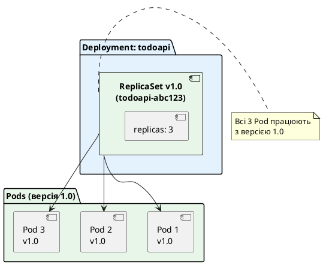

::

**Стан:** 3 Pod з версією 1.0 працюють нормально. Сервіс обробляє запити користувачів.

### Крок 1: Користувач ініціює оновлення

Користувач змінює версію образу у Deployment:

::terminal-preview{title="Ініціація оновлення"}

<div class="line"><span class="opacity-40">$</span> <strong>kubectl set image deployment/todoapi todoapi=todoapi:2.0.0</strong></div>
<div class="line"><span class="text-green-400">deployment.apps/todoapi image updated</span></div>

::

Що відбувається всередині Kubernetes:

::plant-uml

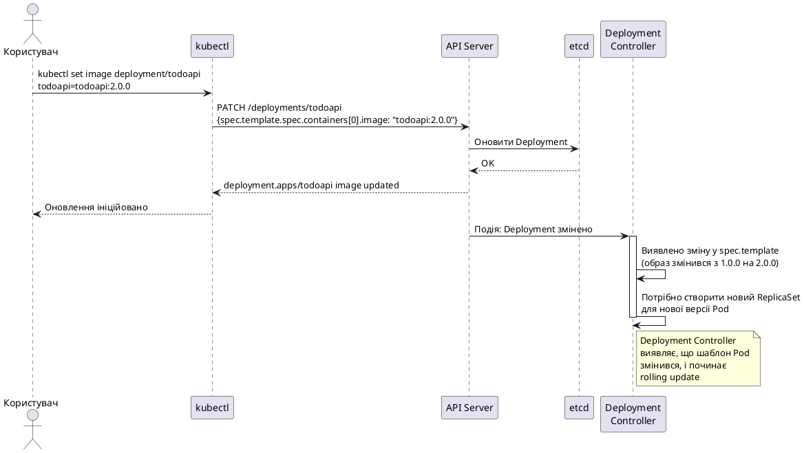

::

**Важливо:** Deployment Controller виявляє, що `spec.template` змінився (образ `todoapi:1.0.0` → `todoapi:2.0.0`). Це сигнал для створення нового ReplicaSet.

### Крок 2: Створення нового ReplicaSet

Deployment Controller створює **новий ReplicaSet** для версії 2.0:

::plant-uml

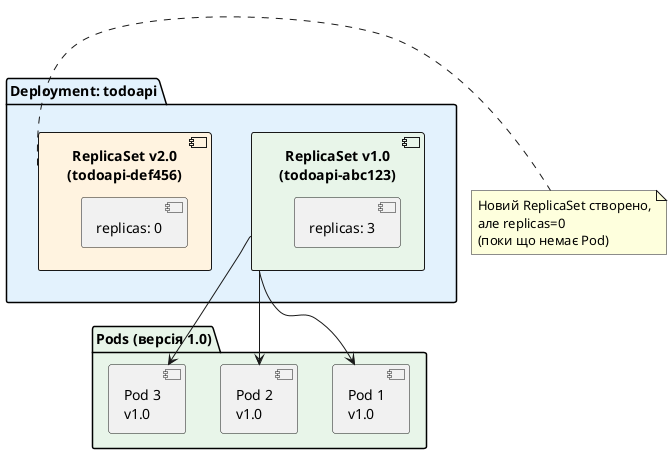

::

**Стан:** Тепер є два ReplicaSet:
- **Старий (v1.0):** 3 репліки (працюють)
- **Новий (v2.0):** 0 реплік (поки що порожній)

### Крок 3: Поступове масштабування (ітерація 1)

Deployment Controller починає rolling update:
1. Збільшує `replicas` нового ReplicaSet на 1 (0 → 1)
2. Зменшує `replicas` старого ReplicaSet на 1 (3 → 2)

::plant-uml

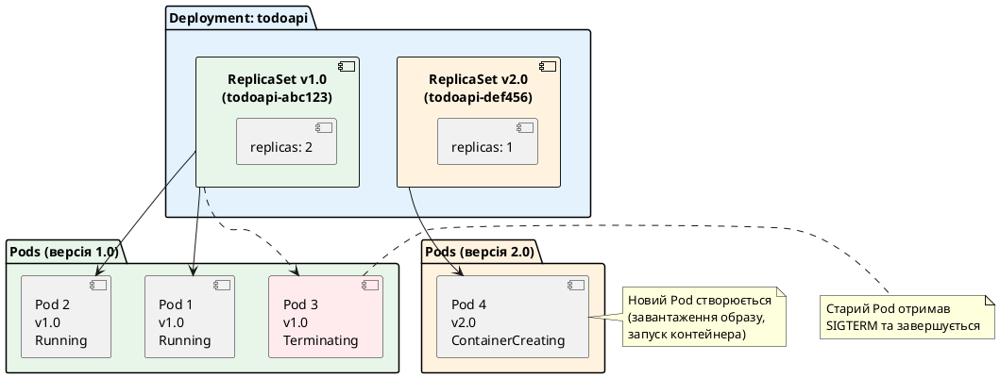

::

**Стан:** 
- 2 старі Pod працюють (v1.0)
- 1 старий Pod завершується (v1.0)
- 1 новий Pod створюється (v2.0)

**Важливо:** Kubernetes **не чекає**, поки старий Pod завершиться. Він одразу створює новий Pod паралельно. Це прискорює оновлення.

### Крок 4: Очікування готовності нового Pod

Новий Pod проходить lifecycle:
1. Завантаження образу
2. Запуск контейнера
3. Проходження readiness probe

::plant-uml

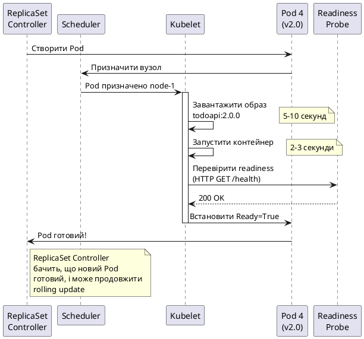

::

**Критично важливо:** Deployment Controller **чекає**, поки новий Pod стане `Ready` (пройде readiness probe), перед тим як продовжити оновлення. Якщо Pod не стає готовим протягом `progressDeadlineSeconds` (за замовчуванням 600 секунд) — оновлення зупиняється.


### Крок 5: Продовження rolling update (ітерація 2)

Після того, як Pod 4 (v2.0) став готовим, Deployment Controller продовжує оновлення:

::plant-uml

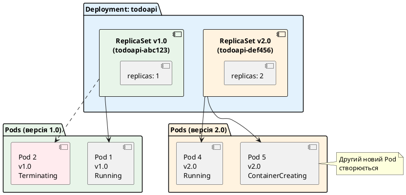

::

**Стан:**
- 1 старий Pod працює (v1.0)
- 1 старий Pod завершується (v1.0)
- 1 новий Pod працює (v2.0)
- 1 новий Pod створюється (v2.0)

### Крок 6: Завершення rolling update (ітерація 3)

Після того, як Pod 5 (v2.0) став готовим:

::plant-uml

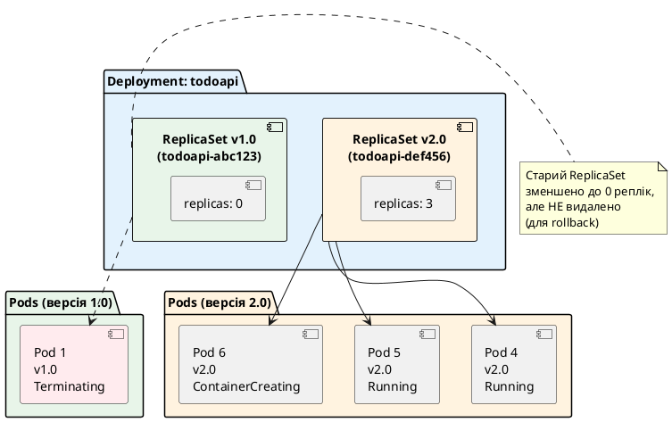

::

**Стан:**
- 0 старих Pod (останній завершується)
- 3 нові Pod (2 працюють, 1 створюється)

### Крок 7: Фінальний стан

Після того, як Pod 6 (v2.0) став готовим, rolling update завершено:

::plant-uml

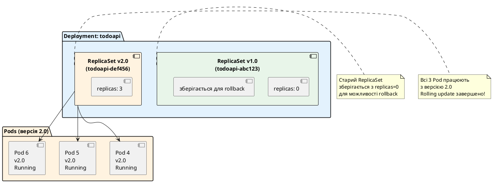

::

**Результат:** Всі Pod оновлені до версії 2.0. Старий ReplicaSet зберігається з `replicas: 0` для можливості швидкого rollback.

::tip
**Чому старий ReplicaSet не видаляється?**

Kubernetes зберігає старі ReplicaSet (за замовчуванням 10 останніх) для можливості **швидкого rollback**. Якщо ви виявите баг у версії 2.0 та захочете повернутись до 1.0, Kubernetes просто:
1. Збільшить `replicas` старого ReplicaSet (0 → 3)
2. Зменшить `replicas` нового ReplicaSet (3 → 0)

Це займає 10-20 секунд, бо образ версії 1.0 вже є на вузлах (кешовано). Без збереження старого ReplicaSet довелося б створювати новий, що займає більше часу.
::

---

## Повна візуалізація Rolling Update

Тепер об'єднаємо всі кроки в одну sequence diagram:

::plant-uml

```plantuml
@startuml
skinparam style plain
skinparam backgroundColor #ffffff

participant "kubectl" as kubectl
participant "API Server" as api
participant "Deployment\nController" as dc
participant "ReplicaSet v1.0\nController" as rsc1
participant "ReplicaSet v2.0\nController" as rsc2
participant "Scheduler" as sched
participant "Kubelet" as kubelet

== Ініціація оновлення ==

kubectl -> api: PATCH /deployments/todoapi\n{image: todoapi:2.0.0}
api -> dc: Подія: Deployment змінено

activate dc
dc -> dc: Виявлено зміну spec.template
dc -> api: Створити ReplicaSet v2.0 (replicas=0)
api -> rsc2: Подія: новий ReplicaSet
deactivate dc

== Ітерація 1: Оновлення першого Pod ==

activate dc
dc -> api: PATCH ReplicaSet v2.0 (replicas: 0→1)
dc -> api: PATCH ReplicaSet v1.0 (replicas: 3→2)
deactivate dc

api -> rsc2: Подія: replicas змінено
activate rsc2
rsc2 -> api: Створити Pod 4 (v2.0)
deactivate rsc2

api -> rsc1: Подія: replicas змінено
activate rsc1
rsc1 -> api: Видалити Pod 3 (v1.0)
deactivate rsc1

api -> sched: Подія: новий Pod 4
sched -> kubelet: Призначити Pod 4 вузлу

activate kubelet
kubelet -> kubelet: Завантажити образ todoapi:2.0.0
kubelet -> kubelet: Запустити контейнер
kubelet -> kubelet: Перевірити readiness probe
kubelet -> api: Pod 4 Ready=True
deactivate kubelet

== Ітерація 2: Оновлення другого Pod ==

activate dc
dc -> dc: Pod 4 готовий, продовжити
dc -> api: PATCH ReplicaSet v2.0 (replicas: 1→2)
dc -> api: PATCH ReplicaSet v1.0 (replicas: 2→1)
deactivate dc

api -> rsc2: Подія: replicas змінено
activate rsc2
rsc2 -> api: Створити Pod 5 (v2.0)
deactivate rsc2

api -> rsc1: Подія: replicas змінено
activate rsc1
rsc1 -> api: Видалити Pod 2 (v1.0)
deactivate rsc1

api -> sched: Подія: новий Pod 5
sched -> kubelet: Призначити Pod 5 вузлу

activate kubelet
kubelet -> kubelet: Образ вже є (кешовано)
kubelet -> kubelet: Запустити контейнер
kubelet -> kubelet: Перевірити readiness probe
kubelet -> api: Pod 5 Ready=True
deactivate kubelet

== Ітерація 3: Оновлення третього Pod ==

activate dc
dc -> dc: Pod 5 готовий, продовжити
dc -> api: PATCH ReplicaSet v2.0 (replicas: 2→3)
dc -> api: PATCH ReplicaSet v1.0 (replicas: 1→0)
deactivate dc

api -> rsc2: Подія: replicas змінено
activate rsc2
rsc2 -> api: Створити Pod 6 (v2.0)
deactivate rsc2

api -> rsc1: Подія: replicas змінено
activate rsc1
rsc1 -> api: Видалити Pod 1 (v1.0)
deactivate rsc1

api -> sched: Подія: новий Pod 6
sched -> kubelet: Призначити Pod 6 вузлу

activate kubelet
kubelet -> kubelet: Образ вже є (кешовано)
kubelet -> kubelet: Запустити контейнер
kubelet -> kubelet: Перевірити readiness probe
kubelet -> api: Pod 6 Ready=True
deactivate kubelet

== Завершення ==

activate dc
dc -> dc: Всі Pod оновлені
dc -> api: Встановити Deployment status:\nAvailable=True, Progressing=False
deactivate dc

note right of dc
  Rolling update завершено!
  Час: ~30-60 секунд
  Downtime: 0 секунд
end note

@enduml
```

::

**Ключові моменти:**

1. **Поступовість** — Pod оновлюються по одному (або по кілька, залежно від `maxSurge`/`maxUnavailable`)
2. **Очікування готовності** — перед продовженням оновлення Kubernetes чекає, поки новий Pod стане `Ready`
3. **Паралельність** — створення нового Pod та видалення старого відбуваються паралельно
4. **Кешування образів** — після завантаження образу на вузол, наступні Pod стартують швидше
5. **Zero-downtime** — завжди є мінімум 2 працюючі Pod (у нашому прикладі)

---

## Стратегії оновлення: RollingUpdate vs Recreate

Kubernetes підтримує дві стратегії оновлення Deployment:

### 1. RollingUpdate (за замовчуванням)

Поступове оновлення, яке ми щойно розглянули. Це **рекомендована стратегія** для більшості застосунків.

```yaml
spec:
  strategy:
    type: RollingUpdate
    rollingUpdate:
      maxSurge: 1
      maxUnavailable: 1
```

**Переваги:**
- Zero-downtime — сервіс доступний весь час
- Поступове виявлення проблем — якщо перший новий Pod падає, оновлення зупиняється
- Можливість rollback — старі Pod ще працюють, можна швидко повернутись

**Недоліки:**
- Повільніше за Recreate (потрібен час на поступове оновлення)
- Потребує більше ресурсів (одночасно працюють старі та нові Pod)
- Складніше для застосунків, які не підтримують одночасну роботу різних версій

**Коли використовувати:**
- Веб-застосунки (API, frontend)
- Stateless сервіси
- Будь-які застосунки, де downtime неприйнятний

### 2. Recreate

Спочатку видаляються **всі** старі Pod, потім створюються нові. Є період downtime.

```yaml
spec:
  strategy:
    type: Recreate
```

**Переваги:**
- Простота — немає складної логіки поступового оновлення
- Менше ресурсів — не потрібно одночасно тримати старі та нові Pod
- Гарантія, що лише одна версія працює — немає проблем з несумісністю версій

**Недоліки:**
- Downtime — є період (30-60 секунд), коли сервіс недоступний
- Ризикованіше — якщо нова версія має баг, користувачі одразу його побачать

**Коли використовувати:**
- Застосунки, які не підтримують одночасну роботу різних версій (наприклад, через несумісність схеми БД)
- Stateful застосунки з одним екземпляром (наприклад, база даних)
- Внутрішні сервіси, де downtime прийнятний (наприклад, cron jobs)

### Порівняння стратегій

::plant-uml

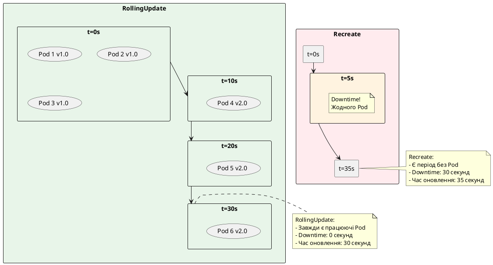

::


---

## Параметри Rolling Update: maxSurge та maxUnavailable

Тепер розберемо найважливіші параметри, які контролюють швидкість та безпеку rolling update.

### maxUnavailable

**Визначення:** Максимальна кількість Pod, які можуть бути **недоступними** під час оновлення.

**Формат:** Абсолютне число (`1`, `2`) або відсоток від `replicas` (`25%`, `50%`).

**Формула розрахунку мінімальної кількості доступних Pod:**

```
min_available = replicas - maxUnavailable
```

**Приклади:**

::field-group

::field{name="replicas: 10, maxUnavailable: 2"}
**Розрахунок:** `min_available = 10 - 2 = 8`

**Означає:** Під час оновлення мінімум **8 Pod** мають бути доступними. Kubernetes може видалити максимум 2 старі Pod одразу.

**Візуалізація:**
```
Початок:  [v1] [v1] [v1] [v1] [v1] [v1] [v1] [v1] [v1] [v1]  (10 Pod)
Крок 1:   [v1] [v1] [v1] [v1] [v1] [v1] [v1] [v1] [v2] [v2]  (8 v1, 2 v2)
Крок 2:   [v1] [v1] [v1] [v1] [v1] [v1] [v2] [v2] [v2] [v2]  (6 v1, 4 v2)
...
Кінець:   [v2] [v2] [v2] [v2] [v2] [v2] [v2] [v2] [v2] [v2]  (10 Pod)
```
::

::field{name="replicas: 10, maxUnavailable: 25%"}
**Розрахунок:** `25% від 10 = 2.5` → округлюється **вниз** до `2`

`min_available = 10 - 2 = 8`

**Означає:** Те саме, що `maxUnavailable: 2` — мінімум 8 Pod доступні.

**Чому округлення вниз?** Kubernetes завжди округлює `maxUnavailable` вниз для безпеки — краще залишити більше доступних Pod, ніж менше.
::

::field{name="replicas: 3, maxUnavailable: 1"}
**Розрахунок:** `min_available = 3 - 1 = 2`

**Означає:** Під час оновлення мінімум **2 Pod** доступні. Kubernetes оновлює по одному Pod за раз.

**Візуалізація:**
```
Початок:  [v1] [v1] [v1]           (3 Pod)
Крок 1:   [v1] [v1] [v2]           (2 v1, 1 v2)
Крок 2:   [v1] [v2] [v2]           (1 v1, 2 v2)
Крок 3:   [v2] [v2] [v2]           (3 Pod)
```
::

::field{name="replicas: 3, maxUnavailable: 0"}
**Розрахунок:** `min_available = 3 - 0 = 3`

**Означає:** Під час оновлення **всі 3 Pod** мають бути доступними. Kubernetes **не може видалити жодного старого Pod**, поки не створить новий.

**Важливо:** Це вимагає `maxSurge > 0`, інакше оновлення неможливе (не можна ні видалити старі, ні створити нові понад ліміт).
::

::

### maxSurge

**Визначення:** Максимальна кількість **додаткових** Pod, які можуть бути створені понад `replicas` під час оновлення.

**Формат:** Абсолютне число (`1`, `2`) або відсоток від `replicas` (`25%`, `50%`).

**Формула розрахунку максимальної кількості Pod під час оновлення:**

```
max_pods = replicas + maxSurge
```

**Приклади:**

::field-group

::field{name="replicas: 10, maxSurge: 2"}
**Розрахунок:** `max_pods = 10 + 2 = 12`

**Означає:** Під час оновлення максимум **12 Pod** можуть існувати одночасно. Kubernetes може створити 2 нові Pod понад 10 реплік.

**Візуалізація:**
```
Початок:  [v1] [v1] [v1] [v1] [v1] [v1] [v1] [v1] [v1] [v1]        (10 Pod)
Крок 1:   [v1] [v1] [v1] [v1] [v1] [v1] [v1] [v1] [v1] [v1] [v2] [v2]  (12 Pod!)
Крок 2:   [v1] [v1] [v1] [v1] [v1] [v1] [v1] [v1] [v2] [v2] [v2] [v2]  (12 Pod!)
...
Кінець:   [v2] [v2] [v2] [v2] [v2] [v2] [v2] [v2] [v2] [v2]        (10 Pod)
```

**Навіщо це потрібно?** Додаткові Pod дозволяють **швидше** виконати оновлення. Нові Pod створюються паралельно зі старими, і лише після готовності нових старі видаляються.
::

::field{name="replicas: 10, maxSurge: 50%"}
**Розрахунок:** `50% від 10 = 5`

`max_pods = 10 + 5 = 15`

**Означає:** Під час оновлення максимум **15 Pod** можуть існувати одночасно. Дуже швидке оновлення, але потребує багато ресурсів.
::

::field{name="replicas: 3, maxSurge: 1"}
**Розрахунок:** `max_pods = 3 + 1 = 4`

**Означає:** Під час оновлення максимум **4 Pod** можуть існувати одночасно.

**Візуалізація:**
```
Початок:  [v1] [v1] [v1]           (3 Pod)
Крок 1:   [v1] [v1] [v1] [v2]      (4 Pod! 3 v1, 1 v2)
Крок 2:   [v1] [v1] [v2] [v2]      (4 Pod! 2 v1, 2 v2)
Крок 3:   [v1] [v2] [v2] [v2]      (4 Pod! 1 v1, 3 v2)
Крок 4:   [v2] [v2] [v2]           (3 Pod)
```
::

::field{name="replicas: 3, maxSurge: 0"}
**Розрахунок:** `max_pods = 3 + 0 = 3`

**Означає:** Під час оновлення максимум **3 Pod** можуть існувати одночасно. Kubernetes **не може створити додаткові Pod** — спочатку має видалити старий, потім створити новий.

**Важливо:** Це вимагає `maxUnavailable > 0`, інакше оновлення неможливе.
::

::

### Комбінації maxSurge та maxUnavailable

Різні комбінації цих параметрів дають різну поведінку оновлення:

::card-group

::card{title="Швидке оновлення, багато ресурсів" icon="i-heroicons-bolt"}
```yaml
maxSurge: 50%
maxUnavailable: 0
```

**Поведінка:** Створюються багато нових Pod одразу (до 50% понад replicas), старі видаляються лише після готовності нових. Завжди є всі репліки доступними.

**Приклад (replicas: 10):**
- Крок 1: 10 старих + 5 нових = 15 Pod
- Крок 2: 5 старих + 10 нових = 15 Pod
- Крок 3: 0 старих + 10 нових = 10 Pod

**Переваги:** Найшвидше оновлення, zero-downtime гарантовано

**Недоліки:** Потребує 150% ресурсів (CPU, пам'ять) під час оновлення
::

::card{title="Повільне оновлення, мало ресурсів" icon="i-heroicons-arrow-trending-down"}
```yaml
maxSurge: 0
maxUnavailable: 25%
```

**Поведінка:** Спочатку видаляються старі Pod (до 25%), потім створюються нові. Економить ресурси, але є період зниженої доступності.

**Приклад (replicas: 10):**
- Крок 1: 7-8 старих + 2-3 нових = 10 Pod (мінімум 7 доступних)
- Крок 2: 5 старих + 5 нових = 10 Pod
- Крок 3: 0 старих + 10 нових = 10 Pod

**Переваги:** Не потребує додаткових ресурсів

**Недоліки:** Повільніше, є період зниженої доступності (7 замість 10 Pod)
::

::card{title="Збалансований підхід (за замовчуванням)" icon="i-heroicons-scale"}
```yaml
maxSurge: 25%
maxUnavailable: 25%
```

**Поведінка:** Компроміс між швидкістю та ресурсами. Можна створити до 25% додаткових Pod та видалити до 25% старих одночасно.

**Приклад (replicas: 10):**
- Крок 1: 7-8 старих + 2-3 нових = 10-11 Pod
- Крок 2: 5 старих + 5 нових = 10 Pod
- Крок 3: 0 старих + 10 нових = 10 Pod

**Переваги:** Баланс між швидкістю та ресурсами

**Недоліки:** Не найшвидше, не найекономніше
::

::card{title="Обережне оновлення (по одному)" icon="i-heroicons-shield-check"}
```yaml
maxSurge: 1
maxUnavailable: 0
```

**Поведінка:** Оновлення по одному Pod за раз. Завжди є всі репліки доступними. Найбезпечніший підхід.

**Приклад (replicas: 10):**
- Крок 1: 10 старих + 1 новий = 11 Pod
- Крок 2: 9 старих + 2 нових = 11 Pod
- ...
- Крок 10: 0 старих + 10 нових = 10 Pod

**Переваги:** Максимальна безпека, легко виявити проблеми на ранній стадії

**Недоліки:** Найповільніше оновлення (10 ітерацій для 10 реплік)
::

::

### Математичні розрахунки для різних сценаріїв

Давайте розрахуємо, скільки Pod буде під час оновлення для різних конфігурацій:

**Дано:** `replicas: 10`

| maxSurge | maxUnavailable | min_available | max_pods | Діапазон Pod під час оновлення |
|----------|----------------|---------------|----------|-------------------------------|
| 0        | 1              | 9             | 10       | 9-10 Pod                      |
| 0        | 25%            | 8             | 10       | 8-10 Pod                      |
| 1        | 0              | 10            | 11       | 10-11 Pod                     |
| 1        | 1              | 9             | 11       | 9-11 Pod                      |
| 25%      | 25%            | 8             | 12       | 8-12 Pod                      |
| 50%      | 0              | 10            | 15       | 10-15 Pod                     |
| 100%     | 0              | 10            | 20       | 10-20 Pod                     |

**Висновки:**

1. **Більший maxSurge** → швидше оновлення, але більше ресурсів
2. **Більший maxUnavailable** → швидше оновлення, але менша доступність
3. **maxSurge=0, maxUnavailable=0** → неможливо (оновлення заблоковано)
4. **Для критичних сервісів:** `maxSurge > 0, maxUnavailable = 0` (завжди повна доступність)
5. **Для економії ресурсів:** `maxSurge = 0, maxUnavailable > 0` (без додаткових Pod)

---

## Додаткові параметри життєвого циклу

Окрім `maxSurge` та `maxUnavailable`, є ще кілька важливих параметрів:

### progressDeadlineSeconds

**Визначення:** Максимальний час (у секундах), протягом якого Deployment має досягти прогресу під час оновлення.

**За замовчуванням:** `600` (10 хвилин)

**Що вважається "прогресом"?**
- Новий Pod став `Ready`
- Старий Pod був видалений
- Будь-яка зміна у кількості доступних реплік

**Що відбувається при перевищенні таймауту?**

Якщо за `progressDeadlineSeconds` жоден новий Pod не став готовим, Deployment отримує статус:

```yaml
status:
  conditions:
    - type: Progressing
      status: "False"
      reason: ProgressDeadlineExceeded
      message: "ReplicaSet 'todoapi-def456' has timed out progressing."
```

Оновлення **зупиняється**, але **не відкочується** автоматично. Старі Pod продовжують працювати.

**Приклад:**

```yaml
spec:
  progressDeadlineSeconds: 300  # 5 хвилин
  strategy:
    type: RollingUpdate
    rollingUpdate:
      maxSurge: 1
      maxUnavailable: 0
```

**Сценарій:** Новий образ має баг — Pod стартує, але не проходить readiness probe. Через 5 хвилин Kubernetes зупиняє оновлення та повідомляє про проблему.

::warning
**Важливо:** `progressDeadlineSeconds` — це **не** загальний час оновлення. Це час **між прогресами**. Якщо кожен Pod стартує за 30 секунд, а у вас 10 реплік, загальний час оновлення може бути 5 хвилин, і це нормально (бо є прогрес кожні 30 секунд).

**Неправильне розуміння:** "Оновлення має завершитись за 600 секунд"

**Правильне розуміння:** "Між кожним прогресом (новий Pod Ready) має пройти не більше 600 секунд"
::

### minReadySeconds

**Визначення:** Мінімальний час (у секундах), протягом якого новий Pod має бути готовим (без падінь) перед тим, як він вважатиметься доступним.

**За замовчуванням:** `0` (Pod вважається доступним одразу після `Ready=True`)

**Навіщо це потрібно?**

Іноді Pod стартує успішно (проходить readiness probe), але падає через кілька секунд (наприклад, через помилку підключення до БД, яка виявляється не одразу). `minReadySeconds` додає додаткову перевірку стабільності.

**Приклад:**

```yaml
spec:
  minReadySeconds: 30
  strategy:
    type: RollingUpdate
    rollingUpdate:
      maxSurge: 1
      maxUnavailable: 0
```

**Що відбувається:**

1. Новий Pod стартує
2. Pod проходить readiness probe → `Ready=True`
3. Kubernetes **чекає 30 секунд**
4. Якщо за ці 30 секунд Pod не впав → він вважається доступним, оновлення продовжується
5. Якщо Pod впав → оновлення зупиняється

**Візуалізація:**

::plant-uml

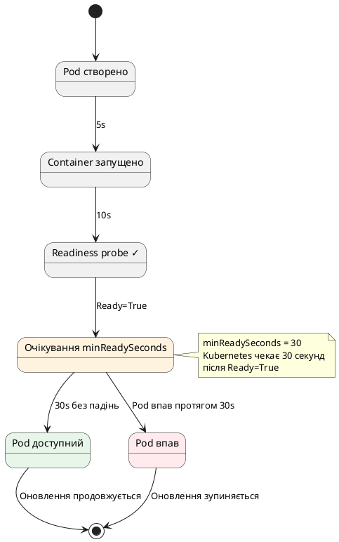

::

**Коли використовувати:**

- Застосунки з повільною ініціалізацією (підключення до БД, завантаження конфігурації)
- Застосунки, які можуть падати через кілька секунд після старту
- Критичні сервіси, де важлива стабільність

**Типові значення:**

- `0` — для простих застосунків (за замовчуванням)
- `10-30` — для більшості веб-застосунків
- `60-120` — для складних застосунків з довгою ініціалізацією


---

## Health Checks для .NET застосунків

Тепер розглянемо, як правильно налаштувати health checks для ASP.NET Core застосунків у Kubernetes.

### Базові health checks у ASP.NET Core

ASP.NET Core має вбудовану підтримку health checks через пакет `Microsoft.Extensions.Diagnostics.HealthChecks`.

**Простий приклад:**

```csharp
var builder = WebApplication.CreateBuilder(args);

// Додаємо health checks
builder.Services.AddHealthChecks();

var app = builder.Build();

// Endpoint для health checks
app.MapHealthChecks("/health");

app.Run();
```

Це створює endpoint `/health`, який повертає:
- `200 OK` + `"Healthy"` — якщо все добре
- `503 Service Unavailable` + `"Unhealthy"` — якщо є проблеми

### Розширені health checks з перевірками

Для production потрібні більш детальні перевірки:

```csharp
using Microsoft.Extensions.Diagnostics.HealthChecks;

var builder = WebApplication.CreateBuilder(args);

builder.Services.AddHealthChecks()
    // Перевірка підключення до БД
    .AddNpgSql(
        connectionString: builder.Configuration.GetConnectionString("DefaultConnection")!,
        name: "postgresql",
        failureStatus: HealthStatus.Unhealthy,
        tags: new[] { "db", "sql" })
    
    // Перевірка доступності зовнішнього API
    .AddUrlGroup(
        uri: new Uri("https://api.example.com/health"),
        name: "external-api",
        failureStatus: HealthStatus.Degraded,
        tags: new[] { "external" })
    
    // Кастомна перевірка пам'яті
    .AddCheck<MemoryHealthCheck>("memory");

var app = builder.Build();

// Liveness endpoint — перевіряє, чи застосунок живий
app.MapHealthChecks("/health/live", new HealthCheckOptions
{
    Predicate = _ => false // Не виконувати жодних перевірок, лише базову
});

// Readiness endpoint — перевіряє, чи застосунок готовий
app.MapHealthChecks("/health/ready", new HealthCheckOptions
{
    Predicate = check => check.Tags.Contains("db") || check.Tags.Contains("external")
});

// Детальний endpoint для debugging
app.MapHealthChecks("/health/detailed", new HealthCheckOptions
{
    ResponseWriter = async (context, report) =>
    {
        context.Response.ContentType = "application/json";
        var result = System.Text.Json.JsonSerializer.Serialize(new
        {
            status = report.Status.ToString(),
            checks = report.Entries.Select(e => new
            {
                name = e.Key,
                status = e.Value.Status.ToString(),
                description = e.Value.Description,
                duration = e.Value.Duration.TotalMilliseconds
            }),
            totalDuration = report.TotalDuration.TotalMilliseconds
        });
        await context.Response.WriteAsync(result);
    }
});

app.Run();

// Кастомна перевірка пам'яті
public class MemoryHealthCheck : IHealthCheck
{
    public Task<HealthCheckResult> CheckHealthAsync(
        HealthCheckContext context,
        CancellationToken cancellationToken = default)
    {
        var allocated = GC.GetTotalMemory(forceFullCollection: false);
        var threshold = 1024L * 1024L * 1024L; // 1 GB
        
        var status = allocated < threshold 
            ? HealthStatus.Healthy 
            : HealthStatus.Unhealthy;
        
        return Task.FromResult(new HealthCheckResult(
            status,
            description: $"Allocated memory: {allocated / 1024 / 1024} MB"));
    }
}
```

### Різниця між Liveness та Readiness для .NET

::card-group

::card{title="Liveness Probe (/health/live)" icon="i-heroicons-heart"}
**Мета:** Перевірити, чи застосунок **живий** (не deadlock, не crash).

**Що перевіряти:**
- Базову доступність процесу (просто повернути 200 OK)
- Критичні внутрішні компоненти (наприклад, чи не зависла черга повідомлень)

**Що НЕ перевіряти:**
- Підключення до БД (якщо БД недоступна, це не означає, що застосунок мертвий)
- Зовнішні API (їхня недоступність не означає deadlock)

**Приклад:**
```csharp
app.MapHealthChecks("/health/live", new HealthCheckOptions
{
    Predicate = _ => false // Лише базова перевірка
});
```

**Результат:** Завжди повертає 200 OK, якщо процес працює.
::

::card{title="Readiness Probe (/health/ready)" icon="i-heroicons-check-circle"}
**Мета:** Перевірити, чи застосунок **готовий** приймати трафік.

**Що перевіряти:**
- Підключення до БД (якщо БД недоступна, застосунок не може обробляти запити)
- Зовнішні залежності (API, черги повідомлень)
- Завершення ініціалізації (кеші завантажені, конфігурація прочитана)

**Приклад:**
```csharp
app.MapHealthChecks("/health/ready", new HealthCheckOptions
{
    Predicate = check => check.Tags.Contains("db") || check.Tags.Contains("external")
});
```

**Результат:** Повертає 200 OK лише якщо БД доступна та зовнішні API працюють.
::

::

### Налаштування Kubernetes probes для .NET

Тепер налаштуємо Deployment YAML для використання цих endpoints:

```yaml
apiVersion: apps/v1
kind: Deployment
metadata:
  name: todoapi
spec:
  replicas: 3
  selector:
    matchLabels:
      app: todoapi
  template:
    metadata:
      labels:
        app: todoapi
    spec:
      containers:
        - name: todoapi
          image: todoapi:2.0.0
          ports:
            - containerPort: 8080
          
          # Liveness probe — перевірка живості
          livenessProbe:
            httpGet:
              path: /health/live
              port: 8080
            initialDelaySeconds: 30    # Час на старт застосунку
            periodSeconds: 10           # Перевірка кожні 10 секунд
            timeoutSeconds: 5           # Таймаут запиту
            failureThreshold: 3         # 3 невдалі спроби → restart
            successThreshold: 1         # 1 успішна спроба → healthy
          
          # Readiness probe — перевірка готовності
          readinessProbe:
            httpGet:
              path: /health/ready
              port: 8080
            initialDelaySeconds: 10    # Менше за liveness (швидше виявити готовність)
            periodSeconds: 5            # Частіше перевіряти
            timeoutSeconds: 3           # Менший таймаут
            failureThreshold: 3         # 3 невдалі спроби → not ready
            successThreshold: 1         # 1 успішна спроба → ready
          
          # Startup probe — для застосунків з повільним стартом
          startupProbe:
            httpGet:
              path: /health/live
              port: 8080
            initialDelaySeconds: 0
            periodSeconds: 5
            timeoutSeconds: 3
            failureThreshold: 30        # 30 * 5s = 150s максимум на старт
            successThreshold: 1
          
          resources:
            requests:
              memory: "128Mi"
              cpu: "100m"
            limits:
              memory: "256Mi"
              cpu: "500m"
```

::note
**Startup Probe — що це?**

Startup probe — це спеціальна перевірка для застосунків з **повільним стартом**. Вона відключає liveness та readiness probes до тих пір, поки застосунок не стартує.

**Проблема без startup probe:**

Якщо застосунок стартує 60 секунд, а `livenessProbe.initialDelaySeconds: 30`, то liveness probe почне перевіряти застосунок через 30 секунд. Застосунок ще не готовий → liveness fails → Kubernetes вб'є контейнер → restart → знову 60 секунд старту → знову fails → **crash loop**.

**Рішення з startup probe:**

Startup probe перевіряє застосунок кожні 5 секунд, максимум 30 разів (150 секунд). Liveness та readiness probes **не працюють**, поки startup probe не пройде. Це дає застосунку достатньо часу на старт.

**Коли використовувати:**
- Застосунки з повільним стартом (> 30 секунд)
- Застосунки, які завантажують багато даних при старті
- Legacy застосунки з довгою ініціалізацією
::

### Приклад відповідей health checks

**Liveness endpoint (`/health/live`):**

::terminal-preview{title="curl /health/live"}

<div class="line"><span class="opacity-40">$</span> <strong>curl http://localhost:8080/health/live</strong></div>
<div class="line">Healthy</div>

::

**Readiness endpoint (`/health/ready`):**

::terminal-preview{title="curl /health/ready (успішно)"}

<div class="line"><span class="opacity-40">$</span> <strong>curl http://localhost:8080/health/ready</strong></div>
<div class="line">Healthy</div>

::

::terminal-preview{title="curl /health/ready (БД недоступна)"}

<div class="line"><span class="opacity-40">$</span> <strong>curl http://localhost:8080/health/ready</strong></div>
<div class="line"><span class="text-rose-400">HTTP/1.1 503 Service Unavailable</span></div>
<div class="line">Unhealthy</div>

::

**Детальний endpoint (`/health/detailed`):**

::terminal-preview{title="curl /health/detailed"}

<div class="line"><span class="opacity-40">$</span> <strong>curl http://localhost:8080/health/detailed</strong></div>
<div class="line">{</div>
<div class="line">  "status": "Healthy",</div>
<div class="line">  "checks": [</div>
<div class="line">    {</div>
<div class="line">      "name": "postgresql",</div>
<div class="line">      "status": "Healthy",</div>
<div class="line">      "description": "Connection successful",</div>
<div class="line">      "duration": 12.5</div>
<div class="line">    },</div>
<div class="line">    {</div>
<div class="line">      "name": "external-api",</div>
<div class="line">      "status": "Healthy",</div>
<div class="line">      "description": null,</div>
<div class="line">      "duration": 45.2</div>
<div class="line">    },</div>
<div class="line">    {</div>
<div class="line">      "name": "memory",</div>
<div class="line">      "status": "Healthy",</div>
<div class="line">      "description": "Allocated memory: 156 MB",</div>
<div class="line">      "duration": 0.8</div>
<div class="line">    }</div>
<div class="line">  ],</div>
<div class="line">  "totalDuration": 58.5</div>
<div class="line">}</div>

::

---

## Resource Management для .NET застосунків

Правильне налаштування ресурсів критично важливе для стабільності .NET застосунків у Kubernetes.

### Розуміння requests та limits

::plant-uml

```plantuml
@startuml
skinparam style plain
skinparam backgroundColor #ffffff

rectangle "Вузол (Node)" {
    rectangle "Доступні ресурси" as total #e3f2fd {
        [CPU: 4 cores]
        [Memory: 8 GB]
    }
    
    rectangle "Pod 1" as p1 #e8f5e9 {
        rectangle "requests" as r1 #fff3e0 {
            [CPU: 500m]
            [Memory: 512Mi]
        }
        rectangle "limits" as l1 #ffebee {
            [CPU: 1000m]
            [Memory: 1Gi]
        }
        rectangle "Реальне використання" as u1 {
            [CPU: 750m]
            [Memory: 768Mi]
        }
    }
    
    rectangle "Pod 2" as p2 #e8f5e9 {
        rectangle "requests" as r2 #fff3e0 {
            [CPU: 250m]
            [Memory: 256Mi]
        }
        rectangle "limits" as l2 #ffebee {
            [CPU: 500m]
            [Memory: 512Mi]
        }
        rectangle "Реальне використання" as u2 {
            [CPU: 300m]
            [Memory: 384Mi]
        }
    }
}

note right of r1
    Requests — гарантовані ресурси
    Scheduler використовує для
    вибору вузла
end note

note right of l1
    Limits — максимум
    CPU: throttling
    Memory: OOMKilled
end note

note right of u1
    Реальне використання
    може бути між
    requests та limits
end note

@enduml
```

::

### Що відбувається при перевищенні limits

::card-group

::card{title="CPU Throttling" icon="i-heroicons-cpu-chip"}
**Що відбувається:** Якщо Pod спробує використати більше CPU, ніж `limits.cpu`, Kubernetes **обмежує** (throttle) його CPU.

**Симптоми:**
- Застосунок працює повільніше
- Запити обробляються довше
- Таймаути у клієнтів

**Приклад:**
```yaml
resources:
  limits:
    cpu: "500m"  # 0.5 cores
```

Якщо застосунок спробує використати 1 core, Kubernetes обмежить його до 0.5 cores. Застосунок не впаде, але працюватиме повільніше.

**Як виявити:** `kubectl top pods` показує CPU usage близько до limits
::

::card{title="OOMKilled (Out Of Memory)" icon="i-heroicons-exclamation-triangle"}
**Що відбувається:** Якщо Pod спробує використати більше пам'яті, ніж `limits.memory`, Kubernetes **вб'є** (kill) контейнер.

**Симптоми:**
- Pod постійно перезапускається
- Статус `OOMKilled` у `kubectl describe pod`
- `RESTARTS` збільшується

**Приклад:**
```yaml
resources:
  limits:
    memory: "256Mi"
```

Якщо застосунок спробує виділити 300 MB, Kubernetes вб'є контейнер з exit code 137.

**Як виявити:**
```bash
kubectl describe pod <pod-name>
# Last State:     Terminated
#   Reason:       OOMKilled
#   Exit Code:    137
```
::

::

### .NET Garbage Collection та Kubernetes

.NET має особливості роботи з пам'яттю, які важливо враховувати у Kubernetes:

**Проблема:** .NET GC не знає про Kubernetes memory limits. Він бачить всю пам'ять вузла (наприклад, 8 GB) та намагається використати до 75% від неї. Але Pod має limit 256 MB → OOMKilled.

**Рішення:** Налаштувати .NET GC для роботи у контейнері:

```dockerfile
# У Dockerfile
ENV DOTNET_RUNNING_IN_CONTAINER=true
ENV DOTNET_GCHeapHardLimit=0x10000000  # 256 MB у hex (опціонально)
```

Або через Deployment YAML:

```yaml
spec:
  containers:
    - name: todoapi
      image: todoapi:2.0.0
      env:
        - name: DOTNET_RUNNING_IN_CONTAINER
          value: "true"
        - name: DOTNET_GCHeapHardLimit
          value: "0x10000000"  # 256 MB
      resources:
        limits:
          memory: "256Mi"
```

**Що робить `DOTNET_RUNNING_IN_CONTAINER`:**
- .NET GC читає cgroup limits (Kubernetes memory limits)
- GC використовує максимум 75% від limits (наприклад, 192 MB з 256 MB)
- Це запобігає OOMKilled

::tip
**Best practice для .NET у Kubernetes:**

1. **Завжди встановлюйте `DOTNET_RUNNING_IN_CONTAINER=true`** — це критично важливо
2. **Встановлюйте memory limits** — без них .NET може з'їсти всю пам'ять вузла
3. **Requests = 50-70% від limits** — залишає запас для GC
4. **Моніторте GC** — використовуйте `dotnet-counters` або Application Insights

**Приклад:**
```yaml
resources:
  requests:
    memory: "128Mi"  # Мінімум для роботи
    cpu: "100m"
  limits:
    memory: "256Mi"  # Максимум (GC використає ~192 MB)
    cpu: "500m"
```
::

### Підбір оптимальних ресурсів для .NET

Як визначити правильні значення requests та limits?

**Крок 1: Запустити без limits та виміряти**

```yaml
resources:
  requests:
    memory: "128Mi"
    cpu: "100m"
  # Без limits — дозволити використовувати скільки потрібно
```

**Крок 2: Згенерувати навантаження та виміряти споживання**

::terminal-preview{title="Вимірювання ресурсів"}

<div class="line"><span class="opacity-40"># Генерація навантаження</span></div>
<div class="line"><span class="opacity-40">$</span> <strong>wrk -t10 -c100 -d60s http://localhost:8080/todos</strong></div>
<div class="line"></div>
<div class="line"><span class="opacity-40"># Моніторинг ресурсів (у іншому терміналі)</span></div>
<div class="line"><span class="opacity-40">$</span> <strong>kubectl top pods -l app=todoapi --watch</strong></div>
<div class="line">NAME                       CPU(cores)   MEMORY(bytes)</div>
<div class="line">todoapi-xxx-yyy            450m         180Mi</div>
<div class="line">todoapi-xxx-zzz            420m         175Mi</div>
<div class="line">todoapi-xxx-www            480m         185Mi</div>

::

**Крок 3: Встановити limits з запасом**

На основі вимірювань:
- **Пікове CPU:** 480m → встановити limit `600m` (запас 25%)
- **Пікова пам'ять:** 185 MB → встановити limit `256Mi` (запас 38%)

```yaml
resources:
  requests:
    memory: "128Mi"  # Базове споживання
    cpu: "200m"      # Середнє споживання
  limits:
    memory: "256Mi"  # Пік + запас
    cpu: "600m"      # Пік + запас
```


**Типові проблеми та рішення:**

::card-group

::card{title="Проблема: OOMKilled під час GC" icon="i-heroicons-exclamation-circle"}
**Симптоми:** Pod падає під час garbage collection

**Причина:** GC потребує додаткової пам'яті для роботи. Якщо limits занадто жорсткі, GC не може виділити пам'ять → OOMKilled.

**Рішення:** Збільшити limits на 20-30% понад пікове споживання:
```yaml
resources:
  limits:
    memory: "320Mi"  # Було 256Mi
```
::

::card{title="Проблема: Повільні запити під навантаженням" icon="i-heroicons-clock"}
**Симптоми:** Запити обробляються повільно, таймаути

**Причина:** CPU throttling — застосунок досяг CPU limits

**Рішення:** Збільшити CPU limits або додати більше реплік:
```yaml
resources:
  limits:
    cpu: "1000m"  # Було 500m
# АБО
spec:
  replicas: 5  # Було 3
```
::

::

---

## Rollback та історія версій

Одна з найважливіших можливостей Deployment — швидкий **rollback** (повернення до попередньої версії).

### Як Kubernetes зберігає історію

Кожна зміна у `spec.template` створює нову **ревізію** (revision) Deployment. Kubernetes зберігає старі ReplicaSet для можливості rollback.

::plant-uml

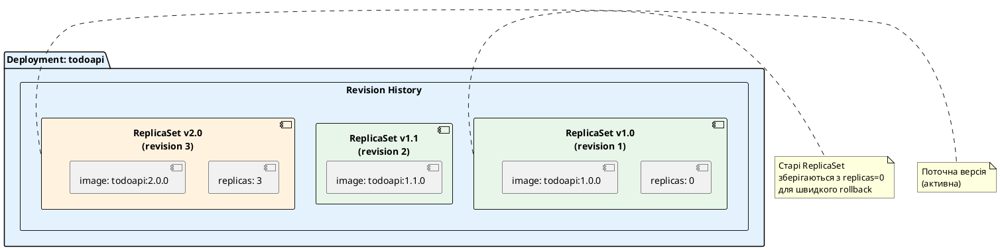

::

**Скільки ревізій зберігається?**

За замовчуванням Kubernetes зберігає **10 останніх ревізій**. Це контролюється параметром `revisionHistoryLimit`:

```yaml
spec:
  revisionHistoryLimit: 10  # За замовчуванням
```

Якщо встановити `0` — rollback буде неможливий (старі ReplicaSet видаляються одразу).

### Перегляд історії ревізій

Переглянемо історію оновлень Deployment:

::terminal-preview{title="kubectl rollout history"}

<div class="line"><span class="opacity-40">$</span> <strong>kubectl rollout history deployment/todoapi</strong></div>
<div class="line">deployment.apps/todoapi</div>
<div class="line">REVISION  CHANGE-CAUSE</div>
<div class="line">1         <none></div>
<div class="line">2         <none></div>
<div class="line">3         kubectl set image deployment/todoapi todoapi=todoapi:2.0.0</div>

::

**Що означають колонки:**

- **REVISION** — номер ревізії (збільшується з кожним оновленням)
- **CHANGE-CAUSE** — причина зміни (якщо вказана через annotation)

::tip
**Як додати CHANGE-CAUSE:**

Щоб у історії було зрозуміло, що змінилось, додайте annotation при оновленні:

```bash
kubectl set image deployment/todoapi todoapi=todoapi:2.0.0 \
  --record
```

Або через annotation у YAML:

```yaml
metadata:
  annotations:
    kubernetes.io/change-cause: "Update to version 2.0.0 with bug fixes"
```

Тепер у історії буде:
```
REVISION  CHANGE-CAUSE
3         Update to version 2.0.0 with bug fixes
```
::

### Детальна інформація про ревізію

Переглянемо детальну інформацію про конкретну ревізію:

::terminal-preview{title="kubectl rollout history (детально)"}

<div class="line"><span class="opacity-40">$</span> <strong>kubectl rollout history deployment/todoapi --revision=3</strong></div>
<div class="line">deployment.apps/todoapi with revision #3</div>
<div class="line">Pod Template:</div>
<div class="line">  Labels:       app=todoapi</div>
<div class="line">                version=2.0.0</div>
<div class="line">  Annotations:  kubernetes.io/change-cause: kubectl set image deployment/todoapi todoapi=todoapi:2.0.0</div>
<div class="line">  Containers:</div>
<div class="line">   todoapi:</div>
<div class="line">    Image:      todoapi:2.0.0</div>
<div class="line">    Port:       8080/TCP</div>
<div class="line">    Limits:</div>
<div class="line">      cpu:      500m</div>
<div class="line">      memory:   256Mi</div>
<div class="line">    Requests:</div>
<div class="line">      cpu:      100m</div>
<div class="line">      memory:   128Mi</div>

::

Тут ви бачите повну конфігурацію Pod для цієї ревізії.

### Rollback до попередньої версії

Якщо нова версія має баг, можна швидко повернутись до попередньої:

::terminal-preview{title="kubectl rollout undo"}

<div class="line"><span class="opacity-40">$</span> <strong>kubectl rollout undo deployment/todoapi</strong></div>
<div class="line"><span class="text-green-400">deployment.apps/todoapi rolled back</span></div>

::

Що відбувається:

1. Kubernetes знаходить попередню ревізію (revision 2)
2. Збільшує `replicas` старого ReplicaSet (revision 2) з 0 до 3
3. Зменшує `replicas` поточного ReplicaSet (revision 3) з 3 до 0
4. Виконує rolling update у зворотному напрямку

::plant-uml

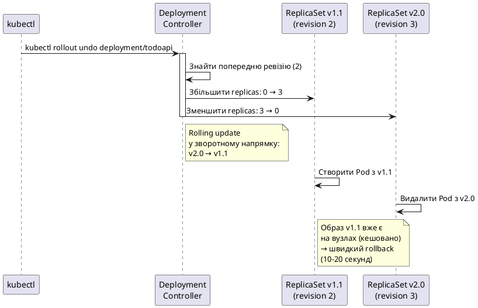

::

**Швидкість rollback:**

Rollback зазвичай займає **10-20 секунд**, бо:
- Образ попередньої версії вже є на вузлах (кешовано)
- Не потрібно завантажувати образ з registry
- Kubernetes просто перемикає ReplicaSet

### Rollback до конкретної ревізії

Можна повернутись не лише до попередньої, а до будь-якої ревізії:

::terminal-preview{title="kubectl rollout undo (конкретна ревізія)"}

<div class="line"><span class="opacity-40">$</span> <strong>kubectl rollout undo deployment/todoapi --to-revision=1</strong></div>
<div class="line"><span class="text-green-400">deployment.apps/todoapi rolled back</span></div>

::

Це повертає Deployment до ревізії 1 (самої першої версії).

### Моніторинг процесу rollout

Під час оновлення або rollback можна стежити за прогресом:

::terminal-preview{title="kubectl rollout status"}

<div class="line"><span class="opacity-40">$</span> <strong>kubectl rollout status deployment/todoapi</strong></div>
<div class="line">Waiting for deployment "todoapi" rollout to finish: 1 out of 3 new replicas have been updated...</div>
<div class="line">Waiting for deployment "todoapi" rollout to finish: 1 out of 3 new replicas have been updated...</div>
<div class="line">Waiting for deployment "todoapi" rollout to finish: 2 out of 3 new replicas have been updated...</div>
<div class="line">Waiting for deployment "todoapi" rollout to finish: 2 old replicas are pending termination...</div>
<div class="line">Waiting for deployment "todoapi" rollout to finish: 1 old replicas are pending termination...</div>
<div class="line"><span class="text-green-400">deployment "todoapi" successfully rolled out</span></div>

::

Ця команда блокується до завершення rollout. Корисно для CI/CD pipelines.

### Призупинення та відновлення rollout

Іноді потрібно призупинити оновлення (наприклад, для canary deployment):

::terminal-preview{title="kubectl rollout pause"}

<div class="line"><span class="opacity-40">$</span> <strong>kubectl rollout pause deployment/todoapi</strong></div>
<div class="line"><span class="text-yellow-400">deployment.apps/todoapi paused</span></div>

::

Після паузи оновлення зупиняється. Можна внести кілька змін, а потім відновити:

::terminal-preview{title="kubectl rollout resume"}

<div class="line"><span class="opacity-40">$</span> <strong>kubectl rollout resume deployment/todoapi</strong></div>
<div class="line"><span class="text-green-400">deployment.apps/todoapi resumed</span></div>

::

**Навіщо це потрібно?**

**Canary deployment:** Оновити 1 Pod, перевірити метрики, і якщо все добре — продовжити оновлення решти Pod.

```bash
# Призупинити оновлення
kubectl rollout pause deployment/todoapi

# Оновити образ (створюється лише 1 новий Pod)
kubectl set image deployment/todoapi todoapi=todoapi:2.0.0

# Почекати 5 хвилин, перевірити метрики
sleep 300

# Якщо все добре — продовжити
kubectl rollout resume deployment/todoapi

# Якщо є проблеми — rollback
kubectl rollout undo deployment/todoapi
```

---

## Практичний приклад: оновлення TodoApi з v1.0 на v2.0

Тепер створимо реальний приклад оновлення застосунку з новою функціональністю.

### Версія 1.0: Базовий CRUD

Це наш початковий TodoApi (з попередньої статті):

**Program.cs (v1.0):**

```csharp
using System.Collections.Concurrent;

var builder = WebApplication.CreateBuilder(args);

builder.Services.AddEndpointsApiExplorer();
builder.Services.AddSwaggerGen();

var todos = new ConcurrentDictionary<int, Todo>();
var nextId = 1;

var app = builder.Build();

if (app.Environment.IsDevelopment())
{
    app.UseSwagger();
    app.UseSwaggerUI();
}

app.MapGet("/health", () => Results.Ok(new { status = "healthy", version = "1.0.0" }));

app.MapGet("/todos", () => Results.Ok(new { todos = todos.Values, count = todos.Count }));

app.MapGet("/todos/{id:int}", (int id) =>
    todos.TryGetValue(id, out var todo) ? Results.Ok(todo) : Results.NotFound());

app.MapPost("/todos", (CreateTodoRequest request) =>
{
    var id = Interlocked.Increment(ref nextId);
    var todo = new Todo
    {
        Id = id,
        Title = request.Title,
        IsCompleted = false,
        CreatedAt = DateTime.UtcNow
    };
    todos[id] = todo;
    return Results.Created($"/todos/{id}", todo);
});

app.MapPut("/todos/{id:int}", (int id, UpdateTodoRequest request) =>
{
    if (!todos.TryGetValue(id, out var todo))
        return Results.NotFound();
    
    todo.Title = request.Title ?? todo.Title;
    todo.IsCompleted = request.IsCompleted ?? todo.IsCompleted;
    return Results.Ok(todo);
});

app.MapDelete("/todos/{id:int}", (int id) =>
    todos.TryRemove(id, out var todo) ? Results.Ok(todo) : Results.NotFound());

app.Run();

record Todo
{
    public int Id { get; set; }
    public required string Title { get; set; }
    public bool IsCompleted { get; set; }
    public DateTime CreatedAt { get; set; }
}

record CreateTodoRequest(string Title);
record UpdateTodoRequest(string? Title, bool? IsCompleted);
```

### Версія 2.0: Додавання статистики

Тепер додамо новий endpoint `/stats` для статистики:

**Program.cs (v2.0):**

```csharp
using System.Collections.Concurrent;

var builder = WebApplication.CreateBuilder(args);

builder.Services.AddEndpointsApiExplorer();
builder.Services.AddSwaggerGen();

var todos = new ConcurrentDictionary<int, Todo>();
var nextId = 1;

var app = builder.Build();

if (app.Environment.IsDevelopment())
{
    app.UseSwagger();
    app.UseSwaggerUI();
}

// Оновлена версія у health check
app.MapGet("/health", () => Results.Ok(new { status = "healthy", version = "2.0.0" }));

app.MapGet("/todos", () => Results.Ok(new { todos = todos.Values, count = todos.Count }));

app.MapGet("/todos/{id:int}", (int id) =>
    todos.TryGetValue(id, out var todo) ? Results.Ok(todo) : Results.NotFound());

app.MapPost("/todos", (CreateTodoRequest request) =>
{
    var id = Interlocked.Increment(ref nextId);
    var todo = new Todo
    {
        Id = id,
        Title = request.Title,
        IsCompleted = false,
        CreatedAt = DateTime.UtcNow
    };
    todos[id] = todo;
    return Results.Created($"/todos/{id}", todo);
});

app.MapPut("/todos/{id:int}", (int id, UpdateTodoRequest request) =>
{
    if (!todos.TryGetValue(id, out var todo))
        return Results.NotFound();
    
    todo.Title = request.Title ?? todo.Title;
    todo.IsCompleted = request.IsCompleted ?? todo.IsCompleted;
    return Results.Ok(todo);
});

app.MapDelete("/todos/{id:int}", (int id) =>
    todos.TryRemove(id, out var todo) ? Results.Ok(todo) : Results.NotFound());

// НОВИЙ ENDPOINT: Статистика
app.MapGet("/stats", () =>
{
    var allTodos = todos.Values.ToList();
    var completed = allTodos.Count(t => t.IsCompleted);
    var pending = allTodos.Count - completed;
    var oldestTodo = allTodos.MinBy(t => t.CreatedAt);
    var newestTodo = allTodos.MaxBy(t => t.CreatedAt);
    
    return Results.Ok(new
    {
        total = allTodos.Count,
        completed,
        pending,
        completionRate = allTodos.Count > 0 ? (double)completed / allTodos.Count * 100 : 0,
        oldestTodo = oldestTodo?.CreatedAt,
        newestTodo = newestTodo?.CreatedAt
    });
})
.WithName("GetStatistics")
.WithOpenApi();

app.Run();

record Todo
{
    public int Id { get; set; }
    public required string Title { get; set; }
    public bool IsCompleted { get; set; }
    public DateTime CreatedAt { get; set; }
}

record CreateTodoRequest(string Title);
record UpdateTodoRequest(string? Title, bool? IsCompleted);
```

**Зміни у версії 2.0:**

1. Оновлено версію у `/health` endpoint (1.0.0 → 2.0.0)
2. Додано новий endpoint `/stats` з детальною статистикою

### Збірка нової версії

Зберемо образ версії 2.0:

::terminal-preview{title="Збірка v2.0"}

<div class="line"><span class="opacity-40">$</span> <strong>eval $(minikube docker-env)</strong></div>
<div class="line"><span class="opacity-40">$</span> <strong>docker build -t todoapi:2.0.0 .</strong></div>
<div class="line">[+] Building 42.1s (15/15) FINISHED</div>
<div class="line"><span class="text-green-400"> => exporting to image</span></div>
<div class="line"><span class="text-green-400"> => => naming to docker.io/library/todoapi:2.0.0</span></div>

::

### Виконання rolling update

Тепер оновимо Deployment на нову версію:

::terminal-preview{title="Rolling update на v2.0"}

<div class="line"><span class="opacity-40">$</span> <strong>kubectl set image deployment/todoapi todoapi=todoapi:2.0.0 --record</strong></div>
<div class="line"><span class="text-green-400">deployment.apps/todoapi image updated</span></div>

::

Стежимо за прогресом:

::terminal-preview{title="kubectl rollout status"}

<div class="line"><span class="opacity-40">$</span> <strong>kubectl rollout status deployment/todoapi</strong></div>
<div class="line">Waiting for deployment "todoapi" rollout to finish: 1 out of 3 new replicas have been updated...</div>
<div class="line">Waiting for deployment "todoapi" rollout to finish: 1 out of 3 new replicas have been updated...</div>
<div class="line">Waiting for deployment "todoapi" rollout to finish: 2 out of 3 new replicas have been updated...</div>
<div class="line">Waiting for deployment "todoapi" rollout to finish: 1 old replicas are pending termination...</div>
<div class="line"><span class="text-green-400">deployment "todoapi" successfully rolled out</span></div>

::

Спостерігаємо за Pod у реальному часі:

::terminal-preview{title="kubectl get pods -w"}

<div class="line"><span class="opacity-40">$</span> <strong>kubectl get pods -l app=todoapi -w</strong></div>
<div class="line">NAME                       READY   STATUS    RESTARTS   AGE</div>
<div class="line">todoapi-abc123-xxx         1/1     Running   0          5m</div>
<div class="line">todoapi-abc123-yyy         1/1     Running   0          5m</div>
<div class="line">todoapi-abc123-zzz         1/1     Running   0          5m</div>
<div class="line">todoapi-def456-aaa         0/1     Pending   0          0s</div>
<div class="line">todoapi-def456-aaa         0/1     ContainerCreating   0          2s</div>
<div class="line">todoapi-def456-aaa         1/1     Running             0          15s</div>
<div class="line">todoapi-abc123-xxx         1/1     Terminating         0          5m15s</div>
<div class="line">todoapi-def456-bbb         0/1     Pending             0          0s</div>
<div class="line">todoapi-def456-bbb         0/1     ContainerCreating   0          1s</div>
<div class="line">todoapi-def456-bbb         1/1     Running             0          12s</div>
<div class="line">todoapi-abc123-yyy         1/1     Terminating         0          5m27s</div>
<div class="line">todoapi-def456-ccc         0/1     Pending             0          0s</div>
<div class="line">todoapi-def456-ccc         0/1     ContainerCreating   0          2s</div>
<div class="line">todoapi-def456-ccc         1/1     Running             0          14s</div>
<div class="line">todoapi-abc123-zzz         1/1     Terminating         0          5m41s</div>

::

Бачимо класичний rolling update: нові Pod створюються, старі видаляються по черзі.


### Тестування нової версії

Після завершення оновлення протестуємо новий endpoint:

::terminal-preview{title="Тестування v2.0"}

<div class="line"><span class="opacity-40">$</span> <strong>kubectl port-forward deployment/todoapi 8080:8080 &</strong></div>
<div class="line"></div>
<div class="line"><span class="opacity-40"># Перевірка версії</span></div>
<div class="line"><span class="opacity-40">$</span> <strong>curl http://localhost:8080/health</strong></div>
<div class="line">{"status":"healthy","version":"2.0.0"}</div>
<div class="line"></div>
<div class="line"><span class="opacity-40"># Створення кількох todos</span></div>
<div class="line"><span class="opacity-40">$</span> <strong>curl -X POST http://localhost:8080/todos -H "Content-Type: application/json" \</strong></div>
<div class="line">  <strong>-d '{"title":"Вивчити Rolling Updates"}'</strong></div>
<div class="line"></div>
<div class="line"><span class="opacity-40">$</span> <strong>curl -X POST http://localhost:8080/todos -H "Content-Type: application/json" \</strong></div>
<div class="line">  <strong>-d '{"title":"Протестувати Rollback"}'</strong></div>
<div class="line"></div>
<div class="line"><span class="opacity-40"># Позначити перший як completed</span></div>
<div class="line"><span class="opacity-40">$</span> <strong>curl -X PUT http://localhost:8080/todos/1 -H "Content-Type: application/json" \</strong></div>
<div class="line">  <strong>-d '{"isCompleted":true}'</strong></div>
<div class="line"></div>
<div class="line"><span class="opacity-40"># НОВИЙ ENDPOINT: Статистика</span></div>
<div class="line"><span class="opacity-40">$</span> <strong>curl http://localhost:8080/stats</strong></div>
<div class="line">{</div>
<div class="line">  "total": 2,</div>
<div class="line">  "completed": 1,</div>
<div class="line">  "pending": 1,</div>
<div class="line">  "completionRate": 50.0,</div>
<div class="line">  "oldestTodo": "2026-05-09T20:50:00.123Z",</div>
<div class="line">  "newestTodo": "2026-05-09T20:50:05.456Z"</div>
<div class="line">}</div>

::

Новий endpoint `/stats` працює! Оновлення успішне.

### Симуляція проблеми та rollback

Тепер уявімо, що версія 2.0 має критичний баг (наприклад, endpoint `/stats` падає під навантаженням). Потрібно швидко повернутись до версії 1.0.

::terminal-preview{title="Rollback до v1.0"}

<div class="line"><span class="opacity-40">$</span> <strong>kubectl rollout undo deployment/todoapi</strong></div>
<div class="line"><span class="text-green-400">deployment.apps/todoapi rolled back</span></div>

::

::terminal-preview{title="Моніторинг rollback"}

<div class="line"><span class="opacity-40">$</span> <strong>kubectl rollout status deployment/todoapi</strong></div>
<div class="line">Waiting for deployment "todoapi" rollout to finish: 1 out of 3 new replicas have been updated...</div>
<div class="line">Waiting for deployment "todoapi" rollout to finish: 2 out of 3 new replicas have been updated...</div>
<div class="line"><span class="text-green-400">deployment "todoapi" successfully rolled out</span></div>

::

Перевіримо версію:

::terminal-preview{title="Перевірка версії після rollback"}

<div class="line"><span class="opacity-40">$</span> <strong>curl http://localhost:8080/health</strong></div>
<div class="line">{"status":"healthy","version":"1.0.0"}</div>
<div class="line"></div>
<div class="line"><span class="opacity-40"># Endpoint /stats більше не існує</span></div>
<div class="line"><span class="opacity-40">$</span> <strong>curl http://localhost:8080/stats</strong></div>
<div class="line"><span class="text-rose-400">HTTP/1.1 404 Not Found</span></div>

::

Rollback виконано за **15-20 секунд**! Застосунок повернувся до стабільної версії 1.0.

### Перегляд історії після rollback

::terminal-preview{title="kubectl rollout history"}

<div class="line"><span class="opacity-40">$</span> <strong>kubectl rollout history deployment/todoapi</strong></div>
<div class="line">deployment.apps/todoapi</div>
<div class="line">REVISION  CHANGE-CAUSE</div>
<div class="line">2         kubectl set image deployment/todoapi todoapi=todoapi:2.0.0 --record=true</div>
<div class="line">3         <none></div>

::

**Що сталося з ревізіями?**

- **Ревізія 1** (v1.0) зникла — вона стала **ревізією 3** після rollback
- **Ревізія 2** (v2.0) залишилась у історії
- **Ревізія 3** — це знову v1.0 (результат rollback)

Kubernetes не видаляє ревізії, а створює нову з тим самим шаблоном Pod.

---

## Troubleshooting: типові проблеми та їх вирішення

Тепер розглянемо найчастіші проблеми при rolling updates та як їх діагностувати.

### Проблема 1: Оновлення зависло (Progressing: False)

**Симптоми:**

::terminal-preview{title="kubectl get deployments"}

<div class="line"><span class="opacity-40">$</span> <strong>kubectl get deployments</strong></div>
<div class="line">NAME      READY   UP-TO-DATE   AVAILABLE   AGE</div>
<div class="line">todoapi   2/3     1            2           10m</div>

::

Бачимо `2/3` — лише 2 з 3 реплік готові. Оновлення не завершується.

**Діагностика:**

::terminal-preview{title="kubectl describe deployment"}

<div class="line"><span class="opacity-40">$</span> <strong>kubectl describe deployment todoapi</strong></div>
<div class="line">Conditions:</div>
<div class="line">  Type           Status  Reason</div>
<div class="line">  ----           ------  ------</div>
<div class="line">  Available      True    MinimumReplicasAvailable</div>
<div class="line">  Progressing    False   ProgressDeadlineExceeded</div>
<div class="line"></div>
<div class="line">Events:</div>
<div class="line">  Type     Reason        Age   Message</div>
<div class="line">  ----     ------        ----  -------</div>
<div class="line">  Warning  FailedCreate  5m    Error creating: pods "todoapi-xxx" is forbidden: exceeded quota</div>

::

**Причина:** `ProgressDeadlineExceeded` — оновлення не досягло прогресу за `progressDeadlineSeconds`.

**Можливі причини:**

::card-group

::card{title="Новий Pod не проходить readiness probe" icon="i-heroicons-x-circle"}
**Перевірка:**
```bash
kubectl get pods
# NAME                       READY   STATUS    RESTARTS   AGE
# todoapi-def456-aaa         0/1     Running   0          5m
```

Pod у стані `Running`, але `READY` = `0/1` — readiness probe fails.

**Рішення:**
1. Переглянути логи: `kubectl logs todoapi-def456-aaa`
2. Перевірити readiness probe endpoint вручну: `kubectl exec -it todoapi-def456-aaa -- curl localhost:8080/health/ready`
3. Виправити проблему (наприклад, БД недоступна) або відкотити: `kubectl rollout undo deployment/todoapi`
::

::card{title="Недостатньо ресурсів на вузлах" icon="i-heroicons-server"}
**Перевірка:**
```bash
kubectl describe pod todoapi-def456-aaa
# Events:
#   Warning  FailedScheduling  5m  0/3 nodes are available: insufficient memory
```

**Рішення:**
1. Зменшити `resources.requests` у Deployment
2. Додати більше вузлів до кластера
3. Видалити непотрібні Pod для звільнення ресурсів
::

::card{title="Образ не може завантажитись" icon="i-heroicons-photo"}
**Перевірка:**
```bash
kubectl describe pod todoapi-def456-aaa
# Events:
#   Warning  Failed  5m  Failed to pull image "todoapi:2.0.0": rpc error: code = Unknown desc = Error response from daemon: pull access denied
```

**Рішення:**
1. Перевірити, чи існує образ: `docker images | grep todoapi`
2. Перевірити `imagePullPolicy` (для Minikube має бути `Never`)
3. Перевірити credentials для private registry
::

::

### Проблема 2: Pod постійно перезапускаються (CrashLoopBackOff)

**Симптоми:**

::terminal-preview{title="kubectl get pods"}

<div class="line"><span class="opacity-40">$</span> <strong>kubectl get pods</strong></div>
<div class="line">NAME                       READY   STATUS             RESTARTS   AGE</div>
<div class="line">todoapi-def456-aaa         0/1     CrashLoopBackOff   5          3m</div>

::

**Діагностика:**

::terminal-preview{title="kubectl describe pod"}

<div class="line"><span class="opacity-40">$</span> <strong>kubectl describe pod todoapi-def456-aaa</strong></div>
<div class="line">Last State:     Terminated</div>
<div class="line">  Reason:       Error</div>
<div class="line">  Exit Code:    1</div>
<div class="line">  Started:      Fri, 09 May 2026 20:50:00 +0000</div>
<div class="line">  Finished:     Fri, 09 May 2026 20:50:05 +0000</div>

::

**Перегляд логів:**

::terminal-preview{title="kubectl logs"}

<div class="line"><span class="opacity-40">$</span> <strong>kubectl logs todoapi-def456-aaa</strong></div>
<div class="line"><span class="text-rose-400">Unhandled exception. System.InvalidOperationException: Unable to resolve service for type 'MyService'</span></div>

::

**Можливі причини:**

- Помилка у коді (exception при старті)
- Відсутня залежність (DI не може resolve service)
- Неправильна конфігурація (змінні оточення, ConfigMap)
- OOMKilled (перевищено memory limits)

**Рішення:**

1. Виправити код та зібрати новий образ
2. Або виконати rollback: `kubectl rollout undo deployment/todoapi`

### Проблема 3: Оновлення занадто повільне

**Симптоми:** Rolling update займає 10+ хвилин для 10 реплік.

**Причина:** Обережні налаштування `maxSurge` та `maxUnavailable`.

**Поточна конфігурація:**

```yaml
strategy:
  rollingUpdate:
    maxSurge: 1
    maxUnavailable: 0
```

Це означає: оновлювати по 1 Pod за раз, завжди тримати всі репліки доступними.

**Рішення:** Збільшити `maxSurge` для швидшого оновлення:

```yaml
strategy:
  rollingUpdate:
    maxSurge: 50%      # Було: 1
    maxUnavailable: 0
```

Тепер Kubernetes створить 50% нових Pod одразу (5 з 10), що прискорить оновлення.

### Проблема 4: Downtime під час оновлення

**Симптоми:** Користувачі отримують помилки 503 під час rolling update.

**Причина:** Pod видаляються до того, як нові стануть готовими.

**Діагностика:**

Перевірте `maxUnavailable`:

```yaml
strategy:
  rollingUpdate:
    maxSurge: 0
    maxUnavailable: 1
```

Якщо `maxSurge: 0`, Kubernetes спочатку видаляє старий Pod, потім створює новий. Є момент, коли реплік менше, ніж потрібно.

**Рішення:** Встановити `maxSurge > 0` та `maxUnavailable: 0`:

```yaml
strategy:
  rollingUpdate:
    maxSurge: 1
    maxUnavailable: 0
```

Тепер Kubernetes спочатку створює новий Pod, чекає його готовності, і лише потім видаляє старий. Завжди є повна кількість реплік.

### Проблема 5: Старі Pod не видаляються

**Симптоми:** Після оновлення залишаються старі Pod у стані `Terminating`.

::terminal-preview{title="kubectl get pods"}

<div class="line"><span class="opacity-40">$</span> <strong>kubectl get pods</strong></div>
<div class="line">NAME                       READY   STATUS        RESTARTS   AGE</div>
<div class="line">todoapi-abc123-xxx         1/1     Terminating   0          10m</div>
<div class="line">todoapi-def456-aaa         1/1     Running       0          2m</div>

::

**Причина:** Pod не завершується gracefully (не обробляє SIGTERM).

**Що відбувається:**

1. Kubernetes надсилає SIGTERM контейнеру
2. Контейнер має 30 секунд (за замовчуванням) для graceful shutdown
3. Якщо контейнер не завершується — Kubernetes надсилає SIGKILL (force kill)

**Рішення для .NET:**

Додати обробку graceful shutdown:

```csharp
var builder = WebApplication.CreateBuilder(args);

// ... конфігурація ...

var app = builder.Build();

// Налаштування graceful shutdown
var lifetime = app.Services.GetRequiredService<IHostApplicationLifetime>();

lifetime.ApplicationStopping.Register(() =>
{
    Console.WriteLine("Application is stopping. Finishing current requests...");
    // Тут можна закрити з'єднання з БД, flush кеші тощо
});

app.Run();
```

Також можна збільшити `terminationGracePeriodSeconds` у Deployment:

```yaml
spec:
  template:
    spec:
      terminationGracePeriodSeconds: 60  # За замовчуванням 30
      containers:
        - name: todoapi
          image: todoapi:2.0.0
```

### Корисні команди для debugging

::code-group

```bash [Перегляд стану]
# Статус Deployment
kubectl get deployment todoapi

# Детальна інформація
kubectl describe deployment todoapi

# Статус rollout
kubectl rollout status deployment/todoapi

# Історія ревізій
kubectl rollout history deployment/todoapi

# Детальна інформація про ревізію
kubectl rollout history deployment/todoapi --revision=3
```

```bash [Перегляд Pod]
# Список Pod
kubectl get pods -l app=todoapi

# Спостереження в реальному часі
kubectl get pods -l app=todoapi -w

# Детальна інформація про Pod
kubectl describe pod <pod-name>

# Логи Pod
kubectl logs <pod-name>

# Логи попереднього контейнера (якщо Pod перезапустився)
kubectl logs <pod-name> --previous
```

```bash [Debugging]
# Виконати команду всередині Pod
kubectl exec -it <pod-name> -- /bin/bash

# Перевірити health endpoint
kubectl exec -it <pod-name> -- curl localhost:8080/health

# Копіювати файли з Pod
kubectl cp <pod-name>:/app/logs/app.log ./app.log

# Події кластера
kubectl get events --sort-by=.metadata.creationTimestamp

# Моніторинг ресурсів
kubectl top pods -l app=todoapi
```

```bash [Rollback]
# Rollback до попередньої версії
kubectl rollout undo deployment/todoapi

# Rollback до конкретної ревізії
kubectl rollout undo deployment/todoapi --to-revision=2

# Призупинити оновлення
kubectl rollout pause deployment/todoapi

# Відновити оновлення
kubectl rollout resume deployment/todoapi
```

::

---

## Практичні завдання

Тепер виконайте завдання для закріплення знань про rolling updates.

### Завдання 1: Експерименти з maxSurge та maxUnavailable

**Мета:** Зрозуміти, як різні комбінації параметрів впливають на швидкість та безпеку оновлення.

**Завдання:**

1. Створіть Deployment з 5 репліками nginx

2. Виконайте 3 оновлення з різними налаштуваннями:
   - `maxSurge: 0, maxUnavailable: 1` (повільне, економне)
   - `maxSurge: 1, maxUnavailable: 0` (безпечне, zero-downtime)
   - `maxSurge: 100%, maxUnavailable: 0` (швидке, ресурсомістке)

3. Для кожного оновлення виміряйте:
   - Час оновлення (від початку до завершення)
   - Максимальну кількість Pod під час оновлення
   - Мінімальну кількість доступних Pod

4. Порівняйте результати

**Очікуваний результат:** Ви побачите, як різні налаштування впливають на швидкість та ресурси.

::collapsible{title="Показати рішення"}

**deployment.yaml:**

```yaml
apiVersion: apps/v1
kind: Deployment
metadata:
  name: nginx-test
spec:
  replicas: 5
  strategy:
    type: RollingUpdate
    rollingUpdate:
      maxSurge: 0
      maxUnavailable: 1
  selector:
    matchLabels:
      app: nginx
  template:
    metadata:
      labels:
        app: nginx
    spec:
      containers:
        - name: nginx
          image: nginx:1.25
          ports:
            - containerPort: 80
```

**Команди:**

```bash
# Створення
kubectl apply -f deployment.yaml

# Тест 1: maxSurge=0, maxUnavailable=1
time kubectl set image deployment/nginx-test nginx=nginx:1.26
kubectl get pods -l app=nginx -w  # Спостерігати

# Тест 2: maxSurge=1, maxUnavailable=0
kubectl patch deployment nginx-test -p '{"spec":{"strategy":{"rollingUpdate":{"maxSurge":1,"maxUnavailable":0}}}}'
time kubectl set image deployment/nginx-test nginx=nginx:1.27
kubectl get pods -l app=nginx -w

# Тест 3: maxSurge=100%, maxUnavailable=0
kubectl patch deployment nginx-test -p '{"spec":{"strategy":{"rollingUpdate":{"maxSurge":"100%","maxUnavailable":0}}}}'
time kubectl set image deployment/nginx-test nginx=nginx:1.25
kubectl get pods -l app=nginx -w

# Очищення
kubectl delete deployment nginx-test
```

**Очікувані результати:**

| Конфігурація | Час оновлення | Max Pod | Min Available |
|--------------|---------------|---------|---------------|
| maxSurge=0, maxUnavailable=1 | ~60s | 5 | 4 |
| maxSurge=1, maxUnavailable=0 | ~75s | 6 | 5 |
| maxSurge=100%, maxUnavailable=0 | ~30s | 10 | 5 |

::


---

### Завдання 2: Симуляція невдалого оновлення

**Мета:** Навчитись діагностувати та виправляти проблеми при rolling update.

**Завдання:**

1. Створіть Deployment з образом, який не існує (наприклад, `nginx:nonexistent`)

2. Спостерігайте, як Kubernetes намагається оновити Pod

3. Діагностуйте проблему через `kubectl describe pod`

4. Виконайте rollback до робочої версії

5. Перевірте, що застосунок знову працює

**Очікуваний результат:** Ви навчитесь виявляти проблеми з образами та швидко відкочувати оновлення.

::collapsible{title="Показати рішення"}

**Команди:**

```bash
# Створення робочого Deployment
kubectl create deployment nginx-test --image=nginx:1.27 --replicas=3

# Перевірка, що все працює
kubectl get pods -l app=nginx-test
# NAME                          READY   STATUS    RESTARTS   AGE
# nginx-test-xxx-yyy            1/1     Running   0          10s
# nginx-test-xxx-zzz            1/1     Running   0          10s
# nginx-test-xxx-www            1/1     Running   0          10s

# Спроба оновлення на неіснуючий образ
kubectl set image deployment/nginx-test nginx=nginx:nonexistent --record

# Спостереження за процесом (оновлення зависне)
kubectl rollout status deployment/nginx-test
# Waiting for deployment "nginx-test" rollout to finish: 1 out of 3 new replicas have been updated...

# Перегляд Pod (новий Pod не може стартувати)
kubectl get pods -l app=nginx-test
# NAME                          READY   STATUS             RESTARTS   AGE
# nginx-test-xxx-yyy            1/1     Running            0          2m
# nginx-test-xxx-zzz            1/1     Running            0          2m
# nginx-test-aaa-bbb            0/1     ImagePullBackOff   0          30s

# Діагностика проблеми
kubectl describe pod nginx-test-aaa-bbb
# Events:
#   Warning  Failed     30s   Failed to pull image "nginx:nonexistent": rpc error: code = NotFound desc = manifest for nginx:nonexistent not found

# Rollback до попередньої версії
kubectl rollout undo deployment/nginx-test

# Перевірка, що rollback успішний
kubectl rollout status deployment/nginx-test
# deployment "nginx-test" successfully rolled out

kubectl get pods -l app=nginx-test
# NAME                          READY   STATUS    RESTARTS   AGE
# nginx-test-xxx-yyy            1/1     Running   0          3m
# nginx-test-xxx-zzz            1/1     Running   0          3m
# nginx-test-xxx-www            1/1     Running   0          3m

# Очищення
kubectl delete deployment nginx-test
```

**Ключові моменти:**

1. Kubernetes **не відкочує автоматично** — старі Pod продовжують працювати
2. Нові Pod застрягають у стані `ImagePullBackOff` або `ErrImagePull`
3. Rollback виконується швидко (10-15 секунд), бо образ вже є на вузлах
4. Сервіс залишається доступним весь час (старі Pod працюють)

::

---

### Завдання 3: Canary Deployment

**Мета:** Навчитись виконувати canary deployment — оновлення з поступовою перевіркою.

**Завдання:**

1. Створіть Deployment з 10 репліками nginx:1.25

2. Призупиніть rollout

3. Оновіть образ на nginx:1.26 (створюється лише 1 новий Pod)

4. Перевірте метрики нового Pod (логи, CPU, пам'ять)

5. Якщо все добре — відновіть rollout для оновлення решти Pod

6. Якщо є проблеми — виконайте rollback

**Очікуваний результат:** Ви навчитесь безпечно оновлювати застосунки, перевіряючи нову версію на малій кількості Pod перед повним rollout.

::collapsible{title="Показати рішення"}

**Команди:**

```bash
# Створення Deployment з 10 репліками
kubectl create deployment nginx-canary --image=nginx:1.25 --replicas=10

# Перевірка, що все працює
kubectl get pods -l app=nginx-canary
# 10 Pod у стані Running

# Призупинити rollout
kubectl rollout pause deployment/nginx-canary

# Оновити образ (створюється лише 1 новий Pod через maxSurge)
kubectl set image deployment/nginx-canary nginx=nginx:1.26 --record

# Спостереження (лише 1 новий Pod створюється)
kubectl get pods -l app=nginx-canary
# NAME                            READY   STATUS    RESTARTS   AGE
# nginx-canary-abc123-xxx         1/1     Running   0          2m  (старий)
# nginx-canary-abc123-yyy         1/1     Running   0          2m  (старий)
# ...
# nginx-canary-def456-aaa         1/1     Running   0          10s (новий!)

# Перевірка нового Pod
NEW_POD=$(kubectl get pods -l app=nginx-canary -o jsonpath='{.items[0].metadata.name}')

# Логи
kubectl logs $NEW_POD

# Ресурси
kubectl top pod $NEW_POD

# Тестування
kubectl exec -it $NEW_POD -- curl localhost

# Якщо все добре — продовжити rollout
kubectl rollout resume deployment/nginx-canary

# Спостереження за повним оновленням
kubectl rollout status deployment/nginx-canary

# Перевірка, що всі Pod оновлені
kubectl get pods -l app=nginx-canary
# Всі Pod мають новий hash (def456)

# Очищення
kubectl delete deployment nginx-canary
```

**Альтернатива: Rollback якщо є проблеми**

```bash
# Якщо новий Pod має проблеми
kubectl rollout undo deployment/nginx-canary

# Відновити rollout (щоб undo застосувався)
kubectl rollout resume deployment/nginx-canary
```

**Переваги canary deployment:**

1. Ризик мінімальний — лише 1 Pod з новою версією
2. Можна перевірити метрики, логи, поведінку під навантаженням
3. Якщо є проблеми — вплив на 10% трафіку (1 з 10 Pod)
4. Швидкий rollback — більшість Pod ще на старій версії

::

---

### Завдання 4: Blue-Green Deployment

**Мета:** Навчитись виконувати blue-green deployment — миттєве перемикання між версіями.

**Завдання:**

1. Створіть два Deployment: `app-blue` (v1.0) та `app-green` (v2.0)

2. Створіть Service, який спрямовує трафік на `app-blue`

3. Перевірте, що трафік йде на v1.0

4. Змініть Service selector на `app-green`

5. Перевірте, що трафік миттєво перемкнувся на v2.0

6. Якщо є проблеми — поверніть selector на `app-blue`

**Очікуваний результат:** Ви навчитесь виконувати миттєве перемикання між версіями без rolling update.

::collapsible{title="Показати рішення"}

**app-blue-deployment.yaml:**

```yaml
apiVersion: apps/v1
kind: Deployment
metadata:
  name: app-blue
spec:
  replicas: 3
  selector:
    matchLabels:
      app: myapp
      version: blue
  template:
    metadata:
      labels:
        app: myapp
        version: blue
    spec:
      containers:
        - name: nginx
          image: nginx:1.25
          ports:
            - containerPort: 80
          env:
            - name: VERSION
              value: "1.0.0"
```

**app-green-deployment.yaml:**

```yaml
apiVersion: apps/v1
kind: Deployment
metadata:
  name: app-green
spec:
  replicas: 3
  selector:
    matchLabels:
      app: myapp
      version: green
  template:
    metadata:
      labels:
        app: myapp
        version: green
    spec:
      containers:
        - name: nginx
          image: nginx:1.26
          ports:
            - containerPort: 80
          env:
            - name: VERSION
              value: "2.0.0"
```

**service.yaml:**

```yaml
apiVersion: v1
kind: Service
metadata:
  name: myapp-service
spec:
  selector:
    app: myapp
    version: blue  # Спочатку трафік на blue
  ports:
    - port: 80
      targetPort: 80
  type: ClusterIP
```

**Команди:**

```bash
# Створення обох Deployment
kubectl apply -f app-blue-deployment.yaml
kubectl apply -f app-green-deployment.yaml

# Створення Service (трафік на blue)
kubectl apply -f service.yaml

# Перевірка, що обидва Deployment працюють
kubectl get deployments
# NAME        READY   UP-TO-DATE   AVAILABLE   AGE
# app-blue    3/3     3            3           30s
# app-green   3/3     3            3           30s

# Тестування (трафік йде на blue - v1.0)
kubectl run test-pod --image=curlimages/curl --rm -it --restart=Never -- \
  curl http://myapp-service

# Перемикання на green (v2.0)
kubectl patch service myapp-service -p '{"spec":{"selector":{"version":"green"}}}'

# Тестування (трафік миттєво перемкнувся на green - v2.0)
kubectl run test-pod --image=curlimages/curl --rm -it --restart=Never -- \
  curl http://myapp-service

# Якщо є проблеми — повернутись на blue
kubectl patch service myapp-service -p '{"spec":{"selector":{"version":"blue"}}}'

# Після успішного тестування — видалити blue
kubectl delete deployment app-blue

# Очищення
kubectl delete deployment app-green
kubectl delete service myapp-service
```

**Переваги blue-green deployment:**

1. **Миттєве перемикання** — зміна selector займає < 1 секунди
2. **Zero-downtime** — обидві версії працюють, перемикання без простою
3. **Швидкий rollback** — просто змінити selector назад
4. **Тестування у production** — green працює, але не отримує трафік

**Недоліки:**

1. **Подвійні ресурси** — потрібно тримати обидві версії одночасно
2. **Складніше для stateful застосунків** — проблеми з БД, якщо схема змінилась

::

---

## Резюме

У цій статті ми детально вивчили **Rolling Updates** та управління життєвим циклом Deployment. Ось що ми розглянули:

::card-group

::card{title="Проблема оновлення без downtime" icon="i-heroicons-exclamation-triangle"}
Чому наївний підхід (видалити всі Pod → створити нові) неприйнятний для production. Потрібен механізм поступового оновлення.
::

::card{title="Що таке Rolling Update" icon="i-heroicons-arrow-path"}
Стратегія оновлення, при якій старі Pod поступово замінюються новими, завжди залишаючи мінімальну кількість працюючих реплік. Zero-downtime гарантовано.
::

::card{title="Покрокова візуалізація" icon="i-heroicons-eye"}
Детальний розбір кожного кроку rolling update з PlantUML діаграмами: від ініціації до завершення. Розуміння внутрішньої роботи Kubernetes.
::

::card{title="Стратегії оновлення" icon="i-heroicons-arrows-right-left"}
RollingUpdate (поступове, zero-downtime) vs Recreate (швидке, з downtime). Коли використовувати кожну стратегію.
::

::card{title="Параметри maxSurge та maxUnavailable" icon="i-heroicons-adjustments-horizontal"}
Детальний розбір з математичними розрахунками. Як різні комбінації впливають на швидкість, ресурси та безпеку оновлення.
::

::card{title="progressDeadlineSeconds та minReadySeconds" icon="i-heroicons-clock"}
Додаткові параметри для контролю життєвого циклу. Як запобігти зависанню оновлення та перевірити стабільність нових Pod.
::

::card{title="Health Checks для .NET" icon="i-heroicons-heart"}
Детальна реалізація liveness, readiness та startup probes для ASP.NET Core. Різниця між ними та правильні налаштування.
::

::card{title="Resource Management для .NET" icon="i-heroicons-cpu-chip"}
Особливості .NET GC у Kubernetes. Як правильно налаштувати requests/limits, щоб уникнути OOMKilled та CPU throttling.
::

::card{title="Rollback та історія версій" icon="i-heroicons-arrow-uturn-left"}
Як Kubernetes зберігає історію ревізій. Швидкий rollback до попередньої версії або конкретної ревізії. Canary та blue-green deployments.
::

::card{title="Практичний приклад: TodoApi v1.0 → v2.0" icon="i-heroicons-code-bracket"}
Реальне оновлення ASP.NET Core застосунку з додаванням нового endpoint. Повний цикл: збірка, rolling update, тестування, rollback.
::

::card{title="Troubleshooting" icon="i-heroicons-wrench-screwdriver"}
Типові проблеми та їх вирішення: зависле оновлення, CrashLoopBackOff, повільний rollout, downtime, Pod не видаляються. Корисні команди для debugging.
::

::card{title="Практичні завдання" icon="i-heroicons-academic-cap"}
4 завдання для закріплення знань: експерименти з параметрами, симуляція невдалого оновлення, canary deployment, blue-green deployment.
::

::

### Ключові висновки

1. **Rolling Update — стандарт для production** — завжди використовуйте RollingUpdate стратегію для stateless застосунків. Recreate лише для особливих випадків.

2. **maxSurge та maxUnavailable контролюють все** — правильний підбір цих параметрів критично важливий. Для zero-downtime: `maxSurge > 0, maxUnavailable = 0`.

3. **Health checks обов'язкові** — без readiness probe rolling update не працює правильно. Liveness probe запобігає deadlock. Startup probe для повільних застосунків.

4. **.NET потребує особливої уваги** — обов'язково встановлюйте `DOTNET_RUNNING_IN_CONTAINER=true`. GC має знати про memory limits.

5. **Rollback має бути швидким** — зберігайте достатню кількість ревізій (`revisionHistoryLimit`). Образи кешуються на вузлах для швидкого rollback.

6. **Моніторинг критично важливий** — стежте за `kubectl rollout status`, логами, метриками. Виявляйте проблеми на ранній стадії.

7. **Canary та blue-green для критичних оновлень** — для важливих застосунків використовуйте поступове розгортання з перевіркою на малій кількості Pod.

### Що далі?

Ви вивчили основи Deployment та rolling updates. Наступні теми для поглибленого вивчення:

- **Service та Ingress** — як організувати мережевий доступ до Pod
- **ConfigMap та Secret** — управління конфігурацією та секретами
- **StatefulSet** — для stateful застосунків (бази даних)
- **HorizontalPodAutoscaler** — автоматичне масштабування на основі метрик
- **Helm** — пакетний менеджер для Kubernetes
- **GitOps** — автоматизація розгортання через Git (ArgoCD, Flux)

---

## Корисні команди

Для швидкого доступу — всі команди для роботи з rolling updates:

::code-group

```bash [Rolling Update]
# Оновлення образу
kubectl set image deployment/<name> <container>=<image>:<tag>

# Оновлення з записом у історію
kubectl set image deployment/<name> <container>=<image>:<tag> --record

# Моніторинг процесу
kubectl rollout status deployment/<name>

# Спостереження за Pod у реальному часі
kubectl get pods -l app=<name> -w

# Призупинити оновлення
kubectl rollout pause deployment/<name>

# Відновити оновлення
kubectl rollout resume deployment/<name>
```

```bash [Rollback]
# Rollback до попередньої версії
kubectl rollout undo deployment/<name>

# Rollback до конкретної ревізії
kubectl rollout undo deployment/<name> --to-revision=<number>

# Перегляд історії
kubectl rollout history deployment/<name>

# Детальна інформація про ревізію
kubectl rollout history deployment/<name> --revision=<number>
```

```bash [Налаштування параметрів]
# Зміна maxSurge та maxUnavailable
kubectl patch deployment <name> -p '{"spec":{"strategy":{"rollingUpdate":{"maxSurge":1,"maxUnavailable":0}}}}'

# Зміна progressDeadlineSeconds
kubectl patch deployment <name> -p '{"spec":{"progressDeadlineSeconds":300}}'

# Зміна minReadySeconds
kubectl patch deployment <name> -p '{"spec":{"minReadySeconds":30}}'

# Зміна revisionHistoryLimit
kubectl patch deployment <name> -p '{"spec":{"revisionHistoryLimit":5}}'
```

```bash [Debugging]
# Перегляд стану Deployment
kubectl describe deployment <name>

# Перегляд ReplicaSet
kubectl get replicasets -l app=<name>

# Детальна інформація про ReplicaSet
kubectl describe replicaset <replicaset-name>

# Логи всіх Pod
kubectl logs -l app=<name> --tail=50

# Логи попереднього контейнера
kubectl logs <pod-name> --previous

# Події
kubectl get events --sort-by=.metadata.creationTimestamp --field-selector involvedObject.name=<name>
```

::

---

## Додаткові ресурси

::card-group

::card{title="Офіційна документація: Deployments" icon="i-heroicons-book-open" to="https://kubernetes.io/docs/concepts/workloads/controllers/deployment/" target="_blank"}
Повна документація про Deployment з усіма полями та прикладами.
::

::card{title="Performing a Rolling Update" icon="i-heroicons-arrow-path" to="https://kubernetes.io/docs/tutorials/kubernetes-basics/update/update-intro/" target="_blank"}
Офіційний туторіал з rolling updates від Kubernetes.
::

::card{title="Deployment Strategies" icon="i-heroicons-chart-bar" to="https://kubernetes.io/docs/concepts/workloads/controllers/deployment/#strategy" target="_blank"}
Детальний опис стратегій оновлення: RollingUpdate та Recreate.
::

::card{title="ASP.NET Core Health Checks" icon="i-heroicons-heart" to="https://learn.microsoft.com/en-us/aspnet/core/host-and-deploy/health-checks" target="_blank"}
Офіційна документація Microsoft про health checks у ASP.NET Core.
::

::card{title=".NET in Containers" icon="i-heroicons-cube" to="https://learn.microsoft.com/en-us/dotnet/core/docker/introduction" target="_blank"}
Best practices для запуску .NET застосунків у контейнерах.
::

::

---

**Попередня стаття:** [Deployment — декларативне управління Pod](/tools/kubernetes/deployment-basics)

