# Service — мережева абстракція для Pod

## Проблема: ефемерні IP-адреси Pod

У попередніх статтях ми навчилися створювати Deployment з кількома репліками Pod. Але залишилося критично важливе питання: **як інші компоненти застосунку можуть звертатись до цих Pod?**

### Сценарій: frontend потребує доступу до API

Уявіть типову архітектуру веб-застосунку:

::plant-uml

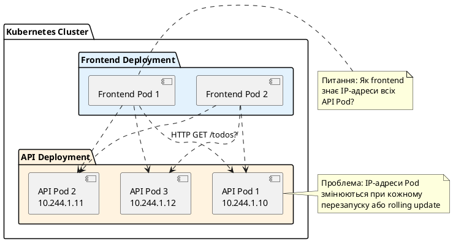

::

**Проблеми прямого звернення до Pod за IP:**

::card-group

::card{title="Ефемерність IP-адрес" icon="i-heroicons-arrow-path"}
Кожен Pod отримує унікальну IP-адресу при створенні. Але ця адреса **не стабільна**:
- Pod перезапустився → нова IP-адреса
- Rolling update → старі Pod видалені, нові мають інші IP
- Масштабування → нові Pod з новими IP

**Приклад:** API Pod мав IP `10.244.1.10`. Після rolling update він має `10.244.2.15`. Frontend продовжує звертатись до старої адреси → помилки.
::

::card{title="Відсутність балансування навантаження" icon="i-heroicons-scale"}
Якщо у вас 3 репліки API, frontend має самостійно розподіляти запити між ними. Це означає:
- Вручну підтримувати список IP-адрес
- Реалізувати логіку балансування (round-robin, least connections)
- Відстежувати здоров'я кожного Pod

Це складно, схильно до помилок та дублює функціональність, яку має надавати платформа.
::

::card{title="Немає service discovery" icon="i-heroicons-magnifying-glass"}
У Docker Compose ви використовували DNS-імена сервісів:

```yaml
services:
  frontend:
    environment:
      - API_URL=http://api:8080
```

`api` автоматично резолвився у IP-адресу контейнера. У Kubernetes немає автоматичного DNS для Pod — потрібен механізм service discovery.
::

::card{title="Складність конфігурації" icon="i-heroicons-cog"}
Якщо frontend має знати IP кожного API Pod, конфігурація стає кошмаром:

```yaml
env:
  - name: API_ENDPOINTS
    value: "10.244.1.10,10.244.1.11,10.244.1.12"
```

Після кожного rolling update потрібно оновлювати цю конфігурацію. Це не масштабується.
::

::

### Що потрібно замість прямого доступу

Нам потрібен механізм, який:

1. **Надає стабільну точку доступу** — одна IP-адреса або DNS-ім'я, яке не змінюється
2. **Автоматично балансує навантаження** — розподіляє запити між усіма здоровими Pod
3. **Відстежує здоров'я Pod** — не надсилає трафік на Pod, які не готові
4. **Підтримує service discovery** — DNS-ім'я автоматично резолвиться у IP
5. **Оновлюється автоматично** — при додаванні/видаленні Pod список endpoints оновлюється

Саме це і робить **Service**.

---

## Що таке Service: формальне визначення

**Service** — це абстракція Kubernetes, яка визначає **логічний набір Pod** та **політику доступу** до них. Service надає стабільну мережеву точку доступу (IP-адресу та DNS-ім'я) для групи ефемерних Pod.

::note
**Ключова ідея:** Service — це **не** Pod і **не** контейнер. Це мережевий об'єкт, який діє як **стабільний проксі** перед групою Pod. Коли ви звертаєтесь до Service, Kubernetes автоматично перенаправляє запит на один з Pod, які відповідають селектору Service.

**Аналогія з Docker Compose:**

У Compose ви використовували DNS-імена сервісів:
```yaml
services:
  api:
    image: myapi:1.0
    deploy:
      replicas: 3
```

`api` автоматично резолвився у IP одного з 3 контейнерів. Kubernetes Service робить те саме, але з більшим контролем та гнучкістю.
::

### Основні компоненти Service

::plant-uml

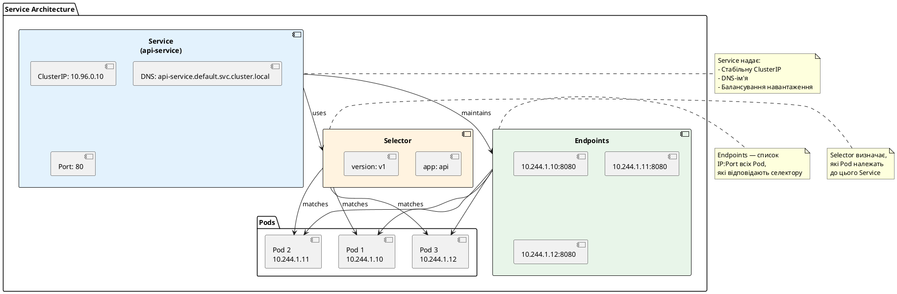

::

**Компоненти:**

1. **ClusterIP** — стабільна внутрішня IP-адреса Service (не змінюється)
2. **DNS-ім'я** — автоматично створюється CoreDNS (формат: `<service-name>.<namespace>.svc.cluster.local`)
3. **Selector** — мітки для вибору Pod (як у Deployment)
4. **Endpoints** — список IP:Port всіх Pod, які відповідають селектору
5. **Port mapping** — маппінг портів Service → Pod

---

## Анатомія Service: структура YAML

Розглянемо базовий приклад Service:

```yaml
apiVersion: v1
kind: Service
metadata:
  name: api-service
  namespace: default
spec:
  selector:
    app: api
  ports:
    - name: http
      protocol: TCP
      port: 80
      targetPort: 8080
  type: ClusterIP
```

Розберемо кожне поле детально.

::field-group

::field{name="apiVersion" type="string" required="true"}
Для Service використовується `v1` (core API group). На відміну від Deployment (`apps/v1`), Service — це базовий ресурс Kubernetes, який існує з самого початку.
::

::field{name="kind" type="string" required="true"}
Тип ресурсу — `Service`. Це вказує Kubernetes, що ви створюєте мережевий об'єкт для доступу до Pod.
::

::field{name="metadata.name" type="string" required="true"}
Унікальне ім'я Service у межах namespace. Це ім'я буде використовуватись у DNS: `<name>.<namespace>.svc.cluster.local`.

**Важливо:** Ім'я має відповідати DNS-стандарту (малі літери, цифри, дефіси). Максимум 63 символи.
::

::field{name="metadata.namespace" type="string" default="default"}
Namespace, у якому буде створено Service. Service може звертатись лише до Pod у тому самому namespace (якщо не використовується ExternalName).
::

::field{name="spec.selector" type="map" required="true (для більшості типів)"}
Мітки для вибору Pod, які належать до цього Service. Kubernetes автоматично знаходить всі Pod з цими мітками та додає їх до Endpoints.

**Критично важливо:** Мітки у `selector` мають збігатись з мітками у `template.metadata.labels` Deployment.

**Приклад:**
```yaml
# Service
selector:
  app: api

# Deployment
template:
  metadata:
    labels:
      app: api  # ← Має збігатись!
```
::

::field{name="spec.ports" type="array" required="true"}
Список портів, які експонує Service. Кожен порт має наступні поля:
- `name` — ім'я порту (опціонально, але рекомендується для багатопортових Service)
- `protocol` — протокол (`TCP` або `UDP`, за замовчуванням `TCP`)
- `port` — порт Service (на якому Service слухає)
- `targetPort` — порт Pod (на який перенаправляється трафік)

**Приклад:**
```yaml
ports:
  - name: http
    port: 80        # Service слухає на порту 80
    targetPort: 8080  # Трафік йде на порт 8080 Pod
```

Це означає: запит до `api-service:80` перенаправляється на `<pod-ip>:8080`.
::

::field{name="spec.type" type="string" default="ClusterIP"}
Тип Service, який визначає, як Service експонується. Доступні типи:
- `ClusterIP` — внутрішній IP, доступний лише всередині кластера (за замовчуванням)
- `NodePort` — експонує Service на статичному порту кожного вузла
- `LoadBalancer` — створює зовнішній load balancer (у хмарних провайдерів)
- `ExternalName` — маппінг на зовнішнє DNS-ім'я

Детально розглянемо кожен тип далі.
::

::


### Як працює маппінг портів

Розберемо детально, як працює `port` та `targetPort`:

::plant-uml

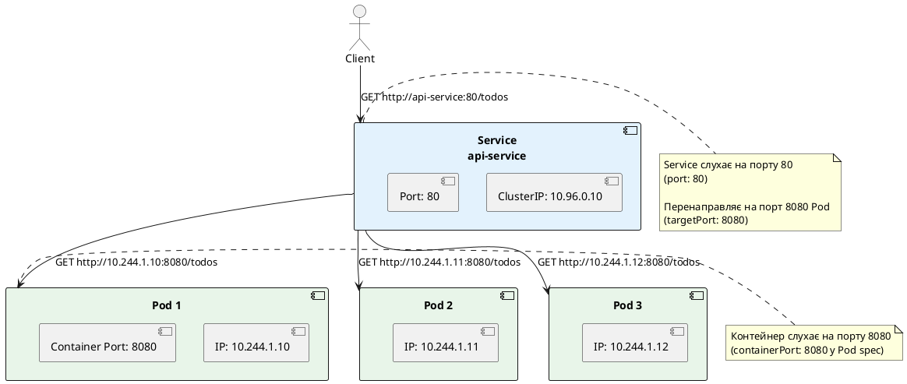

::

**Важливі моменти:**

1. **`port`** — це порт, на якому **Service** слухає. Клієнти звертаються до Service на цьому порту.
2. **`targetPort`** — це порт, на якому **Pod** слухає. Service перенаправляє трафік на цей порт.
3. **`containerPort`** (у Pod spec) — це порт, який **контейнер** експонує. Має збігатись з `targetPort`.

**Типова помилка новачків:**

```yaml
# Service
ports:
  - port: 80
    targetPort: 8080

# Pod (у Deployment)
containers:
  - name: api
    ports:
      - containerPort: 80  # ← ПОМИЛКА! Має бути 8080
```

У цьому випадку Service перенаправляє трафік на порт 8080 Pod, але контейнер слухає на порту 80. Запити не доходять до застосунку.

::warning
**Критично важливо:** `targetPort` у Service має збігатись з `containerPort` у Pod spec. Інакше трафік не дійде до застосунку.

**Правильна конфігурація:**

```yaml
# Service
spec:
  ports:
    - port: 80
      targetPort: 8080

# Deployment
spec:
  template:
    spec:
      containers:
        - name: api
          ports:
            - containerPort: 8080  # ← Збігається з targetPort
```
::

### targetPort як ім'я порту

Замість числа можна використовувати **ім'я порту**:

```yaml
# Deployment
spec:
  template:
    spec:
      containers:
        - name: api
          ports:
            - name: http  # ← Ім'я порту
              containerPort: 8080

# Service
spec:
  ports:
    - port: 80
      targetPort: http  # ← Посилання на ім'я
```

**Переваги:**

- Якщо змінюється номер порту у Pod (8080 → 9090), не потрібно оновлювати Service
- Більш читабельно — зрозуміло, що це HTTP-порт

---

## Типи Service: ClusterIP, NodePort, LoadBalancer, ExternalName

Kubernetes підтримує чотири типи Service, кожен для різних сценаріїв.

### 1. ClusterIP (за замовчуванням)

Тип сервісу, який виділяє для вашого набору Pod'ів єдину внутрішню IP-адресу (ClusterIP), доступну **виключно всередині самого Kubernetes-кластера**.

* **Простими словами (з іншого ракурсу):** Це приватна внутрішня телефонна лінія вашої компанії. Хтось зовні не може на неї набрати напрямую, але колеги з інших кабінетів (інші Pod'и) можуть дзвонить за цим коротким номером без перешкод.
* **Конкретний приклад:** Уявіть, що у вас є мікросервісний додаток: веб-фронтенд та база даних PostgreSQL. Ви не хочете, щоб будь-хто з інтернету міг напряму достукатися до вашої бази даних. Тому ви створюєте для PostgreSQL сервіс із типом `ClusterIP`. Тепер ваш фронтенд-контейнер, що працює всередині кластера, може спокійно звертатися до бази за адресою `postgres-service`, тоді як будь-які зовнішні запити з інтернету будуть заблоковані на рівні мережі кластера. Це стандарт де-факто для безпечної внутрішньої взаємодії.

**YAML:**

```yaml
apiVersion: v1
kind: Service
metadata:
  name: api-service
spec:
  type: ClusterIP  # За замовчуванням, можна не вказувати
  selector:
    app: api
  ports:
    - port: 80
      targetPort: 8080
```

**Що відбувається:**

1. Kubernetes виділяє IP-адресу з внутрішнього діапазону (наприклад, `10.96.0.10`)
2. CoreDNS створює DNS-запис: `api-service.default.svc.cluster.local` → `10.96.0.10`
3. Будь-який Pod у кластері може звертатись до Service за DNS-іменем або IP

**Візуалізація:**

::plant-uml

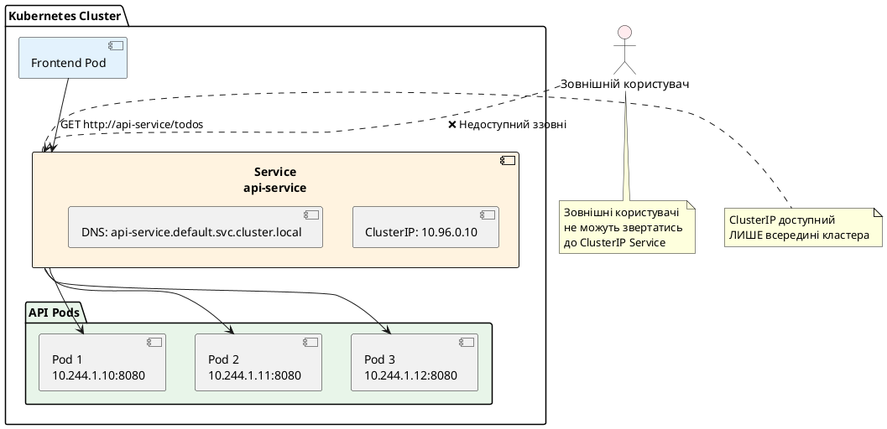

::

**Коли використовувати:**

- Внутрішня комунікація між сервісами (frontend → API, API → database)
- Сервіси, які не мають бути доступні ззовні (бази даних, черги повідомлень)
- Більшість Service у production — це ClusterIP

### Як працює DNS-імя в Kubernetes (CoreDNS)

Коли ви створюєте Service у Kubernetes, вбудована служба DNS (зазвичай **CoreDNS**) автоматично створює для нього внутрішній DNS-запис. Це дозволяє Pod'ам спілкуватися між собою не за IP-адресами (які постійно змінюються при перезапуску контейнерів), а за постійними, зрозумілими іменами.

Повне доменне ім'я (FQDN) для будь-якого сервісу формується за шаблоном:
```text
[назва-сервісу].[namespace].svc.cluster.local
```

Для нашого сервісу повна адреса буде: `api-service.default.svc.cluster.local`.

#### Чому в коді ми пишемо просто `http://api-service`?

1. **Суфікси пошуку (DNS Search Paths):** 
   Коли Kubernetes створює будь-який Pod, він автоматично прописує у його конфігурацію DNS (файл `/etc/resolv.conf`) суфікси пошуку. Вони включають поточний namespace (наприклад, `default.svc.cluster.local`). 
   Тому, якщо ваші контейнери знаходяться в одному namespace, DNS-клієнт автоматично підставить суфікс. Вам достатньо написати лише коротку назву сервісу — **`api-service`** — і CoreDNS успішно розпізнає повну адресу.

2. **Стандартний порт HTTP:**
   У нашому YAML-файлі для `api-service` ми вказали зовнішній порт сервісу `port: 80`. Оскільки порт `80` є стандартним для протоколу `http://`, його не потрібно вказувати явно в URL. 
   Рядок `http://api-service` під капотом резолвиться в запит до IP-адреси сервісу на 80-й порт (наприклад, `http://10.96.0.10:80`).

::note
**Це фундаментальна перевага Kubernetes:** вам абсолютно не потрібно знати динамічні IP-адреси Pod'ів чи сервісів. Ви просто звертаєтесь до імені сервісу, а Kubernetes автоматично бере на себе всю роботу з пошуку контейнерів, перевірки їхньої готовності та балансування навантаження!
::

**Приклад використання у .NET:**

```csharp
var builder = WebApplication.CreateBuilder(args);

// Frontend звертається до API через Service DNS
var apiUrl = builder.Configuration["ApiUrl"] ?? "http://api-service";

builder.Services.AddHttpClient("ApiClient", client =>
{
    client.BaseAddress = new Uri(apiUrl);
});

var app = builder.Build();
app.Run();
```

**ConfigMap для frontend:**

```yaml
apiVersion: v1
kind: ConfigMap
metadata:
  name: frontend-config
data:
  ApiUrl: "http://api-service"  # DNS-ім'я Service
```

---

### 2. NodePort

Тип сервісу, який відкриває певний фіксований порт (у діапазоні `30000-32767`) на **абсолютно кожному сервері (вузлі/node)** вашого Kubernetes-кластера. Будь-який зовнішній трафік, що приходить на цей порт будь-якого сервера, автоматично перенаправляється на ваші Pod'и.

* **Простими словами (з іншого ракурсу):** Це схоже на виділений домофонний код у кожному під'їзді одного великого житлового комплексу. У який би під'їзд ви не підійшли (Node IP), якщо ви наберете цей спеціальний код (NodePort), дзвінок піде в ту саму конкретну квартиру (ваш Pod).
* **Конкретний приклад:** Уявіть, що ви запустили веб-сайт у локальному кластері Minikube на вашому комп'ютері і хочете показати його колезі в офісі. Оскільки IP-адреси Pod'ів є внутрішніми для кластера, колега не зможе зайти на сайт. Якщо ви створите сервіс із типом `NodePort` та вкажете `nodePort: 32000`, ваш сайт стане доступним за адресою комп'ютера у локальній мережі: наприклад, `http://192.168.1.150:32000`. Будь-яка Node кластера візьме цей запит і перенаправить його до потрібного контейнера.

**YAML:**

```yaml
apiVersion: v1
kind: Service
metadata:
  name: api-service
spec:
  type: NodePort
  selector:
    app: api
  ports:
    - port: 80
      targetPort: 8080
      nodePort: 30080  # Опціонально, Kubernetes виділить автоматично (30000-32767)
```

**Що відбувається:**

1. Kubernetes виділяє ClusterIP (як у ClusterIP Service)
2. Kubernetes відкриває порт на **кожному вузлі** кластера (наприклад, `30080`)
3. Трафік на `<NodeIP>:30080` перенаправляється на Service, який перенаправляє на Pod

**Візуалізація:**

::plant-uml

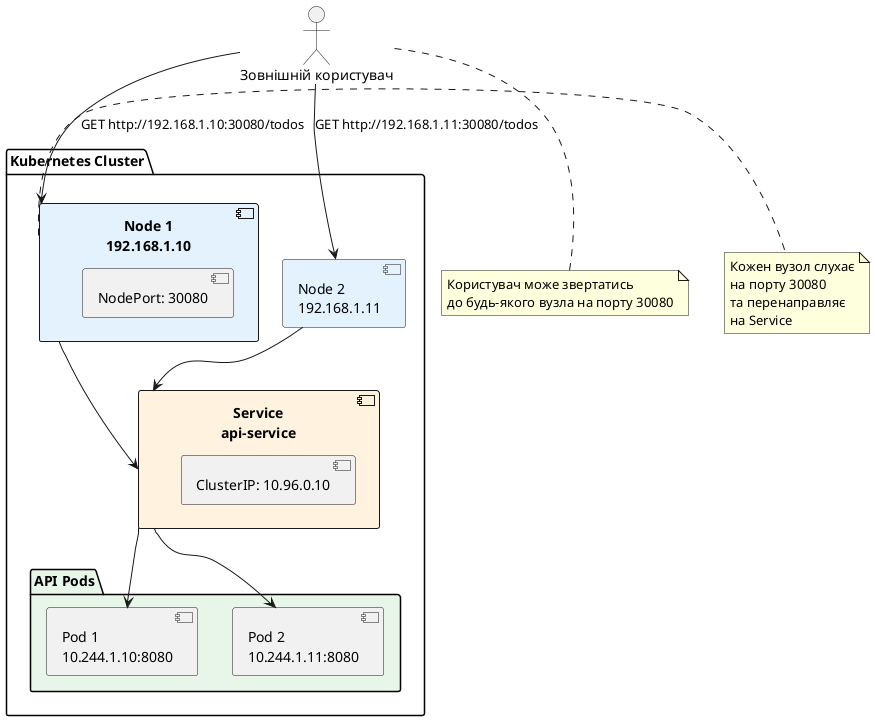

::

**Діапазон NodePort:**

За замовчуванням Kubernetes виділяє порти з діапазону **30000-32767**. Це можна змінити у конфігурації API Server, але не рекомендується.

**Коли використовувати:**

- Локальна розробка (Minikube, kind) — швидкий доступ до сервісу ззовні
- Тестування — не потрібен зовнішній load balancer
- On-premise кластери без підтримки LoadBalancer
- Debugging — тимчасовий доступ до сервісу

**Коли НЕ використовувати:**

- Production у хмарі — використовуйте LoadBalancer або Ingress
- Багато сервісів — NodePort займає порти на всіх вузлах
- Потрібен HTTPS — NodePort не підтримує TLS termination

**Приклад використання:**

::terminal-preview{title="Доступ до NodePort Service"}

<div class="line"><span class="opacity-40"># Створення NodePort Service</span></div>
<div class="line"><span class="opacity-40">$</span> <strong>kubectl apply -f api-nodeport-service.yaml</strong></div>
<div class="line"><span class="text-green-400">service/api-service created</span></div>
<div class="line"></div>
<div class="line"><span class="opacity-40"># Перегляд Service</span></div>
<div class="line"><span class="opacity-40">$</span> <strong>kubectl get service api-service</strong></div>
<div class="line">NAME          TYPE       CLUSTER-IP    EXTERNAL-IP   PORT(S)        AGE</div>
<div class="line">api-service   NodePort   10.96.0.10    &lt;none&gt;        80:30080/TCP   10s</div>
<div class="line"></div>
<div class="line"><span class="opacity-40"># Отримання IP вузла (Minikube)</span></div>
<div class="line"><span class="opacity-40">$</span> <strong>minikube ip</strong></div>
<div class="line">192.168.49.2</div>
<div class="line"></div>
<div class="line"><span class="opacity-40"># Доступ до Service ззовні</span></div>
<div class="line"><span class="opacity-40">$</span> <strong>curl http://192.168.49.2:30080/todos</strong></div>
<div class="line">{"todos":[],"count":0}</div>

::

::tip
**Minikube service команда:**

Minikube надає зручну команду для відкриття NodePort Service у браузері:

```bash
minikube service api-service
```

Це автоматично відкриє браузер з правильною URL (`http://<minikube-ip>:<node-port>`).
::

---

### 3. LoadBalancer

Тип сервісу, який інтегрується з хмарним провайдером (наприклад AWS, Google Cloud, Azure) і автоматично замовляє у нього реальний, зовнішній мережевий балансувальник навантаження. Провайдер виділяє публічну статичну IP-адресу, і весь трафік з інтернету через цю IP надходить безпосередньо у ваш Kubernetes-кластер.

* **Простими словами (з іншого ракурсу):** Це як найняти професійного швейцара чи хостес на вході до ресторану. Клієнтам (користувачам в інтернеті) не потрібно шукати службові входи чи дзвонити на внутрішні номери — вони просто приходять на центральний вхід (публічний IP), а швейцар (Load Balancer) сам бережно проводить їх за потрібний вільний столик (Pod) всередині залу.
* **Конкретний приклад:** Ви розгорнули свій інтернет-магазин у хмарі AWS. Якщо ви створите сервіс типу `LoadBalancer`, AWS автоматично запустить для вас сервіс Classic/Network Load Balancer та надасть публічну адресу (наприклад, `http://a84729...us-east-1.elb.amazonaws.com` або статичний IP `1.2.3.4`). Тепер будь-який користувач у світі може зайти на цей сайт. Балансувальник прийме запит, рівномірно розподілить його між працюючими репліками вашого застосунку і забезпечить відмовостійкість: якщо один із серверів (Node) раптово вимкнеться, балансувальник миттєво перенаправить трафік на інші робочі машини.

**YAML:**

```yaml
apiVersion: v1
kind: Service
metadata:
  name: api-service
spec:
  type: LoadBalancer
  selector:
    app: api
  ports:
    - port: 80
      targetPort: 8080
```

**Що відбувається:**

1. Kubernetes створює ClusterIP Service (внутрішній доступ)
2. Kubernetes створює NodePort (доступ через вузли)
3. Kubernetes запитує у хмарного провайдера створення зовнішнього load balancer
4. Load balancer отримує публічну IP-адресу та перенаправляє трафік на NodePort

**Візуалізація:**

::plant-uml

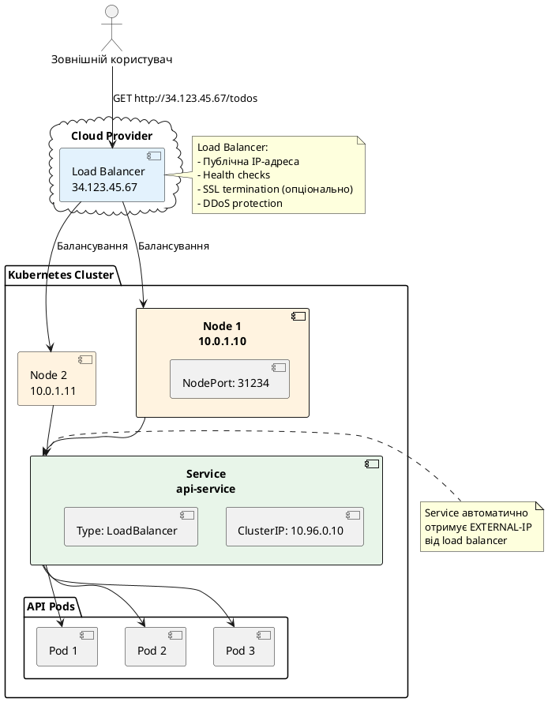

::

**Коли використовувати:**

- Production у хмарі (AWS, GCP, Azure)
- Потрібен публічний доступ до сервісу
- Один сервіс на один load balancer (для багатьох сервісів використовуйте Ingress)

**Коли НЕ використовувати:**

- Локальна розробка (Minikube не підтримує LoadBalancer, використовуйте NodePort)
- Багато сервісів — кожен LoadBalancer коштує грошей (використовуйте Ingress)
- On-premise кластери без підтримки LoadBalancer

**Приклад використання:**

::terminal-preview{title="LoadBalancer Service"}

<div class="line"><span class="opacity-40">$</span> <strong>kubectl apply -f api-loadbalancer-service.yaml</strong></div>
<div class="line"><span class="text-green-400">service/api-service created</span></div>
<div class="line"></div>
<div class="line"><span class="opacity-40"># Перегляд Service (EXTERNAL-IP спочатку &lt;pending&gt;)</span></div>
<div class="line"><span class="opacity-40">$</span> <strong>kubectl get service api-service</strong></div>
<div class="line">NAME          TYPE           CLUSTER-IP    EXTERNAL-IP   PORT(S)        AGE</div>
<div class="line">api-service   LoadBalancer   10.96.0.10    &lt;pending&gt;     80:31234/TCP   5s</div>
<div class="line"></div>
<div class="line"><span class="opacity-40"># Через 1-2 хвилини load balancer готовий</span></div>
<div class="line"><span class="opacity-40">$</span> <strong>kubectl get service api-service</strong></div>
<div class="line">NAME          TYPE           CLUSTER-IP    EXTERNAL-IP     PORT(S)        AGE</div>
<div class="line">api-service   LoadBalancer   10.96.0.10    34.123.45.67    80:31234/TCP   2m</div>
<div class="line"></div>
<div class="line"><span class="opacity-40"># Доступ через публічну IP</span></div>
<div class="line"><span class="opacity-40">$</span> <strong>curl http://34.123.45.67/todos</strong></div>
<div class="line">{"todos":[],"count":0}</div>

::

::note
**LoadBalancer у Minikube:**

Minikube не підтримує LoadBalancer Service нативно. Service залишається у стані `<pending>`. Для локальної розробки використовуйте:

1. **NodePort** — найпростіший спосіб
2. **minikube tunnel** — емулює LoadBalancer:

```bash
minikube tunnel
```

Це створює мережевий тунель та призначає EXTERNAL-IP з діапазону `127.0.0.1/8`. Команда має працювати постійно у фоні.
::

**Вартість LoadBalancer:**

Кожен LoadBalancer Service створює окремий load balancer у хмарі, що коштує грошей:

- **AWS ELB:** ~$16-25/місяць + трафік
- **GCP Load Balancer:** ~$18/місяць + трафік
- **Azure Load Balancer:** ~$18/місяць + трафік

Якщо у вас 10 сервісів, це $180-250/місяць лише за load balancers. Для економії використовуйте **Ingress** (один load balancer для багатьох сервісів).


---

### 4. ExternalName

Особливий тип сервісу, який виступає в ролі внутрішнього DNS-аліасу (псевдоніма) і перенаправляє запити на якесь **зовнішнє доменне ім'я** (поза межами вашого кластера). Він не виділяє жодних IP-адрес і не проксує трафік самостійно — замість цього він просто повертає стандартний DNS CNAME-запис.

* **Простими словами (з іншого ракурсу):** Це внутрішня переадресація чи закладка в телефонній книзі вашої компанії. Замість того, щоб вчити кожного співробітника набирати довгий складний номер зовнішнього партнера, ви створюєте для нього внутрішній короткий псевдонім. Якщо партнер зміниться, ви просто оновить запис в одному місці (у маніфесті сервісу), а код ваших додатків залишиться незмінним.
* **Конкретний приклад:** Ваша програма працює в кластері Kubernetes, але використовує сторонню базу даних MongoDB Atlas, розміщену на зовнішньому хостингу за адресою `prod-db-948a.mongodb.net`. Замість того, щоб зашивати це довге і нестабільне ім'я прямо в конфігураційні файли вашого коду, ви створюєте сервіс типу `ExternalName` із назвою `my-database` та `externalName: prod-db-948a.mongodb.net`. Тепер у вашому .NET-коді рядок підключення буде виглядати максимально просто: `mongodb://my-database`. Якщо ви вирішите змінити базу даних на інший сервер або переїдете на іншого провайдера, ви просто зміните значення `externalName` в одному YAML-маніфесті, не перезбираючи та не перезапускаючи сам додаток.

**YAML:**

```yaml
apiVersion: v1
kind: Service
metadata:
  name: external-api
spec:
  type: ExternalName
  externalName: api.example.com
```

**Що відбувається:**

1. Kubernetes НЕ створює ClusterIP
2. CoreDNS створює CNAME-запис: `external-api.default.svc.cluster.local` → `api.example.com`
3. Запити до `external-api` резолвяться у `api.example.com` та йдуть напряму до зовнішнього сервісу

**Візуалізація:**

::plant-uml

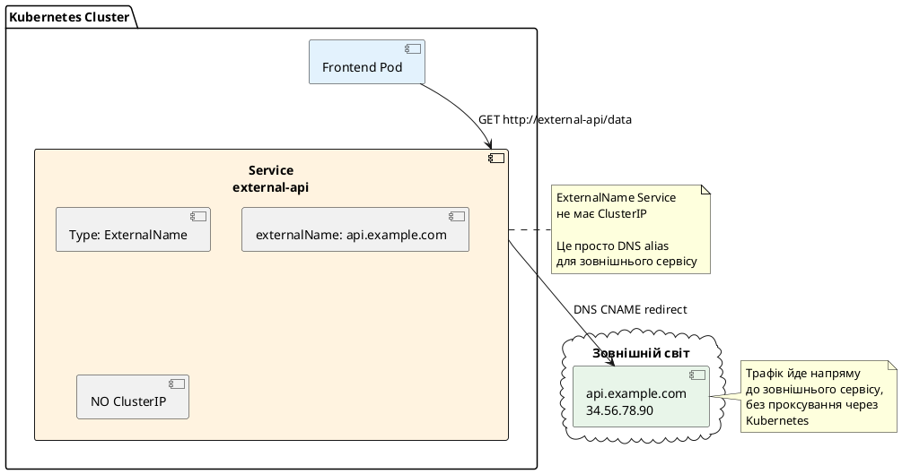

::

**Коли використовувати:**

- Міграція з зовнішнього сервісу у Kubernetes — спочатку ExternalName, потім заміна на ClusterIP
- Доступ до зовнішніх API (наприклад, AWS RDS, зовнішній Redis)
- Абстракція зовнішніх залежностей — код звертається до `database-service`, а не до `prod-db.us-east-1.rds.amazonaws.com`

**Приклад використання:**

```yaml
# ExternalName для зовнішньої бази даних
apiVersion: v1
kind: Service
metadata:
  name: postgres-service
spec:
  type: ExternalName
  externalName: prod-db.us-east-1.rds.amazonaws.com
```

**У .NET коді:**

```csharp
var builder = WebApplication.CreateBuilder(args);

// Код звертається до Service, а не до зовнішнього DNS
var connectionString = builder.Configuration.GetConnectionString("DefaultConnection");
// "Host=postgres-service;Database=mydb;Username=user;Password=pass"

builder.Services.AddDbContext<AppDbContext>(options =>
    options.UseNpgsql(connectionString));
```

**Переваги:**

- Легко змінити зовнішній endpoint — просто оновити `externalName` у Service
- Код не залежить від конкретного DNS-імені зовнішнього сервісу
- Можна легко мігрувати: ExternalName → ClusterIP (коли база даних переїде у Kubernetes)

::warning
**Обмеження ExternalName:**

1. **Немає балансування навантаження** — Kubernetes не проксує трафік, лише резолвить DNS
2. **Немає health checks** — Kubernetes не перевіряє доступність зовнішнього сервісу
3. **Немає TLS termination** — трафік йде напряму, без можливості додати TLS
4. **Працює лише з DNS** — не можна використовувати IP-адресу

Якщо потрібен більший контроль, використовуйте **Service без selector** + **Endpoints** (розглянемо далі).
::

---

## Порівняння типів Service

::card-group

::card{title="ClusterIP" icon="i-heroicons-server"}
**Використання:** Внутрішня комунікація між сервісами

**Доступність:** Лише всередині кластера

**IP-адреса:** Внутрішня ClusterIP

**Вартість:** Безкоштовно

**Приклад:** API → Database, Frontend → API
::

::card{title="NodePort" icon="i-heroicons-server-stack"}
**Використання:** Локальна розробка, debugging, on-premise

**Доступність:** Через `<NodeIP>:<NodePort>`

**IP-адреса:** ClusterIP + порт на кожному вузлі

**Вартість:** Безкоштовно

**Приклад:** Доступ до API з локальної машини
::

::card{title="LoadBalancer" icon="i-heroicons-cloud"}
**Використання:** Production у хмарі, публічний доступ

**Доступність:** Через публічну IP load balancer

**IP-адреса:** ClusterIP + NodePort + зовнішня IP

**Вартість:** ~$18-25/місяць за load balancer

**Приклад:** Публічний API, веб-сайт
::

::card{title="ExternalName" icon="i-heroicons-arrow-top-right-on-square"}
**Використання:** Доступ до зовнішніх сервісів

**Доступність:** DNS CNAME до зовнішнього сервісу

**IP-адреса:** Немає (лише DNS alias)

**Вартість:** Безкоштовно

**Приклад:** AWS RDS, зовнішній API
::

::

**Таблиця порівняння:**

| Характеристика | ClusterIP | NodePort | LoadBalancer | ExternalName |
|----------------|-----------|----------|--------------|--------------|
| ClusterIP | ✅ Так | ✅ Так | ✅ Так | ❌ Ні |
| NodePort | ❌ Ні | ✅ Так (30000-32767) | ✅ Так (автоматично) | ❌ Ні |
| Зовнішня IP | ❌ Ні | ❌ Ні | ✅ Так | ❌ Ні |
| Балансування | ✅ Так | ✅ Так | ✅ Так | ❌ Ні |
| Health checks | ✅ Так | ✅ Так | ✅ Так | ❌ Ні |
| Доступ ззовні | ❌ Ні | ✅ Так | ✅ Так | N/A |
| Вартість | Безкоштовно | Безкоштовно | $18-25/міс | Безкоштовно |

---

## Як працює Service: kube-proxy та iptables

Тепер розберемо, **як саме** Kubernetes перенаправляє трафік від Service до Pod. За це відповідає компонент **kube-proxy**.

### Архітектура kube-proxy

::plant-uml

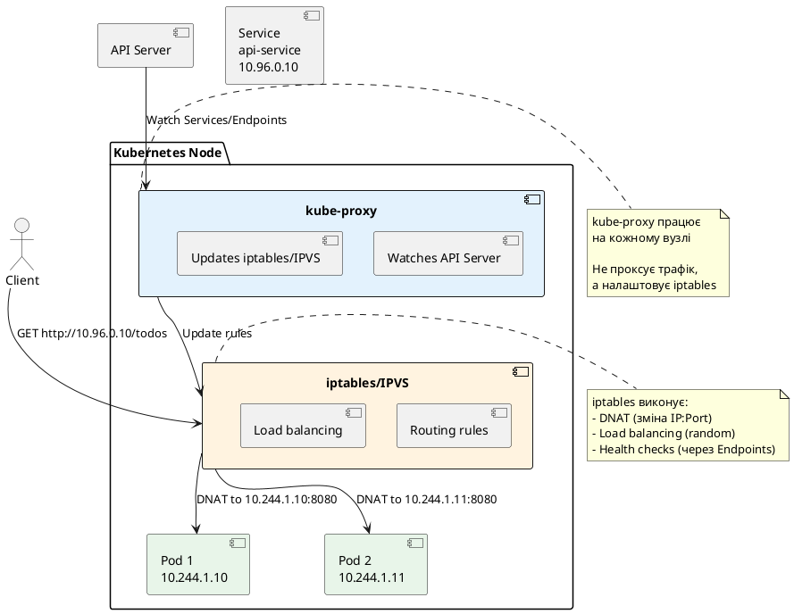

::

### Режими роботи kube-proxy

kube-proxy підтримує три режими:

::field-group

::field{name="iptables (за замовчуванням)"}
**Як працює:**

1. kube-proxy стежить за Service та Endpoints через API Server
2. Для кожного Service створюються правила iptables
3. Коли пакет надходить на ClusterIP, iptables виконує DNAT (Destination NAT) — змінює IP:Port на IP:Port одного з Pod
4. Балансування: random (випадковий вибір Pod)

**Переваги:**
- Стабільний, перевірений часом
- Низьке споживання ресурсів
- Працює на рівні ядра Linux (швидко)

**Недоліки:**
- Погана масштабованість (багато правил iptables при тисячах Service)
- Балансування не ідеальне (random, а не round-robin)
- Складно діагностувати проблеми
::

::field{name="IPVS (IP Virtual Server)"}
**Як працює:**

1. kube-proxy створює віртуальний сервер IPVS для кожного Service
2. IPVS виконує балансування навантаження на рівні ядра
3. Підтримує різні алгоритми: round-robin, least connections, source hashing

**Переваги:**
- Краща масштабованість (тисячі Service)
- Кращі алгоритми балансування
- Вища продуктивність при великій кількості Service

**Недоліки:**
- Потребує модуль ядра IPVS (не завжди доступний)
- Складніше налаштування

**Увімкнення IPVS:**

```yaml
# kube-proxy ConfigMap
apiVersion: v1
kind: ConfigMap
metadata:
  name: kube-proxy
  namespace: kube-system
data:
  config.conf: |
    mode: "ipvs"
    ipvs:
      scheduler: "rr"  # round-robin
```
::

::field{name="userspace (застарілий)"}
**Як працює:**

1. kube-proxy сам проксує трафік (працює як reverse proxy)
2. Трафік йде через user space, а не kernel space

**Недоліки:**
- Повільний (трафік проходить через user space)
- Застарілий, не рекомендується

**Статус:** Deprecated, не використовується у production
::

::

### Детальний розбір iptables режиму

Давайте подивимося, які саме правила створює kube-proxy:

::terminal-preview{title="iptables правила для Service"}

<div class="line"><span class="opacity-40"># Перегляд iptables правил для Service</span></div>
<div class="line"><span class="opacity-40">$</span> <strong>sudo iptables -t nat -L KUBE-SERVICES | grep api-service</strong></div>
<div class="line">KUBE-SVC-XXXXX  tcp  --  anywhere  10.96.0.10  /* default/api-service cluster IP */ tcp dpt:http</div>
<div class="line"></div>
<div class="line"><span class="opacity-40"># Детальний перегляд правил для конкретного Service</span></div>
<div class="line"><span class="opacity-40">$</span> <strong>sudo iptables -t nat -L KUBE-SVC-XXXXX</strong></div>
<div class="line">Chain KUBE-SVC-XXXXX (1 references)</div>
<div class="line">target     prot opt source               destination</div>
<div class="line">KUBE-SEP-AAAA  all  --  anywhere  anywhere  /* default/api-service */ statistic mode random probability 0.33333</div>
<div class="line">KUBE-SEP-BBBB  all  --  anywhere  anywhere  /* default/api-service */ statistic mode random probability 0.50000</div>
<div class="line">KUBE-SEP-CCCC  all  --  anywhere  anywhere  /* default/api-service */</div>

::

**Що означають ці правила:**

1. **KUBE-SERVICES** — головний ланцюжок для всіх Service
2. **KUBE-SVC-XXXXX** — ланцюжок для конкретного Service (api-service)
3. **KUBE-SEP-AAAA/BBBB/CCCC** — ланцюжки для кожного Pod (Service Endpoint)

**Балансування:**

- Перший Pod: ймовірність 33.33% (1/3)
- Другий Pod: ймовірність 50% з решти (1/2 від 66.67%)
- Третій Pod: решта 33.33%

Це дає рівномірний розподіл 33.33% / 33.33% / 33.33%.

**DNAT правило для Pod:**

::terminal-preview{title="DNAT правило"}

<div class="line"><span class="opacity-40">$</span> <strong>sudo iptables -t nat -L KUBE-SEP-AAAA</strong></div>
<div class="line">Chain KUBE-SEP-AAAA (1 references)</div>
<div class="line">target     prot opt source               destination</div>
<div class="line">DNAT       tcp  --  anywhere  anywhere  /* default/api-service */ tcp to:10.244.1.10:8080</div>

::

Це правило змінює destination IP:Port з `10.96.0.10:80` (Service) на `10.244.1.10:8080` (Pod).

### Візуалізація потоку трафіку

::plant-uml

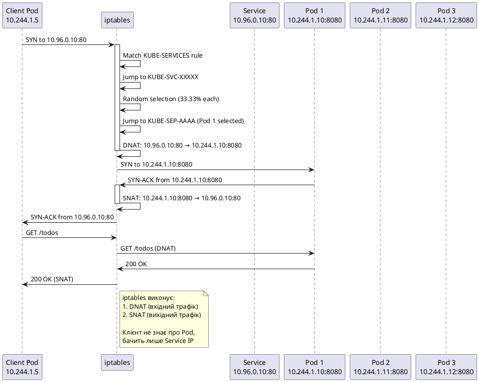

::

**Ключові моменти:**

1. **DNAT (Destination NAT)** — зміна destination IP:Port з Service на Pod
2. **SNAT (Source NAT)** — зміна source IP:Port у відповіді з Pod на Service
3. **Прозорість** — клієнт не знає про існування Pod, бачить лише Service
4. **Stateful** — iptables відстежує з'єднання (connection tracking), тому відповіді йдуть до того самого клієнта


---

## CoreDNS та Service Discovery

Одна з найважливіших можливостей Service — **автоматичний service discovery** через DNS. За це відповідає **CoreDNS**.

### Що таке CoreDNS

**CoreDNS** — це DNS-сервер, який працює у Kubernetes кластері та автоматично створює DNS-записи для всіх Service.

::plant-uml

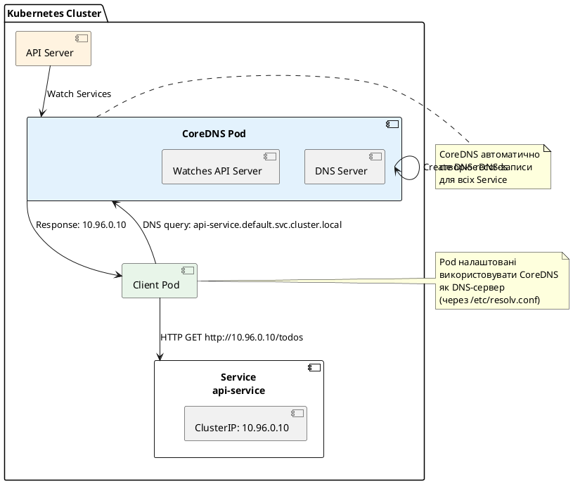

::

### Формат DNS-імен Service

Kubernetes створює DNS-записи у наступному форматі:

```
<service-name>.<namespace>.svc.<cluster-domain>
```

**Компоненти:**

- **service-name** — ім'я Service (з `metadata.name`)
- **namespace** — namespace, у якому створено Service
- **svc** — константа (означає "service")
- **cluster-domain** — домен кластера (за замовчуванням `cluster.local`)

**Приклади:**

| Service | Namespace | Повне DNS-ім'я |
|---------|-----------|----------------|
| api-service | default | `api-service.default.svc.cluster.local` |
| postgres | database | `postgres.database.svc.cluster.local` |
| redis | cache | `redis.cache.svc.cluster.local` |

### Скорочені форми DNS-імен

Kubernetes підтримує скорочені форми для зручності:

::field-group

::field{name="<service-name> (найкоротша форма)"}
**Працює:** Лише у тому самому namespace

**Приклад:**
```csharp
// Pod у namespace "default" звертається до Service "api-service" у "default"
var apiUrl = "http://api-service";
```

**DNS resolution:**
1. Спроба: `api-service.default.svc.cluster.local` ✅
2. Якщо не знайдено: помилка

**Коли використовувати:** Більшість випадків (якщо Service у тому самому namespace)
::

::field{name="<service-name>.<namespace>"}
**Працює:** З будь-якого namespace

**Приклад:**
```csharp
// Pod у namespace "frontend" звертається до Service "postgres" у "database"
var dbHost = "postgres.database";
```

**DNS resolution:**
1. Спроба: `postgres.database.svc.cluster.local` ✅

**Коли використовувати:** Міжнамespace комунікація (frontend → database)
::

::field{name="<service-name>.<namespace>.svc.cluster.local (повна форма)"}
**Працює:** Завжди, з будь-якого місця

**Приклад:**
```csharp
var apiUrl = "http://api-service.default.svc.cluster.local";
```

**Коли використовувати:** 
- Явна специфікація (для документації)
- Уникнення конфліктів імен
- Зовнішні системи (якщо вони мають доступ до CoreDNS)
::

::

### Як Pod налаштовані використовувати CoreDNS

Кожен Pod автоматично налаштовується використовувати CoreDNS як DNS-сервер:

::terminal-preview{title="/etc/resolv.conf у Pod"}

<div class="line"><span class="opacity-40">$</span> <strong>kubectl exec -it api-pod-xxx -- cat /etc/resolv.conf</strong></div>
<div class="line">nameserver 10.96.0.10</div>
<div class="line">search default.svc.cluster.local svc.cluster.local cluster.local</div>
<div class="line">options ndots:5</div>

::

**Що означають ці рядки:**

- **nameserver 10.96.0.10** — IP-адреса CoreDNS Service (kube-dns)
- **search default.svc.cluster.local svc.cluster.local cluster.local** — список доменів для автоматичного додавання
- **options ndots:5** — якщо у DNS-запиті менше 5 крапок, додавати search domains

**Як працює search:**

Коли Pod робить DNS-запит `api-service`, резолвер пробує:

1. `api-service.default.svc.cluster.local` ✅ (знайдено)
2. Якщо не знайдено: `api-service.svc.cluster.local`
3. Якщо не знайдено: `api-service.cluster.local`
4. Якщо не знайдено: `api-service` (як є)

Це дозволяє використовувати короткі імена (`api-service` замість повного DNS-імені).

### DNS-записи для різних типів Service

::card-group

::card{title="ClusterIP Service" icon="i-heroicons-server"}
**DNS-запис:** A-запис (IP-адреса)

**Приклад:**
```bash
nslookup api-service.default.svc.cluster.local
# Name:    api-service.default.svc.cluster.local
# Address: 10.96.0.10
```

**Що повертається:** ClusterIP Service
::

::card{title="Headless Service (ClusterIP: None)" icon="i-heroicons-queue-list"}
**DNS-запис:** A-записи для кожного Pod

**Приклад:**
```bash
nslookup postgres.database.svc.cluster.local
# Name:    postgres.database.svc.cluster.local
# Address: 10.244.1.10  (Pod 1)
# Address: 10.244.1.11  (Pod 2)
# Address: 10.244.1.12  (Pod 3)
```

**Що повертається:** IP-адреси всіх Pod (детально розглянемо далі)
::

::card{title="ExternalName Service" icon="i-heroicons-arrow-top-right-on-square"}
**DNS-запис:** CNAME-запис

**Приклад:**
```bash
nslookup external-api.default.svc.cluster.local
# external-api.default.svc.cluster.local canonical name = api.example.com
# Name:    api.example.com
# Address: 34.56.78.90
```

**Що повертається:** CNAME на зовнішнє DNS-ім'я
::

::

### Тестування DNS resolution

Давайте протестуємо DNS resolution у реальному кластері:

::terminal-preview{title="Тестування DNS"}

<div class="line"><span class="opacity-40"># Створення тестового Pod з curl та nslookup</span></div>
<div class="line"><span class="opacity-40">$</span> <strong>kubectl run test-dns --image=curlimages/curl:latest --rm -it --restart=Never -- sh</strong></div>
<div class="line"></div>
<div class="line"><span class="opacity-40"># Тест 1: Коротка форма (той самий namespace)</span></div>
<div class="line"><span class="opacity-40">$</span> <strong>nslookup api-service</strong></div>
<div class="line">Server:    10.96.0.10</div>
<div class="line">Address:   10.96.0.10:53</div>
<div class="line"></div>
<div class="line">Name:      api-service.default.svc.cluster.local</div>
<div class="line">Address:   10.96.0.15</div>
<div class="line"></div>
<div class="line"><span class="opacity-40"># Тест 2: З namespace (міжнамespace)</span></div>
<div class="line"><span class="opacity-40">$</span> <strong>nslookup postgres.database</strong></div>
<div class="line">Server:    10.96.0.10</div>
<div class="line">Address:   10.96.0.10:53</div>
<div class="line"></div>
<div class="line">Name:      postgres.database.svc.cluster.local</div>
<div class="line">Address:   10.96.0.20</div>
<div class="line"></div>
<div class="line"><span class="opacity-40"># Тест 3: Повна форма</span></div>
<div class="line"><span class="opacity-40">$</span> <strong>nslookup api-service.default.svc.cluster.local</strong></div>
<div class="line">Server:    10.96.0.10</div>
<div class="line">Address:   10.96.0.10:53</div>
<div class="line"></div>
<div class="line">Name:      api-service.default.svc.cluster.local</div>
<div class="line">Address:   10.96.0.15</div>
<div class="line"></div>
<div class="line"><span class="opacity-40"># Тест 4: HTTP-запит через DNS-ім'я</span></div>
<div class="line"><span class="opacity-40">$</span> <strong>curl http://api-service/health</strong></div>
<div class="line">{"status":"healthy","version":"1.0.0"}</div>

::

---

## Headless Service — прямий доступ до Pod

**Headless Service** — це Service **без ClusterIP** (`clusterIP: None`). Замість балансування навантаження через Service IP, DNS повертає IP-адреси всіх Pod напряму.

### Навіщо потрібен Headless Service

::card-group

::card{title="StatefulSet" icon="i-heroicons-server-stack"}
Для stateful застосунків (бази даних, черги) потрібен доступ до **конкретного Pod** за стабільним DNS-іменем. Headless Service надає DNS-запис для кожного Pod: `<pod-name>.<service-name>.<namespace>.svc.cluster.local`.

**Приклад:** PostgreSQL primary/replica — клієнт має звертатись до primary для запису, до replica для читання.
::

::card{title="Service Discovery" icon="i-heroicons-magnifying-glass"}
Застосунок сам хоче керувати балансуванням навантаження або вибором Pod. Headless Service надає список всіх IP-адрес Pod, а застосунок сам вирішує, до якого звертатись.

**Приклад:** Elasticsearch cluster — клієнт отримує список всіх вузлів та сам розподіляє запити.
::

::card{title="Peer Discovery" icon="i-heroicons-users"}
Застосунки, які потребують знати про всіх інших членів кластера (наприклад, для формування quorum або gossip protocol).

**Приклад:** Kafka, Cassandra, etcd — кожен вузол має знати про інших.
::

::

### Створення Headless Service

```yaml
apiVersion: v1
kind: Service
metadata:
  name: postgres-headless
spec:
  clusterIP: None  # ← Це робить Service headless
  selector:
    app: postgres
  ports:
    - port: 5432
      targetPort: 5432
```

**Що відбувається:**

1. Kubernetes НЕ виділяє ClusterIP
2. CoreDNS створює A-записи для кожного Pod
3. DNS-запит повертає список IP-адрес всіх Pod

### DNS-записи Headless Service

::plant-uml

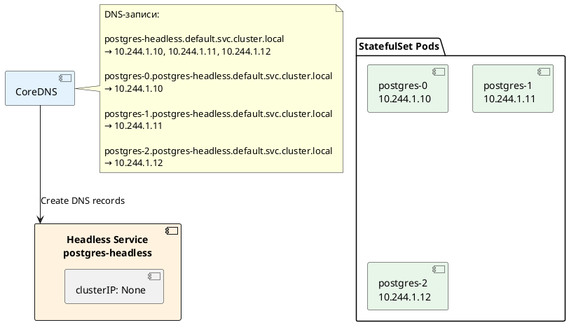

::

**DNS-записи:**

1. **Service DNS** — повертає всі Pod:
   ```
   postgres-headless.default.svc.cluster.local
   → 10.244.1.10, 10.244.1.11, 10.244.1.12
   ```

2. **Pod DNS** (лише для StatefulSet) — повертає конкретний Pod:
   ```
   postgres-0.postgres-headless.default.svc.cluster.local → 10.244.1.10
   postgres-1.postgres-headless.default.svc.cluster.local → 10.244.1.11
   postgres-2.postgres-headless.default.svc.cluster.local → 10.244.1.12
   ```

### Тестування Headless Service

::terminal-preview{title="DNS resolution для Headless Service"}

<div class="line"><span class="opacity-40">$</span> <strong>kubectl run test-dns --image=curlimages/curl:latest --rm -it --restart=Never -- sh</strong></div>
<div class="line"></div>
<div class="line"><span class="opacity-40"># DNS-запит до Headless Service (повертає всі Pod)</span></div>
<div class="line"><span class="opacity-40">$</span> <strong>nslookup postgres-headless.default.svc.cluster.local</strong></div>
<div class="line">Server:    10.96.0.10</div>
<div class="line">Address:   10.96.0.10:53</div>
<div class="line"></div>
<div class="line">Name:      postgres-headless.default.svc.cluster.local</div>
<div class="line">Address:   10.244.1.10</div>
<div class="line">Address:   10.244.1.11</div>
<div class="line">Address:   10.244.1.12</div>
<div class="line"></div>
<div class="line"><span class="opacity-40"># DNS-запит до конкретного Pod (StatefulSet)</span></div>
<div class="line"><span class="opacity-40">$</span> <strong>nslookup postgres-0.postgres-headless.default.svc.cluster.local</strong></div>
<div class="line">Server:    10.96.0.10</div>
<div class="line">Address:   10.96.0.10:53</div>
<div class="line"></div>
<div class="line">Name:      postgres-0.postgres-headless.default.svc.cluster.local</div>
<div class="line">Address:   10.244.1.10</div>

::

### Використання у .NET

**Приклад: PostgreSQL primary/replica:**

```csharp
var builder = WebApplication.CreateBuilder(args);

// Primary для запису
var primaryHost = "postgres-0.postgres-headless.default.svc.cluster.local";
var primaryConnectionString = $"Host={primaryHost};Database=mydb;Username=user;Password=pass";

builder.Services.AddDbContext<AppDbContext>(options =>
    options.UseNpgsql(primaryConnectionString));

// Replica для читання
var replicaHost = "postgres-1.postgres-headless.default.svc.cluster.local";
var replicaConnectionString = $"Host={replicaHost};Database=mydb;Username=user;Password=pass";

builder.Services.AddDbContext<ReadOnlyDbContext>(options =>
    options.UseNpgsql(replicaConnectionString));

var app = builder.Build();
app.Run();
```

**Приклад: Service Discovery (отримання всіх Pod):**

```csharp
using System.Net;

var serviceName = "postgres-headless.default.svc.cluster.local";
var addresses = await Dns.GetHostAddressesAsync(serviceName);

foreach (var address in addresses)
{
    Console.WriteLine($"Pod IP: {address}");
}

// Output:
// Pod IP: 10.244.1.10
// Pod IP: 10.244.1.11
// Pod IP: 10.244.1.12
```

---

## Endpoints та EndpointSlices

**Endpoints** — це об'єкт Kubernetes, який містить список IP:Port всіх Pod, які відповідають селектору Service.

### Що таке Endpoints

Коли ви створюєте Service, Kubernetes автоматично створює об'єкт **Endpoints** з тим самим іменем:

::plant-uml

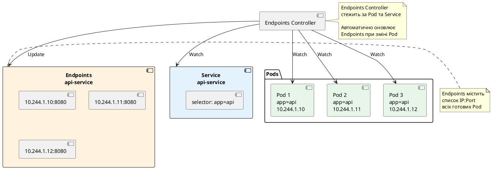

::

### Перегляд Endpoints

::terminal-preview{title="kubectl get endpoints"}

<div class="line"><span class="opacity-40">$</span> <strong>kubectl get endpoints api-service</strong></div>
<div class="line">NAME          ENDPOINTS                                         AGE</div>
<div class="line">api-service   10.244.1.10:8080,10.244.1.11:8080,10.244.1.12:8080   5m</div>

::

**Детальна інформація:**

::terminal-preview{title="kubectl describe endpoints"}

<div class="line"><span class="opacity-40">$</span> <strong>kubectl describe endpoints api-service</strong></div>
<div class="line">Name:         api-service</div>
<div class="line">Namespace:    default</div>
<div class="line">Labels:       <none></div>
<div class="line">Annotations:  endpoints.kubernetes.io/last-change-trigger-time: 2026-05-10T17:30:00Z</div>
<div class="line">Subsets:</div>
<div class="line">  Addresses:          10.244.1.10,10.244.1.11,10.244.1.12</div>
<div class="line">  NotReadyAddresses:  <none></div>
<div class="line">  Ports:</div>
<div class="line">    Name  Port  Protocol</div>
<div class="line">    ----  ----  --------</div>
<div class="line">    http  8080  TCP</div>

::

**Важливі поля:**

- **Addresses** — список IP-адрес готових Pod (пройшли readiness probe)
- **NotReadyAddresses** — список IP-адрес Pod, які ще не готові
- **Ports** — порти, на яких слухають Pod


### Як Endpoints оновлюються

Endpoints Controller постійно стежить за Pod та автоматично оновлює Endpoints:

::plant-uml

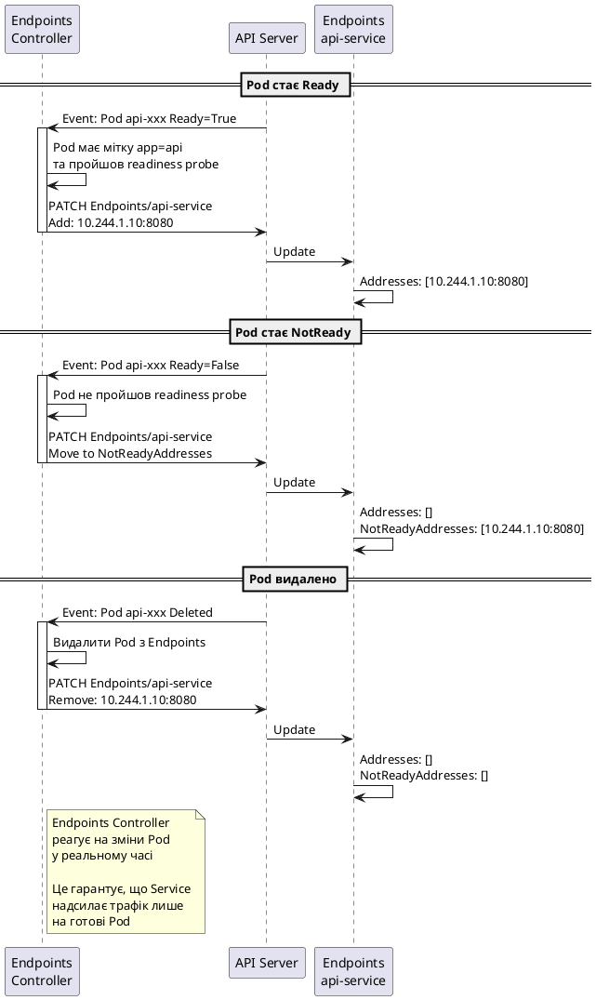

::

**Важливо:** Лише Pod, які **пройшли readiness probe**, додаються до `Addresses`. Pod, які не готові, потрапляють до `NotReadyAddresses` та **не отримують трафік**.

### EndpointSlices — масштабована альтернатива

**Проблема Endpoints:** Якщо у Service 1000 Pod, об'єкт Endpoints містить 1000 IP-адрес. При кожній зміні (додавання/видалення Pod) весь об'єкт оновлюється, що створює навантаження на API Server та etcd.

**Рішення:** **EndpointSlices** (Kubernetes 1.21+) — розбиває Endpoints на менші частини (slices).

::plant-uml

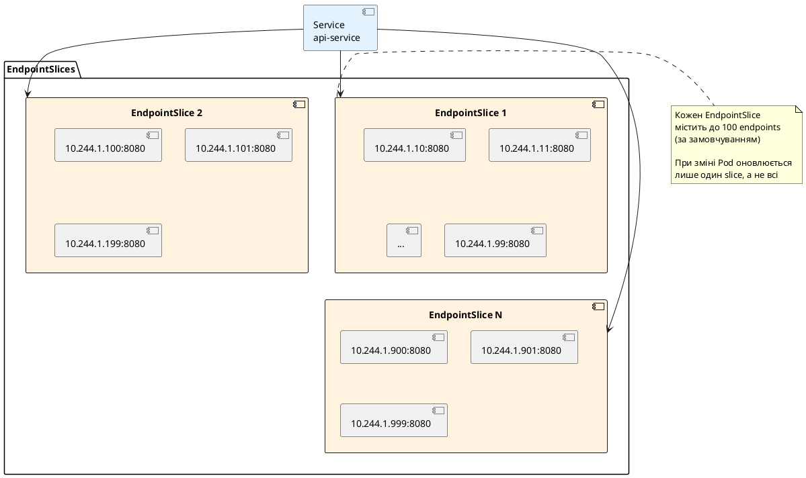

::

**Переваги EndpointSlices:**

- **Масштабованість** — менше навантаження на API Server при великій кількості Pod
- **Ефективність** — оновлюється лише один slice, а не весь список
- **Додаткові метадані** — topology hints, zone information

**Перегляд EndpointSlices:**

::terminal-preview{title="kubectl get endpointslices"}

<div class="line"><span class="opacity-40">$</span> <strong>kubectl get endpointslices -l kubernetes.io/service-name=api-service</strong></div>
<div class="line">NAME                  ADDRESSTYPE   PORTS   ENDPOINTS                                         AGE</div>
<div class="line">api-service-abc123    IPv4          8080    10.244.1.10,10.244.1.11,10.244.1.12              5m</div>

::

::note
**Endpoints vs EndpointSlices:**

- **Endpoints** — legacy, один об'єкт для всіх Pod
- **EndpointSlices** — сучасний підхід, розбиття на частини

Kubernetes автоматично створює обидва для зворотної сумісності. kube-proxy підтримує обидва формати.

**Рекомендація:** Використовуйте EndpointSlices для нових кластерів (Kubernetes 1.21+). Endpoints залишається для сумісності зі старими версіями.
::

---

## Service без selector — ручне управління Endpoints

Іноді потрібен Service, який **не** автоматично вибирає Pod за селектором. Наприклад:

- Доступ до зовнішньої бази даних (не у Kubernetes)
- Міграція з зовнішнього сервісу у Kubernetes
- Проксування до legacy системи

**Рішення:** Створити Service **без selector** та вручну створити Endpoints.

### Приклад: Зовнішня база даних

**Service без selector:**

```yaml
apiVersion: v1
kind: Service
metadata:
  name: external-postgres
spec:
  # Немає selector!
  ports:
    - port: 5432
      targetPort: 5432
```

**Endpoints (створюємо вручну):**

```yaml
apiVersion: v1
kind: Endpoints
metadata:
  name: external-postgres  # Має збігатись з іменем Service
subsets:
  - addresses:
      - ip: 192.168.1.100  # IP зовнішньої БД
    ports:
      - port: 5432
```

**Що відбувається:**

1. Service створюється з ClusterIP (наприклад, `10.96.0.50`)
2. DNS-запис створюється: `external-postgres.default.svc.cluster.local` → `10.96.0.50`
3. Трафік на `10.96.0.50:5432` перенаправляється на `192.168.1.100:5432`

**Візуалізація:**

::plant-uml

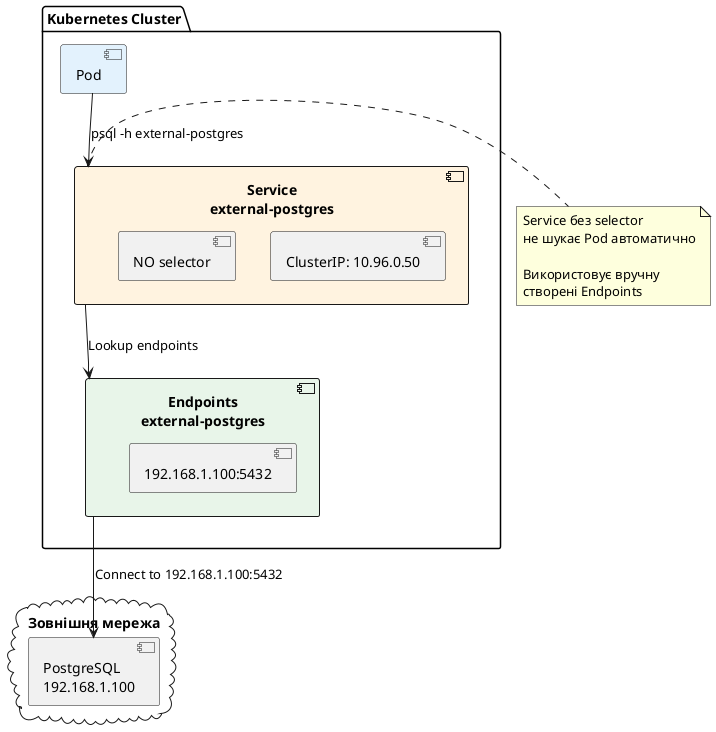

::

**Коли використовувати:**

- Зовнішня база даних (AWS RDS, Azure Database)
- Legacy системи поза Kubernetes
- Поступова міграція у Kubernetes

**Переваги:**

- Код не змінюється — використовує той самий DNS-ім'я
- Легко мігрувати: спочатку зовнішня БД, потім Pod у Kubernetes
- Централізована конфігурація через Service

---

## Практичний приклад: TodoApi з різними типами Service

Тепер створимо повний приклад з TodoApi та різними типами Service.

### Архітектура застосунку

::plant-uml

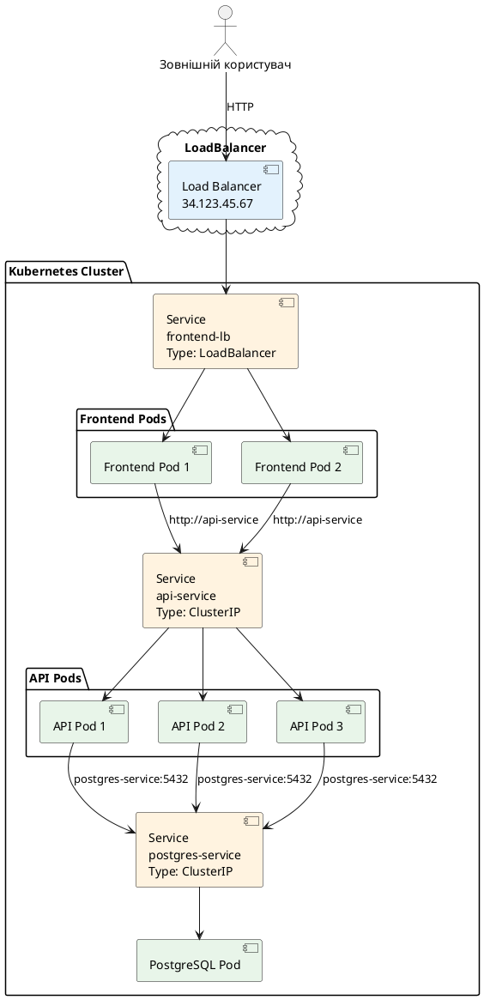

::

### Крок 1: PostgreSQL з ClusterIP Service

**postgres-deployment.yaml:**

```yaml
apiVersion: apps/v1
kind: Deployment
metadata:
  name: postgres
spec:
  replicas: 1
  selector:
    matchLabels:
      app: postgres
  template:
    metadata:
      labels:
        app: postgres
    spec:
      containers:
        - name: postgres
          image: postgres:16
          ports:
            - containerPort: 5432
          env:
            - name: POSTGRES_DB
              value: tododb
            - name: POSTGRES_USER
              value: todouser
            - name: POSTGRES_PASSWORD
              value: todopass
          volumeMounts:
            - name: postgres-storage
              mountPath: /var/lib/postgresql/data
      volumes:
        - name: postgres-storage
          emptyDir: {}
```

**postgres-service.yaml:**

```yaml
apiVersion: v1
kind: Service
metadata:
  name: postgres-service
spec:
  type: ClusterIP  # За замовчуванням, можна не вказувати
  selector:
    app: postgres
  ports:
    - port: 5432
      targetPort: 5432
```

### Крок 2: TodoApi з ClusterIP Service

**api-deployment.yaml:**

```yaml
apiVersion: apps/v1
kind: Deployment
metadata:
  name: todoapi
spec:
  replicas: 3
  selector:
    matchLabels:
      app: todoapi
  template:
    metadata:
      labels:
        app: todoapi
    spec:
      containers:
        - name: todoapi
          image: todoapi:1.0.0
          ports:
            - containerPort: 8080
          env:
            - name: ASPNETCORE_ENVIRONMENT
              value: "Production"
            - name: ASPNETCORE_URLS
              value: "http://+:8080"
            - name: ConnectionStrings__DefaultConnection
              value: "Host=postgres-service;Database=tododb;Username=todouser;Password=todopass"
          resources:
            requests:
              memory: "128Mi"
              cpu: "100m"
            limits:
              memory: "256Mi"
              cpu: "500m"
```

**api-service.yaml:**

```yaml
apiVersion: v1
kind: Service
metadata:
  name: api-service
spec:
  type: ClusterIP
  selector:
    app: todoapi
  ports:
    - name: http
      port: 80
      targetPort: 8080
```

### Крок 3: Frontend з LoadBalancer Service (або NodePort для Minikube)

**frontend-deployment.yaml:**

```yaml
apiVersion: apps/v1
kind: Deployment
metadata:
  name: frontend
spec:
  replicas: 2
  selector:
    matchLabels:
      app: frontend
  template:
    metadata:
      labels:
        app: frontend
    spec:
      containers:
        - name: nginx
          image: nginx:1.27
          ports:
            - containerPort: 80
          volumeMounts:
            - name: nginx-config
              mountPath: /etc/nginx/conf.d
      volumes:
        - name: nginx-config
          configMap:
            name: nginx-config
```

**nginx-configmap.yaml:**

```yaml
apiVersion: v1
kind: ConfigMap
metadata:
  name: nginx-config
data:
  default.conf: |
    upstream api {
        server api-service:80;
    }
    
    server {
        listen 80;
        
        location /api/ {
            proxy_pass http://api/;
            proxy_set_header Host $host;
            proxy_set_header X-Real-IP $remote_addr;
        }
        
        location / {
            root /usr/share/nginx/html;
            index index.html;
            try_files $uri $uri/ /index.html;
        }
    }
```

**frontend-service.yaml (для production з LoadBalancer):**

```yaml
apiVersion: v1
kind: Service
metadata:
  name: frontend-service
spec:
  type: LoadBalancer
  selector:
    app: frontend
  ports:
    - port: 80
      targetPort: 80
```

**frontend-service-nodeport.yaml (для Minikube):**

```yaml
apiVersion: v1
kind: Service
metadata:
  name: frontend-service
spec:
  type: NodePort
  selector:
    app: frontend
  ports:
    - port: 80
      targetPort: 80
      nodePort: 30080  # Доступ через http://<minikube-ip>:30080
```

### Розгортання

::terminal-preview{title="Розгортання застосунку"}

<div class="line"><span class="opacity-40"># PostgreSQL</span></div>
<div class="line"><span class="opacity-40">$</span> <strong>kubectl apply -f postgres-deployment.yaml</strong></div>
<div class="line"><span class="opacity-40">$</span> <strong>kubectl apply -f postgres-service.yaml</strong></div>
<div class="line"></div>
<div class="line"><span class="opacity-40"># TodoApi</span></div>
<div class="line"><span class="opacity-40">$</span> <strong>kubectl apply -f api-deployment.yaml</strong></div>
<div class="line"><span class="opacity-40">$</span> <strong>kubectl apply -f api-service.yaml</strong></div>
<div class="line"></div>
<div class="line"><span class="opacity-40"># Frontend</span></div>
<div class="line"><span class="opacity-40">$</span> <strong>kubectl apply -f nginx-configmap.yaml</strong></div>
<div class="line"><span class="opacity-40">$</span> <strong>kubectl apply -f frontend-deployment.yaml</strong></div>
<div class="line"><span class="opacity-40">$</span> <strong>kubectl apply -f frontend-service-nodeport.yaml</strong></div>
<div class="line"></div>
<div class="line"><span class="opacity-40"># Перевірка</span></div>
<div class="line"><span class="opacity-40">$</span> <strong>kubectl get all</strong></div>
<div class="line">NAME                            READY   STATUS    RESTARTS   AGE</div>
<div class="line">pod/postgres-xxx                1/1     Running   0          2m</div>
<div class="line">pod/todoapi-xxx                 1/1     Running   0          1m</div>
<div class="line">pod/todoapi-yyy                 1/1     Running   0          1m</div>
<div class="line">pod/todoapi-zzz                 1/1     Running   0          1m</div>
<div class="line">pod/frontend-xxx                1/1     Running   0          30s</div>
<div class="line">pod/frontend-yyy                1/1     Running   0          30s</div>
<div class="line"></div>
<div class="line">NAME                       TYPE        CLUSTER-IP     EXTERNAL-IP   PORT(S)</div>
<div class="line">service/postgres-service   ClusterIP   10.96.0.10     &lt;none&gt;        5432/TCP</div>
<div class="line">service/api-service        ClusterIP   10.96.0.20     &lt;none&gt;        80/TCP</div>
<div class="line">service/frontend-service   NodePort    10.96.0.30     &lt;none&gt;        80:30080/TCP</div>

::

### Тестування

::terminal-preview{title="Тестування застосунку"}

<div class="line"><span class="opacity-40"># Отримання IP Minikube</span></div>
<div class="line"><span class="opacity-40">$</span> <strong>minikube ip</strong></div>
<div class="line">192.168.49.2</div>
<div class="line"></div>
<div class="line"><span class="opacity-40"># Доступ до frontend</span></div>
<div class="line"><span class="opacity-40">$</span> <strong>curl http://192.168.49.2:30080</strong></div>
<div class="line">&lt;html&gt;...&lt;/html&gt;</div>
<div class="line"></div>
<div class="line"><span class="opacity-40"># Доступ до API через frontend</span></div>
<div class="line"><span class="opacity-40">$</span> <strong>curl http://192.168.49.2:30080/api/todos</strong></div>
<div class="line">{"todos":[],"count":0}</div>

::


---

## Практичні завдання

Тепер виконайте завдання для закріплення знань про Service та мережі у Kubernetes.

### Завдання 1: Експерименти з типами Service

**Мета:** Зрозуміти різницю між ClusterIP, NodePort та LoadBalancer.

**Завдання:**

1. Створіть Deployment з nginx (3 репліки)

2. Створіть три Service для того самого Deployment:
   - ClusterIP Service
   - NodePort Service
   - LoadBalancer Service (або емулюйте через minikube tunnel)

3. Протестуйте доступ до кожного Service:
   - ClusterIP — з іншого Pod
   - NodePort — з локальної машини
   - LoadBalancer — через EXTERNAL-IP

4. Порівняйте результати

**Очікуваний результат:** Ви зрозумієте, коли використовувати кожен тип Service.

::collapsible{title="Показати рішення"}

**nginx-deployment.yaml:**

```yaml
apiVersion: apps/v1
kind: Deployment
metadata:
  name: nginx-test
spec:
  replicas: 3
  selector:
    matchLabels:
      app: nginx
  template:
    metadata:
      labels:
        app: nginx
    spec:
      containers:
        - name: nginx
          image: nginx:1.27
          ports:
            - containerPort: 80
```

**clusterip-service.yaml:**

```yaml
apiVersion: v1
kind: Service
metadata:
  name: nginx-clusterip
spec:
  type: ClusterIP
  selector:
    app: nginx
  ports:
    - port: 80
      targetPort: 80
```

**nodeport-service.yaml:**

```yaml
apiVersion: v1
kind: Service
metadata:
  name: nginx-nodeport
spec:
  type: NodePort
  selector:
    app: nginx
  ports:
    - port: 80
      targetPort: 80
      nodePort: 30080
```

**loadbalancer-service.yaml:**

```yaml
apiVersion: v1
kind: Service
metadata:
  name: nginx-loadbalancer
spec:
  type: LoadBalancer
  selector:
    app: nginx
  ports:
    - port: 80
      targetPort: 80
```

**Команди:**

```bash
# Створення
kubectl apply -f nginx-deployment.yaml
kubectl apply -f clusterip-service.yaml
kubectl apply -f nodeport-service.yaml
kubectl apply -f loadbalancer-service.yaml

# Перегляд Service
kubectl get services
# NAME                  TYPE           CLUSTER-IP     EXTERNAL-IP   PORT(S)
# nginx-clusterip       ClusterIP      10.96.0.10     <none>        80/TCP
# nginx-nodeport        NodePort       10.96.0.20     <none>        80:30080/TCP
# nginx-loadbalancer    LoadBalancer   10.96.0.30     <pending>     80/TCP

# Тест 1: ClusterIP (з іншого Pod)
kubectl run test-pod --image=curlimages/curl --rm -it --restart=Never -- \
  curl http://nginx-clusterip
# Працює ✅

# Тест 2: NodePort (з локальної машини)
curl http://$(minikube ip):30080
# Працює ✅

# Тест 3: LoadBalancer (для Minikube потрібен tunnel)
minikube tunnel  # У окремому терміналі
kubectl get service nginx-loadbalancer
# EXTERNAL-IP тепер має значення (наприклад, 127.0.0.1)
curl http://127.0.0.1
# Працює ✅

# Очищення
kubectl delete deployment nginx-test
kubectl delete service nginx-clusterip nginx-nodeport nginx-loadbalancer
```

::

---

### Завдання 2: Service Discovery через DNS

**Мета:** Навчитись використовувати DNS для service discovery.

**Завдання:**

1. Створіть два Deployment у різних namespace:
   - `api` у namespace `backend`
   - `frontend` у namespace `frontend`

2. Створіть ClusterIP Service для кожного

3. З Pod frontend зробіть DNS-запит до API Service:
   - Коротка форма (не працює — різні namespace)
   - З namespace (`api.backend`)
   - Повна форма (`api.backend.svc.cluster.local`)

4. Перевірте HTTP-запит через DNS-ім'я

**Очікуваний результат:** Ви зрозумієте, як працює DNS resolution між namespace.

::collapsible{title="Показати рішення"}

**Команди:**

```bash
# Створення namespace
kubectl create namespace backend
kubectl create namespace frontend

# API у namespace backend
kubectl create deployment api --image=nginx:1.27 --replicas=2 -n backend
kubectl expose deployment api --port=80 --target-port=80 -n backend

# Frontend у namespace frontend
kubectl create deployment frontend --image=nginx:1.27 --replicas=2 -n frontend

# Тестування DNS з frontend Pod
kubectl run test-dns -n frontend --image=curlimages/curl --rm -it --restart=Never -- sh

# Тест 1: Коротка форма (не працює)
$ nslookup api
# Server:    10.96.0.10
# ** server can't find api: NXDOMAIN
# ❌ Не працює — різні namespace

# Тест 2: З namespace
$ nslookup api.backend
# Name:      api.backend.svc.cluster.local
# Address:   10.96.0.50
# ✅ Працює

# Тест 3: Повна форма
$ nslookup api.backend.svc.cluster.local
# Name:      api.backend.svc.cluster.local
# Address:   10.96.0.50
# ✅ Працює

# Тест 4: HTTP-запит
$ curl http://api.backend
# <!DOCTYPE html>...
# ✅ Працює

# Очищення
kubectl delete namespace backend frontend
```

::

---

### Завдання 3: Headless Service для StatefulSet

**Мета:** Навчитись використовувати Headless Service для доступу до конкретних Pod.

**Завдання:**

1. Створіть StatefulSet з 3 репліками nginx

2. Створіть Headless Service (`clusterIP: None`)

3. Перевірте DNS-записи:
   - Service DNS (повертає всі Pod)
   - Pod DNS (повертає конкретний Pod)

4. Зробіть HTTP-запит до конкретного Pod через DNS

**Очікуваний результат:** Ви зрозумієте, як Headless Service надає стабільні DNS-імена для Pod.

::collapsible{title="Показати рішення"}

**nginx-statefulset.yaml:**

```yaml
apiVersion: apps/v1
kind: StatefulSet
metadata:
  name: nginx
spec:
  serviceName: nginx-headless
  replicas: 3
  selector:
    matchLabels:
      app: nginx
  template:
    metadata:
      labels:
        app: nginx
    spec:
      containers:
        - name: nginx
          image: nginx:1.27
          ports:
            - containerPort: 80
```

**nginx-headless-service.yaml:**

```yaml
apiVersion: v1
kind: Service
metadata:
  name: nginx-headless
spec:
  clusterIP: None  # Headless Service
  selector:
    app: nginx
  ports:
    - port: 80
      targetPort: 80
```

**Команди:**

```bash
# Створення
kubectl apply -f nginx-headless-service.yaml
kubectl apply -f nginx-statefulset.yaml

# Очікування готовності
kubectl wait --for=condition=ready pod -l app=nginx --timeout=60s

# Перегляд Pod
kubectl get pods -l app=nginx
# NAME      READY   STATUS    RESTARTS   AGE
# nginx-0   1/1     Running   0          30s
# nginx-1   1/1     Running   0          25s
# nginx-2   1/1     Running   0          20s

# Тестування DNS
kubectl run test-dns --image=curlimages/curl --rm -it --restart=Never -- sh

# Тест 1: Service DNS (повертає всі Pod)
$ nslookup nginx-headless.default.svc.cluster.local
# Name:      nginx-headless.default.svc.cluster.local
# Address:   10.244.1.10  (nginx-0)
# Address:   10.244.1.11  (nginx-1)
# Address:   10.244.1.12  (nginx-2)

# Тест 2: Pod DNS (конкретний Pod)
$ nslookup nginx-0.nginx-headless.default.svc.cluster.local
# Name:      nginx-0.nginx-headless.default.svc.cluster.local
# Address:   10.244.1.10

$ nslookup nginx-1.nginx-headless.default.svc.cluster.local
# Name:      nginx-1.nginx-headless.default.svc.cluster.local
# Address:   10.244.1.11

# Тест 3: HTTP-запит до конкретного Pod
$ curl http://nginx-0.nginx-headless
# <!DOCTYPE html>...
# ✅ Працює

$ curl http://nginx-1.nginx-headless
# <!DOCTYPE html>...
# ✅ Працює

# Очищення
kubectl delete statefulset nginx
kubectl delete service nginx-headless
```

::

---

### Завдання 4: Service без selector для зовнішньої БД

**Мета:** Навчитись створювати Service для зовнішніх ресурсів.

**Завдання:**

1. Створіть Service без selector

2. Вручну створіть Endpoints з IP-адресою зовнішнього сервісу (наприклад, `8.8.8.8` — Google DNS для тесту)

3. Перевірте DNS resolution

4. Зробіть запит до Service (має перенаправити на зовнішній сервіс)

**Очікуваний результат:** Ви навчитесь інтегрувати зовнішні сервіси у Kubernetes через Service.

::collapsible{title="Показати рішення"}

**external-service.yaml:**

```yaml
apiVersion: v1
kind: Service
metadata:
  name: external-dns
spec:
  # Немає selector!
  ports:
    - port: 53
      targetPort: 53
      protocol: UDP
```

**external-endpoints.yaml:**

```yaml
apiVersion: v1
kind: Endpoints
metadata:
  name: external-dns  # Має збігатись з іменем Service
subsets:
  - addresses:
      - ip: 8.8.8.8  # Google DNS
    ports:
      - port: 53
        protocol: UDP
```

**Команди:**

```bash
# Створення
kubectl apply -f external-service.yaml
kubectl apply -f external-endpoints.yaml

# Перегляд Service та Endpoints
kubectl get service external-dns
# NAME           TYPE        CLUSTER-IP    EXTERNAL-IP   PORT(S)
# external-dns   ClusterIP   10.96.0.100   <none>        53/UDP

kubectl get endpoints external-dns
# NAME           ENDPOINTS         AGE
# external-dns   8.8.8.8:53        10s

# Тестування
kubectl run test-dns --image=curlimages/curl --rm -it --restart=Never -- sh

# DNS resolution
$ nslookup external-dns.default.svc.cluster.local
# Name:      external-dns.default.svc.cluster.local
# Address:   10.96.0.100

# Тест DNS-запиту через Service (перенаправляється на 8.8.8.8)
$ nslookup google.com external-dns.default.svc.cluster.local
# Server:    external-dns.default.svc.cluster.local
# Address:   10.96.0.100:53
#
# Name:      google.com
# Address:   142.250.185.46
# ✅ Працює — запит пішов на 8.8.8.8 через Service

# Очищення
kubectl delete service external-dns
kubectl delete endpoints external-dns
```

**Практичне застосування:**

Замість `8.8.8.8` використовуйте IP вашої зовнішньої бази даних:

```yaml
apiVersion: v1
kind: Endpoints
metadata:
  name: external-postgres
subsets:
  - addresses:
      - ip: 192.168.1.100  # IP вашої БД
    ports:
      - port: 5432
```

Тепер код може використовувати `external-postgres` як звичайний Service:

```csharp
var connectionString = "Host=external-postgres;Database=mydb;Username=user;Password=pass";
```

::

---

## Резюме

У цій статті ми детально вивчили **Service** — мережеву абстракцію для Pod у Kubernetes. Ось що ми розглянули:

::card-group

::card{title="Проблема ефемерних IP-адрес" icon="i-heroicons-exclamation-triangle"}
Чому прямий доступ до Pod за IP неможливий у production: IP змінюються при перезапуску, немає балансування навантаження, відсутній service discovery.
::

::card{title="Що таке Service" icon="i-heroicons-server"}
Абстракція, яка надає стабільну мережеву точку доступу (IP та DNS) для групи ефемерних Pod. Service — це проксі перед Pod.
::

::card{title="Типи Service" icon="i-heroicons-squares-2x2"}
ClusterIP (внутрішній), NodePort (доступ через вузли), LoadBalancer (зовнішній load balancer), ExternalName (DNS alias). Кожен для різних сценаріїв.
::

::card{title="kube-proxy та iptables" icon="i-heroicons-cog"}
Як Kubernetes перенаправляє трафік від Service до Pod через iptables/IPVS. DNAT, SNAT, балансування навантаження на рівні ядра.
::

::card{title="CoreDNS та Service Discovery" icon="i-heroicons-magnifying-glass"}
Автоматичне створення DNS-записів для Service. Формат DNS-імен, скорочені форми, міжнамespace комунікація.
::

::card{title="Headless Service" icon="i-heroicons-queue-list"}
Service без ClusterIP для прямого доступу до Pod. DNS повертає IP всіх Pod. Використовується для StatefulSet та peer discovery.
::

::card{title="Endpoints та EndpointSlices" icon="i-heroicons-list-bullet"}
Список IP:Port всіх Pod, які відповідають селектору. Автоматичне оновлення при зміні Pod. EndpointSlices для масштабованості.
::

::card{title="Service без selector" icon="i-heroicons-arrow-top-right-on-square"}
Ручне управління Endpoints для інтеграції зовнішніх сервісів. Міграція з зовнішніх систем у Kubernetes.
::

::card{title="Практичний приклад" icon="i-heroicons-code-bracket"}
Повний застосунок з Frontend, API та PostgreSQL. Різні типи Service для різних компонентів. Nginx як reverse proxy.
::

::card{title="Практичні завдання" icon="i-heroicons-academic-cap"}
4 завдання для закріплення знань: типи Service, DNS resolution, Headless Service, Service без selector.
::

::

### Ключові висновки

1. **Service — це не Pod** — це мережевий об'єкт, який діє як стабільний проксі перед групою Pod.

2. **ClusterIP для більшості випадків** — внутрішня комунікація між сервісами. NodePort та LoadBalancer лише для зовнішнього доступу.

3. **DNS — основа service discovery** — використовуйте DNS-імена замість IP-адрес. Короткі форми для того самого namespace, повні для міжнамespace.

4. **kube-proxy не проксує трафік** — він налаштовує iptables/IPVS. Трафік йде напряму від клієнта до Pod через kernel.

5. **Readiness probe критично важливий** — лише готові Pod додаються до Endpoints. Без readiness probe Service надсилає трафік на неготові Pod.

6. **Headless Service для stateful застосунків** — коли потрібен доступ до конкретного Pod за стабільним DNS-іменем.

7. **Service без selector для зовнішніх ресурсів** — інтеграція зовнішніх баз даних, API, legacy систем у Kubernetes.

### Що далі?

Ви вивчили основи Service та мережі у Kubernetes. Наступні теми для поглибленого вивчення:

- **Ingress** — HTTP-маршрутизація та TLS termination для багатьох Service
- **NetworkPolicy** — ізоляція трафіку між Pod та namespace
- **Service Mesh** — розширені можливості мережі (mTLS, traffic management, observability)
- **ConfigMap та Secret** — управління конфігурацією та секретами
- **Volumes та PersistentVolume** — зберігання даних

---

## Корисні команди

Для швидкого доступу — всі команди для роботи з Service:

::code-group

```bash [Створення та перегляд]
# Створення Service з YAML
kubectl apply -f service.yaml

# Створення Service з kubectl expose
kubectl expose deployment <name> --port=80 --target-port=8080

# Перегляд Service
kubectl get services
kubectl get svc  # скорочена форма

# Детальна інформація
kubectl describe service <name>

# Перегляд у форматі YAML
kubectl get service <name> -o yaml
```

```bash [Endpoints]
# Перегляд Endpoints
kubectl get endpoints <service-name>

# Детальна інформація
kubectl describe endpoints <service-name>

# Перегляд EndpointSlices
kubectl get endpointslices -l kubernetes.io/service-name=<name>
```

```bash [DNS тестування]
# Запуск тестового Pod з curl та nslookup
kubectl run test-dns --image=curlimages/curl --rm -it --restart=Never -- sh

# DNS resolution
nslookup <service-name>
nslookup <service-name>.<namespace>
nslookup <service-name>.<namespace>.svc.cluster.local

# HTTP-запит через DNS
curl http://<service-name>
curl http://<service-name>.<namespace>
```

```bash [Debugging]
# Перегляд логів CoreDNS
kubectl logs -n kube-system -l k8s-app=kube-dns

# Перегляд конфігурації kube-proxy
kubectl get configmap kube-proxy -n kube-system -o yaml

# Перегляд iptables правил (на вузлі)
sudo iptables -t nat -L KUBE-SERVICES

# Port-forward до Service
kubectl port-forward service/<name> 8080:80
```

::

---

## Додаткові ресурси

::card-group

::card{title="Офіційна документація: Service" icon="i-heroicons-book-open" to="https://kubernetes.io/docs/concepts/services-networking/service/" target="_blank"}
Повна документація про Service з усіма полями та прикладами.
::

::card{title="DNS for Services and Pods" icon="i-heroicons-magnifying-glass" to="https://kubernetes.io/docs/concepts/services-networking/dns-pod-service/" target="_blank"}
Детальний опис DNS resolution у Kubernetes.
::

::card{title="Connecting Applications with Services" icon="i-heroicons-link" to="https://kubernetes.io/docs/tutorials/services/connect-applications-service/" target="_blank"}
Офіційний туторіал з підключення застосунків через Service.
::

::card{title="Service API Reference" icon="i-heroicons-code-bracket" to="https://kubernetes.io/docs/reference/kubernetes-api/service-resources/service-v1/" target="_blank"}
Детальна специфікація API для Service v1.
::

::

---

**Попередня стаття:** [Rolling Updates та управління життєвим циклом Deployment](/tools/kubernetes/deployment-rolling-updates)

**Наступна стаття:** ConfigMap та Secret — управління конфігурацією
