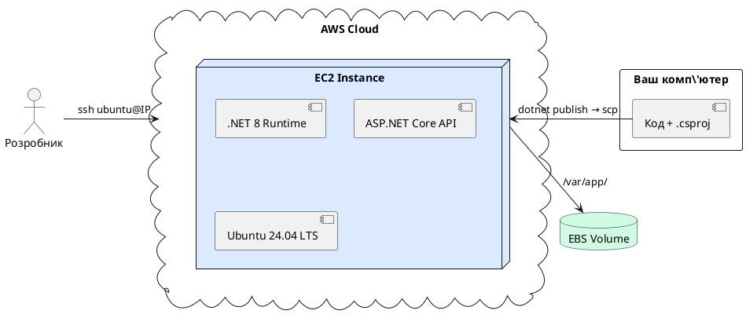
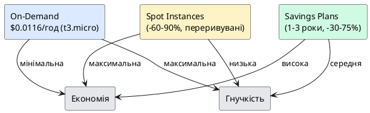
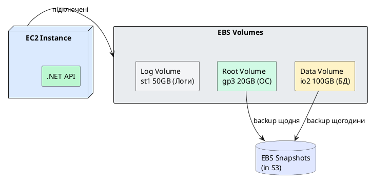
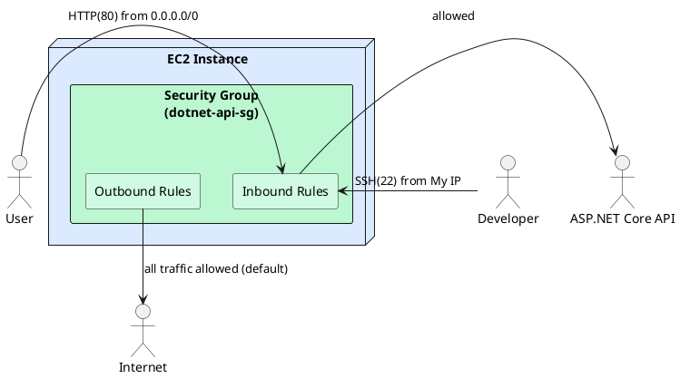
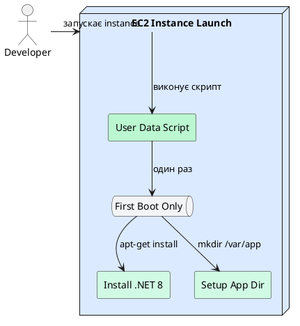

# Amazon EC2 — Elastic Compute Cloud

{.diagram-img}

## Що таке EC2 і навіщо він вам потрібен

Уявіть, що вам потрібен комп'ютер — але не фізичний, який треба купувати, встановлювати в стійку, підключати кабелі та обслуговувати. Ви хочете просто **замовити комп'ютер через інтернет, отримати до нього доступ через кілька хвилин і платити лише поки він працює**. Саме це і є **Amazon EC2 (Elastic Compute Cloud)**.

EC2 надає **віртуальні сервери** (офіційна назва — **instances**) у хмарі AWS. Кожен instance — це повноцінний комп'ютер з процесором, оперативною пам'яттю, дисковим простором та мережевим інтерфейсом. Ви можете запустити від одного до тисяч instances за лічені хвилини — і зупинити їх так само швидко.

**Чому це важливо для .NET розробника?**

Класичний шлях деплою .NET додатку: купуємо або орендуємо фізичний сервер → встановлюємо Windows Server або Linux → налаштовуємо IIS або nginx → деплоїмо застосунок. Цей процес займає дні або тижні і коштує фіксовану суму незалежно від навантаження.

З EC2: запускаємо instance з готовим образом операційної системи → встановлюємо .NET та IIS → деплоїмо → і сервер вже у production. Весь процес — кілька годин. Якщо навантаження зросло — запускаємо ще instances. Якщо впало — зупиняємо зайві. Платимо лише за фактичний час роботи.

::plant-uml



::

---

{.diagram-img}

## EC2 Instance Types — вибір правильного сервера

Instance Type — це конфігурація hardware вашого віртуального сервера: скільки ядер CPU, скільки RAM, який тип мережевого з'єднання. AWS пропонує **600+ типів instances**, згрупованих у сімейства за призначенням.

**Формат назви:** `[сімейство][покоління].[розмір]`

Наприклад: `t3.micro` — сімейство T (General Purpose), 3-тє покоління, розмір micro.

### General Purpose (Загального призначення)

Найпопулярніша категорія — збалансоване співвідношення CPU та RAM. Ідеально для більшості .NET Web API, веб-сайтів, мікросервісів.

**Сімейство T (Burstable Performance):** `t3.nano`, `t3.micro`, `t3.small`, `t3.medium`, `t3.large`

Особливість T-instances: **CPU Credits**. В тихі моменти instance накопичує «кредити» CPU. При піковому навантаженні витрачає їх для короткочасного використання більш ніж базового % CPU. Це дозволяє мати дешевий instance, який справляється з рідкісними піками.

- `t3.micro` — 2 vCPU, 1 GB RAM ← входить у **Free Tier** на 12 місяців
- `t3.small` — 2 vCPU, 2 GB RAM
- `t3.medium` — 2 vCPU, 4 GB RAM ← мінімум для .NET 8 API з реальним навантаженням
- `t3.large` — 2 vCPU, 8 GB RAM

**Сімейство M (Fixed Performance):** `m6i.large`, `m6i.xlarge`, `m6i.2xlarge`

Фіксований (не burstable) рівень CPU. Для production .NET застосунків зі стабільним навантаженням.

### Compute Optimized (Оптимізовані під CPU)

Сімейство **C**: `c6i.large`, `c6i.xlarge`. Вище співвідношення CPU до RAM. Для CPU-інтенсивних задач: обробка зображень, відеотранскодування, ML inference, складні обчислення.

### Memory Optimized (Оптимізовані під RAM)

Сімейство **R**: `r6i.large`, `r6i.xlarge`. Більше RAM відносно CPU. Для in-memory кешування (Redis/Memcached на тому ж instance), великих баз даних в пам'яті, .NET застосунків з великими Dataset.

### Storage Optimized

Сімейство **I** та **D**: надвисока швидкість роботи з диском (NVMe SSD). Для баз даних з інтенсивним I/O, Elasticsearch, аналітичних задач.

::note
**Для початківців:** якщо ви не впевнені — починайте з `t3.micro` (Free Tier) для навчання, `t3.medium` для перших production застосунків. Тип завжди можна змінити — зупинити instance, змінити тип, запустити знову.
::


---

{.diagram-img}

## AMI — Amazon Machine Image

**AMI (Amazon Machine Image)** — це готовий «шаблон» операційної системи з попередньо встановленим програмним забезпеченням. Коли ви запускаєте EC2 instance — ви вказуєте AMI, і instance «клонується» з цього шаблону.

Думайте про AMI як про **знімок жорсткого диска** (snapshot): включає ОС, всі встановлені програми, конфігурацію. Запуск instance з AMI — це як розгортання готового диска на новому комп'ютері.

### Типи AMI

**AWS Managed AMI** — офіційні образи від Amazon та партнерів:
- **Amazon Linux 2023** — власний дистрибутив AWS, оптимізований для EC2. Рекомендований для більшості Linux-задач.
- **Ubuntu Server 24.04 LTS** — популярний серед розробників. Відмінна підтримка .NET.
- **Windows Server 2022** — для .NET Framework та IIS. Включає ліцензію Windows у вартість EC2.
- **Windows Server 2022 with SQL Server** — для застосунків з MS SQL Server.
- **Red Hat Enterprise Linux (RHEL)** — для корпоративних середовищ.

**AWS Marketplace AMI** — образи від третіх сторін з попередньо встановленим ПЗ (платні або безкоштовні): Bitnami WordPress, GitLab CE, Nginx Plus тощо.

**Community AMI** — публічні образи від спільноти. Використовуйте з обережністю — перевіряйте джерело.

**Custom AMI (ваші власні)** — ви можете створити AMI зі свого налаштованого instance. Зручно для auto scaling: замість того, щоб кожен новий сервер встановлював .NET та конфігурував застосунок — він одразу стартує з готовим середовищем.

### AMI та регіони

Важливий нюанс: **AMI прив'язані до регіону**. AMI, доступна у `eu-central-1`, недоступна у `us-east-1` — потрібно скопіювати. ID однієї й тієї ж ОС різниться між регіонами.

::tip
При написанні скриптів автоматизації — ніколи не хардкодьте AMI ID! Замість цього запитуйте актуальний ID через SSM Parameter Store або AWS CLI фільтрами.
::

Знайти актуальний AMI ID для Ubuntu 24.04 у вашому регіоні:

```bash
aws ec2 describe-images \
    --owners 099720109477 \
    --filters "Name=name,Values=ubuntu/images/hvm-ssd-gp3/ubuntu-noble-24.04-amd64-server-*" \
    --query "sort_by(Images, &CreationDate)[-1].ImageId" \
    --output text \
    --region eu-central-1
# Виведе щось на кшталт: ami-0a1b2c3d4e5f67890
```

Тут `099720109477` — це офіційний AWS Account ID компанії Canonical (розробника Ubuntu). Це гарантує, що ви отримаєте справжній офіційний образ.

---

{.diagram-img}

::plant-uml



::

## EC2 Pricing Models — моделі оплати

Ціна EC2 залежить не лише від типу instance, але і від **моделі оплати**. Правильний вибір може заощадити 50–90% витрат.

### On-Demand — оплата по факту

**Принцип:** платите за кожну секунду роботи instance. Немає зобов'язань, немає передоплати. Запустили — платите. Зупинили — не платите.

**Коли використовувати:** навчання, розробка, тестування, нерегулярні задачі, коли ви ще не знаєте, скільки ресурсів потрібно.

**Ціна** (eu-central-1): `t3.micro` ≈ $0.0116/год ≈ $8.4/місяць при 24/7 роботі.

### Reserved Instances та Savings Plans

**Принцип:** ви зобов'язуєтесь використовувати певну кількість ресурсів протягом **1 або 3 років** і отримуєте знижку 30–75% відносно On-Demand.

**Reserved Instances (RI):** резервуєте конкретний тип instance (`t3.medium`) у конкретному регіоні. Якщо вам раптом потрібен більший instance — RI не застосовується.

**Savings Plans:** гнучкіша альтернатива. Ви зобов'язуєтесь витрачати N доларів на годину (наприклад $0.05/год), а знижка застосовується автоматично до будь-яких EC2 instances та Lambda, навіть якщо ви змінили тип.

**Коли використовувати:** для production серверів, які працюють 24/7 протягом тривалого часу.

### Spot Instances — найдешевші, але переривувані

**Принцип:** AWS продає невикористані EC2 потужності зі знижкою **60–90%** відносно On-Demand. Але якщо ці потужності знадобляться AWS — ваш instance може бути **примусово зупинений** з попередженням за 2 хвилини.

**Коли використовувати:** batch-обробка даних, ML-тренування, відеорендеринг, CI/CD pipeline — задачі, які можна перервати і продовжити.

**Коли НЕ використовувати:** для production web-сервера, де переривання неприпустиме.

::card-group

::card{title="On-Demand" icon="i-heroicons-clock"}

Оплата посекундно. Без зобов'язань. **Ідеально:** навчання, розробка, тестування.

::

::card{title="Savings Plans" icon="i-heroicons-banknotes"}

Зобов'язання на 1-3 роки. Знижка 30-75%. **Ідеально:** стабільні production сервери.

::

::card{title="Spot Instances" icon="i-heroicons-bolt"}

Знижка 60-90%. Можуть бути перервані. **Ідеально:** batch-задачі, CI/CD, ML.

::

::

---

{.diagram-img}

::plant-uml



::

## EBS — Elastic Block Store (диски для EC2)

**EBS (Elastic Block Store)** — це мережеві диски (аналог жорстких дисків), які підключаються до EC2 instances. Кожен EC2 instance має щонайменше один EBS том — **root volume** з операційною системою.

**Ключова особливість EBS:** дані **зберігаються незалежно від EC2 instance**. Якщо зупинити або навіть видалити instance — EBS том залишається і дані не втрачаються (якщо не увімкнено «Delete on termination»).

### Типи EBS томів

**gp3 (General Purpose SSD)** — рекомендований для більшості задач. 3000 IOPS та 125 MB/s за замовчуванням (можна збільшити незалежно від розміру). Ціна: ~$0.08/GB/місяць.

**gp2 (застарілий General Purpose SSD)** — попереднє покоління. IOPS прив'язані до розміру (3 IOPS/GB). Уникайте для нових проєктів.

**io2 (Provisioned IOPS SSD)** — для баз даних з інтенсивним I/O. До 64,000 IOPS. Дорожче.

**st1 (Throughput Optimized HDD)** — для великих об'ємів послідовного читання/запису. Дешевший за SSD, але повільніший.

### EBS Snapshots — резервні копії

**Snapshot** — це точкова копія EBS тому, збережена в S3. Використовується для:
- Резервного копіювання даних
- Переміщення даних між регіонами
- Створення AMI з поточного стану instance
- Відновлення instance до попереднього стану

```bash
# Створити snapshot поточного root volume
# Спочатку дізнайтесь Volume ID вашого instance
aws ec2 describe-volumes \
    --filters "Name=attachment.instance-id,Values=i-1234567890abcdef0" \
    --query "Volumes[*].VolumeId" \
    --output text --region eu-central-1

# Створіть snapshot
aws ec2 create-snapshot \
    --volume-id vol-0a1b2c3d4e5f67890 \
    --description "Backup before update" \
    --region eu-central-1
```


---

{.diagram-img}

::plant-uml



::

## Security Groups — файрвол для EC2

**Security Group** — це віртуальний файрвол, який контролює вхідний (inbound) і вихідний (outbound) мережевий трафік для EC2 instance. Думайте про нього як про список правил: «дозволити трафік з порту 80» або «заборонити все, крім SSH з нашого IP».

**Ключові властивості Security Groups:**

- **Stateful (з відстеженням стану):** якщо дозволено вхідне з'єднання — відповідний вихідний трафік дозволяється автоматично, і навпаки. Вам не потрібно додавати окреме правило для «відповідь на запит».
- **Дозвільні, не забороняючі:** у Security Groups можна лише **дозволяти** трафік. Не можна написати «заборонити з IP 1.2.3.4». Для заборони — використовуйте NACL.
- **Можна призначити кілька** Security Groups одному instance.
- **За замовчуванням:** весь вхідний трафік заборонений, весь вихідний — дозволений.

### Правила Security Group

Кожне правило описує:

| Поле | Приклад | Опис |
|---|---|---|
| Type | HTTP, SSH, Custom TCP | Тип трафіку (HTTP автоматично ставить порт 80) |
| Protocol | TCP, UDP, ICMP | Протокол |
| Port Range | 80, 443, 8080, 22 | Порт або діапазон портів |
| Source | 0.0.0.0/0, 203.0.113.5/32, sg-xxx | Звідки дозволений трафік |

**Source `0.0.0.0/0`** — означає «з будь-якого IP у світі». Використовуйте лише для публічних портів (80, 443).

**Source `203.0.113.5/32`** — лише з конкретного IP (наприклад, ваш домашній IP). `/32` означає один конкретний IP. Ідеально для SSH — не відкривайте 22 порт для всього світу!

**Source `sg-0a1b2c3d`** — лише від інших EC2 instances з цим Security Group. Зручно для мікросервісної архітектури: API може звертатись до БД лише якщо знаходиться в тій самій Security Group.

### Security Groups vs NACLs

Студенти часто плутають ці два механізми. Ось принципова різниця:

| Характеристика | Security Group | Network ACL (NACL) |
|---|---|---|
| **Рівень застосування** | EC2 Instance | Subnet |
| **Тип правил** | Лише Allow | Allow та Deny |
| **Stateful/Stateless** | Stateful | Stateless |
| **Порядок правил** | Усі правила перевіряються | Правила нумеровані, першe спрацьоване |
| **Типове використання** | Щоденне управління доступом | Блокування діапазонів IP |

**Для більшості задач достатньо Security Groups.** NACLs — додатковий шар захисту для специфічних сценаріїв (наприклад, заблокувати країну або діапазон IP після DDoS атаки).

---

{.diagram-img}

## Elastic IP — стала публічна IP-адреса

За замовчуванням кожен раз, коли ви **зупиняєте і запускаєте** EC2 instance — він отримує **нову публічну IP-адресу**. Це проблема для production: DNS запис вказує на стару IP, і після рестарту сервер «зникає» з інтернету.

**Elastic IP (EIP)** — це **стала** публічна IP-адреса, яку ви можете прикріпити до будь-якого EC2 instance. При зупинці/запуску instance — EIP залишається незмінним.

**Важливо про ціну:** Elastic IP **безкоштовний**, поки він прикріплений до **запущеного** instance. Але якщо EIP виділений але не прикріплений (або прикріплений до зупиненого instance) — він коштує ~$0.005/год (~$3.6/місяць). AWS стягує плату за невикористані IP, щоб не допустити вичерпання пулу публічних адрес.

::caution
Завжди звільняйте Elastic IP, якщо більше не використовуєте instance. EIP, що висить без instance — це «порожня» витрата. Після видалення instance — EIP лишається у вашому акаунті і тарифікується!
::

---

{.diagram-img}

::plant-uml



::

## EC2 User Data — автоматизація при запуску

**User Data** — це скрипт (bash або PowerShell), який виконується **один раз** при першому запуску EC2 instance. Це механізм автоматичного налаштування сервера без ручного SSH-підключення.

**Приклад User Data для Ubuntu з автоматичним встановленням .NET 8:**

```bash
#!/bin/bash
# Цей скрипт виконається автоматично при першому запуску instance

# Оновлюємо список пакетів (аналог "перевірити оновлення" у Windows)
apt-get update -y

# Встановлюємо wget для завантаження файлів
apt-get install -y wget

# Додаємо Microsoft репозиторій для .NET
wget https://packages.microsoft.com/config/ubuntu/24.04/packages-microsoft-prod.deb -O packages-microsoft-prod.deb
dpkg -i packages-microsoft-prod.deb
rm packages-microsoft-prod.deb

# Встановлюємо .NET 8 Runtime (лише для запуску, не розробки)
apt-get update -y
apt-get install -y dotnet-runtime-8.0

# Створюємо директорію для застосунку
mkdir -p /var/app

# Записуємо лог — щоб переконатись, що скрипт виконався
echo "Setup completed at $(date)" >> /var/app/setup.log
```

**User Data для Windows Server (PowerShell):**

```powershell
<powershell>
# Встановити .NET 8 Hosting Bundle (включає Runtime і IIS модуль)
$url = "https://download.microsoft.com/download/dotnet/8.0/aspnetcore-runtime-8.0.0-win-x64.exe"
$installer = "C:spnetcore-installer.exe"
Invoke-WebRequest -Uri $url -OutFile $installer
Start-Process -FilePath $installer -ArgumentList "/quiet /norestart" -Wait

# Встановити IIS та необхідні компоненти
Install-WindowsFeature -Name Web-Server, Web-Asp-Net45, Web-Mgmt-Console -IncludeManagementTools

# Записати лог
"Setup completed at $(Get-Date)" | Out-File C:\setup.log
</powershell>
```

---

{.diagram-img}

## EC2 Instance Metadata Service (IMDS)

**Instance Metadata Service (IMDS)** — це внутрішній HTTP-сервіс, доступний з будь-якого EC2 instance за адресою `http://169.254.169.254`. Він надає інформацію про сам instance: ID, тип, регіон, IAM Role, публічний IP тощо.

Ця адреса (`169.254.169.254`) — спеціальна «link-local» адреса, доступна лише зсередини instance. Жоден зовнішній комп'ютер не може звернутись до IMDS ззовні — це внутрішній сервіс EC2.

**Навіщо IMDS .NET розробнику:**

- AWS SDK for .NET автоматично звертається до IMDS для отримання IAM Role credentials — саме завдяки цьому ваш код на EC2 не потребує Access Keys
- Можна отримати публічний IP instance прямо зсередині коду — без зовнішніх запитів
- Визначити, в якому регіоні запущений instance

```bash
# Отримати Instance ID (виконується на EC2 через SSH)
curl http://169.254.169.254/latest/meta-data/instance-id
# Виведе: i-1234567890abcdef0

# Отримати публічний IP
curl http://169.254.169.254/latest/meta-data/public-ipv4
# Виведе: 3.64.185.42

# Отримати тип instance
curl http://169.254.169.254/latest/meta-data/instance-type
# Виведе: t3.medium

# Отримати регіон
curl -s http://169.254.169.254/latest/meta-data/placement/region
# Виведе: eu-central-1
```

**IMDSv2 — безпечніша версія:** AWS рекомендує використовувати IMDSv2, яка вимагає спочатку отримати токен, а потім використовувати його для запитів. Це захищає від Server-Side Request Forgery (SSRF) атак.

```bash
# IMDSv2: спочатку отримати токен (діє 21600 секунд = 6 годин)
TOKEN=$(curl -s -X PUT "http://169.254.169.254/latest/api/token" \
    -H "X-aws-ec2-metadata-token-ttl-seconds: 21600")

# Потім використовувати токен у запитах
curl -s -H "X-aws-ec2-metadata-token: $TOKEN" \
    http://169.254.169.254/latest/meta-data/instance-id
```

---

{.diagram-img}

## EC2 Instance Connect — підключення без SSH ключів

**EC2 Instance Connect** — це сервіс AWS, який дозволяє підключитись до EC2 через браузер або CLI **без збереження SSH приватних ключів локально**. AWS тимчасово завантажує ваш публічний ключ у instance на 60 секунд.

**Через Console:** EC2 → Instances → оберіть instance → **Connect** → вкладка **EC2 Instance Connect** → **Connect**. Відкриється термінал прямо у браузері.

**Через CLI:**

```bash
# Встановіть EC2 Instance Connect CLI (один раз)
pip install ec2instanceconnectcli

# Підключення (замість звичайного ssh)
mssh ec2-user@i-1234567890abcdef0 --region eu-central-1
```

::tip
EC2 Instance Connect не вимагає відкритого порту 22 для всього світу. Достатньо дозволити трафік із IP-діапазону AWS для EC2 Instance Connect. AWS публікує ці діапазони.
::


---

{.diagram-img}

## Практичний приклад: .NET 8 API на Linux (Ubuntu) від А до Я

У цьому прикладі ми запустимо EC2 instance з Ubuntu, встановимо .NET 8, задеплоїмо ASP.NET Core API і налаштуємо його як системний сервіс, що автоматично стартує при перезапуску сервера.

### Крок 1: Запуск EC2 instance

::tabs

::tabs-item{label="AWS Console"}

1. Відкрийте **EC2** у AWS Console → **Instances** → **Launch instances**
2. **Name:** `dotnet-api-server`
3. **Application and OS Images (AMI):**
   - Натисніть **Ubuntu** у Quick Start
   - Оберіть **Ubuntu Server 24.04 LTS (HVM), SSD Volume Type**
   - Architecture: **64-bit (x86)**
4. **Instance type:** `t3.micro` (Free Tier) або `t3.medium` для реального навантаження
5. **Key pair (login):**
   - Натисніть **Create new key pair**
   - Key pair name: `ec2-lab-key`
   - Key pair type: **RSA**
   - Private key file format: **.pem** (для Mac/Linux) або **.ppk** (для Windows з PuTTY)
   - Натисніть **Create key pair** — файл `.pem` автоматично завантажиться
   - **Збережіть цей файл! Його неможливо завантажити повторно.**
6. **Network settings:**
   - Натисніть **Edit**
   - VPC: залиште default
   - Subnet: залиште default
   - Auto-assign public IP: **Enable**
   - **Firewall (security groups):** Create security group
     - Security group name: `dotnet-api-sg`
     - ✅ Allow SSH traffic from: **My IP** *(AWS автоматично визначить ваш поточний IP)*
     - ✅ Allow HTTP traffic from the internet *(порт 80)*
7. **Configure storage:** 20 GB gp3 (достатньо)
8. Натисніть **Launch instance**

::

::tabs-item{label="AWS CLI"}

```bash
# Крок 1a: Знайдіть актуальний Ubuntu 24.04 AMI ID у вашому регіоні
AMI_ID=$(aws ec2 describe-images \
    --owners 099720109477 \
    --filters "Name=name,Values=ubuntu/images/hvm-ssd-gp3/ubuntu-noble-24.04-amd64-server-*" \
    --query "sort_by(Images, &CreationDate)[-1].ImageId" \
    --output text --region eu-central-1)
echo "AMI ID: $AMI_ID"

# Крок 1b: Знайдіть ваш default VPC ID
VPC_ID=$(aws ec2 describe-vpcs \
    --filters "Name=isDefault,Values=true" \
    --query "Vpcs[0].VpcId" --output text --region eu-central-1)

# Крок 1c: Створіть Security Group
SG_ID=$(aws ec2 create-security-group \
    --group-name dotnet-api-sg \
    --description "Security group for .NET API" \
    --vpc-id $VPC_ID \
    --region eu-central-1 \
    --query GroupId --output text)

# Крок 1d: Дозвольте SSH лише з вашого поточного IP
MY_IP=$(curl -s https://checkip.amazonaws.com)
aws ec2 authorize-security-group-ingress \
    --group-id $SG_ID \
    --protocol tcp --port 22 \
    --cidr "${MY_IP}/32" --region eu-central-1

# Крок 1e: Дозвольте HTTP з будь-якого IP
aws ec2 authorize-security-group-ingress \
    --group-id $SG_ID \
    --protocol tcp --port 80 \
    --cidr 0.0.0.0/0 --region eu-central-1

# Крок 1f: Дозвольте port 5000 (для тестування .NET без reverse proxy)
aws ec2 authorize-security-group-ingress \
    --group-id $SG_ID \
    --protocol tcp --port 5000 \
    --cidr 0.0.0.0/0 --region eu-central-1

# Крок 1g: Створіть SSH key pair
aws ec2 create-key-pair \
    --key-name ec2-lab-key \
    --region eu-central-1 \
    --query "KeyMaterial" --output text > ~/.ssh/ec2-lab-key.pem

# Встановіть правильні права на файл ключа (обов'язково!)
chmod 400 ~/.ssh/ec2-lab-key.pem

# Крок 1h: Запустіть instance
INSTANCE_ID=$(aws ec2 run-instances \
    --image-id $AMI_ID \
    --instance-type t3.micro \
    --key-name ec2-lab-key \
    --security-group-ids $SG_ID \
    --region eu-central-1 \
    --tag-specifications 'ResourceType=instance,Tags=[{Key=Name,Value=dotnet-api-server}]' \
    --query "Instances[0].InstanceId" --output text)

echo "Instance ID: $INSTANCE_ID"
```

::

::

Зачекайте ~2 хвилини поки instance запуститься. Стан зміниться з `pending` на `running`.

---

### Крок 2: Підключення до сервера через SSH

**SSH (Secure Shell)** — це протокол для безпечного підключення до віддаленого комп'ютера через термінал. Це як «Remote Desktop» але текстовий. Для Linux серверів SSH — стандартний спосіб роботи.

Спочатку знайдіть **публічну IP-адресу** вашого instance:

::tabs

::tabs-item{label="AWS Console"}

1. EC2 → **Instances** → оберіть `dotnet-api-server`
2. У вкладці **Details** знайдіть **Public IPv4 address**
3. Скопіюйте цей IP (наприклад: `3.64.185.42`)

::

::tabs-item{label="AWS CLI"}

```bash
# ЗАМІНІТЬ i-1234567890abcdef0 на ваш реальний Instance ID
aws ec2 describe-instances \
    --instance-ids $INSTANCE_ID \
    --query "Reservations[0].Instances[0].PublicIpAddress" \
    --output text --region eu-central-1
```

::

::

Тепер підключіться через SSH:

::terminal-preview{title="SSH підключення до EC2"}

<div class="line"><span class="opacity-40">$</span> <strong>ssh -i ~/.ssh/ec2-lab-key.pem ubuntu@3.64.185.42</strong></div>
<div class="line">The authenticity of host '3.64.185.42' can't be established.</div>
<div class="line">ED25519 key fingerprint is SHA256:abc123...</div>
<div class="line">Are you sure you want to continue connecting (yes/no/[fingerprint])? <strong>yes</strong></div>
<div class="line">Warning: Permanently added '3.64.185.42' (ED25519) to the list of known hosts.</div>
<div class="line"></div>
<div class="line"><span class="text-green-400">ubuntu@ip-172-31-10-25:~$</span></div>

::

**Пояснення команди SSH:**
- `ssh` — команда для підключення
- `-i ~/.ssh/ec2-lab-key.pem` — прапорець `-i` вказує файл ключа автентифікації. `~` означає вашу домашню директорію (`/Users/yourname` на Mac, `C:\Users\yourname` на Windows)
- `ubuntu@3.64.185.42` — ім'я користувача (`ubuntu` для Ubuntu AMI) та IP-адреса сервера

Після підключення ви побачите **запрошення командного рядка** (`ubuntu@ip-172-31-10-25:~$`) — це означає, що ви знаходитесь всередині сервера. Всі наступні команди виконуються **на сервері**, не на вашому комп'ютері.

::tip
Якщо отримуєте помилку `Permission denied (publickey)` — переконайтесь, що файл ключа має права 400: `chmod 400 ~/.ssh/ec2-lab-key.pem`
::

---

### Крок 3: Встановлення .NET 8 на Ubuntu

Ви вже підключені до сервера через SSH. Виконайте наступні команди одну за одною.

**Що таке `apt-get`?** Це менеджер пакетів Ubuntu — аналог Chocolatey для Windows або Homebrew для Mac. Командою `apt-get install` ви встановлюєте програми, командою `apt-get update` — оновлюєте список доступних пакетів.

```bash
# Оновлюємо список доступних пакетів у менеджері
# -y означає "погоджуватись автоматично" без підтвердження
sudo apt-get update -y
```

**Що таке `sudo`?** На Linux більшість системних команд вимагають прав адміністратора. `sudo` (Super User DO) дозволяє виконати команду з правами адміністратора. Без `sudo` ви отримаєте помилку `Permission denied`.

```bash
# Встановлюємо допоміжні утиліти
sudo apt-get install -y wget apt-transport-https

# Завантажуємо пакет налаштування репозиторію Microsoft
wget https://packages.microsoft.com/config/ubuntu/24.04/packages-microsoft-prod.deb \
    -O packages-microsoft-prod.deb

# Встановлюємо завантажений пакет
# dpkg -i означає "встановити .deb пакет"
sudo dpkg -i packages-microsoft-prod.deb

# Видаляємо тимчасовий файл
rm packages-microsoft-prod.deb

# Ще раз оновлюємо список пакетів (тепер включає Microsoft репозиторій)
sudo apt-get update -y
```

::terminal-preview{title="Встановлення .NET SDK"}

<div class="line"><span class="text-green-400">ubuntu@ip-172-31-10-25:~$</span> <strong>sudo apt-get install -y dotnet-sdk-8.0</strong></div>
<div class="line">Reading package lists... Done</div>
<div class="line">Building dependency tree... Done</div>
<div class="line">The following NEW packages will be installed:</div>
<div class="line">&nbsp;&nbsp;dotnet-apphost-pack-8.0 dotnet-host dotnet-runtime-8.0 dotnet-sdk-8.0</div>
<div class="line">0 upgraded, 4 newly installed, 0 to remove and 0 not upgraded.</div>
<div class="line"><span class="text-green-400">Setting up dotnet-sdk-8.0 (8.0.100-1)... Done</span></div>

::

```bash
# Перевірте встановлення
dotnet --version
```

::terminal-preview{title="Перевірка версії .NET"}

<div class="line"><span class="text-green-400">ubuntu@ip-172-31-10-25:~$</span> <strong>dotnet --version</strong></div>
<div class="line">8.0.100</div>

::


---

### Крок 4: Створення та публікація .NET Web API

На **вашому локальному комп'ютері** (відкрийте новий термінал, не SSH-сесію) створіть проєкт:

```bash
# Створюємо новий Web API проєкт
dotnet new webapi -n Ec2LabApi --no-openapi
cd Ec2LabApi
```

Замінимо вміст `Program.cs` на наступний:

```csharp
var builder = WebApplication.CreateBuilder(args);
var app = builder.Build();

// Відображаємо інформацію про сервер — корисно для перевірки
app.MapGet("/", () => new
{
    message = "Hello from EC2!",
    server = Environment.MachineName,
    dotnetVersion = Environment.Version.ToString(),
    timestamp = DateTime.UtcNow
});

app.MapGet("/health", () => Results.Ok("Healthy"));

app.Run();
```

Опублікуємо додаток для Linux (навіть якщо ви на Mac або Windows):

```bash
# Публікуємо для Linux x64
# -r linux-x64 вказує цільову платформу
# --self-contained false означає що на сервері має бути .NET Runtime (ми його вже встановили)
# -o ./publish вказує куди зберегти результат
dotnet publish -c Release -r linux-x64 --self-contained false -o ./publish
```

::terminal-preview{title="dotnet publish"}

<div class="line"><span class="opacity-40">$</span> <strong>dotnet publish -c Release -r linux-x64 --self-contained false -o ./publish</strong></div>
<div class="line">  Determining projects to restore...</div>
<div class="line">  Restored Ec2LabApi.csproj (2.1s)</div>
<div class="line">  Ec2LabApi -> ./bin/Release/net8.0/linux-x64/Ec2LabApi.dll</div>
<div class="line"><span class="text-green-400">  Ec2LabApi -> ./publish/</span></div>
<div class="line">Build succeeded.</div>

::

---

### Крок 5: Копіювання файлів на сервер через SCP

**SCP (Secure Copy Protocol)** — утиліта для копіювання файлів між комп'ютерами через SSH. Синтаксис: `scp [файл-звідки] [куди]`.

На **вашому локальному комп'ютері** (в директорії `Ec2LabApi`):

```bash
# Копіюємо папку publish на сервер
# -r означає рекурсивно (разом зі всіма підпапками)
# -i вказує SSH ключ (той самий, що для ssh)
# ЗАМІНІТЬ 3.64.185.42 на ваш реальний Public IP
scp -r -i ~/.ssh/ec2-lab-key.pem ./publish ubuntu@3.64.185.42:/tmp/ec2lab-publish
```

::terminal-preview{title="scp копіювання"}

<div class="line"><span class="opacity-40">$</span> <strong>scp -r -i ~/.ssh/ec2-lab-key.pem ./publish ubuntu@3.64.185.42:/tmp/ec2lab-publish</strong></div>
<div class="line">Ec2LabApi.dll                         100%  182KB   1.2MB/s   00:00</div>
<div class="line">Ec2LabApi.pdb                         100%  268KB   1.3MB/s   00:00</div>
<div class="line">Ec2LabApi.runtimeconfig.json          100%  151B    12.1KB/s  00:00</div>
<div class="line"><span class="text-green-400">appsettings.json                       100%  141B    11.3KB/s  00:00</span></div>

::

Поверніться до SSH-сесії (термінал де ви підключені до сервера). Перемістіть файли:

```bash
# Переміщуємо з тимчасової директорії у постійну
sudo mv /tmp/ec2lab-publish /var/app

# Перевіримо, що файли є
ls -la /var/app/
```

::terminal-preview{title="Список файлів на сервері"}

<div class="line"><span class="text-green-400">ubuntu@ip-172-31-10-25:~$</span> <strong>ls -la /var/app/</strong></div>
<div class="line">total 204</div>
<div class="line">drwxr-xr-x 2 root root   4096 Jan 15 10:30 .</div>
<div class="line">drwxr-xr-x 8 root root   4096 Jan 15 10:30 ..</div>
<div class="line">-rwxr-xr-x 1 root root 182456 Jan 15 10:30 Ec2LabApi.dll</div>
<div class="line">-rw-r--r-- 1 root root    141 Jan 15 10:30 appsettings.json</div>
<div class="line">-rw-r--r-- 1 root root    151 Jan 15 10:30 Ec2LabApi.runtimeconfig.json</div>

::

---

### Крок 6: Запуск і тестування

```bash
# Переходимо в директорію додатку
cd /var/app

# Запускаємо .NET API
# ASPNETCORE_URLS вказує на якому порту слухати
# & в кінці запускає процес у фоновому режимі
ASPNETCORE_URLS="http://+:5000" dotnet Ec2LabApi.dll &
```

::terminal-preview{title="Запуск API"}

<div class="line"><span class="text-green-400">ubuntu@ip-172-31-10-25:/var/app$</span> <strong>ASPNETCORE_URLS="http://+:5000" dotnet Ec2LabApi.dll &</strong></div>
<div class="line">[1] 12345</div>
<div class="line"><span class="text-blue-400">info: Microsoft.Hosting.Lifetime[14]</span></div>
<div class="line">&nbsp;&nbsp;&nbsp;&nbsp;&nbsp;Now listening on: http://[::]:5000</div>
<div class="line"><span class="text-blue-400">info: Microsoft.Hosting.Lifetime[0]</span></div>
<div class="line">&nbsp;&nbsp;&nbsp;&nbsp;&nbsp;Application started. Press Ctrl+C to shut down.</div>

::

Перевіримо прямо на сервері:

```bash
# curl — консольний HTTP клієнт
# Виконуємо HTTP запит до нашого API (який слухає на localhost:5000)
curl http://localhost:5000/
```

::terminal-preview{title="curl тест на сервері"}

<div class="line"><span class="text-green-400">ubuntu@ip-172-31-10-25:/var/app$</span> <strong>curl http://localhost:5000/</strong></div>
<div class="line">{"message":"Hello from EC2!","server":"ip-172-31-10-25","dotnetVersion":"8.0.0","timestamp":"2024-01-15T10:35:00Z"}</div>

::

Тепер перевіримо з вашого **локального комп'ютера** (замініть IP на ваш):

::terminal-preview{title="curl з локального комп'ютера"}

<div class="line"><span class="opacity-40">$</span> <strong>curl http://3.64.185.42:5000/</strong></div>
<div class="line">{"message":"Hello from EC2!","server":"ip-172-31-10-25","dotnetVersion":"8.0.0","timestamp":"2024-01-15T10:35:05Z"}</div>

::

**API працює у хмарі!** Можна відкрити у браузері: `http://3.64.185.42:5000`

---

{.diagram-img}

### Крок 7: Налаштування Systemd Service — автозапуск після рестарту

Запуск через `&` — тимчасовий. Якщо сервер перезавантажиться — API не запуститься автоматично. **Systemd** — це система управління сервісами на Linux. Вона запускає сервіси при старті ОС, перезапускає їх при збоях, збирає логи.

Зупиніть поточний процес:

```bash
# Знайдіть PID (Process ID) запущеного dotnet процесу
# ps aux — показати всі запущені процеси
# grep dotnet — відфільтрувати лише рядки зі словом "dotnet"
ps aux | grep dotnet
# Виведе: ubuntu  12345  ... dotnet Ec2LabApi.dll

# Завершіть процес за PID
kill 12345
```

Створіть файл unit для systemd:

```bash
# nano — простий текстовий редактор у терміналі
# Ctrl+O — зберегти, Ctrl+X — вийти
sudo nano /etc/systemd/system/ec2lab-api.service
```

У відкритому редакторі вставте наступний вміст:

```ini
[Unit]
Description=EC2 Lab .NET API
# Запускати після того, як мережа буде готова
After=network.target

[Service]
# Користувач під яким запускається процес
User=ubuntu
# Робоча директорія
WorkingDirectory=/var/app
# Команда запуску
ExecStart=/usr/bin/dotnet /var/app/Ec2LabApi.dll
# Автоматично перезапускати якщо процес впав
Restart=always
# Чекати 10 секунд перед перезапуском
RestartSec=10
# Змінні середовища
Environment=ASPNETCORE_ENVIRONMENT=Production
Environment=ASPNETCORE_URLS=http://+:5000

[Install]
# Запускати у стандартному multi-user режимі
WantedBy=multi-user.target
```

Збережіть: натисніть `Ctrl+O` (підтвердіть Enter) → `Ctrl+X` для виходу.

```bash
# Перечитати конфігурацію systemd (потрібно після кожної зміни .service файлу)
sudo systemctl daemon-reload

# Увімкнути автозапуск при старті системи
sudo systemctl enable ec2lab-api

# Запустити сервіс прямо зараз
sudo systemctl start ec2lab-api

# Перевірити статус
sudo systemctl status ec2lab-api
```

::terminal-preview{title="systemctl status"}

<div class="line"><span class="opacity-40">$</span> <strong>sudo systemctl status ec2lab-api</strong></div>
<div class="line">● ec2lab-api.service - EC2 Lab .NET API</div>
<div class="line">     Loaded: loaded (/etc/systemd/system/ec2lab-api.service; enabled)</div>
<div class="line">     <span class="text-green-400">Active: active (running)</span> since Mon 2024-01-15 10:40:00 UTC</div>
<div class="line">   Main PID: 13456 (dotnet)</div>
<div class="line">      Tasks: 19 (limit: 1057)</div>
<div class="line">     Memory: 52.1M</div>
<div class="line">Jan 15 10:40:01 ip-172-31 dotnet[13456]: info: Lifetime Now listening on: http://[::]:5000</div>

::

```bash
# Переглянути логи сервісу
sudo journalctl -u ec2lab-api -n 50 --no-pager

# Слідкувати за логами в реальному часі (Ctrl+C щоб вийти)
sudo journalctl -u ec2lab-api -f
```

Перезавантажте сервер і переконайтесь, що API стартує автоматично:

```bash
sudo reboot
# Підключення закриється. Зачекайте 1-2 хвилини і підключіться знову через SSH.
# Потім перевірте: curl http://localhost:5000/
```


---

{.diagram-img}

### Крок 8 (бонус): Підключення безкоштовного домену pp.ua до EC2

Зараз ваш API доступний за IP-адресою (`http://3.64.185.42:5000`). Але IP-адреса — це незручно: вона може змінитись, її важко запам'ятати. Підключимо безкоштовний домен `pp.ua`.

**Загальна схема:**
```
myapi.pp.ua
    ↓ A record (DNS)
3.64.185.42 (Elastic IP вашого EC2)
    ↓
EC2 instance → .NET API (порт 80 через nginx)
```

::note
**Чому Elastic IP?** Публічна IP-адреса EC2 instance **змінюється** при кожній зупинці/запуску. Якщо прив'язати домен до змінної IP — він «зламається» після рестарту. Elastic IP — стала адреса, що не змінюється. Переконайтесь що ви виділили Elastic IP та прив'язали до instance (Крок «Elastic IP» у теоретичній частині цього модуля).
::

#### 8a: Виділення та прив'язка Elastic IP

::tabs

::tabs-item{label="AWS Console"}

1. EC2 → **Elastic IPs** → **Allocate Elastic IP address** → **Allocate**
2. Оберіть щойно виділений IP → **Actions** → **Associate Elastic IP address**
3. **Instance:** оберіть ваш `dotnet-api-server` → **Associate**
4. Запишіть Elastic IP (наприклад `3.64.185.42`) — саме цю адресу вкажете у DNS

::

::tabs-item{label="AWS CLI"}

```bash
# Виділити Elastic IP
ALLOC_ID=$(aws ec2 allocate-address \
    --domain vpc --region eu-central-1 \
    --query AllocationId --output text)

ELASTIC_IP=$(aws ec2 describe-addresses \
    --allocation-ids $ALLOC_ID \
    --query "Addresses[0].PublicIp" --output text --region eu-central-1)
echo "Elastic IP: $ELASTIC_IP"

# Прив'язати до instance (ЗАМІНІТЬ $INSTANCE_ID на ваш)
aws ec2 associate-address \
    --instance-id $INSTANCE_ID \
    --allocation-id $ALLOC_ID \
    --region eu-central-1
```

::

::

#### 8b: Встановлення nginx як reverse proxy (порт 80)

.NET API слухає на порті 5000. Відкривати 5000 публічно — незручно (користувачам доведеться вводити `myapi.pp.ua:5000`). Краще поставити **nginx** — lightweight веб-сервер, який приймає запити на порту 80 і проксіює їх на 5000.

На сервері (через SSH):

```bash
# Встановити nginx
sudo apt-get install -y nginx

# Створити конфігурацію для нашого API
sudo nano /etc/nginx/sites-available/ec2lab-api
```

Вставте в редакторі (`Ctrl+O` зберегти, `Ctrl+X` вийти):

```nginx
server {
    listen 80;
    # ЗАМІНІТЬ myapi.pp.ua на ваш реальний субдомен
    server_name myapi.pp.ua;

    location / {
        # Проксіювати запити до .NET API на порту 5000
        proxy_pass http://localhost:5000;
        proxy_http_version 1.1;
        proxy_set_header Upgrade $http_upgrade;
        proxy_set_header Connection keep-alive;
        # Передати реальний IP клієнта до .NET API
        proxy_set_header Host $host;
        proxy_set_header X-Real-IP $remote_addr;
        proxy_cache_bypass $http_upgrade;
    }
}
```

```bash
# Увімкнути конфігурацію (створити symbolic link)
sudo ln -s /etc/nginx/sites-available/ec2lab-api /etc/nginx/sites-enabled/

# Видалити дефолтну конфігурацію nginx
sudo rm /etc/nginx/sites-enabled/default

# Перевірити синтаксис конфігурації
sudo nginx -t

# Перезапустити nginx
sudo systemctl restart nginx
sudo systemctl enable nginx
```

::terminal-preview{title="nginx -t перевірка конфігурації"}

<div class="line"><span class="text-green-400">ubuntu@ip-172-31-10-25:~$</span> <strong>sudo nginx -t</strong></div>
<div class="line">nginx: the configuration file /etc/nginx/nginx.conf syntax is ok</div>
<div class="line"><span class="text-green-400">nginx: configuration file /etc/nginx/nginx.conf test is successful</span></div>

::

Також переконайтесь, що Security Group дозволяє HTTP (порт 80) — він вже мав бути відкритий при створенні instance.

#### 8c: Реєстрація субдомену на pp.ua

1. Перейдіть на [https://pp.ua](https://pp.ua)
2. Введіть бажане ім'я, наприклад `myapi` → отримаєте `myapi.pp.ua`
3. Зареєструйтесь, підтвердіть email

#### 8d: Додавання A record у pp.ua

У панелі управління pp.ua → **DNS Management** → **Add Record**:

| Поле | Значення |
|---|---|
| **Type** | A |
| **Name/Host** | `myapi` (або `@` для кореневого домену) |
| **Value/IP** | `3.64.185.42` *(ваш Elastic IP)* |
| **TTL** | 300 |

**Що таке A record?** DNS запис типу A (Address) вказує браузеру яку IP-адресу використовувати для домену. Коли браузер відкриває `myapi.pp.ua` — він спочатку запитує DNS: «яка IP-адреса у `myapi.pp.ua`?» → отримує `3.64.185.42` → підключається до цього IP.

Зачекайте 1–10 хвилин поки DNS оновиться. Перевірка:

::terminal-preview{title="DNS перевірка через nslookup"}

<div class="line"><span class="opacity-40">$</span> <strong>nslookup myapi.pp.ua</strong></div>
<div class="line">Server: 1.1.1.1</div>
<div class="line">Non-authoritative answer:</div>
<div class="line"><span class="text-green-400">Name: myapi.pp.ua</span></div>
<div class="line"><span class="text-green-400">Address: 3.64.185.42</span></div>
<div class="line"></div>
<div class="line"><span class="opacity-40">$</span> <strong>curl http://myapi.pp.ua/</strong></div>
<div class="line">{"message":"Hello from EC2!","server":"ip-172-31-10-25",...}</div>

::

Відкрийте `http://myapi.pp.ua` у браузері — ваш .NET API доступний через зручний домен!

::note
**HTTPS на EC2:** ACM сертифікати не можна встановити напряму на EC2 — вони працюють лише з ALB та CloudFront. Для HTTPS на EC2 використовуйте **Let's Encrypt (Certbot)** — безкоштовний SSL сертифікат: `sudo certbot --nginx -d myapi.pp.ua`. Certbot автоматично налаштує nginx з SSL. Сертифікати Let's Encrypt дійсні 90 днів і оновлюються автоматично.
::

---

{.diagram-img}

## Практичний приклад: ASP.NET Core з IIS на Windows Server

Windows Server EC2 підходить для випадків, коли потрібен IIS (Internet Information Services) — веб-сервер Microsoft, або для legacy .NET Framework додатків.

### Крок 1: Запуск Windows Server EC2

::tabs

::tabs-item{label="AWS Console"}

1. EC2 → **Launch instances**
2. **Name:** `windows-iis-server`
3. **AMI:** У пошуку введіть `Windows Server 2022` → оберіть **Microsoft Windows Server 2022 Base**
   - Увага: Windows AMI позначені як **Paid** — вартість Windows-ліцензії включена в ціну instance (~$0.05/год для `t3.medium`)
4. **Instance type:** `t3.medium` *(мінімум для Windows Server + IIS + .NET)*
5. **Key pair:** оберіть існуючий `ec2-lab-key` або створіть новий у форматі `.pem`
6. **Network settings → Create security group:**
   - ✅ Allow RDP traffic from: **My IP** (порт 3389 — Remote Desktop Protocol)
   - ✅ Allow HTTP traffic from the internet (порт 80)
7. **Configure storage:** 50 GB gp3 (Windows займає більше місця)
8. **Launch instance**

::

::tabs-item{label="AWS CLI"}

```bash
# Знайдіть актуальний Windows Server 2022 AMI
WIN_AMI=$(aws ec2 describe-images \
    --owners amazon \
    --filters \
        "Name=name,Values=Windows_Server-2022-English-Full-Base-*" \
        "Name=state,Values=available" \
    --query "sort_by(Images, &CreationDate)[-1].ImageId" \
    --output text --region eu-central-1)
echo "Windows AMI: $WIN_AMI"

# Створіть Security Group для Windows
WIN_SG=$(aws ec2 create-security-group \
    --group-name windows-iis-sg \
    --description "Windows IIS Security Group" \
    --vpc-id $VPC_ID \
    --region eu-central-1 \
    --query GroupId --output text)

# RDP тільки з вашого IP
MY_IP=$(curl -s https://checkip.amazonaws.com)
aws ec2 authorize-security-group-ingress \
    --group-id $WIN_SG --protocol tcp --port 3389 \
    --cidr "${MY_IP}/32" --region eu-central-1

# HTTP публічно
aws ec2 authorize-security-group-ingress \
    --group-id $WIN_SG --protocol tcp --port 80 \
    --cidr 0.0.0.0/0 --region eu-central-1

# Запуск Windows instance
WIN_INSTANCE=$(aws ec2 run-instances \
    --image-id $WIN_AMI \
    --instance-type t3.medium \
    --key-name ec2-lab-key \
    --security-group-ids $WIN_SG \
    --region eu-central-1 \
    --tag-specifications 'ResourceType=instance,Tags=[{Key=Name,Value=windows-iis-server}]' \
    --query "Instances[0].InstanceId" --output text)
echo "Windows Instance: $WIN_INSTANCE"
```

::

::

---

### Крок 2: Отримання пароля адміністратора та підключення через RDP

Windows EC2 використовує **RDP (Remote Desktop Protocol)** замість SSH. Пароль адміністратора генерується автоматично і шифрується вашим SSH ключем.

**Важливо:** пароль стає доступним лише через **4–15 хвилин** після запуску instance (Windows завершує ініціалізацію).

::tabs

::tabs-item{label="AWS Console"}

1. EC2 → **Instances** → `windows-iis-server` → **Actions** → **Security** → **Get Windows password**
2. Натисніть **Upload private key file** → завантажте ваш `ec2-lab-key.pem`
3. Натисніть **Decrypt password** → скопіюйте пароль
4. **Connect** → вкладка **RDP client** → **Download remote desktop file** (завантажить `.rdp` файл)
5. Відкрийте `.rdp` файл → введіть пароль (логін: `Administrator`)

::

::tabs-item{label="AWS CLI"}

```bash
# Отримати зашифрований пароль (ЗАМІНІТЬ Instance ID)
ENCRYPTED_PASS=$(aws ec2 get-password-data \
    --instance-id $WIN_INSTANCE \
    --region eu-central-1 \
    --query "PasswordData" --output text)

# Розшифрувати пароль за допомогою приватного ключа
echo "$ENCRYPTED_PASS" | base64 -d | openssl rsautl \
    -decrypt -inkey ~/.ssh/ec2-lab-key.pem

# Отримати публічний IP для підключення
WIN_IP=$(aws ec2 describe-instances \
    --instance-ids $WIN_INSTANCE \
    --query "Reservations[0].Instances[0].PublicIpAddress" \
    --output text --region eu-central-1)
echo "Windows Server IP: $WIN_IP"
```

Підключення через RDP (замініть IP та пароль):
- **Windows:** відкрийте «Remote Desktop Connection» → введіть IP
- **Mac:** встановіть «Microsoft Remote Desktop» з App Store → New Connection

::

::

---

### Крок 3: Встановлення IIS та .NET 8 Hosting Bundle на Windows Server

Після підключення через RDP ви бачите звичайний робочий стіл Windows Server. Відкрийте **PowerShell** від імені адміністратора:

```powershell
# Встановити IIS (Internet Information Services) — веб-сервер Microsoft
# Web-Server — базовий IIS
# Web-Asp-Net45 — підтримка ASP.NET
# Web-Mgmt-Console — графічний менеджер IIS
Install-WindowsFeature -Name Web-Server, Web-Asp-Net45, Web-Mgmt-Console `
    -IncludeManagementTools -Restart:$false
```

::terminal-preview{title="Встановлення IIS"}

<div class="line">Success Restart Needed Exit Code Feature Result</div>
<div class="line">------- -------------- --------- --------------</div>
<div class="line"><span class="text-green-400">True    No             Success</span>   {Common HTTP Features, Default Document...}</div>

::

```powershell
# Завантажити та встановити .NET 8 ASP.NET Core Hosting Bundle
# Hosting Bundle включає: .NET Runtime + ASP.NET Core Runtime + IIS Module
$url = "https://download.microsoft.com/download/dotnet/8.0/dotnet-hosting-8.0.0-win.exe"
$installer = "$env:TEMP\dotnet-hosting-8.0.0-win.exe"

Write-Host "Завантажуємо .NET 8 Hosting Bundle..."
Invoke-WebRequest -Uri $url -OutFile $installer -UseBasicParsing

Write-Host "Встановлюємо..."
# /quiet — без GUI, /norestart — без автоматичного рестарту
Start-Process -FilePath $installer -ArgumentList "/quiet /norestart" -Wait

Write-Host "Перезапускаємо IIS..."
net stop was /y
net start w3svc

Write-Host "Перевірка встановлення:"
dotnet --version
```

---

### Крок 4: Публікація та деплой на IIS

На **вашому локальному комп'ютері** (створіть або використайте той самий проєкт):

```bash
# Публікуємо для Windows
dotnet publish -c Release -r win-x64 --self-contained false -o ./publish-win
```

Скопіюйте папку `publish-win` на Windows Server. Варіанти:
- Через RDP — просто перетягніть папку у вікно RDP (якщо включено clipboard)
- Через S3: завантажте в S3 bucket і завантажте через PowerShell на сервері

**Через S3 (рекомендовано):**

```bash
# На локальному комп'ютері — завантажте в S3
# ЗАМІНІТЬ your-bucket-name на ваш S3 bucket (або створіть через Console)
aws s3 sync ./publish-win s3://your-bucket-name/ec2lab-api/
```

На Windows Server (PowerShell):

```powershell
# Завантажити з S3 (AWS SDK вбудований у PowerShell на Amazon AMI)
# ЗАМІНІТЬ your-bucket-name
$destPath = "C:\inetpub\ec2lab-api"
New-Item -ItemType Directory -Path $destPath -Force

# Якщо немає AWS CLI — встановіть
# Invoke-WebRequest "https://awscli.amazonaws.com/AWSCLIV2.msi" -OutFile "$env:TEMP\AWSCLIV2.msi"
# Start-Process msiexec.exe -Wait -ArgumentList "/I $env:TEMP\AWSCLIV2.msi /quiet"

aws s3 sync s3://your-bucket-name/ec2lab-api/ $destPath
```

Налаштуйте сайт у IIS через PowerShell:

```powershell
Import-Module WebAdministration

# Створіть Application Pool для .NET 8
New-WebAppPool -Name "Ec2LabApiPool"
$pool = Get-Item "IIS:\AppPools\Ec2LabApiPool"
$pool.managedRuntimeVersion = ""  # No Managed Code (для .NET Core/8)
$pool | Set-Item

# Видаліть Default Web Site (якщо є)
Remove-Website -Name "Default Web Site" -ErrorAction SilentlyContinue

# Створіть новий сайт
New-Website -Name "Ec2LabApi" `
    -Port 80 `
    -PhysicalPath "C:\inetpub\ec2lab-api" `
    -ApplicationPool "Ec2LabApiPool"

# Запустіть сайт
Start-Website -Name "Ec2LabApi"

Write-Host "Сайт запущено! Перейдіть: http://localhost"
```

Перевірте у браузері на вашому комп'ютері: `http://WINDOWS_IP/`

---

### Крок 5: Створення Custom AMI

Тепер, коли сервер налаштований (встановлений .NET, IIS, задеплоєний додаток) — створимо AMI. Це дозволить у майбутньому запускати новий сервер з тим самим станом без повторного встановлення.

::tabs

::tabs-item{label="AWS Console"}

1. EC2 → **Instances** → оберіть instance → **Actions** → **Image and templates** → **Create image**
2. **Image name:** `dotnet-iis-ready-v1`
3. **Image description:** `Windows Server 2022 + IIS + .NET 8 Hosting Bundle`
4. **No reboot:** можна залишити unchecked (перезавантаження гарантує консистентність)
5. **Create image**
6. Прогрес: EC2 → **AMIs** → ваша AMI буде у стані `pending` → за 5–15 хвилин стане `available`

::

::tabs-item{label="AWS CLI"}

```bash
# ЗАМІНІТЬ Instance ID на ваш реальний
aws ec2 create-image \
    --instance-id i-1234567890abcdef0 \
    --name "dotnet-iis-ready-v1" \
    --description "Windows Server 2022 + IIS + .NET 8 Hosting Bundle" \
    --region eu-central-1

# Перевірити статус AMI (виконайте через кілька хвилин)
aws ec2 describe-images \
    --owners self \
    --filters "Name=name,Values=dotnet-iis-ready-v1" \
    --query "Images[0].{ID:ImageId,State:State}" \
    --output table --region eu-central-1
```

::

::

---

### Крок 6: ОБОВ'ЯЗКОВО — Очищення ресурсів

::caution
Windows Server EC2 (`t3.medium`) коштує ~$0.065/год без зупинки — це ~$47/місяць. Зупиніть або видаліть instance після завершення роботи!
::

::tabs

::tabs-item{label="AWS Console"}

1. EC2 → **Instances** → оберіть instance → **Instance state** → **Terminate instance**
   - Або **Stop instance** якщо плануєте продовжити пізніше (за зупинений instance EBS ще тарифікується, але менше)
2. Якщо створювали Elastic IP — EC2 → **Elastic IPs** → **Release Elastic IP address**
3. AMI: EC2 → **AMIs** → ваша AMI → **Actions** → **Deregister AMI** (опціонально)
4. EBS Snapshots від AMI: EC2 → **Snapshots** → видаліть пов'язані

::

::tabs-item{label="AWS CLI"}

```bash
REGION="eu-central-1"
# ЗАМІНІТЬ на ваші реальні ID

# Зупинити (платите лише за EBS)
aws ec2 stop-instances --instance-ids $INSTANCE_ID --region $REGION

# Або видалити повністю
aws ec2 terminate-instances --instance-ids $INSTANCE_ID --region $REGION

# Звільнити Elastic IP (якщо виділяли)
# aws ec2 release-address --allocation-id eipalloc-xxx --region $REGION
```

::

::

---

{.diagram-img}

## Резюме

- **EC2** надає віртуальні сервери (instances) у хмарі. Платите лише за час роботи.
- **Instance Types:** T (burstable, Free Tier t3.micro), M (стабільний), C (CPU), R (RAM), I (Storage).
- **AMI** — шаблон ОС. Завжди перевіряйте актуальний ID для вашого регіону. Можна створити Custom AMI.
- **Pricing:** On-Demand (гнучко), Savings Plans (знижка 30–75% на 1-3 роки), Spot (60–90% знижка, переривувані).
- **EBS** — мережеві диски. gp3 для більшості задач. Snapshots для резервних копій.
- **Security Groups:** stateful файрвол. SSH лише з вашого IP, HTTP/HTTPS публічно. Ніколи не відкривайте 22 порт для `0.0.0.0/0`!
- **Elastic IP:** стала публічна адреса. Безкоштовна при прикріпленому запущеному instance.
- **User Data:** bash/PowerShell скрипт при першому запуску — автоматизація встановлення ПЗ.
- **IMDS** (`169.254.169.254`): внутрішній сервіс для отримання метаданих instance та IAM credentials.
- **Linux деплой:** SSH + SCP для копіювання → systemd service для автозапуску.
- **Windows деплой:** RDP підключення → IIS + .NET 8 Hosting Bundle → New-Website у PowerShell.

---

{.diagram-img}

## Практичні завдання

### Рівень 1 (Базовий)

**Завдання 1.** Поясніть різницю між `t3.micro` та `m6i.large`. Коли ви б обрали кожен? Що таке CPU Credits у T-instances?

**Завдання 2.** Чому небезпечно відкривати SSH порт (22) для `0.0.0.0/0`? Як правильно налаштувати Security Group для SSH?

### Рівень 2 (Практичний)

**Завдання 3.** Задеплойте ASP.NET Core API на Linux EC2. Налаштуйте systemd service з `Restart=always`. Перевірте, що після `sudo reboot` API автоматично запускається.

**Завдання 4.** Напишіть User Data скрипт для Ubuntu EC2, який автоматично встановлює .NET 8 та копіює з S3 і запускає ваш API. Протестуйте: запустіть instance і без SSH підключення перевірте, що API відповідає.

### Рівень 3 (Архітектура)

**Завдання 5.** Спроектуйте EC2-архітектуру для .NET API з наступними вимогами: Auto Scaling Group (мін. 2, макс. 10 instances), ALB для балансування, окремий EBS том для логів, custom AMI з встановленим .NET, Health Check через `/health` endpoint, Spot Instances для економії. Намалюйте схему у PlantUML.
