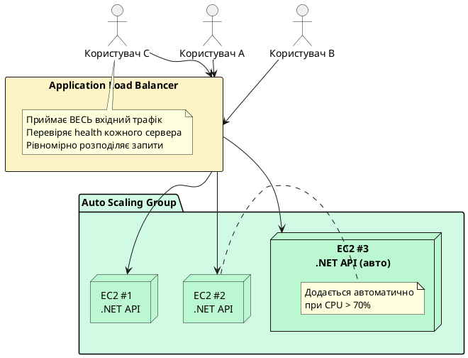
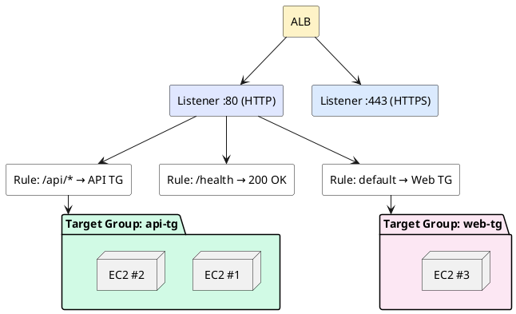

# Elastic Load Balancing та Auto Scaling

## Проблема одного сервера

Уявіть, що ваш .NET API розміщений на одному EC2 instance. Все добре, поки навантаження невелике. Але що відбудеться якщо:

- **Пік навантаження:** вийшла новина про ваш сервіс, і одночасно прийшли тисячі користувачів. Один сервер не справляється, час відповіді зростає до 10–30 секунд, потім сервер «падає».
- **Збій сервера:** жорсткий диск вийшов з ладу, або операційна система зависла. Сервіс недоступний до ручного втручання DevOps-інженера — може тривати годинами.
- **Деплой нової версії:** щоб оновити застосунок — потрібно зупинити сервер. Є downtime.

Всі ці проблеми вирішуються двома механізмами: **Load Balancer** (розподіляє навантаження між серверами) та **Auto Scaling** (автоматично додає/видаляє сервери залежно від навантаження).

::plant-uml



::

---

## Application Load Balancer (ALB) — Layer 7

**Application Load Balancer (ALB)** — це «розумний» балансувальник навантаження, який працює на **рівні 7 моделі OSI** — рівні додатків. Це означає, що ALB «розуміє» HTTP/HTTPS запити: бачить URL, заголовки, cookies, метод запиту.

**Навіщо це потрібно?** ALB може приймати рішення про маршрутизацію не просто «передати будь-якому серверу», а на основі змісту запиту:
- `GET /api/users` → направити на `UserService`
- `GET /api/orders` → направити на `OrderService`
- `GET /health` → не рахувати у навантаженні
- Запити з cookie `user_tier=premium` → направити на потужніший сервер

### Компоненти ALB

**Listener** — «вухо» ALB. Слухає трафік на певному порті та протоколі. Типово: Listener на порті 80 (HTTP) та Listener на порті 443 (HTTPS).

**Listener Rules** — правила, які визначають що робити з запитом. Кожне правило має умову та дію:
- Умова: URL path (`/api/*`), hostname (`api.example.com`), HTTP метод, заголовок
- Дія: Forward (переслати в Target Group), Redirect (перенаправити), Fixed Response (повернути статичну відповідь)

**Target Group** — група серверів (targets), між якими ALB балансує трафік. Target може бути: EC2 instance, IP-адреса (для ECS Fargate, on-premises серверів), Lambda function.

**Health Check** — ALB регулярно надсилає запити на кожен target і перевіряє відповідь. Якщо target не відповідає або повертає помилку — ALB тимчасово виключає його з ротації.

::plant-uml



::

---

## Network Load Balancer (NLB) — Layer 4

**Network Load Balancer (NLB)** — балансувальник на **рівні 4 OSI** (транспортний рівень). Він не розуміє HTTP — лише TCP/UDP пакети. Зате він **надзвичайно швидкий**: може обробляти мільйони запитів на секунду з latency в мікросекунди.

**Коли обирати NLB замість ALB:**

::card-group

::card{title="Обирайте ALB" icon="i-heroicons-globe-alt"}

- HTTP/HTTPS API
- Мікросервіси
- Маршрутизація по URL/header
- WebSocket з'єднання
- gRPC

::

::card{title="Обирайте NLB" icon="i-heroicons-bolt"}

- Ультра-низька latency (< 1ms)
- TCP/UDP протоколи (не HTTP)
- Потрібна стала IP-адреса балансувальника
- Gaming, IoT, фінансові системи

::

::

**Для більшості .NET Web API — ALB є правильним вибором.**

---

## Gateway Load Balancer (GWLB)

**Gateway Load Balancer** — спеціалізований балансувальник для мережевих апаратних та програмних засобів безпеки (firewall, IDS/IPS, deep packet inspection). Використовується для побудови прозорих security layers. Для .NET розробників — рідкісний сценарій, але важливо знати про існування.

---

## Target Groups та Health Checks

**Target Group** — це центральна сутність між ALB та вашими серверами. Розберемо детально.

### Типи targets

- **Instance:** EC2 instance ID. ALB знає IP instance і надсилає трафік напряму.
- **IP:** довільна IP-адреса (ECS Fargate задачі, on-premises сервери через VPN, Lambda ENI).
- **Lambda:** AWS Lambda function — ALB може викликати Lambda напряму для serverless API.

### Алгоритми балансування

**Round Robin** (за замовчуванням для ALB): запити розподіляються по черзі між targets — перший до EC2 #1, другий до EC2 #2, третій до EC2 #1 і так далі. Простий і ефективний.

**Least Outstanding Requests:** запит направляється до target з найменшою кількістю активних з'єднань. Корисно якщо деякі запити суттєво важчі за інші.

**Weighted Random:** кожному target присвоюється вага. Наприклад, потужніший сервер отримує 70% трафіку, менш потужний — 30%.

### Налаштування Health Check

```json
{
    "Protocol": "HTTP",
    "Path": "/health",
    "Port": "8080",
    "HealthyThresholdCount": 2,
    "UnhealthyThresholdCount": 3,
    "HealthCheckIntervalSeconds": 30,
    "HealthCheckTimeoutSeconds": 5
}
```

**Пояснення параметрів:**

- `HealthyThresholdCount: 2` — target вважається здоровим після **2 успішних** перевірок підряд
- `UnhealthyThresholdCount: 3` — target вважається нездоровим після **3 невдалих** перевірок
- `HealthCheckIntervalSeconds: 30` — перевіряти кожні 30 секунд
- `HealthCheckTimeoutSeconds: 5` — якщо відповідь не прийшла за 5 секунд — невдача

При `UnhealthyThresholdCount: 3` та `interval: 30s` — від першої невдалої відповіді до виключення з ротації мине 90 секунд. Це час, протягом якого ALB може направляти трафік на нездоровий сервер. **Скорочуйте interval до 15s для критичних сервісів.**

---

## Health Check у .NET — правильна реалізація

.NET має вбудовану систему Health Checks. Правильна реалізація критично важлива для коректної роботи з ALB.

```csharp
// Program.cs
var builder = WebApplication.CreateBuilder(args);

// Реєстрація Health Check сервісів
builder.Services.AddHealthChecks()
    // Перевірка підключення до SQL Server
    .AddSqlServer(
        connectionString: builder.Configuration.GetConnectionString("DefaultConnection")!,
        name: "database",
        tags: ["db", "sql"])
    // Перевірка Redis (якщо використовується)
    // .AddRedis(builder.Configuration["Redis:ConnectionString"]!, name: "redis")
    // Кастомна перевірка
    .AddCheck("self", () => HealthCheckResult.Healthy("Application is running"));

var app = builder.Build();

// Простий /health endpoint для ALB — повертає 200 лише якщо ВСЕ здорово
app.MapHealthChecks("/health", new HealthCheckOptions
{
    // Повертати лише статус (Healthy/Unhealthy) без деталей — ALB не потребує деталей
    ResponseWriter = async (context, report) =>
    {
        context.Response.ContentType = "application/json";
        var result = System.Text.Json.JsonSerializer.Serialize(new
        {
            status = report.Status.ToString(),
            timestamp = DateTime.UtcNow
        });
        await context.Response.WriteAsync(result);
    }
});

// Детальний /health/detail для внутрішнього моніторингу (не відкривайте публічно!)
app.MapHealthChecks("/health/detail", new HealthCheckOptions
{
    ResponseWriter = UIResponseWriter.WriteHealthCheckUIResponse
});

app.Run();
```

::caution
**ALB Health Check та реальна здоров'я сервісу.** Багато розробників роблять `/health` endpoint який завжди повертає 200. Це хибна безпека: ALB думає, що сервер здоровий, але він може не мати з'єднання з БД. Перевіряйте реальні залежності в health check!
::


---

## Auto Scaling Groups (ASG)

**Auto Scaling Group (ASG)** — це механізм, який автоматично запускає або зупиняє EC2 instances у відповідь на зміну навантаження. ASG гарантує, що завжди запущено певну кількість здорових instances — не більше та не менше, ніж потрібно.

### Ключові параметри ASG

**Minimum capacity (мінімум):** найменша кількість instances, яка завжди буде запущена. Навіть якщо навантаження нульове — ASG ніколи не зменшить кількість нижче мінімуму. Наприклад, `min: 2` — для High Availability (якщо один впаде, другий продовжує працювати).

**Maximum capacity (максимум):** найбільша кількість instances, до якої ASG може масштабуватись. Захищає від неконтрольованих витрат: навіть якщо навантаження величезне — більше `max: 10` instances не буде.

**Desired capacity (бажана кількість):** скільки instances ASG намагається підтримувати прямо зараз. Scaling Policies змінюють desired capacity, а ASG приводить реальну кількість instances до цього значення.

### Launch Templates — шаблон нового сервера

**Launch Template** — це документ, що описує конфігурацію EC2 instance: AMI, Instance Type, Key Pair, Security Group, User Data тощо. Коли ASG потребує новий instance — він створює його точно за Launch Template.

::tip
Це одна з ключових переваг ASG: новий instance запускається автоматично, без ручного втручання, точно з тією ж конфігурацією що і попередні. Тому Custom AMI (з встановленим .NET) + Launch Template = швидкий автоматичний масштаб.
::

**Launch Templates** (сучасний підхід) vs **Launch Configurations** (застарілий): Launch Templates підтримують версіонування (можна мати v1, v2, v3), підтримують Spot Instances + On-Demand в одному ASG, та підтримують всі нові можливості EC2. **Завжди використовуйте Launch Templates.**

---

## Scaling Policies — стратегії масштабування

### Target Tracking Scaling

Найпростіший та найрекомендованіший підхід. Ви задаєте цільове значення метрики, і ASG автоматично додає/видаляє instances для підтримки цього значення.

```json
{
    "TargetTrackingConfiguration": {
        "PredefinedMetricSpecification": {
            "PredefinedMetricType": "ASGAverageCPUUtilization"
        },
        "TargetValue": 70.0,
        "ScaleOutCooldown": 60,
        "ScaleInCooldown": 300
    }
}
```

Ця конфігурація означає: «Підтримуй середнє CPU-завантаження по всіх instances на рівні 70%. Якщо CPU зростає вище — додай instances (з паузою 60 сек між додаваннями). Якщо CPU падає нижче — видали зайві (з паузою 300 сек)».

**Доступні метрики для Target Tracking:**
- `ASGAverageCPUUtilization` — середнє CPU по ASG
- `ASGAverageNetworkIn` / `ASGAverageNetworkOut` — мережевий трафік
- `ALBRequestCountPerTarget` — кількість запитів на instance через ALB

### Step Scaling

Дозволяє задати різні кроки масштабування залежно від відхилення від норми:

```json
{
    "PolicyType": "StepScaling",
    "StepAdjustments": [
        {"MetricIntervalLowerBound": 0, "MetricIntervalUpperBound": 10, "ScalingAdjustment": 1},
        {"MetricIntervalLowerBound": 10, "MetricIntervalUpperBound": 20, "ScalingAdjustment": 2},
        {"MetricIntervalLowerBound": 20, "ScalingAdjustment": 4}
    ]
}
```

Читається так: CPU перевищив поріг на 0–10% → додати 1 instance; на 10–20% → додати 2; більш ніж на 20% → додати 4 одразу.

### Scheduled Scaling

Масштабування за розкладом — якщо навантаження передбачуване:

```bash
# Кожен робочий день о 08:00 UTC — мінімум 5 instances
aws autoscaling put-scheduled-update-group-action \
    --auto-scaling-group-name my-asg \
    --scheduled-action-name "scale-up-morning" \
    --recurrence "0 8 * * MON-FRI" \
    --min-size 5 --desired-capacity 5 \
    --region eu-central-1

# О 20:00 UTC — повернутись до мінімуму
aws autoscaling put-scheduled-update-group-action \
    --auto-scaling-group-name my-asg \
    --scheduled-action-name "scale-down-evening" \
    --recurrence "0 20 * * MON-FRI" \
    --min-size 2 --desired-capacity 2 \
    --region eu-central-1
```

---

## ALB Listener Rules та Path-based Routing

**Path-based routing** дозволяє направляти різні URL-шляхи на різні Target Groups. Ідеально для мікросервісної архітектури де різні сервіси за різними `/api/...` шляхами:

```
ALB (api.example.com)
├── /api/users/*  → UserService Target Group  (EC2 з UserService .NET API)
├── /api/orders/* → OrderService Target Group (EC2 з OrderService .NET API)
├── /health       → Fixed Response 200 OK     (без сервера!)
└── /*            → WebApp Target Group        (фронтенд)
```

**Host-based routing** — маршрутизація за доменним ім'ям:

```
ALB
├── api.example.com    → API Target Group
└── admin.example.com  → Admin Target Group
```

---

## Sticky Sessions — для ASP.NET сесій

**Sticky Sessions (Session Affinity)** — механізм, який гарантує, що всі запити від одного користувача потрапляють на **один і той самий** EC2 instance. ALB встановлює спеціальний cookie (`AWSALB`), і у наступних запитах направляє користувача до того ж instance.

**Навіщо потрібно:** якщо ваш ASP.NET додаток зберігає сесію **в пам'яті сервера** (`AddSession()` без розподіленого сховища) — без sticky sessions користувач після кожного запиту може потрапити на інший сервер і «втратити» сесію.

**Правильне довгострокове рішення:** замість sticky sessions перейдіть на **розподілений кеш** (Redis, DynamoDB) для зберігання сесій. Тоді будь-який instance може обробити запит будь-якого користувача.

```csharp
// Program.cs — сесії через Redis (правильний підхід для ASG)
builder.Services.AddStackExchangeRedisCache(options =>
{
    options.Configuration = builder.Configuration["Redis:ConnectionString"];
    options.InstanceName = "MyApp:";
});

builder.Services.AddSession(options =>
{
    options.IdleTimeout = TimeSpan.FromMinutes(30);
    options.Cookie.HttpOnly = true;
    options.Cookie.IsEssential = true;
});
```

**Якщо Redis поки недоступний — тимчасово увімкніть Sticky Sessions у Target Group:**

::tabs

::tabs-item{label="AWS Console"}

Target Groups → вибрати TG → **Attributes** → Edit → **Stickiness** → Enable → Duration: 1 day → Save

::

::tabs-item{label="AWS CLI"}

```bash
aws elbv2 modify-target-group-attributes \
    --target-group-arn arn:aws:elasticloadbalancing:eu-central-1:123456789012:targetgroup/my-api-tg/xxx \
    --attributes Key=stickiness.enabled,Value=true \
               Key=stickiness.type,Value=lb_cookie \
               Key=stickiness.lb_cookie.duration_seconds,Value=86400 \
    --region eu-central-1
```

::

::

::note
Sticky sessions знижують ефективність балансування: якщо один instance отримав «важких» користувачів — він перевантажений, хоча інші instances вільні. Це технічний борг — вирішуйте його через distributed caching.
::


---

## Практичний приклад: ALB + ASG + HTTPS від А до Я

У цьому прикладі ми побудуємо повноцінну production-готову інфраструктуру: ALB з HTTPS, два EC2 instances з .NET API, Auto Scaling Group та Health Checks.

### Крок 1: Підготовка — Custom AMI з .NET 8

Перед початком нам потрібен AMI з вже встановленим .NET 8 та нашим додатком. Якщо ви пройшли Модуль 4, у вас вже є налаштований instance. Якщо ні — запустіть нову Ubuntu instance та виконайте:

```bash
# На Ubuntu EC2 instance (підключіться через SSH як у Модулі 4)

# Встановіть .NET 8
sudo apt-get update -y
wget https://packages.microsoft.com/config/ubuntu/24.04/packages-microsoft-prod.deb -O /tmp/ms.deb
sudo dpkg -i /tmp/ms.deb && rm /tmp/ms.deb
sudo apt-get update -y
sudo apt-get install -y dotnet-sdk-8.0

# Перевірте
dotnet --version  # має вивести 8.0.x
```

Опублікуйте ваш .NET API та скопіюйте на instance (як у Модулі 4, Кроки 4-5).

Налаштуйте systemd сервіс (Крок 7 Модулю 4) і переконайтесь, що API запускається при старті.

Тепер створіть AMI з цього налаштованого instance:

::tabs

::tabs-item{label="AWS Console"}

1. EC2 → **Instances** → оберіть ваш налаштований instance
2. **Actions** → **Image and templates** → **Create image**
3. Image name: `dotnet-api-ready-v1`
4. **Create image** → зачекайте 5–10 хвилин поки AMI стане `available`
5. Запишіть AMI ID: EC2 → **AMIs** → скопіюйте ID (вигляд: `ami-0a1b2c3d4e5f67890`)

::

::tabs-item{label="AWS CLI"}

```bash
# ЗАМІНІТЬ на ваш Instance ID
INSTANCE_ID="i-1234567890abcdef0"

CUSTOM_AMI=$(aws ec2 create-image \
    --instance-id $INSTANCE_ID \
    --name "dotnet-api-ready-v1" \
    --description ".NET 8 API ready for ASG" \
    --region eu-central-1 \
    --query ImageId --output text)

echo "Custom AMI ID: $CUSTOM_AMI"
# Чекаємо поки AMI буде готовий
aws ec2 wait image-available --image-ids $CUSTOM_AMI --region eu-central-1
echo "AMI ready!"
```

::

::

---

### Крок 2: Отримання SSL-сертифіката через ACM

**ACM (AWS Certificate Manager)** — безкоштовний сервіс для отримання та управління SSL/TLS сертифікатами. Сертифікати від ACM можна використовувати лише з AWS сервісами (ALB, CloudFront).

::note
Для отримання сертифіката потрібен власний домен (наприклад, купити на Route 53 або у будь-якого реєстратора). Якщо домену немає — пропустіть цей крок і використовуйте HTTP у лабораторній роботі. ACM сертифікат безкоштовний, але домен платний (~$12/рік для `.com`).
::

::tabs

::tabs-item{label="AWS Console"}

1. Відкрийте **ACM (Certificate Manager)** у AWS Console
2. Переконайтесь що регіон — той самий де буде ALB (EU Central 1)
3. **Request a certificate** → **Request a public certificate** → **Next**
4. **Fully qualified domain name:** введіть ваш домен, наприклад `api.yoursite.com`
5. Додайте і wildcard: `*.yoursite.com` (щоб один сертифікат покривав всі субдомени)
6. **Validation method:** DNS validation (рекомендовано) → **Request**
7. ACM покаже CNAME запис для підтвердження власності домену
8. Додайте цей CNAME у ваш DNS (у Route 53 або у реєстратора доменного імені)
9. Зачекайте 5–30 хвилин — статус зміниться на `Issued`
10. Запишіть ARN сертифіката: він знадобиться при налаштуванні HTTPS Listener

::

::tabs-item{label="AWS CLI"}

```bash
# ЗАМІНІТЬ yoursite.com на ваш реальний домен
CERT_ARN=$(aws acm request-certificate \
    --domain-name "api.yoursite.com" \
    --subject-alternative-names "*.yoursite.com" \
    --validation-method DNS \
    --region eu-central-1 \
    --query CertificateArn --output text)

echo "Certificate ARN: $CERT_ARN"

# Отримати CNAME запис для DNS валідації
aws acm describe-certificate \
    --certificate-arn $CERT_ARN \
    --region eu-central-1 \
    --query "Certificate.DomainValidationOptions[0].ResourceRecord"
# Виведе: {"Name": "_abc123.yoursite.com", "Type": "CNAME", "Value": "_def456.acm-validations.aws."}
# Додайте цей CNAME у ваш DNS провайдер
```

::

::

---

### Крок 3: Створення Security Groups

Нам потрібно два Security Groups з чіткими правилами:
- **ALB Security Group:** приймає HTTP (80) та HTTPS (443) від всього світу
- **EC2 Security Group:** приймає трафік ЛИШЕ від ALB, та SSH з вашого IP

::tabs

::tabs-item{label="AWS Console"}

**Security Group для ALB:**
1. VPC → **Security groups** → **Create security group**
2. Name: `alb-sg`, VPC: default
3. Inbound rules:
   - HTTP (80) → Anywhere IPv4 (`0.0.0.0/0`)
   - HTTPS (443) → Anywhere IPv4 (`0.0.0.0/0`)
4. Create

**Security Group для EC2 instances:**
1. Create security group → Name: `ec2-asg-sg`
2. Inbound rules:
   - Custom TCP, Port 5000, Source: **`alb-sg`** *(не IP, а ID попереднього SG!)*
   - SSH (22) → My IP
3. Create

::

::tabs-item{label="AWS CLI"}

```bash
REGION="eu-central-1"
VPC_ID=$(aws ec2 describe-vpcs \
    --filters "Name=isDefault,Values=true" \
    --query "Vpcs[0].VpcId" --output text --region $REGION)

# Security Group для ALB
ALB_SG=$(aws ec2 create-security-group \
    --group-name alb-sg \
    --description "ALB Security Group" \
    --vpc-id $VPC_ID --region $REGION \
    --query GroupId --output text)

aws ec2 authorize-security-group-ingress \
    --group-id $ALB_SG --protocol tcp --port 80 --cidr 0.0.0.0/0 --region $REGION
aws ec2 authorize-security-group-ingress \
    --group-id $ALB_SG --protocol tcp --port 443 --cidr 0.0.0.0/0 --region $REGION

# Security Group для EC2 — лише від ALB SG
EC2_SG=$(aws ec2 create-security-group \
    --group-name ec2-asg-sg \
    --description "EC2 ASG instances SG" \
    --vpc-id $VPC_ID --region $REGION \
    --query GroupId --output text)

# Трафік лише з ALB SG (не з усього інтернету!)
aws ec2 authorize-security-group-ingress \
    --group-id $EC2_SG --protocol tcp --port 5000 \
    --source-group $ALB_SG --region $REGION

MY_IP=$(curl -s https://checkip.amazonaws.com)
aws ec2 authorize-security-group-ingress \
    --group-id $EC2_SG --protocol tcp --port 22 \
    --cidr "${MY_IP}/32" --region $REGION

echo "ALB SG: $ALB_SG"
echo "EC2 SG: $EC2_SG"
```

::

::

---

### Крок 4: Створення Target Group

::tabs

::tabs-item{label="AWS Console"}

1. EC2 → **Target Groups** → **Create target group**
2. **Target type:** Instances
3. **Target group name:** `dotnet-api-tg`
4. **Protocol:** HTTP, **Port:** 5000
5. **VPC:** default
6. **Health checks:**
   - Protocol: HTTP
   - Path: `/health`
   - Port: Traffic port (5000)
   - Healthy threshold: **2**
   - Unhealthy threshold: **3**
   - Timeout: **5** seconds
   - Interval: **15** seconds
   - Success codes: **200**
7. **Create target group**
8. Запишіть ARN: виглядає як `arn:aws:elasticloadbalancing:eu-central-1:123456789012:targetgroup/dotnet-api-tg/abc123`

::

::tabs-item{label="AWS CLI"}

```bash
TG_ARN=$(aws elbv2 create-target-group \
    --name dotnet-api-tg \
    --protocol HTTP \
    --port 5000 \
    --vpc-id $VPC_ID \
    --target-type instance \
    --health-check-protocol HTTP \
    --health-check-path /health \
    --health-check-interval-seconds 15 \
    --health-check-timeout-seconds 5 \
    --healthy-threshold-count 2 \
    --unhealthy-threshold-count 3 \
    --matcher HttpCode=200 \
    --region eu-central-1 \
    --query "TargetGroups[0].TargetGroupArn" --output text)

echo "Target Group ARN: $TG_ARN"
```

::

::


---

### Крок 5: Створення Application Load Balancer

::tabs

::tabs-item{label="AWS Console"}

1. EC2 → **Load Balancers** → **Create load balancer**
2. Оберіть **Application Load Balancer** → **Create**
3. **Basic configuration:**
   - Load balancer name: `dotnet-api-alb`
   - Scheme: **Internet-facing** (приймає трафік з інтернету)
   - IP address type: IPv4
4. **Network mapping:**
   - VPC: default
   - Mappings: ✅ оберіть **мінімум 2 Availability Zones** (наприклад eu-central-1a та eu-central-1b)
   - Це обов'язково! ALB вимагає мінімум 2 AZ для High Availability
5. **Security groups:** оберіть `alb-sg`
6. **Listeners and routing:**
   - Listener HTTP:80 → Forward to: `dotnet-api-tg`
   - **Add listener** → HTTPS:443 → Forward to: `dotnet-api-tg`
     → Default SSL/TLS certificate: оберіть ваш ACM сертифікат
7. **Create load balancer**
8. Зачекайте 2–3 хвилини поки стан стане `active`
9. Запишіть **DNS name** ALB: виглядає як `dotnet-api-alb-123456789.eu-central-1.elb.amazonaws.com`

::

::tabs-item{label="AWS CLI"}

```bash
REGION="eu-central-1"

# Знайдіть підмережі у різних AZ
SUBNETS=$(aws ec2 describe-subnets \
    --filters "Name=defaultForAz,Values=true" \
    --query "Subnets[*].SubnetId" \
    --output text --region $REGION)
echo "Subnets: $SUBNETS"
# Виведе: subnet-xxx subnet-yyy subnet-zzz  ← беремо мінімум 2

SUBNET_1=$(echo $SUBNETS | cut -d' ' -f1)
SUBNET_2=$(echo $SUBNETS | cut -d' ' -f2)

# Створіть ALB
ALB_ARN=$(aws elbv2 create-load-balancer \
    --name dotnet-api-alb \
    --subnets $SUBNET_1 $SUBNET_2 \
    --security-groups $ALB_SG \
    --scheme internet-facing \
    --type application \
    --region $REGION \
    --query "LoadBalancers[0].LoadBalancerArn" --output text)

echo "ALB ARN: $ALB_ARN"

# Отримайте DNS name ALB
ALB_DNS=$(aws elbv2 describe-load-balancers \
    --load-balancer-arns $ALB_ARN \
    --query "LoadBalancers[0].DNSName" \
    --output text --region $REGION)
echo "ALB DNS: $ALB_DNS"

# Додайте HTTP Listener
aws elbv2 create-listener \
    --load-balancer-arn $ALB_ARN \
    --protocol HTTP --port 80 \
    --default-actions Type=forward,TargetGroupArn=$TG_ARN \
    --region $REGION

# Додайте HTTPS Listener (якщо є ACM сертифікат)
# ЗАМІНІТЬ $CERT_ARN на ваш реальний ARN сертифіката
# aws elbv2 create-listener \
#     --load-balancer-arn $ALB_ARN \
#     --protocol HTTPS --port 443 \
#     --certificates CertificateArn=$CERT_ARN \
#     --default-actions Type=forward,TargetGroupArn=$TG_ARN \
#     --region $REGION
```

::

::

---

### Крок 6: HTTP→HTTPS Redirect (важливий крок для production)

Якщо у вас є HTTPS Listener — додайте редирект: усі HTTP запити автоматично перенаправляються на HTTPS. Без цього користувачі можуть використовувати HTTP навіть якщо HTTPS доступний.

::tabs

::tabs-item{label="AWS Console"}

1. EC2 → Load Balancers → `dotnet-api-alb` → вкладка **Listeners**
2. Оберіть **HTTP:80** → **Edit listener**
3. **Default actions:** видаліть Forward → додайте **Redirect**
   - Protocol: HTTPS, Port: 443, Status code: 301 (Moved Permanently)
4. **Save changes**

::

::tabs-item{label="AWS CLI"}

```bash
# Знайдіть ARN HTTP Listener
HTTP_LISTENER_ARN=$(aws elbv2 describe-listeners \
    --load-balancer-arn $ALB_ARN \
    --query "Listeners[?Port==\`80\`].ListenerArn" \
    --output text --region $REGION)

# Змініть дію HTTP Listener на redirect до HTTPS
aws elbv2 modify-listener \
    --listener-arn $HTTP_LISTENER_ARN \
    --default-actions Type=redirect,RedirectConfig="{Protocol=HTTPS,Port=443,StatusCode=HTTP_301}" \
    --region $REGION
```

::

::

---

### Крок 7: Launch Template для ASG

**Launch Template** описує конфігурацію EC2 instance, який ASG буде запускати автоматично. User Data скрипт у Launch Template запустить наш .NET API при старті нового instance.

::tabs

::tabs-item{label="AWS Console"}

1. EC2 → **Launch Templates** → **Create launch template**
2. **Launch template name:** `dotnet-api-lt`
3. **Template version description:** `v1 - .NET 8 API`
4. **AMI:** My AMIs → оберіть `dotnet-api-ready-v1`
5. **Instance type:** `t3.micro` (або `t3.medium`)
6. **Key pair:** `ec2-lab-key`
7. **Security groups:** `ec2-asg-sg`
8. **Advanced details → User data:**
   Вставте наступний скрипт (він запуститься при кожному новому instance):
   ```bash
   #!/bin/bash
   # Запустити systemd сервіс (вже налаштований у AMI)
   systemctl start ec2lab-api
   systemctl enable ec2lab-api
   ```
9. **Create launch template**

::

::tabs-item{label="AWS CLI"}

```bash
# ЗАМІНІТЬ ami-xxx на ваш реальний Custom AMI ID
CUSTOM_AMI="ami-0a1b2c3d4e5f67890"

# User Data скрипт (повинен бути закодований у base64)
USER_DATA=$(cat << 'EOF' | base64
#!/bin/bash
systemctl start ec2lab-api
systemctl enable ec2lab-api
EOF
)

LT_ID=$(aws ec2 create-launch-template \
    --launch-template-name dotnet-api-lt \
    --version-description "v1 .NET 8 API" \
    --launch-template-data "{
        \"ImageId\": \"$CUSTOM_AMI\",
        \"InstanceType\": \"t3.micro\",
        \"KeyName\": \"ec2-lab-key\",
        \"SecurityGroupIds\": [\"$EC2_SG\"],
        \"UserData\": \"$USER_DATA\"
    }" \
    --region $REGION \
    --query "LaunchTemplate.LaunchTemplateId" --output text)

echo "Launch Template ID: $LT_ID"
```

::

::

---

### Крок 8: Створення Auto Scaling Group

::tabs

::tabs-item{label="AWS Console"}

1. EC2 → **Auto Scaling Groups** → **Create Auto Scaling group**
2. **Name:** `dotnet-api-asg`
3. **Launch template:** оберіть `dotnet-api-lt` → **Next**
4. **Network:**
   - VPC: default
   - Availability Zones: оберіть ті ж 2 AZ що і для ALB
   - **Next**
5. **Load balancing:**
   - ✅ **Attach to an existing load balancer**
   - Choose from your load balancer target groups: `dotnet-api-tg`
   - ✅ **Turn on Elastic Load Balancing health checks** (важливо!)
   - **Health check grace period:** 120 seconds (час на запуск instance до першої перевірки)
   - **Next**
6. **Group size:**
   - Desired: **2** (завжди 2 instances прямо зараз)
   - Minimum: **2**
   - Maximum: **5**
7. **Scaling policies:**
   - ✅ **Target tracking scaling policy**
   - Metric: **Average CPU utilization**
   - Target value: **70**
   - **Next → Next → Create Auto Scaling group**

::

::tabs-item{label="AWS CLI"}

```bash
aws autoscaling create-auto-scaling-group \
    --auto-scaling-group-name dotnet-api-asg \
    --launch-template "LaunchTemplateId=$LT_ID,Version=1" \
    --min-size 2 \
    --max-size 5 \
    --desired-capacity 2 \
    --vpc-zone-identifier "$SUBNET_1,$SUBNET_2" \
    --target-group-arns $TG_ARN \
    --health-check-type ELB \
    --health-check-grace-period 120 \
    --region $REGION

# Додати Target Tracking Scaling Policy
aws autoscaling put-scaling-policy \
    --auto-scaling-group-name dotnet-api-asg \
    --policy-name cpu-target-tracking \
    --policy-type TargetTrackingScaling \
    --target-tracking-configuration '{
        "PredefinedMetricSpecification": {
            "PredefinedMetricType": "ASGAverageCPUUtilization"
        },
        "TargetValue": 70.0,
        "ScaleOutCooldown": 60,
        "ScaleInCooldown": 300
    }' \
    --region $REGION
```

::

::

---

### Крок 9: Перевірка роботи

Зачекайте ~3 хвилини поки ASG запустить instances та ALB перевірить їхню здоров'я.

::terminal-preview{title="Перевірка через ALB DNS"}

<div class="line"><span class="opacity-40">$</span> <strong>curl http://dotnet-api-alb-123456789.eu-central-1.elb.amazonaws.com/</strong></div>
<div class="line">{"message":"Hello from EC2!","server":"ip-172-31-10-25","dotnetVersion":"8.0.0",...}</div>
<div class="line"></div>
<div class="line"><span class="opacity-40">$</span> <strong>curl http://dotnet-api-alb-123456789.eu-central-1.elb.amazonaws.com/</strong></div>
<div class="line">{"message":"Hello from EC2!","server":"ip-172-31-22-43","dotnetVersion":"8.0.0",...}</div>

::

Зверніть увагу: **server** відрізняється між запитами — ALB направляє на різні instances (Round Robin)!

Перевірте Target Group Health:

::tabs

::tabs-item{label="AWS Console"}

EC2 → **Target Groups** → `dotnet-api-tg` → вкладка **Targets**. Обидва instances мають бути у стані `healthy` (зелений).

::

::tabs-item{label="AWS CLI"}

```bash
aws elbv2 describe-target-health \
    --target-group-arn $TG_ARN \
    --region eu-central-1 \
    --query "TargetHealthDescriptions[*].{ID:Target.Id,Port:Target.Port,Health:TargetHealth.State}" \
    --output table
```

::terminal-preview{title="Target Health перевірка"}

<div class="line">---------------------------------------------</div>
<div class="line">|        DescribeTargetHealth               |</div>
<div class="line">+-------------------+------+---------------+</div>
<div class="line">| ID                | Port | Health        |</div>
<div class="line">+-------------------+------+---------------+</div>
<div class="line">| i-0a1b2c3d4e5f678 | 5000 | <span class="text-green-400">healthy</span>       |</div>
<div class="line">| i-0b2c3d4e5f6789a | 5000 | <span class="text-green-400">healthy</span>       |</div>
<div class="line">+-------------------+------+---------------+</div>

::

::

::

---

### Крок 10: Тестування автоматичного масштабування

Симулюємо навантаження на один із instances щоб побачити Scale Out:

```bash
# Підключіться до одного з EC2 через SSH
# (знайдіть IP через EC2 → Instances → оберіть instance з ASG)
ssh -i ~/.ssh/ec2-lab-key.pem ubuntu@INSTANCE_IP

# Встановіть stress (інструмент навантаження)
# apt-get — менеджер пакетів Ubuntu
sudo apt-get install -y stress

# Запустіть штучне навантаження на CPU на 5 хвилин
# --cpu 2 означає навантажити 2 ядра CPU
# --timeout 300 — зупинитись через 300 секунд (5 хвилин)
stress --cpu 2 --timeout 300 &
```

Паралельно спостерігайте за ASG:

::tabs

::tabs-item{label="AWS Console"}

EC2 → **Auto Scaling Groups** → `dotnet-api-asg` → вкладка **Activity** → спостерігайте за подіями.

Через 1–3 хвилини після зростання CPU з'явиться подія `Launching a new EC2 instance`. Через деякий час після зупинки stress — `Terminating EC2 instance` (Scale In відбудеться через 5+ хвилин через ScaleInCooldown).

::

::tabs-item{label="AWS CLI"}

```bash
# Моніторинг поточної кількості instances (оновлюйте кожні 30 сек)
watch -n 30 'aws autoscaling describe-auto-scaling-groups \
    --auto-scaling-group-names dotnet-api-asg \
    --query "AutoScalingGroups[0].{Min:MinSize,Desired:DesiredCapacity,Max:MaxSize,Running:Instances[?LifecycleState==\`InService\`]|length(@)}" \
    --output table --region eu-central-1'
```

::

::

---

### Крок 11: ОБОВ'ЯЗКОВО — Очищення ресурсів

::caution
ALB з двома EC2 instances коштує приблизно $0.04/год (ALB) + $0.023/год × 2 (EC2 t3.micro) = ~$0.086/год = ~$62/місяць. Видаліть всі ресурси!
::

Порядок видалення важливий — ресурси мають залежності:

::tabs

::tabs-item{label="AWS Console"}

1. **EC2 → Auto Scaling Groups** → `dotnet-api-asg` → **Delete** → підтвердіть
   *(ASG сам зупинить та видалить EC2 instances)*
2. Зачекайте ~2 хв поки instances terminated
3. **EC2 → Load Balancers** → `dotnet-api-alb` → **Actions** → **Delete**
4. **EC2 → Target Groups** → `dotnet-api-tg` → **Actions** → **Delete**
5. **EC2 → Launch Templates** → `dotnet-api-lt` → **Actions** → **Delete template**
6. **EC2 → AMIs** → `dotnet-api-ready-v1` → **Actions** → **Deregister AMI**
7. **EC2 → Snapshots** → видаліть snapshot від вашого AMI
8. **VPC → Security Groups** → видаліть `alb-sg` та `ec2-asg-sg`

::

::tabs-item{label="AWS CLI"}

```bash
REGION="eu-central-1"

# 1. Видалити ASG (сам зупинить instances)
aws autoscaling delete-auto-scaling-group \
    --auto-scaling-group-name dotnet-api-asg \
    --force-delete --region $REGION

# 2. Зачекати поки instances terminated (~2 хв)
sleep 120

# 3. Видалити ALB
aws elbv2 delete-load-balancer \
    --load-balancer-arn $ALB_ARN --region $REGION

# 4. Видалити Target Group
aws elbv2 delete-target-group \
    --target-group-arn $TG_ARN --region $REGION

# 5. Видалити Launch Template
aws ec2 delete-launch-template \
    --launch-template-id $LT_ID --region $REGION

# 6. Security Groups
aws ec2 delete-security-group --group-id $EC2_SG --region $REGION
aws ec2 delete-security-group --group-id $ALB_SG --region $REGION
```

::

::

---

## Резюме

- **ALB** — Layer 7 балансувальник. «Розуміє» HTTP: маршрутизує за URL, заголовками, hostname. SSL termination.
- **NLB** — Layer 4, ultra-low latency для TCP/UDP. Для більшості .NET Web API — ALB достатньо.
- **Target Group** — група серверів з Health Check. ALB виключає нездорові targets автоматично.
- **Health Check у .NET:** `AddHealthChecks()` перевіряє реальні залежності (БД, Redis). `/health` endpoint — 200 лише якщо все здорово.
- **Auto Scaling Group:** min/desired/max instances, Launch Template. Автоматичний запуск нових instances.
- **Target Tracking Scaling:** «підтримуй CPU 70%» — найпростіший підхід для початку.
- **Launch Template** (не Launch Configuration): підтримує версіонування, Spot + On-Demand.
- **Sticky Sessions:** тимчасове рішення для ASP.NET сесій. Довгострокове — розподілений кеш (Redis).
- **ACM:** безкоштовні SSL-сертифікати для AWS сервісів. DNS validation. HTTPS через ALB.
- **HTTP→HTTPS redirect:** завжди налаштовуйте для production.

---

## Практичні завдання

### Рівень 1 (Базовий)

**Завдання 1.** Поясніть різницю між ALB та NLB. Що означає «Layer 7» та «Layer 4»? Наведіть приклад сценарію де кожен підходить.

**Завдання 2.** Що буде якщо `/health` endpoint завжди повертає 200, але застосунок не може підключитись до БД? Як правильно реалізувати Health Check?

### Рівень 2 (Практичний)

**Завдання 3.** Налаштуйте ALB з path-based routing для двох .NET сервісів: `UserService` (порт 5001) на шляху `/api/users/*` та `OrderService` (порт 5002) на `/api/orders/*`. Протестуйте routing через `curl`.

**Завдання 4.** Налаштуйте ASG з Scheduled Scaling: вранці (08:00 UTC, пн-пт) desired capacity = 3, ввечері (20:00 UTC) = 1. Поясніть чому `ScaleInCooldown` встановлюють більшим за `ScaleOutCooldown`.

### Рівень 3 (Архітектура)

**Завдання 5.** Спроектуйте інфраструктуру для .NET API з вимогами: HTTPS, автомасштабування від 2 до 10 instances, БД RDS у приватній підмережі, Redis для розподіленого кешування, Health Check перевіряє і БД і Redis. Security Groups повинні дозволяти EC2→RDS та EC2→Redis лише між собою. Намалюйте схему у PlantUML.
