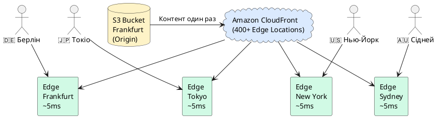

# Amazon CloudFront — Content Delivery Network

## Що таке CDN і навіщо він потрібен

Перш ніж говорити про CloudFront — треба зрозуміти фундаментальну проблему, яку вирішує CDN.

### Проблема: швидкість передачі даних через інтернет

Уявіть: ваш S3 bucket знаходиться у регіоні `eu-central-1` — у дата-центрі у Франкфурті, Німеччина. Ваш React SPA завантажується звідти за 20–50 мс для користувача з Берліна. Чудово!

Але що якщо користувач знаходиться в **Токіо, Японія**? Відстань від Франкфурту до Токіо — ~9 200 км. Дані передаються зі швидкістю ~200 000 км/сек у оптоволоконному кабелі. Теоретичний мінімум: ~46 мс. Реальна затримка з урахуванням маршрутизації, перемикання вузлів, черг: **150–300 мс**.

Це лише **час одного запиту** (round trip). Ваш React-додаток при першому завантаженні робить 20–50 запитів: HTML, CSS, JS chunks, зображення, шрифти. При 200 мс на кожен — загальний час завантаження **4–10 секунд**. За статистикою Google, 53% мобільних користувачів покидають сайт якщо він завантажується довше 3 секунд.

### Рішення: CDN — Content Delivery Network

**CDN (Content Delivery Network, Мережа доставки контенту)** — це глобальна мережа серверів (їх називають **Edge Locations** або **точки присутності**), розподілених по всьому світу. Замість того, щоб всі запити йшли до одного сервера у Франкфурті — CDN зберігає **копії ваших файлів на найближчих до користувача серверах**.

**Аналогія:** уявіть мережу супермаркетів. Замість одного центрального складу (Франкфурт) — філії у кожному місті. Купуєте хліб не в центральному складі, а у найближчому магазині за 5 хвилин ходьби. CDN — це той самий принцип, але для веб-даних.

**Як це працює крок за кроком:**

1. Ви завантажили React build у S3 (`my-app.s3.amazonaws.com`) — це **Origin** (першоджерело)
2. Підключили CloudFront — він знає де ваш Origin
3. Японський користувач відкриває ваш сайт → його браузер робить запит до CloudFront
4. CloudFront перевіряє **найближчий Edge Location до Токіо** (~3 км від центру міста!)
5. Якщо файл вже є в кеші токійського edge — повертає одразу (~5 мс!)
6. Якщо немає — edge забирає файл з Frankfurt Origin (~300 мс), **кешує у Токіо**, повертає користувачу
7. Наступні 100 000 японських користувачів отримають той самий файл з токійського edge за ~5 мс

::plant-uml



::

**CloudFront** — це CDN від Amazon Web Services. Він має **400+ Edge Locations** у 90+ містах по всьому світу (станом на 2025 рік). Включно з Варшавою, Бухарестом, Стамбулом — тобто є і поблизу України.

### CDN вирішує ще більше проблем

Крім швидкості, CDN вирішує:

- **Вартість трафіку:** трафік з CloudFront Edge дешевший, ніж прямо з S3 (в 3–6 разів). У Модулі 6 аніме-платформа платила $50 000/міс за CloudFront — без CDN це було б $150 000+
- **DDoS захист:** CloudFront автоматично абсорбує DDoS атаки на рівні edge. Атака «поглинається» у сотнях точок, а не доходить до вашого сервера
- **HTTPS термінація:** SSL-шифрування обробляється на edge, до вашого origin трафік може йти по HTTP всередині AWS (швидше і дешевше)
- **Стиснення:** CloudFront автоматично gzip/Brotli стискає текстові файли (HTML, JS, CSS) перед відправкою

---

## Як CloudFront кешує дані

**Кешування** — це збереження копії даних для швидкого повторного доступу. Браузер кешує файли на вашому комп'ютері. CloudFront кешує файли на edge servers.

**TTL (Time To Live)** — час, протягом якого кешована копія вважається актуальною. Якщо TTL = 86 400 секунд (24 години):
- О 08:00 перший запит іде до Origin, файл кешується на edge
- О 08:01 другий запит — edge повертає кеш, Origin не турбується
- До 08:00 наступного дня — всі запити обслуговуються з кешу
- Після 08:00 наступного дня — TTL протух, наступний запит знову іде до Origin

**Звідки CloudFront знає TTL?** З HTTP заголовку `Cache-Control` у відповіді Origin:
```
Cache-Control: max-age=86400         → кешувати 24 години
Cache-Control: no-cache, no-store    → не кешувати взагалі
Cache-Control: max-age=31536000      → кешувати 1 рік (для незмінних файлів)
```

**Для React SPA стратегія кешування:**
- `index.html` → `no-cache` (щоб одразу отримувати нову версію після деплою)
- `main.abc123.js` → `max-age=31536000` (hash у назві змінюється при кожному build — файл незмінний)
- `favicon.ico`, `robots.txt` → `max-age=86400`

---

## CloudFront Distributions

**Distribution** — це основна одиниця конфігурації CloudFront. Один Distribution = одне «розгортання» CDN для вашого застосунку. Distribution містить:

- **Origin(s):** звідки брати контент (S3, ALB, будь-який HTTP сервер)
- **Behaviors:** правила кешування для різних URL-шляхів
- **Domain name:** ваш домен (`myapp.cloudfront.net` або власний `app.example.com`)
- **SSL Certificate:** сертифікат для HTTPS
- **Edge Locations:** де кешувати (All Locations, або лише певні регіони)

Після створення Distribution отримує автоматичну адресу вигляду `d1234abcd.cloudfront.net`. Через неї одразу доступний контент з будь-якого edge у світі.

---

## Origins — звідки брати контент

**Origin** — це першоджерело контенту для CloudFront. При cache miss (файлу немає в кеші) — edge звертається до Origin.

### S3 Origin з OAC (рекомендовано)

**OAC (Origin Access Control)** — механізм, що дозволяє CloudFront звертатись до **закритого** S3 bucket. Ваш bucket залишається приватним (Block Public Access увімкнено!), а CloudFront підписує свої запити до S3 за допомогою SigV4.

**Це найбезпечніша архітектура:** ніхто не може обійти CloudFront і звернутись до S3 напряму.

```json
// Bucket Policy при OAC — дозволяємо лише CloudFront Distribution
{
    "Statement": [{
        "Effect": "Allow",
        "Principal": {
            "Service": "cloudfront.amazonaws.com"
        },
        "Action": "s3:GetObject",
        "Resource": "arn:aws:s3:::my-app-bucket/*",
        "Condition": {
            "StringEquals": {
                "AWS:SourceArn": "arn:aws:cloudfront::123456789012:distribution/EDFDVBD6EXAMPLE"
            }
        }
    }]
}
```

### ALB Origin

CloudFront стоїть перед Application Load Balancer. ALB → Auto Scaling Group → EC2 з .NET API. CloudFront кешує відповіді API (якщо вони кешовані), захищає від DDoS, надає HTTPS.

### Custom HTTP Origin

Будь-який HTTP/HTTPS сервер (навіть on-premises у вашому офісі). CloudFront виступає як CDN перед будь-яким веб-сервером.

---

## Cache Behaviors — правила для різних URL

**Cache Behavior** дозволяє налаштувати різні правила кешування для різних шляхів в одному Distribution. Наприклад:

| Path Pattern | Origin | Cache TTL | Compress |
|---|---|---|---|
| `/static/*` | S3 bucket | 1 рік | Yes |
| `/api/*` | ALB (.NET API) | 0 (не кешувати) | No |
| `*` (default) | S3 bucket | 24 год | Yes |

Завдяки цьому один CloudFront Distribution може одночасно:
- Роздавати статику з S3 (React build) — кешовано на рік
- Проксіювати API запити до ALB — без кешування
- Все під одним доменом: `app.example.com/api/*` та `app.example.com/static/*`

---

## CloudFront Functions vs Lambda@Edge

CloudFront дозволяє виконувати невеликий код **прямо на edge** — без звернення до основного сервера. Це може бути корисно для URL rewriting, A/B тестування, аутентифікації на рівні CDN.

**CloudFront Functions (рекомендовано для більшості задач):**
- Виконуються на кожному edge у **всіх 400+ точках**
- Час виконання: **< 1 мс**, лімітований час
- Мова: JavaScript (ES5.1)
- Ціна: $0.10 за 1 000 000 запитів
- **Обмеження:** не можуть робити мережеві запити, немає доступу до body запиту

**Lambda@Edge:**
- Виконуються лише в **Regional Edge Caches** (~12 регіонів)
- Час виконання до **5 сек** (origin request) або **30 сек** (origin response)
- Мова: Node.js або Python
- Ціна: ~$0.60 за 1 000 000 запитів
- **Можуть:** робити зовнішні API запити, читати/писати body

**Приклад CloudFront Function — redirect для SPA:**
```javascript
// Переписати /about, /users/123 → /index.html (для React Router)
function handler(event) {
    var request = event.request;
    var uri = request.uri;
    // Якщо URI без розширення — це SPA маршрут
    if (!uri.includes(".") || uri === "/") {
        request.uri = "/index.html";
    }
    return request;
}
```

---

## Cache Invalidation — оновлення кешу

Коли ви задеплоїли новий build React — файли у S3 оновились, але CloudFront ще роздає старі закешовані версії. **Invalidation** примусово очищує кеш.

```bash
# Інвалідувати весь кеш (/*) — всі файли
aws cloudfront create-invalidation \
    --distribution-id EDFDVBD6EXAMPLE \
    --paths "/*" \
    --region us-east-1

# Інвалідувати лише index.html (якщо JS/CSS з hash-ами)
aws cloudfront create-invalidation \
    --distribution-id EDFDVBD6EXAMPLE \
    --paths "/index.html" "/asset-manifest.json" \
    --region us-east-1
```

::tip
**Оптимізований підхід:** замість інвалідації всього кешу — інвалідуйте лише `index.html`. JavaScript та CSS файли React build містять hash у назві (`main.abc123.js`) і при кожному build отримують нову назву — CloudFront автоматично завантажить нову версію при першому запиті. Інвалідація `/*` коштує гроші при великому кеші.
::

**Вартість Invalidation:** перші **1 000 Invalidation paths** на місяць — безкоштовно. Далі $0.005 за path. `/*` вважається одним path.


---

## Практичний приклад: React SPA на S3 + CloudFront + HTTPS від А до Я

### Передумови

Перед початком переконайтесь, що у вас є:
- S3 bucket із завантаженим React build (з Модуля 6). Назвемо його `my-react-app-2024`
- Встановлений AWS CLI та налаштований профіль

::caution
**Важливо про регіони та CloudFront!** ACM сертифікат для CloudFront (на відміну від ALB) ОБОВ'ЯЗКОВО повинен бути створений у регіоні **`us-east-1` (US East, N. Virginia)**, навіть якщо ваш S3 та весь інший інфраструктур у `eu-central-1`. Це глобальна вимога CloudFront — помилка, яку роблять всі початківці.
::

---

### Крок 1: Перевірка S3 bucket

Переконаємось, що bucket готовий і файли є:

```bash
BUCKET="my-react-app-2024"

# Список файлів у bucket
aws s3 ls s3://$BUCKET/ --region eu-central-1

# Якщо bucket порожній — завантажте React build (з Модуля 6)
# aws s3 sync ./build s3://$BUCKET/ --delete --region eu-central-1
```

::terminal-preview{title="aws s3 ls — список файлів"}

<div class="line"><span class="opacity-40">$</span> <strong>aws s3 ls s3://my-react-app-2024/</strong></div>
<div class="line">2024-01-15 10:30:00      1024 index.html</div>
<div class="line">2024-01-15 10:30:00    182456 static/js/main.abc123.js</div>
<div class="line">2024-01-15 10:30:00     12340 static/css/main.def456.css</div>
<div class="line">2024-01-15 10:30:00      3442 favicon.ico</div>

::

Також переконайтесь, що **Block Public Access увімкнений** (це правильна архітектура з OAC):

```bash
# Увімкнути Block Public Access (якщо не увімкнений)
aws s3api put-public-access-block \
    --bucket $BUCKET \
    --public-access-block-configuration \
        BlockPublicAcls=true,IgnorePublicAcls=true,\
        BlockPublicPolicy=true,RestrictPublicBuckets=true \
    --region eu-central-1

# Якщо раніше додавали публічну Bucket Policy — видаліть її
aws s3api delete-bucket-policy --bucket $BUCKET --region eu-central-1
```

---

### Крок 2: Створення CloudFront Distribution

::tabs

::tabs-item{label="AWS Console"}

1. Відкрийте **CloudFront** у AWS Console
2. Натисніть **Create distribution**

**Origin settings:**
- **Origin domain:** у dropdown оберіть ваш S3 bucket `my-react-app-2024.s3.eu-central-1.amazonaws.com`
- **Origin access:** оберіть **Origin access control settings (recommended)** (це OAC, не OAI!)
- Натисніть **Create new OAC** → Name: `my-react-app-oac` → **Create**
- AWS покаже жовте попередження «You must update the S3 bucket policy» — це нормально, зробимо це пізніше

**Default cache behavior:**
- **Viewer protocol policy:** `Redirect HTTP to HTTPS` *(автоматично перенаправляти з http на https)*
- **Allowed HTTP methods:** GET, HEAD
- **Compress objects automatically:** Yes

**Settings:**
- **Price class:** `Use only North America, Europe, Asia, Middle East, and Africa` *(дешевше за All Edge Locations — ваша аудиторія переважно в цих регіонах)*
- **Alternate domain names (CNAMEs):** залиште порожнім поки що (додамо пізніше після отримання сертифіката)
- **Custom SSL certificate:** залиште `Default CloudFront certificate` поки що
- **Default root object:** `index.html` *(що повертати при запиті `/`)*

3. Натисніть **Create distribution**
4. **Зачекайте 5–15 хвилин** поки Distribution розгорнеться на всіх edge locations. Статус зміниться з `In Progress` на `Deployed`
5. Запишіть **Distribution domain name**: `d1234abcd.cloudfront.net`
6. Запишіть **Distribution ID**: `EDFDVBD6EXAMPLE` (знадобиться для CLI команд)

::

::tabs-item{label="AWS CLI"}

```bash
BUCKET="my-react-app-2024"
REGION="eu-central-1"

# Крок 2a: Створити OAC (Origin Access Control)
OAC_ID=$(aws cloudfront create-origin-access-control \
    --origin-access-control-config '{
        "Name": "my-react-app-oac",
        "OriginAccessControlOriginType": "s3",
        "SigningBehavior": "always",
        "SigningProtocol": "sigv4"
    }' \
    --query "OriginAccessControl.Id" --output text)
echo "OAC ID: $OAC_ID"

# Крок 2b: Створити Distribution
DIST_OUTPUT=$(aws cloudfront create-distribution \
    --distribution-config '{
        "CallerReference": "react-spa-'$(date +%s)'",
        "Comment": "React SPA distribution",
        "DefaultRootObject": "index.html",
        "Origins": {
            "Quantity": 1,
            "Items": [{
                "Id": "S3Origin",
                "DomainName": "'$BUCKET'.s3.'$REGION'.amazonaws.com",
                "S3OriginConfig": {"OriginAccessIdentity": ""},
                "OriginAccessControlId": "'$OAC_ID'"
            }]
        },
        "DefaultCacheBehavior": {
            "TargetOriginId": "S3Origin",
            "ViewerProtocolPolicy": "redirect-to-https",
            "CachePolicyId": "658327ea-f89d-4fab-a63d-7e88639e58f6",
            "Compress": true,
            "AllowedMethods": {
                "Quantity": 2,
                "Items": ["GET", "HEAD"],
                "CachedMethods": {"Quantity": 2, "Items": ["GET", "HEAD"]}
            }
        },
        "Enabled": true,
        "PriceClass": "PriceClass_200",
        "HttpVersion": "http2and3"
    }')

DIST_ID=$(echo $DIST_OUTPUT | python3 -c "import sys,json; d=json.load(sys.stdin); print(d['Distribution']['Id'])")
DIST_DOMAIN=$(echo $DIST_OUTPUT | python3 -c "import sys,json; d=json.load(sys.stdin); print(d['Distribution']['DomainName'])")
echo "Distribution ID: $DIST_ID"
echo "Distribution Domain: $DIST_DOMAIN"
```

::

::

---

### Крок 3: Оновлення S3 Bucket Policy для OAC

Після створення Distribution і OAC — потрібно надати CloudFront доступ до закритого bucket:

::tabs

::tabs-item{label="AWS Console"}

1. AWS Console покаже банер: **«The S3 bucket policy needs to be updated»** → натисніть **Copy policy**
2. Перейдіть у **S3** → `my-react-app-2024` → **Permissions** → **Bucket policy** → **Edit**
3. Вставте скопійовану Policy → **Save changes**

::

::tabs-item{label="AWS CLI"}

```bash
# ЗАМІНІТЬ EDFDVBD6EXAMPLE на ваш реальний Distribution ID
# ЗАМІНІТЬ 123456789012 на ваш реальний Account ID
DIST_ID="EDFDVBD6EXAMPLE"
ACCOUNT_ID="123456789012"

cat > /tmp/cf-bucket-policy.json << EOF
{
    "Version": "2012-10-17",
    "Statement": [{
        "Sid": "AllowCloudFrontServicePrincipal",
        "Effect": "Allow",
        "Principal": {
            "Service": "cloudfront.amazonaws.com"
        },
        "Action": "s3:GetObject",
        "Resource": "arn:aws:s3:::$BUCKET/*",
        "Condition": {
            "StringEquals": {
                "AWS:SourceArn": "arn:aws:cloudfront::$ACCOUNT_ID:distribution/$DIST_ID"
            }
        }
    }]
}
EOF

aws s3api put-bucket-policy \
    --bucket $BUCKET \
    --policy file:///tmp/cf-bucket-policy.json \
    --region eu-central-1
```

::

::

Тепер перевіримо, що CloudFront роздає ваш React додаток:

::terminal-preview{title="Тест CloudFront domain"}

<div class="line"><span class="opacity-40">$</span> <strong>curl -I https://d1234abcd.cloudfront.net/</strong></div>
<div class="line">HTTP/2 200</div>
<div class="line">content-type: text/html</div>
<div class="line"><span class="text-green-400">x-cache: Miss from cloudfront</span></div>
<div class="line">via: 1.1 abc123.cloudfront.net (CloudFront)</div>
<div class="line"></div>
<div class="line"><span class="opacity-40">$</span> <strong>curl -I https://d1234abcd.cloudfront.net/</strong></div>
<div class="line">HTTP/2 200</div>
<div class="line"><span class="text-green-400">x-cache: Hit from cloudfront</span></div>

::

`x-cache: Miss from cloudfront` — перший запит, брав з S3. `x-cache: Hit from cloudfront` — повторний запит, відповів з кешу.

---

### Крок 4: Custom Error Pages для React Router

React Router використовує client-side navigation. Якщо користувач відкриє `https://yoursite.com/about` — CloudFront запитає у S3 файл `/about`, не знайде → поверне 403/404. Потрібно налаштувати redirect на `index.html`.

::tabs

::tabs-item{label="AWS Console"}

1. CloudFront → ваш Distribution → вкладка **Error pages**
2. **Create custom error response**:
   - HTTP error code: **403** *(S3 повертає 403 для неіснуючих об'єктів при OAC)*
   - Customize error response: **Yes**
   - Response page path: `/index.html`
   - HTTP response code: **200**
3. Повторіть для **404** (на всяк випадок)

::

::tabs-item{label="AWS CLI"}

```bash
# Отримати поточний ETag Distribution (потрібен для update)
ETAG=$(aws cloudfront get-distribution-config \
    --id $DIST_ID \
    --query "ETag" --output text)

# Для CLI — потрібно оновити всю Distribution Config
# Рекомендовано використовувати Console для цього кроку
# або AWS CDK/Terraform для production
echo "Для налаштування Error Pages використовуйте Console"
```

::

::

---

### Крок 5: Налаштування Cache-Control заголовків для React

React build генерує файли з hash у назвах (`main.abc123.js`). При кожному `npm run build` hash змінюється — тому старі файли ніколи не конфліктують з новими. Це дозволяє кешувати JS/CSS на рік.

```bash
BUCKET="my-react-app-2024"

# index.html — без кешу (завжди свіжий)
aws s3 cp s3://$BUCKET/index.html s3://$BUCKET/index.html \
    --metadata-directive REPLACE \
    --content-type "text/html; charset=utf-8" \
    --cache-control "no-cache, no-store, must-revalidate" \
    --region eu-central-1

# JS файли з hash — кеш на 1 рік (незмінні!)
aws s3 cp s3://$BUCKET/static/js/ s3://$BUCKET/static/js/ \
    --recursive --metadata-directive REPLACE \
    --content-type "application/javascript" \
    --cache-control "public, max-age=31536000, immutable" \
    --region eu-central-1

# CSS файли — кеш на 1 рік
aws s3 cp s3://$BUCKET/static/css/ s3://$BUCKET/static/css/ \
    --recursive --metadata-directive REPLACE \
    --content-type "text/css" \
    --cache-control "public, max-age=31536000, immutable" \
    --region eu-central-1
```

Або ще краще — автоматизуйте у `deploy.sh`:

```bash
#!/bin/bash
# deploy.sh — повний скрипт деплою React SPA
set -e  # зупинитись при будь-якій помилці

BUCKET="my-react-app-2024"
DIST_ID="EDFDVBD6EXAMPLE"  # ЗАМІНІТЬ на ваш Distribution ID

echo "1. Building React app..."
npm run build

echo "2. Uploading JS/CSS (long cache)..."
aws s3 sync ./build/static s3://$BUCKET/static \
    --cache-control "public, max-age=31536000, immutable" \
    --delete --region eu-central-1

echo "3. Uploading other assets..."
aws s3 sync ./build s3://$BUCKET \
    --exclude "index.html" --exclude "static/*" \
    --cache-control "public, max-age=86400" \
    --delete --region eu-central-1

echo "4. Uploading index.html (no cache)..."
aws s3 cp ./build/index.html s3://$BUCKET/index.html \
    --cache-control "no-cache, no-store, must-revalidate" \
    --content-type "text/html; charset=utf-8" \
    --region eu-central-1

echo "5. Invalidating CloudFront cache (index.html only)..."
aws cloudfront create-invalidation \
    --distribution-id $DIST_ID \
    --paths "/index.html" "/asset-manifest.json" \
    --region us-east-1  # CloudFront завжди us-east-1!

echo "Done! Site deployed."
```


---

### Крок 6: Підключення власного домену через pp.ua (безкоштовно)

**pp.ua** — безкоштовний сервіс для реєстрації субдоменів третього рівня в зоні `.pp.ua`. Ви можете безкоштовно отримати домен виду `yourname.pp.ua` і прив'язати його до CloudFront. Це ідеальний варіант для студентів та навчальних проєктів.

**Загальна схема:**
```
yourname.pp.ua
    ↓ CNAME запис (DNS)
d1234abcd.cloudfront.net
    ↓ CloudFront Distribution
S3 bucket (React SPA)
```

#### Крок 6a: Реєстрація на pp.ua

1. Перейдіть на [https://pp.ua](https://pp.ua)
2. Введіть бажане ім'я субдомену, наприклад `my-react-app`
3. Натисніть перевірку — якщо `my-react-app.pp.ua` вільний, зареєструйте
4. Введіть email, пароль → підтвердіть email
5. Увійдіть у панель управління доменом

#### Крок 6b: Отримання ACM SSL сертифіката (ОБОВ'ЯЗКОВО у us-east-1!)

::caution
ACM сертифікат для CloudFront ПОВИНЕН бути у регіоні `us-east-1`. Навіть якщо ваш S3 у Франкфурті. Якщо сертифікат в іншому регіоні — CloudFront просто не покаже його у списку. Переключіться у Console на `us-east-1` перед наступними кроками!
::

::tabs

::tabs-item{label="AWS Console"}

1. Переключіть регіон у Console на **US East (N. Virginia) us-east-1** (важливо!)
2. Відкрийте **ACM (Certificate Manager)**
3. **Request a certificate** → **Request a public certificate** → **Next**
4. **Fully qualified domain name:** `my-react-app.pp.ua`
5. **Validation method:** DNS validation
6. **Request**
7. Відкрийте щойно створений сертифікат → у розділі **Domains** → скопіюйте CNAME запис для валідації:
   - **CNAME name:** `_abc123.my-react-app.pp.ua` (скопіюйте повністю)
   - **CNAME value:** `_def456.acm-validations.aws.` (скопіюйте повністю)

::

::tabs-item{label="AWS CLI"}

```bash
# ВАЖЛИВО: --region us-east-1 (не eu-central-1!)
CERT_ARN=$(aws acm request-certificate \
    --domain-name "my-react-app.pp.ua" \
    --validation-method DNS \
    --region us-east-1 \
    --query CertificateArn --output text)
echo "Certificate ARN: $CERT_ARN"

# Отримати CNAME запис для DNS валідації
aws acm describe-certificate \
    --certificate-arn $CERT_ARN \
    --region us-east-1 \
    --query "Certificate.DomainValidationOptions[0].ResourceRecord"
# Виведе:
# {
#     "Name": "_abc123.my-react-app.pp.ua.",
#     "Type": "CNAME",
#     "Value": "_def456.acm-validations.aws."
# }
```

::

::

#### Крок 6c: Додавання DNS записів у pp.ua

У панелі pp.ua вам потрібно додати **два CNAME записи**:

**Запис 1 — для валідації сертифіката ACM:**

Зайдіть у панель pp.ua → DNS Management → Add Record:
- **Type:** CNAME
- **Name/Host:** `_abc123` *(лише частина до `.my-react-app.pp.ua` — приставку домену не вводьте)*
- **Value/Target:** `_def456.acm-validations.aws.`
- **TTL:** 300

::note
У деяких DNS панелях потрібно вводити повне ім'я (`_abc123.my-react-app.pp.ua`), а в інших — лише частину до домену (`_abc123`). Спробуйте обидва варіанти і перевірте через `nslookup`.
::

Зачекайте 5–30 хвилин поки ACM перевірить DNS запис. Статус сертифіката зміниться з `Pending validation` на **`Issued`**.

**Запис 2 — для підключення домену до CloudFront:**

Зайдіть у pp.ua → DNS Management → Add Record:
- **Type:** CNAME
- **Name/Host:** `my-react-app` *(або `@` якщо хочете щоб `pp.ua` вказував на корінь, але субдомен краще)*
- **Value/Target:** `d1234abcd.cloudfront.net` *(ваш CloudFront domain name)*
- **TTL:** 300

Перевірка через термінал:

::terminal-preview{title="DNS перевірка CNAME"}

<div class="line"><span class="opacity-40">$</span> <strong>nslookup -type=CNAME my-react-app.pp.ua</strong></div>
<div class="line">Server:  1.1.1.1</div>
<div class="line">Address: 1.1.1.1#53</div>
<div class="line"></div>
<div class="line">Non-authoritative answer:</div>
<div class="line"><span class="text-green-400">my-react-app.pp.ua  canonical name = d1234abcd.cloudfront.net.</span></div>

::

**Що таке `nslookup`?** Це консольна утиліта для перевірки DNS записів. `nslookup -type=CNAME domain` показує CNAME запис для домену. Якщо бачите `d1234abcd.cloudfront.net` — DNS налаштований правильно.

#### Крок 6d: Додавання домену у CloudFront Distribution

Тепер потрібно сказати CloudFront що він обслуговує ваш домен:

::tabs

::tabs-item{label="AWS Console"}

1. CloudFront → ваш Distribution → вкладка **General** → **Edit**
2. **Alternate domain names (CNAMEs):** додайте `my-react-app.pp.ua`
3. **Custom SSL certificate:** оберіть ваш ACM сертифікат `my-react-app.pp.ua` (має бути в списку, якщо він `Issued` у us-east-1)
4. **Save changes**
5. Зачекайте 3–5 хвилин поки зміни розгорнуться

::

::tabs-item{label="AWS CLI"}

```bash
# Отримати поточну конфігурацію
DIST_CONFIG=$(aws cloudfront get-distribution-config \
    --id $DIST_ID --region us-east-1)
ETAG=$(echo $DIST_CONFIG | python3 -c "import sys,json; print(json.load(sys.stdin)['ETag'])")

# Зберегти конфіг у файл і відредагувати
echo $DIST_CONFIG | python3 -c "import sys,json; d=json.load(sys.stdin); print(json.dumps(d['DistributionConfig'], indent=2))" > /tmp/dist-config.json

# Відредагуйте /tmp/dist-config.json вручну:
# Додайте в "Aliases": {"Quantity": 1, "Items": ["my-react-app.pp.ua"]}
# Додайте "ViewerCertificate" з вашим CERT_ARN

# Оновити Distribution
aws cloudfront update-distribution \
    --id $DIST_ID \
    --distribution-config file:///tmp/dist-config.json \
    --if-match $ETAG \
    --region us-east-1
```

::

::

Тепер відкрийте у браузері: **`https://my-react-app.pp.ua`** 🎉

::terminal-preview{title="Фінальна перевірка"}

<div class="line"><span class="opacity-40">$</span> <strong>curl -I https://my-react-app.pp.ua/</strong></div>
<div class="line">HTTP/2 200</div>
<div class="line">content-type: text/html; charset=utf-8</div>
<div class="line"><span class="text-green-400">x-cache: Hit from cloudfront</span></div>
<div class="line">via: 1.1 abc123.cloudfront.net (CloudFront)</div>
<div class="line">server: AmazonS3</div>
<div class="line">cache-control: no-cache, no-store, must-revalidate</div>

::

---

### Крок 7 (опціонально): Підключення платного домену через Route 53

Якщо у вас є власний домен (куплений у будь-якого реєстратора: GoDaddy, Namecheap, Porkbun тощо) — процес аналогічний pp.ua, але через Route 53.

1. **Route 53** → **Hosted zones** → **Create hosted zone** → введіть ваш домен
2. Route 53 надасть 4 NS-сервери (наприклад `ns-1234.awsdns-12.org`) — вкажіть їх у вашого реєстратора
3. **ACM сертифікат** (у `us-east-1`) → DNS validation → Route 53 додасть CNAME автоматично (кнопка **Create records in Route 53**)
4. **Route 53 → Hosted zone → Create record:**
   - **Record name:** `app` (для `app.example.com`)
   - **Record type:** `A`
   - ✅ **Alias → CloudFront distribution** (оберіть вашу Distribution)
   - Route 53 + CloudFront краще використовувати `A record` з Alias замість CNAME — це ефективніше і коштує менше

---

### Крок 8: ОБОВ'ЯЗКОВО — Очищення

::caution
CloudFront Distribution коштує ~$0.0085 за 10,000 HTTPS запитів + трафік. Для навчального проєкту з нульовим трафіком — практично безкоштовно. Але якщо не потрібен — вимкніть.
::

```bash
# Вимкнути (не видалити) Distribution
aws cloudfront update-distribution \
    --id $DIST_ID \
    --distribution-config '{"Enabled": false, ...}' \
    --region us-east-1

# Або через Console: CloudFront → Distribution → Disable
# Після статусу Deployed (вимкнено) можна Delete
```

---

## Резюме

- **CDN** — глобальна мережа серверів, що кешують контент поблизу користувача. Вирішує проблему latency та зменшує навантаження на Origin.
- **CloudFront** — CDN від AWS. 400+ Edge Locations. Кешує контент, термінує SSL, захищає від DDoS.
- **Distribution** — одиниця конфігурації CloudFront. Містить Origins, Behaviors, домени, SSL.
- **OAC (Origin Access Control)** — правильний спосіб підключити закритий S3 до CloudFront. Bucket залишається приватним.
- **OAI** (застарілий) → замінено **OAC** (рекомендовано).
- **Cache Behaviors:** різні TTL та правила для різних URL. `/api/*` без кешу, `/static/*` на рік.
- **TTL та Cache-Control:** `index.html` → `no-cache`. JS/CSS з hash → `max-age=31536000, immutable`.
- **Invalidation:** очищення кешу після деплою. Лише `index.html` зазвичай достатньо.
- **CloudFront Functions:** JS код на edge для URL rewriting, A/B тестування.
- **ACM сертифікат для CloudFront:** ОБОВ'ЯЗКОВО у регіоні `us-east-1`.
- **pp.ua:** безкоштовний субдомен. CNAME → CloudFront domain. Ідеально для навчання.

---

## Практичні завдання

### Рівень 1 (Базовий)

**Завдання 1.** Поясніть власними словами що таке CDN і навіщо він потрібен. Що станеться якщо користувач у Токіо відкриє сайт без CDN, розміщений у Франкфурті?

**Завдання 2.** Чому ACM сертифікат для CloudFront потрібно створювати у `us-east-1`, а не в тому регіоні де ваш S3?

### Рівень 2 (Практичний)

**Завдання 3.** Задеплойте React SPA на S3 + CloudFront за інструкцією. Налаштуйте власний домен через pp.ua. Перевірте `x-cache: Hit from cloudfront` у заголовках відповіді.

**Завдання 4.** Напишіть `deploy.sh` скрипт, що: білдить React, синхронізує S3 з правильними Cache-Control заголовками, інвалідує лише `index.html` у CloudFront. Протестуйте: задеплойте нову версію і переконайтесь, що зміни видно одразу.

### Рівень 3 (Архітектура)

**Завдання 5.** Спроектуйте CloudFront Distribution для SPA з .NET API: фронтенд (S3 → CloudFront, `max-age=31536000`), API запити (`/api/*` → ALB без кешу), статика (`/public/*` → S3 `max-age=86400`). Додайте CloudFront Function для `index.html` fallback без помилки 403. Намалюйте схему у PlantUML.
