# Amazon CloudFront — Content Delivery Network

## Що таке CDN і навіщо він потрібен

Перш ніж говорити про CloudFront — треба зрозуміти фундаментальну проблему, яку вирішує CDN.

### Проблема: швидкість передачі даних через інтернет

Уявіть: ваш S3 bucket знаходиться у регіоні `eu-central-1` — у дата-центрі у Франкфурті, Німеччина. Ваш React SPA завантажується звідти за 20–50 мс для користувача з Берліна. Чудово!

Але що якщо користувач знаходиться в **Токіо, Японія**? Відстань від Франкфурту до Токіо — ~9 200 км. Дані передаються зі швидкістю ~200 000 км/сек у оптоволоконному кабелі. Теоретичний мінімум: ~46 мс. Реальна затримка з урахуванням маршрутизації, перемикання вузлів, черг: **150–300 мс**.

Це лише **час одного запиту** (round trip). Ваш React-додаток при першому завантаженні робить 20–50 запитів: HTML, CSS, JS chunks, зображення, шрифти. При 200 мс на кожен — загальний час завантаження **4–10 секунд**. За статистикою Google, 53% мобільних користувачів покидають сайт якщо він завантажується довше 3 секунд.

::plant-uml

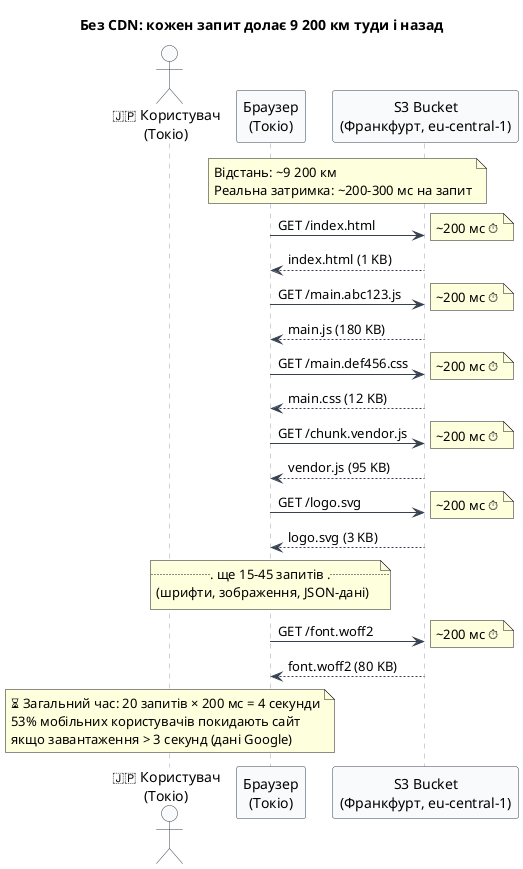

::

### Рішення: CDN — Content Delivery Network

**CDN (Content Delivery Network, Мережа доставки контенту)** — це глобальна мережа серверів (їх називають **Edge Locations** або **точки присутності**), розподілених по всьому світу. Замість того, щоб всі запити йшли до одного сервера у Франкфурті — CDN зберігає **копії ваших файлів на найближчих до користувача серверах**.

**Аналогія:** уявіть мережу супермаркетів. Замість одного центрального складу (Франкфурт) — філії у кожному місті. Купуєте хліб не в центральному складі, а у найближчому магазині за 5 хвилин ходьби. CDN — це той самий принцип, але для веб-даних.

**Як це працює крок за кроком:**

1. Ви завантажили React build у S3 (`my-app.s3.amazonaws.com`) — це **Origin** (першоджерело)
2. Підключили CloudFront — він знає де ваш Origin
3. Японський користувач відкриває ваш сайт → його браузер робить запит до CloudFront
4. CloudFront перевіряє **найближчий Edge Location до Токіо** (~3 км від центру міста!)
5. Якщо файл вже є в кеші токійського edge — повертає одразу (~5 мс!)
6. Якщо немає — edge забирає файл з Frankfurt Origin (~300 мс), **кешує у Токіо**, повертає користувачу
7. Наступні 100 000 японських користувачів отримають той самий файл з токійського edge за ~5 мс

::plant-uml

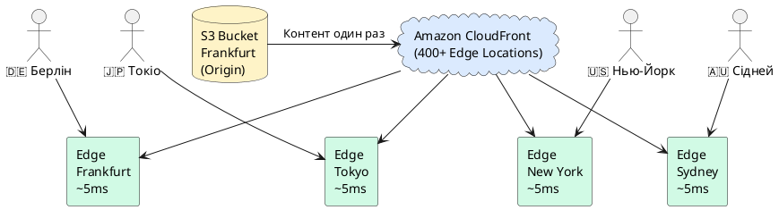

::

**CloudFront** — це CDN від Amazon Web Services. Він має **400+ Edge Locations** у 90+ містах по всьому світу (станом на 2025 рік). Включно з Варшавою, Бухарестом, Стамбулом — тобто є і поблизу України.

### CDN вирішує ще більше проблем

Швидкість доставки — лише одна з переваг CDN. Розглянемо повний спектр проблем, які вирішує CloudFront.

#### 1. Оптимізація вартості трафіку

Передача даних з S3 напряму до кінцевих користувачів (так звана **Data Transfer Out**) є одним з найдорожчих компонентів рахунку AWS. Трафік з CloudFront Edge Locations коштує в **3–6 разів дешевше**, ніж прямий вихідний трафік з S3, — це обумовлено тим, що AWS надає CloudFront пільгові оптові тарифи на передачу даних між власними дата-центрами.

Крім того, кешування на edge **радикально зменшує кількість запитів до Origin**. Якщо файл закешований на edge з HIT rate 95% — Origin отримує лише 5% запитів, і ви платите за трафік з S3 тільки за ці 5%.

**Практичний ефект:** великий медіасервіс з трафіком $50 000/міс через CloudFront заплатив би $150 000–300 000/міс при прямих запитах до S3. Тобто CDN буквально окупає себе багаторазово.

#### 2. Захист від DDoS-атак

**DDoS (Distributed Denial of Service)** — атака, при якій зловмисник генерує мільйони запитів з тисяч заражених пристроїв по всьому світу, щоб перевантажити ваш сервер і зробити його недоступним для реальних користувачів.

CloudFront вбудовано інтегрований з **AWS Shield Standard** (безкоштовно для всіх CloudFront Distribution), який забезпечує:

- **Розподіл навантаження:** атака поглинається одночасно у 400+ edge locations по всьому світу. Замість того щоб 1 000 000 RPS вдарило у ваш один Origin-сервер — вони розподіляються між сотнями точок, кожна з яких обробляє по 2 500 RPS
- **Фільтрацію на рівні мережі:** CloudFront автоматично детектує та блокує аномальний трафік на рівнях L3/L4 (IP-флуд, SYN-флуд, UDP-флуд)
- **Ізоляцію Origin:** ваш реальний сервер (S3, EC2, ALB) залишається прихованим за CloudFront — його IP-адреса недоступна зловмиснику

Для розширеного захисту (L7 атаки — HTTP-флуд, SQL-ін'єкції через HTTP) підключається **AWS WAF** (Web Application Firewall) — окремий платний сервіс, що інтегрується з CloudFront.

#### 3. SSL/TLS-термінація на edge

**SSL/TLS-термінація** — це процес, при якому шифрування HTTPS-з'єднання обробляється не на вашому Origin-сервері, а безпосередньо на найближчому до користувача edge.

Схема роботи:

```
Браузер ──HTTPS──► Edge Location ──HTTP──► Origin (S3/EC2 всередині AWS)
         (зашифровано)           (відкрито, але всередині захищеної
                                  приватної мережі AWS — безпечно)
```

Переваги такої архітектури:

- **Зменшення latency:** TLS handshake (встановлення шифрованого з'єднання) займає 1–3 RTT. Якщо handshake відбувається на edge за 5 мс від користувача — це набагато швидше, ніж 300 мс до Origin у Франкфурті
- **Зниження навантаження на Origin:** крипто-операції (шифрування/дешифрування) потребують CPU. CloudFront знімає цей тягар з вашого сервера
- **Централізоване управління сертифікатами:** AWS Certificate Manager (ACM) автоматично поновлює SSL-сертифікати — ніяких ручних renewals

#### 4. Автоматичне стиснення контенту

CloudFront автоматично стискає текстові ресурси перед відправкою клієнту, якщо увімкнено параметр **Compress objects automatically**.

Підтримувані алгоритми:

- **Gzip** — класичний алгоритм, підтримується всіма браузерами з 1990-х. Стискає текст у 5–10 разів
- **Brotli** — сучасніший алгоритм від Google (2015), дає на 15–25% кращий рівень стиснення порівняно з gzip для HTML/JS/CSS. CloudFront обирає brotli якщо браузер надсилає заголовок `Accept-Encoding: br`

**Що стискається:** HTML, CSS, JavaScript, JSON, XML, SVG, текстові файли (`text/*`, `application/json`, `application/javascript`).

**Що не стискається:** зображення (JPEG, PNG, WebP), відео, PDF — вони вже стиснені власними алгоритмами, повторне стиснення лише збільшить CPU-навантаження без виграшу у розмірі.

#### 5. HTTP/2 та HTTP/3 за замовчуванням

CloudFront підтримує сучасні протоколи **HTTP/2** та **HTTP/3 (QUIC)** без жодної додаткової конфігурації:

- **HTTP/2** (2015): мультиплексування — всі ресурси сторінки (HTML, JS, CSS, шрифти) передаються в одному TCP-з'єднанні паралельно, без black-of-head-of-line blocking властивого HTTP/1.1
- **HTTP/3** (2022): базується на протоколі QUIC поверх UDP замість TCP. Критично швидший при нестабільному з'єднанні (мобільний інтернет, втрата пакетів) — повторна передача відбувається лише для конкретного стриму, а не всього з'єднання

#### 6. Географічне обмеження доступу (Geo Restriction)

CloudFront дозволяє **блокувати або дозволяти** доступ до контенту на основі країни користувача (визначається за IP-адресою через GeoIP базу даних).

Приклади застосування:

- Стримінгові сервіси: блокування контенту в країнах, де немає ліцензії (геолокаційні обмеження для відео)
- Відповідність законодавству: GDPR вимагає певних обмежень для ЄС, а різні юрисдикції мають різні вимоги до даних
- Безпека: блокування країн, звідки надходить найбільше атак

---

## Як CloudFront кешує дані

CloudFront — це HTTP-проксі з кешем. Він повністю дотримується стандарту HTTP/1.1 (RFC 7234) щодо кешування: **рішення про те, кешувати відповідь чи ні, приймається на основі HTTP-заголовків**, які повертає ваш Origin-сервер.

### HTTP-заголовки кешування

Коли edge отримує відповідь від Origin, він аналізує заголовок `Cache-Control` і вирішує:

| Директива    | Значення                               | Поведінка CloudFront                                                             |
| ------------ | -------------------------------------- | -------------------------------------------------------------------------------- |
| `max-age=N`  | кешувати N секунд                      | зберігає копію на N секунд                                                       |
| `s-maxage=N` | спеціально для проксі-кешів            | CloudFront використовує `s-maxage` замість `max-age` якщо обидва присутні        |
| `no-cache`   | не використовувати кеш без ревалідації | CloudFront робить умовний запит до Origin (`If-None-Match`, `If-Modified-Since`) |
| `no-store`   | не зберігати взагалі                   | CloudFront не кешує, завжди звертається до Origin                                |
| `private`    | лише для браузера, не для проксі       | CloudFront **не кешує** відповіді з `Cache-Control: private`                     |

**TTL (Time To Live)** — час, протягом якого кешована копія вважається актуальною. Після закінчення TTL edge робить новий запит до Origin.

### Cache Miss та Cache Hit: послідовність подій

::plant-uml

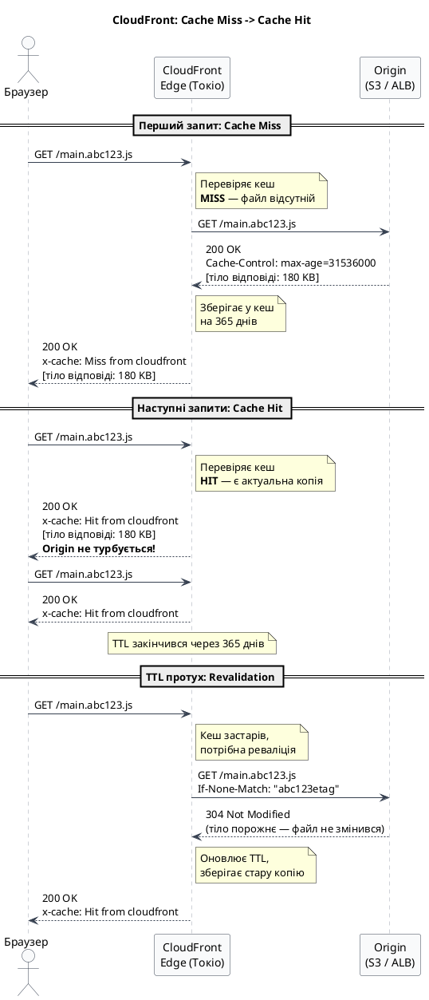

::

### Заголовки відповіді CloudFront

Кожна відповідь від CloudFront містить діагностичні заголовки:

```http
HTTP/2 200
x-cache: Hit from cloudfront          ← HIT або Miss from cloudfront
x-amz-cf-pop: NRT12-C2               ← Edge location (NRT = Narita, Tokyo)
x-amz-cf-id: abc123...               ← Унікальний ID запиту для дебагу
age: 3847                             ← Скільки секунд файл у кеші
cache-control: max-age=31536000       ← Заголовок від Origin (прокидається клієнту)
```

Заголовок `age` дозволяє дізнатись «вік» кешованої копії: якщо `max-age=86400` і `age=3600` — до закінчення TTL ще 82 800 секунд (23 години).

### Стратегії Cache-Control для різних типів контенту

Правильна стратегія кешування залежить від типу ресурсу та частоти його зміни.

#### React SPA (Vite / Create React App)

Vite та CRA автоматично додають content hash до імен файлів при production build: `main.a1b2c3d4.js`. Якщо вміст файлу змінився — змінюється і hash, тобто URL стає іншим. Це дозволяє кешувати JS/CSS **назавжди**.

```bash
# Стратегія деплою React на S3:

# index.html — ніколи не кешувати (він містить посилання на актуальні hash-файли)
aws s3 cp ./dist/index.html s3://my-bucket/index.html \
    --cache-control "no-cache, no-store, must-revalidate" \
    --content-type "text/html; charset=utf-8"

# JS/CSS з hash у назві — кешувати назавжди (immutable = "цей файл ніколи не змінюється")
aws s3 sync ./dist/assets s3://my-bucket/assets \
    --cache-control "public, max-age=31536000, immutable"

# Статичні asset без hash (favicon, robots.txt) — кешувати добу
aws s3 cp ./dist/favicon.ico s3://my-bucket/favicon.ico \
    --cache-control "public, max-age=86400"
```

#### ASP.NET Core — статичні файли (`wwwroot`)

У ASP.NET Core middleware `UseStaticFiles()` автоматично виставляє заголовки кешування. Можна налаштувати:

```csharp
// Program.cs
app.UseStaticFiles(new StaticFileOptions
{
    OnPrepareResponse = ctx =>
    {
        var path = ctx.File.Name;
        var headers = ctx.Context.Response.Headers;

        if (path.EndsWith(".js") || path.EndsWith(".css"))
        {
            // Файли з hash у назві (Vite/webpack output) — кеш на рік
            if (path.Contains('.') && path.Split('.').Length > 2)
            {
                headers.CacheControl = "public, max-age=31536000, immutable";
            }
            else
            {
                headers.CacheControl = "public, max-age=3600"; // 1 година
            }
        }
        else if (path.EndsWith(".html"))
        {
            headers.CacheControl = "no-cache, no-store, must-revalidate";
        }
        else
        {
            headers.CacheControl = "public, max-age=86400"; // 24 години
        }
    }
});
```

#### ASP.NET Core — API відповіді

Для API-ендпоінтів CloudFront може кешувати **лише GET/HEAD запити** з явним `Cache-Control`. За замовчуванням ASP.NET Core не виставляє `Cache-Control` — тому CloudFront не кешує API-відповіді автоматично.

```csharp
// Кешований GET-ендпоінт (список категорій — змінюється рідко)
[HttpGet("categories")]
[ResponseCache(Duration = 300, Location = ResponseCacheLocation.Any, VaryByHeader = "Accept-Language")]
public IActionResult GetCategories()
{
    // Cache-Control: public, max-age=300, vary: Accept-Language
    return Ok(_categoryService.GetAll());
}

// НЕ кешований ендпоінт (персональні дані користувача)
[HttpGet("profile")]
[ResponseCache(NoStore = true, Location = ResponseCacheLocation.None)]
public IActionResult GetProfile()
{
    // Cache-Control: no-store
    return Ok(_userService.GetCurrentUser(User));
}
```

::caution
**Важливо:** ніколи не кешуйте на CloudFront відповіді, що містять персональні дані (JWT-токени, профілі, кошики покупок). Якщо `Cache-Control: public, max-age=60` і CloudFront закешував відповідь з даними Аліси — наступний користувач отримає **дані Аліси**. Завжди використовуйте `Cache-Control: private` або `no-store` для персоналізованого контенту.
::

#### Порівняльна таблиця стратегій

| Тип ресурсу             | Приклади                | Рекомендований Cache-Control           |
| ----------------------- | ----------------------- | -------------------------------------- |
| HTML-оболонка SPA       | `index.html`            | `no-cache, no-store`                   |
| JS/CSS з content hash   | `main.a1b2c3.js`        | `public, max-age=31536000, immutable`  |
| Зображення (статичні)   | `logo.png`, `hero.webp` | `public, max-age=2592000` (30 днів)    |
| Шрифти                  | `Inter.woff2`           | `public, max-age=31536000, immutable`  |
| API — довідники         | `GET /api/countries`    | `public, max-age=3600, s-maxage=86400` |
| API — публічний контент | `GET /api/articles/123` | `public, max-age=60`                   |
| API — персональний      | `GET /api/profile`      | `private, no-store`                    |
| API — мутації           | `POST /api/orders`      | `no-store`                             |

---

## CloudFront Distributions

**Distribution** — це центральний об'єкт конфігурації CloudFront, який описує **як саме** CloudFront обслуговує ваш застосунок: звідки брати контент, як його кешувати, який домен та SSL-сертифікат використовувати.

Аналогія: якщо CloudFront — це глобальна служба доставки, то Distribution — це конкретний **договір на доставку** для одного вашого застосунку. У вас може бути кілька Distribution: один для production сайту, інший для staging, третій для API.

Після створення Distribution отримує:

- **Унікальний домен** вигляду `d1234abcd.cloudfront.net` — автоматично, безкоштовно
- **Distribution ID** (наприклад `EDFDVBD6EXAMPLE`) — ідентифікатор для CLI/API операцій
- **ARN** — для IAM-політик та моніторингу

Distribution складається з чотирьох ключових концепцій: **Origins**, **Cache Behaviors**, **Edge Locations** та **SSL/Domain**.

::plant-uml

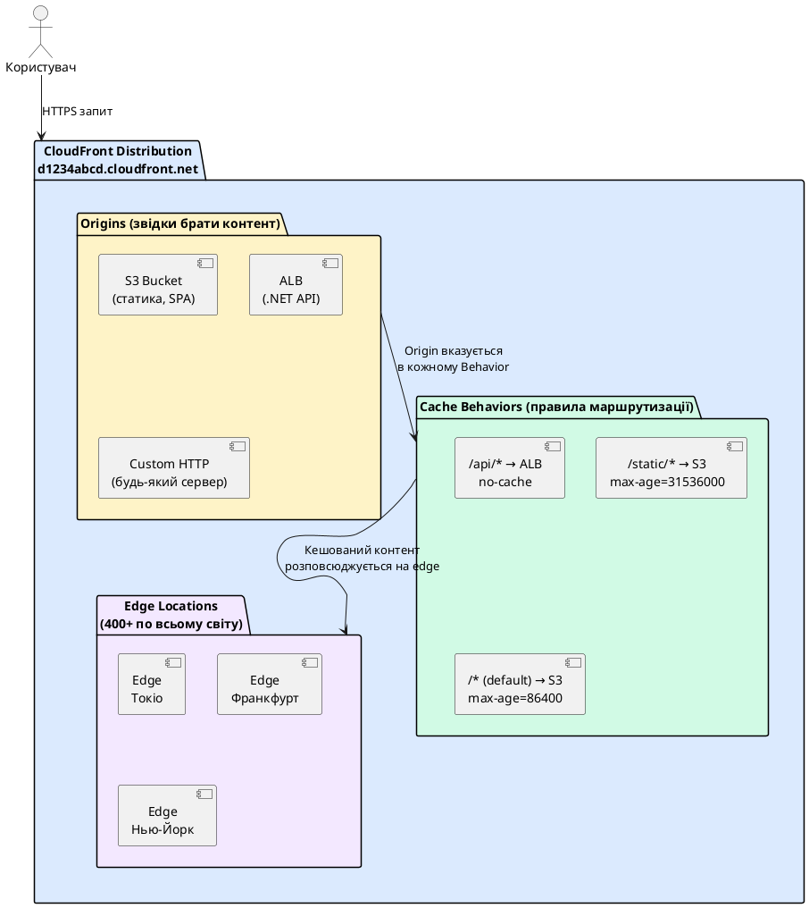

::

---

## Origins — звідки брати контент

**Origin** — це сервер або сховище, який є **першоджерелом** контенту. CloudFront звертається до Origin лише при **cache miss** — тобто коли потрібного файлу ще немає в кеші найближчого edge або його TTL закінчився. Для всіх інших запитів CloudFront відповідає безпосередньо з edge-кешу, Origin при цьому не навантажується.

Один Distribution може мати **кілька Origins** — наприклад, S3 для статики і ALB для API.

### S3 Origin з OAC (рекомендовано)

Найпоширеніший сценарій: React SPA або статичний сайт зберігається у S3, а CloudFront роздає його по всьому світу.

**Проблема безпеки:** якщо S3 bucket публічний — будь-хто може звернутись до нього напряму (обійшовши CloudFront і весь захист від DDoS, WAF тощо). Вирішення — **OAC (Origin Access Control)**.

**OAC** дозволяє зробити S3 bucket **повністю приватним** (Block Public Access увімкнений), але дозволити CloudFront читати файли. Технічно: CloudFront підписує кожен запит до S3 власним ключем за протоколом **AWS Signature Version 4 (SigV4)**. S3 перевіряє підпис і дозволяє запит тільки якщо він прийшов від вашого конкретного CloudFront Distribution.

::plant-uml

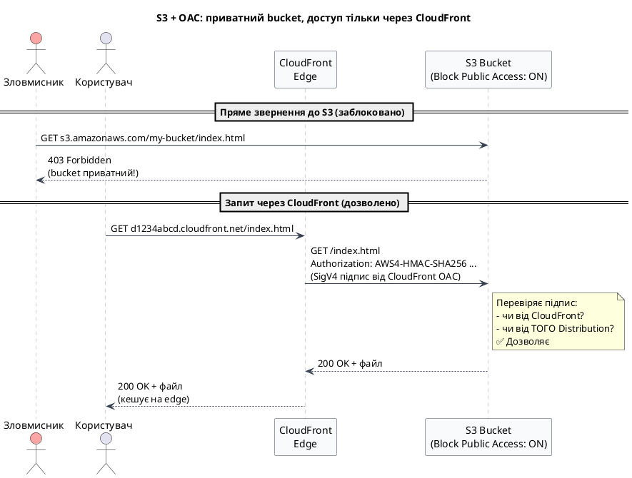

::

Bucket Policy при OAC виглядає так:

```json
{
    "Statement": [
        {
            "Effect": "Allow",
            "Principal": { "Service": "cloudfront.amazonaws.com" },
            "Action": "s3:GetObject",
            "Resource": "arn:aws:s3:::my-app-bucket/*",
            "Condition": {
                "StringEquals": {
                    "AWS:SourceArn": "arn:aws:cloudfront::123456789012:distribution/EDFDVBD6EXAMPLE"
                }
            }
        }
    ]
}
```

Умова `AWS:SourceArn` — це найважливіша частина: навіть інші CloudFront Distribution (наприклад, конкурентів) не зможуть читати ваш bucket. Дозволений лише **конкретний** Distribution.

### ALB Origin

CloudFront ставиться перед **Application Load Balancer** — типово для архітектури, де є бекенд (.NET API, Node.js). ALB розподіляє трафік між EC2-інстансами або контейнерами.

**Навіщо CloudFront перед ALB?**

- Кешування GET-відповідей API (публічні дані: каталоги, статті)
- SSL-термінація на edge замість на ALB (швидше для далеких користувачів)
- DDoS-захист: мільйони запитів поглинаються на edge, до ALB доходить нормальний трафік
- Єдиний домен для SPA і API: `app.example.com/` → S3, `app.example.com/api/` → ALB

### Custom HTTP Origin

Будь-який HTTP/HTTPS сервер — сервер у вашому офісі (on-premises), VPS, або навіть інший хмарний провайдер. CloudFront виступає як глобальний CDN-акселератор перед будь-яким HTTP-сервером незалежно від місця розташування.

---

## Origin Groups та Origin Failover — висока доступність

**Origin Group** — це логічне об'єднання двох Origins: **primary** (основний) та **secondary** (резервний). Якщо primary Origin повертає помилку, CloudFront автоматично повторює запит до secondary — без участі клієнта, прозоро.

**Коли спрацьовує failover?** За замовчуванням CloudFront перемикається при таких HTTP статусах від primary Origin: `500`, `502`, `503`, `504`. Ви можете налаштувати конкретний список кодів — наприклад, додати `403` якщо хочете перемикатись і при проблемах з авторизацією.

**Типовий сценарій:** S3 bucket у `eu-central-1` (primary) + S3 bucket у `us-east-1` (secondary) з увімкненою **Cross-Region Replication**. AWS автоматично реплікує об'єкти між bucket'ами. При регіональному збої CloudFront починає роздавати контент з резервного регіону.

::plant-uml

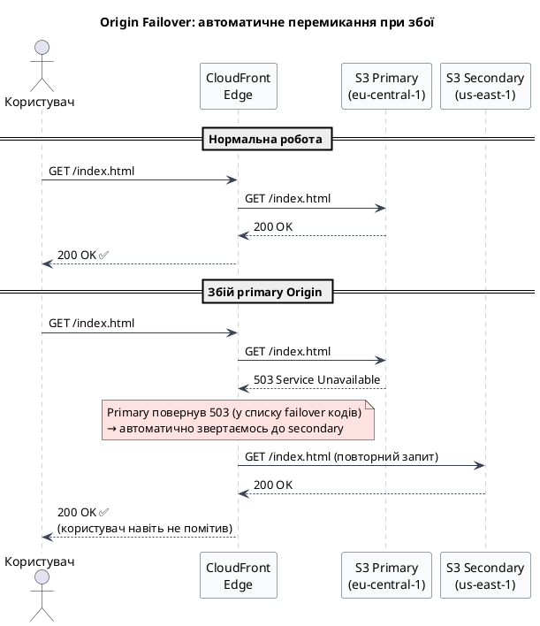

::

**Origin Group vs Route 53 Failover:** Route 53 failover перемикає DNS-записи (займає час на TTL). Origin Group перемикається на рівні CloudFront — миттєво, у межах одного HTTP-запиту клієнта. Для статики Origin Group є кращим варіантом.

**Обмеження:** failover спрацьовує тільки для **GET та HEAD** запитів. POST, PUT, DELETE CloudFront не повторює автоматично — небезпечно (мутації не можна безпечно повторювати).

---

## Cache Behaviors — правила для різних URL-шляхів

**Cache Behavior** — це правило, яке визначає: для запитів на певний URL-шлях — до якого Origin звертатись і як кешувати відповідь.

**Проблема, яку вирішує:** у реальному застосунку різний контент має абсолютно різні вимоги до кешування:

- Статичні JS/CSS — кешувати рік
- API `/api/articles` — кешувати 60 секунд
- API `/api/profile` — не кешувати взагалі (персональні дані!)
- API `POST /api/orders` — не кешувати (мутація)

Один Distribution може мати **багато Behaviors**. CloudFront перебирає їх зверху вниз і застосовує перший що підходить. **Default behavior** (`*`) — завжди останній, спрацьовує якщо жодне інше правило не підійшло.

::plant-uml

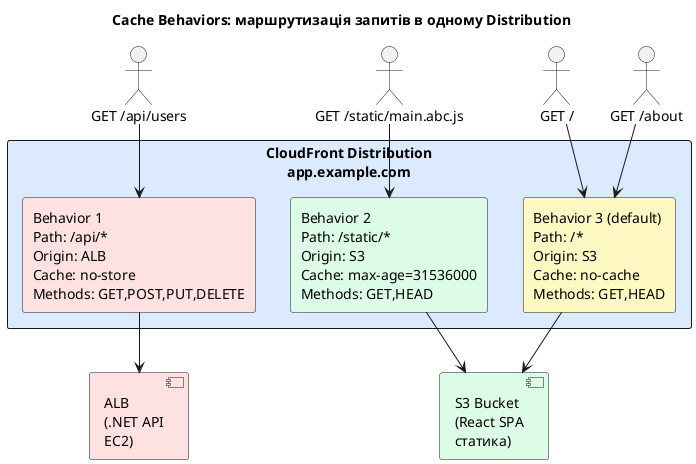

::

Практичний приклад для React SPA + .NET API:

| Path Pattern   | Origin | Cache-Control                 | Allowed Methods                              | Compress |
| -------------- | ------ | ----------------------------- | -------------------------------------------- | -------- |
| `/api/*`       | ALB    | `no-store` (з Origin)         | GET, HEAD, POST, PUT, DELETE, PATCH, OPTIONS | No       |
| `/static/*`    | S3     | `max-age=31536000, immutable` | GET, HEAD                                    | Yes      |
| `/*` (default) | S3     | `no-cache` (index.html)       | GET, HEAD                                    | Yes      |

Завдяки цьому `app.example.com` і `app.example.com/api/users` — **один домен**, один SSL-сертифікат, але принципово різна логіка обробки.

---

## Cache Keys та Cache Policies — що саме кешується

**Cache Key** — це унікальний ідентифікатор, за яким CloudFront шукає і зберігає запис у кеші. За замовчуванням cache key = лише **URL path**: запити `GET /products` і `GET /products` потраплять в один кеш-запис незалежно від будь-яких заголовків, cookies чи query string.

Це може бути як правильно, так і катастрофічно — залежить від ситуації.

**Сценарій 1 — все добре:** ви роздаєте публічний список продуктів. URL `/api/products` дає однакову відповідь для всіх. Cache key = тільки URL — ідеально, high cache hit rate.

**Сценарій 2 — катастрофа:** ваш `/api/products` повертає різний контент залежно від cookie `region=UA` або `region=DE`. Якщо CloudFront не включає cookie у cache key — **перший запит** від українського користувача закешовується, і всі наступні (включно з німецькими) отримують кеш для України. Це критичний баг.

### Cache Policy

**Cache Policy** — це окремий об'єкт конфігурації, що прикріплюється до Cache Behavior і визначає три речі:

1. **Що входить у cache key** — query string, cookies, заголовки
2. **TTL** — мінімальний, максимальний та дефолтний TTL
3. **Стиснення** — gzip/brotli

CloudFront має набір **Managed Cache Policies**, що покривають більшість сценаріїв без ручного налаштування:

| Managed Policy                           | Cache Key  | TTL      | Використання                     |
| ---------------------------------------- | ---------- | -------- | -------------------------------- |
| `CachingOptimized`                       | тільки URL | 1 рік    | Статика з hash-іменами           |
| `CachingDisabled`                        | —          | 0        | API без кешу                     |
| `CachingOptimizedForUncompressedObjects` | тільки URL | 1 рік    | Файли що вже стиснені (zip, mp4) |
| `UseOriginCacheControlHeaders`           | тільки URL | з Origin | Довіряємо Cache-Control з Origin |

### Origin Request Policy

Важливо розрізняти: **що в cache key** ≠ **що CloudFront надсилає до Origin**.

**Cache Policy** визначає cache key. **Origin Request Policy** — що CloudFront додає до запиту при зверненні до Origin (наприклад, передати `Accept-Language` заголовок до Origin, але не включати його у cache key). Це незалежні налаштування.

::plant-uml

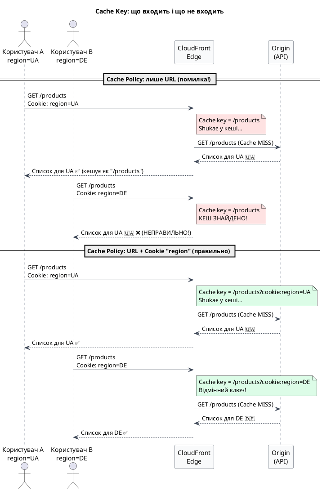

::

::caution
**Правило безпеки:** якщо ваш Origin повертає різний контент залежно від cookie авторизації (`session_id`, `jwt`) — **обов'язково** або включіть ці cookies у cache key, або вимкніть кешування (`CachingDisabled`) для цього Behavior. Інакше один користувач може побачити дані іншого.
::

---

## CloudFront Functions та Lambda@Edge — код на edge

CloudFront дозволяє виконувати JavaScript прямо на edge-серверах — **до того як запит дійшов до Origin**, або **до того як відповідь пішла до браузера**. Це дозволяє трансформувати запити/відповіді без звернення до вашого сервера.

Є чотири точки, де можна "вставити" свою логіку:

::plant-uml

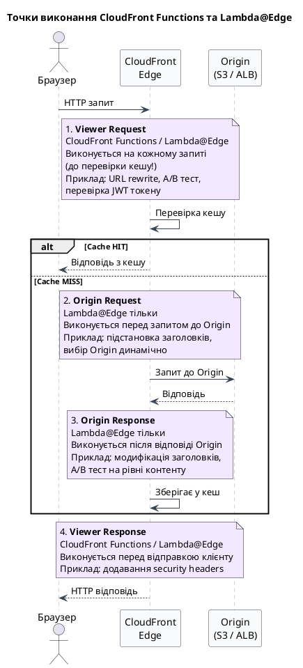

::

### CloudFront Functions vs Lambda@Edge: коли що

| Характеристика       | CloudFront Functions                    | Lambda@Edge                                             |
| -------------------- | --------------------------------------- | ------------------------------------------------------- |
| Де виконується       | На всіх 400+ edge locations             | У ~13 регіональних кешах                                |
| Час виконання        | < 1 мс (жорсткий ліміт)                 | до 5 с (origin req) / 30 с (origin resp)                |
| Мережеві запити      | ❌ Неможливо                            | ✅ Можна (HTTP виклики до API)                          |
| Доступ до body       | ❌ Тільки заголовки та URI              | ✅ Повний доступ                                        |
| Мова                 | JavaScript (ES5.1)                      | Node.js або Python                                      |
| Ціна                 | $0.10 / 1M запитів                      | $0.60 / 1M запитів                                      |
| Коли використовувати | URL rewrite, redirect, security headers | Аутентифікація, A/B з зовнішнім API, трансформація body |

**Приклад 1 — CloudFront Function: index.html fallback для React Router**

React Router обробляє маршрути клієнтсайд (`/about`, `/users/123`). Але якщо CloudFront отримує запит `GET /about` — він шукає у S3 файл з назвою `about`, не знаходить і повертає 403. Потрібно переписати всі SPA-маршрути на `/index.html`:

```javascript
function handler(event) {
    var request = event.request
    var uri = request.uri

    // Якщо URI має розширення файлу (.js, .css, .png) — віддаємо як є
    // Якщо URI без розширення — це SPA-маршрут, перенаправляємо на index.html
    if (!uri.includes('.')) {
        request.uri = '/index.html'
    }

    return request
}
```

**Приклад 2 — CloudFront Function: security headers у відповіді**

Додавання HTTP security headers до кожної відповіді без змін у backend:

```javascript
function handler(event) {
    var response = event.response
    var headers = response.headers

    // Захист від clickjacking
    headers['x-frame-options'] = { value: 'DENY' }
    // Захист від MIME-sniffing
    headers['x-content-type-options'] = { value: 'nosniff' }
    // HSTS: змушує браузер завжди використовувати HTTPS
    headers['strict-transport-security'] = {
        value: 'max-age=63072000; includeSubDomains; preload',
    }
    // Content Security Policy
    headers['content-security-policy'] = {
        value: "default-src 'self'; script-src 'self'",
    }

    return response
}
```

---

## Cache Invalidation — примусове оновлення кешу

Уявіть ситуацію: ви задеплоїли нову версію сайту. Файл `index.html` у S3 оновлено. Але CloudFront закешував старий `index.html` з TTL 24 години — і ще 23 години роздаватиме стару версію всім користувачам у світі.

**Cache Invalidation** — це команда CloudFront **негайно** викинути вказані файли з кешу всіх edge locations. При наступному запиті edge буде змушений завантажити свіжу версію з Origin.

::plant-uml

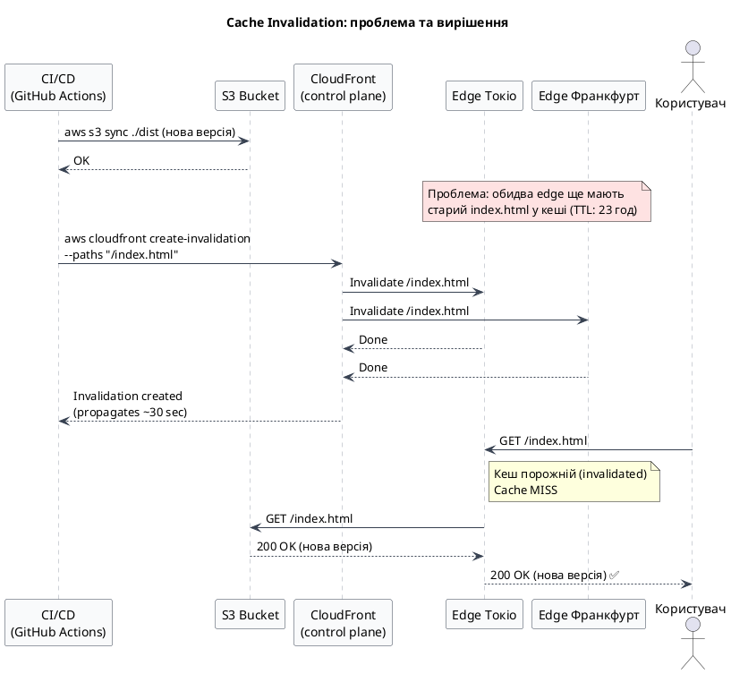

::

```bash
# Інвалідувати тільки index.html (оптимальний підхід для React SPA)
aws cloudfront create-invalidation \
    --distribution-id EDFDVBD6EXAMPLE \
    --paths "/index.html" \
    --region us-east-1

# Інвалідувати кілька файлів
aws cloudfront create-invalidation \
    --distribution-id EDFDVBD6EXAMPLE \
    --paths "/index.html" "/asset-manifest.json" "/robots.txt" \
    --region us-east-1

# Інвалідувати весь кеш (/* = один path у рахунку)
aws cloudfront create-invalidation \
    --distribution-id EDFDVBD6EXAMPLE \
    --paths "/*" \
    --region us-east-1
```

**Чому React SPA потребує інвалідації лише `index.html`?**

Vite та CRA генерують JS/CSS файли з **content hash** у назві: `main.a1b2c3d4.js`. Hash — це відбиток вмісту файлу. Якщо вміст змінився — змінюється hash, отже й URL (`main.a1b2c3d4.js` → `main.e5f6g7h8.js`). Новий URL CloudFront ще ніколи не бачив — отже одразу піде за ним до S3. Старий файл у кеші так і залишиться, але до нього вже ніхто не звернеться (бо `index.html` вказує на новий URL).

Тому достатньо інвалідувати тільки `index.html` — він вказує на актуальні версії всіх файлів.

::caution
**Вартість:** перші **1 000 invalidation paths** на місяць безкоштовно. Далі $0.005 за кожен path. `/*` вважається одним path незалежно від кількості файлів у кеші — тому `/*` завжди вигідніший за перерахування 500 файлів окремо.
::

---

## Versioning vs Invalidation — стратегії оновлення контенту

Є дві принципово різні стратегії, що забезпечують доставку актуального контенту після деплою:

**Стратегія 1 — Invalidation (явне очищення кешу):** ви залишаєте ті самі URL, але після кожного деплою виконуєте `create-invalidation`, щоб CloudFront забув старі копії.

**Стратегія 2 — File Versioning (іменовані версії):** ви змінюєте URL файлу при кожній зміні вмісту. Старий URL нікуди не зникає — він просто більше не використовується. Новий URL CloudFront ще не бачив → автоматично завантажить з Origin.

Versioning буває двох форм:

- **Content hash:** `bundle.a1b2c3.js` — hash залежить від вмісту. Якщо файл не змінився — hash той самий, URL той самий, кеш не стає недійсним. Якщо змінився — новий hash, новий URL.
- **Explicit version:** `bundle.v2.js` або `/api/v2/products` — ручне версіонування.

::plant-uml

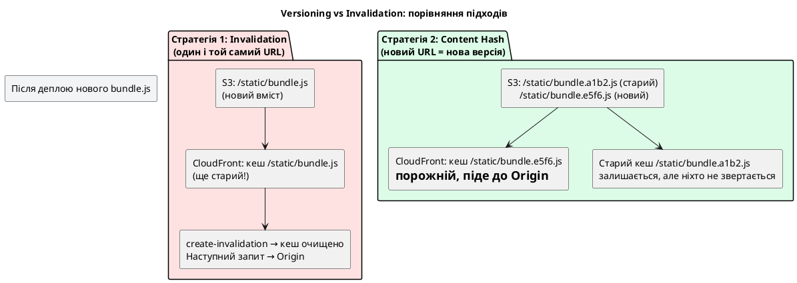

::

### Порівняння стратегій

| Критерій               | Invalidation                                        | Content Hash Versioning                       |
| ---------------------- | --------------------------------------------------- | --------------------------------------------- |
| Гарантія оновлення     | Так, але ~30 сек propagation                        | Миттєво (новий URL)                           |
| Вартість               | Перші 1000 безкоштовно, далі $0.005/path            | Безкоштовно                                   |
| Складність деплою      | `create-invalidation` команда                       | Вбудовано у build інструменти (Vite, webpack) |
| Якщо щось пішло не так | Легкий rollback: видати старий файл                 | Складніший: потрібно оновити посилання        |
| Підходить для          | `index.html`, `robots.txt`, будь-які файли без hash | JS, CSS, зображення — усе що проходить build  |
| TTL у Cache-Control    | Зазвичай `no-cache` або короткий                    | `max-age=31536000, immutable` (рік)           |

### Рекомендована гібридна стратегія (React / Vite)

Обидва підходи не виключають один одного — навпаки, правильна архітектура поєднує їх:

| Файл                               | Стратегія                     | Cache-Control                 | Пояснення                               |
| ---------------------------------- | ----------------------------- | ----------------------------- | --------------------------------------- |
| `index.html`                       | Invalidation                  | `no-cache`                    | Точка входу, завжди повинна бути свіжою |
| `asset-manifest.json`              | Invalidation                  | `no-cache`                    | Список актуальних хешованих файлів      |
| `static/js/*.abc123.js`            | Content Hash                  | `max-age=31536000, immutable` | Hash у назві = нова назва при змінах    |
| `static/css/*.def456.css`          | Content Hash                  | `max-age=31536000, immutable` | Аналогічно                              |
| `favicon.ico`, зображення без hash | Invalidation або короткий TTL | `max-age=86400`               | Оновлюються рідко                       |

Логіка: `index.html` завжди свіжий (invalidation або `no-cache`) → він посилається на актуальні хешовані JS/CSS → ті закешовані на рік → CloudFront витрачає bandwidth лише на дійсно змінені файли.

---

## Практичний приклад: React SPA на S3 + CloudFront + HTTPS від А до Я

### Передумови

Цей практичний приклад є **продовженням** [Практичного прикладу з Модуля 6 — Amazon S3](/13.aws/06.s3). Якщо ви ще не проходили той модуль — поверніться до розділу «Практичний приклад: React SPA на S3 від А до Я» та виконайте всі кроки. Ми продовжуємо роботу з тим самим React застосунком та bucket `my-react-app-2024`.

**Ключова архітектурна відмінність:** у Модулі 6 bucket був **публічним** — увімкнений S3 Static Website Hosting, відкрита Bucket Policy. У цьому прикладі переходимо на **приватну** архітектуру з CloudFront + OAC — безпечніший production-підхід. Крок 1 цілком присвячений цьому переходу.

Переконайтесь:

- AWS CLI встановлений та налаштований (`aws configure`)

::caution
**Важливо про регіони та CloudFront!** ACM сертифікат для CloudFront ОБОВ'ЯЗКОВО повинен бути створений у регіоні **`us-east-1` (US East, N. Virginia)**, навіть якщо ваш S3 та решта інфраструктури у `eu-central-1`. Це глобальна вимога AWS — якщо сертифікат в іншому регіоні, він просто не з'явиться у списку при налаштуванні Distribution.
::

---

### Крок 1: Підготовка S3 bucket — перехід з публічного на приватний

У Модулі 6 bucket був публічним: увімкнено **S3 Static Website Hosting**, Bucket Policy дозволяла `s3:GetObject` для `"Principal": "*"`. Для CloudFront + OAC це потрібно повністю прибрати — bucket має бути **закритим**, доступ тільки через CloudFront SigV4-підписаними запитами.

Три обов'язкові дії:

```bash
BUCKET="my-react-app-2024"

# 1. Вимкнути S3 Static Website Hosting (більше не потрібен — CloudFront сам роздає файли)
aws s3api delete-bucket-website \
    --bucket $BUCKET \
    --region eu-central-1

# 2. Увімкнути Block Public Access
aws s3api put-public-access-block \
    --bucket $BUCKET \
    --public-access-block-configuration \
        "BlockPublicAcls=true,IgnorePublicAcls=true,BlockPublicPolicy=true,RestrictPublicBuckets=true" \
    --region eu-central-1

# 3. Видалити публічну Bucket Policy (яка була для Static Website Hosting)
aws s3api delete-bucket-policy --bucket $BUCKET --region eu-central-1

echo "Bucket $BUCKET тепер приватний. Перевіряємо файли..."
aws s3 ls s3://$BUCKET/ --region eu-central-1
```

::terminal-preview{title="Перевірка файлів у bucket"}

<div class="line"><span class="opacity-40">$</span> <strong>aws s3 ls s3://my-react-app-2024/</strong></div>
<div class="line">                           PRE static/</div>
<div class="line">2024-01-15 10:30:00      1024 index.html</div>
<div class="line">2024-01-15 10:30:00      3442 favicon.ico</div>
<div class="line">2024-01-15 10:30:00       492 asset-manifest.json</div>
<div class="line">2024-01-15 10:30:00       671 robots.txt</div>

::

Після цих дій стара адреса `http://my-react-app-2024.s3-website.eu-central-1.amazonaws.com/` повертатиме **403 Forbidden** — це очікувана поведінка. Прямий доступ до S3 більше не працює, і це правильно.

::note
Якщо `aws s3 ls` нічого не виводить — bucket порожній. Поверніться до Модуля 6 і виконайте `npm run build && aws s3 sync ./build s3://my-react-app-2024/ --delete --region eu-central-1`, потім повертайтесь сюди.
::

---

### Крок 2: Створення CloudFront Distribution

::tabs

::tabs-item{label="AWS Console"}

1. Відкрийте **CloudFront** у AWS Console
2. Натисніть **Create distribution**

**Origin settings:**

- **Origin domain:** у dropdown оберіть ваш S3 bucket `my-react-app-2024.s3.eu-central-1.amazonaws.com`
- **Origin access:** оберіть **Origin access control settings (recommended)** (це OAC, не OAI!)
- Натисніть **Create new OAC** → Name: `my-react-app-oac` → **Create**
- AWS покаже жовте попередження «You must update the S3 bucket policy» — це нормально, зробимо це пізніше

**Default cache behavior:**

- **Viewer protocol policy:** `Redirect HTTP to HTTPS` _(автоматично перенаправляти з http на https)_
- **Allowed HTTP methods:** GET, HEAD
- **Compress objects automatically:** Yes

**Settings:**

- **Price class:** `Use only North America, Europe, Asia, Middle East, and Africa` _(дешевше за All Edge Locations — ваша аудиторія переважно в цих регіонах)_
- **Alternate domain names (CNAMEs):** залиште порожнім поки що (додамо пізніше після отримання сертифіката)
- **Custom SSL certificate:** залиште `Default CloudFront certificate` поки що
- **Default root object:** `index.html` _(що повертати при запиті `/`)_

3. Натисніть **Create distribution**
4. **Зачекайте 5–15 хвилин** поки Distribution розгорнеться на всіх edge locations. Статус зміниться з `In Progress` на `Deployed`
5. Запишіть **Distribution domain name**: `d1234abcd.cloudfront.net`
6. Запишіть **Distribution ID**: `EDFDVBD6EXAMPLE` (знадобиться для CLI команд)

::

::tabs-item{label="AWS CLI"}

```bash
BUCKET="my-react-app-2024"
REGION="eu-central-1"

# Крок 2a: Створити OAC (Origin Access Control)
OAC_ID=$(aws cloudfront create-origin-access-control \
    --origin-access-control-config '{
        "Name": "my-react-app-oac",
        "OriginAccessControlOriginType": "s3",
        "SigningBehavior": "always",
        "SigningProtocol": "sigv4"
    }' \
    --query "OriginAccessControl.Id" --output text)
echo "OAC ID: $OAC_ID"

# Крок 2b: Створити Distribution
DIST_OUTPUT=$(aws cloudfront create-distribution \
    --distribution-config '{
        "CallerReference": "react-spa-'$(date +%s)'",
        "Comment": "React SPA distribution",
        "DefaultRootObject": "index.html",
        "Origins": {
            "Quantity": 1,
            "Items": [{
                "Id": "S3Origin",
                "DomainName": "'$BUCKET'.s3.'$REGION'.amazonaws.com",
                "S3OriginConfig": {"OriginAccessIdentity": ""},
                "OriginAccessControlId": "'$OAC_ID'"
            }]
        },
        "DefaultCacheBehavior": {
            "TargetOriginId": "S3Origin",
            "ViewerProtocolPolicy": "redirect-to-https",
            "CachePolicyId": "658327ea-f89d-4fab-a63d-7e88639e58f6",
            "Compress": true,
            "AllowedMethods": {
                "Quantity": 2,
                "Items": ["GET", "HEAD"],
                "CachedMethods": {"Quantity": 2, "Items": ["GET", "HEAD"]}
            }
        },
        "Enabled": true,
        "PriceClass": "PriceClass_200",
        "HttpVersion": "http2and3"
    }')

DIST_ID=$(echo $DIST_OUTPUT | python3 -c "import sys,json; d=json.load(sys.stdin); print(d['Distribution']['Id'])")
DIST_DOMAIN=$(echo $DIST_OUTPUT | python3 -c "import sys,json; d=json.load(sys.stdin); print(d['Distribution']['DomainName'])")
echo "Distribution ID: $DIST_ID"
echo "Distribution Domain: $DIST_DOMAIN"
```

::

::

---

### Крок 3: Оновлення S3 Bucket Policy для OAC

Після створення Distribution і OAC — потрібно надати CloudFront доступ до закритого bucket:

::tabs

::tabs-item{label="AWS Console"}

1. AWS Console покаже банер: **«The S3 bucket policy needs to be updated»** → натисніть **Copy policy**
2. Перейдіть у **S3** → `my-react-app-2024` → **Permissions** → **Bucket policy** → **Edit**
3. Вставте скопійовану Policy → **Save changes**

::

::tabs-item{label="AWS CLI"}

```bash
# ЗАМІНІТЬ EDFDVBD6EXAMPLE на ваш реальний Distribution ID
# ЗАМІНІТЬ 123456789012 на ваш реальний Account ID
DIST_ID="EDFDVBD6EXAMPLE"
ACCOUNT_ID="123456789012"

cat > /tmp/cf-bucket-policy.json << EOF
{
    "Version": "2012-10-17",
    "Statement": [{
        "Sid": "AllowCloudFrontServicePrincipal",
        "Effect": "Allow",
        "Principal": {
            "Service": "cloudfront.amazonaws.com"
        },
        "Action": "s3:GetObject",
        "Resource": "arn:aws:s3:::$BUCKET/*",
        "Condition": {
            "StringEquals": {
                "AWS:SourceArn": "arn:aws:cloudfront::$ACCOUNT_ID:distribution/$DIST_ID"
            }
        }
    }]
}
EOF

aws s3api put-bucket-policy \
    --bucket $BUCKET \
    --policy file:///tmp/cf-bucket-policy.json \
    --region eu-central-1
```

::

::

Тепер перевіримо, що CloudFront роздає ваш React додаток:

::terminal-preview{title="Тест CloudFront domain"}

<div class="line"><span class="opacity-40">$</span> <strong>curl -I https://d1234abcd.cloudfront.net/</strong></div>
<div class="line">HTTP/2 200</div>
<div class="line">content-type: text/html</div>
<div class="line"><span class="text-green-400">x-cache: Miss from cloudfront</span></div>
<div class="line">via: 1.1 abc123.cloudfront.net (CloudFront)</div>
<div class="line"></div>
<div class="line"><span class="opacity-40">$</span> <strong>curl -I https://d1234abcd.cloudfront.net/</strong></div>
<div class="line">HTTP/2 200</div>
<div class="line"><span class="text-green-400">x-cache: Hit from cloudfront</span></div>

::

`x-cache: Miss from cloudfront` — перший запит, брав з S3. `x-cache: Hit from cloudfront` — повторний запит, відповів з кешу.

---

### Крок 4: Custom Error Pages для React Router

React Router використовує client-side navigation — маршрути обробляє JavaScript у браузері, а не сервер. Проблема: якщо користувач відкриє `https://yoursite.com/about` напряму або перезавантажить сторінку — CloudFront звернеться до S3 за файлом `/about`. Оскільки bucket приватний з OAC, S3 повертає **403 Forbidden** для будь-якого відсутнього об'єкта (не 404!). Це навмисна поведінка S3: не розкривати, які об'єкти існують, а які ні. CloudFront передає цей 403 браузеру — і замість React-додатку користувач бачить помилку.

**Custom Error Pages** вирішують це: CloudFront перехоплює 403/404 від Origin і відповідає клієнту вмістом `/index.html` зі статусом 200. Браузер завантажує React, React Router читає URL і рендерить правильну сторінку.

::tabs

::tabs-item{label="AWS Console"}

1. CloudFront → ваш Distribution → вкладка **Error pages**
2. **Create custom error response**:
    - HTTP error code: **403**
    - Customize error response: **Yes**
    - Response page path: `/index.html`
    - HTTP response code: **200**
3. Повторіть для **404**

::

::tabs-item{label="AWS CLI"}

```bash
# Крок 4a: Отримати поточний конфіг та ETag
DIST_JSON=$(aws cloudfront get-distribution-config \
    --id $DIST_ID --region us-east-1)
ETAG=$(echo $DIST_JSON | python3 -c "import sys,json; print(json.load(sys.stdin)['ETag'])")

# Крок 4b: Додати CustomErrorResponses до конфігу
echo $DIST_JSON | python3 -c "
import sys, json
d = json.load(sys.stdin)
config = d['DistributionConfig']
config['CustomErrorResponses'] = {
    'Quantity': 2,
    'Items': [
        {
            'ErrorCode': 403,
            'ResponsePagePath': '/index.html',
            'ResponseCode': '200',
            'ErrorCachingMinTTL': 10
        },
        {
            'ErrorCode': 404,
            'ResponsePagePath': '/index.html',
            'ResponseCode': '200',
            'ErrorCachingMinTTL': 10
        }
    ]
}
print(json.dumps(config))
" > /tmp/cf-error-config.json

# Крок 4c: Застосувати зміни
aws cloudfront update-distribution \
    --id $DIST_ID \
    --distribution-config file:///tmp/cf-error-config.json \
    --if-match $ETAG \
    --region us-east-1

echo "Custom error pages налаштовано. Зачекайте ~3 хв на розгортання."
```

::

::

---

### Крок 5: Налаштування Cache-Control заголовків для React

React build генерує файли з hash у назвах (`main.abc123.js`). При кожному `npm run build` hash змінюється — тому старі файли ніколи не конфліктують з новими. Це дозволяє кешувати JS/CSS на рік.

```bash
BUCKET="my-react-app-2024"

# index.html — без кешу (завжди свіжий)
aws s3 cp s3://$BUCKET/index.html s3://$BUCKET/index.html \
    --metadata-directive REPLACE \
    --content-type "text/html; charset=utf-8" \
    --cache-control "no-cache, no-store, must-revalidate" \
    --region eu-central-1

# JS файли з hash — кеш на 1 рік (незмінні!)
aws s3 cp s3://$BUCKET/static/js/ s3://$BUCKET/static/js/ \
    --recursive --metadata-directive REPLACE \
    --content-type "application/javascript" \
    --cache-control "public, max-age=31536000, immutable" \
    --region eu-central-1

# CSS файли — кеш на 1 рік
aws s3 cp s3://$BUCKET/static/css/ s3://$BUCKET/static/css/ \
    --recursive --metadata-directive REPLACE \
    --content-type "text/css" \
    --cache-control "public, max-age=31536000, immutable" \
    --region eu-central-1
```

Або ще краще — автоматизуйте у `deploy.sh`:

```bash
#!/bin/bash
# deploy.sh — повний скрипт деплою React SPA
set -e  # зупинитись при будь-якій помилці

BUCKET="my-react-app-2024"
DIST_ID="EDFDVBD6EXAMPLE"  # ЗАМІНІТЬ на ваш Distribution ID

echo "1. Building React app..."
npm run build

echo "2. Uploading JS/CSS (long cache)..."
aws s3 sync ./build/static s3://$BUCKET/static \
    --cache-control "public, max-age=31536000, immutable" \
    --delete --region eu-central-1

echo "3. Uploading other assets..."
aws s3 sync ./build s3://$BUCKET \
    --exclude "index.html" --exclude "static/*" \
    --cache-control "public, max-age=86400" \
    --delete --region eu-central-1

echo "4. Uploading index.html (no cache)..."
aws s3 cp ./build/index.html s3://$BUCKET/index.html \
    --cache-control "no-cache, no-store, must-revalidate" \
    --content-type "text/html; charset=utf-8" \
    --region eu-central-1

echo "5. Invalidating CloudFront cache (index.html only)..."
aws cloudfront create-invalidation \
    --distribution-id $DIST_ID \
    --paths "/index.html" "/asset-manifest.json" \
    --region us-east-1  # CloudFront завжди us-east-1!

echo "Done! Site deployed."
```

---

### Крок 6: Підключення власного домену через pp.ua (безкоштовно)

**pp.ua** — безкоштовний сервіс для реєстрації субдоменів третього рівня в зоні `.pp.ua`. Ви можете безкоштовно отримати домен виду `yourname.pp.ua` і прив'язати його до CloudFront. Це ідеальний варіант для студентів та навчальних проєктів.

**Загальна схема:**

```
yourname.pp.ua
    ↓ CNAME запис (DNS)
d1234abcd.cloudfront.net
    ↓ CloudFront Distribution
S3 bucket (React SPA)
```

#### Крок 6a: Реєстрація на pp.ua

1. Перейдіть на [https://pp.ua](https://pp.ua)
2. Введіть бажане ім'я субдомену, наприклад `my-react-app`
3. Натисніть перевірку — якщо `my-react-app.pp.ua` вільний, зареєструйте
4. Введіть email, пароль → підтвердіть email
5. Увійдіть у панель управління доменом

#### Крок 6b: Отримання ACM SSL сертифіката (ОБОВ'ЯЗКОВО у us-east-1!)

::caution
ACM сертифікат для CloudFront ПОВИНЕН бути у регіоні `us-east-1`. Навіть якщо ваш S3 у Франкфурті. Якщо сертифікат в іншому регіоні — CloudFront просто не покаже його у списку. Переключіться у Console на `us-east-1` перед наступними кроками!
::

::tabs

::tabs-item{label="AWS Console"}

1. Переключіть регіон у Console на **US East (N. Virginia) us-east-1** (важливо!)
2. Відкрийте **ACM (Certificate Manager)**
3. **Request a certificate** → **Request a public certificate** → **Next**
4. **Fully qualified domain name:** `my-react-app.pp.ua`
5. **Validation method:** DNS validation
6. **Request**
7. Відкрийте щойно створений сертифікат → у розділі **Domains** → скопіюйте CNAME запис для валідації:
    - **CNAME name:** `_abc123.my-react-app.pp.ua` (скопіюйте повністю)
    - **CNAME value:** `_def456.acm-validations.aws.` (скопіюйте повністю)

::

::tabs-item{label="AWS CLI"}

```bash
# ВАЖЛИВО: --region us-east-1 (не eu-central-1!)
CERT_ARN=$(aws acm request-certificate \
    --domain-name "my-react-app.pp.ua" \
    --validation-method DNS \
    --region us-east-1 \
    --query CertificateArn --output text)
echo "Certificate ARN: $CERT_ARN"

# Отримати CNAME запис для DNS валідації
aws acm describe-certificate \
    --certificate-arn $CERT_ARN \
    --region us-east-1 \
    --query "Certificate.DomainValidationOptions[0].ResourceRecord"
# Виведе:
# {
#     "Name": "_abc123.my-react-app.pp.ua.",
#     "Type": "CNAME",
#     "Value": "_def456.acm-validations.aws."
# }
```

::

::

#### Крок 6c: Додавання DNS записів у pp.ua

У панелі pp.ua вам потрібно додати **два CNAME записи**:

**Запис 1 — для валідації сертифіката ACM:**

Зайдіть у панель pp.ua → DNS Management → Add Record:

- **Type:** CNAME
- **Name/Host:** `_abc123` _(лише частина до `.my-react-app.pp.ua` — приставку домену не вводьте)_
- **Value/Target:** `_def456.acm-validations.aws.`
- **TTL:** 300

::note
У деяких DNS панелях потрібно вводити повне ім'я (`_abc123.my-react-app.pp.ua`), а в інших — лише частину до домену (`_abc123`). Спробуйте обидва варіанти і перевірте через `nslookup`.
::

Зачекайте 5–30 хвилин поки ACM перевірить DNS запис. Статус сертифіката зміниться з `Pending validation` на **`Issued`**.

**Запис 2 — для підключення домену до CloudFront:**

Зайдіть у pp.ua → DNS Management → Add Record:

- **Type:** CNAME
- **Name/Host:** `my-react-app` _(або `@` якщо хочете щоб `pp.ua` вказував на корінь, але субдомен краще)_
- **Value/Target:** `d1234abcd.cloudfront.net` _(ваш CloudFront domain name)_
- **TTL:** 300

Перевірка через термінал:

::terminal-preview{title="DNS перевірка CNAME"}

<div class="line"><span class="opacity-40">$</span> <strong>nslookup -type=CNAME my-react-app.pp.ua</strong></div>
<div class="line">Server:  1.1.1.1</div>
<div class="line">Address: 1.1.1.1#53</div>
<div class="line"></div>
<div class="line">Non-authoritative answer:</div>
<div class="line"><span class="text-green-400">my-react-app.pp.ua  canonical name = d1234abcd.cloudfront.net.</span></div>

::

**Що таке `nslookup`?** Це консольна утиліта для перевірки DNS записів. `nslookup -type=CNAME domain` показує CNAME запис для домену. Якщо бачите `d1234abcd.cloudfront.net` — DNS налаштований правильно.

#### Крок 6d: Додавання домену у CloudFront Distribution

Тепер потрібно сказати CloudFront що він обслуговує ваш домен:

::tabs

::tabs-item{label="AWS Console"}

1. CloudFront → ваш Distribution → вкладка **General** → **Edit**
2. **Alternate domain names (CNAMEs):** додайте `my-react-app.pp.ua`
3. **Custom SSL certificate:** оберіть ваш ACM сертифікат `my-react-app.pp.ua` (має бути в списку, якщо він `Issued` у us-east-1)
4. **Save changes**
5. Зачекайте 3–5 хвилин поки зміни розгорнуться

::

::tabs-item{label="AWS CLI"}

```bash
# Отримати поточну конфігурацію
DIST_CONFIG=$(aws cloudfront get-distribution-config \
    --id $DIST_ID --region us-east-1)
ETAG=$(echo $DIST_CONFIG | python3 -c "import sys,json; print(json.load(sys.stdin)['ETag'])")

# Зберегти конфіг у файл і відредагувати
echo $DIST_CONFIG | python3 -c "import sys,json; d=json.load(sys.stdin); print(json.dumps(d['DistributionConfig'], indent=2))" > /tmp/dist-config.json

# Відредагуйте /tmp/dist-config.json вручну:
# Додайте в "Aliases": {"Quantity": 1, "Items": ["my-react-app.pp.ua"]}
# Додайте "ViewerCertificate" з вашим CERT_ARN

# Оновити Distribution
aws cloudfront update-distribution \
    --id $DIST_ID \
    --distribution-config file:///tmp/dist-config.json \
    --if-match $ETAG \
    --region us-east-1
```

::

::

Тепер відкрийте у браузері: **`https://my-react-app.pp.ua`** 🎉

::terminal-preview{title="Фінальна перевірка"}

<div class="line"><span class="opacity-40">$</span> <strong>curl -I https://my-react-app.pp.ua/</strong></div>
<div class="line">HTTP/2 200</div>
<div class="line">content-type: text/html; charset=utf-8</div>
<div class="line"><span class="text-green-400">x-cache: Hit from cloudfront</span></div>
<div class="line">via: 1.1 abc123.cloudfront.net (CloudFront)</div>
<div class="line">server: AmazonS3</div>
<div class="line">cache-control: no-cache, no-store, must-revalidate</div>

::

---

### Крок 7 (опціонально): Підключення платного домену через Route 53

Якщо у вас є власний домен (куплений у будь-якого реєстратора: GoDaddy, Namecheap, Porkbun тощо) — процес аналогічний pp.ua, але через Route 53.

1. **Route 53** → **Hosted zones** → **Create hosted zone** → введіть ваш домен
2. Route 53 надасть 4 NS-сервери (наприклад `ns-1234.awsdns-12.org`) — вкажіть їх у вашого реєстратора
3. **ACM сертифікат** (у `us-east-1`) → DNS validation → Route 53 додасть CNAME автоматично (кнопка **Create records in Route 53**)
4. **Route 53 → Hosted zone → Create record:**
    - **Record name:** `app` (для `app.example.com`)
    - **Record type:** `A`
    - ✅ **Alias → CloudFront distribution** (оберіть вашу Distribution)
    - Route 53 + CloudFront краще використовувати `A record` з Alias замість CNAME — це ефективніше і коштує менше

---

### Крок 8: ОБОВ'ЯЗКОВО — Очищення

::caution
CloudFront Distribution коштує ~$0.0085 за 10,000 HTTPS запитів + трафік. Для навчального проєкту з нульовим трафіком — практично безкоштовно. Але якщо не потрібен — вимкніть.
::

```bash
# Через Console (найпростіше):
# CloudFront → Distribution → Disable → зачекати статус Deployed → Delete

# Через CLI:
DIST_JSON=$(aws cloudfront get-distribution-config \
    --id $DIST_ID --region us-east-1)
ETAG=$(echo $DIST_JSON | python3 -c "import sys,json; print(json.load(sys.stdin)['ETag'])")

# Встановити Enabled: false
echo $DIST_JSON | python3 -c "
import sys, json
d = json.load(sys.stdin)
config = d['DistributionConfig']
config['Enabled'] = False
print(json.dumps(config))
" > /tmp/disable-dist.json

aws cloudfront update-distribution \
    --id $DIST_ID \
    --distribution-config file:///tmp/disable-dist.json \
    --if-match $ETAG \
    --region us-east-1

echo "Distribution вимкнено. Зачекайте статус Deployed (~5-10 хв), потім видаліть."

# Після статусу Deployed — отримати новий ETag і видалити
NEW_ETAG=$(aws cloudfront get-distribution-config \
    --id $DIST_ID --region us-east-1 --query "ETag" --output text)
aws cloudfront delete-distribution \
    --id $DIST_ID --if-match $NEW_ETAG --region us-east-1
```

---

## Резюме

- **CDN** — глобальна мережа серверів, що кешують контент поблизу користувача. Вирішує проблему latency та зменшує навантаження на Origin.
- **CloudFront** — CDN від AWS. 400+ Edge Locations. Кешує контент, термінує SSL, захищає від DDoS.
- **Distribution** — одиниця конфігурації CloudFront. Містить Origins, Behaviors, домени, SSL.
- **OAC (Origin Access Control)** — правильний спосіб підключити закритий S3 до CloudFront. Bucket залишається приватним.
- **OAI** (застарілий) → замінено **OAC** (рекомендовано).
- **Cache Behaviors:** різні TTL та правила для різних URL. `/api/*` без кешу, `/static/*` на рік.
- **TTL та Cache-Control:** `index.html` → `no-cache`. JS/CSS з hash → `max-age=31536000, immutable`.
- **Invalidation:** очищення кешу після деплою. Лише `index.html` зазвичай достатньо.
- **CloudFront Functions:** JS код на edge для URL rewriting, A/B тестування.
- **ACM сертифікат для CloudFront:** ОБОВ'ЯЗКОВО у регіоні `us-east-1`.
- **pp.ua:** безкоштовний субдомен. CNAME → CloudFront domain. Ідеально для навчання.

---

## Практичні завдання

### Рівень 1 (Базовий)

**Завдання 1.** Поясніть власними словами що таке CDN і навіщо він потрібен. Що станеться якщо користувач у Токіо відкриє сайт без CDN, розміщений у Франкфурті?

**Завдання 2.** Чому ACM сертифікат для CloudFront потрібно створювати у `us-east-1`, а не в тому регіоні де ваш S3?

### Рівень 2 (Практичний)

**Завдання 3.** Задеплойте React SPA на S3 + CloudFront за інструкцією. Налаштуйте власний домен через pp.ua. Перевірте `x-cache: Hit from cloudfront` у заголовках відповіді.

**Завдання 4.** Напишіть `deploy.sh` скрипт, що: білдить React, синхронізує S3 з правильними Cache-Control заголовками, інвалідує лише `index.html` у CloudFront. Протестуйте: задеплойте нову версію і переконайтесь, що зміни видно одразу.

### Рівень 3 (Архітектура)

**Завдання 5.** Спроектуйте CloudFront Distribution для SPA з .NET API: фронтенд (S3 → CloudFront, `max-age=31536000`), API запити (`/api/*` → ALB без кешу), статика (`/public/*` → S3 `max-age=86400`). Додайте CloudFront Function для `index.html` fallback без помилки 403. Намалюйте схему у PlantUML.
