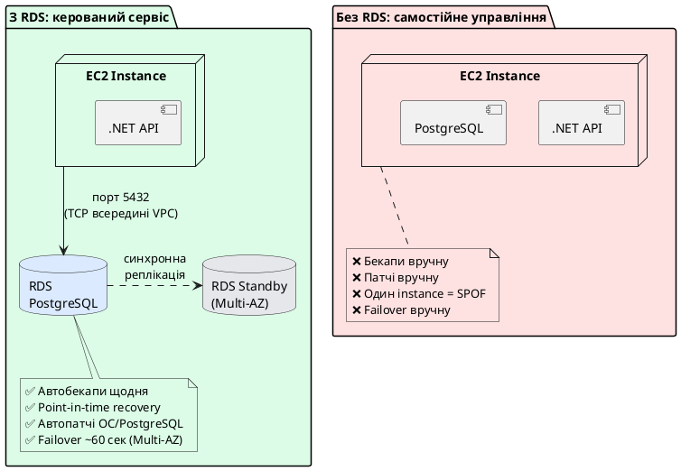
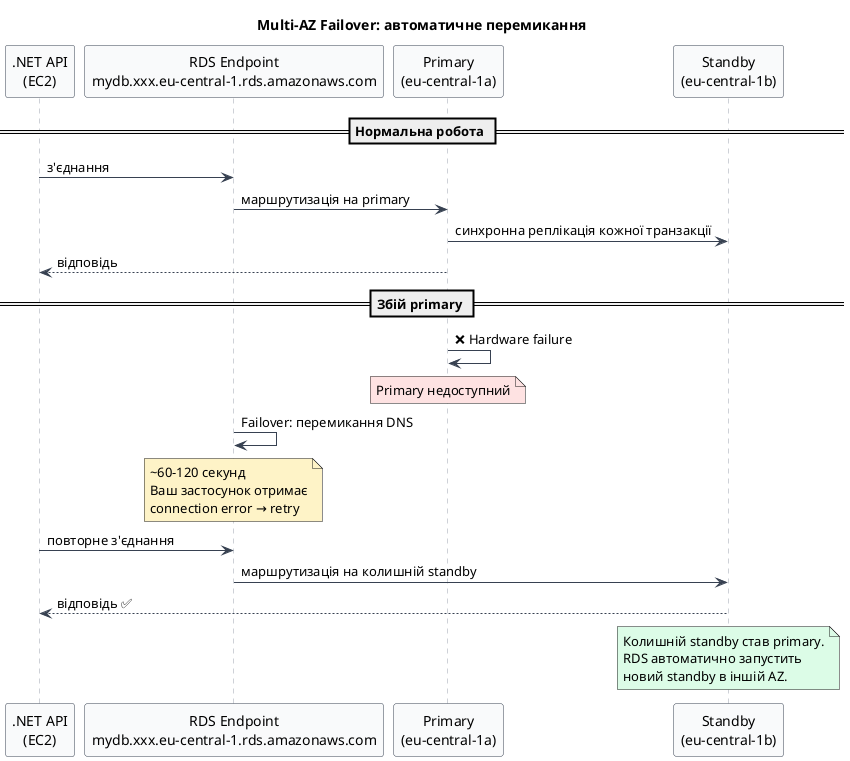
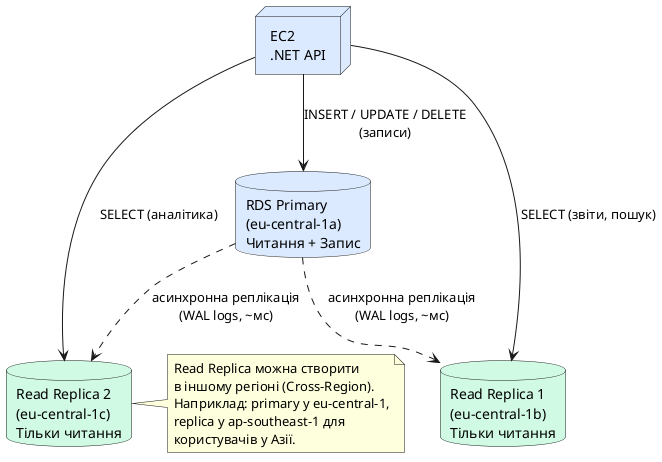
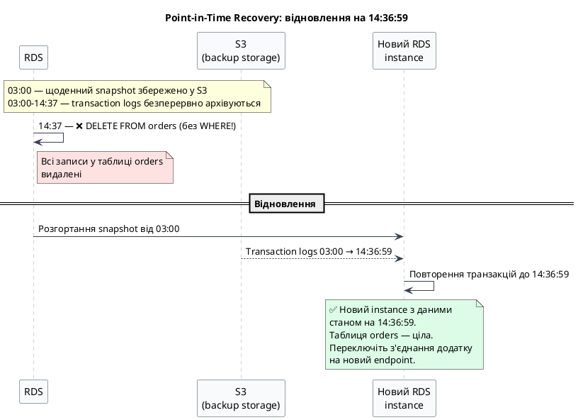
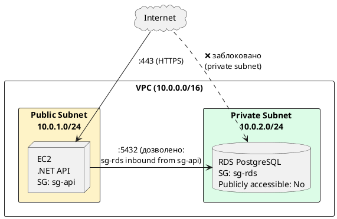
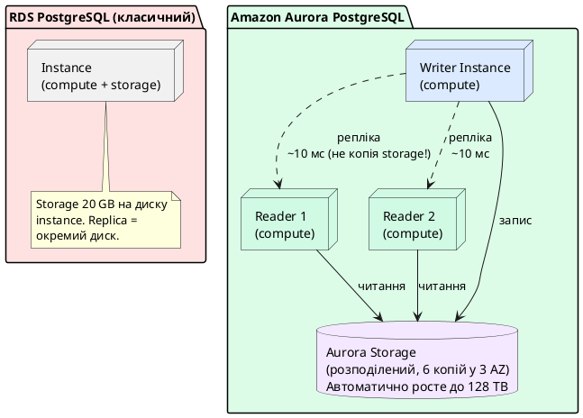
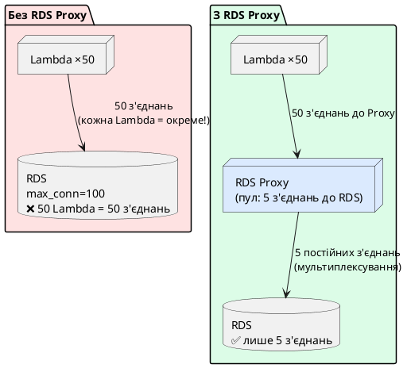
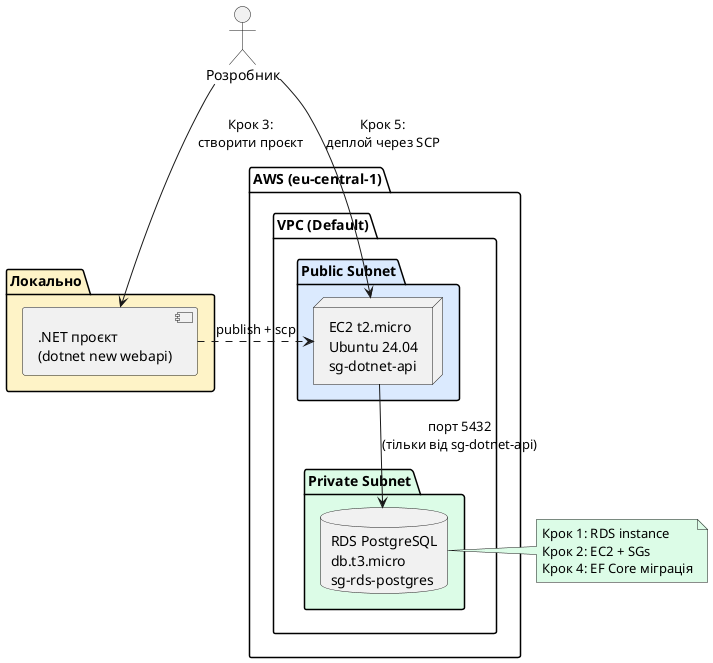

# Amazon RDS — Relational Database Service

## Що таке RDS і навіщо він потрібен

Уявіть, що ви задеплоїли .NET Web API на EC2. Застосунок працює, але потребує реляційну базу даних — PostgreSQL або SQL Server. Найпростіший підхід: встановити PostgreSQL прямо на той самий EC2 instance. Це спрацює для домашнього проєкту, але в production це архітектурна помилка.

**Чому не можна просто встановити PostgreSQL на EC2?**

Управління базою даних у production — це окрема робота на повну ставку:

- **Резервні копії:** хто і коли робить backup? Як перевірити що він валідний? Як відновити базу стан на конкретний момент часу (point-in-time recovery)?
- **Патчі безпеки:** PostgreSQL регулярно випускає виправлення вразливостей. Хто стежить за оновленнями і застосовує їх без даунтайму?
- **Висока доступність:** якщо EC2 instance впаде — база недоступна, застосунок не працює. Як зробити автоматичний failover?
- **Масштабування:** навантаження зросло, потрібно більше ресурсів. Як перейти на більший сервер без втрати даних і даунтайму?
- **Моніторинг:** як відслідковувати slow queries, deadlocks, вичерпання з'єднань?

**Amazon RDS (Relational Database Service)** — це керований сервіс, який бере на себе всі ці операційні турботи. Ви отримуєте повноцінну реляційну базу даних, але AWS відповідає за: автоматичні бекапи, патчі ОС та СУБД, моніторинг, автоматичний failover та масштабування інфраструктури.

::note
Важлива різниця: RDS **не є serverless** (є Aurora Serverless, але це окремо). RDS — це керований сервіс на виділеному instance. Ви все одно обираєте розмір instance (`db.t3.medium`, `db.r6g.xlarge`), але не займаєтесь адмініструванням ОС та СУБД.
::

::plant-uml



::

**RDS підтримує шість СУБД:**

- **PostgreSQL** — найпопулярніший вибір для .NET з EF Core. Відкритий, потужний, JSON підтримка
- **MySQL / MariaDB** — широко використовується у legacy проєктах
- **SQL Server** — для застосунків на .NET Framework або зі специфічними MSSQL features
- **Oracle** — для enterprise legacy систем
- **Amazon Aurora** — власна СУБД AWS, сумісна з PostgreSQL та MySQL, але з кращою продуктивністю (розглянемо окремо)

---

## RDS Instance Classes — вибір правильного сервера бази

Як і EC2, RDS instances поділяються на класи за призначенням. Формат: `db.[сімейство][покоління].[розмір]`.

Префікс `db.` відрізняє RDS instances від EC2 instances, хоча логіка сімейств аналогічна.

### Standard (General Purpose) — db.m класи

Збалансоване CPU та RAM. Підходить для більшості production баз даних.

- `db.m6g.large` — 2 vCPU, 8 GB RAM ← типовий production PostgreSQL для середнього навантаження
- `db.m6g.xlarge` — 4 vCPU, 16 GB RAM
- `db.m6g.2xlarge` — 8 vCPU, 32 GB RAM

### Memory Optimized — db.r та db.x класи

Більше RAM відносно CPU. Для баз даних, де велика частина робочого набору даних (working set) повинна поміщатись у RAM для швидкого доступу.

- `db.r6g.large` — 2 vCPU, 16 GB RAM ← якщо часто бракує shared_buffers
- `db.r6g.xlarge` — 4 vCPU, 32 GB RAM

### Burstable — db.t класи

Аналог EC2 t-сімейства з CPU Credits. Для dev/test середовищ та малонавантажених застосунків.

- `db.t3.micro` — 2 vCPU, 1 GB RAM ← **Free Tier**: 750 год/місяць на 12 місяців
- `db.t3.small` — 2 vCPU, 2 GB RAM
- `db.t3.medium` — 2 vCPU, 4 GB RAM ← мінімум для реального навчального проєкту

::tip
**Free Tier:** `db.t3.micro` з PostgreSQL або MySQL — 750 годин на місяць безкоштовно протягом першого року. Плюс 20 GB SSD storage та 20 GB backup storage. Достатньо для навчального проєкту.
::

::card-group

::card{title="db.t — Burstable (Free Tier)" icon="i-heroicons-bolt"}
CPU Credits для піків. `db.t3.micro` — Free Tier. Ідеально для розробки, навчання, стейджингу.
::

::card{title="db.m — General Purpose" icon="i-heroicons-server"}
Фіксований CPU. `db.m6g.large` — production база з передбачуваним навантаженням.
::

::card{title="db.r — Memory Optimized" icon="i-heroicons-circle-stack"}
Більше RAM. `db.r6g.large` — бази з великим робочим набором даних, аналітика.
::

::

---

## Multi-AZ — висока доступність

**Multi-AZ (Multi-Availability Zone)** — це механізм RDS, що автоматично підтримує **синхронну резервну копію** бази у другій зоні доступності того самого регіону.

**Як це працює:** кожна транзакція, яку ви записуєте в primary instance, синхронно реплікується на standby instance в іншій AZ **ще до того, як клієнт отримає підтвердження успіху**. Тому standby завжди в актуальному стані — жодних відставань.

**Що відбувається при failover?** Якщо primary instance стає недоступним (збій hardware, проблема з AZ, або ви самі ініціювали failover для тестування) — RDS автоматично перемикає DNS endpoint на standby instance. Ваша `db.t3.medium` у `eu-central-1a` стає `db.t3.medium` у `eu-central-1b`. Час переключення: **~60–120 секунд**.

::plant-uml



::

**Важливо:** standby instance **не приймає читання**. Це не Read Replica — він існує виключно як резервний для failover. Якщо ви хочете масштабувати читання — для цього є Read Replicas (окрема секція нижче).

**Вартість:** Multi-AZ подвоює вартість instance (ви платите за два instance), але не подвоює вартість storage — AWS застосовує знижку для standby storage.

::caution
Для production баз даних Multi-AZ — **обов'язкова** опція, не факультативна. Без нього збій одного сервера = даунтайм вашого застосунку. Для навчальних проєктів — вимикайте Multi-AZ щоб заощадити.
::

---

## Read Replicas — масштабування читання

**Read Replica** — це **асинхронна** копія вашої бази даних, яка приймає запити **тільки на читання** (`SELECT`). На відміну від Multi-AZ standby, Read Replica — це повноцінний endpoint, до якого можна підключитись і виконувати запити.

**Навіщо це потрібно?** Більшість веб-застосунків мають асиметричне навантаження: читань (GET запити, пошук, відображення даних) у рази більше, ніж записів. Якщо ваш API виконує 90% SELECT і лише 10% INSERT/UPDATE/DELETE — primary instance марно витрачає ресурси на запити, які можна розподілити.

**Принцип асинхронної реплікації:** primary instance застосовує зміни і одразу підтверджує транзакцію клієнту, не чекаючи на replica. Репліка потім «підтягується» з WAL-логів (Write-Ahead Log). Це означає, що replica може відставати від primary на кілька мілісекунд або секунд — **eventual consistency**. Для більшості операцій читання (показати список статей, перевірити наявність товару) ця затримка несуттєва.

::plant-uml



::

**Важливі деталі реалізації в .NET:**

Щоб ефективно використовувати Read Replicas, у вашому .NET коді потрібно мати **два connection strings** — один на primary, інший на replica. EF Core не вміє автоматично маршрутизувати запити. Це потрібно робити явно:

```csharp
// appsettings.json
{
  "ConnectionStrings": {
    "Primary": "Host=mydb.xxx.rds.amazonaws.com;Database=myapp;Username=app;Password=...",
    "ReadReplica": "Host=mydb-replica.xxx.rds.amazonaws.com;Database=myapp;Username=app;Password=..."
  }
}

// Program.cs — реєструємо два DbContext
builder.Services.AddDbContext<AppDbContext>(options =>
    options.UseNpgsql(builder.Configuration.GetConnectionString("Primary")));

builder.Services.AddDbContext<ReadOnlyDbContext>(options =>
    options.UseNpgsql(builder.Configuration.GetConnectionString("ReadReplica"))
           .UseQueryTrackingBehavior(QueryTrackingBehavior.NoTracking)); // READ ONLY!
```

```csharp
// Сервіс — явна маршрутизація за типом операції
public class ProductService(AppDbContext db, ReadOnlyDbContext readDb)
{
    // Читання — через репліку (без tracking, швидше)
    public async Task<List<Product>> GetAllAsync() =>
        await readDb.Products.ToListAsync();

    // Запис — тільки через primary
    public async Task CreateAsync(Product product)
    {
        db.Products.Add(product);
        await db.SaveChangesAsync();
    }
}
```

**Read Replicas можна просувати до primary:** якщо вирішили перенести базу в інший регіон — можна промоутувати Cross-Region Read Replica до незалежної primary бази.

---

## Automated Backups та Point-in-Time Recovery

RDS виконує **автоматичні бекапи** щодня протягом налаштованого **backup window** (наприклад, 03:00–04:00 UTC). Бекап — це snapshot всього instance storage, який зберігається у S3 у тому самому регіоні.

**Retention Period:** від 1 до 35 днів. Після закінчення — бекап автоматично видаляється. За замовчуванням: 7 днів.

### Point-in-Time Recovery (PITR)

Це найцінніша функція бекапів RDS. Завдяки тому, що RDS безперервно архівує **transaction logs** (WAL для PostgreSQL, binlog для MySQL), ви можете відновити базу на будь-який момент часу в межах retention period — не тільки на момент щоденного snapshot, але й на **конкретну хвилину чи секунду**.

**Типовий сценарій:** о 14:37 розробник виконав `DELETE FROM orders WHERE status = 'pending'` без `WHERE` умови і видалив всі замовлення. Щоденний snapshot о 03:00 — занадто старий. PITR дозволяє відновити базу на стан **14:36:59** — за одну хвилину до катастрофи.

::plant-uml



::

**Важливо:** PITR створює **новий RDS instance** — він не відновлює існуючий. Ви отримуєте нову базу з новим endpoint, і самі вирішуєте: переключити додаток на новий endpoint або вручну перенести потрібні дані.

### Manual Snapshots

Окрім автоматичних, ви можете створювати **manual snapshots** вручну — наприклад, перед запуском ризикованої міграції бази даних. На відміну від автоматичних, вони **не видаляються автоматично** — лише якщо ви їх явно видалите або видалите сам RDS instance (з опцією «create final snapshot»).

```bash
# Створити manual snapshot перед міграцією
aws rds create-db-snapshot \
    --db-instance-identifier my-production-db \
    --db-snapshot-identifier before-migration-v2-$(date +%Y%m%d) \
    --region eu-central-1
```

---

## RDS Security — захист бази даних

Безпека RDS будується на кількох незалежних рівнях, кожен з яких важливий.

### Network: RDS у приватній підмережі

**Правило №1:** RDS instance **ніколи** не повинен бути публічно доступним з інтернету. Поле «Publicly accessible» при створенні — завжди `No` для production.

RDS розміщується у **private subnet** — підмережі без маршруту до Internet Gateway. Доступ до бази мають тільки ресурси всередині VPC: ваші EC2 instances, Lambda функції, ECS контейнери. Це мережева ізоляція.

### Security Groups

**Security Group** RDS instance — це список дозволених з'єднань. Для PostgreSQL стандартний порт: `5432`. Правило має виглядати так:

- **Inbound:** TCP порт `5432`, Source: Security Group вашого EC2/ECS (не IP-адреса!)
- **Outbound:** зазвичай не налаштовують для RDS (вихідні з'єднання RDS не потрібні)

**Чому Source = Security Group, а не IP?** EC2 instances при Stop → Start змінюють IP-адресу. Якщо прописати конкретний IP — після рестарту EC2 з'єднання до бази припиниться. Security Group посилається на інші Security Groups — динамічно, незалежно від IP.

::plant-uml



::

### Encryption at Rest

RDS підтримує шифрування всього storage за допомогою **AWS KMS (Key Management Service)**. Шифрується: сам instance storage, automated backups, snapshots, Read Replicas. Алгоритм: AES-256.

**Важливо:** шифрування вмикається **лише при створенні** instance. Увімкнути його на існуючій незашифрованій базі неможливо напряму — лише через snapshot → відновлення з вимкненим `encrypted` → `No`, а потім знову snapshot → відновлення з `encrypted` → `Yes`.

### Encryption in Transit

З'єднання між вашим .NET додатком і RDS можна (і потрібно!) захистити SSL/TLS. RDS надає сертифікат CA. У Npgsql (EF Core + PostgreSQL) це налаштовується в connection string:

```
Host=mydb.xxx.rds.amazonaws.com;
Database=myapp;
Username=app;
Password=secret;
SSL Mode=Require;
Trust Server Certificate=false;
```

### IAM Database Authentication

Альтернатива паролям: **IAM Authentication** дозволяє підключатись до RDS за допомогою тимчасового токена, сгенерованого через AWS IAM. Токен живе 15 хвилин. Жодних постійних паролів у `.env` файлах або Secrets Manager — IAM роль EC2/Lambda автоматично отримує доступ.

```csharp
// Отримати IAM-токен для PostgreSQL через AWS SDK
var generator = new AmazonRDSClient();
string token = generator.GenerateAuthToken(
    hostname: "mydb.xxx.rds.amazonaws.com",
    port: 5432,
    username: "iam_user",
    region: RegionEndpoint.EUCentral1
);
// Використати token як пароль у connection string
```

### Parameter Groups — тонке налаштування СУБД

**Parameter Group** — це набір конфігураційних параметрів бази даних (аналог `postgresql.conf` або `my.cnf`). Замість того, щоб SSH-ити на сервер і редагувати конфіг вручну — ви керуєте параметрами через RDS API або Console.

RDS має **Default Parameter Group** для кожного engine і версії — він захищений від змін. Для кастомного налаштування потрібно створити власну Parameter Group і прикріпити до instance.

Корисні параметри для PostgreSQL:

| Параметр                     | Значення за замовч. | Рекомендація | Пояснення                      |
| ---------------------------- | ------------------- | ------------ | ------------------------------ |
| `shared_buffers`             | 128 MB              | 25% від RAM  | Основний буфер PostgreSQL      |
| `max_connections`            | 100                 | за потребою  | Максимальна кількість з'єднань |
| `log_min_duration_statement` | -1 (вимкнено)       | 1000 (мс)    | Логувати slow queries > 1 сек  |
| `work_mem`                   | 4 MB                | 16–64 MB     | Пам'ять для sort/hash операцій |
| `log_lock_waits`             | off                 | on           | Логувати очікування блокувань  |

::tip
Для .NET застосунків особливо важливий `max_connections`. За замовчуванням 100 — це мало для кількох EC2 instances по 20–50 з'єднань кожен. Або збільшуйте ліміт, або використовуйте RDS Proxy (розглянемо нижче).
::

---

## Amazon Aurora — хмарна СУБД від AWS

**Amazon Aurora** — це власна реляційна СУБД Amazon, яка сумісна з PostgreSQL та MySQL на рівні протоколу (ваші драйвери та ORM не потребують змін), але архітектурно побудована інакше.

**Ключова відмінність Aurora від RDS PostgreSQL:** у звичайному RDS storage прив'язаний до instance — один диск, один сервер. Aurora **відокремлює compute від storage**: до одного розподіленого storage (Aurora Storage) підключаються кілька instance (writer + до 15 reader).

::plant-uml



::

**Переваги Aurora над RDS PostgreSQL:**

| Характеристика       | RDS PostgreSQL                  | Aurora PostgreSQL             |
| -------------------- | ------------------------------- | ----------------------------- |
| Storage              | EBS (один диск)                 | Розподілений (6 копій у 3 AZ) |
| Failover             | ~60–120 сек                     | ~30 сек                       |
| Read Replicas        | до 5, кожна = окрема реплікація | до 15, спільний storage       |
| Storage auto-scaling | Ручне збільшення                | Автоматично до 128 TB         |
| Ціна                 | Дешевше                         | ~20% дорожче за instance      |
| Резервні копії       | 7–35 днів, PITR                 | Безперервні, миттєві snapshot |

**Aurora Serverless v2** — версія Aurora де compute автоматично масштабується від мінімального розміру (0.5 ACU) до максимального (128 ACU) залежно від навантаження. Ідеально для застосунків з нерівномірним трафіком: вночі — мінімальна потужність, вдень — масштабується. ACU (Aurora Capacity Unit) = ~2 GB RAM + відповідне CPU.

---

## RDS Proxy — управління пулом з'єднань

**Проблема Connection Pooling:** кожне з'єднання до PostgreSQL — це окремий процес на сервері бази (~5–10 MB RAM кожен). При `max_connections = 100` і кількох EC2 instances по 30 з'єднань кожен — ресурс швидко вичерпується. При масштабуванні на Lambda (тисячі паралельних invocations) ситуація стає критичною: Lambda не підтримує постійний pool.

**RDS Proxy** — це повністю керований проксі-сервер між вашим застосунком і RDS. Він підтримує **довготривалий пул з'єднань** до бази і мультиплексує багато короткоживучих з'єднань від клієнтів у кілька постійних.

::plant-uml



::

**Додаткові переваги RDS Proxy:**

- **Failover:** при Multi-AZ failover Proxy автоматично перенаправляє з'єднання, не розриваючи існуючі сесії клієнтів (замість ~60 сек → ~5 сек для застосунку)
- **IAM Authentication:** Proxy підтримує IAM-токени — Lambda функції можуть підключатись без паролів
- **Secret Manager інтеграція:** пароль бази зберігається у Secrets Manager, Proxy сам ротує і читає — ваш код паролів не бачить

**Connection string до RDS Proxy** виглядає ідентично до прямого підключення — лише hostname змінюється на endpoint Proxy. Для .NET/EF Core нічого більше змінювати не потрібно.

---

## Підключення .NET до RDS — Entity Framework Core

Розглянемо повний цикл: від connection string до Code-First міграцій на production RDS instance.

### Встановлення пакетів

```bash
# PostgreSQL провайдер для EF Core
dotnet add package Npgsql.EntityFrameworkCore.PostgreSQL

# SQL Server провайдер (якщо RDS SQL Server)
# dotnet add package Microsoft.EntityFrameworkCore.SqlServer

# Інструменти для міграцій
dotnet add package Microsoft.EntityFrameworkCore.Design
```

### DbContext та моделі

```csharp
// Models/Product.cs
public class Product
{
    public int Id { get; set; }
    public string Name { get; set; } = string.Empty;
    public decimal Price { get; set; }
    public DateTime CreatedAt { get; set; } = DateTime.UtcNow;
}

// Data/AppDbContext.cs
public class AppDbContext(DbContextOptions<AppDbContext> options) : DbContext(options)
{
    public DbSet<Product> Products => Set<Product>();

    protected override void OnModelCreating(ModelBuilder modelBuilder)
    {
        modelBuilder.Entity<Product>(entity =>
        {
            entity.Property(p => p.Name).HasMaxLength(200).IsRequired();
            entity.Property(p => p.Price).HasPrecision(18, 2);
        });
    }
}
```

### Connection String — безпечне зберігання

**Ніколи** не хардкодьте паролі у `appsettings.json` у репозиторії. Для .NET на AWS є кілька підходів:

```csharp
// Program.cs — зчитуємо з AWS Secrets Manager
builder.Services.AddDbContext<AppDbContext>(options =>
{
    // Варіант 1: через Environment Variable (задається в ECS Task Definition / EC2 User Data)
    var connStr = Environment.GetEnvironmentVariable("DB_CONNECTION_STRING")
        ?? builder.Configuration.GetConnectionString("Default");

    options.UseNpgsql(connStr, npgsqlOptions =>
    {
        // Автоматичний retry при transient помилках (failover, мережеві збої)
        npgsqlOptions.EnableRetryOnFailure(
            maxRetryCount: 3,
            maxRetryDelay: TimeSpan.FromSeconds(5),
            errorCodesToAdd: null);
    });
});
```

```json
// appsettings.Development.json (тільки для локальної розробки!)
{
    "ConnectionStrings": {
        "Default": "Host=localhost;Database=myapp_dev;Username=postgres;Password=localpassword"
    }
}
```

### Code-First міграції на RDS

```bash
# Генерувати міграцію локально
dotnet ef migrations add InitialCreate

# Застосувати до локальної бази
dotnet ef database update

# Застосувати до RDS (через змінну середовища з реальним connection string)
DB_CONNECTION_STRING="Host=mydb.xxx.rds.amazonaws.com;Database=myapp;Username=app;Password=..." \
  dotnet ef database update --no-build
```

::caution
**Ніколи** не запускайте `database update` автоматично при старті застосунку (`context.Database.Migrate()` у `Program.cs`) у production. Міграція може займати хвилини на великій базі, заблокувати таблиці та покласти застосунок. Виконуйте міграції як окремий крок у CI/CD пайплайні перед деплоєм нової версії.
::

### EnableRetryOnFailure — чому це критично

При Multi-AZ failover (~60–120 сек) існуючі з'єднання до primary instance розриваються. Без retry-логіки ваш API поверне 500 на всі запити під час failover. З `EnableRetryOnFailure` Npgsql автоматично повторить запит — і до моменту, коли DNS оновиться на новий primary, більшість запитів відновиться без помилок для кінцевого користувача.

---

## Практичний приклад: .NET Web API + RDS PostgreSQL від А до Я

::note
Цей розділ охоплює повний цикл: від нуля до працюючого .NET Web API на EC2, підключеного до RDS PostgreSQL. Всі кроки виконуються послідовно.
::

::plant-uml



::

### Передумови

::card-group

::card{title="AWS CLI" icon="i-heroicons-command-line"}
Встановлений та налаштований (`aws configure`). Перевірте: `aws sts get-caller-identity`
::

::card{title=".NET SDK 9" icon="i-heroicons-code-bracket"}
Встановлений локально. Перевірте: `dotnet --version`
::

::card{title="AWS акаунт" icon="i-heroicons-user-circle"}
IAM користувач з правами EC2FullAccess + RDSFullAccess
::

::

---

### Крок 1: Створення RDS PostgreSQL instance

::tabs

::tabs-item{label="AWS Console"}

1. Відкрийте **RDS** → **Create database**
2. **Choose a database creation method:** Standard create
3. **Engine options:** PostgreSQL → версія **16.x (latest)**
4. **Templates:** Free tier _(автоматично обирає `db.t3.micro`, вимикає Multi-AZ)_
5. **DB instance identifier:** `my-dotnet-app-db`
6. **Master username:** `postgres`
7. **Master password:** задайте надійний пароль та **збережіть його**
8. **DB instance class:** `db.t3.micro` _(Free Tier)_
9. **Storage:** gp2, 20 GB _(Free Tier включає 20 GB)_
10. **Connectivity:**
    - VPC: Default VPC
    - Public access: **No**
    - VPC Security group: Create new → назва `sg-rds-postgres`
11. **Additional configuration → Initial database name:** `myapp`
12. **Backup retention:** 7 days
13. **Create database** → очікуйте ~5-10 хвилин

::

::tabs-item{label="AWS CLI (bash)"}

```bash
# Знайти Default VPC
VPC_ID=$(aws ec2 describe-vpcs \
    --filters "Name=isDefault,Values=true" \
    --query "Vpcs[0].VpcId" --output text --region eu-central-1)
echo "VPC: $VPC_ID"

SUBNET_IDS=$(aws ec2 describe-subnets \
    --filters "Name=vpcId,Values=$VPC_ID" \
    --query "Subnets[*].SubnetId" --output text --region eu-central-1)

# Створити DB Subnet Group
aws rds create-db-subnet-group \
    --db-subnet-group-name my-dotnet-app-subnet-group \
    --db-subnet-group-description "Subnet group for my-dotnet-app" \
    --subnet-ids $(echo $SUBNET_IDS | tr ' ' '\n' | head -2 | tr '\n' ' ') \
    --region eu-central-1

# Створити Security Group для RDS
SG_RDS=$(aws ec2 create-security-group \
    --group-name sg-rds-postgres \
    --description "RDS PostgreSQL security group" \
    --vpc-id $VPC_ID \
    --query "GroupId" --output text --region eu-central-1)

# Тимчасово дозволити VPC-рівень (замінимо на SG-рівень у кроці 2)
aws ec2 authorize-security-group-ingress \
    --group-id $SG_RDS --protocol tcp --port 5432 \
    --cidr 10.0.0.0/16 --region eu-central-1

# Створити RDS instance
aws rds create-db-instance \
    --db-instance-identifier my-dotnet-app-db \
    --db-instance-class db.t3.micro \
    --engine postgres --engine-version "16.3" \
    --master-username postgres \
    --master-user-password "YourSecurePassword123!" \
    --allocated-storage 20 \
    --db-name myapp \
    --db-subnet-group-name my-dotnet-app-subnet-group \
    --vpc-security-group-ids $SG_RDS \
    --no-publicly-accessible \
    --backup-retention-period 7 \
    --no-multi-az \
    --region eu-central-1

# Дочекатись статусу available (~5-10 хв)
aws rds wait db-instance-available \
    --db-instance-identifier my-dotnet-app-db --region eu-central-1

# Отримати endpoint
RDS_ENDPOINT=$(aws rds describe-db-instances \
    --db-instance-identifier my-dotnet-app-db \
    --query "DBInstances[0].Endpoint.Address" \
    --output text --region eu-central-1)
echo "RDS Endpoint: $RDS_ENDPOINT"
```

::

::tabs-item{label="AWS CLI (PowerShell)"}

```powershell
# Знайти Default VPC
$VPC_ID = aws ec2 describe-vpcs `
    --filters "Name=isDefault,Values=true" `
    --query "Vpcs[0].VpcId" --output text --region eu-central-1
Write-Host "VPC: $VPC_ID"

$SUBNET_IDS = (aws ec2 describe-subnets `
    --filters "Name=vpcId,Values=$VPC_ID" `
    --query "Subnets[*].SubnetId" --output text --region eu-central-1) -split '\s+'
$SUBNET_PAIR = ($SUBNET_IDS | Select-Object -First 2) -join ' '

# Створити DB Subnet Group
aws rds create-db-subnet-group `
    --db-subnet-group-name my-dotnet-app-subnet-group `
    --db-subnet-group-description "Subnet group for my-dotnet-app" `
    --subnet-ids $SUBNET_PAIR `
    --region eu-central-1

# Створити Security Group для RDS
$SG_RDS = aws ec2 create-security-group `
    --group-name sg-rds-postgres `
    --description "RDS PostgreSQL security group" `
    --vpc-id $VPC_ID `
    --query "GroupId" --output text --region eu-central-1

# Тимчасово дозволити VPC-рівень
aws ec2 authorize-security-group-ingress `
    --group-id $SG_RDS --protocol tcp --port 5432 `
    --cidr 10.0.0.0/16 --region eu-central-1

# Створити RDS instance
aws rds create-db-instance `
    --db-instance-identifier my-dotnet-app-db `
    --db-instance-class db.t3.micro `
    --engine postgres --engine-version "16.3" `
    --master-username postgres `
    --master-user-password "YourSecurePassword123!" `
    --allocated-storage 20 `
    --db-name myapp `
    --db-subnet-group-name my-dotnet-app-subnet-group `
    --vpc-security-group-ids $SG_RDS `
    --no-publicly-accessible `
    --backup-retention-period 7 `
    --no-multi-az `
    --region eu-central-1

# Дочекатись статусу available (~5-10 хв)
aws rds wait db-instance-available `
    --db-instance-identifier my-dotnet-app-db --region eu-central-1

# Отримати endpoint
$RDS_ENDPOINT = aws rds describe-db-instances `
    --db-instance-identifier my-dotnet-app-db `
    --query "DBInstances[0].Endpoint.Address" `
    --output text --region eu-central-1
Write-Host "RDS Endpoint: $RDS_ENDPOINT"
```

::

::

---

### Крок 2: Запуск EC2 instance для .NET API

::steps

### Створення Key Pair для SSH доступу

::tabs

::tabs-item{label="AWS Console"}

1. **EC2** → **Key Pairs** → **Create key pair**
2. Name: `dotnet-api-key`, Format: `.pem`
3. **Create key pair** → файл завантажиться автоматично
4. Збережіть у `~/.ssh/` та встановіть права: `chmod 400 ~/.ssh/dotnet-api-key.pem`

::

::tabs-item{label="AWS CLI (bash)"}

```bash
aws ec2 create-key-pair \
    --key-name dotnet-api-key \
    --query "KeyMaterial" \
    --output text \
    --region eu-central-1 > ~/.ssh/dotnet-api-key.pem

chmod 400 ~/.ssh/dotnet-api-key.pem
```

::

::tabs-item{label="AWS CLI (PowerShell)"}

```powershell
$keyMaterial = aws ec2 create-key-pair `
    --key-name dotnet-api-key `
    --query "KeyMaterial" `
    --output text --region eu-central-1

$keyPath = "$env:USERPROFILE\.ssh\dotnet-api-key.pem"
$keyMaterial | Out-File -FilePath $keyPath -Encoding ascii -NoNewline
Write-Host "Key saved: $keyPath"
```

::

::

### Створення Security Group для EC2

::tabs

::tabs-item{label="AWS Console"}

1. **EC2** → **Security Groups** → **Create security group**
2. Name: `sg-dotnet-api`, VPC: Default
3. **Inbound rules:**
   - `SSH` порт `22` → Source: `My IP`
   - `Custom TCP` порт `5000` → Source: `Anywhere (0.0.0.0/0)`
4. **Create security group**

::

::tabs-item{label="AWS CLI (bash)"}

```bash
SG_EC2=$(aws ec2 create-security-group \
    --group-name sg-dotnet-api \
    --description "Security group for .NET API EC2" \
    --vpc-id $VPC_ID \
    --query "GroupId" --output text --region eu-central-1)

MY_IP=$(curl -s https://checkip.amazonaws.com)

aws ec2 authorize-security-group-ingress \
    --group-id $SG_EC2 --protocol tcp --port 22 \
    --cidr "${MY_IP}/32" --region eu-central-1

aws ec2 authorize-security-group-ingress \
    --group-id $SG_EC2 --protocol tcp --port 5000 \
    --cidr 0.0.0.0/0 --region eu-central-1

echo "EC2 SG: $SG_EC2"
```

::

::tabs-item{label="AWS CLI (PowerShell)"}

```powershell
$SG_EC2 = aws ec2 create-security-group `
    --group-name sg-dotnet-api `
    --description "Security group for .NET API EC2" `
    --vpc-id $VPC_ID `
    --query "GroupId" --output text --region eu-central-1

$MY_IP = (Invoke-WebRequest -Uri "https://checkip.amazonaws.com" -UseBasicParsing).Content.Trim()

aws ec2 authorize-security-group-ingress `
    --group-id $SG_EC2 --protocol tcp --port 22 `
    --cidr "${MY_IP}/32" --region eu-central-1

aws ec2 authorize-security-group-ingress `
    --group-id $SG_EC2 --protocol tcp --port 5000 `
    --cidr 0.0.0.0/0 --region eu-central-1

Write-Host "EC2 SG: $SG_EC2"
```

::

::

### Оновлення RDS Security Group: дозволити тільки EC2

::tabs

::tabs-item{label="AWS CLI (bash)"}

```bash
# Видалити широке VPC-правило
aws ec2 revoke-security-group-ingress \
    --group-id $SG_RDS --protocol tcp --port 5432 \
    --cidr 10.0.0.0/16 --region eu-central-1

# Додати точне правило: source = sg EC2
aws ec2 authorize-security-group-ingress \
    --group-id $SG_RDS --protocol tcp --port 5432 \
    --source-group $SG_EC2 --region eu-central-1
```

::

::tabs-item{label="AWS CLI (PowerShell)"}

```powershell
# Видалити широке VPC-правило
aws ec2 revoke-security-group-ingress `
    --group-id $SG_RDS --protocol tcp --port 5432 `
    --cidr 10.0.0.0/16 --region eu-central-1

# Додати точне правило: source = sg EC2
aws ec2 authorize-security-group-ingress `
    --group-id $SG_RDS --protocol tcp --port 5432 `
    --source-group $SG_EC2 --region eu-central-1
```

::

::

### Запуск EC2 Instance з автовстановленням .NET

::tabs

::tabs-item{label="AWS Console"}

1. **EC2** → **Launch instances**
2. **Name:** `dotnet-api-server`
3. **AMI:** Ubuntu Server 24.04 LTS (Free Tier eligible)
4. **Instance type:** `t2.micro`
5. **Key pair:** `dotnet-api-key`
6. **Security group:** `sg-dotnet-api`, **Auto-assign public IP:** Enable
7. **Advanced details → User data:**

```bash
#!/bin/bash
apt-get update -y
wget https://packages.microsoft.com/config/ubuntu/24.04/packages-microsoft-prod.deb \
    -O /tmp/ms-prod.deb
dpkg -i /tmp/ms-prod.deb
apt-get update -y
apt-get install -y dotnet-sdk-9.0 postgresql-client
mkdir -p /opt/mydotnetapp && chown ubuntu:ubuntu /opt/mydotnetapp
echo "Ready: $(dotnet --version)" >> /var/log/user-data.log
```

8. **Launch instance**

::

::tabs-item{label="AWS CLI (bash)"}

```bash
AMI_ID=$(aws ec2 describe-images \
    --owners 099720109477 \
    --filters \
        "Name=name,Values=ubuntu/images/hvm-ssd-gp3/ubuntu-noble-24.04-amd64-server-*" \
        "Name=state,Values=available" \
    --query "sort_by(Images, &CreationDate)[-1].ImageId" \
    --output text --region eu-central-1)

SUBNET_ID=$(aws ec2 describe-subnets \
    --filters "Name=vpcId,Values=$VPC_ID" \
    --query "Subnets[0].SubnetId" \
    --output text --region eu-central-1)

cat > /tmp/user-data.sh << 'EOF'
#!/bin/bash
apt-get update -y
wget https://packages.microsoft.com/config/ubuntu/24.04/packages-microsoft-prod.deb \
    -O /tmp/ms-prod.deb
dpkg -i /tmp/ms-prod.deb
apt-get update -y
apt-get install -y dotnet-sdk-9.0 postgresql-client
mkdir -p /opt/mydotnetapp && chown ubuntu:ubuntu /opt/mydotnetapp
echo "Ready: $(dotnet --version)" >> /var/log/user-data.log
EOF

INSTANCE_ID=$(aws ec2 run-instances \
    --image-id $AMI_ID \
    --instance-type t2.micro \
    --key-name dotnet-api-key \
    --security-group-ids $SG_EC2 \
    --subnet-id $SUBNET_ID \
    --associate-public-ip-address \
    --user-data file:///tmp/user-data.sh \
    --tag-specifications 'ResourceType=instance,Tags=[{Key=Name,Value=dotnet-api-server}]' \
    --query "Instances[0].InstanceId" \
    --output text --region eu-central-1)
echo "Instance: $INSTANCE_ID"

aws ec2 wait instance-running \
    --instance-ids $INSTANCE_ID --region eu-central-1

EC2_IP=$(aws ec2 describe-instances \
    --instance-ids $INSTANCE_ID \
    --query "Reservations[0].Instances[0].PublicIpAddress" \
    --output text --region eu-central-1)
echo "EC2 IP: $EC2_IP"
```

::

::tabs-item{label="AWS CLI (PowerShell)"}

```powershell
$AMI_ID = aws ec2 describe-images `
    --owners 099720109477 `
    --filters `
        "Name=name,Values=ubuntu/images/hvm-ssd-gp3/ubuntu-noble-24.04-amd64-server-*" `
        "Name=state,Values=available" `
    --query "sort_by(Images, &CreationDate)[-1].ImageId" `
    --output text --region eu-central-1

$SUBNET_ID = aws ec2 describe-subnets `
    --filters "Name=vpcId,Values=$VPC_ID" `
    --query "Subnets[0].SubnetId" `
    --output text --region eu-central-1

$userDataScript = @'
#!/bin/bash
apt-get update -y
wget https://packages.microsoft.com/config/ubuntu/24.04/packages-microsoft-prod.deb -O /tmp/ms-prod.deb
dpkg -i /tmp/ms-prod.deb
apt-get update -y
apt-get install -y dotnet-sdk-9.0 postgresql-client
mkdir -p /opt/mydotnetapp && chown ubuntu:ubuntu /opt/mydotnetapp
echo "Ready" >> /var/log/user-data.log
'@
$userDataB64 = [Convert]::ToBase64String([Text.Encoding]::UTF8.GetBytes($userDataScript))

$INSTANCE_ID = aws ec2 run-instances `
    --image-id $AMI_ID `
    --instance-type t2.micro `
    --key-name dotnet-api-key `
    --security-group-ids $SG_EC2 `
    --subnet-id $SUBNET_ID `
    --associate-public-ip-address `
    --user-data $userDataB64 `
    --tag-specifications 'ResourceType=instance,Tags=[{Key=Name,Value=dotnet-api-server}]' `
    --query "Instances[0].InstanceId" `
    --output text --region eu-central-1
Write-Host "Instance: $INSTANCE_ID"

aws ec2 wait instance-running `
    --instance-ids $INSTANCE_ID --region eu-central-1

$EC2_IP = aws ec2 describe-instances `
    --instance-ids $INSTANCE_ID `
    --query "Reservations[0].Instances[0].PublicIpAddress" `
    --output text --region eu-central-1
Write-Host "EC2 IP: $EC2_IP"
```

::

::

::

::tip
Після запуску зачекайте ~2-3 хвилини на виконання User Data. Перевірте: `ssh -i ~/.ssh/dotnet-api-key.pem ubuntu@$EC2_IP "cat /var/log/user-data.log"`
::

---

### Крок 3: Підготовка .NET проєкту

```bash
dotnet new webapi -n MyDotnetApp --no-openapi
cd MyDotnetApp
dotnet add package Npgsql.EntityFrameworkCore.PostgreSQL
dotnet add package Microsoft.EntityFrameworkCore.Design
```

::code-tree

```csharp [Models/Product.cs]
public class Product
{
    public int Id { get; set; }
    public string Name { get; set; } = string.Empty;
    public decimal Price { get; set; }
    public DateTime CreatedAt { get; set; } = DateTime.UtcNow;
}
```

```csharp [Data/AppDbContext.cs]
public class AppDbContext(DbContextOptions<AppDbContext> options) : DbContext(options)
{
    public DbSet<Product> Products => Set<Product>();

    protected override void OnModelCreating(ModelBuilder modelBuilder)
    {
        modelBuilder.Entity<Product>(entity =>
        {
            entity.Property(p => p.Name).HasMaxLength(200).IsRequired();
            entity.Property(p => p.Price).HasPrecision(18, 2);
        });
    }
}
```

```csharp [Program.cs]
var builder = WebApplication.CreateBuilder(args);

var connStr = Environment.GetEnvironmentVariable("DB_CONNECTION_STRING")
    ?? builder.Configuration.GetConnectionString("Default");

builder.Services.AddDbContext<AppDbContext>(options =>
    options.UseNpgsql(connStr, npgsqlOptions =>
        npgsqlOptions.EnableRetryOnFailure(
            maxRetryCount: 3,
            maxRetryDelay: TimeSpan.FromSeconds(5),
            errorCodesToAdd: null)));

builder.Services.AddControllers();
var app = builder.Build();
app.MapControllers();
app.Run();
```

```csharp [Controllers/ProductsController.cs]
[ApiController]
[Route("api/[controller]")]
public class ProductsController(AppDbContext db) : ControllerBase
{
    [HttpGet]
    public async Task<IActionResult> GetAll() =>
        Ok(await db.Products.ToListAsync());

    [HttpPost]
    public async Task<IActionResult> Create(Product product)
    {
        db.Products.Add(product);
        await db.SaveChangesAsync();
        return CreatedAtAction(nameof(GetAll), new { id = product.Id }, product);
    }
}
```

```json [appsettings.Development.json]
{
    "ConnectionStrings": {
        "Default": "Host=localhost;Database=myapp_dev;Username=postgres;Password=localpassword"
    }
}
```

::

---

### Крок 4: EF Core міграція до RDS

```bash
# Генерувати міграцію
dotnet ef migrations add InitialCreate

# Застосувати до RDS (з локальної машини)
export DB_CONNECTION_STRING="Host=$RDS_ENDPOINT;Database=myapp;Username=postgres;Password=YourSecurePassword123!;SSL Mode=Require"
dotnet ef database update
```

::terminal-preview{title="Виконання міграції EF Core"}

<div class="line"><span class="opacity-40">$</span> <strong>dotnet ef database update</strong></div>
<div class="line">Build started...</div>
<div class="line">Build succeeded.</div>
<div class="line">info: Microsoft.EntityFrameworkCore.Database.Command[20101]</div>
<div class="line">      Executed DbCommand (12ms) [Parameters=[], CommandType=Text]</div>
<div class="line">      CREATE TABLE "__EFMigrationsHistory" ...</div>
<div class="line">info: Microsoft.EntityFrameworkCore.Migrations[20402]</div>
<div class="line">      <span class="text-green-400">Done. Applied 1 migration(s).</span></div>

::

---

### Крок 5: Деплой застосунку на EC2

::steps

### Публікація та упаковка

```bash
dotnet publish -c Release -o ./publish
tar -czf mydotnetapp.tar.gz -C ./publish .
```

### Передача на EC2 через SCP

```bash
scp -i ~/.ssh/dotnet-api-key.pem \
    mydotnetapp.tar.gz ubuntu@$EC2_IP:/home/ubuntu/
```

### Розгортання та запуск через systemd

```bash
# SSH на EC2
ssh -i ~/.ssh/dotnet-api-key.pem ubuntu@$EC2_IP

# Розпакувати
mkdir -p /opt/mydotnetapp
tar -xzf /home/ubuntu/mydotnetapp.tar.gz -C /opt/mydotnetapp

# systemd service
sudo tee /etc/systemd/system/mydotnetapp.service > /dev/null << 'SERVICE'
[Unit]
Description=My .NET API Application
After=network.target

[Service]
WorkingDirectory=/opt/mydotnetapp
ExecStart=/usr/bin/dotnet /opt/mydotnetapp/MyDotnetApp.dll
Restart=always
RestartSec=10
Environment=ASPNETCORE_ENVIRONMENT=Production
Environment=ASPNETCORE_URLS=http://+:5000
Environment=DB_CONNECTION_STRING=Host=REPLACE_RDS_ENDPOINT;Database=myapp;Username=postgres;Password=YourSecurePassword123!;SSL Mode=Require
User=ubuntu

[Install]
WantedBy=multi-user.target
SERVICE

sudo systemctl daemon-reload
sudo systemctl enable mydotnetapp
sudo systemctl start mydotnetapp
sudo systemctl status mydotnetapp
```

::

::terminal-preview{title="systemd status" :cursor="true"}

<div class="line"><span class="opacity-40">$</span> <strong>sudo systemctl status mydotnetapp</strong></div>
<div class="line">● mydotnetapp.service - My .NET API Application</div>
<div class="line">     Loaded: loaded (/etc/systemd/system/mydotnetapp.service; enabled)</div>
<div class="line">     <span class="text-green-400 font-bold">Active: active (running)</span> since Mon 2025-01-15 10:30:00 UTC</div>
<div class="line">   Main PID: 1234 (dotnet)</div>
<div class="line">     Memory: 58.2M</div>
<div class="line">info: Microsoft.Hosting.Lifetime[14]</div>
<div class="line">      <span class="text-blue-400">Now listening on: http://[::]:5000</span></div>
<div class="line">info: Microsoft.Hosting.Lifetime[0]</div>
<div class="line">      Application started.</div>

::

---

### Крок 6: Перевірка роботи API

```bash
# POST: створити продукт
curl -X POST http://$EC2_IP:5000/api/products \
    -H "Content-Type: application/json" \
    -d '{"name": "Test Product", "price": 99.99}'

# GET: отримати список
curl http://$EC2_IP:5000/api/products
```

::terminal-preview{title="Перевірка API" :cursor="true"}

<div class="line"><span class="opacity-40">$</span> <strong>curl -X POST http://54.12.34.56:5000/api/products -H "Content-Type: application/json" -d '{"name":"Test","price":9.99}'</strong></div>
<div class="line"><span class="text-green-400 font-bold">{"id":1,"name":"Test","price":9.99,"createdAt":"2025-01-15T10:30:00Z"}</span></div>
<div class="line"></div>
<div class="line"><span class="opacity-40">$</span> <strong>curl http://54.12.34.56:5000/api/products</strong></div>
<div class="line"><span class="text-blue-400">[{"id":1,"name":"Test","price":9.99,"createdAt":"2025-01-15T10:30:00Z"}]</span></div>

::

---

### Крок 7 (ОБОВ'ЯЗКОВО): Очищення ресурсів

::caution
RDS `db.t3.micro` поза Free Tier ≈ **$13/міс**, EC2 `t2.micro` ≈ **$8/міс**. Free Tier: 750 год/місяць на кожен сервіс — протягом першого року. **Видаліть обидва ресурси після лабораторної роботи.**
::

::tabs

::tabs-item{label="AWS Console"}

**Видалення EC2:** EC2 → Instances → `dotnet-api-server` → Instance state → **Terminate instance**

**Видалення RDS:** RDS → Databases → `my-dotnet-app-db` → Actions → **Delete** → введіть `delete me`

**Cleanup (після видалення):** Security Groups (`sg-dotnet-api`, `sg-rds-postgres`), DB Subnet Group, Key Pair

::

::tabs-item{label="AWS CLI (bash)"}

```bash
# 1. Видалити EC2
aws ec2 terminate-instances --instance-ids $INSTANCE_ID --region eu-central-1
aws ec2 wait instance-terminated --instance-ids $INSTANCE_ID --region eu-central-1
echo "EC2 terminated"

# 2. Видалити RDS
aws rds delete-db-instance \
    --db-instance-identifier my-dotnet-app-db \
    --final-db-snapshot-identifier my-dotnet-app-db-final-$(date +%Y%m%d) \
    --region eu-central-1
aws rds wait db-instance-deleted \
    --db-instance-identifier my-dotnet-app-db --region eu-central-1
echo "RDS deleted"

# 3. Залежні ресурси
aws rds delete-db-subnet-group \
    --db-subnet-group-name my-dotnet-app-subnet-group --region eu-central-1
aws ec2 delete-security-group --group-id $SG_EC2 --region eu-central-1
aws ec2 delete-security-group --group-id $SG_RDS --region eu-central-1
aws ec2 delete-key-pair --key-name dotnet-api-key --region eu-central-1
rm -f ~/.ssh/dotnet-api-key.pem
echo "Cleanup done"
```

::

::tabs-item{label="AWS CLI (PowerShell)"}

```powershell
# 1. Видалити EC2
aws ec2 terminate-instances --instance-ids $INSTANCE_ID --region eu-central-1
aws ec2 wait instance-terminated --instance-ids $INSTANCE_ID --region eu-central-1
Write-Host "EC2 terminated"

# 2. Видалити RDS
$snap = "my-dotnet-app-db-final-$(Get-Date -Format 'yyyyMMdd')"
aws rds delete-db-instance `
    --db-instance-identifier my-dotnet-app-db `
    --final-db-snapshot-identifier $snap `
    --region eu-central-1
aws rds wait db-instance-deleted `
    --db-instance-identifier my-dotnet-app-db --region eu-central-1
Write-Host "RDS deleted"

# 3. Залежні ресурси
aws rds delete-db-subnet-group `
    --db-subnet-group-name my-dotnet-app-subnet-group --region eu-central-1
aws ec2 delete-security-group --group-id $SG_EC2 --region eu-central-1
aws ec2 delete-security-group --group-id $SG_RDS --region eu-central-1
aws ec2 delete-key-pair --key-name dotnet-api-key --region eu-central-1
Remove-Item "$env:USERPROFILE\.ssh\dotnet-api-key.pem" -ErrorAction SilentlyContinue
Write-Host "Cleanup done"
```

::

::
---

## Резюме

- **RDS** — керований сервіс реляційних БД. AWS відповідає за бекапи, патчі, failover, моніторинг. Ви відповідаєте за схему, запити та архітектуру.
- **Instance Classes:** `db.t3.micro` (Free Tier), `db.m6g` (production), `db.r6g` (memory-intensive).
- **Multi-AZ:** синхронна реплікація у другу AZ. Автоматичний failover ~60–120 сек. Обов'язковий для production. Standby не приймає читання.
- **Read Replicas:** асинхронні копії для масштабування читання. До 5 replicas (Aurora — до 15). Eventual consistency. Потребує явної маршрутизації у .NET.
- **PITR (Point-in-Time Recovery):** відновлення на будь-яку секунду в межах retention period (до 35 днів). Результат — новий instance на новому endpoint.
- **Security:** RDS у private subnet, Security Group з source = SG EC2, шифрування AES-256 (KMS), SSL/TLS для з'єднань, IAM Authentication.
- **Parameter Groups:** налаштування СУБД без SSH. `max_connections`, `shared_buffers`, `log_min_duration_statement`.
- **Amazon Aurora:** хмарна СУБД AWS. Відокремлює compute від storage (6 копій у 3 AZ). Failover ~30 сек. Aurora Serverless v2 — auto-scaling від 0.5 ACU.
- **RDS Proxy:** пул з'єднань між застосунком і RDS. Критично для Lambda. Зменшує кількість з'єднань до бази у 10–20 разів. Прискорює failover до ~5 сек.
- **EF Core + RDS:** `Npgsql.EntityFrameworkCore.PostgreSQL`, `EnableRetryOnFailure()` для стійкості до failover. Міграції — окремий крок у CI/CD, не при старті застосунку.

---

## Практичні завдання

### Рівень 1 (Базовий)

**Завдання 1.** Поясніть різницю між Multi-AZ та Read Replica. Чому standby у Multi-AZ не приймає запити читання? Коли вам знадобиться Read Replica?

**Завдання 2.** Що таке Point-in-Time Recovery і коли воно рятує? Опишіть сценарій коли щоденного snapshot недостатньо, але PITR — достатньо.

### Рівень 2 (Практичний)

**Завдання 3.** Створіть RDS PostgreSQL `db.t3.micro` instance. Підключіть .NET Web API через EF Core. Виконайте Code-First міграцію. Перевірте роботу CRUD через HTTP-запити.

**Завдання 4.** Налаштуйте два connection strings у вашому .NET проєкті: один для primary (запис), другий для Read Replica (читання). Реалізуйте сервіс, що явно маршрутизує `SELECT` на репліку, а `INSERT/UPDATE/DELETE` — на primary. Переконайтесь що `ReadOnlyDbContext` використовує `NoTracking`.

### Рівень 3 (Архітектура)

**Завдання 5.** Спроектуйте RDS архітектуру для e-commerce платформи: Multi-AZ PostgreSQL (primary у `eu-central-1a`, standby у `eu-central-1b`), дві Read Replicas (одна для API читання, одна для аналітичних звітів), RDS Proxy для Lambda-функцій обробки замовлень, автоматичні бекапи на 30 днів. Намалюйте схему у PlantUML.

**Завдання 6.** Реалізуйте безпечне зберігання RDS credentials: збережіть connection string у AWS Secrets Manager, отримайте його у .NET через `AWSSDK.SecretsManager` та інтегруйте з `IConfiguration` так, щоб `GetConnectionString("Default")` повертало значення з Secrets Manager прозоро.
