# Amazon RDS — Relational Database Service

## Що таке RDS і навіщо він потрібен

Уявіть, що ви задеплоїли .NET Web API на EC2. Застосунок працює, але потребує реляційну базу даних — PostgreSQL або SQL Server. Найпростіший підхід: встановити PostgreSQL прямо на той самий EC2 instance. Це спрацює для домашнього проєкту, але в production це архітектурна помилка.

**Чому не можна просто встановити PostgreSQL на EC2?**

Управління базою даних у production — це окрема робота на повну ставку:

- **Резервні копії:** хто і коли робить backup? Як перевірити що він валідний? Як відновити базу стан на конкретний момент часу (point-in-time recovery)?
- **Патчі безпеки:** PostgreSQL регулярно випускає виправлення вразливостей. Хто стежить за оновленнями і застосовує їх без даунтайму?
- **Висока доступність:** якщо EC2 instance впаде — база недоступна, застосунок не працює. Як зробити автоматичний failover?
- **Масштабування:** навантаження зросло, потрібно більше ресурсів. Як перейти на більший сервер без втрати даних і даунтайму?
- **Моніторинг:** як відслідковувати slow queries, deadlocks, вичерпання з'єднань?

**Amazon RDS (Relational Database Service)** — це керований сервіс, який бере на себе всі ці операційні турботи. Ви отримуєте повноцінну реляційну базу даних, але AWS відповідає за: автоматичні бекапи, патчі ОС та СУБД, моніторинг, автоматичний failover та масштабування інфраструктури.

::note
Важлива різниця: RDS **не є serverless** (є Aurora Serverless, але це окремо). RDS — це керований сервіс на виділеному instance. Ви все одно обираєте розмір instance (`db.t3.medium`, `db.r6g.xlarge`), але не займаєтесь адмініструванням ОС та СУБД.
::

::plant-uml

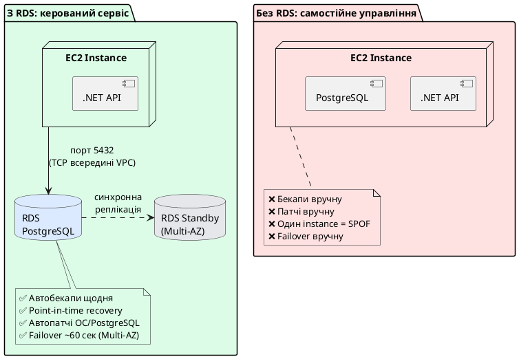

::

**RDS підтримує шість СУБД:**

- **PostgreSQL** — найпопулярніший вибір для .NET з EF Core. Відкритий, потужний, JSON підтримка
- **MySQL / MariaDB** — широко використовується у legacy проєктах
- **SQL Server** — для застосунків на .NET Framework або зі специфічними MSSQL features
- **Oracle** — для enterprise legacy систем
- **Amazon Aurora** — власна СУБД AWS, сумісна з PostgreSQL та MySQL, але з кращою продуктивністю (розглянемо окремо)

---

## RDS Instance Classes — вибір правильного сервера бази

Як і EC2, RDS instances поділяються на класи за призначенням. Формат: `db.[сімейство][покоління].[розмір]`.

Префікс `db.` відрізняє RDS instances від EC2 instances, хоча логіка сімейств аналогічна.

### Standard (General Purpose) — db.m класи

Збалансоване CPU та RAM. Підходить для більшості production баз даних.

- `db.m6g.large` — 2 vCPU, 8 GB RAM ← типовий production PostgreSQL для середнього навантаження
- `db.m6g.xlarge` — 4 vCPU, 16 GB RAM
- `db.m6g.2xlarge` — 8 vCPU, 32 GB RAM

### Memory Optimized — db.r та db.x класи

Більше RAM відносно CPU. Для баз даних, де велика частина робочого набору даних (working set) повинна поміщатись у RAM для швидкого доступу.

- `db.r6g.large` — 2 vCPU, 16 GB RAM ← якщо часто бракує shared_buffers
- `db.r6g.xlarge` — 4 vCPU, 32 GB RAM

### Burstable — db.t класи

Аналог EC2 t-сімейства з CPU Credits. Для dev/test середовищ та малонавантажених застосунків.

- `db.t3.micro` — 2 vCPU, 1 GB RAM ← **Free Tier**: 750 год/місяць на 12 місяців
- `db.t3.small` — 2 vCPU, 2 GB RAM
- `db.t3.medium` — 2 vCPU, 4 GB RAM ← мінімум для реального навчального проєкту

::tip
**Free Tier:** `db.t3.micro` з PostgreSQL або MySQL — 750 годин на місяць безкоштовно протягом першого року. Плюс 20 GB SSD storage та 20 GB backup storage. Достатньо для навчального проєкту.
::

::card-group

::card{title="db.t — Burstable (Free Tier)" icon="i-heroicons-bolt"}
CPU Credits для піків. `db.t3.micro` — Free Tier. Ідеально для розробки, навчання, стейджингу.
::

::card{title="db.m — General Purpose" icon="i-heroicons-server"}
Фіксований CPU. `db.m6g.large` — production база з передбачуваним навантаженням.
::

::card{title="db.r — Memory Optimized" icon="i-heroicons-circle-stack"}
Більше RAM. `db.r6g.large` — бази з великим робочим набором даних, аналітика.
::

::

---

## RDS Storage Types — класи накопичувачів та автоматичне масштабування сховища

Amazon RDS використовує мережеву інфраструктуру зберігання даних Amazon EBS (Elastic Block Store) і пропонує три основні типи дискових накопичувачів:

### 1. General Purpose SSD (gp2 та gp3)

- **gp2:** Продуктивність диска безпосередньо залежить від об'єму виділеного простору (базова швидкість становить 3 IOPS на кожен гігабайт). Для невеликих баз даних продуктивність може бути низькою, якщо не накопичено кредити Bursting IOPS.
- **gp3:** Сучасніший тип накопичувачів, який дозволяє незалежно налаштовувати об'єм сховища, кількість операцій введення-виведення за секунду (IOPS) та пропускну здатність (Throughput). За замовчуванням надається базова швидкість 3000 IOPS та 125 MB/s без додаткової оплати, яку можна масштабувати окремо від об'єму диска.

### 2. Provisioned IOPS SSD (io1 та io2)

Призначений для високонавантажених баз даних з інтенсивним I/O, де критично важливо забезпечити стабільний час відгуку (latencies) та гарантовану продуктивність. Дозволяє виділяти до десятків тисяч IOPS на інстанс.

### 3. Magnetic (Застарілий тип)

Використовує магнітні жорсткі диски. Має низьку продуктивність і рекомендується лише для архівних даних чи рідко використовуваних тестових середовищ із мінімальним бюджетом.

### Автоматичне масштабування сховища (Storage Auto-scaling)

Для запобігання ситуації вичерпання дискового простору (що призводить до переведення бази даних у режим `read-only` або аварійної зупинки СУБД) Amazon RDS підтримує функцію **Storage Auto-scaling**.

- **Принцип роботи:** При наближенні обсягу вільного місця до критичної межі (менше 10% від загального обсягу) та тривалості дефіциту понад 5 хвилин, сервіс автоматично збільшує розмір дискового тома на певну величину (мінімально на 10% від поточного об'єму або на 5 GB).
- **Обмеження:** Користувач може встановити максимальний ліміт масштабування (Maximum Storage Threshold) для контролю витрат. Наступне автоматичне масштабування може відбутися не раніше ніж через 6 годин після попереднього збільшення.

---

## Резервування у кількох зонах доступності (Multi-AZ) як засіб забезпечення високої доступності

**Режим високої доступності Multi-AZ (Multi-Availability Zone)** є основним архітектурним шаблоном для забезпечення відмовостійкості реляційних баз даних у хмарі AWS. При активації цього режиму Amazon RDS автоматично створює та підтримує надлишкову, синхронну копію бази даних (резервний інстанс або _standby instance_) в іншій зоні доступності (Availability Zone, AZ) у межах того самого регіону.

### Механізм синхронної реплікації

На відміну від логічної реплікації СУБД, у класичному режимі Multi-AZ використовується **синхронна реплікація на рівні фізичних блоків сховища** (storage-level replication). Процес запису даних відбувається за такою схемою:

1. Клієнтський застосунок надсилає транзакцію на запис (наприклад, команду `INSERT` чи `UPDATE`) на основний інстанс (primary).
2. Запит обробляється рушієм бази даних, і зміни записуються на локальний дисковий том (Amazon EBS) первинного інстансу.
3. Одночасно ці блоки даних дублюються через мережевий канал низької затримки на дисковий том резервного інстансу в сусідній зоні доступності.
4. Основний інстанс очікує підтвердження успішного запису блоків від резервного тому.
5. Після отримання підтвердження транзакція фіксується (commit), і клієнтський застосунок отримує відповідь про успішне виконання операції.

Завдяки синхронному характеру реплікації резервна копія завжди перебуває в ідентичному стані з основною базою даних. Це гарантує збереження даних без втрат (Recovery Point Objective, RPO = 0) у разі раптового виходу з ладу первинного вузла.

### Процес аварійного перемикання (Failover)

У разі виникнення позаштатних ситуацій (аварія обладнання, втрата живлення у зоні доступності, втрата мережевого зв'язку або планове технічне обслуговування) Amazon RDS автоматично ініціює процес аварійного перемикання (failover). Цей процес є прозорим для клієнтів і складається з таких етапів:

1. **Виявлення збою:** Внутрішні системи моніторингу AWS фіксують втрату працездатності первинного інстансу.
2. **DNS-мутація:** Amazon RDS змінює запис CNAME у внутрішній службі DNS (Amazon Route 53) для endpoint бази даних (наприклад, `mydb.xxx.eu-central-1.rds.amazonaws.com`), перенаправляючи його на IP-адресу резервного інстансу.
3. **Активація резервного вузла:** Резервний інстанс переводиться зі статусу standby у статус primary, починаючи приймати нові з'єднання.
4. **Реконструкція надлишковості:** Після відновлення працездатності пошкодженої зони доступності (або створення нового інстансу в іншій AZ) Amazon RDS автоматично створює новий standby інстанс і відновлює синхронну реплікацію.

Час аварійного перемикання зазвичай становить **від 60 до 120 секунд**. Під час цього інтервалу застосунок отримуватиме помилки з'єднання (Connection Errors), тому в архітектурі підключення життєво важливо використовувати механізми автоматичного повторення спроб (Retries).

::plant-uml

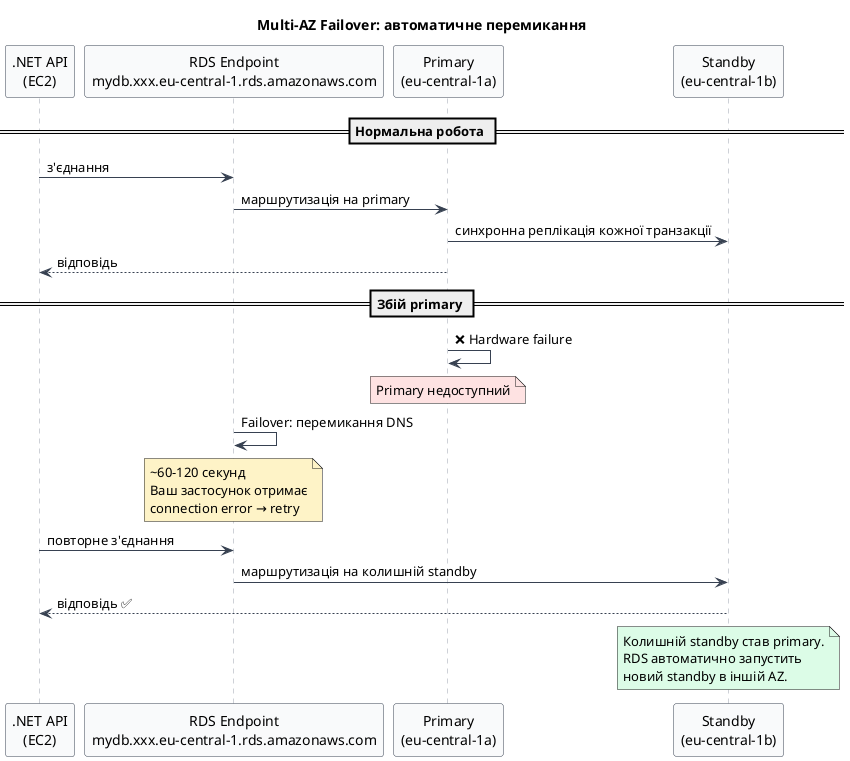

::

**Важливо:** Резервний інстанс (standby) функціонує виключно у гарячому резерві. Він не має власного мережевого endpoint і не може приймати жодних запитів на читання (`SELECT`), оскільки його операційна система та процесорні ресурси зарезервовані суто для реплікації блоків.

**Вартість:** Використання режиму Multi-AZ подвоює як вартість обчислювальних ресурсів (оренда двох інстансів), так і вартість виділеного дискового простору, оскільки сховище дублюється в обох зонах доступності.

::caution
Для промислових (production) баз даних конфігурація Multi-AZ є обов'язковим стандартом проектування. Для тестових та навчальних середовищ цю опцію доцільно вимикати з метою економії бюджету.
::

---

## Репліки читання (Read Replicas) як інструмент горизонтального масштабування

Для розв'язання проблеми високої інтенсивності операцій читання (наприклад, при переважній більшості GET-запитів над POST/PUT) використовується механізм **реплік читання (Read Replicas)**. На відміну від пасивного Multi-AZ standby, кожна репліка читання є повноцінним незалежним інстансом бази даних із власним DNS-endpoint, який доступний для підключення і обробки запитів `SELECT`.

### Асинхронна реплікація та концепція узгодженості в кінцевому підсумку

Реплікація даних між основним інстансом та репліками читання відбувається **асинхронно**.

1. Основна база даних фіксує транзакцію і відразу повертає відповідь клієнту, не очікуючи на репліку.
2. Транзакційні журнали (Write-Ahead Logs, WAL для PostgreSQL або binary logs для MySQL) надсилаються мережею на репліки.
3. Репліки застосовують ці журнали до свого локального сховища.

Оскільки процес передачі та застосування логів потребує часу, виникає затримка реплікації (Replication Lag), яка за нормальних умов становить від кількох мілісекунд до кількох секунд. Це зумовлює модель **узгодженості в кінцевому підсумку (eventual consistency)**: дані, записані на primary, з'являться на репліці з невеликим запізненням. Якщо користувач оновив свій профіль і миттєво зробив GET-запит через репліку, він може на частку секунди побачити старі дані.

### Архітектура та географічне розташування

Amazon RDS підтримує створення до 5 реплік читання для класичних рушіїв СУБД. Вони можуть бути розгорнуті в різних топологіях:

- **Внутрішньорегіональні (Intra-Region Replicas):** Розміщуються у різних зонах доступності того самого регіону для масштабування локальних читань та підвищення стійкості.
- **Міжрегіональні (Cross-Region Replicas):** Розміщуються в інших географічних регіонах AWS. Це дозволяє наблизити дані до користувачів у різних куточках світу (сниження затримки мережі) та спрощує стратегії аварійного відновлення (Disaster Recovery). Крім того, міжрегіональну репліку за необхідності можна підвищити (promote) до статусу незалежної основної бази даних.
- **Каскадні репліки (Cascaded Replicas):** Створення репліки з іншої репліки для зменшення навантаження на основний інстанс (доступно для MySQL та MariaDB).

### Реалізація розподілу потоків читання/запису в Entity Framework Core

У застосунках на базі .NET для інтеграції з репліками читання необхідно конфігурувати два окремі підключення, оскільки стандартні ORM-системи не мають вбудованого механізму автоматичної маршрутизації SQL-запитів. Це реалізується шляхом реєстрації двох контекстів бази даних:

::plant-uml

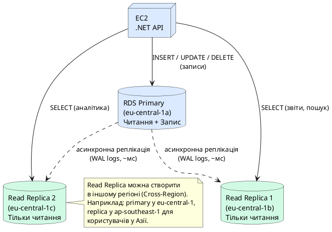

::

```csharp
// appsettings.json
{
  "ConnectionStrings": {
    "Primary": "Host=mydb.xxx.rds.amazonaws.com;Database=myapp;Username=app;Password=...",
    "ReadReplica": "Host=mydb-replica.xxx.rds.amazonaws.com;Database=myapp;Username=app;Password=..."
  }
}

// Program.cs — реєстрація контекстів даних
builder.Services.AddDbContext<AppDbContext>(options =>
    options.UseNpgsql(builder.Configuration.GetConnectionString("Primary")));

builder.Services.AddDbContext<ReadOnlyDbContext>(options =>
    options.UseNpgsql(builder.Configuration.GetConnectionString("ReadReplica"))
           .UseQueryTrackingBehavior(QueryTrackingBehavior.NoTracking)); // Оптимізація: вимкнення відстеження
```

Приклад використання у бізнес-логіці із явною маршрутизацією:

```csharp
public class ProductService(AppDbContext db, ReadOnlyDbContext readDb)
{
    // Запити на читання спрямовуються на репліку
    public async Task<List<Product>> GetAllAsync() =>
        await readDb.Products.ToListAsync();

    // Операції модифікації даних виконуються виключно на основному інстансі
    public async Task CreateAsync(Product product)
    {
        db.Products.Add(product);
        await db.SaveChangesAsync();
    }
}
```

---

## Стратегії резервного копіювання та механізм Point-in-Time Recovery (PITR)

Забезпечення збереженості даних та можливості їх відновлення у разі критичних збоїв є фундаментальним аспектом адміністрування баз даних. Amazon RDS надає два взаємодоповнюючі механізми резервного копіювання: автоматичне резервне копіювання (Automated Backups) та створення знімків стану вручну (Manual Snapshots).

### Порівняльний аналіз автоматичних та ручних копій

| Характеристика                     | Автоматичне резервне копіювання (Automated Backups)                                                       | Ручні знімки стану (Manual Snapshots)                                                                            |
| :--------------------------------- | :-------------------------------------------------------------------------------------------------------- | :--------------------------------------------------------------------------------------------------------------- |
| **Ініціація**                      | Виконується сервісом автоматично в межах визначеного вікна обслуговування (Backup Window).                | Створюється адміністратором вручну за запитом через консоль, CLI або API.                                        |
| **Термін зберігання**              | Регулюється параметром _Retention Period_ (від 1 до 35 днів). Після завершення періоду копії видаляються. | Зберігається безстроково (до моменту явного видалення користувачем).                                             |
| **Життєвий цикл при видаленні БД** | За замовчуванням усі автоматичні копії видаляються разом із видаленням інстансу бази даних.               | Зберігаються як незалежні ресурси навіть після повного видалення первинного інстансу СУБД.                       |
| **Призначення**                    | Використовується для відновлення стану бази на будь-який момент часу (PITR) за останні дні.               | Застосовується для довгострокового архівування або фіксації стану системи перед великими релізами чи міграціями. |

### Механізм відновлення на конкретний момент часу (Point-in-Time Recovery, PITR)

Відновлення на конкретний момент часу є ключовою функцією Amazon RDS для мінімізації цільової точки відновлення (Recovery Point Objective, RPO) до рівня кількох секунд. Цей процес базується на комбінації двох джерел даних:

1. **Повні знімки сховища (Daily Snapshots):** Фізичні копії всіх блоків диска інстансу, що створюються один раз на добу під час резервного вікна.
2. **Архівні транзакційні журнали (Transaction Logs):** Журнали випереджального запису (Write-Ahead Logs, WAL для PostgreSQL або Binary Logs для MySQL), які безперервно копіюються до ізольованого сховища Amazon S3 з інтервалом у 5 хвилин.

**Алгоритм виконання операції PITR:**

1. Користувач ініціює процес відновлення, вказуючи бажану часову мітку (наприклад, за секунду до виконання помилкового SQL-запиту).
2. Amazon RDS аналізує метадані та розгортає найбільш актуальний повний знімок стану, створений _до_ вказаного моменту часу.
3. Система створює новий інстанс бази даних і підключає відновлене з повного знімка сховище.
4. На новому інстансі автоматично запускається процес програвання (replay) транзакційних журналів. Усі транзакції, зафіксовані в інтервалі між часом створення знімка та вказаною міткою, послідовно застосовуються до бази даних.
5. Після завершення накату логів новий інстанс бази даних переходить у статус `available` і стає доступним для використання.

::plant-uml

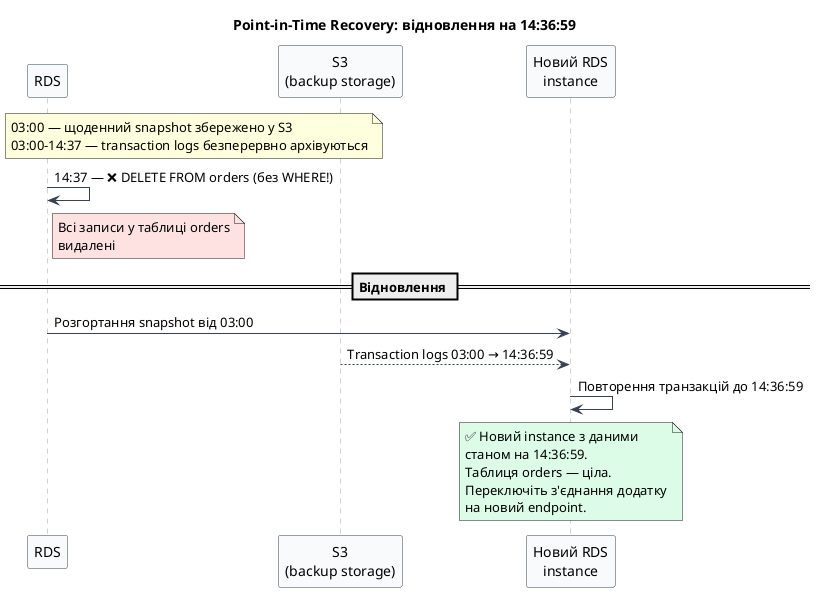

::

> [!IMPORTANT]
> Процедура Point-in-Time Recovery завжди призводить до створення **нового інстансу бази даних** із новим мережевим endpoint. Поточний інстанс залишається без змін, що запобігає випадковому перезапису даних під час відновлення та дозволяє виконати порівняльний аналіз стану до і після аварії.

### Створення знімка стану вручну (Manual Snapshot)

Перед виконанням операцій, пов'язаних із ризиком втрати цілісності даних (наприклад, великі міграції схем або масові оновлення даних), рекомендується створювати знімки стану вручну.

::tabs

::tabs-item{label="AWS CLI (bash)"}

```bash
# Створення знімка стану вручну перед виконанням міграції схеми
aws rds create-db-snapshot \
    --db-instance-identifier my-production-db \
    --db-snapshot-identifier before-migration-v2-$(date +%Y%m%d) \
    --region eu-central-1
```

::

::tabs-item{label="AWS CLI (PowerShell)"}

```powershell
# Створення знімка стану вручну перед виконанням міграції схеми
$dateStr = Get-Date -Format "yyyyMMdd"
aws rds create-db-snapshot `
    --db-instance-identifier my-production-db `
    --db-snapshot-identifier before-migration-v2-$dateStr `
    --region eu-central-1
```

::

::

---

## RDS Security — захист бази даних

Безпека RDS будується на кількох незалежних рівнях, кожен з яких важливий.

### Мережева безпека та ізоляція (VPC)

**Фундаментальне правило:** інстанс СУБД промислового рівня ніколи не повинен мати прямих публічних IP-адрес чи бути доступним безпосередньо з мережі Інтернет. Параметр `Publicly accessible` під час створення інстансу завжди має бути встановлений у положення `No`.

Інстанс бази даних розміщується виключно у **приватних підмережах (Private Subnets)** віртуальної приватної хмари (VPC). Такі підмережі не мають маршрутів до Інтернет-шлюзу (Internet Gateway). Мережевий доступ дозволяється лише авторизованим ресурсам всередині тієї самої VPC — віртуальним машинам EC2, контейнерам ECS/EKS або безсерверним функціям AWS Lambda.

### Налаштування міжмережевих екранів (Security Groups)

Security Group для інстансу RDS виступає у ролі віртуального міжмережевого екрана (stateful firewall), який контролює вхідний і вихідний трафік. Для бази даних PostgreSQL стандартним портом підключення є `5432/TCP`. Конфігурація правил повинна відповідати принципу найменших привілеїв:

- **Вхідний трафік (Inbound Rules):** дозволено TCP порт `5432`. Як джерело (Source) слід вказувати ідентифікатор Security Group серверів застосунків (наприклад, `sg-dotnet-api`), а не статичні діапазони IP-адрес.
- **Вихідний трафік (Outbound Rules):** за замовчуванням повністю обмежується, оскільки інстансу бази даних немає необхідності ініціювати вихідні мережеві сесії.

#### Зв'язування Security Groups (Security Group Referencing)

Використання конкретних IP-адрес або CIDR-блоків у налаштуваннях безпеки є серйозною помилкою адміністрування в динамічних хмарних середовищах. При перезапуску інстансів EC2 їхні публічні та приватні IP-адреси можуть змінюватися (якщо не використовуються Elastic IP). Механізм зв'язування Security Groups дозволяє дозволити доступ будь-якому ресурсу, який асоційований із певною групою безпеки (Source = `sg-XXXX`), незалежно від його поточної мережевої адреси.

::plant-uml

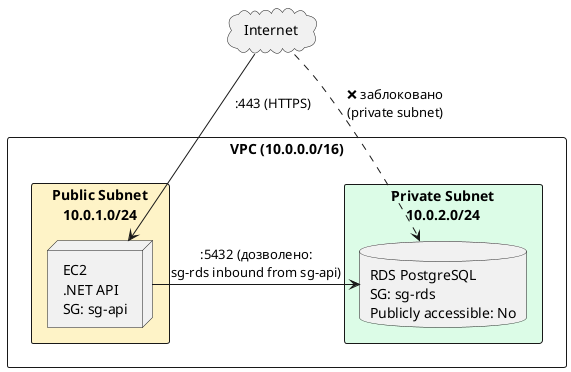

::

### Шифрування даних на фізичному рівні (Encryption at Rest)

Для захисту даних від несанкціонованого доступу на фізичному рівні (наприклад, у разі вилучення або компрометації фізичних носіїв у дата-центрі) Amazon RDS підтримує шифрування за допомогою інтеграції з **AWS Key Management Service (KMS)**.

- **Алгоритм шифрування:** Використовується симетричний стандарт AES з довжиною ключа 256 біт (AES-256).
- **Обсяг шифрування:** Шифруванню підлягають первинний дисковий том інстансу, системні логи, тимчасові файли `tempdb`, автоматичні резервні копії, ручні знімки стану та всі репліки читання.
- **Технологія конвертного шифрування (Envelope Encryption):** Дані шифруються унікальним ключем даних (data key), який, у свою чергу, шифрується під керуванням головного ключа (KMS Customer Managed Key або AWS Managed Key для RDS).
- **Вплив на продуктивність:** Завдяки апаратній підтримці шифрування на рівні фізичних хостів AWS (використання інструкцій AES-NI або чипів AWS Nitro), вплив на затримки введення-виведення (I/O latency) є мінімальним і зазвичай непомітним для застосунку.

> [!IMPORTANT]
> Шифрування накопичувачів можна активувати **виключно під час створення інстансу бази даних**. Для увімкнення шифрування на існуючій незашифрованій базі даних необхідно виконати таку послідовність дій:
>
> 1. Створити знімок стану (snapshot) незашифрованої бази даних.
> 2. Скопіювати створений знімок, вказавши при копіюванні опцію шифрування та обравши KMS ключ.
> 3. Відновити новий інстанс бази даних із зашифрованої копії знімка стану.

### Шифрування трафіку (Encryption in Transit)

Для запобігання перехопленню даних у процесі їх транспортування мережею (атаки типу Man-in-the-Middle) усі транзакції мають шифруватися за допомогою протоколу SSL/TLS.

- **Довіра до сертифікатів:** Amazon RDS надає власні регіональні та глобальні центри сертифікації (Certificate Authorities, CA). Для перевірки справжності вузла застосунок повинен валідувати сертифікат сервера за допомогою кореневого сертифіката AWS (AWS Root CA).
- **Конфігурація Npgsql:** У бібліотеці підключення Npgsql для .NET автентифікація сервера та шифрування налаштовується в рядку з'єднання:
    ```
    Host=mydb.xxx.rds.amazonaws.com;Database=myapp;Username=app;Password=secret;SSL Mode=Require;Trust Server Certificate=false;
    ```
    Параметр `SSL Mode=Require` зобов'язує клієнта встановлювати виключно шифроване з'єднання. Встановлення `Trust Server Certificate=false` гарантує, що клієнт буде перевіряти підпис сервера через локальне сховище довірених кореневих сертифікатів операційної системи (де має бути встановлений сертифікат AWS RDS CA).

### Автентифікація за допомогою AWS IAM (IAM Database Authentication)

Традиційний метод доступу за допомогою статичних паролів створює ризики витоку облікових даних через конфігураційні файли. Альтернативним підходом є використання **IAM Database Authentication**.

- **Принцип роботи:** Замість пароля клієнт використовує тимчасово генерований маркер автентифікації (Auth Token). Генерація токена виконується клієнтом локально за допомогою бібліотек AWS SDK та протоколу **AWS Signature Version 4**.
- **Термін дії маркерів:** Кожен згенерований токен має обмежений життєвий цикл тривалістю **15 хвилин**. Це означає, що скомпрометований токен швидко втрачає валідність.
- **Безпарольний доступ:** Віртуальні машини EC2 або функції Lambda можуть використовувати свої асоційовані IAM-ролі для автентифікації у базі даних без збереження секретів у вихідному коді чи конфігураціях.

Приклад програмного отримання токена в .NET:

```csharp
using Amazon;
using Amazon.RDS;

// Створення клієнта Amazon RDS для взаємодії з API
var client = new AmazonRDSClient(RegionEndpoint.EUCentral1);

// Генерація одноразового маркеру доступу
string token = RDSAuthTokenGenerator.GenerateAuthToken(
    region: "eu-central-1",
    dbHostName: "mydb.xxx.rds.amazonaws.com",
    port: 5432,
    dbUserName: "iam_db_user"
);

// Отриманий токен використовується як значення пароля у connection string
string connectionString = $"Host=mydb.xxx.rds.amazonaws.com;Database=myapp;Username=iam_db_user;Password={token};SSL Mode=Require;";
```

### Конфігурування СУБД за допомогою Parameter Groups та Option Groups

У керованому сервісі Amazon RDS прямий доступ до файлової системи сервера (через SSH) відсутній, тому традиційне редагування конфігураційних файлів (таких як `postgresql.conf` або `my.cnf`) є неможливим. Замість цього адміністрування параметрів ядра бази даних здійснюється за допомогою двох сутностей: Parameter Groups та Option Groups.

#### Parameter Groups (Групи параметрів)

Групи параметрів регулюють внутрішні налаштування двигуна СУБД та керування пам'яттю. За замовчуванням до кожного нового інстансу прикріплюється `Default Parameter Group`, параметри якої не підлягають модифікації. Для внесення змін необхідно створити кастомну групу параметрів.

Параметри поділяються на дві категорії за способом застосування:

- **Динамічні (Dynamic):** зміни застосовуються миттєво в рантаймі без необхідності перезавантаження бази даних.
- **Статичні (Static):** для застосування змін потрібен ручний перезапуск (reboot) інстансу бази даних.

Основні параметри оптимізації для PostgreSQL:

| Назва параметра              | Тип застосування | Рекомендоване значення                                                | Технічне обґрунтування                                                                                                                                               |
| :--------------------------- | :--------------- | :-------------------------------------------------------------------- | :------------------------------------------------------------------------------------------------------------------------------------------------------------------- |
| `shared_buffers`             | Статичний        | `25%` від загального обсягу RAM інстансу.                             | Визначає обсяг оперативної пам'яті, що виділяється для спільного кешування сторінок даних.                                                                           |
| `max_connections`            | Статичний        | Залежно від типу інстансу (формула: `DBInstanceClassMemory/9531392`). | Встановлює ліміт одночасних клієнтських сесій.                                                                                                                       |
| `log_min_duration_statement` | Динамічний       | `1000` (мс)                                                           | Визначає поріг тривалості виконання запитів, вище якого вони автоматично реєструються в логах для аналізу повільних SQL-інструкцій.                                  |
| `work_mem`                   | Динамічний       | `16MB` – `64MB`                                                       | Обсяг пам'яті для виконання внутрішніх операцій сортування (`ORDER BY`, `DISTINCT`) та з'єднань хешуванням (`HASH JOIN`). Виділяється під кожен запит індивідуально. |
| `log_lock_waits`             | Динамічний       | `on`                                                                  | Активує логування подій, коли транзакція очікує блокування довше, ніж встановлено параметром `deadlock_timeout`.                                                     |

#### Option Groups (Групи опцій)

Option Groups призначені для активації та керування додатковими хмарними можливостями, які вимагають встановлення стороннього ПЗ на сервері бази даних, ліцензування або специфічної інтеграції. Наприклад:

- **PostgreSQL:** Дозволяє підключати розширення (Extensions), такі як `PostGIS` (геопросторові дані) або `pg_cron` (планувальник завдань).
- **SQL Server:** Використовується для активації функції прозорого шифрування даних (Transparent Data Encryption, TDE), інтеграції зі службами Active Directory або налаштування резервного копіювання безпосередньо в S3 (Native Backup/Restore).
- **Oracle:** Керує додатковими опціями оптимізації та безпеки, такими як Oracle Label Security.

::tip
Для застосунків на базі .NET важливим є контроль над лімітом з'єднань. У PostgreSQL кожне нове підключення створює окремий операційний процес СУБД, що споживає оперативну пам'ять. Якщо ліміт `max_connections` вичерпано, нові спроби підключення завершуватимуться помилками. Для вирішення цієї проблеми слід використовувати RDS Proxy.
::

---

## Моніторинг та логування (Monitoring & Logging) у Amazon RDS

Для контролю за станом бази даних, оптимізації запитів та оперативного реагування на системні інциденти Amazon RDS пропонує багаторівневу систему спостереження.

### 1. CloudWatch Metrics (Базові метрики)

Стандартний моніторинг здійснюється через сервіс Amazon CloudWatch, який збирає метрики з частотою від 1 до 5 хвилин на рівні віртуального середовища (hypervisor). Ключові метрики:

- `CPUUtilization`: Відсоток завантаження процесора.
- `FreeableMemory`: Обсяг доступної оперативної пам'яті.
- `DatabaseConnections`: Кількість активних сесій.
- `ReadIOPS` / `WriteIOPS`: Середня кількість операцій читання/запису на секунду.

### 2. Enhanced Monitoring (Розширений моніторинг)

Enhanced Monitoring збирає метрики безпосередньо з операційної системи хоста, на якому розгорнуто СУБД, за допомогою спеціального агента. Це дозволяє отримувати детальну інформацію про використання CPU окремими процесами бази даних, стан пам'яті та дискової підсистеми з гранулярністю до **1 секунди**. Це є критично важливим для локалізації короткочасних сплесків навантаження (micro-bursts).

### 3. Performance Insights (Аналіз продуктивності)

Performance Insights — це візуальний інструмент для оцінки навантаження на базу даних за категоріями очікування (DB Load за Wait Events). Він дозволяє виявити:

- Які саме SQL-запити генерують найбільше навантаження.
- З яких хостів (IP-адрес застосунків) або від яких користувачів СУБД надходить найбільше запитів.
- Які саме типи блокувань чи очікувань ресурсів (наприклад, очікування дискового введення-виведення або блокування рядків) гальмують роботу застосунку.

### 4. Експорт журналів (CloudWatch Logs Integration)

Amazon RDS дозволяє налаштувати автоматичний експорт логів СУБД (для PostgreSQL: `postgresql.log`, журналів повільних записів slow query logs, логів транзакцій) до Amazon CloudWatch Logs. Це дає змогу налаштувати фільтри метрик, створювати сповіщення (Alarms) на основі критичних помилок у логах та здійснювати довгострокове архівування подій.

---

## Amazon Aurora — хмарно-орієнтована розподілена архітектура СУБД

**Amazon Aurora** — це сучасна власна реляційна база даних від AWS, розроблена спеціально для хмарного середовища. Вона зберігає повну сумісність на рівні драйверів та клієнтських протоколів із СУБД PostgreSQL та MySQL, але кардинально відрізняється від класичного RDS на архітектурному рівні.

### Відокремлення обчислень від сховища даних (Compute and Storage Separation)

Ключовою архітектурною інновацією Amazon Aurora є повне розділення шару обчислень (Compute Nodes — процесорні потужності та оперативна пам'ять) та розподіленого шару збереження даних (Shared Storage Layer).

- **У класичному RDS:** Кожен інстанс має власний виділений дисковий том EBS. При створенні репліки дані фізично дублюються на окремий диск іншої віртуальної машини.
- **В Aurora:** Існує єдиний віртуальний розподілений пул сховища (Aurora Storage Volume), який динамічно збільшується до 128 TB. Обчислювальні вузли (один Writer для запису та до 15 Reader інстансів для читання) підключаються до цього спільного пулу.

#### Механізм реплікації та кворуму сховища Aurora Storage

Розподілений шар зберігання даних Aurora автоматично створює **6 копій кожного блоку даних та розподіляє їх між 3 зонами доступності (AZ)** в обраному регіоні.

- **Надійність:** Вихід з ладу однієї зони доступності (2 копії даних) або навіть двох (3 копії) не призводить до втрати даних.
- **Кворум запису (Write Quorum):** Для успішного завершення операції запису достатньо підтвердження від 4 з 6 копій (4/6 write quorum), що забезпечує надзвичайно високу швидкість обробки транзакцій.
- **Кворум читання (Read Quorum):** Для зчитування достатньо звернутися до 3 з 6 копій (3/6 read quorum), хоча зазвичай читання виконується локально з кешу обчислювального вузла.

::plant-uml

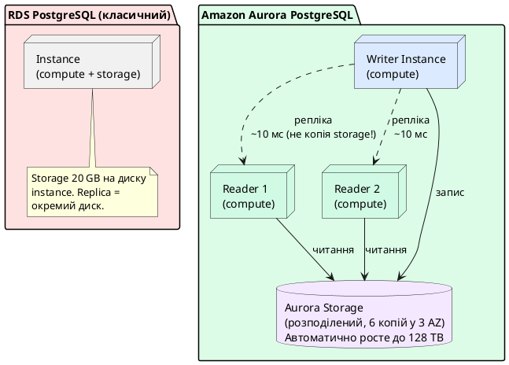

::

**Переваги Aurora над RDS PostgreSQL:**

| Характеристика       | RDS PostgreSQL                  | Aurora PostgreSQL             |
| -------------------- | ------------------------------- | ----------------------------- |
| Storage              | EBS (один диск)                 | Розподілений (6 копій у 3 AZ) |
| Failover             | ~60–120 сек                     | ~30 сек                       |
| Read Replicas        | до 5, кожна = окрема реплікація | до 15, спільний storage       |
| Storage auto-scaling | Ручне збільшення                | Автоматично до 128 TB         |
| Ціна                 | Дешевше                         | ~20% дорожче за instance      |
| Резервні копії       | 7–35 днів, PITR                 | Безперервні, миттєві snapshot |

### Масштабування за допомогою Aurora Serverless v2

Технологія **Aurora Serverless v2** забезпечує повністю автоматичне динамічне масштабування обчислювальних ресурсів бази даних у режимі реального часу.

- **Одиниця виміру (ACU):** Масштабування обчислювальних ресурсів (процесорної потужності та RAM) вимірюється в **Aurora Capacity Units (ACU)**. 1 ACU еквівалентний приблизно 2 GB оперативної пам'яті та відповідній потужності процесорних ядер.
- **Механізм масштабування:** Замість тривалого процесу зміни класу інстансу (який у класичному RDS потребує хвилин та може супроводжуватися короткочасним даунтаймом), Aurora Serverless v2 динамічно збільшує або зменшує кількість ACU (наприклад, від 0.5 до 128 ACU) за мілісекунди без переривання активних транзакцій та з'єднань користувача.
- **Оптимізація витрат:** Оплата здійснюється виключно за фактично спожиті ACU за секунду, що робить цю технологію ідеальною для систем із непередбачуваним або вираженим періодичним навантаженням.

---

## RDS Proxy — управління пулом з'єднань

**Проблема Connection Pooling:** кожне з'єднання до PostgreSQL — це окремий процес на сервері бази (~5–10 MB RAM кожен). При `max_connections = 100` і кількох EC2 instances по 30 з'єднань кожен — ресурс швидко вичерпується. При масштабуванні на Lambda (тисячі паралельних invocations) ситуація стає критичною: Lambda не підтримує постійний pool.

**RDS Proxy** — це повністю керований проксі-сервер між вашим застосунком і RDS. Він підтримує **довготривалий пул з'єднань** до бази і мультиплексує багато короткоживучих з'єднань від клієнтів у кілька постійних.

::plant-uml

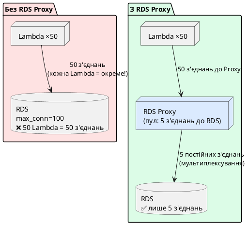

::

**Додаткові переваги RDS Proxy:**

- **Failover:** при Multi-AZ failover Proxy автоматично перенаправляє з'єднання, не розриваючи існуючі сесії клієнтів (замість ~60 сек → ~5 сек для застосунку)
- **IAM Authentication:** Proxy підтримує IAM-токени — Lambda функції можуть підключатись без паролів
- **Secret Manager інтеграція:** пароль бази зберігається у Secrets Manager, Proxy сам ротує і читає — ваш код паролів не бачить

**Connection string до RDS Proxy** виглядає ідентично до прямого підключення — лише hostname змінюється на endpoint Proxy. Для .NET/EF Core нічого більше змінювати не потрібно.

---

## Підключення .NET до RDS — Entity Framework Core

Розглянемо повний цикл: від connection string до Code-First міграцій на production RDS instance.

### Встановлення пакетів

```bash
# PostgreSQL провайдер для EF Core
dotnet add package Npgsql.EntityFrameworkCore.PostgreSQL

# SQL Server провайдер (якщо RDS SQL Server)
# dotnet add package Microsoft.EntityFrameworkCore.SqlServer

# Інструменти для міграцій
dotnet add package Microsoft.EntityFrameworkCore.Design
```

### DbContext та моделі

```csharp
// Models/Product.cs
public class Product
{
    public int Id { get; set; }
    public string Name { get; set; } = string.Empty;
    public decimal Price { get; set; }
    public DateTime CreatedAt { get; set; } = DateTime.UtcNow;
}

// Data/AppDbContext.cs
public class AppDbContext(DbContextOptions<AppDbContext> options) : DbContext(options)
{
    public DbSet<Product> Products => Set<Product>();

    protected override void OnModelCreating(ModelBuilder modelBuilder)
    {
        modelBuilder.Entity<Product>(entity =>
        {
            entity.Property(p => p.Name).HasMaxLength(200).IsRequired();
            entity.Property(p => p.Price).HasPrecision(18, 2);
        });
    }
}
```

### Connection String — безпечне зберігання

**Ніколи** не хардкодьте паролі у `appsettings.json` у репозиторії. Для .NET на AWS є кілька підходів:

```csharp
// Program.cs — зчитуємо з AWS Secrets Manager
builder.Services.AddDbContext<AppDbContext>(options =>
{
    // Варіант 1: через Environment Variable (задається в ECS Task Definition / EC2 User Data)
    var connStr = Environment.GetEnvironmentVariable("DB_CONNECTION_STRING")
        ?? builder.Configuration.GetConnectionString("Default");

    options.UseNpgsql(connStr, npgsqlOptions =>
    {
        // Автоматичний retry при transient помилках (failover, мережеві збої)
        npgsqlOptions.EnableRetryOnFailure(
            maxRetryCount: 3,
            maxRetryDelay: TimeSpan.FromSeconds(5),
            errorCodesToAdd: null);
    });
});
```

```json
// appsettings.Development.json (тільки для локальної розробки!)
{
    "ConnectionStrings": {
        "Default": "Host=localhost;Database=myapp_dev;Username=postgres;Password=localpassword"
    }
}
```

### Code-First міграції на RDS

```bash
# Генерувати міграцію локально
dotnet ef migrations add InitialCreate

# Застосувати до локальної бази
dotnet ef database update

# Застосувати до RDS (через змінну середовища з реальним connection string)
DB_CONNECTION_STRING="Host=mydb.xxx.rds.amazonaws.com;Database=myapp;Username=app;Password=..." \
  dotnet ef database update --no-build
```

::caution
**Ніколи** не запускайте `database update` автоматично при старті застосунку (`context.Database.Migrate()` у `Program.cs`) у production. Міграція може займати хвилини на великій базі, заблокувати таблиці та покласти застосунок. Виконуйте міграції як окремий крок у CI/CD пайплайні перед деплоєм нової версії.
::

### EnableRetryOnFailure — чому це критично

При Multi-AZ failover (~60–120 сек) існуючі з'єднання до primary instance розриваються. Без retry-логіки ваш API поверне 500 на всі запити під час failover. З `EnableRetryOnFailure` Npgsql автоматично повторить запит — і до моменту, коли DNS оновиться на новий primary, більшість запитів відновиться без помилок для кінцевого користувача.

---

## Практичний приклад: .NET Web API + RDS PostgreSQL від А до Я

::note
Цей розділ охоплює повний цикл: від нуля до працюючого .NET Web API на EC2, підключеного до RDS PostgreSQL. Всі кроки виконуються послідовно.
::

::plant-uml

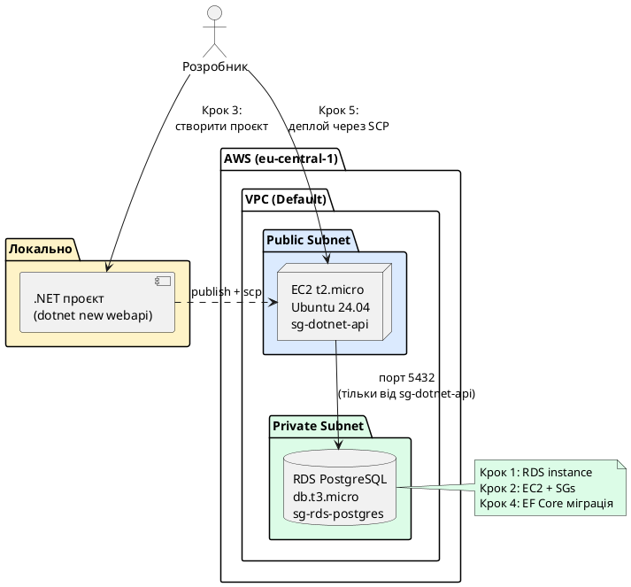

::

### Передумови

::card-group

::card{title="AWS CLI" icon="i-heroicons-command-line"}
Встановлений та налаштований (`aws configure`). Перевірте: `aws sts get-caller-identity`
::

::card{title=".NET SDK 9" icon="i-heroicons-code-bracket"}
Встановлений локально. Перевірте: `dotnet --version`
::

::card{title="AWS акаунт" icon="i-heroicons-user-circle"}
IAM користувач з правами EC2FullAccess + RDSFullAccess
::

::

---

### Крок 1: Створення RDS PostgreSQL instance

::tabs

::tabs-item{label="AWS Console"}

1. Відкрийте **RDS** → **Create database**
2. **Choose a database creation method:** Standard create
3. **Engine options:** PostgreSQL → версія **16.x (latest)**
4. **Templates:** Free tier _(автоматично обирає `db.t3.micro`, вимикає Multi-AZ)_
5. **DB instance identifier:** `my-dotnet-app-db`
6. **Master username:** `postgres`
7. **Master password:** задайте надійний пароль та **збережіть його**
8. **DB instance class:** `db.t3.micro` _(Free Tier)_
9. **Storage:** gp2, 20 GB _(Free Tier включає 20 GB)_
10. **Connectivity:**
    - VPC: Default VPC
    - Public access: **No**
    - VPC Security group: Create new → назва `sg-rds-postgres`
11. **Additional configuration → Initial database name:** `myapp`
12. **Backup retention:** 7 days
13. **Create database** → очікуйте ~5-10 хвилин

::

::tabs-item{label="AWS CLI (bash)"}

```bash
# Знайти Default VPC
VPC_ID=$(aws ec2 describe-vpcs \
    --filters "Name=isDefault,Values=true" \
    --query "Vpcs[0].VpcId" --output text --region eu-central-1)
echo "VPC: $VPC_ID"

SUBNET_IDS=$(aws ec2 describe-subnets \
    --filters "Name=vpcId,Values=$VPC_ID" \
    --query "Subnets[*].SubnetId" --output text --region eu-central-1)

# Створити DB Subnet Group
# ПРИМІТКА: DB Subnet Group визначає підмережі (Subnets) у межах VPC, у яких RDS може створювати мережеві інтерфейси.
# Для забезпечення високої доступності (навіть якщо інстанс запускається у Single-AZ режимі) AWS вимагає вказувати
# підмережі щонайменше у ДВОХ різних зонах доступності (Availability Zones).
aws rds create-db-subnet-group \
    --db-subnet-group-name my-dotnet-app-subnet-group \
    --db-subnet-group-description "Subnet group for my-dotnet-app" \
    --subnet-ids $(echo $SUBNET_IDS | tr ' ' '\n' | head -2 | tr '\n' ' ') \
    --region eu-central-1

# Створити Security Group для RDS
SG_RDS=$(aws ec2 create-security-group \
    --group-name sg-rds-postgres \
    --description "RDS PostgreSQL security group" \
    --vpc-id $VPC_ID \
    --query "GroupId" --output text --region eu-central-1)

# Тимчасово дозволити VPC-рівень (замінимо на SG-рівень у кроці 2)
aws ec2 authorize-security-group-ingress \
    --group-id $SG_RDS --protocol tcp --port 5432 \
    --cidr 10.0.0.0/16 --region eu-central-1

# Створити RDS instance
aws rds create-db-instance \
    --db-instance-identifier my-dotnet-app-db \
    --db-instance-class db.t3.micro \
    --engine postgres --engine-version "16.3" \
    --master-username postgres \
    --master-user-password "YourSecurePassword123!" \
    --allocated-storage 20 \
    --db-name myapp \
    --db-subnet-group-name my-dotnet-app-subnet-group \
    --vpc-security-group-ids $SG_RDS \
    --no-publicly-accessible \
    --backup-retention-period 7 \
    --no-multi-az \
    --region eu-central-1

# Дочекатись статусу available (~5-10 хв)
aws rds wait db-instance-available \
    --db-instance-identifier my-dotnet-app-db --region eu-central-1

# Отримати endpoint
RDS_ENDPOINT=$(aws rds describe-db-instances \
    --db-instance-identifier my-dotnet-app-db \
    --query "DBInstances[0].Endpoint.Address" \
    --output text --region eu-central-1)
echo "RDS Endpoint: $RDS_ENDPOINT"
```

::

::tabs-item{label="AWS CLI (PowerShell)"}

```powershell
# Знайти Default VPC
$VPC_ID = aws ec2 describe-vpcs `
    --filters "Name=isDefault,Values=true" `
    --query "Vpcs[0].VpcId" --output text --region eu-central-1
Write-Host "VPC: $VPC_ID"

$SUBNET_IDS = (aws ec2 describe-subnets `
    --filters "Name=vpcId,Values=$VPC_ID" `
    --query "Subnets[*].SubnetId" --output text --region eu-central-1) -split '\s+'
$SUBNET_PAIR = ($SUBNET_IDS | Select-Object -First 2) -join ' '

# Створити DB Subnet Group
# ПРИМІТКА: DB Subnet Group визначає підмережі (Subnets) у межах VPC, у яких RDS може створювати мережеві інтерфейси.
# Для забезпечення високої доступності (навіть якщо інстанс запускається у Single-AZ режимі) AWS вимагає вказувати
# підмережі щонайменше у ДВОХ різних зонах доступності (Availability Zones).
aws rds create-db-subnet-group `
    --db-subnet-group-name my-dotnet-app-subnet-group `
    --db-subnet-group-description "Subnet group for my-dotnet-app" `
    --subnet-ids $SUBNET_PAIR `
    --region eu-central-1

# Створити Security Group для RDS
$SG_RDS = aws ec2 create-security-group `
    --group-name sg-rds-postgres `
    --description "RDS PostgreSQL security group" `
    --vpc-id $VPC_ID `
    --query "GroupId" --output text --region eu-central-1

# Тимчасово дозволити VPC-рівень
aws ec2 authorize-security-group-ingress `
    --group-id $SG_RDS --protocol tcp --port 5432 `
    --cidr 10.0.0.0/16 --region eu-central-1

# Створити RDS instance
aws rds create-db-instance `
    --db-instance-identifier my-dotnet-app-db `
    --db-instance-class db.t3.micro `
    --engine postgres --engine-version "16.3" `
    --master-username postgres `
    --master-user-password "YourSecurePassword123!" `
    --allocated-storage 20 `
    --db-name myapp `
    --db-subnet-group-name my-dotnet-app-subnet-group `
    --vpc-security-group-ids $SG_RDS `
    --no-publicly-accessible `
    --backup-retention-period 7 `
    --no-multi-az `
    --region eu-central-1

# Дочекатись статусу available (~5-10 хв)
aws rds wait db-instance-available `
    --db-instance-identifier my-dotnet-app-db --region eu-central-1

# Отримати endpoint
$RDS_ENDPOINT = aws rds describe-db-instances `
    --db-instance-identifier my-dotnet-app-db `
    --query "DBInstances[0].Endpoint.Address" `
    --output text --region eu-central-1
Write-Host "RDS Endpoint: $RDS_ENDPOINT"
```

::

::

---

### Крок 2: Запуск EC2 instance для .NET API

### Створення Key Pair для SSH доступу

::tabs

::tabs-item{label="AWS Console"}

1. **EC2** → **Key Pairs** → **Create key pair**
2. Name: `dotnet-api-key`, Format: `.pem`
3. **Create key pair** → файл завантажиться автоматично
4. Збережіть у директорії `~/.ssh/` та встановіть обмежені права доступу: `chmod 400 ~/.ssh/dotnet-api-key.pem`.
   _(Примітка: Утиліта OpenSSH блокує використання приватних ключів із занадто широкими правами доступу. Команда chmod 400 робить файл доступним виключно для читання власником, запобігаючи доступу інших користувачів системи)._

::

::tabs-item{label="AWS CLI (bash)"}

```bash
aws ec2 create-key-pair \
    --key-name dotnet-api-key \
    --query "KeyMaterial" \
    --output text \
    --region eu-central-1 > ~/.ssh/dotnet-api-key.pem

# Встановлення прав доступу "тільки для читання власником", що є обов'язковою вимогою SSH-клієнта
chmod 400 ~/.ssh/dotnet-api-key.pem
```

::

::tabs-item{label="AWS CLI (PowerShell)"}

```powershell
$keyMaterial = aws ec2 create-key-pair `
    --key-name dotnet-api-key `
    --query "KeyMaterial" `
    --output text --region eu-central-1

$keyPath = "$env:USERPROFILE\.ssh\dotnet-api-key.pem"
$keyMaterial | Out-File -FilePath $keyPath -Encoding ascii -NoNewline
Write-Host "Key saved: $keyPath"
```

::

::

### Створення Security Group для EC2

::tabs

::tabs-item{label="AWS Console"}

1. **EC2** → **Security Groups** → **Create security group**
2. Name: `sg-dotnet-api`, VPC: Default
3. **Inbound rules:**
    - `SSH` порт `22` → Source: `My IP`
    - `Custom TCP` порт `5000` → Source: `Anywhere (0.0.0.0/0)`
4. **Create security group**

::

::tabs-item{label="AWS CLI (bash)"}

```bash
SG_EC2=$(aws ec2 create-security-group \
    --group-name sg-dotnet-api \
    --description "Security group for .NET API EC2" \
    --vpc-id $VPC_ID \
    --query "GroupId" --output text --region eu-central-1)

MY_IP=$(curl -s https://checkip.amazonaws.com)

aws ec2 authorize-security-group-ingress \
    --group-id $SG_EC2 --protocol tcp --port 22 \
    --cidr "${MY_IP}/32" --region eu-central-1

aws ec2 authorize-security-group-ingress \
    --group-id $SG_EC2 --protocol tcp --port 5000 \
    --cidr 0.0.0.0/0 --region eu-central-1

echo "EC2 SG: $SG_EC2"
```

::

::tabs-item{label="AWS CLI (PowerShell)"}

```powershell
$SG_EC2 = aws ec2 create-security-group `
    --group-name sg-dotnet-api `
    --description "Security group for .NET API EC2" `
    --vpc-id $VPC_ID `
    --query "GroupId" --output text --region eu-central-1

$MY_IP = (Invoke-WebRequest -Uri "https://checkip.amazonaws.com" -UseBasicParsing).Content.Trim()

aws ec2 authorize-security-group-ingress `
    --group-id $SG_EC2 --protocol tcp --port 22 `
    --cidr "${MY_IP}/32" --region eu-central-1

aws ec2 authorize-security-group-ingress `
    --group-id $SG_EC2 --protocol tcp --port 5000 `
    --cidr 0.0.0.0/0 --region eu-central-1

Write-Host "EC2 SG: $SG_EC2"
```

::

::

### Оновлення RDS Security Group: дозволити тільки EC2

На цьому кроці ми налаштуємо безпеку так, щоб до бази даних RDS (`sg-rds-postgres`, змінна `$SG_RDS`) міг підключатися виключно наш EC2-інстанс (`sg-dotnet-api`, змінна `$SG_EC2`). Це дозволить видалити тимчасове широке правило для всієї VPC і реалізувати принцип найменших привілеїв за допомогою *Security Group Referencing* (коли одна група безпеки дозволяє доступ іншій групі).

::tabs

::tabs-item{label="AWS Console"}

1. Відкрийте **EC2** (або **RDS**) → **Security Groups**.
2. Знайдіть та виберіть Security Group, створену для RDS (`sg-rds-postgres`).
3. Перейдіть на вкладку **Inbound rules** (Вхідні правила) та натисніть **Edit inbound rules**.
4. Знайдіть тимчасове правило для порту `5432` з CIDR `10.0.0.0/16` та натисніть **Delete**, щоб видалити його.
5. Додайте нове правило (натисніть **Add rule**):
   - **Type:** PostgreSQL (порт `5432`).
   - **Source:** виберіть **Custom** та вкажіть назву або ID Security Group, яку ви створили для EC2 (`sg-dotnet-api`).
6. Натисніть **Save rules**.

::

::tabs-item{label="AWS CLI (bash)"}

```bash
# Якщо ви почали нову сесію терміналу або створювали ресурси через консоль, спочатку задайте змінні:
# SG_RDS="sg-XXXXXXXXXXXXXXXXX" # ID вашої Security Group для RDS (sg-rds-postgres)
# SG_EC2="sg-XXXXXXXXXXXXXXXXX" # ID вашої Security Group для EC2 (sg-dotnet-api)

# Видалити широке VPC-правило (тимчасове CIDR-правило на рівні VPC)
aws ec2 revoke-security-group-ingress \
    --group-id $SG_RDS --protocol tcp --port 5432 \
    --cidr 10.0.0.0/16 --region eu-central-1

# Додати точне правило із посиланням на Security Group (Security Group Referencing)
# Це дозволяє трафік виключно від інстансів, які асоційовані з sg-dotnet-api ($SG_EC2).
# Будь-які зміни IP-адрес віртуальних машин EC2 не вплинуть на доступ до бази даних.
aws ec2 authorize-security-group-ingress \
    --group-id $SG_RDS --protocol tcp --port 5432 \
    --source-group $SG_EC2 --region eu-central-1
```

::

::tabs-item{label="AWS CLI (PowerShell)"}

```powershell
# Якщо ви почали нову сесію терміналу або створювали ресурси через консоль, спочатку задайте змінні:
# $SG_RDS="sg-XXXXXXXXXXXXXXXXX" # ID вашої Security Group для RDS (sg-rds-postgres)
# $SG_EC2="sg-XXXXXXXXXXXXXXXXX" # ID вашої Security Group для EC2 (sg-dotnet-api)

# Видалити широке VPC-правило (тимчасове CIDR-правило на рівні VPC)
aws ec2 revoke-security-group-ingress `
    --group-id $SG_RDS --protocol tcp --port 5432 `
    --cidr 10.0.0.0/16 --region eu-central-1

# Додати точне правило із посиланням на Security Group (Security Group Referencing)
# Це дозволяє трафік виключно від інстансів, які асоційовані з sg-dotnet-api ($SG_EC2).
# Будь-які зміни IP-адрес віртуальних машин EC2 не вплинуть на доступ до бази даних.
aws ec2 authorize-security-group-ingress `
    --group-id $SG_RDS --protocol tcp --port 5432 `
    --source-group $SG_EC2 --region eu-central-1
```

::

::

### Запуск EC2 Instance з автовстановленням .NET

::tabs

::tabs-item{label="AWS Console"}

1. **EC2** → **Launch instances**
2. **Name:** `dotnet-api-server`
3. **AMI:** Ubuntu Server 24.04 LTS (Free Tier eligible)
4. **Instance type:** `t3.micro`
5. **Key pair:** `dotnet-api-key`
6. **Security group:** `sg-dotnet-api`, **Auto-assign public IP:** Enable
7. **Advanced details → User data:**

```bash
#!/bin/bash
apt-get update -y
wget https://packages.microsoft.com/config/ubuntu/24.04/packages-microsoft-prod.deb \
    -O /tmp/ms-prod.deb
dpkg -i /tmp/ms-prod.deb
apt-get update -y
apt-get install -y dotnet-sdk-9.0 postgresql-client
mkdir -p /opt/mydotnetapp && chown ubuntu:ubuntu /opt/mydotnetapp
echo "Ready: $(dotnet --version)" >> /var/log/user-data.log
```

8. **Launch instance**

::

::tabs-item{label="AWS CLI (bash)"}

```bash
AMI_ID=$(aws ec2 describe-images \
    --owners 099720109477 \
    --filters \
        "Name=name,Values=ubuntu/images/hvm-ssd-gp3/ubuntu-noble-24.04-amd64-server-*" \
        "Name=state,Values=available" \
    --query "sort_by(Images, &CreationDate)[-1].ImageId" \
    --output text --region eu-central-1)

SUBNET_ID=$(aws ec2 describe-subnets \
    --filters "Name=vpcId,Values=$VPC_ID" \
    --query "Subnets[0].SubnetId" \
    --output text --region eu-central-1)

cat > /tmp/user-data.sh << 'EOF'
#!/bin/bash
apt-get update -y
wget https://packages.microsoft.com/config/ubuntu/24.04/packages-microsoft-prod.deb \
    -O /tmp/ms-prod.deb
dpkg -i /tmp/ms-prod.deb
apt-get update -y
apt-get install -y dotnet-sdk-9.0 postgresql-client
mkdir -p /opt/mydotnetapp && chown ubuntu:ubuntu /opt/mydotnetapp
echo "Ready: $(dotnet --version)" >> /var/log/user-data.log
EOF

INSTANCE_ID=$(aws ec2 run-instances \
    --image-id $AMI_ID \
    --instance-type t2.micro \
    --key-name dotnet-api-key \
    --security-group-ids $SG_EC2 \
    --subnet-id $SUBNET_ID \
    --associate-public-ip-address \
    --user-data file:///tmp/user-data.sh \
    --tag-specifications 'ResourceType=instance,Tags=[{Key=Name,Value=dotnet-api-server}]' \
    --query "Instances[0].InstanceId" \
    --output text --region eu-central-1)
echo "Instance: $INSTANCE_ID"

aws ec2 wait instance-running \
    --instance-ids $INSTANCE_ID --region eu-central-1

EC2_IP=$(aws ec2 describe-instances \
    --instance-ids $INSTANCE_ID \
    --query "Reservations[0].Instances[0].PublicIpAddress" \
    --output text --region eu-central-1)
echo "EC2 IP: $EC2_IP"
```

::

::tabs-item{label="AWS CLI (PowerShell)"}

```powershell
$AMI_ID = aws ec2 describe-images `
    --owners 099720109477 `
    --filters `
        "Name=name,Values=ubuntu/images/hvm-ssd-gp3/ubuntu-noble-24.04-amd64-server-*" `
        "Name=state,Values=available" `
    --query "sort_by(Images, &CreationDate)[-1].ImageId" `
    --output text --region eu-central-1

$SUBNET_ID = aws ec2 describe-subnets `
    --filters "Name=vpcId,Values=$VPC_ID" `
    --query "Subnets[0].SubnetId" `
    --output text --region eu-central-1

$userDataScript = @'
#!/bin/bash
apt-get update -y
wget https://packages.microsoft.com/config/ubuntu/24.04/packages-microsoft-prod.deb -O /tmp/ms-prod.deb
dpkg -i /tmp/ms-prod.deb
apt-get update -y
apt-get install -y dotnet-sdk-9.0 postgresql-client
mkdir -p /opt/mydotnetapp && chown ubuntu:ubuntu /opt/mydotnetapp
echo "Ready" >> /var/log/user-data.log
'@
$userDataB64 = [Convert]::ToBase64String([Text.Encoding]::UTF8.GetBytes($userDataScript))

$INSTANCE_ID = aws ec2 run-instances `
    --image-id $AMI_ID `
    --instance-type t2.micro `
    --key-name dotnet-api-key `
    --security-group-ids $SG_EC2 `
    --subnet-id $SUBNET_ID `
    --associate-public-ip-address `
    --user-data $userDataB64 `
    --tag-specifications 'ResourceType=instance,Tags=[{Key=Name,Value=dotnet-api-server}]' `
    --query "Instances[0].InstanceId" `
    --output text --region eu-central-1
Write-Host "Instance: $INSTANCE_ID"

aws ec2 wait instance-running `
    --instance-ids $INSTANCE_ID --region eu-central-1

$EC2_IP = aws ec2 describe-instances `
    --instance-ids $INSTANCE_ID `
    --query "Reservations[0].Instances[0].PublicIpAddress" `
    --output text --region eu-central-1
Write-Host "EC2 IP: $EC2_IP"
```

::

::

::tip
Після запуску зачекайте ~2-3 хвилини на виконання User Data. Перевірте: `ssh -i ~/.ssh/dotnet-api-key.pem ubuntu@$EC2_IP "cat /var/log/user-data.log"`
::

---

### Крок 3: Підготовка .NET проєкту

```bash
dotnet new webapi -n MyDotnetApp --no-openapi
cd MyDotnetApp
dotnet add package Npgsql.EntityFrameworkCore.PostgreSQL
dotnet add package Microsoft.EntityFrameworkCore.Design
```

::code-tree

```csharp [Models/Product.cs]
public class Product
{
    public int Id { get; set; }
    public string Name { get; set; } = string.Empty;
    public decimal Price { get; set; }
    public DateTime CreatedAt { get; set; } = DateTime.UtcNow;
}
```

```csharp [Data/AppDbContext.cs]
public class AppDbContext(DbContextOptions<AppDbContext> options) : DbContext(options)
{
    public DbSet<Product> Products => Set<Product>();

    protected override void OnModelCreating(ModelBuilder modelBuilder)
    {
        modelBuilder.Entity<Product>(entity =>
        {
            entity.Property(p => p.Name).HasMaxLength(200).IsRequired();
            entity.Property(p => p.Price).HasPrecision(18, 2);
        });
    }
}
```

```csharp [Program.cs]
var builder = WebApplication.CreateBuilder(args);

var connStr = Environment.GetEnvironmentVariable("DB_CONNECTION_STRING")
    ?? builder.Configuration.GetConnectionString("Default");

builder.Services.AddDbContext<AppDbContext>(options =>
    options.UseNpgsql(connStr, npgsqlOptions =>
        npgsqlOptions.EnableRetryOnFailure(
            maxRetryCount: 3,
            maxRetryDelay: TimeSpan.FromSeconds(5),
            errorCodesToAdd: null)));

builder.Services.AddControllers();
var app = builder.Build();
app.MapControllers();
app.Run();
```

```csharp [Controllers/ProductsController.cs]
[ApiController]
[Route("api/[controller]")]
public class ProductsController(AppDbContext db) : ControllerBase
{
    [HttpGet]
    public async Task<IActionResult> GetAll() =>
        Ok(await db.Products.ToListAsync());

    [HttpPost]
    public async Task<IActionResult> Create(Product product)
    {
        db.Products.Add(product);
        await db.SaveChangesAsync();
        return CreatedAtAction(nameof(GetAll), new { id = product.Id }, product);
    }
}
```

```json [appsettings.Development.json]
{
    "ConnectionStrings": {
        "Default": "Host=localhost;Database=myapp_dev;Username=postgres;Password=localpassword"
    }
}
```

::

---

### Крок 4: EF Core міграція до RDS

```bash
# Генерувати міграцію
dotnet ef migrations add InitialCreate

# Застосувати до RDS (з локальної машини)
# Пояснення: Утиліта `dotnet ef` під час виконання команди `database update` запускає проєкт у фоновому режимі
# для зчитування конфігурації. Встановлюючи змінну середовища `DB_CONNECTION_STRING`, ми перевизначаємо
# локальний рядок підключення на хмарний, який зчитується у файлі `Program.cs`.
export DB_CONNECTION_STRING="Host=$RDS_ENDPOINT;Database=myapp;Username=postgres;Password=YourSecurePassword123!;SSL Mode=Require"
dotnet ef database update
```

::terminal-preview{title="Виконання міграції EF Core"}

<div class="line"><span class="opacity-40">$</span> <strong>dotnet ef database update</strong></div>
<div class="line">Build started...</div>
<div class="line">Build succeeded.</div>
<div class="line">info: Microsoft.EntityFrameworkCore.Database.Command[20101]</div>
<div class="line">      Executed DbCommand (12ms) [Parameters=[], CommandType=Text]</div>
<div class="line">      CREATE TABLE "__EFMigrationsHistory" ...</div>
<div class="line">info: Microsoft.EntityFrameworkCore.Migrations[20402]</div>
<div class="line">      <span class="text-green-400">Done. Applied 1 migration(s).</span></div>

::

---

### Крок 5: Деплой застосунку на EC2

::steps

### Публікація та упаковка

```bash
dotnet publish -c Release -o ./publish
tar -czf mydotnetapp.tar.gz -C ./publish .
```

### Передача на EC2 через SCP

```bash
scp -i ~/.ssh/dotnet-api-key.pem \
    mydotnetapp.tar.gz ubuntu@$EC2_IP:/home/ubuntu/
```

### Розгортання та запуск через systemd

```bash
# SSH на EC2
ssh -i ~/.ssh/dotnet-api-key.pem ubuntu@$EC2_IP

# Розпакувати
mkdir -p /opt/mydotnetapp
tar -xzf /home/ubuntu/mydotnetapp.tar.gz -C /opt/mydotnetapp

# systemd service
# Пояснення: Для забезпечення безперебійної роботи застосунку в Linux-середовищі використовується системний
# менеджер ініціалізації `systemd`. На відміну від запуску утилітами на кшталт `nohup` або `screen`, `systemd`
# забезпечує автоматичний перезапуск процесу при збоях, агрегує потік виведення (stdout/stderr) в системний
# журнал `journald`, дозволяє гнучко налаштовувати змінні середовища та запускати процес від імені ізольованого користувача.
sudo tee /etc/systemd/system/mydotnetapp.service > /dev/null << 'SERVICE'
[Unit]
Description=My .NET API Application
After=network.target

[Service]
WorkingDirectory=/opt/mydotnetapp
ExecStart=/usr/bin/dotnet /opt/mydotnetapp/MyDotnetApp.dll
Restart=always
RestartSec=10
Environment=ASPNETCORE_ENVIRONMENT=Production
Environment=ASPNETCORE_URLS=http://+:5000
Environment=DB_CONNECTION_STRING=Host=REPLACE_RDS_ENDPOINT;Database=myapp;Username=postgres;Password=YourSecurePassword123!;SSL Mode=Require
User=ubuntu

[Install]
WantedBy=multi-user.target
SERVICE

sudo systemctl daemon-reload
sudo systemctl enable mydotnetapp
sudo systemctl start mydotnetapp
sudo systemctl status mydotnetapp
```

::

::terminal-preview{title="systemd status" :cursor="true"}

<div class="line"><span class="opacity-40">$</span> <strong>sudo systemctl status mydotnetapp</strong></div>
<div class="line">● mydotnetapp.service - My .NET API Application</div>
<div class="line">     Loaded: loaded (/etc/systemd/system/mydotnetapp.service; enabled)</div>
<div class="line">     <span class="text-green-400 font-bold">Active: active (running)</span> since Mon 2025-01-15 10:30:00 UTC</div>
<div class="line">   Main PID: 1234 (dotnet)</div>
<div class="line">     Memory: 58.2M</div>
<div class="line">info: Microsoft.Hosting.Lifetime[14]</div>
<div class="line">      <span class="text-blue-400">Now listening on: http://[::]:5000</span></div>
<div class="line">info: Microsoft.Hosting.Lifetime[0]</div>
<div class="line">      Application started.</div>

::

---

### Крок 6: Перевірка роботи API

```bash
# POST: створити продукт
curl -X POST http://$EC2_IP:5000/api/products \
    -H "Content-Type: application/json" \
    -d '{"name": "Test Product", "price": 99.99}'

# GET: отримати список
curl http://$EC2_IP:5000/api/products
```

::terminal-preview{title="Перевірка API" :cursor="true"}

<div class="line"><span class="opacity-40">$</span> <strong>curl -X POST http://54.12.34.56:5000/api/products -H "Content-Type: application/json" -d '{"name":"Test","price":9.99}'</strong></div>
<div class="line"><span class="text-green-400 font-bold">{"id":1,"name":"Test","price":9.99,"createdAt":"2025-01-15T10:30:00Z"}</span></div>
<div class="line"></div>
<div class="line"><span class="opacity-40">$</span> <strong>curl http://54.12.34.56:5000/api/products</strong></div>
<div class="line"><span class="text-blue-400">[{"id":1,"name":"Test","price":9.99,"createdAt":"2025-01-15T10:30:00Z"}]</span></div>

::

---

### Крок 7 (ОБОВ'ЯЗКОВО): Очищення ресурсів

::caution
RDS `db.t3.micro` поза Free Tier ≈ **$13/міс**, EC2 `t2.micro` ≈ **$8/міс**. Free Tier: 750 год/місяць на кожен сервіс — протягом першого року. **Видаліть обидва ресурси після лабораторної роботи.**
::

::tabs

::tabs-item{label="AWS Console"}

**Видалення EC2:** EC2 → Instances → `dotnet-api-server` → Instance state → **Terminate instance**

**Видалення RDS:** RDS → Databases → `my-dotnet-app-db` → Actions → **Delete** → введіть `delete me`

**Cleanup (після видалення):** Security Groups (`sg-dotnet-api`, `sg-rds-postgres`), DB Subnet Group, Key Pair

::

::tabs-item{label="AWS CLI (bash)"}

```bash
# 1. Видалити EC2
aws ec2 terminate-instances --instance-ids $INSTANCE_ID --region eu-central-1
aws ec2 wait instance-terminated --instance-ids $INSTANCE_ID --region eu-central-1
echo "EC2 terminated"

# 2. Видалити RDS
aws rds delete-db-instance \
    --db-instance-identifier my-dotnet-app-db \
    --final-db-snapshot-identifier my-dotnet-app-db-final-$(date +%Y%m%d) \
    --region eu-central-1
aws rds wait db-instance-deleted \
    --db-instance-identifier my-dotnet-app-db --region eu-central-1
echo "RDS deleted"

# 3. Залежні ресурси
aws rds delete-db-subnet-group \
    --db-subnet-group-name my-dotnet-app-subnet-group --region eu-central-1
aws ec2 delete-security-group --group-id $SG_EC2 --region eu-central-1
aws ec2 delete-security-group --group-id $SG_RDS --region eu-central-1
aws ec2 delete-key-pair --key-name dotnet-api-key --region eu-central-1
rm -f ~/.ssh/dotnet-api-key.pem
echo "Cleanup done"
```

::

::tabs-item{label="AWS CLI (PowerShell)"}

```powershell
# 1. Видалити EC2
aws ec2 terminate-instances --instance-ids $INSTANCE_ID --region eu-central-1
aws ec2 wait instance-terminated --instance-ids $INSTANCE_ID --region eu-central-1
Write-Host "EC2 terminated"

# 2. Видалити RDS
$snap = "my-dotnet-app-db-final-$(Get-Date -Format 'yyyyMMdd')"
aws rds delete-db-instance `
    --db-instance-identifier my-dotnet-app-db `
    --final-db-snapshot-identifier $snap `
    --region eu-central-1
aws rds wait db-instance-deleted `
    --db-instance-identifier my-dotnet-app-db --region eu-central-1
Write-Host "RDS deleted"

# 3. Залежні ресурси
aws rds delete-db-subnet-group `
    --db-subnet-group-name my-dotnet-app-subnet-group --region eu-central-1
aws ec2 delete-security-group --group-id $SG_EC2 --region eu-central-1
aws ec2 delete-security-group --group-id $SG_RDS --region eu-central-1
aws ec2 delete-key-pair --key-name dotnet-api-key --region eu-central-1
Remove-Item "$env:USERPROFILE\.ssh\dotnet-api-key.pem" -ErrorAction SilentlyContinue
Write-Host "Cleanup done"
```

::

::

## Поглиблені практичні сценарії використання Amazon RDS у .NET

---

### Сценарій 1: Програмний доступ без паролів через IAM Database Authentication

У традиційних архітектурах автентифікація застосунків у базі даних базується на статичних облікових записах (ідентифікатор користувача та пароль), які зазвичай зберігаються у конфігураційних файлах або змінних середовища. Цей підхід створює суттєві ризики безпеки, оскільки паролі можуть бути випадково скомпрометовані (наприклад, потрапити у репозиторій або системні логи) та потребують регулярної ручної ротації.

**IAM Database Authentication** розв'язує цю проблему шляхом повної відмови від статичних паролів. Замість цього клієнтський застосунок використовує тимчасові одноразові маркери (Auth Tokens), згенеровані на основі механізму підпису AWS Signature Version 4.

#### Архітектурна взаємодія компонентів

Наведена діаграма послідовності демонструє процес автентифікації без паролів:

::plant-uml

```plantuml
@startuml
skinparam style plain
skinparam backgroundColor #ffffff
skinparam sequence {
    ArrowColor #374151
    ParticipantBorderColor #374151
    ParticipantBackgroundColor #f9fafb
    NoteBackgroundColor #dcfce7
    NoteBorderColor #16a34a
    LifeLineBorderColor #9ca3af
}

title Процес автентифікації через IAM Database Authentication

participant ".NET Застосунок
(на EC2/ECS)" as APP
participant "AWS IAM
(Security Token Service)" as IAM
participant "Amazon RDS
PostgreSQL" as RDS

== Крок 1: Отримання токена ==
APP -> IAM : Запит на генерацію токена доступу\n(з використанням ролі інстансу)
IAM --> APP : Повернення підписаного токена доступу\n(дійсний протягом 15 хвилин)

== Крок 2: Встановлення з'єднання ==
APP -> RDS : Підключення по TCP (порт 5432)\nПароль = Згенерований IAM Токен
note over RDS
  RDS перевіряє підпис токена
  через інтеграцію з IAM
end note
RDS --> APP : З'єднання встановлено успішно (OK)
@enduml
```

::

#### Покрокова реалізація

::steps

### Крок 1: Створення бази даних та IAM-користувача у СУБД

Для використання IAM-автентифікації необхідно створити користувача всередині бази даних PostgreSQL та приєднати його до спеціальної ролі `rds_iam`.

Підключіться до вашого інстансу RDS за допомогою стандартного клієнта (наприклад, `psql` або `pgAdmin`) під обліковим записом адміністратора (`postgres`) та виконайте такі SQL-команди:

```sql
-- Створення користувача для застосунку
CREATE USER app_iam_user;

-- Надання користувачу дозволу на використання IAM-автентифікації
GRANT rds_iam TO app_iam_user;

-- Надання базових прав доступу на схему public
GRANT ALL PRIVILEGES ON SCHEMA public TO app_iam_user;
```

### Крок 2: Конфігурування політики доступу AWS IAM

Необхідно створити політику безпеки IAM, яка дозволяє конкретному ресурсу (наприклад, віртуальній машині EC2) підключатися до RDS під створеним користувачем бази даних.

Створіть політику IAM з назвою `RDSConnectPolicy` з такою JSON-структурою:

```json
{
    "Version": "2012-10-17",
    "Statement": [
        {
            "Effect": "Allow",
            "Action": ["rds-db:connect"],
            "Resource": ["arn:aws:rds-db:eu-central-1:123456789012:dbuser:db-XXXXXX/app_iam_user"]
        }
    ]
}
```

> [!WARNING]
> Формат ARN для ресурсу підключення має чітку структуру:
> `arn:aws:rds-db:[region]:[account-id]:dbuser:[db-instance-resource-id]/[db-user-name]`
> Зверніть увагу, що `db-instance-resource-id` (наприклад, `db-ABC123XYZ`) — це унікальний внутрішній ідентифікатор інстансу RDS, який можна знайти в консолі AWS на вкладці Configuration (значення _Resource ID_), а не назва інстансу.

Прив'яжіть створену політику до IAM-ролі, яка призначена для інстансу EC2 (Instance Profile), на якому розгортається ваш .NET застосунок.

### Крок 3: Інтеграція AWS SDK та генерація токенів у .NET

Для взаємодії з API AWS та генерації токенів у .NET-застосунок необхідно встановити офіційні бібліотеки AWS SDK.

Встановіть необхідні пакети через NuGet CLI:

```bash
dotnet add package AWSSDK.RDS
```

У процесі налаштування контексту бази даних `AppDbContext` ми використаємо концепцію перехоплення (Interceptors) або динамічної генерації пароля перед кожним встановленням підключення. Оскільки життєвий цикл токена становить 15 хвилин, жорстке зчитування токена під час запуску застосунку (Startup) призведе до помилок автентифікації після закінчення цього терміну.

Реалізуємо динамічне зчитування токена за допомогою кастомного DB Connection Interceptor в Entity Framework Core:

```csharp
using System.Data.Common;
using Amazon;
using Amazon.RDS;
using Microsoft.EntityFrameworkCore.Diagnostics;
using Npgsql;

namespace MyDotnetApp.Data;

public class RdsIamDbConnectionInterceptor : DbConnectionInterceptor
{
    private const string DbHost = "mydb.xxx.eu-central-1.rds.amazonaws.com";
    private const int DbPort = 5432;
    private const string DbUser = "app_iam_user";
    private const string DbName = "myapp";
    private const string Region = "eu-central-1";

    public override async ValueTask<InterceptionResult> ConnectionOpeningAsync(
        DbConnection connection,
        ConnectionEventData eventData,
        InterceptionResult result,
        CancellationToken cancellationToken = default)
    {
        if (connection is NpgsqlConnection npgsqlConnection)
        {
            // Генеруємо новий тимчасовий токен перед відкриттям кожного з'єднання
            string token = await GenerateRdsAuthTokenAsync();

            // Оновлюємо connection string з новим токеном як паролем
            var builder = new NpgsqlConnectionStringBuilder(npgsqlConnection.ConnectionString)
            {
                Password = token
            };

            npgsqlConnection.ConnectionString = builder.ConnectionString;
        }

        return await base.ConnectionOpeningAsync(connection, eventData, result, cancellationToken);
    }

    private static async Task<string> GenerateRdsAuthTokenAsync()
    {
        // Створюємо клієнт RDS без явного передавання credentials.
        // Клієнт автоматично використовує Instance Metadata Service (IMDS) на EC2 для отримання ролі.
        using var client = new AmazonRDSClient(RegionEndpoint.GetBySystemName(Region));

        // Генерація токена виконується локально клієнтом за допомогою підпису запиту
        return await Task.Run(() =>
            RDSAuthTokenGenerator.GenerateAuthToken(Region, DbHost, DbPort, DbUser));
    }
}
```

Зареєструємо перехоплювач у файлі `Program.cs` під час конфігурування контексту:

```csharp
using MyDotnetApp.Data;

var builder = WebApplication.CreateBuilder(args);

// Змінна середовища містить базову connection string БЕЗ пароля
var baseConnStr = "Host=mydb.xxx.eu-central-1.rds.amazonaws.com;Database=myapp;Username=app_iam_user;SSL Mode=Require;";

builder.Services.AddDbContext<AppDbContext>(options =>
    options.UseNpgsql(baseConnStr)
           .AddInterceptors(new RdsIamDbConnectionInterceptor()));
```

> [!TIP]
> При локальній розробці (на машині розробника) IAM-автентифікація також може працювати, якщо у вашій системі налаштовано файли облікових записів AWS CLI (файл `~/.aws/credentials`) з правами користувача, який має відповідні дозволи на підключення.

::

### Сценарій 2: AWS Secrets Manager та автоматична ротація паролів (Еволюція безпеки)

**Еволюційний перехід:** Якщо для певних суміжних компонентів системи (наприклад, для адміністративних завдань СУБД, legacy-сервісів або сторонніх інтеграцій, які не підтримують динамічну генерацію IAM-токенів) все ж необхідна традиційна автентифікація за паролем, наступним кроком еволюції є повна відмова від статичних конфігураційних файлів і впровадження централізованого безпечного сховища секретів — **AWS Secrets Manager**.

#### Детальний аналіз сервісу AWS Secrets Manager

**AWS Secrets Manager** — це спеціалізований хмарний сервіс для безпечного зберігання, керування життєвим циклом та автентифікації конфіденційних даних (секретів), таких як реквізити доступу до баз даних, API-ключі та сертифікати.

##### Архітектура та принципи функціонування:

- **Шифрування даних (Encryption at Rest):** Усі секрети шифруються за допомогою симетричного алгоритму AES-256 з інтеграцією з AWS KMS. Ви можете використовувати як стандартний ключ сервісу (`aws/secretsmanager`), так і власний Customer Managed Key (CMK) для підвищення контролю над аудитом ключів.
- **Структура секретів:** Секрети зберігаються у вигляді пар ключ-значення (зазвичай у форматі JSON), що дозволяє групувати пов'язані дані (хост, порт, логін, пароль, назва БД) в межах одного об'єкта.
- **IAM Політики доступу:** Доступ до секретів обмежується за допомогою політик IAM, що дозволяє надавати доступ лише певним ролям обчислювальних ресурсів (наприклад, EC2 інстансу застосунку) та логувати кожне звернення через AWS CloudTrail.

##### Різниця між AWS Secrets Manager та AWS Systems Manager Parameter Store:

Хоча обидва сервіси можуть зберігати конфігураційні дані, вони призначені для різних завдань:

1. **Параметризація vs Секрети:** Parameter Store є універсальним сховищем параметрів конфігурації (включаючи незашифровані рядки), тоді як Secrets Manager спроектований спеціально під секрети з інтегрованими механізмами безпеки.
2. **Ротація облікових даних:** Secrets Manager має вбудовану підтримку автоматичної ротації секретів через інтеграцію з AWS Lambda, чого немає в Parameter Store.
3. **Ціноутворення:** Parameter Store надає безкоштовні стандартні параметри (до 10 000 параметрів на акаунт), тоді як використання Secrets Manager тарифікується за кожен активний секрет на місяць плюс обсяг запитів API до нього.

#### Автоматична ротація паролів (Credential Rotation)

Однією з головних переваг Secrets Manager є можливість автоматичної регулярної зміни пароля бази даних за розкладом без участі адміністратора.

##### Механізм ротації (Single-User Rotation):

Для СУБД Amazon RDS Secrets Manager використовує серверлес-функцію AWS Lambda для виконання ротації. Процес складається з таких фаз:

1. **Ініціація:** За розкладом (наприклад, кожні 30 днів) або за запитом користувача Secrets Manager викликає Lambda-функцію ротації.
2. **Створення нової версії (Create Version):** Lambda-функція генерує новий випадковий пароль, створює нову версію секрету зі статусом `AWSPENDING` та записує новий пароль у Secrets Manager.
3. **Оновлення бази даних (Set Password):** Lambda-функція підключається до бази даних RDS, використовуючи поточні адміністративні права, та виконує SQL-команду зміни пароля користувача на новий (`ALTER USER ... WITH PASSWORD ...`).
4. **Тестування (Test Secret):** Lambda перевіряє можливість успішного з'єднання з базою даних, використовуючи облікові дані із версії секрету `AWSPENDING`.
5. **Фіксація версії (Finish Rotation):** Secrets Manager переводить статус версії секрету з `AWSPENDING` в `AWSCURRENT` (попередня версія отримує мітку `AWSPREVIOUS`). З цього моменту всі нові запити від застосунків отримують оновлений пароль.

##### Архітектурна діаграма процесу ротації:

::plant-uml

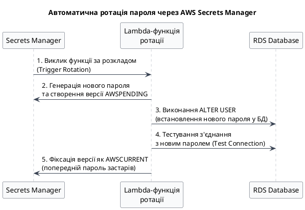

::

> [!IMPORTANT]
> **Обробка перехідного вікна застосунком:**
> Під час виконання кроків 3 та 4 у базі даних уже діє новий пароль, але застосунок, який кешує старий пароль, може спробувати встановити з'єднання та отримати помилку автентифікації. Для запобігання збоїв у роботі промислових систем застосовуються два підходи:
>
> 1. **Механізм повторних спроб (Retry Policy):** Застосунок повинен повторити спробу підключення з невеликою експоненціальною затримкою. Під час повторного запиту застосунок знову зчитає секрет із Secrets Manager (або оновлений кеш скинеться), який вже матиме статус `AWSCURRENT`.
> 2. **Стратегія Multi-User Rotation:** Створюються два ідентичні користувачі бази даних (наприклад, `app_user_a` та `app_user_b`). Ротація виконується по черзі: поки один користувач оновлюється, застосунок продовжує роботу через іншого вузла, повністю виключаючи момент несумісності пароля.

#### Покрокова реалізація інтеграції у .NET

### Крок 1: Створення секрету в AWS Secrets Manager

::tabs

::tabs-item{label="AWS Console"}

1. Відкрийте консоль **AWS Secrets Manager** → **Store a new secret**.
2. Оберіть тип секрету: **Credentials for Amazon RDS database**.
3. Введіть логін (`postgres` або створений користувач застосунку) та пароль.
4. У списку баз даних оберіть ваш інстанс RDS (`my-dotnet-app-db`).
5. Натисніть **Next**. Вкажіть назву секрету, наприклад: `production/myapp/database`.
6. На вкладці ротації (Rotation) за необхідності увімкніть автоматичну зміну та оберіть розклад.
7. Збережіть секрет.

::

::tabs-item{label="AWS CLI (bash)"}

```bash
# Створення секрету у форматі JSON
aws secretsmanager create-secret \
    --name "production/myapp/database" \
    --description "Реквізити підключення до RDS PostgreSQL" \
    --secret-string '{"username":"postgres","password":"YourSecurePassword123!","host":"my-dotnet-app-db.xxx.eu-central-1.rds.amazonaws.com","port":5432,"dbname":"myapp"}' \
    --region eu-central-1
```

::

::tabs-item{label="AWS CLI (PowerShell)"}

```powershell
# Створення секрету у форматі JSON
$secretVal = '{"username":"postgres","password":"YourSecurePassword123!","host":"my-dotnet-app-db.xxx.eu-central-1.rds.amazonaws.com","port":5432,"dbname":"myapp"}'
aws secretsmanager create-secret `
    --name "production/myapp/database" `
    --description "Реквізити підключення до RDS PostgreSQL" `
    --secret-string $secretVal `
    --region eu-central-1
```

::

::

### Крок 2: Надання прав доступу застосунку через IAM

Переконайтеся, що IAM-роль, асоційована з вашим інстансом EC2, має право на зчитування створеного секрету. Додайте наступне правило до політики ролі:

```json
{
    "Version": "2012-10-17",
    "Statement": [
        {
            "Effect": "Allow",
            "Action": ["secretsmanager:GetSecretValue"],
            "Resource": ["arn:aws:secretsmanager:eu-central-1:123456789012:secret:production/myapp/database-XXXXXX"]
        }
    ]
}
```

### Крок 3: Написання .NET-коду для інтеграції

Для взаємодії з Secrets Manager встановимо відповідний NuGet-пакет AWS SDK:

```bash
dotnet add package AWSSDK.SecretsManager
```

Для інтеграції секрету з конфігурацією .NET створимо допоміжний клас, який зчитує секрет при старті застосунку та трансформує його у стандартну connection string.

Створимо сервіс конфігурації у файлі `Services/SecretsManagerConfiguration.cs`:

```csharp
using System.Text.Json;
using Amazon;
using Amazon.SecretsManager;
using Amazon.SecretsManager.Model;

namespace MyDotnetApp.Services;

public class DbCredentialSecret
{
    public string Username { get; set; } = string.Empty;
    public string Password { get; set; } = string.Empty;
    public string Host { get; set; } = string.Empty;
    public int Port { get; set; } = 5432;
    public string Dbname { get; set; } = string.Empty;

    public string ToConnectionString() =>
        $"Host={Host};Port={Port};Database={Dbname};Username={Username};Password={Password};SSL Mode=Require;";
}

public static class SecretsManagerService
{
    public static async Task<string> GetConnectionStringAsync(string secretName, string region)
    {
        using var client = new AmazonSecretsManagerClient(RegionEndpoint.GetBySystemName(region));

        var request = new GetSecretValueRequest
        {
            SecretId = secretName,
            VersionStage = "AWSCURRENT" // Запит завжди поточної активної версії секрету
        };

        try
        {
            var response = await client.GetSecretValueAsync(request);
            if (response.SecretString != null)
            {
                var credentials = JsonSerializer.Deserialize<DbCredentialSecret>(
                    response.SecretString,
                    new JsonSerializerOptions { PropertyNamingPolicy = JsonNamingPolicy.CamelCase }
                );

                if (credentials != null)
                {
                    return credentials.ToConnectionString();
                }
            }
            throw new InvalidOperationException("Вміст секрету порожній або має некоректний формат.");
        }
        catch (Exception ex)
        {
            throw new Exception($"Не вдалося отримати секрет з Secrets Manager: {ex.Message}", ex);
        }
    }
}
```

Тепер налаштуємо `Program.cs` для зчитування конфігурації перед ініціалізацією EF Core:

```csharp
using MyDotnetApp.Services;

var builder = WebApplication.CreateBuilder(args);

// Зчитуємо назву секрету та регіон з конфігурації (наприклад, з appsettings.json чи змінних середоваща)
var secretName = builder.Configuration["AwsSettings:SecretName"] ?? "production/myapp/database";
var awsRegion = builder.Configuration["AwsSettings:Region"] ?? "eu-central-1";

// Запит з'єднання з Secrets Manager
string connectionString = await SecretsManagerService.GetConnectionStringAsync(secretName, awsRegion);

builder.Services.AddDbContext<AppDbContext>(options =>
    options.UseNpgsql(connectionString, npgsqlOptions =>
        npgsqlOptions.EnableRetryOnFailure(
            maxRetryCount: 5,
            maxRetryDelay: TimeSpan.FromSeconds(3),
            errorCodesToAdd: null
        )
    )
);

builder.Services.AddControllers();
var app = builder.Build();
app.MapControllers();
app.Run();
```

### Сценарій 3: Масштабування пулу з'єднань через Amazon RDS Proxy (Еволюція продуктивності)

**Еволюційний перехід:** Коли безпека доступу (на базі IAM-автентифікації або Secrets Manager) вже налаштована, на наступному етапі масштабування системи виникає нова проблема — вичерпання ліміту підключень до бази даних при горизонтальному розширенні застосунків (особливо в безсерверних архітектурах). Третім кроком еволюційного розвитку нашої інфраструктури є інтеграція проміжного шару — **Amazon RDS Proxy** — для стабілізації роботи пулу з'єднань під високим навантаженням.

#### Проблема вичерпання пулу з'єднань та архітектурне призначення RDS Proxy

Кожне нове мережеве з'єднання до PostgreSQL супроводжується запуском окремого процесу операційної системи на сервері БД (процес-воркер), що споживає від 5 до 10 MB оперативної пам'яті. При значній кількості короткочасних клієнтських запитів база даних витрачає процесорний час та RAM не на виконання корисних SQL-інструкцій, а на процедури встановлення TCP-сесій та виконання рукостискань (SSL/TLS handshakes).

**Amazon RDS Proxy** — це повністю керований хмарний проксі-сервер із високою доступністю, який розміщується між застосунком та СУБД. Він розв'язує проблему вичерпання з'єднань за допомогою трьох механізмів:

1. **Мультиплексування з'єднань (Connection Multiplexing):** RDS Proxy утримує невеликий пул постійно відкритих з'єднань до бази даних (database connection pool) і динамічно розподіляє їх між тисячами короткочасних з'єднань від клієнтських застосунків.
2. **Черга з'єднань (Connection Queuing):** Якщо база даних тимчасово перевантажена, RDS Proxy не повертає клієнту помилку відмови, а ставить нові запити у чергу до моменту звільнення з'єднання з пулу.
3. **Оптимізація аварійного перемикання (Fast Failover):** При переході Multi-AZ на standby інстанс RDS Proxy автоматично утримує активні TCP-сесії клієнтів і швидко перенаправляє внутрішні запити на новий первинний інстанс. Це скорочує видимий застосунком час даунтайму з 60–120 секунд до менш ніж 5–10 секунд.

##### Архітектурна схема потоків трафіку через RDS Proxy:

::plant-uml

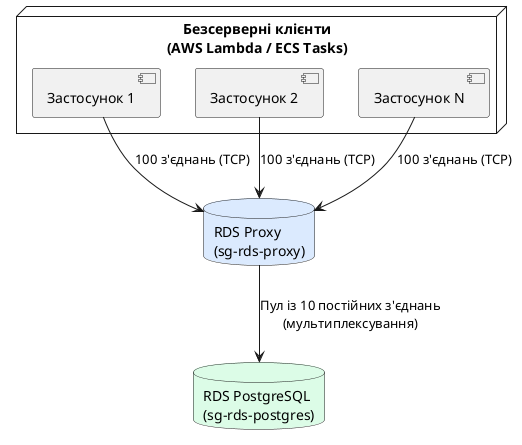

::

#### Практичний експеримент: Навантажувальне тестування за допомогою k6

Для практичної демонстрації ефективності використання RDS Proxy порівняємо результати тестування під навантаженням при прямому підключенні застосунку до бази даних та через проксі-сервер.

### Крок 1: Створення RDS Proxy через AWS CLI

Для створення проксі-сервера необхідно спочатку зберегти облікові дані доступу адміністратора бази в AWS Secrets Manager (оскільки RDS Proxy повинен самостійно автентифікуватися у базі даних для керування пулом).

::tabs

::tabs-item{label="AWS CLI (bash)"}

```bash
# 1. Створення IAM ролі для RDS Proxy
aws iam create-role \
    --role-name rds-proxy-role \
    --assume-role-policy-document '{"Version":"2012-10-17","Statement":[{"Effect":"Allow","Principal":{"Service":"rds.amazonaws.com"},"Action":"sts:AssumeRole"}]}' \
    --region eu-central-1

# 2. Додавання дозволу ролі на читання секрету з Secrets Manager
aws iam put-role-policy \
    --role-name rds-proxy-role \
    --policy-name rds-proxy-secrets-policy \
    --policy-document '{"Version":"2012-10-17","Statement":[{"Effect":"Allow","Action":"secretsmanager:GetSecretValue","Resource":"arn:aws:secretsmanager:eu-central-1:123456789012:secret:production/myapp/database-XXXXXX"}]}' \
    --region eu-central-1

# 3. Створення RDS Proxy
aws rds create-db-proxy \
    --db-proxy-name my-rds-proxy \
    --engine-family POSTGRESQL \
    --auth '[{"AuthScheme":"SECRETS","SecretArn":"arn:aws:secretsmanager:eu-central-1:123456789012:secret:production/myapp/database-XXXXXX","IAMAuth":"DISABLED"}]' \
    --role-arn arn:aws:iam::123456789012:role/rds-proxy-role \
    --vpc-subnet-ids subnet-11111111 subnet-22222222 \
    --vpc-security-group-ids sg-rds-proxy \
    --region eu-central-1

# 4. Реєстрація цільової бази даних у RDS Proxy
aws rds register-db-proxy-targets \
    --db-proxy-name my-rds-proxy \
    --target-group-name default \
    --db-instance-identifiers my-dotnet-app-db \
    --region eu-central-1
```

::

::tabs-item{label="AWS CLI (PowerShell)"}

```powershell
# 1. Створення IAM ролі для RDS Proxy
$trustPolicy = '{"Version":"2012-10-17","Statement":[{"Effect":"Allow","Principal":{"Service":"rds.amazonaws.com"},"Action":"sts:AssumeRole"}]}'
aws iam create-role `
    --role-name rds-proxy-role `
    --assume-role-policy-document $trustPolicy `
    --region eu-central-1

# 2. Додавання дозволу ролі на читання секрету
$secretsPolicy = '{"Version":"2012-10-17","Statement":[{"Effect":"Allow","Action":"secretsmanager:GetSecretValue","Resource":"arn:aws:secretsmanager:eu-central-1:123456789012:secret:production/myapp/database-XXXXXX"}]}'
aws iam put-role-policy `
    --role-name rds-proxy-role `
    --policy-name rds-proxy-secrets-policy `
    --policy-document $secretsPolicy `
    --region eu-central-1

# 3. Створення RDS Proxy
$authObj = '[{"AuthScheme":"SECRETS","SecretArn":"arn:aws:secretsmanager:eu-central-1:123456789012:secret:production/myapp/database-XXXXXX","IAMAuth":"DISABLED"}]'
aws rds create-db-proxy `
    --db-proxy-name my-rds-proxy `
    --engine-family POSTGRESQL `
    --auth $authObj `
    --role-arn arn:aws:iam::123456789012:role/rds-proxy-role `
    --vpc-subnet-ids subnet-11111111 subnet-22222222 `
    --vpc-security-group-ids sg-rds-proxy `
    --region eu-central-1

# 4. Реєстрація цільової бази даних
aws rds register-db-proxy-targets `
    --db-proxy-name my-rds-proxy `
    --target-group-name default `
    --db-instance-identifiers my-dotnet-app-db `
    --region eu-central-1
```

::

::

### Крок 2: Створення тестового сценарію навантаження у k6

Для тестування використаємо сучасний інструмент тестування навантаження **k6** (на базі Go та JavaScript). Напишемо скрипт, який імітує 200 одночасних віртуальних користувачів (Virtual Users, VUs), що безперервно виконують GET-запити до нашого .NET Web API протягом 30 секунд.

Створіть файл `load-test.js`:

```javascript
import http from 'k6/http'
import { sleep, check } from 'k6'

export const options = {
    vus: 200, // 200 одночасних імітованих користувачів
    duration: '30s', // Тривалість тесту
}

export default function () {
    // Виклик API ендпоінту, який робить запит до PostgreSQL
    const res = http.get('http://54.12.34.56:5000/api/products')

    check(res, {
        'status is 200': (r) => r.status === 200,
    })

    sleep(0.1) // Коротка пауза між запитами
}
```

### Крок 3: Аналіз результатів експерименту

Запустимо навантаження спочатку на застосунок, підключений безпосередньо до PostgreSQL (із встановленим лімітом `max_connections = 50` на стороні СУБД).

::terminal-preview{title="Запуск тесту: Пряме підключення до RDS" :cursor="false"}

<div class="line"><span class="opacity-40">$</span> <strong class="font-bold">k6 run load-test.js</strong></div>
<div class="line">execution: local</div>
<div class="line">     scenarios: (100.00%) 1 scenario, 200 VUs, 30s executor</div>
<div class="line"></div>
<div class="line">data_received..................: 1.4 MB  46 kB/s</div>
<div class="line">http_req_failed................: <span class="text-rose-400 font-bold">28.42%</span>   ✓ 1421 / 5000</div>
<div class="line">http_req_duration..............: avg=342ms min=12ms med=110ms max=2400ms</div>
<div class="line">checks.........................: <span class="text-rose-400 font-bold">71.58%</span>   ✓ 3579 / 5000</div>
<div class="line"><span class="text-rose-400 font-bold">ERRO[0025] Database connections limit exceeded. Npgsql.PostgresException: 53300: remaining connection slots are reserved for non-replication superuser connections</span></div>
::

У першому експерименті майже **28% запитів завершилися збійними помилками 500**, оскільки пул з'єднань драйвера .NET на багатьох паралельних потоках швидко перевищив доступний ліміт підключень до PostgreSQL.

Тепер переключимо рядок з'єднання застосунку на endpoint нашого **RDS Proxy** (який має такий самий формат, але інший DNS-хост) та повторимо аналогічний тест.

::terminal-preview{title="Запуск тесту: Підключення через RDS Proxy" :cursor="false"}

<div class="line"><span class="opacity-40">$</span> <strong class="font-bold">k6 run load-test.js</strong></div>
<div class="line">execution: local</div>
<div class="line">     scenarios: (100.00%) 1 scenario, 200 VUs, 30s executor</div>
<div class="line"></div>
<div class="line">data_received..................: 2.1 MB  70 kB/s</div>
<div class="line">http_req_failed................: <span class="text-green-400 font-bold">0.00%</span>   ✓ 0 / 6842</div>
<div class="line">http_req_duration..............: avg=64ms  min=10ms med=48ms  max=312ms</div>
<div class="line">checks.........................: <span class="text-green-400 font-bold">100.00%</span> ✓ 6842 / 6842</div>
<div class="line"><span class="text-green-400 font-bold">SUCCESS: All requests completed without any connection errors. Connection multiplexing active.</span></div>
::

**Аналіз результатів:** Завдяки використанню RDS Proxy відсоток збійних запитів скоротився до **0.00%**, при цьому середня тривалість запиту (Latency) зменшилася з 342ms до 64ms. Прокси-сервер утримував постійні мережеві сесії клієнтів та прозоро чергував їхні SQL-запити через невеликий фіксований пул підключень до PostgreSQL, виключаючи перевантаження рушія бази даних.

### Сценарій 4: Аудит та оптимізація повільних запитів через CloudWatch Insights (Еволюція спостережливості)

**Еволюційний перехід:** Після того як наша система стала безпечною та масштабованою за допомогою RDS Proxy, фінальним етапом архітектурної еволюції є перехід до безперервного аналізу та оптимізації роботи бази даних у реальному часі. Це досягається за допомогою збору та автоматичного аналізу логів повільних запитів через **CloudWatch Logs Insights** для виявлення та усунення вузьких місць продуктивності (наприклад, Full Table Scan).

#### Механізм фіксації повільних інструкцій у PostgreSQL

Двигун PostgreSQL фіксує виконання кожної SQL-команди, яка триває довше, ніж визначено параметром конфігурації `log_min_duration_statement` (значення вказується у мілісекундах).

- **Значення `-1` (за замовчуванням):** логування виконання запитів повністю вимкнено.
- **Значення `0`:** логуються абсолютно всі запити, виконані у базі даних (викликає велике навантаження на I/O та переповнення дисків логами, не рекомендується для production).
- **Значення `> 0` (наприклад, `1000`):** реєструються лише ті запити, час виконання яких перевищив 1 секунду.

Логи СУБД записуються у локальні файли на інстансі RDS, але за допомогою механізму інтеграції Amazon RDS автоматично здійснює безперервний експорт (streaming) цих записів у сервіс CloudWatch Logs, де вони стають доступними для довгострокового зберігання та індексованого пошуку.

#### Покрокова реалізація налаштування та аналізу

### Крок 1: Конфігурування Parameter Group та експорту логів

Створіть кастомну Parameter Group для вашої версії PostgreSQL та змініть значення конфігурації.

::tabs

::tabs-item{label="AWS CLI (bash)"}

```bash
# 1. Створення кастомної Parameter Group
aws rds create-db-parameter-group \
    --db-parameter-group-name custom-postgres16-group \
    --db-parameter-group-family postgres16 \
    --description "Кастомна група параметрів для оптимізації логування" \
    --region eu-central-1

# 2. Модифікація параметру тривалості запитів (log_min_duration_statement = 1000 мс)
# Параметр є динамічним, тому зміни застосуються в рантаймі без перезапуску бази.
aws rds modify-db-parameter-group \
    --db-parameter-group-name custom-postgres16-group \
    --parameters "ParameterName=log_min_duration_statement,ParameterValue=1000,ApplyMethod=immediate" \
    --region eu-central-1

# 3. Асоціація Parameter Group з інстансом бази даних та увімкнення експорту логів
aws rds modify-db-instance \
    --db-instance-identifier my-dotnet-app-db \
    --db-parameter-group-name custom-postgres16-group \
    --cloudwatch-logs-export-configuration '{"EnableLogTypes":["postgresql"]}' \
    --region eu-central-1
```

::

::tabs-item{label="AWS CLI (PowerShell)"}

```powershell
# 1. Створення кастомної Parameter Group
aws rds create-db-parameter-group `
    --db-parameter-group-name custom-postgres16-group `
    --db-parameter-group-family postgres16 `
    --description "Кастомна група параметрів для оптимізації логування" `
    --region eu-central-1

# 2. Модифікація параметру тривалості запитів (log_min_duration_statement = 1000 мс)
aws rds modify-db-parameter-group `
    --db-parameter-group-name custom-postgres16-group `
    --parameters "ParameterName=log_min_duration_statement,ParameterValue=1000,ApplyMethod=immediate" `
    --region eu-central-1

# 3. Асоціація Parameter Group та увімкнення експорту логів
aws rds modify-db-instance `
    --db-instance-identifier my-dotnet-app-db `
    --db-parameter-group-name custom-postgres16-group `
    --cloudwatch-logs-export-configuration '{"EnableLogTypes":["postgresql"]}' `
    --region eu-central-1
```

::

::

### Крок 2: Емуляція повільного запиту в застосунку на .NET

Створимо у нашому контролері .NET Web API метод, який навмисно ініціює повільне виконання запиту на великій таблиці. Зазвичай це відбувається при скануванні великої кількості рядків без використання індексів (Sequential Scan).

Додамо такий метод до `Controllers/ProductsController.cs`:

```csharp
[HttpGet("search-slow")]
public async Task<IActionResult> GetSlowProducts([FromQuery] string keyword)
{
    // Пошук за допомогою LIKE з двома wildcard (%keyword%) на неіндексованому стовпці Name.
    // Це змушує PostgreSQL виконувати Seq Scan (повне зчитування таблиці з диска).
    // Додатково імітуємо навантаження за допомогою сортування та великого обсягу даних.
    var products = await db.Products
        .Where(p => EF.Functions.Like(p.Name, $"%{keyword}%"))
        .OrderByDescending(p => p.Price)
        .ToListAsync();

    return Ok(products);
}
```

Викличемо цей ендпоінт, передавши запит, що змусить базу даних сканувати таблицю:

```bash
curl "http://54.12.34.56:5000/api/products/search-slow?keyword=special-device-2026"
```

### Крок 3: Аналіз та виявлення повільних запитів через CloudWatch Insights

Після того, як запит виконувався понад 1 секунду, у лог-групі CloudWatch `/aws/rds/instance/my-dotnet-app-db/postgresql` з'явиться відповідний запис.

Для виявлення та агрегації таких запитів скористаємося інструментом **CloudWatch Logs Insights**. Відкрийте консоль CloudWatch → **Logs Insights**, оберіть лог-групу вашої бази даних та виконайте такий аналітичний запит:

```graphql
# Фільтрація рядків логів, що містять інформацію про тривалість виконання запитів
filter @message like "duration:"
# Виділення значень тривалості виконання та самого тексту SQL-запиту за допомогою регулярного виразу
| parse @message "duration: * ms  statement: *" as duration, sql_statement
# Конвертація тривалості у числовий формат
| fields toDouble(duration) as duration_ms
# Фільтруємо лише запити, що тривали більше 1000 мс (додатковий фільтр)
| filter duration_ms > 1000
# Сортуємо результати за спаданням тривалості
| sort duration_ms desc
# Відображаємо час події, тривалість та саму інструкцію
| display @timestamp, duration_ms, sql_statement
| limit 20
```

::terminal-preview{title="CloudWatch Logs Insights Results" :cursor="false"}

<div class="line"># Query results (running on /aws/rds/instance/my-dotnet-app-db/postgresql)</div>
<div class="line">--------------------------------------------------------------------------------------</div>
<div class="line">| @timestamp             | duration_ms | sql_statement                                 |</div>
<div class="line">--------------------------------------------------------------------------------------</div>
<div class="line">| 2026-06-01 14:02:15.120| <span class="text-rose-400 font-bold">2451.20</span>     | SELECT p."Id", p."Name", p."Price" FROM "Products" AS p WHERE p."Name" LIKE '%special-device-2026%' ORDER BY p."Price" DESC |</div>
<div class="line">| 2026-06-01 14:02:18.450| <span class="text-rose-400 font-bold">1892.40</span>     | SELECT p."Id", p."Name", p."Price" FROM "Products" AS p WHERE p."Name" LIKE '%test-equipment%' ORDER BY p."Price" DESC |</div>
<div class="line">--------------------------------------------------------------------------------------</div>
<div class="line">Showing 2 of 2 entries. <span class="text-green-400 font-bold">Query execution completed successfully.</span></div>
::

**Результати аналізу:** Logs Insights дозволяє точно локалізувати проблемну SQL-інструкцію, згенеровану Entity Framework Core, її точний час запуску та тривалість виконання (2451.20 мс). На основі цього аналізу розробник може прийняти рішення про необхідність додавання індексу (наприклад, B-Tree або GIN індексу для повнотекстового пошуку) або оптимізації логіки запиту.

## Практичний приклад: Розгортання та оптимізація кластера Amazon Aurora PostgreSQL Serverless v2 у .NET

---

У цьому практичному прикладі розглянемо процес розгортання та конфігурування хмарно-орієнтованого кластера баз даних **Amazon Aurora PostgreSQL Serverless v2**, а також налаштування розподілу потоків читання/запису в застосунку на базі .NET.

### Архітектура кластера Aurora

На відміну від стандартного інстансу RDS, Aurora завжди створює логічний кластер (DB Cluster), який об'єднує процесорні ресурси (Compute) та розподілений диск (Storage). Клієнти не підключаються безпосередньо до конкретних серверів. Замість цього використовуються віртуальні endpoints на рівні кластера:

- **Writer Endpoint:** Точка входу для операцій запису. Вона динамічно вказує на поточний первинний (primary) інстанс. У разі аварії primary інстансу, Aurora автоматично призначає інший інстанс новим writer, і DNS-запис writer endpoint миттєво оновлюється.
- **Reader Endpoint:** Точка входу для операцій читання. Вона розподіляє вхідні SELECT-запити між усіма доступними репліками читання за принципом Round-Robin (балансування навантаження).

::plant-uml

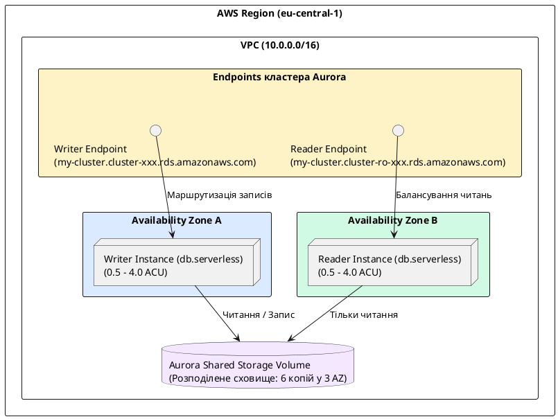

::

#### Покроковий деплой та конфігурування

### Крок 1: Створення та конфігурування DB Cluster (Writer + Reader)

Створимо кластер баз даних Aurora з двома безсерверними інстансами: первинним (Writer) та додатковим для масштабування читань (Reader). Діапазон масштабування встановимо від 0.5 до 4.0 ACU.

::tabs

::tabs-item{label="AWS Console"}

1. Перейдіть до сервісу **RDS** → **Databases** → **Create database**.
2. **Choose a database creation method:** Standard create.
3. **Engine options:** Amazon Aurora.
4. **Edition:** Amazon Aurora PostgreSQL-Compatible Edition (версія 16.x).
5. **Templates:** Dev/Test.
6. **Settings:**
    - DB cluster identifier: `aurora-dotnet-cluster`
    - Master username: `postgres`
    - Master password: задайте надійний пароль.
7. **Instance configuration:**
    - DB instance class: **Serverless** (Aurora Serverless v2).
    - Встановіть ліміти: Minimum ACUs: `0.5`, Maximum ACUs: `4.0`.
8. **Availability & durability:** Create an Aurora Replica or Reader node in a different AZ (для забезпечення відмовостійкості та тестування Reader endpoint).
9. **Connectivity:**
    - VPC: Default VPC.
    - DB Subnet Group: Оберіть створену раніше `my-dotnet-app-subnet-group`.
    - Public access: **No**.
    - VPC security group: Оберіть створену раніше `sg-rds-postgres`.
10. **Additional configuration:**
    - Initial database name: `auroradb`.
11. Натисніть **Create database** (створення кластера триває приблизно 8–12 хвилин).

::

::tabs-item{label="AWS CLI (bash)"}

```bash
# 1. Створення логічного кластера Aurora з лімітами Serverless v2
aws rds create-db-cluster \
    --db-cluster-identifier aurora-dotnet-cluster \
    --engine aurora-postgresql \
    --engine-version "16.1" \
    --master-username postgres \
    --master-user-password "YourSecurePassword123!" \
    --db-subnet-group-name my-dotnet-app-subnet-group \
    --vpc-security-group-ids $SG_RDS \
    --serverless-v2-scaling-configuration MinCapacity=0.5,MaxCapacity=4.0 \
    --database-name auroradb \
    --region eu-central-1

# Дочекайтеся статусу створення кластера
aws rds wait db-cluster-available \
    --db-cluster-identifier aurora-dotnet-cluster --region eu-central-1

# 2. Створення Writer інстансу всередині кластера
aws rds create-db-instance \
    --db-instance-identifier aurora-writer-instance \
    --db-cluster-identifier aurora-dotnet-cluster \
    --db-instance-class db.serverless \
    --engine aurora-postgresql \
    --region eu-central-1

# 3. Створення Reader інстансу всередині кластера
aws rds create-db-instance \
    --db-instance-identifier aurora-reader-instance \
    --db-cluster-identifier aurora-dotnet-cluster \
    --db-instance-class db.serverless \
    --engine aurora-postgresql \
    --region eu-central-1

# Дочекайтеся працездатності інстансів
aws rds wait db-instance-available \
    --db-instance-identifier aurora-writer-instance --region eu-central-1
aws rds wait db-instance-available \
    --db-instance-identifier aurora-reader-instance --region eu-central-1
```

::

::tabs-item{label="AWS CLI (PowerShell)"}

```powershell
# 1. Створення логічного кластера Aurora з лімітами Serverless v2
aws rds create-db-cluster `
    --db-cluster-identifier aurora-dotnet-cluster `
    --engine aurora-postgresql `
    --engine-version "16.1" `
    --master-username postgres `
    --master-user-password "YourSecurePassword123!" `
    --db-subnet-group-name my-dotnet-app-subnet-group `
    --vpc-security-group-ids $SG_RDS `
    --serverless-v2-scaling-configuration MinCapacity=0.5,MaxCapacity=4.0 `
    --database-name auroradb `
    --region eu-central-1

# Дочекайтеся статусу створення кластера
aws rds wait db-cluster-available `
    --db-cluster-identifier aurora-dotnet-cluster --region eu-central-1

# 2. Створення Writer інстансу
aws rds create-db-instance `
    --db-instance-identifier aurora-writer-instance `
    --db-cluster-identifier aurora-dotnet-cluster `
    --db-instance-class db.serverless `
    --engine aurora-postgresql `
    --region eu-central-1

# 3. Створення Reader інстансу
aws rds create-db-instance `
    --db-instance-identifier aurora-reader-instance `
    --db-cluster-identifier aurora-dotnet-cluster `
    --db-instance-class db.serverless `
    --engine aurora-postgresql `
    --region eu-central-1

# Дочекайтеся працездатності інстансів
aws rds wait db-instance-available `
    --db-instance-identifier aurora-writer-instance --region eu-central-1
aws rds wait db-instance-available `
    --db-instance-identifier aurora-reader-instance --region eu-central-1
```

::
::

### Крок 2: Конфігурування підключення та контекстів даних у .NET

Для інтеграції з Aurora нам необхідно налаштувати два рядки підключення: перший вказуватиме на Writer Endpoint (для модифікації даних), а другий — на Reader Endpoint (для вибірок).

Створимо структуру конфігурацій та контекстів у нашому .NET проєкті:

::code-tree

```json [appsettings.json]
{
    "ConnectionStrings": {
        "AuroraWriter": "Host=aurora-dotnet-cluster.cluster-xxx.eu-central-1.rds.amazonaws.com;Database=auroradb;Username=postgres;Password=YourSecurePassword123!;SSL Mode=Require;",
        "AuroraReader": "Host=aurora-dotnet-cluster.cluster-ro-xxx.eu-central-1.rds.amazonaws.com;Database=auroradb;Username=postgres;Password=YourSecurePassword123!;SSL Mode=Require;"
    }
}
```

```csharp [Data/AppDbContext.cs]
using Microsoft.EntityFrameworkCore;
using MyDotnetApp.Models;

namespace MyDotnetApp.Data;

// Контекст для виконання операцій запису (Writer)
public class AppDbContext(DbContextOptions<AppDbContext> options) : DbContext(options)
{
    public DbSet<Product> Products => Set<Product>();
}
```

```csharp [Data/ReadOnlyDbContext.cs]
using Microsoft.EntityFrameworkCore;
using MyDotnetApp.Models;

namespace MyDotnetApp.Data;

// Контекст для виконання операцій читання (Reader)
public class ReadOnlyDbContext(DbContextOptions<ReadOnlyDbContext> options) : DbContext(options)
{
    public DbSet<Product> Products => Set<Product>();
}
```

```csharp [Program.cs]
using MyDotnetApp.Data;
using Microsoft.EntityFrameworkCore;

var builder = WebApplication.CreateBuilder(args);

// Реєстрація первинного контексту (Writer) з політикою повторних спроб
builder.Services.AddDbContext<AppDbContext>(options =>
    options.UseNpgsql(builder.Configuration.GetConnectionString("AuroraWriter"), npgsqlOptions =>
        npgsqlOptions.EnableRetryOnFailure(
            maxRetryCount: 3,
            maxRetryDelay: TimeSpan.FromSeconds(5),
            errorCodesToAdd: null
        )
    )
);

// Реєстрація контексту для читання (Reader) з оптимізацією відстеження
builder.Services.AddDbContext<ReadOnlyDbContext>(options =>
    options.UseNpgsql(builder.Configuration.GetConnectionString("AuroraReader"), npgsqlOptions =>
        npgsqlOptions.EnableRetryOnFailure(
            maxRetryCount: 3,
            maxRetryDelay: TimeSpan.FromSeconds(5),
            errorCodesToAdd: null
        )
    ).UseQueryTrackingBehavior(QueryTrackingBehavior.NoTracking) // READ ONLY!
);

builder.Services.AddControllers();
var app = builder.Build();
app.MapControllers();
app.Run();
```

```csharp [Services/ProductService.cs]
using Microsoft.EntityFrameworkCore;
using MyDotnetApp.Data;
using MyDotnetApp.Models;

namespace MyDotnetApp.Services;

public class ProductService(AppDbContext db, ReadOnlyDbContext readDb)
{
    // Запити вибірки (SELECT) автоматично спрямовуються через Reader Endpoint
    public async Task<List<Product>> GetActiveProductsAsync() =>
        await readDb.Products.ToListAsync();

    // Операції запису та модифікації виконуються виключно через Writer Endpoint
    public async Task CreateProductAsync(Product product)
    {
        db.Products.Add(product);
        await db.SaveChangesAsync();
    }
}
```

::

### Крок 3: Моніторинг та перевірка динамічного автомасшабування ACU

Однією з ключових переваг Aurora Serverless v2 є здатність адаптувати обчислювальні ресурси під коливання навантаження. Проведемо експеримент та перевіримо, як змінюється ємність кластера.

1. **Ініціація навантаження:** Запустіть раніше створений стрес-тест за допомогою `k6`, збільшивши кількість віртуальних користувачів до 500 для генерації інтенсивного потоку запитів.
2. **Перевірка поточного обсягу ACU через SQL-запит:**
   Підключіться до вашого Writer інстансу за допомогою терміналу та виконайте запит до внутрішньої системної таблиці AWS Aurora для перевірки поточної виділеної пам'яті та обчислювальної ємності:

    ```sql
    -- Отримання метрики ємності безпосередньо з рушія бази даних
    SELECT * FROM aurora_volume_status();
    ```

    _(Примітка: Детальнішу статистику споживання ACU рекомендується дивитися в хмарному моніторингу, оскільки двигун PostgreSQL оперує внутрішніми буферами, а розподіл ресурсів виконується на рівні віртуалізації AWS)._

3. **Моніторинг через CloudWatch:**
   Перейдіть до сервісу **CloudWatch** → **Metrics** → **RDS** → **Source** і знайдіть метрику **`ServerlessDatabaseCapacity`**.

::terminal-preview{title="CloudWatch Metric: ServerlessDatabaseCapacity" :cursor="false"}

<div class="line">Metric: ServerlessDatabaseCapacity (aurora-dotnet-cluster)</div>
<div class="line">-------------------------------------------------------------------------</div>
<div class="line">Time (UTC)           | ACU Capacity | DB Connections | CPU Utilization  |</div>
<div class="line">-------------------------------------------------------------------------</div>
<div class="line">14:10:00 (Idle)      | <span class="text-blue-400">0.50 ACU</span>     | 12             | 2.1%             |</div>
<div class="line">14:11:00 (k6 Start)  | <span class="text-yellow-400">1.80 ACU</span>     | 154            | 48.6%            |</div>
<div class="line">14:12:00 (k6 Peak)   | <span class="text-rose-400 font-bold">3.50 ACU</span>     | 480            | 87.2%            |</div>
<div class="line">14:13:00 (k6 Stop)   | <span class="text-blue-400">0.50 ACU</span>     | 14             | 1.8%             |</div>
<div class="line">-------------------------------------------------------------------------</div>
<div class="line"><span class="text-green-400 font-bold">Observation: Dynamic scaling succeeded. Capacity scaled up to 3.5 ACU and returned to 0.5 ACU.</span></div>
::

**Аналіз результатів:** Під час спокою кластер споживає мінімально налаштовану ємність `0.5 ACU` (що еквівалентно приблизно 1 GB RAM). З початком тестування система динамічно збільшила обчислювальні ресурси до `3.5 ACU` для обробки 480 одночасних підключень без втрати продуктивності. Після завершення тесту ємність автоматично повернулася до базового значення `0.5 ACU`, мінімізуючи витрати на утримання хмарної інфраструктури.

## Резюме

- **RDS** — керований сервіс реляційних БД. AWS відповідає за бекапи, патчі, failover, моніторинг. Ви відповідаєте за схему, запити та архітектуру.
- **Instance Classes:** `db.t3.micro` (Free Tier), `db.m6g` (production), `db.r6g` (memory-intensive).
- **Multi-AZ:** синхронна реплікація у другу AZ. Автоматичний failover ~60–120 сек. Обов'язковий для production. Standby не приймає читання.
- **Read Replicas:** асинхронні копії для масштабування читання. До 5 replicas (Aurora — до 15). Eventual consistency. Потребує явної маршрутизації у .NET.
- **PITR (Point-in-Time Recovery):** відновлення на будь-яку секунду в межах retention period (до 35 днів). Результат — новий instance на новому endpoint.
- **Security:** RDS у private subnet, Security Group з source = SG EC2, шифрування AES-256 (KMS), SSL/TLS для з'єднань, IAM Authentication.
- **Parameter Groups:** налаштування СУБД без SSH. `max_connections`, `shared_buffers`, `log_min_duration_statement`.
- **Amazon Aurora:** хмарна СУБД AWS. Відокремлює compute від storage (6 копій у 3 AZ). Failover ~30 сек. Aurora Serverless v2 — auto-scaling від 0.5 ACU.
- **RDS Proxy:** пул з'єднань між застосунком і RDS. Критично для Lambda. Зменшує кількість з'єднань до бази у 10–20 разів. Прискорює failover до ~5 сек.
- **EF Core + RDS:** `Npgsql.EntityFrameworkCore.PostgreSQL`, `EnableRetryOnFailure()` для стійкості до failover. Міграції — окремий крок у CI/CD, не при старті застосунку.

---

## Практичні завдання

### Рівень 1 (Базовий)

**Завдання 1.** Поясніть різницю між Multi-AZ та Read Replica. Чому standby у Multi-AZ не приймає запити читання? Коли вам знадобиться Read Replica?

**Завдання 2.** Що таке Point-in-Time Recovery і коли воно рятує? Опишіть сценарій коли щоденного snapshot недостатньо, але PITR — достатньо.

### Рівень 2 (Практичний)

**Завдання 3.** Створіть RDS PostgreSQL `db.t3.micro` instance. Підключіть .NET Web API через EF Core. Виконайте Code-First міграцію. Перевірте роботу CRUD через HTTP-запити.

**Завдання 4.** Налаштуйте два connection strings у вашому .NET проєкті: один для primary (запис), другий для Read Replica (читання). Реалізуйте сервіс, що явно маршрутизує `SELECT` на репліку, а `INSERT/UPDATE/DELETE` — на primary. Переконайтесь що `ReadOnlyDbContext` використовує `NoTracking`.

### Рівень 3 (Архітектура)

**Завдання 5.** Спроектуйте RDS архітектуру для e-commerce платформи: Multi-AZ PostgreSQL (primary у `eu-central-1a`, standby у `eu-central-1b`), дві Read Replicas (одна для API читання, одна для аналітичних звітів), RDS Proxy для Lambda-функцій обробки замовлень, автоматичні бекапи на 30 днів. Намалюйте схему у PlantUML.

**Завдання 6.** Реалізуйте безпечне зберігання RDS credentials: збережіть connection string у AWS Secrets Manager, отримайте його у .NET через `AWSSDK.SecretsManager` та інтегруйте з `IConfiguration` так, щоб `GetConnectionString("Default")` повертало значення з Secrets Manager прозоро.
