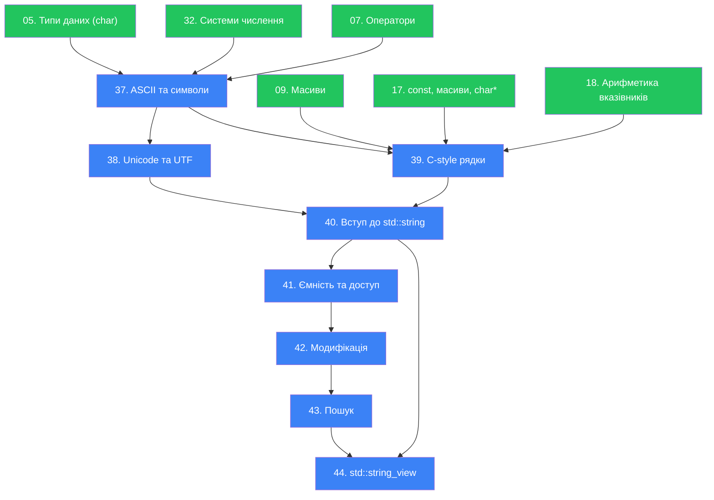

# План модуля «Рядки» для курсу C++

## Контекст

Необхідно побудувати академічно впорядкований план модуля «Рядки» на основі:
- **Існуючих статей курсу** (01–36): від основ до структур включно.
- **Довідкових матеріалів** з `temp/cpp/strings/`: std::string (ввід/вивід, створення, довжина, ємність, доступ, присвоювання, додавання, вставка), std::string_view.
- **Додаткових тем**, які відсутні у довідкових матеріалах, але необхідні для повноти: ASCII, Unicode, кодування UTF, C-style рядки (`char[]`, `<cstring>`).

**Принцип побудови:** жодна тема не забігає «наперед» — кожне нове поняття спирається лише на вже введені.

**Попередній контекст студента:** На момент початку цього модуля студент вже знає:
- `char` як 1-байтовий тип (стаття 05)
- `const char*` та нуль-термінатор (стаття 17)
- Поведінку `cout` з `char*` (стаття 17)
- Арифметику вказівників (стаття 18)
- Динамічну пам'ять `new[]`/`delete[]` (стаття 19)

> [!IMPORTANT]
> Нумерація починається з **37**, оскільки статті 29–36 вже зайняті модулями enum, type aliases, number systems та struct.

---

## Запропонований порядок тем

> Позначення: `[🆕 НОВА]` — стаття, якої ще немає.

---

### 37. Символи та ASCII `[🆕 НОВА]`
**Файл:** `37.ascii-characters.md`
**Орієнтовний обсяг:** ~800–1000 рядків
**Залежності:** `05.data-types-variables.md` (тип `char`), `07.operators-type-conversion.md` (static_cast), `32.number-systems.md` (двійкова/шістнадцяткова системи)

#### Навчальні цілі
- Поглибити розуміння типу `char` як **числа**, що представляє символ
- Ввести поняття **кодування** (encoding) — договір «число ↔ символ»
- Детально розкрити таблицю **ASCII**: структура, категорії символів, практичне значення
- Навчити маніпуляціям із символами через арифметику (`'a' + 3`, `ch - '0'`, `toupper`)
- Показати обмеження ASCII (лише 128 символів) — підготовка до наступної теми

#### Структура статті

1. **Hook**: Чому `'A' + 1` дорівнює `'B'`? Чому `'7' - '0'` дорівнює числу `7`? Магія чи логіка?
2. **Тип `char` — це число**
   - Повторення: `char` = 1 байт = 8 біт = 256 можливих значень
   - `char` — це `int` у мініатюрі; `signed char` vs `unsigned char`
   - Демонстрація: `char ch = 65;` → виводить `'A'`
   - `::memory-view` для відображення байту `char` в пам'яті
3. **Що таке кодування (Character Encoding)**
   - Аналогія: азбука Морзе, шифр Цезаря — різні способи зіставити символи з числами
   - Визначення: **кодування** — це таблиця відповідності між числами та символами
   - Чому потрібен стандарт: різні комп'ютери мали різні таблиці → хаос
4. **Таблиця ASCII (American Standard Code for Information Interchange)**
   - Історія: 1963 рік, телетайпи, 7-біт (128 символів)
   - Структура таблиці:
     - `0–31`: керуючі символи (control characters) — `\n`, `\t`, `\0`, `\r`, `\a`
     - `32–47`: пробіл та пунктуація
     - `48–57`: цифри `'0'`–`'9'`
     - `65–90`: великі літери `'A'`–`'Z'`
     - `97–122`: малі літери `'a'`–`'z'`
   - Візуалізація: повна ASCII-таблиця (Mermaid або HTML-таблиця)
   - `::debugger-view` для показу символу та його коду
5. **Арифметика символів**
   - Конвертація символу-цифри в число: `ch - '0'`
   - Зміщення в алфавіті: `'A' + offset`
   - Різниця між великими та малими літерами: `'a' - 'A'` = 32
   - Перевірка діапазону: `ch >= 'A' && ch <= 'Z'`
   - Функції `<cctype>`: `isalpha()`, `isdigit()`, `isspace()`, `toupper()`, `tolower()`
6. **Extended ASCII та його проблеми**
   - 8-й біт: розширення до 256 символів
   - Кодові сторінки (code pages): CP437 (DOS), CP1251 (Windows-кирилиця), ISO 8859-1 (Latin)
   - Проблема: один і той самий байт `0xC0` означає різні символи в різних кодуваннях
   - «Кракозябри» (mojibake) — наслідок неправильного кодування
   - Висновок: потрібен **єдиний глобальний стандарт** → тизер Unicode
7. **Практика та резюме**
   - Рівень 1: Вивести ASCII-код символу, введеного з клавіатури; визначити, чи є він літерою, цифрою чи пунктуацією
   - Рівень 2: Реалізувати шифр Цезаря (зсув кожної літери на N позицій у алфавіті)
   - Рівень 3: Написати функцію `charInfo(char ch)`, що повертає детальну інформацію про символ (категорія, ASCII-код у dec/hex/bin, відповідна мала/велика літера)

---

### 38. Unicode та кодування UTF `[🆕 НОВА]`
**Файл:** `38.unicode-utf.md`
**Орієнтовний обсяг:** ~800–1000 рядків
**Залежності:** `37.ascii-characters.md` (ASCII, поняття кодування, проблема code pages), `32.number-systems.md` (шістнадцяткова система)

#### Навчальні цілі
- Пояснити, **чому** з'явився Unicode: проблема множинних кодувань
- Ввести поняття Unicode як **каталогу символів** (не кодування!)
- Пояснити різницю між **код-поінтом** (code point) та **кодуванням** (encoding)
- Детально розкрити **UTF-8**, **UTF-16**, **UTF-32**: принцип роботи, змінна довжина, BOM
- Показати, чому `char` у C++ = лише 1 байт і не може зберігати довільний Unicode-символ
- Познайомити з `wchar_t`, `char8_t`, `char16_t`, `char32_t`

#### Структура статті

1. **Hook**: Чому емодзі 🎉 займає 4 байти, а літера `A` — лише 1? Чому `std::string s = "Привіт"` має `.length()` = 12, хоча символів 6? Чому `"café".length()` може бути 5 або 6?
2. **Проблема, яку вирішує Unicode**
   - Повторення: кодові сторінки → хаос → неможливість змішувати мови
   - Приклад: лист із китайськими, арабськими та латинськими символами — жодна кодова сторінка не впорається
   - Історія: 1991, Unicode Consortium, мета — один каталог для ВСІХ символів
3. **Unicode — це каталог, а не кодування**
   - Ключова ідея: Unicode присвоює кожному символу **номер** (code point), записаний як `U+XXXX`
   - Приклади: `U+0041` = `A`, `U+0410` = `А` (кирилиця), `U+1F389` = 🎉
   - Unicode **НЕ** визначає, як зберігати ці номери в пам'яті → для цього є **кодування**
   - Площини (planes): BMP (Basic Multilingual Plane, `U+0000`–`U+FFFF`), SMP тощо
   - Поточний стан: ~150 000 символів, 161 скрипт (писемність)
4. **UTF-32: один символ = 4 байти (фіксована довжина)**
   - Найпростіший підхід: код-поінт → 32-бітне число
   - Переваги: O(1) доступ за індексом, простота
   - Недоліки: витрати пам'яті (англійський текст у 4× більший)
   - Коли використовується: внутрішня обробка тексту
5. **UTF-16: змінна довжина (2 або 4 байти)**
   - BMP символи → 2 байти (одна code unit)
   - Символи поза BMP → 4 байти (сурогатна пара / surrogate pair)
   - Діапазон сурогатів: `U+D800`–`U+DFFF`
   - Byte Order Mark (BOM): `U+FEFF`, Little-Endian vs Big-Endian
   - Де використовується: Windows API, Java, JavaScript, Qt
6. **UTF-8: змінна довжина (1–4 байти)** ⭐
   - Найпоширеніше кодування у світі (98%+ вебу)
   - Принцип кодування (побітово):
     - `U+0000`–`U+007F`: 1 байт (`0xxxxxxx`) — сумісність з ASCII!
     - `U+0080`–`U+07FF`: 2 байти (`110xxxxx 10xxxxxx`)
     - `U+0800`–`U+FFFF`: 3 байти (`1110xxxx 10xxxxxx 10xxxxxx`)
     - `U+10000`–`U+10FFFF`: 4 байти (`11110xxx 10xxxxxx 10xxxxxx 10xxxxxx`)
   - Таблиця з прикладами: `'A'` (1 байт), `'é'` (2 байти), `'Я'` (2 байти), `'€'` (3 байти), `'🎉'` (4 байти)
   - `::memory-view` для побайтового відображення UTF-8 рядка `"Привіт"` / `"café🎉"`
   - Наслідок для C++: `strlen("Привіт")` = 12, хоча «символів» 6
7. **Символьні типи в C++**
   - `char` (1 байт) — код-одиниця UTF-8 (але НЕ символ!)
   - `wchar_t` — платформозалежний (Windows = 2 байти/UTF-16, Linux = 4 байти/UTF-32)
   - `char8_t` (C++20) — явний тип для UTF-8 код-одиниць
   - `char16_t` (C++11) — для UTF-16
   - `char32_t` (C++11) — для UTF-32 (= один повний code point)
   - Рядкові літерали з префіксами: `u8"..."`, `u"..."`, `U"..."`, `L"..."`
8. **Порівняльна таблиця кодувань**

   | Властивість | ASCII | UTF-8 | UTF-16 | UTF-32 |
   |---|---|---|---|---|
   | Байтів на символ | 1 | 1–4 | 2–4 | 4 |
   | Сумісність з ASCII | ✅ | ✅ | ❌ | ❌ |
   | Фіксована довжина | ✅ | ❌ | ❌ | ✅ |
   | Економія для латиниці | ✅ | ✅ | ❌ | ❌ |
   | Використання | Спадщина | Веб, Linux, macOS | Windows API, Java | Внутрішня обробка |

9. **Практика та резюме**
   - Рівень 1: Визначити, скільки **байтів** займає рядок `"Привіт, світ!"` та `"Hello, world!"` через `strlen` та `sizeof`
   - Рівень 2: Побайтово вивести UTF-8 представлення рядка (кожен байт у hex), порівняти з ASCII
   - Рівень 3: Написати функцію `countUtf8Chars(const char* str)`, що підраховує кількість **символів** (code points) у UTF-8 рядку, аналізуючи старші біти кожного байта

---

### 39. C-style рядки `[🆕 НОВА]`
**Файл:** `39.c-strings.md`
**Орієнтовний обсяг:** ~1000–1200 рядків
**Залежності:** `37.ascii-characters.md` (char, ASCII), `09.arrays.md` (масиви), `17.pointers-const-arrays.md` (const char*, нуль-термінатор, array decay), `18.pointer-arithmetic.md`

#### Навчальні цілі
- Формалізувати поняття **C-style рядка**: масив `char` із нуль-термінатором `'\0'`
- Показати оголошення, ініціалізацію та модифікацію C-style рядків
- Пояснити принципову відмінність `char[]` (масив) від `const char*` (вказівник на літерал)
- Навчити роботі з бібліотекою `<cstring>`: `strlen`, `strcpy`, `strcat`, `strcmp`
- Показати **небезпеки** C-style рядків: buffer overflow, відсутність перевірки меж
- Підготувати мотивацію для переходу на `std::string`

#### Структура статті

1. **Hook**: Ви вже бачили рядки в лапках: `"Hello, World!"`. Але що це насправді? Це не магічний тип — це просто масив символів з особливим «стоп-сигналом» в кінці.
2. **C-style рядок = `char[]` + `'\0'`**
   - Визначення: C-style рядок — масив типу `char`, останній елемент якого `'\0'` (нуль-термінатор)
   - `::memory-view`: рядок `"Cat"` → `['C', 'a', 't', '\0']` = 4 байти, хоча символів 3
   - Навіщо `'\0'`: вказує функціям, де закінчується рядок (бо масиви не знають своєї довжини)
3. **Оголошення та ініціалізація**
   - `char name[] = "John";` — компілятор додає `'\0'` автоматично, масив = 5 байтів
   - `char name[10] = "John";` — решта заповнюється нулями
   - `char name[] = {'J', 'o', 'h', 'n', '\0'};` — явна ініціалізація
   - ⚠️ `char name[] = {'J', 'o', 'h', 'n'};` — НЕ рядок (немає `'\0'`)!
   - `const char* name = "John";` — вказівник на рядковий літерал (Read-Only, повторення зі ст. 17)
4. **`char[]` vs `const char*` — принципова різниця**
   - `char[]` — локальна копія на стеку, можна змінювати
   - `const char*` — вказівник на літерал у Read-Only сегменті, змінювати — UB
   - Демонстрація: `arr[0] = 'X'` ✅ vs `ptr[0] = 'X'` ❌ (UB/crash)
   - `::debugger-view` для відображення обох варіантів
5. **Ввід/вивід C-style рядків**
   - `std::cout << name` — виводить символи до `'\0'`
   - `std::cin >> name` — зупиняється на пробілі, ризик buffer overflow!
   - `std::cin.getline(name, size)` — безпечніший варіант із лімітом
6. **Бібліотека `<cstring>`: основні функції**
   - `strlen(s)` — довжина (без `'\0'`)
   - `strcpy(dest, src)` — копіювання (⚠️ жодної перевірки розміру!)
   - `strncpy(dest, src, n)` — безпечніша версія з лімітом
   - `strcat(dest, src)` — конкатенація (⚠️ buffer overflow!)
   - `strncat(dest, src, n)` — безпечніша версія
   - `strcmp(a, b)` — порівняння: повертає `<0`, `0`, `>0` (лексикографічне)
   - `strncmp(a, b, n)` — порівняння перших `n` символів
   - `strchr(s, ch)` — пошук першого входження символу
   - `strstr(s, sub)` — пошук підрядка
   - Для кожної функції: сигнатура, пояснення, приклад, типова помилка
7. **Небезпеки C-style рядків** ⚠️
   - **Buffer overflow**: `strcpy` в занадто малий буфер
   - **Відсутній `'\0'`**: `cout` читає «сміття» за межами масиву
   - **Порівняння через `==`**: порівнює адреси, не вміст! (потрібен `strcmp`)
   - **Присвоєння через `=`**: копіює вказівник, не вміст! (потрібен `strcpy`)
   - **Ручне управління пам'яттю**: `new char[n]` + `delete[]` — легко забути
   - `::caution` блок: підсумок усіх пасток
8. **Практика та резюме**
   - Рівень 1: Ввести ім'я з клавіатури (через `cin.getline`) і вивести його довжину та кожен символ з його ASCII-кодом
   - Рівень 2: Реалізувати свою версію `my_strlen`, `my_strcpy`, `my_strcmp` без використання `<cstring>`
   - Рівень 3: Написати функцію `reverseWords(char* str)`, що розвертає порядок слів у рядку на місці (in-place)
   - Рівень 3: Написати функцію `trimSpaces(char* str)`, що видаляє зайві пробіли (на початку, в кінці, та подвійні пробіли)

---

### 40. Вступ до `std::string` `[🆕 НОВА]`
**Файл:** `40.std-string-intro.md`
**Орієнтовний обсяг:** ~1000–1200 рядків
**Залежності:** `39.c-strings.md` (C-style рядки, їх проблеми), `38.unicode-utf.md` (розуміння UTF-8)

**Довідковий матеріал:**
- `temp/cpp/strings/stdstring-в-Сplusplus-Уроки-по-Сplusplus.md`
- `temp/cpp/strings/Рядкові-класи-stdstring-і.md`
- `temp/cpp/strings/Створення,-знищення-і-конвертація.md`

#### Навчальні цілі
- Мотивувати перехід від C-style рядків до `std::string`
- Показати клас `std::string` як безпечну, зручну обгортку над масивом `char`
- Навчити створенню, ініціалізації та конвертації `std::string`
- Познайомити з ієрархією: `basic_string<char>` → `string`, `basic_string<wchar_t>` → `wstring`
- Показати ввід/вивід рядків: `cout`, `cin`, `std::getline()` та типову пастку з `cin >> ... + getline()`

#### Структура статті

1. **Hook**: Пригадайте, скільки потенційних помилок ми побачили з C-style рядками: buffer overflow, забутий `'\0'`, порівняння адрес замість тексту... А якби рядок сам керував своєю пам'яттю?
2. **Навіщо потрібен `std::string`?**
   - Порівняння: 10 рядків «небезпечного» коду з `char[]` / `strcpy` / `strcmp` vs 3 рядки з `std::string` / `=` / `==`
   - Автоматичне управління пам'яттю (конструктор/деструктор)
   - Інтуїтивні оператори: `=`, `==`, `+`, `<`, `>`
   - Динамічне зростання: рядок сам збільшується за потреби
3. **Клас `std::string`: заголовок та ієрархія**
   - `#include <string>`
   - Шаблон `basic_string<charT>` → `typedef basic_string<char> string`, `typedef basic_string<wchar_t> wstring`
   - `std::string` працює з UTF-8 (посимвольно — з bytes/code units)
   - `std::wstring` — для UTF-16 (Windows) або UTF-32 (Linux)
4. **Створення та ініціалізація**
   - Конструктор за замовчуванням: `std::string s;` — порожній рядок
   - З C-style рядка: `std::string s("Hello");` або `std::string s = "Hello";`
   - Копіювальний конструктор: `std::string s2(s1);`
   - З частини рядка: `std::string s("Hello World", 5);` → `"Hello"`
   - Повторення символу: `std::string s(5, 'x');` → `"xxxxx"`
   - З ітераторів: `std::string s(begin, end);` (preview, без деталей)
   - Через `std::to_string()`: конвертація числа → рядок
   - Через `std::stoi()`, `std::stod()`: конвертація рядок → число
5. **Конвертація між `std::string` та C-style рядком**
   - `s.c_str()` — повертає `const char*` із нуль-термінатором
   - `s.data()` — аналогічно (з C++17 — і для non-const string)
   - Навіщо: виклик C-бібліотек, API ОС
   - ⚠️ Повернутий вказівник стає невалідним після модифікації `std::string`
6. **Ввід/вивід рядків**
   - `std::cout << s` — виведення
   - `std::cin >> s` — зчитує до пробілу (як з `char*`)
   - `std::getline(std::cin, s)` — зчитує цілий рядок (до `\n`)
   - ⚠️ Пастка: `cin >> x; getline(cin, s);` — залишок `\n` у буфері
   - Рішення: `std::cin.ignore(std::numeric_limits<std::streamsize>::max(), '\n');`
   - `::code-group` з прикладами правильного та неправильного коду
7. **Додавання (конкатенація) та довжина**
   - Оператор `+`: `std::string result = s1 + s2;`
   - Оператор `+=`: `s1 += " world";`
   - `s.length()` / `s.size()` — кількість `char` (= байтів, НЕ Unicode-символів!)
   - `s.empty()` — перевірка на порожність
   - ⚠️ Нагадування: для UTF-8 `"Привіт".length()` = 12, не 6
8. **Знищення та час життя**
   - Деструктор автоматично звільняє пам'ять (RAII)
   - Порівняння з `new char[] + delete[]`
9. **Практика та резюме**
   - Рівень 1: Написати програму, що запитує ім'я та прізвище через `getline`, об'єднує їх та виводить з довжиною
   - Рівень 2: Конвертувати число (вхід `int`) у `std::string`, потім назад; перевірити round-trip
   - Рівень 3: Написати функцію `std::string repeat(const std::string& s, int n)`, що повторює рядок `n` разів з роздільником

---

### 41. Довжина, ємність та доступ до символів `std::string` `[🆕 НОВА]`
**Файл:** `41.std-string-capacity-access.md`
**Орієнтовний обсяг:** ~800–1000 рядків
**Залежності:** `40.std-string-intro.md` (створення, базові операції)

**Довідковий матеріал:**
- `temp/cpp/strings/Довжина-і-ємність-stdstring-в-Сplusplus.md`
- `temp/cpp/strings/Доступ-до-символів-stdstring..md`

#### Навчальні цілі
- Пояснити різницю між **довжиною** (length/size) та **ємністю** (capacity)
- Розкрити модель пам'яті `std::string`: внутрішній буфер, перевиділення (reallocation), SSO
- Навчити доступу до символів: `[]`, `at()`, `front()`, `back()`
- Показати `reserve()`, `shrink_to_fit()` для оптимізації

#### Структура статті

1. **Hook**: Чому `std::string s = "Hi";` має `capacity()` = 22, хоча `length()` = 2? Куди подівся решта пам'яті?
2. **Довжина vs ємність**
   - `s.length()` / `s.size()` — скільки символів зараз зберігається
   - `s.capacity()` — скільки символів може зберігати **без перевиділення пам'яті**
   - `s.max_size()` — теоретичний максимум
   - `s.empty()` — чи порожній рядок
   - Аналогія: `length` = скільки води в склянці, `capacity` = розмір склянки
3. **Модель пам'яті `std::string`**
   - Внутрішній масив `char*` + `size` + `capacity`
   - `::mermaid` діаграма структури об'єкта
   - Зростання: коли `size == capacity`, відбувається reallocation (нова пам'ять, копіювання, звільнення старої)
   - Стратегія зростання: зазвичай ×2 (implementation-defined)
   - Демонстрація: цикл `push_back` + вивід `size()`/`capacity()` на кожній ітерації
4. **SSO (Small String Optimization)**
   - Короткі рядки (зазвичай ≤15–22 символи) зберігаються **всередині самого об'єкта** (на стеку)
   - Без виділення купи → швидше
   - Коли рядок перевищує поріг SSO → переїзд на купу
   - Це implementation-defined (GCC vs Clang vs MSVC)
5. **Управління ємністю**
   - `s.reserve(n)` — заздалегідь виділити пам'ять (уникнення множинних reallocation)
   - `s.shrink_to_fit()` — (C++11) зменшити `capacity` до `size` (не гарантовано)
   - Коли це корисно: завантаження великого файлу, побудова рядка в циклі
6. **Доступ до символів**
   - `s[i]` — без перевірки меж (UB при виході за межі)
   - `s.at(i)` — з перевіркою меж (кидає `std::out_of_range`)
   - `s.front()` / `s.back()` — перший / останній символ
   - Порівняльна таблиця: `[]` vs `at()`
   - Зміна символу: `s[0] = 'X';` — дозволено (на відміну від `const char*`)
   - Ітерація: `for (char ch : s)` та `for (char& ch : s)` (для зміни)
7. **Практика та резюме**
   - Рівень 1: Вивести довжину, ємність та кожен символ рядка з його індексом
   - Рівень 2: Написати програму, що демонструє зростання `capacity()` при послідовному `+=` по одному символу (вивести таблицю size/capacity)
   - Рівень 3: Написати функцію `capitalize(std::string& s)`, що робить першу літеру кожного слова великою, використовуючи посимвольний доступ

---

### 42. Модифікація `std::string` `[🆕 НОВА]`
**Файл:** `42.std-string-modification.md`
**Орієнтовний обсяг:** ~1000–1200 рядків
**Залежності:** `41.std-string-capacity-access.md` (ємність, доступ)

**Довідковий матеріал:**
- `temp/cpp/strings/Присвоювання-і-перестановка-значень.md`
- `temp/cpp/strings/Додавання-до-stdstring-в-Сplusplus.md`
- `temp/cpp/strings/Вставка-символів-і-рядків-в.md`

#### Навчальні цілі
- Навчити всім способам модифікації рядка: присвоювання, додавання, вставка, видалення, заміна
- Показати `resize()`, `clear()`, `swap()`
- Навчити порівнянню рядків: оператори `==`, `!=`, `<`, `>` та `compare()`
- Показати отримання підрядків (`substr`) та конкатенацію

#### Структура статті

1. **Hook**: Уявіть текстовий редактор: вставити символ у середину, видалити слово, замінити фрагмент... Усе це `std::string` вміє «з коробки».
2. **Присвоювання**
   - `s = "new value"` — оператор `=`
   - `s.assign("text")` — функція assign з різними перевантаженнями:
     - `assign(const string&)`, `assign(const char*)`, `assign(const string&, pos, count)`, `assign(count, char)`
   - `s1.swap(s2)` / `std::swap(s1, s2)` — обмін значеннями (O(1))
3. **Додавання (Append)**
   - `s += "text"` — найпоширеніший спосіб
   - `s.append("text")` — з різними перевантаженнями
   - `s.push_back('c')` — додати один символ
   - Різниця: `+=` vs `append` vs `push_back`
   - Ланцюжковий виклик: `s.append("a").append("b")` (повертає `string&`)
4. **Вставка (Insert)**
   - `s.insert(pos, "text")` — вставка підрядка за індексом
   - `s.insert(pos, count, char)` — вставка повтореного символу
   - `s.insert(pos, str, subpos, sublen)` — вставка частини іншого рядка
   - ⚠️ Індекси зсуваються після вставки → O(n)
5. **Видалення (Erase)**
   - `s.erase(pos, count)` — видалити `count` символів починаючи з `pos`
   - `s.erase(pos)` — видалити всі символи починаючи з `pos`
   - `s.erase()` / `s.clear()` — очистити весь рядок
   - `s.pop_back()` — видалити останній символ (C++11)
6. **Заміна (Replace)**
   - `s.replace(pos, count, "new_text")` — замінити фрагмент
   - Перевантаження: заміна на частину іншого рядка, на повторений символ
   - Патерн: знайти + замінити (з використанням `find` із наступної теми)
7. **Зміна розміру (Resize)**
   - `s.resize(n)` — якщо `n > size()`, доповнює `'\0'`; якщо `n < size()`, обрізає
   - `s.resize(n, 'x')` — доповнює символом `'x'`
8. **Порівняння рядків**
   - Оператори `==`, `!=`, `<`, `<=`, `>`, `>=` — лексикографічне порівняння
   - `s.compare(str)` — повертає `<0`, `0`, `>0` (аналог `strcmp`)
   - `s.compare(pos, count, str)` — порівняння підрядка
   - `s.starts_with(...)`, `s.ends_with(...)` — C++20
9. **Підрядки та конкатенація**
   - `s.substr(pos, count)` — витягнути підрядок (повертає копію!)
   - Оператор `+` — створює новий рядок (конкатенація)
   - ⚠️ Продуктивність: `+` у циклі → багато тимчасових копій → використовуйте `+=` або `append`
10. **Практика та резюме**
    - Рівень 1: Замінити всі пробіли в рядку на підкреслення `_` (посимвольно)
    - Рівень 2: Реалізувати функцію `replaceAll(string& s, const string& from, const string& to)` — замінити ВСІ входження підрядка
    - Рівень 3: Написати міні-текстовий процесор: ввести речення, реалізувати команди `insert <pos> <text>`, `delete <pos> <count>`, `replace <from> <to>`, `print`

---

### 43. Пошук у `std::string` `[🆕 НОВА]`
**Файл:** `43.std-string-search.md`
**Орієнтовний обсяг:** ~700–900 рядків
**Залежності:** `42.std-string-modification.md` (модифікація, substr)

#### Навчальні цілі
- Навчити всім методам пошуку в `std::string`
- Пояснити `std::string::npos` як «не знайдено»
- Показати практичні патерни: пошук усіх входжень, розбиття рядка (split), парсинг

#### Структура статті

1. **Hook**: Як знайти слово в тексті? Як перевірити, чи email містить `@`? Як розбити CSV-рядок на поля?
2. **`std::string::npos`**
   - Визначення: `static constexpr size_type npos = -1` (= `SIZE_MAX`)
   - Значення «не знайдено» — результат пошуку, коли збігу немає
   - Патерн перевірки: `if (pos != std::string::npos)`
3. **Метод `find`**
   - `s.find("text")` — індекс першого входження підрядка
   - `s.find("text", start_pos)` — пошук починаючи з позиції
   - `s.find('c')` — пошук символу
   - `s.rfind("text")` — пошук **останнього** входження (з кінця)
   - Приклад: знайти всі входження в циклі
4. **Методи `find_first_of` / `find_last_of`**
   - `s.find_first_of("aeiou")` — індекс першого символу, що належить набору
   - `s.find_last_of("aeiou")` — останній символ із набору
   - Корисно для: пошук першої голосної, першого розділювача, першої цифри
5. **Методи `find_first_not_of` / `find_last_not_of`**
   - `s.find_first_not_of(" \t")` — перший символ, що НЕ є пробілом/табом
   - Корисно для: trim (видалення пробілів з країв), валідація
6. **Практичні патерни**
   - **Знайти всі входження**: цикл з `find(sub, lastPos + sub.length())`
   - **Split (розбиття рядка)**: цикл з `find(delimiter)` + `substr()`
   - **Trim**: `find_first_not_of` + `find_last_not_of` + `substr`
   - **Contains** (до C++23): `s.find(sub) != std::string::npos`; `s.contains(sub)` (C++23)
   - **Парсинг простого формату**: розбір `"key=value"` → пара через `find('=')`
7. **`std::string::npos` vs ітератори**
   - Пошук через ітератори: `std::find(s.begin(), s.end(), 'c')`
   - Алгоритми `<algorithm>`: `std::count`, `std::find_if`, `std::search`
   - Коли що використовувати: методи string для підрядків, алгоритми для символів
8. **Практика та резюме**
   - Рівень 1: Перевірити, чи рядок містить лише цифри (використовуючи `find_first_not_of`)
   - Рівень 2: Реалізувати функцію `split(const string& s, char delimiter)`, що повертає `std::vector<std::string>` (вектор попередньо пояснити через тизер або використати масив)
   - Рівень 3: Написати парсер простого формату конфігурації: `key = value` (рядок за рядком), з видаленням пробілів навколо `=`

---

### 44. `std::string_view` `[🆕 НОВА]`
**Файл:** `44.std-string-view.md`
**Орієнтовний обсяг:** ~800–1000 рядків
**Залежності:** `43.std-string-search.md` (повний функціонал std::string), `40.std-string-intro.md` (конвертація з const char*)

**Довідковий матеріал:**
- `temp/cpp/strings/Клас-stdstring-view-в-Сplusplus-Уроки.md`

#### Навчальні цілі
- Пояснити проблему зайвих копій рядків при передачі в функції
- Ввести `std::string_view` (C++17) як **невласницький** (non-owning) погляд на рядок
- Показати переваги: нуль-копій, працює як з `std::string`, так і з `const char*`
- Чітко пояснити **обмеження та небезпеки**: dangling view, відсутність нуль-термінатора, час життя

#### Структура статті

1. **Hook**: Функція `bool startsWith(const std::string& s, const std::string& prefix)` — при виклику `startsWith("Hello, World!", "Hello")` створює ДВІ тимчасові копії `std::string`. А що, якщо можна просто «дивитися» на існуючий рядок без копіювання?
2. **Проблема: зайві копії**
   - Коли функція приймає `const std::string&` і ми передаємо `const char*` — неявна конвертація → тимчасовий `std::string` → виділення пам'яті (якщо рядок > SSO)
   - Проблема `substr()` — теж копія
   - Мотивація: «погляд» (view) на дані без володіння ними
3. **Що таке `std::string_view`**
   - `#include <string_view>` (C++17)
   - Внутрішня структура: пара `{const char* data, size_t length}` — дуже легкий об'єкт
   - **Не володіє** даними, лише «дивиться» на чужий масив символів
   - Аналогія: `string_view` — це вікно, крізь яке ви дивитеся на чужу картину. Ви можете змінити розмір вікна, але не можете змінити картину
4. **Створення `std::string_view`**
   - З `const char*`: `std::string_view sv = "Hello";`
   - З `std::string`: `std::string_view sv = myString;`
   - З `char*` + length: `std::string_view sv(ptr, len);`
   - Неявна конвертація: `std::string` → `std::string_view` ✅
   - Немає неявної конвертації: `std::string_view` → `std::string` ❌ (потрібен явний конструктор)
5. **Доступний функціонал (read-only)**
   - `sv.size()`, `sv.length()`, `sv.empty()`
   - `sv[i]`, `sv.at(i)`, `sv.front()`, `sv.back()`
   - `sv.find()`, `sv.rfind()`, `sv.find_first_of()` тощо
   - `sv.substr(pos, count)` — повертає `string_view`, не `string`!
   - `sv.starts_with()`, `sv.ends_with()` (C++20)
   - `sv.remove_prefix(n)`, `sv.remove_suffix(n)` — звужує «вікно»
6. **Що `string_view` НЕ може**
   - Модифікувати дані: немає `push_back`, `append`, `insert`, `erase`
   - Повертати `c_str()` — НЕ гарантує нуль-термінатор
   - Продовжити час життя даних — лише дивиться
7. **Небезпеки та правила** ⚠️
   - **Dangling view**: `string_view` на тимчасовий `std::string` → висячий вказівник
   - Приклад: `std::string_view sv = std::string("temp");` → UB після `;`
   - **Не зберігайте `string_view`** у полях структур / як `return` — якщо не впевнені в часі життя
   - **Правило:** `string_view` — для параметрів функцій та локальних змінних
   - `::warning` блок: топ-3 помилки зі `string_view`
8. **Коли що використовувати: порівняльна таблиця**

   | Сценарій | Тип параметра |
   |---|---|
   | Функція лише читає рядок | `std::string_view` ✅ |
   | Функція зберігає/модифікує рядок | `const std::string&` або `std::string` |
   | Повертає новий рядок | `std::string` |
   | Повертає «погляд» на існуючий рядок (обережно) | `std::string_view` |
   | Рядковий літерал | `std::string_view` ✅ |

9. **Практика та резюме**
   - Рівень 1: Переписати функцію `bool isPalindrome(...)`, що приймає `std::string_view` замість `const std::string&`
   - Рівень 2: Реалізувати функцію `trimView(std::string_view sv)`, що повертає `string_view` без пробілів на краях (використовуючи `remove_prefix` / `remove_suffix`)
   - Рівень 3: Написати простий парсер команд: `"command arg1 arg2"` → розбити на `string_view` без жодного копіювання

---

## Графік залежностей (Mermaid)

**Легенда:** 🟢 Існуюча стаття (залежність) — 🔵 Нова стаття модуля

---

## Зведена таблиця

| №  | Файл | Тема | Ключові поняття | Довідковий матеріал |
|----|------|------|-----------------|---------------------|
| 37 | `37.ascii-characters.md` | Символи та ASCII | `char` як число, таблиця ASCII, `<cctype>`, кодові сторінки | — |
| 38 | `38.unicode-utf.md` | Unicode та кодування UTF | Code point, UTF-8/16/32, BOM, `wchar_t`, `char8_t` | — |
| 39 | `39.c-strings.md` | C-style рядки | `char[]`, `'\0'`, `<cstring>`, buffer overflow | — |
| 40 | `40.std-string-intro.md` | Вступ до std::string | Створення, конвертація, ввід/вивід, `getline` | `stdstring-в-Сplusplus...`, `Рядкові-класи...`, `Створення,-знищення...` |
| 41 | `41.std-string-capacity-access.md` | Ємність та доступ | `size`/`capacity`, SSO, `[]`/`at()`, `reserve` | `Довжина-і-ємність...`, `Доступ-до-символів...` |
| 42 | `42.std-string-modification.md` | Модифікація | `assign`, `append`, `insert`, `erase`, `replace`, `compare`, `substr` | `Присвоювання...`, `Додавання...`, `Вставка...` |
| 43 | `43.std-string-search.md` | Пошук | `find`, `rfind`, `find_first_of`, `npos`, split, trim | — |
| 44 | `44.std-string-view.md` | std::string_view | Non-owning view, `remove_prefix/suffix`, dangling | `Клас-stdstring-view...` |

---

## Рішення для обговорення

> [!IMPORTANT]
> 1. **Тема 38 (Unicode/UTF):** Наскільки глибоко розкривати побітове кодування UTF-8? Повна побітова механіка з ручним кодуванням/декодуванням, чи достатньо концептуального рівня з таблицею?
> 2. **Тема 39 (C-style рядки):** Чи включати `sprintf` / `sscanf` або це занадто «С-стиль» для курсу C++?
> 3. **Тема 43 (Пошук):** `split` через `std::vector` — на цьому етапі студент ще не знає `std::vector`. Чи використовувати його з мінімальним поясненням як «тизер», чи обмежитися масивом фіксованого розміру?
> 4. **Нумерація:** Поточний plan (`curriculum-plan.md`) вказує, що статті 29–33 — це enum, typedef, struct, union. Однак **фактично** створені статті 29–36 (enum, enum-class, type-aliases, number-systems, struct×4). Отже, нумерація 37+ є правильною. Чи потрібно щось перенумеровувати?
> 5. **Обсяг модуля:** 8 статей — це досить великий модуль. Чи варто об'єднати якісь теми (наприклад, ємність+модифікація, або пошук+string_view)?

## Верифікація

Оскільки це план текстового контенту (не коду), верифікація полягає у:
1. **Ваш ревю** запропонованого порядку та змісту тем
2. Перевірка, що жодна тема не використовує поняття з наступних тем (залежності йдуть лише «вгору»)
3. Перевірка відповідності стилю та структури існуючим статтям курсу
