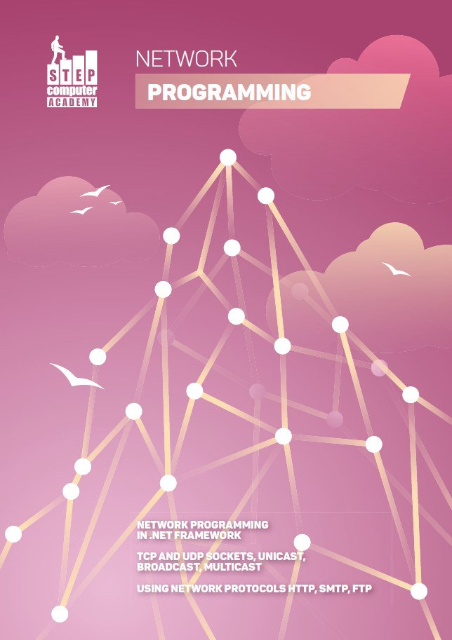
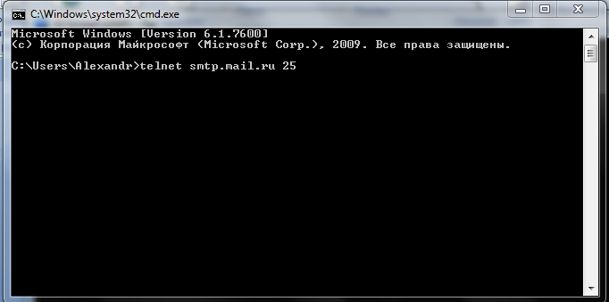
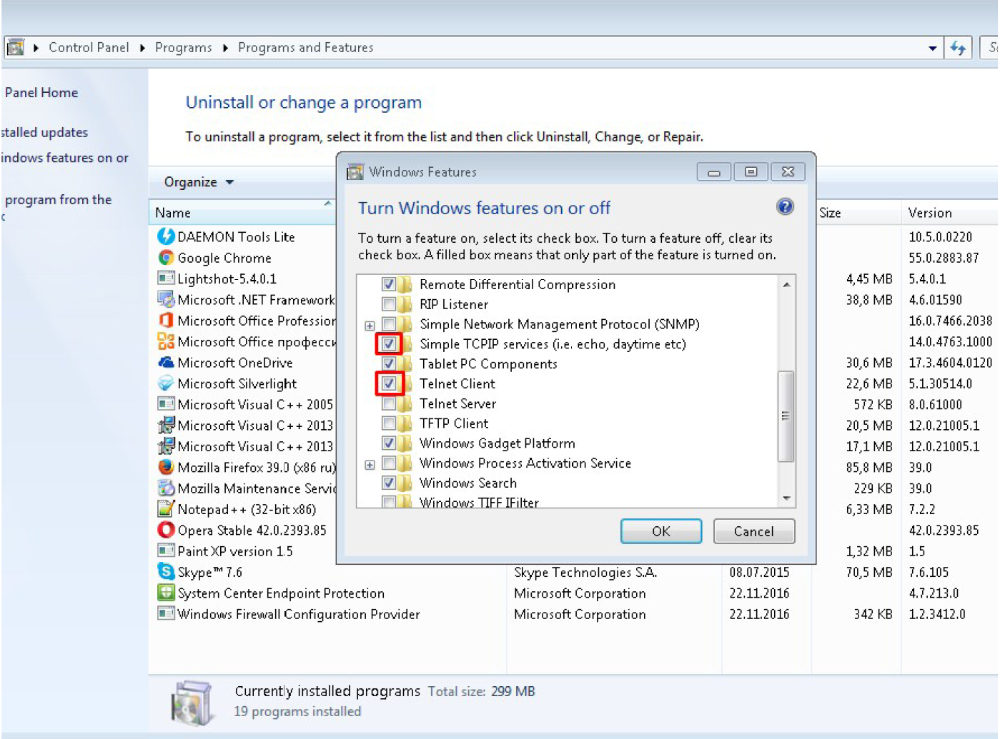
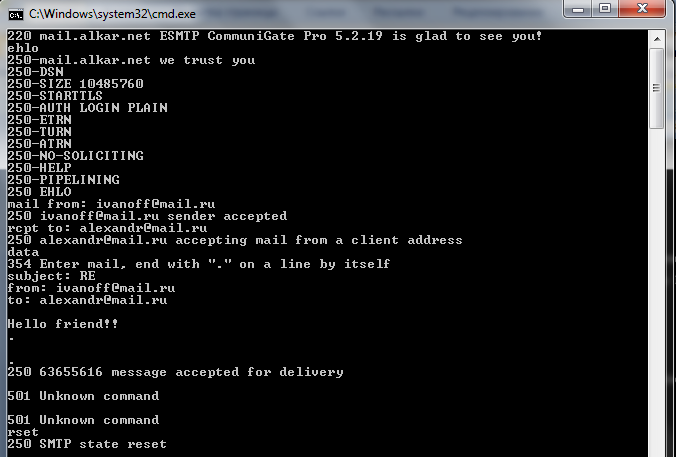
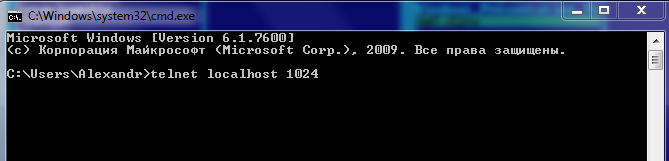
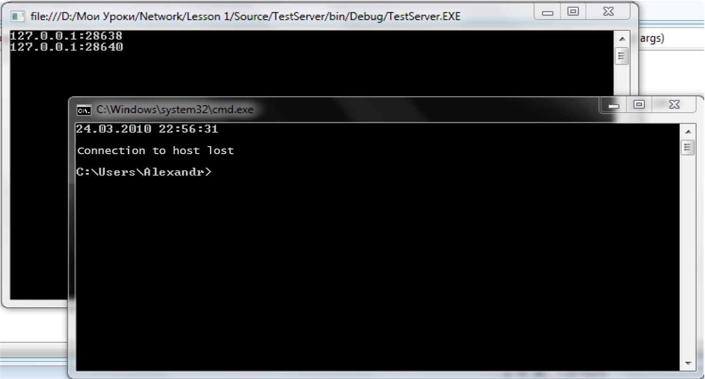

Network Programming

Lessons

Additional materials

[Source1.7z](https://fsx1.itstep.org/api/v1/files/cS_njEtGo0PLrc099IXgI1DgLBbfH9GL)



## Вступ до мережі, сокети

У цьому уроці ми з Вами розпочинаємо розгляд нового навчального курсу «Мережеве програмування». Як видно з назви курсу, технології, які ми тут вивчатимемо, мають пряме відношення до програмування застосунків, призначених для взаємодії між кількома комп'ютерами мережею.

Починаючи з шістдесятих років XX століття, у світі розпочалася робота зі створення мереж передачі даних. Перша публічна демонстрація можливості взаємодії кількох комп'ютерів з використанням телефонних мереж відбулася 29 жовтня 1969 року о 21:00. Мережа складалася з двох терміналів, один із яких перебував у Каліфорнійському університеті, а другий на відстані 600 км від нього — у Стенфордському університеті.

Розробка координувалась агентством передових оборонних дослідницьких проєктів США (DARPA). Водночас, однією з найбільш суттєвих особливостей створеної мережі була відмовостійкість, тобто навіть при руйнуванні частини мережі (наприклад, внаслідок ядерного удару по території країни), частина мережі, що залишилася, могла продовжувати роботу.

Так, власне, починаючи з 70-х років XX століття і почалося використання мереж передачі даних. Звичайно, виникла необхідність писати програмне забезпечення, призначене для забезпечення взаємодії програмних продуктів між собою.

Однак саме тоді мережа ще не могла легко взаємодіяти з іншими мережами, які побудовані на інших технічних стандартах. До кінця 1970-х років почали бурхливо розвиватися протоколи передачі даних, які були стандартизовані до середини 80-х.

До 90-х років XX століття мережа в основному використовувалася для пересилання електронної пошти, тоді й з'явилися перші списки поштової розсилки, групи новин та дошки оголошень.

З 1 січня 1983 року мережу ARPA стала використовувати для роботи протокол TCP/IP замість протоколу NCP. TCP/IP і досі успішно застосовується для об'єднання (або, як кажуть, «нашарування») мереж. Саме тоді (у 1983 році) за мережею ARPA закріпився термін «Internet».

За такого бурхливого розвитку мереж передачі даних з'явився новий клас застосунків, існування яких неможливе у відриві від мережі. Такі додатки отримали назву **клієнт-серверних** застосунків.

## 2\. Цілі та завдання мережевого програмування

При роботі в мережі один комп'ютер посідає роль сервера, а другий під'єднується до нього як клієнт, при цьому мається на увазі, що обидва комп'ютери мають використовувати той самий спосіб підключення (наприклад, тип кабелю, поширення сигналу, спосіб модуляції) і використовувати одну й ту ж «мову» для спілкування.

Щоб стандартизувати способи обміну між комп'ютерами, використовують спеціальні набори правил обміну даними, які називають **протоколами** **передачі даних**.

Водночас, завдання розбивається, щонайменше, на дві частини: одна частина логіки програми реалізується на сервері, а інша — на «клієнті». При цьому, найчастіше, в серверній частині не передбачається наявність інтерфейсу користувача. До того ж, клієнтська частина найчастіше є інтерфейсом користувача із засобами взаємодії мережею із сервером.

Клієнт-серверні застосунки дозволяють розподіляти обчислювальні завдання між кількома комп'ютерами в мережі, що дозволяє оптимізувати завдання, які виконуються на декількох «машинах».

Клієнт-серверні застосунки також дозволяють розбивати завдання на частини, задаючи розв'язання одного завдання кільком комп'ютерам у мережі. Така технологія отримала назву технології **розподілених обчислень**.

Отже, ми можемо визначити основну мету розробки мережевих застосунків — це створення ефективної та безпечної взаємодії різних комп'ютерів, що знаходяться як у локальних мережах (intranet), так і розкиданих по всьому світу (internet).

## 3\. Що таке мережа?

Давайте визначимося з термінами, які ми будемо використовувати в цьому уроці. Отже, перше, що ми повинні визначити це — що слід розуміти під словом «мережа».

**Мережа — це група комп'ютерів** **або** **пристроїв, з'єднаних між собою каналами зв'язку****.**

Усі ці пристрої (комп'ютери, маршрутизатори, шлюзи, принтери) називають вузлами мережі. Вузли між собою з'єднуються каналами, якими можуть використовуватись будь-які лінії зв'язку (кабельні, кабельні оптичні, оптичні атмосферні, радіо і т.д.). Цими каналами зв'язку вузли мережі можуть взаємодіяти між собою, передаючи один одному повідомлення.

## 4\. Типи мереж

За своїми розмірами мережі поділяються на **локальні**, що об'єднують вузли в межах однієї будівлі або в групі довколишніх будівель у межах району і **глобальні**, що об'єднують між собою кілька локальних мереж.

## 5\. Модель OSI

З метою формалізації протоколів обміну даними каналами зв'язку організацією ISO, було прийнято стандарт моделі протоколів, який отримав назву семирівневої моделі OSI (_Open System Interconnection_). У межах цієї моделі були виділені основні завдання взаємодії вузлів у мережі.

Кожен рівень моделі OSI має особливе призначення і кожен з них пов'язаний з рівнем, що знаходиться вище і нижче поточного (таблиця 1).

**Таблиця 1**

№

Назва

7

Прикладний (_Application_)

6

Представницький (_Presentation_)

5

Сеансовий (_Session_)

4

Транспортний (_Transport_)

3

Мережевий (_Network_)

2

Канальний (_Data Link_)

1

Фізичний (_Physical_)

Проблему взаємодії двох комп'ютерів мережею можна вирішити лише в тому випадку, якщо програміст, який програмує цю взаємодію, чітко розуміє роботу мережі.

Ви щойно прослухали курс «Вступ до мережевих технологій», в якому ви докладно вивчали модель OSI, побудову та принципи функціонування локальних та глобальних мереж.

Давайте коротко нагадаю вам про призначення того чи іншого рівня моделі OSI і покажу вам ті моменти, які насамперед цікавлять програміста.

На **фізичному рівні** визначається середовище передачі даних, способи кодування інформації, що передається, роз'єми і кабелі, що застосовуються для побудови мережі.

Програмістові, який займається вирішенням пр104икладних завдань на цьому рівні, робити нічого.

**Канальний рівень**, по-перше, перевіряє доступність середовища передачі. По-друге, реалізує механізми виявлення та корекції помилок.

**Мережевий** **рівень** (_Network layer_) слугує для утворення єдиної транспортної системи, що об'єднує кілька мереж. Водночас ці мережі можуть використовувати абсолютно різні принципи передачі інформації та бути організованими абсолютно довільно за структурою!

На цьому рівні використовується логічна адресація вузлів (на відміну від фізичних адрес канального рівня). Справа в тому, що фізичні адреси канального рівня можна використовувати лише всередині локальної мережі.

## 6\. Базові терміни

Зазвичай (або звично) на мережевому рівні використовується протокол IP, тобто кожному вузлу в мережі присвоюється унікальна для цієї мережі IPадреса.

Програміст під час реалізації мережевого застосунку повинен знати IP-адресу вузла, до якого він хоче підключитися, та IP-адресу вузла, до якого буде здійснено підключення.

На мережевому рівні програміст створює спеціальний об'єкт мережевого API — socket (гніздо), який зв'язується з конкретною мережевою адресою та типом транспортного протоколу.

Використовуючи сокет, програміст може здійснити взаємодію з іншим сокетом у мережі.

Наступний рівень — **транспортний**. І тут доведеться розповісти докладніше. Оскільки на транспортному рівні ми вперше стикаємось із застосунками. На транспортному рівні ми стикаємося з поняттям порту або кінцевою точкою (_end point_), що описує застосунок, який готовий прийняти мережеве з'єднання або підключитися до застосунку, що знаходиться на іншому вузлі мережі. На транспортному рівні програміст повинен обрати, який із протоколів він використовуватиме. Існує кілька широко розповсюджених протоколів транспортного рівня. Найчастіше використовуються програмістами протоколи TCP (_Transmission Control Protocol_) і UDP (_User Datagram Protocol_), трохи рідше — протокол RTP (_Real-time Transport Protocol_) та інше.

**TCP** протокол використовується, коли необхідна гарантія доставки пакетів до віддаленого вузла. Працюючи через протокол TCP, клієнт на початку сеансу зв'язку встановлює з'єднання з сервером, а після закінчення — розриває з'єднання. Передача даних можлива лише за наявності з'єднання. Водночас сторона, що приймає, відсилає передавальній стороні підтвердження отримання даних, у разі спотворення переданих даних або в разі їх втрати, сторона, що передає, повторює передачу пакета.

У протоколі **UDP** передача даних здійснюється без гарантії доставки та без підтримки постійного з'єднання. Забезпечення цілісності передачі має здійснюватися протоколами верхніх рівнів або ігноруватися.

Протокол UDP часто використовується там, де важлива швидкість передачі, а частиною даних можна знехтувати.

Якщо є важливим збереження послідовності кадрів, що передаються, то має сенс скористатися протоколом RTP, який, зазвичай, застосовується при передачі мультимедійних даних (мовлення, відео). Протокол RTP базується на протоколі UDP і відрізняється лише тим, що в складі кожного пакета є інформація, про дозвіл відновлювання послідовності пакетів, яка існувала під час передачі.

**Сеансовий** **рівень** визначає порядок встановлення з'єднання, тобто порядок ініціалізації сесії, порядок її проведення. **Реалізація цього рівня повністю лягає на плечі програміста****.**

Саме на цьому рівні визначається порядок обміну повідомленнями між клієнтським сокетом і сокетом на сервері.

На **представницькому** **рівні** визначається форма повідомлення, яке передається. Тут програміст обирає подання свого повідомлення, тобто, у якому вигляді він передаватиме і прийматиме дані: чи то у вигляді бінарної послідовності, чи то у вигляді команд у текстовому режимі (ASCII або UNICODE), а може має сенс передавати дані в XML , або серіалізувати їх у Soap? Застосувати шифрування чи не застосовувати? Ці питання представницького рівня необхідно вирішувати під час розробки власного стека протоколів мережевого обміну.

**Прикладний** (_Application_) — це найвищий рівень моделі OSI. Цей рівень реалізує функціональність верхнього рівня, таку як передача пошти (SMTP), отримання поштових повідомлень від віддаленого сервера (POP), передача файлів мережею (FTP і TFTP), перегляд веб-сторінок (HTTP і HTTPS), передача голосу через VoIP (SIP) та інші стандартні протоколи. Програміст при розробці власних застосунків, для вирішення тривіальних завдань, повинен суворо дотримуватись відповідного протоколу.

Якщо в процесі роботи виникне необхідність (а вона виникає дуже часто) розробити власний протокол прикладного рівня, необхідно дуже ретельно опрацьовувати систему команд сервера свого протоколу і систему відповідей від сервера.

Отже, це і є всі сім рівнів моделі **OSI**. Як ви помітили, у моделі відокремлені програмна й апаратна частини структури мережі. Перші два рівні — це рівні, які працюють із апаратними засобами мережі, вони залежать від топології мережі, мережевого обладнання. Інші п'ять рівнів дуже мало залежать від технічних особливостей побудови мережі. Ви можете перейти на іншу мережеву технологію, але це не вимагатиме жодних змін у програмних засобах верхніх рівнів.

Наведу простий приклад надсилання поштового повідомлення через SMTP-сервер. Це можна зробити, використовуючи програму Telnet — дуже корисну утиліту, що дозволяє встановити TCP з'єднання (транспортний рівень) з віддаленим вузлом (мережевий рівень) та забезпечити передачу команд (прикладний рівень) у вигляді ASCII-рядка (представницький рівень). Telnet-клієнт ініціалізує з'єднання (сеансовий рівень) із SMTP-сервером за допомогою команди: telnet smtp.mail.ru.



Рисунок 1

де smtp.mail.ru — ім'я вузла, а 25 — стандартний TCP порт SMTP сервера.

До речі, власники Windows 7 Pro повинні встановити собі Telnet клієнт через оснащення «Програми та компоненти» -> «Ввімкнення або вимкнення компонентів Windows» панелі керування. Telnet нам дуже знадобиться на стадії тестування мережевих застосунків. Крім того, увімкніть прості служби TCP/IP, вони нам також знадобляться для тестування простих клієнтських застосунків:



Рисунок 2

Після встановлення з'єднання з smtp-сервером, сервер надсилає клієнту рядок, що містить код 220 (готовність) та інформацію про себе. Клієнт надсилає серверу вітання «ehlo» (тобто сервер першим передає клієнту, а клієнт відповідає серверу — порядок спілкування визначається сеансовим рівнем).

Обмін даними відбувається у вигляді рядків семибітного кодування ASCII, що визначається представницьким рівнем протоколу SMTP.

Команди, що находять до сервера, і відповіді, що одержуються від сервера, визначаються прикладним рівнем і описані у відповідному документі RFC-821 (RFC-2821 для ESMTP).

Загалом, вікно прогграми виглядатиме приблизно так:



Рисунок 3

Щоправда, я наприкінці не надіслав листа, бо одержувач, адресу якого я вигадав, дуже б здивувався, отримавши листа від невідомого йому адресанта. Крім того, сервер smtp.mail.ru ще вимагає процедури автентифікації, яка відсутня в наведеному вище фрагменті. І не забувайте, що в заголовку листа буде записано IP-адресу відправника.

Можливість взаємодії з іншими системами мережі в операційних системах сімейства Windows NT забезпечується за допомогою сокетів — сумісного та майже повного аналога бібліотеки Berkeley Sockets — розробленої в 1983 році для спрощення реалізації мережевої взаємодії в операційних системах сімейства UNIX.

Сам термін SOCKET перекладається як «гніздо» або «розетка» (цим терміном називали гнізда на телефонних станціях із ручною комутацією).

В операційних системах, починаючи з Windows NT, використовується друга версія бібліотеки Windows Sockets. Ця бібліотека повністю доступна розробнику на WinAPI, але містить некерований код. Звичайно, творці .Net Framework створили керовану бібліотеку, яка інкапсулює в собі виклики некерованого коду, надаючи розробнику зручний інструмент для написання мережевих застосунків.

Оскільки цей інструмент повністю сумісний з некерованою бібліотекою WinSock2 і з Berkeley Sockets UNIXсистем, це дозволяє будувати розподілені системи, в яких вузли можуть функціонувати на різних платформах.

## 7\. Клас Socket

Класи для роботи з мережею знаходяться в просторах імен System.Net та System.Net.Sockets.

### 7.1. Клас System.Net.Sockets.Socket

Отже, клас Socket — це клас, що реалізує на платформі Microsoft.Net Framework інтерфейс сокетів Berkeley. Як зазначається в MSDN, Socket має набір методів і властивостей для реалізації мережевої взаємодії. Клас Socket дозволяє виконувати передачу і прийом даних з використанням будь-якого з комунікаційних протоколів (таблиця 2), наявних у перерахуванні ProtocolType.

**Таблиця 2**

**Ім'я члена**

**Опис**

IP

Протокол IP

Icmp

Протокол ICMP

Igmp

Протокол IGMP

Ggp

Протокол GGP

IPv4

Протокол IPv4

Tcp

Протокол TCP

Pup

Протокол PUP

Udp

Протокол UDP

Idp

Протокол IDP

IPv6

Протокол IPv6

Raw

Протокол Raw IP

Ipx

Протокол IPX

Spx

Протокол SPX

SpxII

Протокол SPXII

Повний список підтримуваних протоколів, ви можете побачити в MSDN.

Залежно від призначення об'єкта класу Socket, сокети поділяються на активні та пасивні:

-   **Активний сокет** призначений для встановлення з'єднання з віддаленим сервером з боку клієнта;
-   **Пасивний сокет** — це серверний сокет, який очікує на з'єднання з ним від клієнтів.

Залежно від призначення сокету (активний чи пасивний) відрізняється алгоритм роботи з ним.

Крім того, існує поняття синхронного та асинхронного сокету.

Справа в тому, що під час організації обміну повідомленнями з використанням сокетів, ми повинні передбачити механізм, який дозволяє обслуговувати всіх клієнтів, які підключилися. При використанні синхронних сокетів для вирішення цієї проблеми зазвичай використовується механізм забезпечення багатозадачного виконання платформи.

На відміну від синхронних, в асинхронних сокетах є вбудований механізм багатопотокової обробки подій, що дозволяє здійснювати обмін даними в асинхронному режимі.

## 8\. Приклад побудови клієнт/серверного додатка з використанням сокетів

### 8.1. Встановлення з'єднання з боку клієнта синхронного з'єднання за допомогою протоколу TCP

Для того, щоб встановити з'єднання з боку клієнта, необхідно зробити наступне:

1.  Створити об'єкт типу Socket, вказавши йому тип мережі (у наведеному нижче прикладі AddressFamily.InterNetwork (IPv4), тип транспортного протоколу SocketType.Stream (TCP) та ProtocolType).
2.  Викликати метод Connect, передавши йому як параметр об'єкт класу IPEndPoint, що інкапсулює в собі IP-адресу віддаленої «машини» та порт, до якого необхідно підключитися.
3.  У разі успішного з'єднання можна починати обмін повідомленнями відповідно до протоколів прикладного, представницького та сеансового рівнів, використовуючи метод Send для надсилання повідомлень та Receive — для отримання.

```html
IPAddress ip=IPAddress.Parse("207.46.197.32");
IPEndPoint ep = newIPEndPoint(ip, 80);
Socket s = newSocket(AddressFamily.InterNetwork, SocketType.Stream, ProtocolType.IP);
try{
        s.Connect(ep);
        if (s.Connected)
        {
            String strSend="GET\r\n\r\n";
            s.Send(System.Text.Encoding.ASCII.GetBytes(strSend));
            byte[] buffer = newbyte[1024];
            int l;
            do
            {
                l = s.Receive(buffer);
                textBox1.Text += System.Text.Encoding.ASCII.GetString(buffer, 0, l);
            } while (l > 0);
        }
        else
            MessageBox.Show("Error");
    }
    catch (SocketException ex)
        MessageBox.Show(ex.Message);
}
```


У наведеному вище прикладі ми підключилися до порту _80_ (стандартний порт прикладного протоколу http) віддаленого хоста _207.46.197.32_ (_Microsoft.com_) і надіслали туди стандартний GET-запит (відповідно до специфікації HTTP1.0). Сервер повернув нам вміст запитаної сторінки за замовчуванням (протокол HTTP1.0 не підтримує роботу з віртуальними хостами).

Зверніть увагу, що нам довелося перекодувати рядки в масиви байтів у кодуванні ASCII, оскільки формат даних, що передаються, визначається на представницькому рівні протоколу HTTP.

Після роботи із сокетом його необхідно коректно закрити. Для цього послідовно викликається метод Shutdown для блокування передачі даних, та Close — для звільнення керованих та некерованих ресурсів, що використовуються сокетом.

Метод Shutdown приймає як параметр перерахування SocketShutdown, залежно від значення якого забороняється подальше надсилання або (і) отримання повідомлень.

Для коректного завершення роботи із сокетом додаємо наступний блок коду:

```html
finally{
    s.Shutdown(SocketShutdown.Both);
    s.Close();
}
```


### 8.2. Приймаємо з'єднання з боку сервера в синхронному режимі із встановленням з'єднання (TCP) (Робота з пасивним сокетом у синхронному режимі)

Для того, щоб створити сокет, що приймає TCP з'єднання на стороні сервера, і забезпечити обмін даними з клієнтом, що підключився, необхідно зробити наступне:

1.  Створити об'єкт типу Socket, вказавши йому тип мережі (у наведеному нижче прикладі AddressFamily.InterNetwork (IPv4), тип транспортного протоколу SocketType.Stream (TCP) та Protocol Type).
2.  Зв'язати отриманий сокет з IP-адресою та портом на сервері, викликавши метод Bind сокету. Як параметр, Bind приймає об'єкт класу IPEndPoint, що інкапсулює в собі IP-адресу сервера, і порт, до якого будуть підключатися клієнти.
3.  Встановити сокет у стані прослуховування, викликавши метод Listen і передавши йому, як параметр, розмір черги підключень, які очікують на обробку.
4.  Всередині циклу викликається метод Accept, виклик якого є блокуючим для даного потоку виконання. Метод Accept при підключенні клієнта, розблокує потік і поверне новий об'єкт Socket, через який відбувається обмін повідомленнями з віддаленим клієнтом. Водночас, номер порту в породженому сокеті відрізняється від номера порту, через який здійснюється прослуховування.
5.  Після завершення обміну повідомленнями через сокет, отриманий з методу Accept, цей сокет закривається, і знову викликається Accept до підключення нового клієнта.

У наведеному нижче прикладі відбувається очікування підключення до порту _1024_ на IP _127.0.0.1_ (localhost). Після підключення клієнта, йому надсилається рядок, що містить поточний час і дату, а у вікно консолі виводиться IP-адреса клієнта і номер порту віддаленого клієнта:

```html
Socket s = newSocket(AddressFamily.InterNetwork, SocketType.Stream, ProtocolType.IP);
IPAddress ip = IPAddress.Parse("127.0.0.1");
IPEndPoint ep = newIPEndPoint(ip, 1024);
s.Bind(ep);
s.Listen(10);

try
{
    while (true)
    {
        Socket ns = s.Accept();
        Console.WriteLine(ns.RemoteEndPoint.ToString());
        ns.Send(System.Text.Encoding.ASCII.GetBytes(DateTime.Now.ToString()));
        ns.Shutdown(SocketShutdown.Both);
        ns.Close();
    }
}
catch (SocketException ex)
{
    Console.WriteLine(ex.Message);
}
```


Перевірити роботу даної програми можна за допомогою утиліти Telnet, виконавши підключення до localhost (_127.0.0.1_) до порту _1024_.



Рисунок 4

Приблизний вигляд працюючого сервера та клієнта наведено нижче.



Рисунок 5

Звичайно, якщо ви вкажете в методі Bind IP-адресу вашого мережевого інтерфейсу, то і підключатися потрібно буде також, використовуючи цю адресу.

© STEP IT Academy, [itstep.org](https://itstep.org/)

All the copyrighted photos, audio, and video works, fragments of which are used in the material, are the property of their respective owners. Fragments of the works are used for illustrative purposes to the extent justified by the objective, within the educational process, and for educational purposes, in accordance with the Act of “On Copyright and Related Rights”. The scope and method of the cited works are in accordance with the adopted norms, without prejudice to the normal exploitation of copyright, and do not prejudice the legitimate interests of authors and right holders. At the time of use, the cited works fragments cannot be replaced by alternative, non-copyrighted counterparts and meet the criteria for fair use. All rights reserved. Any reproduction of the materials or its part is prohibited. Use of the works or their fragments must be agreed upon with authors and rights holders. Agreed material use is only possible with reference to the source. Responsibility for unauthorized copying and commercial use of the material is determined by the current legislation.